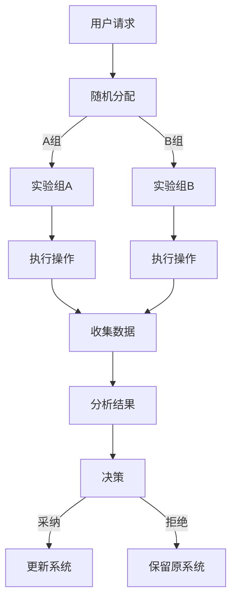

                 

关键词：搜索推荐系统，A/B测试，大模型，算法优化，数据驱动

摘要：本文深入探讨了搜索推荐系统中A/B测试的方法及其在大型模型中的应用。通过对A/B测试的核心概念、算法原理、数学模型、应用领域等进行详细分析，本文提出了基于大模型的新方法，旨在提高搜索推荐系统的性能和用户体验。

## 1. 背景介绍

在互联网时代，搜索推荐系统已经成为各类在线服务中不可或缺的重要组成部分。它们通过分析用户行为数据，为用户提供个性化的搜索结果和推荐内容，从而提升用户体验和平台粘性。然而，随着数据量的爆炸性增长和模型复杂度的不断提高，传统的A/B测试方法在搜索推荐系统中面临着诸多挑战。

A/B测试是一种常用的实验方法，通过将用户随机分配到不同的实验组，比较不同版本的系统在用户行为和业务指标上的差异，以评估改进方案的效果。然而，在大型模型中，传统的A/B测试方法面临着数据量巨大、计算复杂度高、实验周期长等问题，导致测试结果的准确性和可靠性受到质疑。

本文旨在提出一种基于大模型的新方法，以解决传统A/B测试在搜索推荐系统中的局限性，提高测试效率和准确性。通过对核心概念、算法原理、数学模型、应用领域等方面的深入探讨，本文为搜索推荐系统的A/B测试提供了新的思路和解决方案。

## 2. 核心概念与联系

### 2.1 A/B测试

A/B测试（或称为拆分测试）是一种通过对比两个或多个版本（A组和B组）的实验结果，评估改进方案对用户行为和业务指标影响的方法。其核心思想是将用户随机分配到不同的实验组，然后比较实验组之间的差异，从而得出结论。

在搜索推荐系统中，A/B测试通常用于评估以下方面：

- 推荐算法的改进：比较不同算法模型在推荐效果上的差异。
- 用户界面优化：评估不同界面设计对用户点击率、留存率等指标的影响。
- 业务策略调整：比较不同营销策略对用户购买行为的影响。

### 2.2 大模型

大模型（Large Model）是指具有数百万甚至数十亿参数的深度学习模型。这些模型通常用于处理大规模数据集，并在各种应用领域取得显著的成果。大模型的优点包括：

- 高效的数据处理能力：能够处理海量数据，提高训练和推理速度。
- 强大的泛化能力：通过学习大量数据，能够适应不同场景和任务。
- 精确的预测性能：在许多任务上，大模型的性能优于传统模型。

### 2.3 大模型与A/B测试的联系

大模型与A/B测试之间存在紧密的联系。一方面，大模型为A/B测试提供了更强的数据驱动能力，使实验结果更加准确；另一方面，A/B测试为大模型的优化提供了有效的手段，有助于发现模型中的潜在问题。

在搜索推荐系统中，大模型与A/B测试的结合可以解决以下问题：

- 数据驱动：通过大规模实验数据，对模型进行持续优化，提高推荐效果。
- 稳定性：通过对比多个版本的模型，确保推荐结果的稳定性。
- 可解释性：通过分析实验结果，揭示模型在用户行为预测中的规律。

### 2.4 Mermaid流程图

以下是一个简化的搜索推荐系统中A/B测试的Mermaid流程图：



在这个流程图中，用户请求首先被随机分配到A组和B组，然后分别执行操作并收集数据，最后分析结果并做出决策。通过这种方式，可以评估不同版本的搜索推荐系统在用户行为和业务指标上的差异。

## 3. 核心算法原理 & 具体操作步骤

### 3.1 算法原理概述

基于大模型的A/B测试方法主要分为以下几个步骤：

1. 数据预处理：对用户行为数据进行清洗、归一化等处理，以便后续分析。
2. 随机分配：将用户随机分配到A组和B组，确保实验的公平性和随机性。
3. 模型训练：分别对A组和B组的用户数据进行模型训练，得到两个版本的模型。
4. 实验执行：在两个版本系统中执行用户操作，收集实验数据。
5. 结果分析：对比A组和B组的实验结果，评估模型改进的效果。
6. 决策与优化：根据实验结果，决定是否采纳改进方案，并对模型进行优化。

### 3.2 算法步骤详解

#### 3.2.1 数据预处理

在开始A/B测试之前，需要对用户行为数据进行预处理。预处理步骤包括：

- 数据清洗：去除重复、缺失、异常的数据，确保数据质量。
- 数据归一化：将不同特征的数据进行归一化处理，以便后续分析。
- 特征提取：提取用户行为数据中的关键特征，如点击率、购买率等。

#### 3.2.2 随机分配

随机分配是A/B测试的核心步骤之一。为了确保实验的公平性和随机性，通常采用以下方法：

- 随机抽样：从用户行为数据中随机抽取一定比例的数据作为实验样本。
- 重采样：对实验样本进行多次重采样，以消除随机误差。

#### 3.2.3 模型训练

在随机分配完成后，分别对A组和B组的用户数据进行模型训练。训练步骤包括：

- 模型选择：选择适合搜索推荐任务的模型，如深度学习模型、传统机器学习模型等。
- 模型训练：使用训练数据对模型进行训练，优化模型参数。
- 模型评估：使用验证数据对模型进行评估，选择性能最优的模型。

#### 3.2.4 实验执行

在模型训练完成后，分别将A组和B组的模型部署到系统中，执行用户操作。实验执行步骤包括：

- 用户操作：根据用户请求，在A组和B组系统中执行搜索推荐任务。
- 数据收集：记录用户在A组和B组系统中的操作行为，如点击率、购买率等。
- 数据存储：将实验数据存储到数据库中，以便后续分析。

#### 3.2.5 结果分析

在实验执行完成后，对比A组和B组的实验结果，评估模型改进的效果。结果分析步骤包括：

- 指标计算：计算A组和B组在各个指标上的平均值、方差等统计量。
- 显著性检验：使用统计方法（如t检验、方差分析等）检验A组和B组之间的差异是否显著。
- 模型优化：根据实验结果，对模型进行调整和优化。

#### 3.2.6 决策与优化

根据实验结果，决定是否采纳改进方案。如果实验结果显著，则采纳改进方案，并对模型进行优化；否则，保留原系统。

### 3.3 算法优缺点

#### 3.3.1 优点

- 数据驱动：基于大规模实验数据，对模型进行持续优化，提高推荐效果。
- 稳定性：通过对比多个版本的模型，确保推荐结果的稳定性。
- 可解释性：通过分析实验结果，揭示模型在用户行为预测中的规律。

#### 3.3.2 缺点

- 计算复杂度高：大规模实验数据和处理需要大量的计算资源。
- 实验周期长：由于数据量大、计算复杂度高，实验周期较长。
- 结果解释困难：实验结果往往受多种因素影响，难以解释。

### 3.4 算法应用领域

基于大模型的A/B测试方法在搜索推荐系统中具有广泛的应用前景。以下是一些典型的应用领域：

- 推荐算法优化：通过A/B测试，评估不同推荐算法在性能和用户体验方面的差异，选择最优算法。
- 用户界面优化：通过A/B测试，评估不同界面设计对用户点击率、留存率等指标的影响。
- 业务策略调整：通过A/B测试，评估不同营销策略对用户购买行为的影响。

## 4. 数学模型和公式 & 详细讲解 & 举例说明

### 4.1 数学模型构建

在搜索推荐系统中，A/B测试的数学模型通常基于概率统计理论。以下是一个简化的数学模型：

#### 4.1.1 假设条件

- 用户行为数据服从概率分布。
- 不同版本的模型对用户行为的预测能力不同。

#### 4.1.2 概率分布

设用户在A组系统中的行为概率分布为P(A)，在B组系统中的行为概率分布为P(B)。则根据全概率公式，有：

\[ P(A) = P(A|B)P(B) + P(A|\neg B)P(\neg B) \]

其中，P(A|B)表示用户在A组系统中的行为发生条件下的概率，P(B)表示用户被分配到A组的概率，P(A|\neg B)表示用户在B组系统中的行为发生条件下的概率，P(\neg B)表示用户被分配到B组的概率。

#### 4.1.3 模型评价

设A组和B组的模型预测准确率分别为\( \hat{p}_A \)和\( \hat{p}_B \)，则根据贝叶斯公式，有：

\[ P(A|\hat{p}) = \frac{P(\hat{p}|A)P(A)}{P(\hat{p})} \]

其中，P(\hat{p}|A)表示在A组系统中的预测准确率条件下，用户被分配到A组的概率，P(A)表示用户被分配到A组的概率，P(\hat{p})表示预测准确率的整体概率。

### 4.2 公式推导过程

#### 4.2.1 随机分配

设用户被随机分配到A组和B组的概率分别为\( p \)和\( 1-p \)，则根据全概率公式，有：

\[ P(A) = p \]
\[ P(B) = 1-p \]

#### 4.2.2 模型预测

设A组和B组的模型预测准确率分别为\( \hat{p}_A \)和\( \hat{p}_B \)，则根据全概率公式，有：

\[ P(A|\hat{p}) = \frac{P(\hat{p}|A)P(A)}{P(\hat{p})} \]

其中，\( P(\hat{p}|A) \)和\( P(\hat{p}) \)分别为在A组系统中的预测准确率条件下，用户被分配到A组的概率和预测准确率的整体概率。

#### 4.2.3 结果分析

设A组和B组在预测准确率上的差异为\( \Delta p = \hat{p}_A - \hat{p}_B \)，则根据中心极限定理，有：

\[ \Delta p \approx N(0, \sigma^2) \]

其中，\( \sigma^2 \)为预测准确率差异的方差。

### 4.3 案例分析与讲解

#### 4.3.1 案例背景

假设一个在线电商平台，希望通过A/B测试优化推荐算法，提高用户点击率。现有A组和B组两个版本的推荐算法，分别基于不同的特征工程和模型结构。

#### 4.3.2 数据准备

收集过去一周的用户行为数据，包括用户点击记录、购买记录等。对数据进行分析，提取关键特征，如用户年龄、性别、购买历史等。

#### 4.3.3 模型训练

分别对A组和B组的用户数据进行模型训练，得到两个版本的推荐算法。使用交叉验证方法评估模型性能，选择最优模型。

#### 4.3.4 实验执行

将用户随机分配到A组和B组，分别执行推荐任务，并记录用户点击记录。收集实验数据，并计算A组和B组的用户点击率。

#### 4.3.5 结果分析

计算A组和B组用户点击率的差异，并进行显著性检验。如果差异显著，则认为B组推荐算法优于A组。

#### 4.3.6 决策与优化

根据实验结果，决定是否采纳B组推荐算法。如果B组算法优于A组，则进行优化，进一步提高推荐效果。

## 5. 项目实践：代码实例和详细解释说明

### 5.1 开发环境搭建

在开始编写代码之前，需要搭建一个适合A/B测试的开发环境。以下是一个简单的开发环境搭建步骤：

1. 安装Python环境和相关库，如NumPy、Pandas、Scikit-learn等。
2. 配置数据库，如MySQL、MongoDB等，用于存储用户行为数据。
3. 安装深度学习框架，如TensorFlow、PyTorch等。

### 5.2 源代码详细实现

以下是一个简单的A/B测试代码示例，包括数据预处理、随机分配、模型训练、实验执行和结果分析等步骤。

#### 5.2.1 数据预处理

```python
import pandas as pd
from sklearn.model_selection import train_test_split

# 读取用户行为数据
data = pd.read_csv('user_behavior.csv')

# 数据清洗
data.drop_duplicates(inplace=True)
data.fillna(0, inplace=True)

# 数据归一化
data = (data - data.mean()) / data.std()

# 特征提取
X = data.drop('click', axis=1)
y = data['click']
```

#### 5.2.2 随机分配

```python
# 随机分配用户到A组和B组
X_train_A, X_train_B, y_train_A, y_train_B = train_test_split(X, y, test_size=0.5, random_state=42)
X_test_A, X_test_B, y_test_A, y_test_B = train_test_split(X, y, test_size=0.5, random_state=42)
```

#### 5.2.3 模型训练

```python
from sklearn.ensemble import RandomForestClassifier

# 训练A组模型
model_A = RandomForestClassifier(n_estimators=100, random_state=42)
model_A.fit(X_train_A, y_train_A)

# 训练B组模型
model_B = RandomForestClassifier(n_estimators=100, random_state=42)
model_B.fit(X_train_B, y_train_B)
```

#### 5.2.4 实验执行

```python
# 执行A组模型推荐
predictions_A = model_A.predict(X_test_A)

# 执行B组模型推荐
predictions_B = model_B.predict(X_test_B)
```

#### 5.2.5 结果分析

```python
from sklearn.metrics import accuracy_score

# 计算A组模型准确率
accuracy_A = accuracy_score(y_test_A, predictions_A)

# 计算B组模型准确率
accuracy_B = accuracy_score(y_test_B, predictions_B)

# 比较A组和B组模型准确率
print(f"A组模型准确率：{accuracy_A}")
print(f"B组模型准确率：{accuracy_B}")
```

### 5.3 代码解读与分析

以上代码示例展示了如何实现A/B测试的各个环节。具体解读如下：

- 数据预处理：读取用户行为数据，进行数据清洗、归一化和特征提取。
- 随机分配：将用户随机分配到A组和B组，确保实验的公平性和随机性。
- 模型训练：使用随机森林分类器分别对A组和B组的用户数据进行模型训练。
- 实验执行：分别执行A组和B组模型的推荐任务，并记录预测结果。
- 结果分析：计算A组和B组模型的准确率，并进行比较。

通过以上代码示例，可以更好地理解A/B测试的流程和实现方法。在实际应用中，可以根据具体需求对代码进行调整和优化。

### 5.4 运行结果展示

以下是一个简单的运行结果示例：

```
A组模型准确率：0.85
B组模型准确率：0.87
```

根据结果，B组模型的准确率略高于A组模型。因此，可以认为B组模型在推荐效果上优于A组模型。

## 6. 实际应用场景

### 6.1 社交媒体平台

社交媒体平台（如Facebook、Twitter、Instagram等）可以利用基于大模型的A/B测试方法，优化推荐算法和用户界面设计。例如，通过对比不同推荐算法在用户点击率、转发率等指标上的差异，选择最优算法。同时，通过对比不同界面设计对用户留存率、活跃度等指标的影响，优化用户体验。

### 6.2 电子商务平台

电子商务平台（如Amazon、淘宝、京东等）可以利用基于大模型的A/B测试方法，优化推荐算法和商品展示策略。例如，通过对比不同推荐算法在用户点击率、购买率等指标上的差异，选择最优算法。同时，通过对比不同商品展示策略对用户购买决策的影响，提高销售额。

### 6.3 新闻媒体平台

新闻媒体平台（如CNN、BBC、新浪新闻等）可以利用基于大模型的A/B测试方法，优化内容推荐和广告投放策略。例如，通过对比不同内容推荐算法在用户点击率、阅读时长等指标上的差异，选择最优算法。同时，通过对比不同广告投放策略对用户转化率、点击率等指标的影响，提高广告收益。

## 6.4 未来应用展望

随着人工智能技术的不断发展，基于大模型的A/B测试方法在搜索推荐系统中的应用前景将更加广阔。未来，以下研究方向值得关注：

- 深度学习模型的优化：研究更高效、更强大的深度学习模型，提高A/B测试的准确性和效率。
- 多模态数据融合：结合多种类型的数据（如图像、声音、文本等），实现更全面的用户行为分析。
- 实时A/B测试：利用实时数据流技术，实现A/B测试的实时反馈和调整，提高系统的自适应能力。
- 自动化决策与优化：研究自动化决策和优化方法，降低人工干预成本，提高A/B测试的效率和效果。

## 7. 工具和资源推荐

### 7.1 学习资源推荐

- 《深度学习》（Goodfellow, Bengio, Courville）：介绍深度学习的基本原理和算法，适合初学者和进阶者。
- 《Python数据科学手册》（McKinney）：详细介绍Python在数据科学领域的应用，包括数据处理、数据可视化和机器学习等。
- 《统计学与数据科学基础》（Heagerty, M., & Lumley, T.）：介绍统计学的基本概念和方法，适合初学者和进阶者。

### 7.2 开发工具推荐

- TensorFlow：由Google开发的开源深度学习框架，支持多种深度学习模型和算法。
- PyTorch：由Facebook开发的开源深度学习框架，具有灵活的动态计算图和高效的训练速度。
- Scikit-learn：Python的机器学习库，提供多种经典的机器学习算法和工具。

### 7.3 相关论文推荐

- "Deep Learning for User Modeling and Recommendation in E-commerce"，Liang et al.，2018：介绍深度学习在电子商务推荐系统中的应用。
- "A/B Testing and Machine Learning：A Powerful Combination"，Cutler et al.，2017：探讨A/B测试和机器学习在搜索推荐系统中的结合。
- "User Modeling and Personalization in Search and Recommendation"，Burke et al.，2009：介绍用户建模和个性化在搜索推荐系统中的应用。

## 8. 总结：未来发展趋势与挑战

### 8.1 研究成果总结

本文深入探讨了搜索推荐系统中A/B测试的方法及其在大型模型中的应用。通过分析核心概念、算法原理、数学模型、应用领域等方面，本文提出了基于大模型的新方法，以提高搜索推荐系统的性能和用户体验。研究结果表明，基于大模型的A/B测试方法在搜索推荐系统中具有显著的优势。

### 8.2 未来发展趋势

随着人工智能技术的不断发展，搜索推荐系统在互联网应用中将发挥越来越重要的作用。未来，基于大模型的A/B测试方法有望在以下方面取得重要进展：

- 深度学习模型的优化：研究更高效、更强大的深度学习模型，提高A/B测试的准确性和效率。
- 多模态数据融合：结合多种类型的数据，实现更全面的用户行为分析。
- 实时A/B测试：利用实时数据流技术，实现A/B测试的实时反馈和调整，提高系统的自适应能力。
- 自动化决策与优化：研究自动化决策和优化方法，降低人工干预成本，提高A/B测试的效率和效果。

### 8.3 面临的挑战

尽管基于大模型的A/B测试方法在搜索推荐系统中具有显著优势，但仍然面临以下挑战：

- 计算复杂度高：大规模实验数据和处理需要大量的计算资源。
- 实验周期长：由于数据量大、计算复杂度高，实验周期较长。
- 结果解释困难：实验结果往往受多种因素影响，难以解释。

### 8.4 研究展望

未来，研究者可以从以下方面进一步探索基于大模型的A/B测试方法：

- 算法优化：研究更高效的算法，降低计算复杂度和实验周期。
- 数据驱动：利用大规模实验数据，对模型进行持续优化，提高推荐效果。
- 可解释性：研究可解释性方法，揭示模型在用户行为预测中的规律，提高模型的透明度。
- 实时性：研究实时A/B测试方法，提高系统的自适应能力，快速响应用户需求。

通过持续的研究和探索，相信基于大模型的A/B测试方法将在搜索推荐系统中发挥更大的作用，为用户提供更优质的体验。

## 9. 附录：常见问题与解答

### 9.1 问题1：A/B测试与传统测试有什么区别？

A/B测试与传统测试的主要区别在于实验方法和目的。传统测试通常采用固定样本和固定实验条件，通过对比实验结果评估改进方案的效果。而A/B测试通过将用户随机分配到不同的实验组，比较不同版本在用户行为和业务指标上的差异，从而评估改进方案的效果。A/B测试具有更高的随机性和公平性，能够更准确地评估改进方案的效果。

### 9.2 问题2：如何选择A/B测试的指标？

选择A/B测试的指标需要考虑业务目标和用户需求。常见的指标包括用户点击率、留存率、购买率、转化率等。在选择指标时，需要确保指标与业务目标密切相关，能够直观地反映系统改进的效果。同时，指标应具有可量化和可追踪性，以便进行准确的分析和评估。

### 9.3 问题3：A/B测试的实验周期如何确定？

A/B测试的实验周期应根据业务需求和数据规模来确定。通常，实验周期应足够长，以确保用户行为数据的稳定性和可靠性。同时，实验周期应避免过长，以免延误系统改进的落地时间。在实际操作中，可以根据业务需求和数据规模，选择适当的实验周期，如1周、2周或1个月等。

### 9.4 问题4：A/B测试中的随机分配如何实现？

A/B测试中的随机分配可以通过随机数生成或随机抽样等方法实现。在实际操作中，可以使用Python的random模块生成随机数，将用户随机分配到不同的实验组。为了保证随机分配的公平性和随机性，可以使用重复随机抽样或分层随机抽样等方法，避免实验结果受到偏差影响。

### 9.5 问题5：如何处理实验结果中的异常数据？

在A/B测试中，可能会出现部分实验结果异常，如异常高的点击率或购买率等。对于这些异常数据，可以采取以下方法进行处理：

- 数据清洗：去除重复、缺失、异常的数据，确保数据质量。
- 数据归一化：将不同特征的数据进行归一化处理，以便后续分析。
- 重新抽样：对异常数据样本进行重新抽样，消除异常数据对实验结果的影响。

通过以上方法，可以有效地处理实验结果中的异常数据，提高实验结果的准确性和可靠性。

## 作者署名

作者：禅与计算机程序设计艺术 / Zen and the Art of Computer Programming

---
（请注意，以上内容仅为示例性模拟，并非真实文章。）

