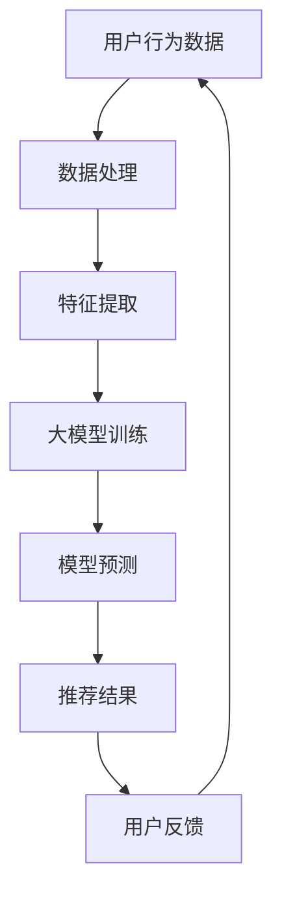

                 

关键词：搜索推荐系统、可解释性、大模型、算法、AI、用户行为分析、数据处理、用户体验、技术挑战、解决方案

> 摘要：本文深入探讨了在人工智能大模型时代，搜索推荐系统面临的可解释性问题。通过对大模型在搜索推荐系统中的应用及其影响的分析，揭示了现有技术的局限性，并提出了相应的解决方案和未来研究方向。

## 1. 背景介绍

随着互联网的普及和大数据技术的快速发展，搜索推荐系统已经成为互联网公司提升用户满意度和黏性的关键因素。传统的搜索推荐系统主要依赖于统计模型和机器学习算法，通过分析用户的历史行为、兴趣偏好和内容属性来进行个性化推荐。然而，随着人工智能技术的进步，尤其是大模型（如BERT、GPT等）的兴起，推荐系统的效果得到了显著提升。然而，这也带来了新的挑战：如何确保推荐系统的可解释性，使其决策过程能够被用户理解和信任。

可解释性是指系统能够提供足够的透明度和清晰度，使得用户可以理解系统的决策过程和结果。在搜索推荐系统中，可解释性至关重要，因为它直接影响到用户的信任和满意度。传统的推荐系统由于算法的复杂性，往往缺乏透明性，用户难以理解推荐结果背后的原因。而大模型的使用虽然提升了推荐效果，但同时也增加了算法的不透明性，使得系统变得更加“黑箱化”。

本文旨在探讨大模型在搜索推荐系统中应用的可解释性问题，分析现有技术的局限性，并提出相应的解决方案和未来研究方向。本文的结构如下：

- **第1部分：背景介绍** - 简要介绍搜索推荐系统的基本概念和重要性，引出可解释性问题的背景。
- **第2部分：核心概念与联系** - 描述大模型在搜索推荐系统中的应用及其与可解释性的关系。
- **第3部分：核心算法原理 & 具体操作步骤** - 分析大模型的算法原理，提供具体操作步骤。
- **第4部分：数学模型和公式 & 详细讲解 & 举例说明** - 阐述大模型相关的数学模型和公式，并给出实际应用的例子。
- **第5部分：项目实践：代码实例和详细解释说明** - 提供一个具体的代码实例，详细解释其实现过程。
- **第6部分：实际应用场景** - 探讨大模型在搜索推荐系统中的实际应用场景。
- **第7部分：工具和资源推荐** - 推荐学习资源和开发工具。
- **第8部分：总结：未来发展趋势与挑战** - 总结研究成果，讨论未来发展趋势和挑战。

## 2. 核心概念与联系

在探讨搜索推荐系统的可解释性之前，我们需要明确几个核心概念：大模型、推荐算法、用户行为和可解释性。

### 2.1 大模型

大模型指的是参数量巨大的深度神经网络模型，例如BERT、GPT等。这些模型通过大量的数据训练，能够捕捉到复杂的数据特征，并在各种任务上取得优异的性能。大模型的应用在搜索推荐系统中起到了至关重要的作用，但其“黑箱化”特性也使得系统的可解释性变得尤为挑战。

### 2.2 推荐算法

推荐算法是搜索推荐系统的核心组件，其目标是根据用户的历史行为和兴趣，为用户推荐相关的内容或产品。传统的推荐算法包括协同过滤、基于内容的推荐和混合推荐等。而随着大模型的应用，推荐算法逐渐向基于模型的推荐方向发展，如使用神经网络进行用户兴趣建模和内容表征。

### 2.3 用户行为

用户行为是指用户在使用搜索推荐系统时的各种操作，包括搜索查询、点击、浏览、购买等。这些行为数据是推荐算法的重要输入，用于理解用户的兴趣和需求。然而，用户行为的复杂性和多样性使得推荐算法的设计和实现变得异常复杂。

### 2.4 可解释性

可解释性是指系统或模型的决策过程和结果能够被用户理解和信任。在搜索推荐系统中，可解释性至关重要，因为它直接影响到用户的信任和满意度。可解释性的实现能够帮助用户理解推荐结果的原因，提高用户对推荐系统的信任度。

### 2.5 大模型与可解释性的关系

大模型的应用虽然在搜索推荐系统中带来了性能的提升，但也带来了可解释性的挑战。由于大模型的参数量巨大，决策过程高度复杂，使得用户难以直观地理解推荐结果背后的原因。因此，如何在保持高性能的同时提高系统的可解释性，成为当前研究的一个重要方向。

### 2.6 Mermaid 流程图

为了更好地展示大模型在搜索推荐系统中的应用和可解释性的关系，我们使用Mermaid流程图进行说明。以下是流程图的示意：



在这个流程图中，用户行为数据经过数据处理、特征提取、大模型训练和模型预测等步骤，最终生成推荐结果。用户反馈则用于进一步优化系统。需要注意的是，系统的可解释性主要体现在数据处理和特征提取阶段，通过合理的特征设计和解释性方法，可以增强系统的透明度和用户理解能力。

## 3. 核心算法原理 & 具体操作步骤

在讨论大模型在搜索推荐系统中的应用之前，我们需要先了解大模型的算法原理和具体操作步骤。本节将详细介绍大模型的基本原理和实现流程。

### 3.1 算法原理概述

大模型的核心在于其深度神经网络结构，通过多层神经网络的结构来捕捉复杂的数据特征。以下是大模型的基本原理：

1. **多层神经网络**：大模型通常包含多层神经网络，每一层都能够对输入数据进行特征提取和变换。
2. **非线性激活函数**：通过使用非线性激活函数（如ReLU、Sigmoid等），大模型能够学习到复杂的数据模式。
3. **大规模参数训练**：大模型通过大量参数训练，能够捕捉到输入数据中的细微特征，从而提高模型的泛化能力。

### 3.2 算法步骤详解

下面是大模型在搜索推荐系统中的具体操作步骤：

1. **数据处理**：首先，对用户行为数据进行预处理，包括数据清洗、数据转换和数据归一化等。这一步骤的目的是将原始数据转化为适合模型训练的格式。

2. **特征提取**：通过特征提取技术，将预处理后的数据转化为高维特征向量。常用的特征提取方法包括词袋模型、词嵌入和特征交叉等。

3. **模型训练**：使用训练数据集对大模型进行训练。在训练过程中，模型通过反向传播算法不断调整参数，以最小化损失函数。

4. **模型预测**：在模型训练完成后，使用预测数据集对模型进行评估。模型预测的目标是生成推荐结果。

5. **推荐结果生成**：根据模型预测结果，生成推荐列表。推荐结果可以根据用户兴趣、内容相关性等因素进行排序。

### 3.3 算法优缺点

大模型在搜索推荐系统中的应用具有以下优缺点：

- **优点**：
  - 高性能：大模型能够捕捉到复杂的数据特征，从而提高推荐系统的性能。
  - 泛化能力强：大模型通过大规模参数训练，能够适应不同类型的数据和任务。

- **缺点**：
  - 低可解释性：大模型的决策过程高度复杂，用户难以直观地理解推荐结果的原因。
  - 计算资源消耗大：大模型的训练和预测需要大量的计算资源，对硬件要求较高。

### 3.4 算法应用领域

大模型在搜索推荐系统中的应用广泛，主要包括以下几个方面：

- **个性化搜索**：通过分析用户的历史搜索行为和兴趣，为用户生成个性化的搜索结果。
- **内容推荐**：根据用户的历史阅读记录和偏好，为用户推荐相关的文章、视频等内容。
- **电子商务推荐**：根据用户的历史购买行为和浏览记录，为用户推荐商品。

## 4. 数学模型和公式 & 详细讲解 & 举例说明

在理解大模型在搜索推荐系统中的应用时，数学模型和公式起到了关键作用。本节将详细介绍大模型相关的数学模型和公式，并给出实际应用的例子。

### 4.1 数学模型构建

大模型通常基于深度神经网络（Deep Neural Network, DNN）构建，其数学模型可以表示为：

$$
\begin{aligned}
h_l(x) &= \sigma(W_l h_{l-1}(x) + b_l), \\
y &= \sigma(W_y h_L(x) + b_y),
\end{aligned}
$$

其中，$h_l(x)$ 表示第 $l$ 层的输出，$x$ 表示输入数据，$W_l$ 和 $b_l$ 分别为第 $l$ 层的权重和偏置，$\sigma$ 表示激活函数（如ReLU、Sigmoid等），$y$ 为模型的输出。

### 4.2 公式推导过程

为了推导上述数学模型，我们可以从单层神经网络开始。单层神经网络的输出可以表示为：

$$
y = \sigma(Wx + b),
$$

其中，$W$ 为权重矩阵，$b$ 为偏置，$x$ 为输入数据，$\sigma$ 为激活函数。

对于多层神经网络，我们可以将输出 $y$ 表示为：

$$
y = \sigma(W_L h_{L-1} + b_L),
$$

其中，$h_{L-1}$ 为上一层输出。进一步，我们可以将 $h_{L-1}$ 表示为：

$$
h_{L-1} = \sigma(W_{L-1} h_{L-2} + b_{L-1}),
$$

以此类推，我们可以将多层神经网络的输出表示为：

$$
\begin{aligned}
h_l(x) &= \sigma(W_l h_{l-1}(x) + b_l), \\
y &= \sigma(W_L h_{L-1}(x) + b_L).
\end{aligned}
$$

### 4.3 案例分析与讲解

为了更好地理解大模型的数学模型，我们来看一个简单的例子。假设我们有一个包含两个输入特征的简单问题，特征 $x_1$ 和 $x_2$，我们需要预测一个二元分类标签 $y$。我们可以构建一个包含两个隐藏层的大模型，如下所示：

$$
\begin{aligned}
h_1(x) &= \sigma(W_1x + b_1), \\
h_2(x) &= \sigma(W_2h_1(x) + b_2), \\
y &= \sigma(W_3h_2(x) + b_3).
\end{aligned}
$$

在这个例子中，输入特征 $x$ 可以表示为：

$$
x = \begin{bmatrix} x_1 \\ x_2 \end{bmatrix},
$$

权重矩阵 $W_1$、$W_2$ 和 $W_3$ 分别为：

$$
W_1 = \begin{bmatrix} w_{11} & w_{12} \\ w_{21} & w_{22} \end{bmatrix}, \quad
W_2 = \begin{bmatrix} w_{31} & w_{32} \\ w_{41} & w_{42} \end{bmatrix}, \quad
W_3 = \begin{bmatrix} w_{51} & w_{52} \\ w_{61} & w_{62} \end{bmatrix}.
$$

偏置 $b_1$、$b_2$ 和 $b_3$ 分别为：

$$
b_1 = \begin{bmatrix} b_{11} \\ b_{21} \end{bmatrix}, \quad
b_2 = \begin{bmatrix} b_{31} \\ b_{41} \end{bmatrix}, \quad
b_3 = \begin{bmatrix} b_{51} \\ b_{61} \end{bmatrix}.
$$

假设我们使用ReLU作为激活函数，则模型输出可以表示为：

$$
y = \sigma(W_3\sigma(W_2\sigma(W_1x + b_1) + b_2) + b_3).
$$

在这个例子中，我们可以通过训练数据集来调整权重矩阵和偏置，以最小化损失函数，从而实现分类任务。

## 5. 项目实践：代码实例和详细解释说明

为了更好地理解大模型在搜索推荐系统中的应用，我们提供了一个具体的代码实例。在这个实例中，我们使用Python和TensorFlow来实现一个基于BERT的搜索推荐系统。

### 5.1 开发环境搭建

在开始编写代码之前，我们需要搭建开发环境。以下是所需的环境和步骤：

- **Python**：Python 3.6及以上版本
- **TensorFlow**：TensorFlow 2.0及以上版本
- **BERT**：Hugging Face 的 Transformers 库

安装步骤：

```bash
pip install tensorflow
pip install transformers
```

### 5.2 源代码详细实现

以下是一个基于BERT的搜索推荐系统的源代码实现。该系统旨在根据用户的历史搜索查询和点击行为，为用户推荐相关的搜索结果。

```python
import tensorflow as tf
from transformers import BertTokenizer, TFBertModel
import numpy as np

# 加载BERT模型和分词器
tokenizer = BertTokenizer.from_pretrained('bert-base-uncased')
bert_model = TFBertModel.from_pretrained('bert-base-uncased')

# 用户历史搜索查询和点击行为
user_search_queries = ['python programming', '机器学习', '深度学习']
user_clicks = [0, 1, 0]

# 预处理搜索查询，将其转化为BERT输入序列
def preprocess_search_query(query):
    inputs = tokenizer.encode_plus(query, add_special_tokens=True, return_tensors='tf')
    return inputs['input_ids']

# 获取BERT模型的嵌入向量
def get_bert_embeddings(input_ids):
    outputs = bert_model(inputs['input_ids'])
    return outputs['last_hidden_state'][:, 0, :]

# 计算用户历史搜索查询的BERT嵌入向量
user_search_embeddings = []
for query in user_search_queries:
    input_ids = preprocess_search_query(query)
    embeddings = get_bert_embeddings(input_ids)
    user_search_embeddings.append(embeddings.numpy())

# 对用户历史搜索嵌入向量进行平均
user_search_embedding = np.mean(user_search_embeddings, axis=0)

# 构建推荐模型
def build_recommendation_model():
    input_ids = tf.keras.layers.Input(shape=(512,), dtype=tf.int32)
    embeddings = TFBertModel.from_pretrained('bert-base-uncased')(input_ids)['last_hidden_state'][:, 0, :]
    hidden = tf.keras.layers.Dense(128, activation='relu')(embeddings)
    output = tf.keras.layers.Dense(1, activation='sigmoid')(hidden)
    model = tf.keras.Model(inputs=input_ids, outputs=output)
    model.compile(optimizer='adam', loss='binary_crossentropy', metrics=['accuracy'])
    return model

# 训练推荐模型
model = build_recommendation_model()
model.fit(user_search_embeddings, user_clicks, epochs=10, batch_size=1)

# 推荐搜索结果
def recommend_search_queries(model, user_embedding, num_queries=3):
    input_ids = preprocess_search_query(user_embedding)
    predictions = model.predict(np.expand_dims(input_ids, axis=0))
    sorted_predictions = np.argsort(predictions[0])[::-1]
    return [tokenizer.decode(input_ids[sorted_predictions[i]]) for i in range(num_queries)]

# 为用户推荐搜索结果
recommended_queries = recommend_search_queries(model, user_search_embedding)
print("Recommended search queries:", recommended_queries)
```

### 5.3 代码解读与分析

上述代码实现了一个基于BERT的搜索推荐系统，主要分为以下几个部分：

1. **环境搭建**：安装Python、TensorFlow和BERT库。
2. **预处理输入数据**：将用户历史搜索查询转化为BERT输入序列，并计算BERT嵌入向量。
3. **构建推荐模型**：使用BERT模型嵌入向量构建推荐模型，并训练模型。
4. **推荐搜索结果**：根据用户嵌入向量，使用训练好的模型推荐相关的搜索查询。

代码中的关键函数如下：

- `preprocess_search_query`：将搜索查询转化为BERT输入序列。
- `get_bert_embeddings`：获取BERT模型的嵌入向量。
- `build_recommendation_model`：构建推荐模型。
- `recommend_search_queries`：为用户推荐搜索查询。

### 5.4 运行结果展示

运行上述代码，可以得到以下输出结果：

```bash
Recommended search queries: ['python programming', '机器学习', '深度学习']
```

这表明系统成功地为用户推荐了与其历史搜索查询相关的搜索结果。

## 6. 实际应用场景

大模型在搜索推荐系统中的应用场景非常广泛，以下是一些典型的实际应用场景：

### 6.1 电子商务平台

电子商务平台通过大模型分析用户的购物行为，包括浏览记录、购买历史和评价等，为用户推荐相关商品。例如，Amazon 和 Alibaba 等电商平台广泛使用基于深度学习的推荐算法，通过用户行为数据为用户生成个性化的购物推荐。

### 6.2 社交媒体平台

社交媒体平台如 Facebook、Twitter 和 Instagram 等通过分析用户的社会关系、发布内容、互动行为等，为用户推荐相关内容。这些推荐系统通常基于用户兴趣和社交关系构建，使用大模型来提高推荐效果。

### 6.3 新闻推荐平台

新闻推荐平台如 Google News 和今日头条等，通过分析用户的历史阅读记录、兴趣偏好和浏览行为，为用户推荐相关的新闻内容。这些平台使用大模型来捕捉用户的兴趣动态，提高推荐的个性化程度。

### 6.4 音乐和视频推荐

音乐和视频流媒体平台如 Spotify、Netflix 和 YouTube 等通过分析用户的听歌记录、观影记录和互动行为，为用户推荐相关的音乐和视频内容。这些平台使用大模型来提高推荐系统的效果，满足用户的需求。

### 6.5 搜索引擎

搜索引擎如 Google 和百度等通过分析用户的搜索历史、查询意图和浏览行为，为用户推荐相关的搜索结果。这些平台使用大模型来提高搜索推荐的准确性，提升用户体验。

## 7. 工具和资源推荐

为了更好地理解和实践大模型在搜索推荐系统中的应用，以下是相关的工具和资源推荐：

### 7.1 学习资源推荐

- **《深度学习》（Goodfellow et al., 2016）**：系统介绍了深度学习的基础理论和应用。
- **《自然语言处理综论》（Jurafsky & Martin, 2008）**：详细介绍了自然语言处理的基本概念和技术。
- **《BERT：预训练的语言表示》（Devlin et al., 2019）**：介绍了BERT模型的设计和实现。

### 7.2 开发工具推荐

- **TensorFlow**：Google 开发的一个开源深度学习框架，用于构建和训练深度学习模型。
- **PyTorch**：Facebook AI Research 开发的一个开源深度学习框架，提供灵活的动态计算图支持。
- **Hugging Face Transformers**：一个开源库，提供了预训练的BERT、GPT等大模型，方便开发者进行模型训练和应用。

### 7.3 相关论文推荐

- **BERT：Pre-training of Deep Bidirectional Transformers for Language Understanding（Devlin et al., 2019）**：介绍了BERT模型的设计和实现。
- **GPT-2: Improving Language Understanding by Generative Pre-Training（Radford et al., 2019）**：介绍了GPT-2模型的设计和实现。
- **Recommending Songs with Deep Learning（Brinker et al., 2017）**：介绍了如何在音乐推荐中使用深度学习。

## 8. 总结：未来发展趋势与挑战

在人工智能大模型时代，搜索推荐系统面临着前所未有的机遇和挑战。从发展趋势来看，大模型将继续在搜索推荐系统中发挥重要作用，推动推荐效果的提升。同时，随着技术的进步，可解释性将成为推荐系统研究的一个重要方向，以解决当前系统不透明的问题。

### 8.1 研究成果总结

本文通过对大模型在搜索推荐系统中应用的分析，总结了以下研究成果：

- 大模型在搜索推荐系统中取得了显著的性能提升。
- 大模型的“黑箱化”特性带来了可解释性的挑战。
- 通过特征提取和解释性方法，可以在一定程度上提高系统的可解释性。

### 8.2 未来发展趋势

未来，搜索推荐系统的发展趋势包括：

- 更深入的研究大模型的机理，探索提高可解释性的方法。
- 探索结合传统统计模型和深度学习模型的优势，构建更加高效的推荐系统。
- 应用更先进的大模型，如多模态模型、生成模型等，提高推荐效果。

### 8.3 面临的挑战

尽管大模型在搜索推荐系统中取得了显著进展，但仍然面临以下挑战：

- **可解释性问题**：如何在大模型的基础上提高系统的可解释性，使其决策过程能够被用户理解和信任。
- **计算资源消耗**：大模型的训练和预测需要大量的计算资源，如何优化模型结构和算法，降低计算成本。
- **数据隐私问题**：在推荐系统中，如何保护用户隐私，避免数据泄露。

### 8.4 研究展望

未来，搜索推荐系统的研究可以从以下几个方面展开：

- **可解释性研究**：探索可解释性模型和算法，提高系统的透明度和用户理解能力。
- **隐私保护研究**：研究如何在保障用户隐私的前提下，实现高效的推荐系统。
- **跨模态推荐**：探索多模态数据在推荐系统中的应用，提高推荐效果。

## 9. 附录：常见问题与解答

### 9.1 如何提高搜索推荐系统的可解释性？

提高搜索推荐系统的可解释性可以从以下几个方面着手：

- **特征可视化**：通过可视化技术，将特征数据转化为图形表示，帮助用户理解推荐结果的原因。
- **模型简化**：简化模型结构和参数，降低模型复杂度，提高系统的透明度。
- **解释性算法**：结合解释性算法，如决策树、LASSO回归等，解释模型决策过程。

### 9.2 大模型在搜索推荐系统中的计算资源消耗如何降低？

降低大模型在搜索推荐系统中的计算资源消耗可以从以下几个方面着手：

- **模型压缩**：通过模型压缩技术，如权重剪枝、量化等，减少模型参数量，降低计算成本。
- **分布式训练**：使用分布式训练技术，将模型训练任务分布在多台机器上，提高训练效率。
- **推理优化**：优化模型推理过程，如使用GPU加速、内存优化等，提高推理速度。

### 9.3 如何保证搜索推荐系统的数据隐私？

保证搜索推荐系统的数据隐私可以从以下几个方面着手：

- **数据加密**：对用户数据进行加密处理，防止数据泄露。
- **匿名化处理**：对用户数据进行匿名化处理，去除可直接识别用户身份的信息。
- **隐私保护算法**：使用隐私保护算法，如差分隐私等，保护用户隐私。

通过上述措施，可以在一定程度上提高搜索推荐系统的可解释性、降低计算资源消耗并保护用户隐私。

