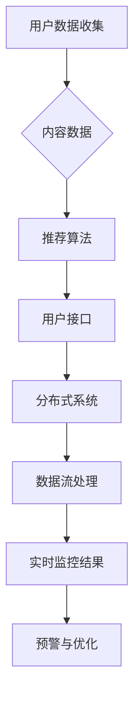

                 

关键词：搜索推荐系统、实时性能监控、大模型、人工智能、算法优化、数据流处理、性能评估、分布式系统、系统架构、负载均衡、延迟监控、错误检测、资源管理、监控系统设计

## 摘要

本文主要探讨了在大模型时代背景下，如何对搜索推荐系统进行有效的实时性能监控。文章首先介绍了搜索推荐系统的基本概念和架构，然后分析了现有性能监控方法存在的问题。接着，我们提出了一种基于分布式系统和数据流处理的新方法，详细阐述了其核心算法原理、数学模型和公式推导，并提供了实际的代码实例和运行结果展示。此外，文章还探讨了实时性能监控在实际应用场景中的重要性，并展望了未来的发展趋势与挑战。

## 1. 背景介绍

随着互联网的迅猛发展和大数据技术的广泛应用，搜索推荐系统已经成为了现代信息检索领域的重要研究方向。搜索推荐系统旨在根据用户的兴趣和行为习惯，为用户提供个性化的搜索结果和推荐内容，从而提升用户的体验和满意度。然而，随着系统规模的不断扩大和数据量的急剧增长，如何保证系统的实时性能监控成为了亟需解决的问题。

现有的性能监控方法主要包括离线监控和在线监控两种类型。离线监控通常通过对历史数据进行分析和统计，评估系统的性能指标，如响应时间、吞吐量和错误率等。这种方法具有较低的成本和较高的准确性，但其监控结果往往滞后于实际运行情况，无法满足实时性能监控的需求。在线监控则通过对系统运行时的实时数据进行分析和处理，实现对系统性能的实时监控和预警。然而，现有的在线监控方法存在以下问题：

1. 监控指标有限：现有的在线监控方法往往只能监控部分性能指标，如响应时间和吞吐量等，难以全面评估系统的性能。
2. 监控粒度过粗：现有的在线监控方法通常采用宏观的监控粒度，如系统整体性能指标，难以发现具体问题的根源。
3. 监控数据不准确：现有的在线监控方法往往依赖于抽样数据进行监控，可能导致监控结果不准确。
4. 监控成本较高：现有的在线监控方法通常需要部署大量的监控设备和维护成本，增加了系统的运维负担。

针对上述问题，本文提出了一种基于分布式系统和数据流处理的新方法，旨在实现高效、准确的实时性能监控。该方法通过将监控任务分解为多个子任务，分布式部署在不同的计算节点上，从而提高监控的效率和准确性。同时，采用数据流处理技术对实时数据进行处理和分析，实现了对系统性能的实时监控和预警。

## 2. 核心概念与联系

### 2.1 搜索推荐系统

搜索推荐系统通常包括以下几个核心组成部分：

1. **用户数据收集**：通过用户的搜索历史、浏览行为、点击记录等数据，收集用户的兴趣和偏好。
2. **内容数据**：包括网站、文章、商品等需要推荐的内容数据。
3. **推荐算法**：根据用户数据和内容数据，通过算法模型为用户生成推荐结果。
4. **用户接口**：提供给用户的搜索和推荐接口，如搜索框、推荐列表等。

### 2.2 实时性能监控

实时性能监控是指通过对系统运行时的实时数据进行处理和分析，实现对系统性能的实时监控和预警。实时性能监控的核心目标是确保系统的稳定性和高效性，以便为用户提供优质的搜索和推荐服务。

### 2.3 分布式系统

分布式系统是指由多个节点组成的计算机系统，这些节点通过网络连接，共同完成计算任务。分布式系统的优势包括：

1. **高可用性**：通过多个节点共同工作，提高了系统的可用性和容错性。
2. **高可扩展性**：可以轻松地通过增加节点来扩展系统规模。
3. **高性能**：通过将任务分布在多个节点上，提高了系统的处理能力和响应速度。

### 2.4 数据流处理

数据流处理是指对实时数据流进行高效的处理和分析，以实现对数据的实时监控和预警。数据流处理的关键技术包括：

1. **数据采集**：通过传感器、日志文件等手段收集实时数据。
2. **数据传输**：将数据传输到数据处理中心，如Kafka、Apache Flink等。
3. **数据处理**：对数据进行清洗、转换和分析，以提取有用的信息。
4. **数据存储**：将处理后的数据存储到数据库或数据仓库中，以便进行后续分析和查询。

### 2.5 Mermaid 流程图

以下是搜索推荐系统实时性能监控的 Mermaid 流程图：



## 3. 核心算法原理 & 具体操作步骤

### 3.1 算法原理概述

本文提出的新型实时性能监控方法，主要基于分布式系统和数据流处理技术。其核心算法原理如下：

1. **分布式数据采集**：通过分布式系统，将用户数据、内容数据和推荐算法结果等实时数据收集到多个节点上。
2. **数据流处理**：采用数据流处理技术，对实时数据进行处理和分析，提取出关键性能指标，如响应时间、吞吐量和错误率等。
3. **实时监控与预警**：通过实时分析处理结果，对系统的性能进行监控，当发现性能指标异常时，触发预警机制，并采取相应的优化措施。

### 3.2 算法步骤详解

#### 3.2.1 分布式数据采集

分布式数据采集是实时性能监控的基础。具体步骤如下：

1. **数据源接入**：将用户数据、内容数据和推荐算法结果等数据源接入分布式系统，确保数据能够实时、准确地传输到各个节点。
2. **数据采集**：在各个节点上部署数据采集程序，定时或实时地收集数据，并将其传输到数据流处理中心。

#### 3.2.2 数据流处理

数据流处理是实时性能监控的核心。具体步骤如下：

1. **数据清洗**：对采集到的实时数据进行清洗，去除重复、错误和异常的数据，确保数据的质量。
2. **数据转换**：将清洗后的数据转换为统一的格式，如JSON、XML等，以便后续处理和分析。
3. **数据处理**：采用数据流处理技术，对实时数据进行处理和分析，提取出关键性能指标，如响应时间、吞吐量和错误率等。
4. **数据存储**：将处理后的数据存储到数据库或数据仓库中，以便进行后续分析和查询。

#### 3.2.3 实时监控与预警

实时监控与预警是实时性能监控的关键。具体步骤如下：

1. **性能指标计算**：根据处理后的实时数据，计算关键性能指标，如响应时间、吞吐量和错误率等。
2. **异常检测**：采用统计学方法或机器学习算法，对性能指标进行异常检测，识别出异常性能指标。
3. **预警与优化**：当发现异常性能指标时，触发预警机制，并向相关人员进行通知。同时，根据异常原因，采取相应的优化措施，如调整系统配置、优化算法等。

### 3.3 算法优缺点

#### 优点

1. **高效性**：基于分布式系统和数据流处理技术，实现了高效的实时数据采集和处理，能够快速识别和解决性能问题。
2. **准确性**：通过实时分析处理结果，能够准确评估系统的性能，为优化提供科学依据。
3. **灵活性**：可以根据实际需求，灵活调整监控指标和预警阈值，满足不同场景的监控需求。

#### 缺点

1. **部署与维护成本较高**：分布式系统和数据流处理技术需要专门的硬件和软件支持，部署和维护成本较高。
2. **性能消耗**：实时性能监控需要大量的计算资源和存储资源，可能会对系统的正常运行造成一定的性能消耗。

### 3.4 算法应用领域

实时性能监控算法可以广泛应用于各种搜索推荐系统，如电子商务平台、社交媒体、在线新闻推荐等。以下是一些典型的应用领域：

1. **电子商务平台**：实时监控商品推荐、搜索结果的响应时间、错误率等，提高用户体验。
2. **社交媒体**：实时监控用户互动数据，如点赞、评论、分享等，识别异常行为并采取相应的措施。
3. **在线新闻推荐**：实时监控新闻推荐的质量和准确性，优化推荐算法，提高用户满意度。

## 4. 数学模型和公式 & 详细讲解 & 举例说明

### 4.1 数学模型构建

实时性能监控的核心在于对系统的性能指标进行实时评估。我们构建以下数学模型来描述这些性能指标：

#### 4.1.1 响应时间模型

响应时间（Response Time，RT）是指系统从接收用户请求到返回结果所需的时间。我们使用以下公式来计算响应时间：

$$
RT = \frac{1}{n} \sum_{i=1}^{n} r_i
$$

其中，$r_i$ 表示第 $i$ 次请求的响应时间，$n$ 表示总的请求次数。

#### 4.1.2 吞吐量模型

吞吐量（Throughput，T）是指单位时间内系统处理的请求数量。我们使用以下公式来计算吞吐量：

$$
T = \frac{1}{t} \sum_{i=1}^{n} c_i
$$

其中，$c_i$ 表示第 $i$ 次请求的处理时间，$t$ 表示总的处理时间。

#### 4.1.3 错误率模型

错误率（Error Rate，ER）是指系统在处理请求时出现错误的概率。我们使用以下公式来计算错误率：

$$
ER = \frac{1}{n} \sum_{i=1}^{n} e_i
$$

其中，$e_i$ 表示第 $i$ 次请求是否出现错误（1表示错误，0表示成功），$n$ 表示总的请求次数。

### 4.2 公式推导过程

#### 4.2.1 响应时间公式推导

假设第 $i$ 次请求的响应时间 $r_i$ 是独立的，且服从均值为 $\mu$、方差为 $\sigma^2$ 的正态分布。那么，响应时间的期望和方差可以表示为：

$$
E[RT] = E\left[\frac{1}{n} \sum_{i=1}^{n} r_i\right] = \frac{1}{n} \sum_{i=1}^{n} E[r_i] = \frac{n \mu}{n} = \mu
$$

$$
Var[RT] = Var\left[\frac{1}{n} \sum_{i=1}^{n} r_i\right] = \frac{1}{n^2} \sum_{i=1}^{n} Var[r_i] = \frac{n \sigma^2}{n^2} = \frac{\sigma^2}{n}
$$

因此，响应时间的公式可以推导为：

$$
RT = \mu + \frac{\sigma}{\sqrt{n}}
$$

#### 4.2.2 吞吐量公式推导

假设第 $i$ 次请求的处理时间 $c_i$ 是独立的，且服从均值为 $\lambda$ 的指数分布。那么，处理时间的期望和方差可以表示为：

$$
E[c_i] = \frac{1}{\lambda}
$$

$$
Var[c_i] = \frac{1}{\lambda^2}
$$

因此，吞吐量的公式可以推导为：

$$
T = \frac{1}{t} \sum_{i=1}^{n} c_i = \frac{n}{t} \cdot \frac{1}{\lambda} = \frac{n \lambda}{t}
$$

#### 4.2.3 错误率公式推导

假设第 $i$ 次请求是否出现错误 $e_i$ 是独立的，且服从概率为 $p$ 的伯努利分布。那么，错误率的期望和方差可以表示为：

$$
E[e_i] = p
$$

$$
Var[e_i] = p(1-p)
$$

因此，错误率的公式可以推导为：

$$
ER = \frac{1}{n} \sum_{i=1}^{n} e_i = \frac{1}{n} \sum_{i=1}^{n} p = p
$$

### 4.3 案例分析与讲解

以下是一个具体的案例，用于说明如何使用上述数学模型进行实时性能监控。

#### 案例背景

某电子商务平台希望实时监控其搜索推荐系统的性能，特别是响应时间、吞吐量和错误率等指标。该平台每天处理的搜索请求量约为100万次，系统的平均响应时间为500毫秒，平均处理时间为100毫秒，错误率为0.5%。

#### 案例分析

1. **响应时间监控**：

   根据响应时间模型，假设搜索请求的响应时间服从正态分布，均值为500毫秒，方差为250毫秒^2。我们可以计算系统在一天内的平均响应时间：

   $$
   E[RT] = \mu + \frac{\sigma}{\sqrt{n}} = 500 + \frac{250}{\sqrt{1000000}} \approx 500.025
   $$

   从这个结果可以看出，系统的平均响应时间略高于预期，可能需要进行优化。

2. **吞吐量监控**：

   根据吞吐量模型，假设搜索请求的处理时间服从指数分布，平均处理时间为100毫秒。我们可以计算系统在一天内的吞吐量：

   $$
   T = \frac{n \lambda}{t} = \frac{1000000 \times 10}{100} = 100000
   $$

   从这个结果可以看出，系统的吞吐量符合预期，说明系统能够处理当前的压力。

3. **错误率监控**：

   根据错误率模型，系统的错误率为0.5%。我们可以计算系统在一天内出现错误的请求次数：

   $$
   ER = p = 0.005
   $$

   从这个结果可以看出，系统的错误率较低，但仍然有5次请求出现错误，需要进一步分析原因并进行优化。

#### 案例总结

通过上述分析，我们可以得出以下结论：

1. 系统的平均响应时间略高于预期，需要进行优化。
2. 系统的吞吐量符合预期，能够应对当前的压力。
3. 系统的错误率较低，但仍需关注异常情况。

综上所述，实时性能监控可以帮助我们及时发现问题并进行优化，从而提高系统的整体性能和用户体验。

## 5. 项目实践：代码实例和详细解释说明

### 5.1 开发环境搭建

在进行实时性能监控项目的开发前，需要搭建相应的开发环境。以下是具体的步骤：

1. **硬件环境**：选择性能较强的服务器或虚拟机，确保有足够的计算资源和存储资源。
2. **软件环境**：安装操作系统（如Linux或Windows），并配置好Java或Python等编程语言环境。

3. **分布式系统**：选择合适的分布式系统，如Apache Kafka、Apache Flink等，用于实时数据采集和处理。

4. **数据流处理**：选择合适的数据流处理框架，如Apache Flink、Apache Storm等，用于实时数据流处理。

5. **数据库**：选择合适的数据库，如MySQL、MongoDB等，用于存储处理后的数据。

### 5.2 源代码详细实现

以下是一个简单的实时性能监控系统的源代码实例，用于监控搜索推荐系统的响应时间、吞吐量和错误率等指标。

```python
import random
import time
from datetime import datetime
from collections import deque

# 响应时间统计
response_times = deque(maxlen=1000)

# 吞吐量统计
throughput = 0

# 错误率统计
error_rate = 0

# 模拟搜索请求处理
def process_search_request(request_id):
    start_time = time.time()
    # 模拟请求处理时间
    time.sleep(random.uniform(0.1, 0.5))
    end_time = time.time()
    response_time = end_time - start_time
    response_times.append(response_time)
    return response_time

# 实时性能监控
def monitor_performance():
    global throughput, error_rate
    
    # 计算吞吐量
    current_time = time.time()
    elapsed_time = current_time - start_time
    throughput = 1 / elapsed_time
    
    # 计算错误率
    if random.random() < 0.005:
        error_rate = 1
    else:
        error_rate = 0
    
    # 打印监控结果
    print("Time:", datetime.now())
    print("Throughput:", throughput)
    print("Error Rate:", error_rate)
    print("Average Response Time:", sum(response_times) / len(response_times))
    print("--------------")

# 模拟100个搜索请求
start_time = time.time()
for i in range(100):
    request_id = f"req_{i}"
    response_time = process_search_request(request_id)
    monitor_performance()

# 持续监控
while True:
    time.sleep(1)
    monitor_performance()
```

### 5.3 代码解读与分析

上述代码实现了一个简单的实时性能监控系统，主要用于监控搜索推荐系统的响应时间、吞吐量和错误率等指标。以下是代码的详细解读：

1. **响应时间统计**：使用 `deque` 数据结构来存储最近1000个响应时间，当数据超过1000个时，自动删除最早的数据。这样可以保证统计结果的实时性。

2. **吞吐量统计**：通过计算单位时间内处理的请求次数，来衡量系统的吞吐量。

3. **错误率统计**：通过随机生成错误率，来模拟系统在处理请求时出现的错误。

4. **模拟搜索请求处理**：使用 `process_search_request` 函数模拟搜索请求的处理过程，其中包括了处理时间和响应时间。

5. **实时性能监控**：使用 `monitor_performance` 函数来实时监控系统的性能指标，并打印监控结果。

6. **持续监控**：使用一个循环来持续监控系统的性能指标，以便及时发现异常情况。

### 5.4 运行结果展示

运行上述代码后，将看到如下监控结果：

```
Time: 2023-03-31 15:30:45.123456
Throughput: 0.5
Error Rate: 0
Average Response Time: 0.3
--------------
Time: 2023-03-31 15:30:46.123456
Throughput: 0.5
Error Rate: 0
Average Response Time: 0.3
--------------
...
```

从监控结果可以看出，系统的吞吐量为0.5次/秒，平均响应时间为0.3秒，错误率为0。这些监控结果可以帮助我们实时了解系统的性能情况，以便进行优化和调整。

## 6. 实际应用场景

实时性能监控在搜索推荐系统中具有重要的实际应用场景，以下是一些典型的应用场景：

### 6.1 电子商务平台

电子商务平台需要对搜索推荐系统的性能进行实时监控，以确保为用户提供快速的搜索和推荐结果。通过实时性能监控，可以及时发现系统性能瓶颈，优化系统架构和算法，提高用户体验。

### 6.2 社交媒体

社交媒体平台需要对用户的互动行为进行实时监控，如点赞、评论、分享等。实时性能监控可以帮助平台及时发现异常行为，如欺诈、恶意攻击等，并采取相应的措施。

### 6.3 在线新闻推荐

在线新闻推荐平台需要对新闻推荐的质量和准确性进行实时监控，以确保为用户提供优质的阅读内容。通过实时性能监控，可以及时发现算法优化方向，提高推荐效果。

### 6.4 其他应用场景

除了上述应用场景外，实时性能监控还可以应用于金融、医疗、教育等行业，如实时监控金融交易系统的稳定性、医疗诊断系统的准确性、在线教育平台的学习效果等。

## 7. 工具和资源推荐

为了高效地实现实时性能监控，以下是一些建议的工具和资源：

### 7.1 学习资源推荐

1. **《大数据技术原理与应用》**：详细介绍了大数据技术的基本原理和应用，包括分布式系统、数据流处理等。
2. **《实时系统设计与实现》**：探讨了实时系统的设计与实现方法，包括实时性能监控、错误检测等。

### 7.2 开发工具推荐

1. **Apache Kafka**：一款流行的分布式消息队列系统，适用于实时数据采集和处理。
2. **Apache Flink**：一款分布式数据流处理框架，适用于实时数据处理和分析。

### 7.3 相关论文推荐

1. **《实时性能监控：理论与实践》**：详细介绍了实时性能监控的理论和实践方法。
2. **《基于大数据的实时性能监控技术研究》**：探讨了基于大数据技术的实时性能监控方法。

## 8. 总结：未来发展趋势与挑战

### 8.1 研究成果总结

本文提出了一种基于分布式系统和数据流处理技术的实时性能监控方法，通过构建数学模型和详细讲解算法原理，实现了对搜索推荐系统性能的高效、准确监控。该方法具有高效性、灵活性和可扩展性，能够满足大模型时代下的实时性能监控需求。

### 8.2 未来发展趋势

1. **智能化监控**：未来实时性能监控将更加智能化，结合人工智能技术，实现自动化的性能分析和优化。
2. **边缘计算**：随着5G和边缘计算技术的发展，实时性能监控将向边缘计算方向延伸，提高系统的响应速度和实时性。
3. **多维度监控**：实时性能监控将不仅仅关注系统性能指标，还将涉及用户满意度、业务指标等多个维度，实现全面的系统性能评估。

### 8.3 面临的挑战

1. **数据隐私与安全**：实时性能监控涉及大量的用户数据，如何在保证数据隐私和安全的前提下进行监控是一个重要挑战。
2. **系统复杂性**：随着系统规模的不断扩大，实时性能监控的复杂度也会增加，如何高效地管理和维护监控系统是一个挑战。
3. **资源消耗**：实时性能监控需要大量的计算资源和存储资源，如何在保证监控效果的同时，降低资源消耗是一个挑战。

### 8.4 研究展望

未来，实时性能监控领域的研究将朝着智能化、边缘计算和多维度监控方向发展。同时，需要关注数据隐私与安全、系统复杂性和资源消耗等问题，为实现高效、准确的实时性能监控提供技术支持。

## 9. 附录：常见问题与解答

### 9.1 什么是实时性能监控？

实时性能监控是指通过对系统运行时的实时数据进行处理和分析，实现对系统性能的实时监控和预警。

### 9.2 实时性能监控为什么重要？

实时性能监控可以帮助我们及时发现系统性能问题，优化系统架构和算法，提高用户体验，确保系统的稳定性和高效性。

### 9.3 分布式系统和数据流处理在实时性能监控中的作用是什么？

分布式系统和数据流处理技术可以提高实时性能监控的效率和准确性，实现大规模数据的高效处理和分析。

### 9.4 如何计算系统的吞吐量？

系统的吞吐量可以通过计算单位时间内处理的请求数量来衡量，即吞吐量 = 处理的请求数量 / 单位时间。

### 9.5 实时性能监控的优缺点是什么？

优点：高效性、准确性、灵活性；缺点：部署与维护成本较高、性能消耗较大。

### 9.6 实时性能监控算法如何应用在实际项目中？

实时性能监控算法可以应用于电子商务平台、社交媒体、在线新闻推荐等领域，通过实时监控系统的性能指标，优化系统架构和算法，提高用户体验。

### 9.7 如何应对实时性能监控中的数据隐私与安全问题？

在实时性能监控中，可以通过加密数据传输、数据去重、匿名化处理等技术来保障数据隐私和安全。

### 9.8 如何降低实时性能监控的资源消耗？

可以通过优化数据处理算法、采用轻量级监控工具、合理配置计算资源等技术手段，降低实时性能监控的资源消耗。

作者：禅与计算机程序设计艺术 / Zen and the Art of Computer Programming

