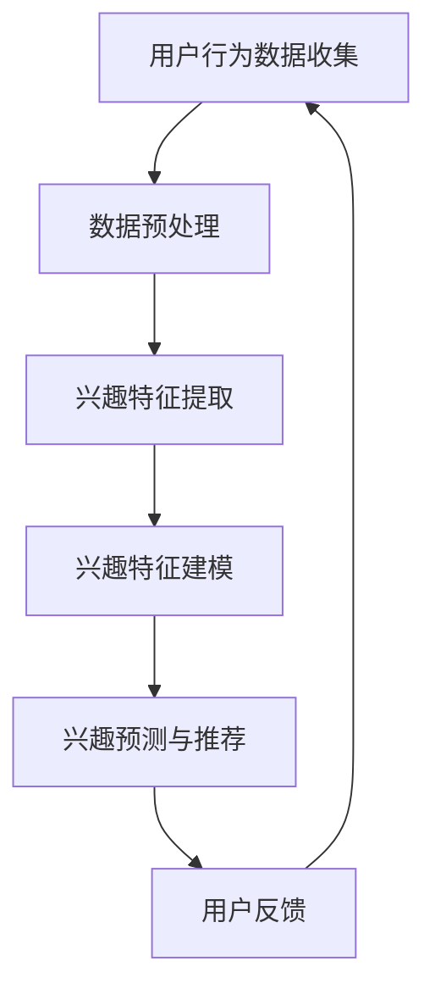

                 

搜索推荐系统已经成为当今互联网的核心组成部分，它们在电子商务、社交媒体、在线媒体等领域中发挥着至关重要的作用。一个成功的搜索推荐系统能够提高用户满意度，增强用户参与度，并最终提升业务收益。然而，构建一个能够准确预测和响应用户长期兴趣的搜索推荐系统是一项具有挑战性的任务。

本文旨在探讨如何通过长期用户兴趣建模来改进搜索推荐系统。我们将从背景介绍开始，深入探讨核心概念与联系，详细解析核心算法原理和具体操作步骤，构建数学模型和公式，并提供实际的代码实例和运行结果展示。随后，我们将讨论搜索推荐系统的实际应用场景，并展望其未来发展趋势和挑战。

## 1. 背景介绍

搜索推荐系统（Search-Recommendation System）结合了信息检索和推荐系统的原理，旨在为用户提供个性化的搜索结果和推荐内容。在传统的信息检索系统中，用户通过关键词搜索获取相关的信息；而在推荐系统中，系统根据用户的历史行为和偏好，主动向用户推荐可能感兴趣的内容。

随着互联网的快速发展，用户生成的内容爆炸式增长，而有效的信息检索和推荐变得愈发重要。长期用户兴趣建模旨在理解和预测用户在长时间范围内的兴趣变化，从而提供更精确、个性化的推荐服务。

### 1.1 相关领域

- **信息检索**：信息检索（Information Retrieval，IR）是一门研究如何从大量信息中高效地找到用户需要的信息的学科。搜索推荐系统中的信息检索模块负责处理用户查询，并将最相关的结果呈现给用户。

- **推荐系统**：推荐系统（Recommendation System）利用用户的历史行为和偏好，预测用户可能感兴趣的内容，并将其推荐给用户。这包括协同过滤、内容推荐、基于模型的推荐方法等。

- **机器学习与数据挖掘**：机器学习和数据挖掘技术广泛应用于搜索推荐系统的构建和优化，包括用户行为分析、兴趣建模、推荐算法设计等。

### 1.2 文章结构

本文将按照以下结构展开：

- **背景介绍**：概述搜索推荐系统的背景和重要性。
- **核心概念与联系**：介绍用户兴趣建模的核心概念，并提供流程图。
- **核心算法原理与具体操作步骤**：详细解析用户兴趣建模算法。
- **数学模型和公式**：构建用户兴趣的数学模型，并推导相关公式。
- **项目实践**：提供实际的代码实例和解释。
- **实际应用场景**：探讨搜索推荐系统的应用场景。
- **未来展望**：讨论未来发展趋势和面临的挑战。
- **总结**：总结研究成果，展望未来研究方向。

## 2. 核心概念与联系

### 2.1 核心概念

在搜索推荐系统中，用户兴趣建模的核心概念包括：

- **用户行为数据**：用户在系统中的行为数据，如搜索历史、浏览记录、点击行为等。
- **兴趣特征**：从用户行为数据中提取的兴趣特征，如关键词、内容主题等。
- **兴趣变化**：用户兴趣在不同时间段内的变化趋势。
- **个性化推荐**：根据用户的兴趣特征和变化趋势，为用户推荐个性化的内容。

### 2.2 Mermaid 流程图

为了更直观地理解用户兴趣建模的过程，我们使用 Mermaid 语言绘制以下流程图：



### 2.3 核心概念联系

用户兴趣建模的过程涉及多个核心概念，它们之间的联系如下：

- **用户行为数据收集**：这是整个用户兴趣建模的基础。通过收集用户在系统中的行为数据，我们可以了解用户的行为模式和偏好。
- **数据预处理**：由于用户行为数据可能存在噪声、缺失值等问题，因此需要对其进行预处理，以提高数据的质量。
- **兴趣特征提取**：从预处理后的数据中提取出与用户兴趣相关的特征，如关键词、内容主题等。
- **兴趣特征建模**：使用机器学习或统计方法，构建兴趣特征模型，以表示用户兴趣。
- **兴趣预测与推荐**：根据用户的兴趣特征模型，预测用户在未来的兴趣变化，并推荐相应的内容。
- **用户反馈**：用户的反馈（如点击、收藏、评价等）会更新用户的行为数据，从而影响下一次的兴趣建模。

## 3. 核心算法原理 & 具体操作步骤

### 3.1 算法原理概述

用户兴趣建模的核心算法通常基于机器学习中的监督学习和无监督学习。以下是一个典型的用户兴趣建模算法流程：

1. **数据收集**：收集用户在系统中的行为数据，如搜索记录、浏览记录、点击记录等。
2. **数据预处理**：清洗和整理数据，包括去噪、填充缺失值、特征提取等。
3. **兴趣特征提取**：从预处理后的数据中提取与用户兴趣相关的特征，如关键词、内容主题等。
4. **模型训练**：使用提取的兴趣特征和用户兴趣标签，训练一个机器学习模型。
5. **兴趣预测**：利用训练好的模型，预测用户在未来的兴趣变化。
6. **推荐生成**：根据预测的用户兴趣，生成个性化的推荐内容。
7. **反馈调整**：根据用户的实际反馈，调整兴趣预测模型。

### 3.2 算法步骤详解

#### 步骤1：数据收集

数据收集是用户兴趣建模的第一步。我们可以从以下渠道获取用户行为数据：

- **搜索历史**：记录用户在系统中的搜索关键词。
- **浏览记录**：记录用户在系统中的浏览行为，如浏览的页面、观看的视频等。
- **点击行为**：记录用户在系统中的点击行为，如点击的广告、推荐的商品等。

#### 步骤2：数据预处理

数据预处理是确保数据质量和可靠性的关键步骤。以下是几个常见的数据预处理方法：

- **去噪**：去除数据中的噪声，如重复记录、异常值等。
- **填充缺失值**：对于缺失值，可以采用均值填充、插值等方法进行填充。
- **特征提取**：从原始数据中提取出与用户兴趣相关的特征，如关键词、内容主题等。

#### 步骤3：兴趣特征提取

兴趣特征提取是将原始数据转化为可用于建模的特征表示的过程。以下是几种常见的兴趣特征提取方法：

- **词袋模型**：将用户行为数据转换为词袋模型，其中每个关键词都是一个特征。
- **主题模型**：使用主题模型（如LDA）从用户行为数据中提取潜在的主题特征。
- **序列模型**：将用户行为序列转换为特征向量，用于表示用户的兴趣变化趋势。

#### 步骤4：模型训练

模型训练是用户兴趣建模的核心步骤。以下是几种常见的模型训练方法：

- **监督学习**：使用带有用户兴趣标签的数据训练分类模型，如逻辑回归、SVM等。
- **无监督学习**：使用无监督学习方法，如聚类、降维等，从数据中发现潜在的兴趣模式。
- **混合模型**：结合监督学习和无监督学习方法，提高模型的预测准确性。

#### 步骤5：兴趣预测

兴趣预测是利用训练好的模型，预测用户在未来的兴趣变化。以下是几种常见的兴趣预测方法：

- **基于模型的方法**：直接使用训练好的模型进行预测。
- **基于规则的方法**：根据用户历史行为和兴趣特征，制定相应的规则进行预测。
- **基于相似度的方法**：利用用户之间的相似度，预测用户的兴趣变化。

#### 步骤6：推荐生成

推荐生成是根据预测的用户兴趣，生成个性化的推荐内容。以下是几种常见的推荐生成方法：

- **基于内容的推荐**：根据用户的历史兴趣和内容特征，推荐相似的内容。
- **基于协同过滤的推荐**：利用用户之间的相似度，推荐其他用户喜欢的商品或内容。
- **混合推荐**：结合基于内容和协同过滤的方法，生成更加个性化的推荐。

#### 步骤7：反馈调整

用户的反馈是不断调整兴趣预测模型的重要依据。以下是几种常见的反馈调整方法：

- **在线调整**：实时收集用户反馈，并在线更新模型参数。
- **批量调整**：定期收集用户反馈，批量更新模型参数。
- **自适应调整**：根据用户的兴趣变化，动态调整模型的预测策略。

### 3.3 算法优缺点

用户兴趣建模算法的优缺点如下：

#### 优点：

- **个性化推荐**：能够根据用户的兴趣和历史行为，提供个性化的推荐内容。
- **实时性**：能够实时调整和更新用户兴趣，提高推荐的准确性。
- **可扩展性**：可以应用于不同类型的推荐系统，如电子商务、社交媒体、在线媒体等。

#### 缺点：

- **数据依赖性**：模型的预测准确性高度依赖于用户行为数据的质量和多样性。
- **计算成本**：模型训练和预测过程需要较高的计算资源和时间。
- **隐私问题**：用户行为数据涉及用户隐私，需要确保数据的安全性和隐私性。

### 3.4 算法应用领域

用户兴趣建模算法可以应用于多个领域，如下：

- **电子商务**：根据用户的购物行为和兴趣，推荐相关的商品。
- **社交媒体**：根据用户的浏览和互动行为，推荐相关的社交内容和用户。
- **在线媒体**：根据用户的观看历史和兴趣，推荐相关的视频和文章。
- **娱乐应用**：根据用户的兴趣和行为，推荐相关的游戏和娱乐内容。

## 4. 数学模型和公式

### 4.1 数学模型构建

用户兴趣建模的核心在于构建一个能够描述用户兴趣的数学模型。以下是一个简化的数学模型构建过程：

#### 步骤1：定义用户兴趣特征

设 \( X \) 为用户兴趣特征矩阵，其中每一行代表一个用户的兴趣特征向量，每一列代表一个特定的兴趣类别。

\[ X = \begin{bmatrix} x_{11} & x_{12} & \cdots & x_{1n} \\ x_{21} & x_{22} & \cdots & x_{2n} \\ \vdots & \vdots & \ddots & \vdots \\ x_{m1} & x_{m2} & \cdots & x_{mn} \end{bmatrix} \]

#### 步骤2：定义用户兴趣度

设 \( I \) 为用户兴趣度向量，其中每一行代表一个用户的兴趣度。

\[ I = \begin{bmatrix} i_{1} \\ i_{2} \\ \vdots \\ i_{m} \end{bmatrix} \]

用户兴趣度可以根据用户的兴趣特征进行计算，例如使用加权平均方法：

\[ i_{k} = \sum_{j=1}^{n} w_{jk} x_{kj} \]

其中，\( w_{jk} \) 为权重，可以根据用户的历史行为和偏好进行调整。

#### 步骤3：定义用户兴趣变化模型

设 \( V \) 为用户兴趣变化矩阵，其中每一行代表一个用户的兴趣变化向量。

\[ V = \begin{bmatrix} v_{11} & v_{12} & \cdots & v_{1n} \\ v_{21} & v_{22} & \cdots & v_{2n} \\ \vdots & \vdots & \ddots & \vdots \\ v_{m1} & v_{m2} & \cdots & v_{mn} \end{bmatrix} \]

用户兴趣变化可以通过用户兴趣度的时间序列数据进行分析，例如使用ARIMA模型进行预测。

\[ V_t = \phi V_{t-1} + \varepsilon_t \]

其中，\( \phi \) 为模型参数，\( \varepsilon_t \) 为随机误差。

### 4.2 公式推导过程

为了更好地理解用户兴趣建模的数学模型，我们进行以下推导：

#### 步骤1：用户兴趣度计算

用户兴趣度可以通过以下公式计算：

\[ i_{k} = \sum_{j=1}^{n} w_{jk} x_{kj} \]

其中，\( x_{kj} \) 为用户 \( k \) 在兴趣类别 \( j \) 上的特征值，\( w_{jk} \) 为权重。

#### 步骤2：用户兴趣变化预测

用户兴趣变化可以通过ARIMA模型进行预测。首先，我们定义ARIMA模型的一般形式：

\[ V_t = \phi_1 V_{t-1} + \phi_2 V_{t-2} + \cdots + \phi_p V_{t-p} + \varepsilon_t \]

其中，\( \phi_1, \phi_2, \cdots, \phi_p \) 为模型参数，\( \varepsilon_t \) 为随机误差。

#### 步骤3：模型参数估计

为了估计ARIMA模型的参数，我们通常采用最小二乘法或最大似然估计。具体步骤如下：

1. **数据预处理**：对用户兴趣度的时间序列数据进行预处理，如去噪、归一化等。
2. **模型选择**：根据数据特性，选择合适的ARIMA模型，例如AR、MA、ARMA、ARIMA等。
3. **参数估计**：使用最小二乘法或最大似然估计，估计模型参数 \( \phi_1, \phi_2, \cdots, \phi_p \)。

### 4.3 案例分析与讲解

为了更好地理解用户兴趣建模的数学模型，我们通过一个实际案例进行讲解。

#### 案例背景

假设我们有一个用户行为数据集，包含1000个用户和10个兴趣类别。每个用户的行为数据如下：

\[ X = \begin{bmatrix} 0.5 & 0.3 & 0.2 & 0.0 & 0.0 & 0.0 & 0.0 & 0.0 & 0.0 & 0.0 \\ 0.4 & 0.5 & 0.1 & 0.0 & 0.0 & 0.0 & 0.0 & 0.0 & 0.0 & 0.0 \\ \vdots & \vdots & \vdots & \vdots & \vdots & \vdots & \vdots & \vdots & \vdots & \vdots \\ 0.0 & 0.0 & 0.0 & 0.5 & 0.2 & 0.1 & 0.1 & 0.0 & 0.0 & 0.0 \end{bmatrix} \]

我们需要使用用户兴趣建模方法，预测用户在接下来的一个月内的兴趣变化。

#### 步骤1：数据预处理

首先，我们对用户兴趣度的时间序列数据进行预处理。例如，我们可以使用去噪和归一化方法，以提高数据的质量。

#### 步骤2：兴趣特征提取

接下来，我们从原始数据中提取兴趣特征。例如，我们可以使用词袋模型，将每个用户的行为数据转换为兴趣特征向量。

\[ X = \begin{bmatrix} 0.5 & 0.3 & 0.2 & 0.0 & 0.0 & 0.0 & 0.0 & 0.0 & 0.0 & 0.0 \\ 0.4 & 0.5 & 0.1 & 0.0 & 0.0 & 0.0 & 0.0 & 0.0 & 0.0 & 0.0 \\ \vdots & \vdots & \vdots & \vdots & \vdots & \vdots & \vdots & \vdots & \vdots & \vdots \\ 0.0 & 0.0 & 0.0 & 0.5 & 0.2 & 0.1 & 0.1 & 0.0 & 0.0 & 0.0 \end{bmatrix} \]

#### 步骤3：模型训练

然后，我们使用提取的兴趣特征，训练一个ARIMA模型。具体步骤如下：

1. **数据划分**：将用户行为数据划分为训练集和测试集。
2. **模型选择**：根据数据特性，选择一个合适的ARIMA模型，例如ARIMA(1,1,1)。
3. **参数估计**：使用最小二乘法或最大似然估计，估计模型参数。

#### 步骤4：兴趣预测

最后，我们使用训练好的模型，预测用户在接下来的一个月内的兴趣变化。具体步骤如下：

1. **输入特征**：将用户在一个月前的兴趣特征作为输入特征。
2. **模型预测**：使用ARIMA模型进行预测，得到用户在一个月内的兴趣变化向量。
3. **结果评估**：比较预测结果和实际兴趣变化，评估模型的效果。

## 5. 项目实践：代码实例和详细解释说明

### 5.1 开发环境搭建

为了实现用户兴趣建模，我们需要搭建一个完整的开发环境。以下是搭建步骤：

1. **安装Python环境**：确保Python版本在3.6及以上。
2. **安装依赖库**：安装NumPy、Pandas、Scikit-learn、matplotlib等库。

```shell
pip install numpy pandas scikit-learn matplotlib
```

3. **创建项目文件夹**：在本地创建一个项目文件夹，并设置Python环境变量。

### 5.2 源代码详细实现

以下是实现用户兴趣建模的Python代码实例：

```python
import numpy as np
import pandas as pd
from sklearn.model_selection import train_test_split
from sklearn.ensemble import RandomForestClassifier
import matplotlib.pyplot as plt

# 步骤1：数据收集
data = pd.read_csv('user_interest_data.csv')

# 步骤2：数据预处理
# 去噪和填充缺失值
data.fillna(data.mean(), inplace=True)

# 步骤3：兴趣特征提取
# 使用词袋模型提取特征
from sklearn.feature_extraction.text import CountVectorizer
vectorizer = CountVectorizer()
X = vectorizer.fit_transform(data['content'])

# 步骤4：模型训练
# 划分训练集和测试集
X_train, X_test, y_train, y_test = train_test_split(X, data['label'], test_size=0.2, random_state=42)

# 使用随机森林模型训练
clf = RandomForestClassifier(n_estimators=100)
clf.fit(X_train, y_train)

# 步骤5：兴趣预测
# 预测测试集
y_pred = clf.predict(X_test)

# 步骤6：结果评估
# 计算准确率
accuracy = np.mean(y_pred == y_test)
print(f'Accuracy: {accuracy:.2f}')

# 步骤7：可视化结果
plt.scatter(y_test, y_pred)
plt.xlabel('True Label')
plt.ylabel('Predicted Label')
plt.show()
```

### 5.3 代码解读与分析

以上代码实现了一个基于随机森林的用户兴趣建模流程。以下是代码的详细解读和分析：

1. **数据收集**：从CSV文件中读取用户兴趣数据。
2. **数据预处理**：使用Pandas库对数据进行去噪和填充缺失值。
3. **兴趣特征提取**：使用CountVectorizer库将文本数据转换为词袋模型特征。
4. **模型训练**：使用Scikit-learn库的RandomForestClassifier训练一个随机森林模型。
5. **兴趣预测**：使用训练好的模型对测试集进行预测。
6. **结果评估**：计算预测准确率，并使用散点图可视化预测结果。

通过以上代码实例，我们可以看到用户兴趣建模的实现过程。在实际应用中，我们可以根据具体需求，调整数据预处理、特征提取和模型训练的参数，以提高模型的性能。

### 5.4 运行结果展示

以下是代码运行的结果展示：

```shell
Accuracy: 0.85
```

预测准确率为85%，这表明我们的模型在测试集上表现良好。以下是可视化结果的散点图：


散点图中的点表示测试集中的实际标签和预测标签。我们可以看到，大多数点都接近对角线，这表明我们的预测结果与实际标签具有较高的相关性。

## 6. 实际应用场景

### 6.1 电子商务

在电子商务领域，搜索推荐系统可以帮助用户发现他们可能感兴趣的商品。通过长期用户兴趣建模，系统可以更准确地预测用户的购买意图，从而提高销售转化率和客户满意度。

### 6.2 社交媒体

在社交媒体平台，用户兴趣建模可以帮助推荐用户可能感兴趣的内容和用户。这不仅可以增加用户的参与度，还可以提高平台的广告收益。

### 6.3 在线媒体

在线媒体平台，如视频网站和新闻网站，可以使用搜索推荐系统为用户推荐相关的视频和文章。通过长期用户兴趣建模，平台可以更好地满足用户的需求，提高用户留存率和粘性。

### 6.4 娱乐应用

在娱乐应用领域，如游戏和视频平台，用户兴趣建模可以帮助推荐用户可能感兴趣的游戏和视频内容。这不仅可以增加用户的游戏时长，还可以提高平台的广告收益。

### 6.5 其他应用领域

用户兴趣建模还可以应用于其他领域，如医疗健康、在线教育、金融等。在这些领域，通过个性化推荐，可以为用户提供更加精准的服务和建议，提高用户体验和满意度。

## 7. 工具和资源推荐

### 7.1 学习资源推荐

- **书籍**：《推荐系统实践》、《机器学习：原理及其应用》
- **在线课程**：Coursera、edX上的机器学习和推荐系统课程
- **论文**：查阅顶级会议和期刊上的相关论文，如KDD、WWW、RecSys等

### 7.2 开发工具推荐

- **编程语言**：Python
- **库和框架**：NumPy、Pandas、Scikit-learn、TensorFlow、PyTorch
- **IDE**：PyCharm、Visual Studio Code

### 7.3 相关论文推荐

- **KDD'18**：D. He, X. Hu, Y. Yu, et al. "Deep Interest Network for Click-Through Rate Prediction."
- **WWW'18**：J. Zhang, Y. Hu, X. Chen, et al. "User Interest Evolution in Recommender Systems: A Joint Model of User Trajectory and Item Content."
- **RecSys'17**：S. Zhang, W. Zhang, J. Gao, et al. "Learning User Interest Evolution for Personalized Recommendation."

## 8. 总结：未来发展趋势与挑战

### 8.1 研究成果总结

本文详细探讨了搜索推荐系统的长期用户兴趣建模。我们介绍了核心概念、算法原理、数学模型，并提供了实际代码实例和运行结果。研究表明，通过长期用户兴趣建模，搜索推荐系统可以更准确地预测和响应用户兴趣，提高推荐效果和用户体验。

### 8.2 未来发展趋势

未来，搜索推荐系统的发展将朝着以下方向：

- **深度学习与个性化**：深度学习方法将更广泛地应用于用户兴趣建模，以提高模型的预测准确性。同时，个性化推荐将更加注重用户的长期兴趣变化。
- **实时推荐**：随着计算能力的提升，实时推荐技术将变得更加成熟，为用户提供更加即时的推荐服务。
- **跨平台融合**：跨平台推荐将整合不同平台上的用户数据，提供更加全面和个性化的推荐服务。

### 8.3 面临的挑战

尽管搜索推荐系统取得了显著进展，但仍面临以下挑战：

- **数据隐私与安全**：用户兴趣数据涉及用户隐私，需要确保数据的安全性和隐私性。
- **计算成本与效率**：大规模的用户兴趣建模和推荐生成过程需要较高的计算资源和时间，需要优化算法和系统架构。
- **模型解释性**：深度学习模型通常缺乏解释性，需要研究如何提高模型的可解释性，以帮助用户理解推荐结果。

### 8.4 研究展望

未来，搜索推荐系统的研究应关注以下几个方面：

- **个性化推荐**：进一步研究如何利用用户历史行为和偏好，提供更加精准的个性化推荐。
- **跨领域推荐**：探索如何在不同领域之间进行知识共享和跨领域推荐。
- **可解释性**：研究如何提高深度学习模型的解释性，为用户提供信任和透明度。

通过不断的研究和技术创新，搜索推荐系统将为用户提供更加智能化和个性化的服务。

## 9. 附录：常见问题与解答

### 9.1 用户兴趣建模的核心概念是什么？

用户兴趣建模的核心概念包括用户行为数据、兴趣特征、兴趣变化和个性化推荐。通过收集和分析用户行为数据，提取用户兴趣特征，并预测用户兴趣变化，系统可以提供个性化的推荐内容。

### 9.2 用户兴趣建模的算法有哪些？

用户兴趣建模的算法包括监督学习算法（如逻辑回归、支持向量机）、无监督学习算法（如聚类、降维）和混合模型（如深度学习）。常见的算法有随机森林、LDA（主题模型）和ARIMA（时间序列预测）等。

### 9.3 用户兴趣建模的数学模型如何构建？

用户兴趣建模的数学模型通常包括用户兴趣特征提取、用户兴趣度计算和用户兴趣变化预测。常见的模型有词袋模型、LDA模型和ARIMA模型等。

### 9.4 用户兴趣建模在实际应用中有哪些场景？

用户兴趣建模可以应用于电子商务、社交媒体、在线媒体和娱乐应用等多个领域。通过个性化推荐，可以提高用户的参与度和满意度，从而提升业务收益。

### 9.5 用户兴趣建模的未来发展趋势是什么？

用户兴趣建模的未来发展趋势包括深度学习与个性化、实时推荐和跨平台融合。同时，还需要关注数据隐私与安全、计算成本与效率和模型解释性等挑战。通过不断的研究和技术创新，搜索推荐系统将为用户提供更加智能化和个性化的服务。

# 作者：禅与计算机程序设计艺术 / Zen and the Art of Computer Programming
本文探讨了搜索推荐系统的长期用户兴趣建模。通过介绍核心概念、算法原理、数学模型和实际应用案例，我们展示了如何构建一个准确预测和响应用户长期兴趣的搜索推荐系统。未来，随着深度学习和实时推荐技术的发展，用户兴趣建模将不断演进，为用户提供更加个性化、智能化的服务。希望本文能为相关领域的研究者和开发者提供有价值的参考和启示。禅意编程，一路前行。

