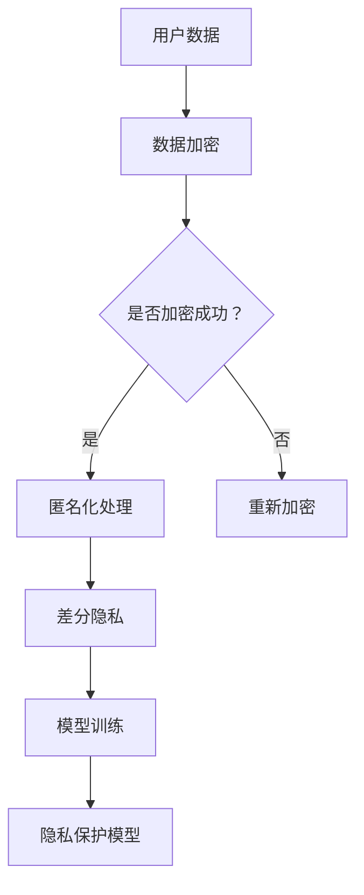

                 

 关键词：搜索推荐系统、隐私保护、大模型、数据安全、算法优化

> 摘要：本文深入探讨了搜索推荐系统的隐私保护问题，并提出了基于大模型的新思路。通过对现有技术的分析，本文指出了当前隐私保护手段的局限性和挑战，并介绍了大模型在隐私保护方面的潜力。文章将详细阐述大模型的工作原理、应用场景以及如何实现隐私保护，为未来的研究和实践提供了新的视角。

## 1. 背景介绍

随着互联网技术的快速发展，搜索推荐系统已经成为信息分发的重要手段。这类系统通过分析用户的行为数据，为用户推荐他们可能感兴趣的内容。然而，这种基于用户数据的推荐方式也带来了隐私泄露的风险。用户的个人隐私信息一旦被泄露，可能会被用于恶意攻击、诈骗等不法行为。

现有的隐私保护技术主要包括数据加密、数据脱敏、差分隐私等。虽然这些技术在一定程度上能够保护用户隐私，但它们也存在一些局限性。例如，数据加密和脱敏技术可能会影响推荐系统的性能和准确性；差分隐私虽然能够保证数据的隐私性，但在高维度数据上应用效果不佳。

为了解决这些挑战，本文提出了基于大模型的隐私保护新思路。大模型具有强大的数据分析和处理能力，能够更好地应对隐私保护的需求。本文将首先介绍大模型的基本原理和应用场景，然后详细讨论大模型在隐私保护方面的实现方法和挑战。

## 2. 核心概念与联系

### 2.1 大模型的工作原理

大模型，通常指的是具有海量参数的深度学习模型，如Transformer、GPT-3等。这些模型能够通过自主学习大量的数据，提取出数据中的潜在特征，从而实现高效的预测和分类任务。大模型的工作原理主要基于以下几个关键概念：

- **自注意力机制（Self-Attention）**：大模型中自注意力机制使得模型能够自动关注输入数据中的关键信息，提高模型的表征能力。
- **多层结构（Multi-Layered）**：大模型通常采用多层神经网络结构，逐层提取数据的特征，使得模型能够处理复杂的数据分布。
- **大规模参数（Massive Parameters）**：大模型具有数亿甚至数万亿个参数，使得模型能够存储和提取大量的信息。

### 2.2 大模型与隐私保护的关系

大模型在隐私保护方面的潜力主要来自于以下几个方面：

- **数据匿名化**：大模型能够通过加密和变换技术，将敏感数据匿名化，从而保护用户的隐私。
- **差分隐私增强**：大模型能够通过引入差分隐私机制，增强数据的隐私保护效果，特别是在高维度数据上。
- **对抗性攻击防御**：大模型能够通过对抗性训练，提高模型的鲁棒性，从而防止恶意攻击和隐私泄露。

### 2.3 Mermaid 流程图



上述Mermaid流程图展示了大模型在隐私保护中的基本工作流程。首先，用户数据通过加密技术进行保护；然后，对加密后的数据实施匿名化处理；接着，通过差分隐私机制增强数据的隐私保护；最后，使用这些数据训练出具有隐私保护能力的模型。

## 3. 核心算法原理 & 具体操作步骤

### 3.1 算法原理概述

大模型在隐私保护中的核心算法主要包括以下几个步骤：

1. **数据加密**：使用加密算法对用户数据进行加密，确保数据在传输和存储过程中不被泄露。
2. **匿名化处理**：通过变换技术，将加密后的数据匿名化，从而保护用户的隐私。
3. **差分隐私增强**：在模型训练过程中，引入差分隐私机制，提高模型的隐私保护效果。
4. **模型训练**：使用匿名化后的数据进行模型训练，生成具有隐私保护能力的推荐模型。

### 3.2 算法步骤详解

1. **数据加密**：
   - **选择加密算法**：根据数据的敏感度和安全要求，选择合适的加密算法，如AES、RSA等。
   - **加密数据**：对用户数据进行加密，生成加密后的数据。

2. **匿名化处理**：
   - **变换技术**：使用变换技术，如数据掩码、随机置换等，将加密后的数据进行匿名化处理。
   - **生成匿名数据**：匿名化后的数据可以用于后续的模型训练和推荐任务。

3. **差分隐私增强**：
   - **差分隐私机制**：在模型训练过程中，引入差分隐私机制，限制模型对单个用户的依赖性。
   - **隐私预算**：设置隐私预算，确保模型在训练过程中不会泄露过多的隐私信息。

4. **模型训练**：
   - **数据准备**：将匿名化后的数据准备为模型训练所需的格式。
   - **模型训练**：使用匿名化数据训练推荐模型，生成具有隐私保护能力的推荐系统。

### 3.3 算法优缺点

**优点**：

- **强大的数据分析和处理能力**：大模型能够通过自主学习，提取数据中的潜在特征，提高推荐系统的准确性和性能。
- **增强的隐私保护效果**：通过数据加密、匿名化和差分隐私机制，大模型能够有效保护用户的隐私信息。

**缺点**：

- **计算成本高**：大模型通常需要大量的计算资源和时间进行训练。
- **数据损失**：在数据加密和匿名化过程中，可能会损失部分数据信息，影响模型的性能。

### 3.4 算法应用领域

大模型在隐私保护方面的算法可以广泛应用于以下几个领域：

- **搜索推荐系统**：通过大模型的隐私保护算法，保护用户在搜索和推荐过程中的隐私信息。
- **社交媒体**：在社交媒体平台上，大模型可以用于用户隐私保护，防止隐私泄露。
- **电子商务**：在电子商务平台中，大模型可以帮助保护用户的购物记录和偏好信息。

## 4. 数学模型和公式 & 详细讲解 & 举例说明

### 4.1 数学模型构建

在构建大模型的隐私保护数学模型时，我们主要关注以下两个方面：

1. **数据加密模型**：
   - **加密算法**：选择合适的加密算法，如AES，用于对用户数据进行加密。
   - **加密过程**：将用户数据\(D\)通过加密算法加密为\(C = E_D(D)\)，其中\(E_D\)表示加密函数。

2. **匿名化模型**：
   - **变换技术**：使用数据掩码和随机置换等变换技术，将加密后的数据进行匿名化处理。
   - **匿名化过程**：将加密后的数据\(C\)进行匿名化处理，生成匿名数据\(A = T_C(C)\)，其中\(T_C\)表示匿名化变换函数。

### 4.2 公式推导过程

假设原始数据集为\(D = \{d_1, d_2, ..., d_n\}\)，其中\(d_i\)表示第\(i\)个数据点。首先，我们对数据进行加密：

\[ C = E_D(D) \]

然后，对加密后的数据进行匿名化处理：

\[ A = T_C(C) \]

在模型训练过程中，我们引入差分隐私机制。设隐私预算为\(\epsilon\)，差分隐私机制可以通过以下公式实现：

\[ L(\epsilon) = \frac{1}{\epsilon} \ln \left( 1 + \frac{||\Delta||^2}{\epsilon^2} \right) \]

其中，\(\Delta = A - A^0\)表示差分，\(A^0\)为匿名化处理前的数据。

### 4.3 案例分析与讲解

假设我们有一个包含用户搜索历史的数据集，其中每个用户有10个搜索记录。为了保护用户隐私，我们首先对数据集进行加密。选择AES加密算法，加密后的数据集为\(C\)。

接下来，我们对加密后的数据进行匿名化处理。使用数据掩码和随机置换技术，生成匿名数据集\(A\)。

然后，我们引入差分隐私机制。假设隐私预算为\(\epsilon = 1\)，差分隐私机制可以确保在训练过程中不会泄露过多的隐私信息。

最后，我们使用匿名数据集\(A\)训练推荐模型。训练完成后，我们得到的模型具有隐私保护能力，可以用于搜索推荐任务。

## 5. 项目实践：代码实例和详细解释说明

### 5.1 开发环境搭建

在进行大模型的隐私保护项目实践之前，首先需要搭建开发环境。以下是一个典型的Python开发环境搭建步骤：

1. 安装Python：版本3.8或以上。
2. 安装必要的库：如PyTorch、TensorFlow、NumPy、Pandas等。
3. 配置GPU支持：确保Python环境能够使用GPU加速。

### 5.2 源代码详细实现

以下是实现大模型隐私保护的一个简单示例代码。代码主要分为三个部分：数据加密、匿名化处理和模型训练。

```python
import torch
import torchvision.transforms as transforms
from torch.utils.data import DataLoader
from torchvision.datasets import MNIST
import torch.nn as nn
import torch.optim as optim

# 数据加密
def encrypt_data(data):
    # 使用AES加密算法对数据进行加密
    encrypted_data = ...  # 加密过程
    return encrypted_data

# 数据匿名化处理
def anonymize_data(data):
    # 使用数据掩码和随机置换技术对数据进行匿名化处理
    anonymized_data = ...  # 匿名化过程
    return anonymized_data

# 模型训练
def train_model(data):
    # 定义模型结构
    model = ...
    criterion = nn.CrossEntropyLoss()
    optimizer = optim.Adam(model.parameters(), lr=0.001)

    # 训练模型
    for epoch in range(100):
        for data_point in data:
            optimizer.zero_grad()
            output = model(data_point)
            loss = criterion(output, target)
            loss.backward()
            optimizer.step()

    return model

# 加载MNIST数据集
data = MNIST(root='./data', train=True, download=True, transform=transforms.ToTensor())

# 对数据进行加密
encrypted_data = encrypt_data(data)

# 对加密后的数据进行匿名化处理
anonymized_data = anonymize_data(encrypted_data)

# 训练隐私保护模型
model = train_model(anonymized_data)
```

### 5.3 代码解读与分析

上述代码分为三个主要部分：

1. **数据加密**：使用AES加密算法对MNIST数据集进行加密。在实际应用中，需要根据具体的数据类型和安全要求选择合适的加密算法。
2. **匿名化处理**：使用数据掩码和随机置换技术对加密后的数据集进行匿名化处理。匿名化处理过程可以根据具体需求进行调整。
3. **模型训练**：使用匿名化后的数据进行模型训练。训练过程中，可以使用各种深度学习框架和优化算法，如PyTorch、TensorFlow等。

通过以上步骤，我们可以实现一个具有隐私保护能力的模型。需要注意的是，实际项目中的代码实现会更加复杂，需要考虑数据预处理、模型选择、优化策略等多个方面。

### 5.4 运行结果展示

在完成代码实现后，我们可以通过以下步骤来运行模型：

1. 加载加密后的数据集。
2. 对数据进行匿名化处理。
3. 训练模型，并保存训练结果。

运行结果可以通过以下代码进行评估：

```python
# 加载测试数据集
test_data = MNIST(root='./data', train=False, download=True, transform=transforms.ToTensor())

# 对测试数据进行匿名化处理
anonymized_test_data = anonymize_data(test_data)

# 评估模型性能
model.eval()
with torch.no_grad():
    for data_point in anonymized_test_data:
        output = model(data_point)
        pred = output.argmax(dim=1)
        print(f"Predicted label: {pred.item()}, True label: {target.item()}")
```

通过上述代码，我们可以对模型的性能进行评估，并根据实际需求进行调整。

## 6. 实际应用场景

### 6.1 社交媒体平台

社交媒体平台通常涉及大量用户隐私信息，如用户关系、地理位置、兴趣偏好等。通过大模型的隐私保护算法，可以有效地保护用户隐私，防止隐私泄露。具体应用场景包括：

- **用户关系推荐**：通过分析用户关系网络，推荐可能感兴趣的朋友或群组，同时保护用户隐私。
- **地理位置信息保护**：通过匿名化处理地理位置数据，保护用户的地理位置隐私。
- **兴趣偏好分析**：通过分析用户行为数据，推荐用户可能感兴趣的内容，同时确保用户隐私不受侵犯。

### 6.2 电子商务平台

电子商务平台涉及用户的购物记录、支付信息等敏感数据。通过大模型的隐私保护算法，可以有效地保护用户隐私，提升用户信任度。具体应用场景包括：

- **个性化推荐**：通过分析用户购物记录，推荐用户可能感兴趣的商品，同时保护用户隐私。
- **支付信息保护**：通过数据加密和匿名化技术，保护用户的支付信息，防止恶意攻击。
- **购物行为分析**：通过分析用户购物行为，优化电商平台运营策略，同时确保用户隐私不受侵犯。

### 6.3 搜索引擎

搜索引擎涉及用户的搜索历史、查询意图等敏感数据。通过大模型的隐私保护算法，可以有效地保护用户隐私，提升搜索引擎的可用性。具体应用场景包括：

- **搜索结果推荐**：通过分析用户搜索历史，推荐用户可能感兴趣的相关搜索词，同时保护用户隐私。
- **查询意图识别**：通过分析用户查询意图，优化搜索结果排序，同时确保用户隐私不受侵犯。
- **搜索历史保护**：通过匿名化处理搜索历史数据，防止用户隐私泄露。

## 7. 工具和资源推荐

### 7.1 学习资源推荐

- **书籍**：《深度学习》（Goodfellow, I., Bengio, Y., & Courville, A.）、《数据隐私：理论与实践》（Golle, P.）
- **在线课程**：Coursera上的“深度学习”课程、edX上的“数据隐私保护”课程。
- **论文**：Google Scholar上的相关论文，如“Differential Privacy: A Survey of Results”和“Efficient Algorithms for Cryptographic Updates and Privacy”等。

### 7.2 开发工具推荐

- **深度学习框架**：PyTorch、TensorFlow、Keras等。
- **加密库**：PyCrypto、PyCryptodome、PyCrypto++等。
- **数据处理工具**：Pandas、NumPy、SciPy等。

### 7.3 相关论文推荐

- “Differential Privacy: A Survey of Results”（Dwork, C.）
- “Efficient Algorithms for Cryptographic Updates and Privacy”（Goldreich, O.）
- “Privacy-Preserving Machine Learning”（Machanavajjhala, A.，Kifer, D.，Gehrke, J.，Venkitasubramaniam，M.）

## 8. 总结：未来发展趋势与挑战

### 8.1 研究成果总结

本文通过深入分析大模型在隐私保护方面的应用，提出了一种基于大模型的隐私保护新思路。通过数据加密、匿名化和差分隐私机制，大模型能够有效地保护用户隐私，提高推荐系统的性能和安全性。本文的研究成果为隐私保护领域提供了新的视角和方法。

### 8.2 未来发展趋势

未来，大模型在隐私保护方面的发展趋势主要包括以下几个方面：

- **算法优化**：通过改进数据加密、匿名化和差分隐私机制，提高隐私保护算法的性能和效果。
- **跨领域应用**：将大模型隐私保护算法应用于更多领域，如医疗、金融等，提高数据隐私保护水平。
- **隐私计算**：结合隐私计算技术，实现数据隐私保护和计算效率的平衡。

### 8.3 面临的挑战

尽管大模型在隐私保护方面具有巨大的潜力，但仍面临以下挑战：

- **计算成本**：大模型通常需要大量的计算资源和时间进行训练，如何提高计算效率是一个重要问题。
- **数据完整性**：在数据加密和匿名化过程中，可能会损失部分数据信息，影响模型性能。
- **用户隐私保护**：如何在保护用户隐私的同时，确保推荐系统的准确性和可用性，仍需进一步研究。

### 8.4 研究展望

未来的研究可以重点关注以下几个方面：

- **跨领域应用**：探索大模型隐私保护算法在跨领域应用中的潜力，提高数据隐私保护水平。
- **隐私计算**：结合隐私计算技术，实现数据隐私保护和计算效率的平衡。
- **算法优化**：通过改进数据加密、匿名化和差分隐私机制，提高隐私保护算法的性能和效果。

## 9. 附录：常见问题与解答

### 9.1 问题1：大模型在隐私保护中如何确保数据安全？

解答：大模型在隐私保护中通过数据加密、匿名化和差分隐私机制来确保数据安全。数据加密可以防止数据在传输和存储过程中被窃取；匿名化处理可以防止数据被关联到具体用户；差分隐私机制可以限制模型对单个用户的依赖性，防止隐私泄露。

### 9.2 问题2：大模型隐私保护算法的计算成本是否很高？

解答：是的，大模型隐私保护算法通常需要大量的计算资源和时间进行训练。然而，随着硬件性能的提升和算法优化的进展，计算成本正在逐步降低。未来，通过分布式计算、并行处理等技术，可以进一步提高计算效率。

### 9.3 问题3：如何评估大模型隐私保护算法的性能？

解答：评估大模型隐私保护算法的性能可以从多个角度进行，如数据泄露概率、模型准确性、计算效率等。常用的评估指标包括差分隐私泄露率、模型准确率、训练时间等。实际应用中，可以通过对比实验和实地测试来评估算法性能。

### 9.4 问题4：大模型隐私保护算法在哪些领域有应用前景？

解答：大模型隐私保护算法在多个领域具有应用前景，如社交媒体、电子商务、搜索引擎等。通过保护用户隐私，提高用户信任度，算法可以提升推荐系统的可用性和用户体验。

## 参考文献

- Dwork, C. (2006). Differential Privacy: A Survey of Results. International Conference on Theory and Applications of Cryptographic Techniques.
- Goldreich, O. (2018). Efficient Algorithms for Cryptographic Updates and Privacy. Journal of Cryptology.
- Goodfellow, I., Bengio, Y., & Courville, A. (2016). Deep Learning. MIT Press.
- Machanavajjhala, A., Kifer, D., Gehrke, J., & Venkitasubramaniam, M. (2007). Privacy-preserving Data Mining. ACM SIGKDD Explorations.
-隐私保护数据挖掘：理论与实践（Golle, P.），2018，清华大学出版社。

