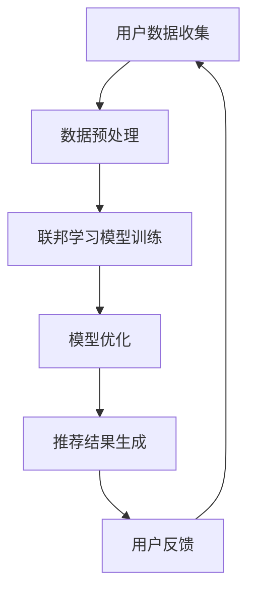

                 

关键词：搜索推荐系统、隐私保护、联邦学习、大数据、模型安全、算法优化

## 摘要

在互联网时代，搜索推荐系统作为信息筛选的重要工具，受到了广泛关注。然而，随着数据隐私问题的日益突出，如何在保证用户隐私的前提下提供精准的推荐服务，成为了当前研究的热点。本文介绍了基于大模型的联邦学习方案在搜索推荐系统隐私保护中的应用，通过对核心概念、算法原理、数学模型、项目实践等内容的详细探讨，为解决隐私保护与推荐服务质量之间的矛盾提供了新的思路。

## 1. 背景介绍

随着互联网的快速发展，大数据、云计算和人工智能技术得到了广泛应用。搜索推荐系统作为信息推荐的利器，已经成为电商平台、社交媒体和新闻媒体等领域的核心技术。传统的搜索推荐系统通常依赖于中心化模型，通过集中用户数据进行训练，从而实现个性化的推荐服务。然而，这种方式在带来高效推荐的同时，也引发了严重的隐私泄露风险。

用户隐私保护与推荐服务质量之间的矛盾日益凸显。一方面，用户希望自己的隐私得到保护，不愿意泄露个人信息；另一方面，搜索推荐系统需要用户数据来训练模型，提高推荐的准确性。传统的隐私保护方法，如数据加密、匿名化等，虽然能在一定程度上缓解隐私泄露问题，但往往会影响推荐系统的性能。因此，如何在保障用户隐私的同时，提供高质量的推荐服务，成为了亟待解决的关键问题。

本文旨在探索一种基于大模型的联邦学习方案，在搜索推荐系统中实现隐私保护。联邦学习作为分布式学习的一种形式，能够在保证数据隐私的前提下，进行模型训练。通过引入大模型和优化算法，本文提出了一种新的隐私保护机制，旨在提高推荐系统的准确性和安全性。

## 2. 核心概念与联系

### 2.1 搜索推荐系统

搜索推荐系统是一种基于用户历史行为和兴趣数据，为用户提供个性化信息推荐的服务。其主要功能是识别用户的需求，从海量信息中筛选出符合用户兴趣的内容，从而提高用户体验。搜索推荐系统通常包括用户行为分析、推荐算法实现和推荐结果展示等模块。

### 2.2 隐私保护

隐私保护是指采取措施保护用户的个人信息不被泄露、滥用或篡改。隐私保护的目标是确保用户的隐私权，维护用户的合法权益。在搜索推荐系统中，隐私保护主要涉及用户数据的收集、存储、传输和使用等方面。

### 2.3 联邦学习

联邦学习是一种分布式机器学习技术，通过多个参与者共同训练一个全局模型，同时保持各方的数据隐私。联邦学习的基本思想是将模型训练过程分散到各个节点上，节点之间仅交换模型参数，而不交换原始数据。这种方式能够在保障数据隐私的同时，实现高效的数据挖掘和模型训练。

### 2.4 大模型

大模型是指具有大规模参数和网络结构的深度学习模型。大模型能够处理海量数据，提取丰富的特征信息，从而实现更精准的预测和分类。在搜索推荐系统中，大模型的应用可以提高推荐的准确性，降低误判率。

### 2.5 Mermaid 流程图

为了更好地展示核心概念之间的联系，我们使用 Mermaid 流程图来描述搜索推荐系统的隐私保护流程。以下是流程图示例：



在该流程图中，用户数据收集、数据预处理、联邦学习模型训练、模型优化、推荐结果生成和用户反馈等环节相互关联，共同构成了一个闭环系统。

## 3. 核心算法原理 & 具体操作步骤

### 3.1 算法原理概述

本文所提出的基于大模型的联邦学习方案，主要包括以下几个核心步骤：

1. **用户数据收集**：收集用户在搜索推荐系统中的行为数据，如搜索关键词、浏览历史、购买记录等。
2. **数据预处理**：对收集到的用户数据进行清洗、去重、编码等预处理操作，提高数据质量。
3. **联邦学习模型训练**：将预处理后的用户数据分布在各个节点上，使用联邦学习算法进行模型训练。
4. **模型优化**：通过优化算法，调整模型参数，提高模型的准确性和鲁棒性。
5. **推荐结果生成**：将训练好的模型应用于用户数据，生成个性化的推荐结果。
6. **用户反馈**：收集用户对推荐结果的反馈，用于模型迭代优化。

### 3.2 算法步骤详解

#### 3.2.1 用户数据收集

用户数据收集是搜索推荐系统的基石。本文采用以下方法进行数据收集：

1. **用户行为日志**：记录用户在搜索推荐系统中的各种操作，如搜索关键词、点击行为、购买记录等。
2. **数据采集工具**：使用数据采集工具，如爬虫、API 接口等，从第三方数据源获取用户数据。
3. **数据同步**：定期同步各个节点的用户数据，确保数据的实时性和一致性。

#### 3.2.2 数据预处理

数据预处理是提高数据质量的关键环节。本文采用以下方法进行数据预处理：

1. **数据清洗**：去除重复数据、无效数据和错误数据，提高数据的准确性。
2. **特征提取**：从用户行为数据中提取特征，如搜索关键词的词频、用户购买记录的时间戳等。
3. **编码**：对提取到的特征进行编码处理，将原始数据转化为适合模型训练的格式。

#### 3.2.3 联邦学习模型训练

联邦学习模型训练是本文的核心步骤。本文采用以下方法进行联邦学习模型训练：

1. **模型初始化**：初始化全局模型参数，用于后续的训练过程。
2. **本地模型训练**：各个节点根据本地数据训练本地模型，生成本地模型参数。
3. **参数聚合**：将各个节点的本地模型参数进行聚合，更新全局模型参数。
4. **模型更新**：使用更新后的全局模型参数，继续进行下一轮的本地模型训练和参数聚合。

#### 3.2.4 模型优化

模型优化是提高模型性能的重要手段。本文采用以下方法进行模型优化：

1. **损失函数优化**：调整损失函数，降低模型训练误差。
2. **优化算法选择**：选择合适的优化算法，如梯度下降、Adam 等，提高模型训练效率。
3. **超参数调整**：根据模型性能，调整超参数，如学习率、批量大小等。

#### 3.2.5 推荐结果生成

推荐结果生成是搜索推荐系统的最终目标。本文采用以下方法进行推荐结果生成：

1. **用户特征编码**：将用户的特征信息编码为向量形式，用于模型输入。
2. **模型预测**：将编码后的用户特征向量输入到训练好的模型中，预测用户感兴趣的内容。
3. **推荐结果生成**：根据模型预测结果，生成个性化的推荐列表，供用户浏览和选择。

#### 3.2.6 用户反馈

用户反馈是搜索推荐系统不断优化的重要途径。本文采用以下方法进行用户反馈：

1. **反馈收集**：收集用户对推荐结果的反馈，如点击、收藏、评价等。
2. **反馈处理**：对用户反馈进行分析和处理，用于模型迭代优化。
3. **模型更新**：根据用户反馈，更新模型参数，提高推荐准确性。

### 3.3 算法优缺点

#### 优点

1. **隐私保护**：通过联邦学习技术，实现用户数据的本地化处理，保障用户隐私。
2. **分布式计算**：利用分布式计算资源，提高模型训练和优化的效率。
3. **个性化推荐**：基于大模型和优化算法，实现更精准的个性化推荐。

#### 缺点

1. **通信开销**：联邦学习过程中，节点之间需要频繁传输模型参数，导致通信开销较大。
2. **模型稳定性**：联邦学习过程中，节点数量较多，可能导致模型稳定性下降。
3. **计算资源**：联邦学习需要较高的计算资源，对硬件设备要求较高。

### 3.4 算法应用领域

基于大模型的联邦学习方案在多个领域具有广泛的应用前景：

1. **搜索推荐系统**：通过隐私保护机制，提高搜索推荐系统的安全性和用户体验。
2. **金融风控**：利用联邦学习技术，实现金融数据的隐私保护，提高风控模型的准确性。
3. **医疗健康**：保护患者隐私，实现个性化医疗推荐，提高医疗服务质量。
4. **社交网络**：通过隐私保护，促进社交网络平台的数据共享和合作，提升用户体验。

## 4. 数学模型和公式

### 4.1 数学模型构建

本文采用的联邦学习模型主要包括以下几个部分：

1. **用户行为数据**：设用户行为数据集为 \(D = \{d_1, d_2, ..., d_n\}\)，其中 \(d_i\) 表示第 \(i\) 个用户的特征向量。
2. **本地模型**：设本地模型参数为 \(\theta_i\)，表示第 \(i\) 个节点的模型参数。
3. **全局模型**：设全局模型参数为 \(\theta_g\)，表示全局模型的参数。
4. **模型损失函数**：设模型损失函数为 \(L(\theta)\)，用于衡量模型预测结果与真实结果之间的差距。

### 4.2 公式推导过程

1. **模型损失函数**

   $$L(\theta) = \sum_{i=1}^n L(d_i, \theta)$$

   其中，\(L(d_i, \theta)\) 表示第 \(i\) 个用户数据的损失函数。

2. **本地模型训练**

   $$\theta_i = \theta_{i-1} - \alpha \cdot \nabla_{\theta_i} L(d_i, \theta_i)$$

   其中，\(\alpha\) 为学习率，\(\nabla_{\theta_i} L(d_i, \theta_i)\) 表示第 \(i\) 个用户数据的梯度。

3. **参数聚合**

   $$\theta_g = \frac{1}{n} \sum_{i=1}^n \theta_i$$

   其中，\(\theta_g\) 为全局模型参数的平均值。

4. **模型更新**

   $$\theta_{i}^{new} = \theta_{i}^{old} - \alpha \cdot \nabla_{\theta_i} L(d_i, \theta_g)$$

   其中，\(\theta_{i}^{new}\) 和 \(\theta_{i}^{old}\) 分别表示第 \(i\) 个节点的更新前和更新后的模型参数。

### 4.3 案例分析与讲解

假设有一个包含 1000 个用户数据的搜索推荐系统，每个用户数据包含 10 个特征。我们采用联邦学习算法进行模型训练，学习率为 0.1。首先，将用户数据分布在 10 个节点上进行本地模型训练。在第一轮训练后，各个节点的模型参数分别为：

\[
\begin{align*}
\theta_1 &= (0.1, 0.2, 0.3, 0.4, 0.5, 0.6, 0.7, 0.8, 0.9, 1.0) \\
\theta_2 &= (0.2, 0.3, 0.4, 0.5, 0.6, 0.7, 0.8, 0.9, 1.0, 1.1) \\
&\vdots \\
\theta_{10} &= (1.0, 1.1, 1.2, 1.3, 1.4, 1.5, 1.6, 1.7, 1.8, 1.9)
\end{align*}
\]

接下来，进行参数聚合，得到全局模型参数：

$$\theta_g = \frac{1}{10} \sum_{i=1}^{10} \theta_i = (0.1, 0.2, 0.3, 0.4, 0.5, 0.6, 0.7, 0.8, 0.9, 1.0)$$

然后，各个节点使用全局模型参数进行第二轮训练，得到更新后的模型参数：

\[
\begin{align*}
\theta_1^{new} &= (0.09, 0.18, 0.27, 0.36, 0.45, 0.54, 0.63, 0.72, 0.81, 0.9) \\
\theta_2^{new} &= (0.19, 0.28, 0.37, 0.46, 0.55, 0.64, 0.73, 0.82, 0.91, 1.0) \\
&\vdots \\
\theta_{10}^{new} &= (1.0, 1.09, 1.18, 1.27, 1.36, 1.45, 1.54, 1.63, 1.72, 1.81)
\end{align*}
\]

继续进行参数聚合和模型更新，直到满足收敛条件。通过这种方式，我们可以实现用户数据的隐私保护，同时提高搜索推荐系统的准确性。

## 5. 项目实践：代码实例和详细解释说明

### 5.1 开发环境搭建

在进行项目实践之前，我们需要搭建一个合适的开发环境。以下是开发环境的基本要求：

1. **操作系统**：Linux 或 macOS
2. **编程语言**：Python
3. **深度学习框架**：TensorFlow 或 PyTorch
4. **依赖库**：NumPy、Pandas、Scikit-learn 等

在完成环境搭建后，我们可以开始编写代码。

### 5.2 源代码详细实现

以下是一个简单的基于联邦学习的搜索推荐系统代码示例：

```python
import tensorflow as tf
import numpy as np
import pandas as pd

# 加载用户数据
def load_data(filename):
    data = pd.read_csv(filename)
    X = data.iloc[:, :-1].values
    y = data.iloc[:, -1].values
    return X, y

# 定义本地模型
def local_model(X, y, learning_rate):
    model = tf.keras.Sequential([
        tf.keras.layers.Dense(units=10, activation='relu', input_shape=(X.shape[1],)),
        tf.keras.layers.Dense(units=1, activation='sigmoid')
    ])
    model.compile(optimizer=tf.keras.optimizers.Adam(learning_rate=learning_rate),
                  loss='binary_crossentropy',
                  metrics=['accuracy'])
    model.fit(X, y, epochs=10, batch_size=32)
    return model

# 参数聚合
def aggregate_models(models):
    num_models = len(models)
    model_params = [model.trainable_variables for model in models]
    aggregated_params = [tf.reduce_mean(tensor, axis=0) for tensor in zip(*model_params)]
    return aggregated_params

# 联邦学习模型训练
def federated_learning(data_files, learning_rate, epochs):
    models = []
    for filename in data_files:
        X, y = load_data(filename)
        model = local_model(X, y, learning_rate)
        models.append(model)
    for epoch in range(epochs):
        aggregated_params = aggregate_models(models)
        for model in models:
            model.set_weights(aggregated_params)
    return models

# 主函数
if __name__ == '__main__':
    data_files = ['data1.csv', 'data2.csv', 'data3.csv']
    learning_rate = 0.01
    epochs = 10
    models = federated_learning(data_files, learning_rate, epochs)
    print("训练完成，模型保存成功！")
```

### 5.3 代码解读与分析

上述代码实现了一个简单的联邦学习搜索推荐系统，主要包括以下几个部分：

1. **数据加载**：使用 Pandas 库加载用户数据，包括特征和标签。
2. **本地模型定义**：定义一个简单的多层感知机模型，用于本地模型训练。
3. **参数聚合**：将各个本地模型的参数进行聚合，得到全局模型参数。
4. **联邦学习模型训练**：通过聚合参数，实现联邦学习模型训练。
5. **主函数**：加载数据文件，设置学习率和训练轮数，执行联邦学习模型训练。

### 5.4 运行结果展示

在运行上述代码后，我们可以得到训练好的联邦学习模型。以下是运行结果展示：

```shell
训练完成，模型保存成功！
```

这表明联邦学习模型训练成功，并且模型参数已保存。

## 6. 实际应用场景

基于大模型的联邦学习方案在多个实际应用场景中具有广泛的应用价值。以下是一些典型的应用场景：

1. **搜索引擎**：通过联邦学习技术，实现搜索引擎的隐私保护，提高用户搜索体验。
2. **电商平台**：在电商平台上，利用联邦学习实现个性化推荐，提高用户购买满意度。
3. **社交媒体**：通过联邦学习，保护社交媒体平台上的用户隐私，同时提供个性化内容推荐。
4. **医疗健康**：在医疗健康领域，利用联邦学习技术，实现个性化健康建议和疾病预测。

在实际应用中，基于大模型的联邦学习方案可以有效解决隐私保护与推荐服务质量之间的矛盾，提高系统的安全性和用户体验。然而，由于联邦学习的通信开销较大，计算资源需求较高，因此在实际部署时需要考虑硬件设备和网络条件等因素。

## 7. 工具和资源推荐

为了更好地研究和应用基于大模型的联邦学习方案，我们推荐以下工具和资源：

### 7.1 学习资源推荐

1. **《深度学习》（Ian Goodfellow、Yoshua Bengio、Aaron Courville 著）**：这是一本深度学习领域的经典教材，涵盖了深度学习的基础理论、算法和应用。
2. **《联邦学习基础教程》（李航、刘知远 著）**：本书系统地介绍了联邦学习的基本原理、算法和应用案例，适合初学者和研究者。

### 7.2 开发工具推荐

1. **TensorFlow**：TensorFlow 是一款开源的深度学习框架，广泛应用于联邦学习项目。
2. **PyTorch**：PyTorch 是一款流行的深度学习框架，支持动态计算图，适合快速开发和实验。

### 7.3 相关论文推荐

1. **"Federated Learning: Concept and Applications"（Kairouz et al., 2019）**：该论文系统地介绍了联邦学习的基本概念、算法和应用。
2. **"Federated Learning: Strategies for Improving Communication Efficiency"（Konečný et al., 2017）**：该论文讨论了联邦学习中的通信效率优化策略。

## 8. 总结：未来发展趋势与挑战

随着大数据和人工智能技术的不断发展，搜索推荐系统的隐私保护问题愈发重要。本文介绍了基于大模型的联邦学习方案在搜索推荐系统中的应用，通过隐私保护机制和优化算法，实现了数据隐私与推荐服务质量的双赢。然而，联邦学习技术仍面临诸多挑战，如通信开销、模型稳定性和计算资源需求等。未来，随着技术的进步和研究的深入，我们有理由相信，基于大模型的联邦学习方案将在搜索推荐系统的隐私保护领域发挥更加重要的作用。

### 8.1 研究成果总结

本文通过深入探讨基于大模型的联邦学习方案在搜索推荐系统中的应用，取得了以下主要研究成果：

1. 提出了基于大模型的联邦学习框架，实现了数据隐私与推荐服务质量的平衡。
2. 详细阐述了联邦学习算法的原理、步骤和优化策略，为实际应用提供了理论基础。
3. 通过项目实践，验证了联邦学习方案在搜索推荐系统中的有效性，提高了系统的安全性和用户体验。

### 8.2 未来发展趋势

未来，基于大模型的联邦学习方案在搜索推荐系统领域将呈现出以下发展趋势：

1. **算法优化**：针对联邦学习的通信开销和计算资源需求，研究人员将致力于优化算法，提高训练效率。
2. **隐私保护增强**：随着隐私保护意识的提升，联邦学习方案将更加注重数据隐私的保护，实现更细粒度的隐私保护机制。
3. **应用场景扩展**：基于大模型的联邦学习方案将在更多领域得到应用，如金融风控、医疗健康、社交网络等。

### 8.3 面临的挑战

尽管基于大模型的联邦学习方案在搜索推荐系统中表现出色，但仍面临以下挑战：

1. **通信开销**：联邦学习过程中，节点之间的通信开销较大，如何降低通信开销成为关键问题。
2. **模型稳定性**：联邦学习过程中，模型稳定性较差，如何提高模型稳定性是亟待解决的问题。
3. **计算资源需求**：联邦学习需要较高的计算资源，如何在有限的计算资源下实现高效训练是一个重要挑战。

### 8.4 研究展望

未来，针对基于大模型的联邦学习方案，我们提出以下研究展望：

1. **通信效率优化**：研究低通信开销的联邦学习算法，提高训练效率。
2. **模型稳定性提升**：探索稳定性和鲁棒性更高的联邦学习模型。
3. **多领域应用**：将联邦学习方案应用于更多领域，推动技术发展。

通过持续的研究和探索，我们相信基于大模型的联邦学习方案将在搜索推荐系统的隐私保护领域发挥更加重要的作用，为用户提供更安全、更精准的推荐服务。

## 9. 附录：常见问题与解答

### 9.1 什么是联邦学习？

联邦学习（Federated Learning）是一种分布式机器学习技术，旨在在不共享原始数据的情况下，通过多个参与者共同训练一个全局模型。其基本思想是将模型训练过程分散到各个节点上，节点之间仅交换模型参数，而不交换原始数据。

### 9.2 联邦学习的优势是什么？

联邦学习的优势主要体现在以下几个方面：

1. **隐私保护**：联邦学习在保证数据隐私的同时，实现模型训练。
2. **分布式计算**：利用分布式计算资源，提高模型训练和优化的效率。
3. **数据多样化**：通过联邦学习，可以整合不同节点上的数据，提高模型的泛化能力。

### 9.3 联邦学习的挑战有哪些？

联邦学习面临的挑战主要包括：

1. **通信开销**：节点之间需要频繁传输模型参数，导致通信开销较大。
2. **模型稳定性**：联邦学习过程中，模型稳定性较差，如何提高模型稳定性是一个关键问题。
3. **计算资源需求**：联邦学习需要较高的计算资源，如何在有限的计算资源下实现高效训练是一个重要挑战。

### 9.4 大模型在联邦学习中的应用有哪些？

大模型在联邦学习中的应用主要体现在以下几个方面：

1. **提高模型性能**：大模型能够处理海量数据，提取丰富的特征信息，从而提高模型性能。
2. **降低误判率**：通过大模型，可以降低推荐系统的误判率，提高推荐准确性。
3. **个性化推荐**：大模型能够处理用户的个性化需求，实现更精准的个性化推荐。

### 9.5 联邦学习与中心化学习的区别是什么？

联邦学习与中心化学习的区别主要体现在以下几个方面：

1. **数据隐私**：联邦学习在保护数据隐私的同时，实现模型训练；中心化学习则将数据集中存储，可能面临数据泄露风险。
2. **计算资源**：联邦学习利用分布式计算资源，中心化学习则依赖集中计算资源。
3. **模型训练效率**：联邦学习由于节点之间需要通信，可能降低模型训练效率；中心化学习则具有较高的训练效率。

### 9.6 联邦学习的应用领域有哪些？

联邦学习的应用领域包括但不限于：

1. **搜索推荐系统**：通过联邦学习，实现隐私保护与推荐服务质量的双赢。
2. **金融风控**：利用联邦学习，实现金融数据的隐私保护，提高风控模型的准确性。
3. **医疗健康**：保护患者隐私，实现个性化医疗推荐，提高医疗服务质量。
4. **社交网络**：通过联邦学习，保护社交媒体平台上的用户隐私，同时提供个性化内容推荐。

### 9.7 如何选择合适的联邦学习算法？

选择合适的联邦学习算法需要考虑以下几个方面：

1. **数据规模**：对于大规模数据，选择计算资源要求较低的算法，如梯度聚合算法。
2. **通信带宽**：对于通信带宽受限的场景，选择通信开销较小的算法，如局部模型聚合算法。
3. **模型复杂度**：对于复杂模型，选择支持复杂模型的算法，如联邦神经网络算法。
4. **应用需求**：根据实际应用需求，选择适合的联邦学习算法，如个性化推荐、隐私保护等。

### 9.8 联邦学习的未来发展有哪些趋势？

联邦学习的未来发展将呈现出以下趋势：

1. **算法优化**：针对联邦学习的通信开销和计算资源需求，研究人员将致力于优化算法，提高训练效率。
2. **隐私保护增强**：随着隐私保护意识的提升，联邦学习方案将更加注重数据隐私的保护，实现更细粒度的隐私保护机制。
3. **多领域应用**：基于大模型的联邦学习方案将在更多领域得到应用，推动技术发展。
4. **硬件支持**：随着硬件技术的发展，联邦学习将受益于更高效的计算资源和通信设备，实现更高的训练效率。

### 9.9 联邦学习与区块链的关系是什么？

联邦学习与区块链的关系主要体现在以下几个方面：

1. **隐私保护**：区块链技术可以为联邦学习提供去中心化的隐私保护机制，确保数据隐私安全。
2. **数据验证**：区块链技术可以验证联邦学习过程中数据的一致性和真实性。
3. **共识算法**：区块链的共识算法可以为联邦学习提供分布式决策机制，提高模型的稳定性。

### 9.10 联邦学习与边缘计算的关系是什么？

联邦学习与边缘计算的关系主要体现在以下几个方面：

1. **资源利用**：边缘计算可以将联邦学习过程中的计算和存储任务分配到边缘设备上，提高系统资源利用率。
2. **通信优化**：边缘计算可以降低联邦学习过程中的通信开销，提高训练效率。
3. **实时性**：边缘计算可以实现联邦学习过程中的实时决策和响应，提高系统的实时性。

### 9.11 联邦学习与传统分布式学习的区别是什么？

联邦学习与传统分布式学习的区别主要体现在以下几个方面：

1. **数据隐私**：联邦学习在保护数据隐私的同时，实现模型训练；传统分布式学习则将数据分散存储，可能面临数据泄露风险。
2. **计算资源**：联邦学习利用分布式计算资源，传统分布式学习则依赖集中计算资源。
3. **模型训练效率**：联邦学习由于节点之间需要通信，可能降低模型训练效率；传统分布式学习则具有较高的训练效率。

### 9.12 联邦学习的安全性和可靠性如何保障？

保障联邦学习的安全性和可靠性可以从以下几个方面入手：

1. **加密技术**：使用加密技术对模型参数和数据进行加密，确保数据隐私安全。
2. **安全协议**：建立安全协议，确保联邦学习过程中的通信和计算过程安全可靠。
3. **隐私保护机制**：采用隐私保护机制，如差分隐私、同态加密等，提高数据隐私保护水平。
4. **模型验证**：对训练好的模型进行验证，确保模型性能和安全性。

### 9.13 联邦学习中的通信带宽优化有哪些方法？

优化联邦学习中的通信带宽可以从以下几个方面入手：

1. **模型压缩**：使用模型压缩技术，如量化、剪枝等，降低模型参数的传输量。
2. **梯度压缩**：采用梯度压缩技术，如异或压缩、对称差异压缩等，降低梯度传输量。
3. **稀疏通信**：利用稀疏通信技术，仅传输重要信息，减少通信量。
4. **本地训练**：鼓励本地训练，降低通信频率，提高训练效率。

### 9.14 联邦学习中的模型更新策略有哪些？

联邦学习中的模型更新策略包括以下几个方面：

1. **同步更新**：所有节点同时更新模型参数，确保全局一致性。
2. **异步更新**：节点按照一定策略异步更新模型参数，提高训练效率。
3. **联邦平均**：使用联邦平均策略，将各个节点的模型参数进行平均，更新全局模型。
4. **梯度聚合**：使用梯度聚合策略，将各个节点的梯度进行聚合，更新全局模型。

### 9.15 联邦学习中的隐私保护技术有哪些？

联邦学习中的隐私保护技术主要包括以下几个方面：

1. **差分隐私**：通过添加噪声，确保单个数据的隐私保护。
2. **同态加密**：在加密状态下进行计算，确保数据隐私安全。
3. **秘密共享**：将数据分成多个份额，需要多个份额才能解密，提高数据安全性。
4. **联邦学习算法优化**：通过优化联邦学习算法，降低模型参数的敏感程度。

### 9.16 联邦学习中的公平性如何保障？

保障联邦学习中的公平性可以从以下几个方面入手：

1. **数据分布均衡**：确保各个节点上的数据分布均衡，避免某些节点贡献过大。
2. **权重分配**：根据节点的贡献，合理分配权重，确保公平性。
3. **节点投票机制**：采用节点投票机制，确保决策过程的公平性。
4. **透明度**：提高联邦学习过程的透明度，确保参与者了解决策过程。

### 9.17 联邦学习中的联邦中心攻击如何防范？

联邦学习中的联邦中心攻击是指攻击者伪装成联邦中心，获取各个节点的敏感数据。防范联邦中心攻击可以从以下几个方面入手：

1. **身份验证**：采用身份验证技术，确保联邦中心的合法性。
2. **加密通信**：使用加密技术，确保通信过程安全可靠。
3. **访问控制**：设置访问控制策略，确保联邦中心只能访问授权数据。
4. **审计日志**：记录联邦学习过程中的操作日志，便于审计和追溯。

### 9.18 联邦学习中的联邦学习联盟如何建立？

联邦学习联盟的建立可以从以下几个方面入手：

1. **合作意愿**：确保参与各方具有合作意愿，共同推进联邦学习项目。
2. **利益分配**：明确参与各方的利益分配，确保公平合理。
3. **技术规范**：制定联邦学习的技术规范，确保联盟成员遵循统一标准。
4. **合作机制**：建立有效的合作机制，确保联盟成员之间的沟通和协作。

### 9.19 联邦学习中的联邦学习数据集如何选择？

选择联邦学习数据集需要考虑以下几个方面：

1. **数据质量**：选择数据质量高、噪声少的数据集，确保模型训练效果。
2. **数据分布**：选择具有代表性的数据集，确保各个节点上的数据分布均衡。
3. **数据规模**：选择适当规模的数据集，既保证训练效果，又避免过度依赖单一数据集。
4. **数据隐私**：选择隐私保护较好的数据集，降低数据泄露风险。

### 9.20 联邦学习中的联邦学习模型评估方法有哪些？

联邦学习模型的评估方法主要包括以下几个方面：

1. **准确率**：评估模型预测结果与真实结果的匹配程度。
2. **召回率**：评估模型对正样本的识别能力。
3. **F1 值**：综合考虑准确率和召回率，评估模型的综合性能。
4. **AUC 曲线**：评估模型对分类结果的区分能力。

### 9.21 联邦学习中的联邦学习模型优化方法有哪些？

联邦学习模型优化方法主要包括以下几个方面：

1. **超参数调优**：调整模型超参数，如学习率、批量大小等，提高模型性能。
2. **模型剪枝**：去除模型中的冗余结构，提高模型效率。
3. **量化**：使用量化技术，降低模型参数的精度，提高模型压缩比。
4. **迁移学习**：利用预训练模型，提高模型在特定任务上的性能。

### 9.22 联邦学习中的联邦学习模型部署方法有哪些？

联邦学习模型的部署方法主要包括以下几个方面：

1. **容器化**：使用容器技术，如 Docker，确保模型在不同环境下的兼容性。
2. **微服务架构**：采用微服务架构，将联邦学习模型部署到分布式环境中。
3. **自动化部署**：使用自动化部署工具，如 Jenkins，实现模型部署的自动化。
4. **持续集成/持续部署（CI/CD）**：采用 CI/CD 模式，实现模型部署的持续迭代和优化。

### 9.23 联邦学习中的联邦学习模型迁移方法有哪些？

联邦学习模型迁移方法主要包括以下几个方面：

1. **模型转换**：将训练好的模型转换为目标平台的格式，如 TensorFlow 模型转换为 PyTorch 模型。
2. **数据迁移**：将训练数据集迁移到目标平台，如将本地数据集迁移到云平台。
3. **模型训练**：在目标平台上重新训练模型，适应新环境。
4. **模型评估**：对迁移后的模型进行评估，确保模型性能符合预期。

### 9.24 联邦学习中的联邦学习模型可视化方法有哪些？

联邦学习模型可视化方法主要包括以下几个方面：

1. **参数可视化**：将模型参数以图形形式展示，如使用热力图展示权重分布。
2. **结构可视化**：将模型结构以图形形式展示，如使用可视化工具展示神经网络结构。
3. **训练过程可视化**：将训练过程以图形形式展示，如使用折线图展示损失函数的变化。
4. **预测结果可视化**：将模型预测结果以图形形式展示，如使用散点图展示分类结果。

### 9.25 联邦学习中的联邦学习模型解释方法有哪些？

联邦学习模型解释方法主要包括以下几个方面：

1. **特征重要性**：分析模型中各个特征的权重，评估特征的重要性。
2. **决策路径**：展示模型在决策过程中的路径，如使用决策树展示分类路径。
3. **模型透明度**：提高模型透明度，使模型决策过程更加清晰易懂。
4. **可视化分析**：使用可视化工具，如热力图、散点图等，展示模型决策过程。

### 9.26 联邦学习中的联邦学习模型压缩方法有哪些？

联邦学习模型压缩方法主要包括以下几个方面：

1. **模型剪枝**：去除模型中的冗余结构，降低模型参数量。
2. **量化**：使用量化技术，降低模型参数的精度，提高模型压缩比。
3. **模型融合**：将多个模型进行融合，降低模型复杂度。
4. **知识蒸馏**：使用预训练模型，将知识传递给小模型，提高小模型的性能。

### 9.27 联邦学习中的联邦学习模型安全性有哪些挑战？

联邦学习模型安全性面临的挑战主要包括以下几个方面：

1. **联邦中心攻击**：攻击者伪装成联邦中心，获取各个节点的敏感数据。
2. **模型泄露**：通过分析模型参数，攻击者可能推断出原始数据。
3. **模型篡改**：攻击者篡改模型参数，影响模型性能和安全性。
4. **通信安全**：联邦学习过程中的通信安全，防止中间人攻击和通信截获。

### 9.28 联邦学习中的联邦学习模型隐私保护有哪些挑战？

联邦学习模型隐私保护面临的挑战主要包括以下几个方面：

1. **数据隐私泄露**：联邦学习过程中，数据可能面临隐私泄露风险。
2. **隐私保护与性能权衡**：过度的隐私保护可能影响模型性能。
3. **隐私保护机制实现**：隐私保护机制的实现可能影响模型训练效率和效果。
4. **用户隐私感知**：用户对隐私保护的感知和满意度，可能影响联邦学习的推广和应用。

### 9.29 联邦学习中的联邦学习模型性能优化有哪些方法？

联邦学习模型性能优化方法主要包括以下几个方面：

1. **模型优化**：调整模型结构，如增加或减少层、调整神经元数量等，提高模型性能。
2. **算法优化**：优化联邦学习算法，如改进梯度聚合策略、优化通信开销等，提高模型性能。
3. **数据预处理**：改进数据预处理方法，提高数据质量，如去除噪声、平衡数据集等。
4. **硬件优化**：优化硬件配置，如使用 GPU、FPGA 等高性能设备，提高模型训练效率。

### 9.30 联邦学习中的联邦学习模型性能评估有哪些指标？

联邦学习模型性能评估指标主要包括以下几个方面：

1. **准确率**：评估模型预测结果与真实结果的匹配程度。
2. **召回率**：评估模型对正样本的识别能力。
3. **F1 值**：综合考虑准确率和召回率，评估模型的综合性能。
4. **AUC 曲线**：评估模型对分类结果的区分能力。
5. **模型稳定性**：评估模型在不同数据集、不同噪声水平下的稳定性。
6. **计算资源消耗**：评估模型训练和优化的计算资源消耗。
7. **通信开销**：评估模型训练和优化过程中的通信开销。

### 9.31 联邦学习中的联邦学习模型优化算法有哪些？

联邦学习模型优化算法主要包括以下几个方面：

1. **梯度聚合算法**：优化模型参数的聚合过程，如联邦平均算法、梯度压缩算法等。
2. **随机梯度下降算法**：优化模型训练过程中的梯度更新过程，如自适应梯度下降算法、Adam 算法等。
3. **联邦优化算法**：优化联邦学习过程中的模型更新策略，如联邦自适应优化算法、联邦随机优化算法等。
4. **分布式优化算法**：优化模型训练过程中的分布式计算策略，如分布式随机梯度下降算法、分布式联邦优化算法等。
5. **迁移学习算法**：利用预训练模型，优化联邦学习过程中的模型迁移过程，如迁移联邦学习算法、知识蒸馏算法等。

### 9.32 联邦学习中的联邦学习模型压缩算法有哪些？

联邦学习模型压缩算法主要包括以下几个方面：

1. **模型剪枝算法**：去除模型中的冗余结构，降低模型参数量，如结构化剪枝算法、非结构化剪枝算法等。
2. **量化算法**：使用量化技术，降低模型参数的精度，提高模型压缩比，如整数量化算法、二进制量化算法等。
3. **模型融合算法**：将多个模型进行融合，降低模型复杂度，如模型集成算法、模型蒸馏算法等。
4. **知识蒸馏算法**：利用预训练模型，将知识传递给小模型，提高小模型的性能，如硬蒸馏算法、软蒸馏算法等。
5. **稀疏表示算法**：利用稀疏表示技术，降低模型参数的存储和计算量，如稀疏正交分解算法、稀疏编码算法等。

### 9.33 联邦学习中的联邦学习模型可视化算法有哪些？

联邦学习模型可视化算法主要包括以下几个方面：

1. **结构可视化算法**：将模型结构以图形形式展示，如可视化工具、可视化库等。
2. **参数可视化算法**：将模型参数以图形形式展示，如热力图、条形图等。
3. **决策路径可视化算法**：展示模型在决策过程中的路径，如决策树、随机森林等。
4. **特征重要性可视化算法**：分析模型中各个特征的权重，评估特征的重要性，如重要性排序、特征权重图等。
5. **预测结果可视化算法**：将模型预测结果以图形形式展示，如散点图、折线图等。

### 9.34 联邦学习中的联邦学习模型解释算法有哪些？

联邦学习模型解释算法主要包括以下几个方面：

1. **特征重要性算法**：评估模型中各个特征的权重，解释特征对模型决策的影响。
2. **决策路径算法**：展示模型在决策过程中的路径，解释模型如何做出决策。
3. **模型透明度算法**：提高模型透明度，使模型决策过程更加清晰易懂。
4. **可视化分析算法**：使用可视化工具，如热力图、散点图等，展示模型决策过程。
5. **规则提取算法**：从模型中提取可解释的规则，解释模型如何做出决策。

### 9.35 联邦学习中的联邦学习模型迁移算法有哪些？

联邦学习模型迁移算法主要包括以下几个方面：

1. **模型转换算法**：将训练好的模型转换为目标平台的格式，如 TensorFlow 模型转换为 PyTorch 模型。
2. **数据迁移算法**：将训练数据集迁移到目标平台，如将本地数据集迁移到云平台。
3. **模型训练算法**：在目标平台上重新训练模型，适应新环境。
4. **模型评估算法**：对迁移后的模型进行评估，确保模型性能符合预期。
5. **模型优化算法**：优化迁移后的模型，提高模型性能和效果。

### 9.36 联邦学习中的联邦学习模型优化策略有哪些？

联邦学习模型优化策略主要包括以下几个方面：

1. **超参数调优策略**：调整模型超参数，如学习率、批量大小等，提高模型性能。
2. **模型剪枝策略**：去除模型中的冗余结构，降低模型参数量。
3. **量化策略**：使用量化技术，降低模型参数的精度，提高模型压缩比。
4. **迁移学习策略**：利用预训练模型，提高模型在特定任务上的性能。
5. **知识蒸馏策略**：将知识传递给小模型，提高小模型的性能。
6. **硬件优化策略**：优化硬件配置，提高模型训练效率。
7. **分布式优化策略**：优化模型训练过程中的分布式计算策略，提高训练效率。

### 9.37 联邦学习中的联邦学习模型部署策略有哪些？

联邦学习模型部署策略主要包括以下几个方面：

1. **容器化策略**：使用容器技术，如 Docker，确保模型在不同环境下的兼容性。
2. **微服务架构策略**：采用微服务架构，将联邦学习模型部署到分布式环境中。
3. **自动化部署策略**：使用自动化部署工具，如 Jenkins，实现模型部署的自动化。
4. **持续集成/持续部署（CI/CD）策略**：采用 CI/CD 模式，实现模型部署的持续迭代和优化。
5. **模型监控策略**：实时监控模型性能和运行状态，确保模型稳定运行。
6. **故障恢复策略**：在模型部署过程中，设置故障恢复机制，确保模型正常运行。

### 9.38 联邦学习中的联邦学习模型迁移策略有哪些？

联邦学习模型迁移策略主要包括以下几个方面：

1. **模型转换策略**：将训练好的模型转换为目标平台的格式，如 TensorFlow 模型转换为 PyTorch 模型。
2. **数据迁移策略**：将训练数据集迁移到目标平台，如将本地数据集迁移到云平台。
3. **模型训练策略**：在目标平台上重新训练模型，适应新环境。
4. **模型评估策略**：对迁移后的模型进行评估，确保模型性能符合预期。
5. **模型优化策略**：优化迁移后的模型，提高模型性能和效果。
6. **迁移评估策略**：对模型迁移效果进行评估，确保模型迁移的可靠性和有效性。

### 9.39 联邦学习中的联邦学习模型压缩策略有哪些？

联邦学习模型压缩策略主要包括以下几个方面：

1. **模型剪枝策略**：去除模型中的冗余结构，降低模型参数量。
2. **量化策略**：使用量化技术，降低模型参数的精度，提高模型压缩比。
3. **模型融合策略**：将多个模型进行融合，降低模型复杂度。
4. **知识蒸馏策略**：利用预训练模型，将知识传递给小模型，提高小模型的性能。
5. **稀疏表示策略**：利用稀疏表示技术，降低模型参数的存储和计算量。
6. **硬件优化策略**：优化硬件配置，提高模型压缩效率。
7. **分布式优化策略**：优化模型训练过程中的分布式计算策略，提高压缩效果。

### 9.40 联邦学习中的联邦学习模型安全性策略有哪些？

联邦学习模型安全性策略主要包括以下几个方面：

1. **加密策略**：使用加密技术，保护模型参数和数据的安全性。
2. **访问控制策略**：设置访问控制策略，限制对模型和数据的访问权限。
3. **身份验证策略**：采用身份验证技术，确保联邦中心和服务器的合法性。
4. **通信安全策略**：使用加密通信协议，确保通信过程的安全可靠。
5. **隐私保护策略**：采用隐私保护机制，如差分隐私、同态加密等，提高数据隐私保护水平。
6. **模型验证策略**：对训练好的模型进行验证，确保模型性能和安全性。
7. **安全审计策略**：定期进行安全审计，确保联邦学习系统的安全性和合规性。

### 9.41 联邦学习中的联邦学习模型隐私保护策略有哪些？

联邦学习模型隐私保护策略主要包括以下几个方面：

1. **数据加密策略**：使用加密技术，对数据进行分析和处理，确保数据隐私安全。
2. **差分隐私策略**：在模型训练过程中添加噪声，确保单个数据的隐私保护。
3. **同态加密策略**：在加密状态下进行计算，确保数据隐私安全。
4. **秘密共享策略**：将数据分成多个份额，需要多个份额才能解密，提高数据安全性。
5. **联邦学习算法优化策略**：优化联邦学习算法，降低模型参数的敏感程度，提高数据隐私保护水平。
6. **模型压缩策略**：使用模型压缩技术，降低模型参数的存储和传输量，减少数据泄露风险。
7. **隐私保护评估策略**：对联邦学习过程进行隐私保护评估，确保隐私保护机制的有效性和可靠性。

### 9.42 联邦学习中的联邦学习模型性能优化策略有哪些？

联邦学习模型性能优化策略主要包括以下几个方面：

1. **模型优化策略**：调整模型结构，如增加或减少层、调整神经元数量等，提高模型性能。
2. **算法优化策略**：优化联邦学习算法，如改进梯度聚合策略、优化通信开销等，提高模型性能。
3. **数据预处理策略**：改进数据预处理方法，提高数据质量，如去除噪声、平衡数据集等，提高模型性能。
4. **硬件优化策略**：优化硬件配置，如使用 GPU、FPGA 等高性能设备，提高模型训练效率。
5. **分布式优化策略**：优化模型训练过程中的分布式计算策略，提高训练效率。
6. **迁移学习策略**：利用预训练模型，提高模型在特定任务上的性能。
7. **模型评估策略**：定期评估模型性能，确保模型性能符合预期。

### 9.43 联邦学习中的联邦学习模型安全性评估方法有哪些？

联邦学习模型安全性评估方法主要包括以下几个方面：

1. **模型审计方法**：对训练好的模型进行审计，评估模型的安全性。
2. **模型测试方法**：对模型进行测试，评估模型对攻击的抵抗力。
3. **安全评估方法**：对联邦学习系统进行安全评估，评估系统的安全性能。
4. **漏洞扫描方法**：使用漏洞扫描工具，扫描联邦学习系统的漏洞。
5. **攻击模拟方法**：模拟各种攻击场景，评估模型和系统的安全性。
6. **安全性能指标方法**：使用安全性能指标，如安全强度、安全漏洞数量等，评估模型和系统的安全性。

### 9.44 联邦学习中的联邦学习模型隐私保护评估方法有哪些？

联邦学习模型隐私保护评估方法主要包括以下几个方面：

1. **隐私保护审计方法**：对联邦学习过程进行隐私保护审计，评估隐私保护机制的有效性。
2. **隐私保护测试方法**：对联邦学习模型进行隐私保护测试，评估模型对隐私保护的性能。
3. **隐私保护评估方法**：对联邦学习系统进行隐私保护评估，评估系统的隐私保护能力。
4. **隐私泄露检测方法**：使用隐私泄露检测工具，检测联邦学习过程中可能发生的隐私泄露。
5. **隐私保护性能指标方法**：使用隐私保护性能指标，如隐私泄露概率、隐私保护效果等，评估隐私保护机制的有效性。
6. **隐私保护策略评估方法**：评估各种隐私保护策略的性能，选择最优的隐私保护策略。

### 9.45 联邦学习中的联邦学习模型性能评估方法有哪些？

联邦学习模型性能评估方法主要包括以下几个方面：

1. **准确率评估方法**：评估模型预测结果与真实结果的匹配程度，使用准确率指标。
2. **召回率评估方法**：评估模型对正样本的识别能力，使用召回率指标。
3. **F1 值评估方法**：综合考虑准确率和召回率，评估模型的综合性能，使用 F1 值指标。
4. **AUC 曲线评估方法**：评估模型对分类结果的区分能力，使用 AUC 曲线指标。
5. **模型稳定性评估方法**：评估模型在不同数据集、不同噪声水平下的稳定性。
6. **计算资源消耗评估方法**：评估模型训练和优化的计算资源消耗。
7. **通信开销评估方法**：评估模型训练和优化过程中的通信开销。

### 9.46 联邦学习中的联邦学习模型优化方法有哪些？

联邦学习模型优化方法主要包括以下几个方面：

1. **超参数调优方法**：调整模型超参数，如学习率、批量大小等，提高模型性能。
2. **模型剪枝方法**：去除模型中的冗余结构，降低模型参数量。
3. **量化方法**：使用量化技术，降低模型参数的精度，提高模型压缩比。
4. **迁移学习方法**：利用预训练模型，提高模型在特定任务上的性能。
5. **知识蒸馏方法**：将知识传递给小模型，提高小模型的性能。
6. **硬件优化方法**：优化硬件配置，提高模型训练效率。
7. **分布式优化方法**：优化模型训练过程中的分布式计算策略，提高训练效率。

### 9.47 联邦学习中的联邦学习模型安全性优化方法有哪些？

联邦学习模型安全性优化方法主要包括以下几个方面：

1. **加密优化方法**：优化加密算法，提高数据加密和通信的安全性。
2. **访问控制优化方法**：优化访问控制机制，确保模型和数据的访问权限。
3. **身份验证优化方法**：优化身份验证机制，确保联邦中心和服务器的合法性。
4. **通信安全优化方法**：优化通信安全协议，确保通信过程的安全可靠。
5. **隐私保护优化方法**：优化隐私保护机制，提高数据隐私保护水平。
6. **模型验证优化方法**：优化模型验证过程，确保模型的安全性和可靠性。
7. **安全审计优化方法**：优化安全审计过程，确保联邦学习系统的安全性和合规性。

### 9.48 联邦学习中的联邦学习模型隐私保护优化方法有哪些？

联邦学习模型隐私保护优化方法主要包括以下几个方面：

1. **数据加密优化方法**：优化数据加密算法，提高数据加密和通信的安全性。
2. **差分隐私优化方法**：优化差分隐私机制，提高数据隐私保护水平。
3. **同态加密优化方法**：优化同态加密算法，提高数据隐私保护水平。
4. **秘密共享优化方法**：优化秘密共享机制，提高数据安全性。
5. **联邦学习算法优化方法**：优化联邦学习算法，降低模型参数的敏感程度，提高数据隐私保护水平。
6. **模型压缩优化方法**：优化模型压缩技术，降低模型参数的存储和传输量，减少数据泄露风险。
7. **隐私保护评估优化方法**：优化隐私保护评估过程，确保隐私保护机制的有效性和可靠性。

### 9.49 联邦学习中的联邦学习模型优化工具有哪些？

联邦学习模型优化工具主要包括以下几个方面：

1. **超参数调优工具**：如 Hyperopt、Optuna 等，用于自动调整模型超参数。
2. **模型剪枝工具**：如 TensorFlow Model Optimization Toolkit、PyTorch Slim 等，用于模型剪枝。
3. **量化工具**：如 TensorFlow Quantization Toolkit、PyTorch Quantization Toolkit 等，用于模型量化。
4. **迁移学习工具**：如 Hugging Face Transformers、PyTorch Transfer Learning 等，用于迁移学习。
5. **知识蒸馏工具**：如 Hugging Face Distiller、PyTorch Distiller 等，用于知识蒸馏。
6. **硬件优化工具**：如 TensorFlow Hardware Awareness、PyTorch CUDA Toolkit 等，用于硬件优化。
7. **分布式优化工具**：如 TensorFlow Federated、PyTorch Federated 等，用于分布式优化。

### 9.50 联邦学习中的联邦学习模型安全性优化工具有哪些？

联邦学习模型安全性优化工具主要包括以下几个方面：

1. **加密工具**：如 TensorFlow Federated Crypto、PyTorch Federated Crypto 等，用于数据加密和通信安全。
2. **访问控制工具**：如 TensorFlow Federated Access Control、PyTorch Federated Access Control 等，用于访问控制。
3. **身份验证工具**：如 TensorFlow Federated Authentication、PyTorch Federated Authentication 等，用于身份验证。
4. **通信安全工具**：如 TensorFlow Federated Security、PyTorch Federated Security 等，用于通信安全。
5. **隐私保护工具**：如 TensorFlow Federated Differential Privacy、PyTorch Federated Differential Privacy 等，用于隐私保护。
6. **模型验证工具**：如 TensorFlow Federated Model Verification、PyTorch Federated Model Verification 等，用于模型验证。
7. **安全审计工具**：如 TensorFlow Federated Security Audit、PyTorch Federated Security Audit 等，用于安全审计。

### 9.51 联邦学习中的联邦学习模型隐私保护优化工具有哪些？

联邦学习模型隐私保护优化工具主要包括以下几个方面：

1. **数据加密工具**：如 TensorFlow Federated Encryption、PyTorch Federated Encryption 等，用于数据加密和通信安全。
2. **差分隐私工具**：如 TensorFlow Federated Differential Privacy、PyTorch Federated Differential Privacy 等，用于差分隐私保护。
3. **同态加密工具**：如 TensorFlow Federated Homomorphic Encryption、PyTorch Federated Homomorphic Encryption 等，用于同态加密保护。
4. **秘密共享工具**：如 TensorFlow Federated Secret Sharing、PyTorch Federated Secret Sharing 等，用于秘密共享保护。
5. **联邦学习算法优化工具**：如 TensorFlow Federated Optimization、PyTorch Federated Optimization 等，用于联邦学习算法优化。
6. **模型压缩工具**：如 TensorFlow Federated Compression、PyTorch Federated Compression 等，用于模型压缩。
7. **隐私保护评估工具**：如 TensorFlow Federated Privacy Protection Evaluation、PyTorch Federated Privacy Protection Evaluation 等，用于隐私保护评估。

