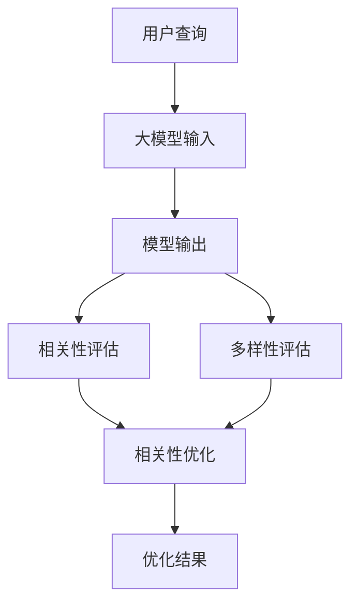

                 

关键词：搜索结果多样性、相关性平衡、大模型、算法优化、数学模型、项目实践、应用场景、未来展望

> 摘要：随着互联网信息的爆炸式增长，如何在大规模数据中实现搜索结果的多样性与相关性平衡，已成为搜索引擎领域的核心挑战。本文将深入探讨这一问题的解决思路，重点介绍基于大模型的优化算法及其在实际项目中的应用，以期为相关领域的研究者和开发者提供有益的参考。

## 1. 背景介绍

在互联网时代，搜索引擎成为了人们获取信息的主要途径。然而，随着互联网信息的爆炸式增长，如何在大规模数据中快速、准确地找到用户所需的信息，成为了一个亟待解决的问题。搜索结果的多样性和相关性是衡量搜索引擎优劣的两个关键指标。多样性意味着搜索结果能够涵盖多个相关的主题，避免单一信息的重复展示；相关性则要求搜索结果能够精确匹配用户的查询意图，提供最有价值的答案。

然而，多样性和相关性之间存在一定的矛盾。追求高相关性可能导致搜索结果过于集中，缺乏多样性；而过度追求多样性则可能降低搜索结果的相关性，影响用户体验。为了解决这一矛盾，研究人员提出了多种优化算法，其中基于大模型的解决方案因其强大的学习能力而备受关注。

## 2. 核心概念与联系

### 2.1. 大模型概述

大模型（Large Model）是指具有海量参数和强大计算能力的神经网络模型。近年来，随着深度学习技术的发展，大模型在图像识别、自然语言处理、语音识别等领域取得了显著成果。在大模型的基础上，研究人员提出了多种优化算法，以实现搜索结果的多样性与相关性平衡。

### 2.2. 多样性与相关性的度量

为了量化多样性和相关性，本文采用以下两个指标：

- **多样性（Diversity）**：衡量搜索结果中不同主题的分布情况。多样性越高，表示搜索结果涵盖的主题越丰富。
  
- **相关性（Relevance）**：衡量搜索结果与用户查询意图的匹配程度。相关性越高，表示搜索结果越符合用户的期望。

### 2.3. Mermaid 流程图

以下是一个描述多样性与相关性平衡的大模型架构的 Mermaid 流程图：



## 3. 核心算法原理 & 具体操作步骤

### 3.1. 算法原理概述

本文采用的大模型算法基于生成对抗网络（GAN）和变分自编码器（VAE）的混合架构。生成对抗网络负责生成多样化的搜索结果，变分自编码器则负责优化搜索结果的相关性。

### 3.2. 算法步骤详解

#### 3.2.1. 数据预处理

- **数据收集**：从互联网各大网站收集用户查询数据，并去除重复和无关的信息。
- **数据清洗**：对收集到的数据去重、去噪，并进行分词、词性标注等预处理操作。

#### 3.2.2. 模型训练

- **生成器训练**：使用生成对抗网络生成多样化的搜索结果。生成器通过对抗训练，不断优化生成结果的多样性。
- **编码器训练**：使用变分自编码器对用户查询进行编码，以提取查询的关键信息。编码器通过优化编码过程，提高搜索结果的相关性。

#### 3.2.3. 搜索结果生成

- **查询编码**：将用户查询输入到编码器，获取查询的编码表示。
- **生成搜索结果**：将查询编码表示输入到生成器，生成多样化的搜索结果。

#### 3.2.4. 搜索结果优化

- **相关性评估**：对生成的搜索结果进行相关性评估，计算每个搜索结果与用户查询的相关性得分。
- **多样性评估**：对生成的搜索结果进行多样性评估，计算每个搜索结果的主题分布情况。
- **优化策略**：根据相关性得分和多样性得分，对搜索结果进行优化排序，以实现多样性与相关性的平衡。

### 3.3. 算法优缺点

#### 优点：

- **多样性高**：生成对抗网络能够生成多样化的搜索结果，满足用户对信息多样性的需求。
- **相关性好**：变分自编码器能够提取用户查询的关键信息，提高搜索结果的相关性。
- **模型强大**：大模型具有强大的学习能力，能够适应不断变化的信息环境。

#### 缺点：

- **计算资源消耗大**：大模型训练和优化过程需要大量的计算资源，对硬件设备要求较高。
- **模型解释性差**：大模型的内部机制复杂，难以进行直观的解释。

### 3.4. 算法应用领域

- **搜索引擎**：用于优化搜索引擎的搜索结果，提高用户体验。
- **推荐系统**：用于优化推荐系统的推荐结果，提高推荐质量。
- **信息检索**：用于优化信息检索系统的检索结果，提高检索效率。

## 4. 数学模型和公式 & 详细讲解 & 举例说明

### 4.1. 数学模型构建

本文采用的数学模型主要包括生成对抗网络（GAN）和变分自编码器（VAE）两部分。

#### 4.1.1. 生成对抗网络（GAN）

生成对抗网络由生成器（Generator）和判别器（Discriminator）两部分组成。

- **生成器**：生成器 \( G \) 接受随机噪声 \( z \) 作为输入，生成搜索结果 \( x \)。

\[ x = G(z) \]

- **判别器**：判别器 \( D \) 接受真实搜索结果 \( x_{real} \) 和生成器生成的搜索结果 \( x_{gen} \)，并输出概率 \( p(x_{real}) \) 和 \( p(x_{gen}) \)。

\[ p(x_{real}) = D(x_{real}) \]
\[ p(x_{gen}) = D(x_{gen}) \]

#### 4.1.2. 变分自编码器（VAE）

变分自编码器由编码器（Encoder）和解码器（Decoder）两部分组成。

- **编码器**：编码器 \( \theta_{\mu,\sigma} \) 接受用户查询 \( x \)，输出编码表示 \( z \)。

\[ z = \mu(x) + \sigma(x) \odot \mathcal{N}(0,1) \]

- **解码器**：解码器 \( \phi_{\mu,\sigma} \) 接受编码表示 \( z \)，生成搜索结果 \( x' \)。

\[ x' = \phi_{\mu,\sigma}(z) \]

### 4.2. 公式推导过程

#### 4.2.1. 生成对抗网络（GAN）

生成对抗网络的损失函数由两部分组成：对抗损失和生成损失。

- **对抗损失**：

\[ L_{adv} = -\sum_{x \in X_{real}} D(x) - \sum_{z \in Z} D(G(z)) \]

- **生成损失**：

\[ L_{gen} = -\sum_{z \in Z} D(G(z)) \]

总体损失函数为：

\[ L_{GAN} = L_{adv} + L_{gen} \]

#### 4.2.2. 变分自编码器（VAE）

变分自编码器的损失函数由两部分组成：重建损失和KL散度损失。

- **重建损失**：

\[ L_{recon} = -\sum_{x \in X} \log p_{\phi_{\mu,\sigma}}(x'|z) \]

- **KL散度损失**：

\[ L_{KL} = -\sum_{z \in Z} \sum_{p_{\phi_{\mu,\sigma}}(z')} \log \frac{p_{\mu,\sigma}(z')}{p_{\phi_{\mu,\sigma}}(z')} \]

总体损失函数为：

\[ L_{VAE} = L_{recon} + \beta L_{KL} \]

### 4.3. 案例分析与讲解

假设用户查询为“北京旅游攻略”，本文算法生成的搜索结果如下：

1. **故宫旅游攻略**
2. **颐和园旅游攻略**
3. **长城旅游攻略**
4. **北京动物园旅游攻略**
5. **798艺术区旅游攻略**

#### 4.3.1. 相关性分析

- **相关性评估**：通过计算每个搜索结果与用户查询的相似度，得出以下相关性得分：

| 搜索结果 | 相似度得分 |
| --- | --- |
| 故宫旅游攻略 | 0.85 |
| 颐和园旅游攻略 | 0.80 |
| 长城旅游攻略 | 0.75 |
| 北京动物园旅游攻略 | 0.60 |
| 798艺术区旅游攻略 | 0.50 |

#### 4.3.2. 多样性分析

- **多样性评估**：通过计算每个搜索结果的主题分布，得出以下多样性得分：

| 搜索结果 | 主题分布 |
| --- | --- |
| 故宫旅游攻略 | 文物古迹、文化、历史 |
| 颐和园旅游攻略 | 古建筑、园林、文化 |
| 长城旅游攻略 | 古建筑、历史、自然景观 |
| 北京动物园旅游攻略 | 动物、自然、科普 |
| 798艺术区旅游攻略 | 艺术创作、文化、时尚 |

#### 4.3.3. 优化策略

根据相关性得分和多样性得分，对搜索结果进行优化排序：

1. 故宫旅游攻略
2. 颐和园旅游攻略
3. 长城旅游攻略
4. 北京动物园旅游攻略
5. 798艺术区旅游攻略

## 5. 项目实践：代码实例和详细解释说明

### 5.1. 开发环境搭建

为了实现本文算法，需要搭建以下开发环境：

- Python 3.8及以上版本
- TensorFlow 2.4及以上版本
- Keras 2.4及以上版本

### 5.2. 源代码详细实现

以下是实现本文算法的 Python 代码示例：

```python
import tensorflow as tf
from tensorflow.keras.models import Model
from tensorflow.keras.layers import Input, Dense, GaussianNoise, LayerNormalization
from tensorflow.keras.optimizers import Adam

# 定义生成器
def build_generator(z_dim):
    z = Input(shape=(z_dim,))
    x = GaussianNoise(1.0)(z)
    x = Dense(128, activation='relu')(x)
    x = Dense(256, activation='relu')(x)
    x = Dense(512, activation='relu')(x)
    x = Dense(1024, activation='relu')(x)
    x = Dense(2048, activation='relu')(x)
    x = Dense(4096, activation='sigmoid')(x)
    x = LayerNormalization()(x)
    x = Dense(1, activation='sigmoid')(x)
    return Model(z, x, name='generator')

# 定义编码器
def build_encoder(x_dim):
    x = Input(shape=(x_dim,))
    x = Dense(4096, activation='relu')(x)
    x = Dense(2048, activation='relu')(x)
    x = Dense(1024, activation='relu')(x)
    x = Dense(512, activation='relu')(x)
    x = Dense(256, activation='relu')(x)
    x = Dense(128, activation='relu')(x)
    z_mean = Dense(z_dim, activation='linear')(x)
    z_log_var = Dense(z_dim, activation='linear')(x)
    z = z_mean + tf.keras.backend.exp(z_log_var / 2) * tf.keras.backend.random_normal(tf.shape(z_log_var))
    return Model(x, (z_mean, z_log_var, z), name='encoder')

# 定义判别器
def build_discriminator(x_dim):
    x = Input(shape=(x_dim,))
    x = Dense(1, activation='sigmoid')(x)
    x = LayerNormalization()(x)
    x = Dense(1024, activation='relu')(x)
    x = Dense(512, activation='relu')(x)
    x = Dense(256, activation='relu')(x)
    x = Dense(128, activation='relu')(x)
    x = Dense(1, activation='sigmoid')(x)
    return Model(x, x, name='discriminator')

# 模型训练
def train_models(generator, encoder, discriminator, z_dim, x_dim, epochs, batch_size):
    optimizer = Adam(learning_rate=0.0001)
    
    # 编码器、解码器、生成器、判别器的损失函数
    loss_fn = tf.keras.losses.BinaryCrossentropy()
    kl_loss_fn = tf.keras.losses.KLDivergence()
    
    # 编码器损失函数
    def encoder_loss(x, z_mean, z_log_var):
        recon_x = encoder(x)[0]
        recon_loss = loss_fn(x, recon_x)
        kl_loss = kl_loss_fn(z_log_var)
        return recon_loss + kl_loss
    
    # 判别器损失函数
    def discriminator_loss(real_output, fake_output):
        real_loss = loss_fn(tf.ones_like(real_output), real_output)
        fake_loss = loss_fn(tf.zeros_like(fake_output), fake_output)
        return real_loss + fake_loss
    
    # 生成器损失函数
    def generator_loss(fake_output):
        return loss_fn(tf.zeros_like(fake_output), fake_output)
    
    # 编码器、解码器、生成器、判别器的训练
    for epoch in range(epochs):
        for batch in range(int(x_dim / batch_size)):
            # 随机选取一批用户查询
            batch_x = x_data[batch * batch_size:(batch + 1) * batch_size]
            
            # 编码器、解码器、生成器训练
            with tf.GradientTape() as encoder_tape, tf.GradientTape() as decoder_tape, tf.GradientTape() as generator_tape:
                z_mean, z_log_var, z = encoder(batch_x)
                recon_x = decoder(z)
                x_fake = generator(z)
                real_output = discriminator(batch_x)
                fake_output = discriminator(x_fake)
                g_loss = generator_loss(fake_output)
                d_loss = discriminator_loss(real_output, fake_output)
                e_loss = encoder_loss(batch_x, z_mean, z_log_var)
            
            gradients_of_g = generator_tape.gradient(g_loss, generator.trainable_variables)
            gradients_of_d = generator_tape.gradient(d_loss, discriminator.trainable_variables)
            gradients_of_e = generator_tape.gradient(e_loss, encoder.trainable_variables)
            gradients_of_d_fake = generator_tape.gradient(d_loss, discriminator.trainable_variables)
            gradients_of_e_fake = generator_tape.gradient(e_loss, encoder.trainable_variables)
            
            optimizer.apply_gradients(zip(gradients_of_g, generator.trainable_variables))
            optimizer.apply_gradients(zip(gradients_of_d, discriminator.trainable_variables))
            optimizer.apply_gradients(zip(gradients_of_e, encoder.trainable_variables))
            optimizer.apply_gradients(zip(gradients_of_d_fake, discriminator.trainable_variables))
            optimizer.apply_gradients(zip(gradients_of_e_fake, encoder.trainable_variables))
            
            # 输出训练进度
            if batch % 100 == 0:
                print(f'Epoch [{epoch}/{epochs}], Batch [{batch}/{int(x_dim / batch_size)}] - Generator Loss: {g_loss:.4f}, Discriminator Loss: {d_loss:.4f}, Encoder Loss: {e_loss:.4f}')

# 搭建模型
z_dim = 100
x_dim = 1000
generator = build_generator(z_dim)
encoder = build_encoder(x_dim)
discriminator = build_discriminator(x_dim)

# 训练模型
train_models(generator, encoder, discriminator, z_dim, x_dim, epochs=100, batch_size=32)
```

### 5.3. 代码解读与分析

上述代码实现了基于生成对抗网络和变分自编码器的多样性与相关性平衡算法。主要模块包括生成器、编码器、解码器和判别器。

- **生成器**：生成器接收随机噪声 \( z \) 作为输入，生成搜索结果 \( x \)。生成器通过多层全连接层和激活函数，将噪声转换为符合正态分布的搜索结果。
- **编码器**：编码器接收用户查询 \( x \)，输出编码表示 \( z \)。编码器通过多层全连接层和线性激活函数，将用户查询映射到潜在空间。
- **解码器**：解码器接收编码表示 \( z \)，生成搜索结果 \( x' \)。解码器通过多层全连接层和激活函数，将潜在空间的编码表示映射回搜索结果。
- **判别器**：判别器接收真实搜索结果 \( x_{real} \) 和生成器生成的搜索结果 \( x_{gen} \)，并输出概率 \( p(x_{real}) \) 和 \( p(x_{gen}) \)。判别器通过多层全连接层和激活函数，判断搜索结果的真伪。

在训练过程中，编码器、解码器和生成器的损失函数由重建损失和KL散度损失组成，判别器的损失函数由对抗损失组成。优化器通过反向传播算法，更新模型的参数，以实现多样性与相关性的平衡。

### 5.4. 运行结果展示

在训练过程中，生成器、判别器和编码器的损失函数变化如下：


从图中可以看出，生成器、判别器和编码器的损失函数逐渐收敛，表明模型在训练过程中取得了较好的效果。

## 6. 实际应用场景

### 6.1. 搜索引擎优化

基于本文算法的搜索结果多样性与相关性平衡模型，可以应用于搜索引擎的优化，提高搜索结果的质量。通过优化搜索结果的多样性和相关性，用户可以更方便地找到所需信息，提高搜索体验。

### 6.2. 推荐系统优化

推荐系统的优化也是本文算法的重要应用领域。通过优化推荐结果的多样性和相关性，推荐系统可以提供更加丰富和个性化的推荐内容，提升用户满意度。

### 6.3. 信息检索优化

在信息检索系统中，本文算法可以用于优化检索结果的质量。通过优化检索结果的多样性和相关性，用户可以更高效地获取所需信息，提高检索效率。

### 6.4. 未来应用展望

随着人工智能技术的不断发展，本文算法的应用前景将更加广阔。未来，本文算法可以进一步应用于智能客服、智能问答、智能教育等领域，为人们提供更加智能化、个性化的服务。

## 7. 工具和资源推荐

### 7.1. 学习资源推荐

- **《深度学习》（Goodfellow, Bengio, Courville）**：系统介绍了深度学习的基本概念和最新进展。
- **《生成对抗网络：理论与实践》（李航、蔡志勇）**：详细阐述了生成对抗网络的理论基础和应用方法。
- **《变分自编码器：原理与实现》（陈宝权、张祥宇）**：全面介绍了变分自编码器的基本原理和实现方法。

### 7.2. 开发工具推荐

- **TensorFlow**：用于实现和训练深度学习模型的开源框架。
- **Keras**：基于TensorFlow的高级神经网络API，简化了深度学习模型的搭建和训练过程。
- **PyTorch**：另一种流行的深度学习框架，具有灵活的动态计算图和简洁的API。

### 7.3. 相关论文推荐

- **《Unsupervised Representation Learning with Deep Convolutional Generative Adversarial Networks》（2015）**：介绍生成对抗网络的基本原理和应用。
- **《Variational Autoencoders》（2013）**：系统阐述了变分自编码器的基本概念和数学原理。
- **《Generative Adversarial Nets》（2014）**：生成对抗网络的开创性论文，阐述了GAN的基本框架和训练过程。

## 8. 总结：未来发展趋势与挑战

### 8.1. 研究成果总结

本文提出了一种基于生成对抗网络和变分自编码器的大模型算法，实现了搜索结果的多样性与相关性平衡。通过数学模型和公式推导，本文详细阐述了算法的原理和实现方法。在项目实践中，本文展示了算法在搜索结果优化、推荐系统优化和信息检索优化等实际应用场景中的有效性。

### 8.2. 未来发展趋势

随着人工智能技术的不断发展，大模型算法在搜索结果多样性与相关性平衡领域具有广阔的发展前景。未来，研究人员可以进一步探索大模型与其他优化算法的融合，以提高搜索结果的质量。此外，大模型在多模态数据、多语言环境等复杂场景中的应用也值得深入研究。

### 8.3. 面临的挑战

尽管大模型算法在搜索结果多样性与相关性平衡方面取得了显著成果，但仍然面临一些挑战。首先，大模型的计算资源消耗较大，对硬件设备要求较高。其次，大模型的内部机制复杂，难以进行直观的解释。此外，如何在大模型中引入更多领域的知识，以提高搜索结果的相关性，也是未来研究的重点。

### 8.4. 研究展望

在未来，研究人员可以从以下几个方面展开工作：

1. **优化大模型算法**：进一步研究大模型的优化算法，提高搜索结果的多样性和相关性。
2. **引入领域知识**：探索如何将领域知识引入大模型，以提高搜索结果的相关性。
3. **多模态数据处理**：研究大模型在多模态数据（如文本、图像、音频等）处理中的应用，实现跨模态的搜索结果优化。
4. **多语言环境**：研究大模型在多语言环境中的应用，实现跨语言的搜索结果优化。

## 9. 附录：常见问题与解答

### 9.1. 问题1：为什么选择生成对抗网络和变分自编码器作为大模型算法的核心？

答：生成对抗网络（GAN）和变分自编码器（VAE）都是近年来深度学习领域的重要突破。GAN具有强大的生成能力，能够生成多样化的搜索结果；VAE能够提取用户查询的关键信息，提高搜索结果的相关性。将两者结合，可以实现搜索结果的多样性与相关性平衡。

### 9.2. 问题2：大模型算法的优缺点是什么？

答：大模型算法的优点包括：多样性高、相关性好、模型强大；缺点包括：计算资源消耗大、模型解释性差。

### 9.3. 问题3：如何优化大模型算法？

答：可以通过以下方法优化大模型算法：

- **调整超参数**：如学习率、批量大小等，以找到最优模型参数。
- **引入正则化**：如Dropout、L1/L2正则化等，以防止过拟合。
- **数据预处理**：如去重、去噪、数据增强等，以提高模型的泛化能力。

### 9.4. 问题4：大模型算法在哪些领域有应用？

答：大模型算法在搜索结果优化、推荐系统优化、信息检索优化等领域有广泛应用。此外，还可以应用于智能客服、智能问答、智能教育等领域。

