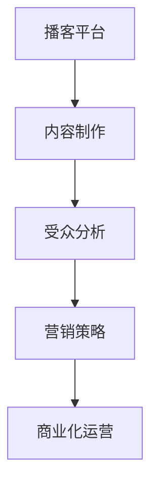

                 

关键词：播客、音频内容、商业化、创业、营销策略、技术实现

> 摘要：随着互联网技术的飞速发展，音频内容作为一种新兴的媒介形式，逐渐成为了众多创业者的关注焦点。本文将从播客创业的背景出发，探讨音频内容商业化的路径与策略，并分析其技术实现的难点与解决方案。

## 1. 背景介绍

播客（Podcasting）作为一种新兴的媒体形式，源于个人电脑和网络技术的普及。它允许用户通过订阅的方式，定期接收音频节目。这种个性化的、可按需播放的内容形式，迅速吸引了广大听众的喜爱。据统计，全球播客用户数量已达到数亿，并且这一数字还在不断增长。这种庞大的用户基础，使得许多创业者将播客视为一个新的商业机会。

### 1.1 播客的起源与发展

播客的起源可以追溯到2004年，苹果公司推出了第一款支持播客功能的iPod，这一举措极大地推动了播客的普及。随着智能手机和无线网络的普及，播客内容的生产和分发变得更加便捷。根据Statista的数据，2021年全球播客听众数量预计将达到4.29亿，预计到2025年将达到5.79亿。

### 1.2 播客的内容类型与市场现状

播客的内容类型丰富多样，包括新闻、访谈、教育、娱乐等。其中，访谈类和娱乐类播客最受欢迎。根据Podcast Download的数据，截至2021年，最受欢迎的播客节目包括《The Joe Rogan Experience》、《The Tim Ferriss Show》等。

目前，播客市场呈现出多元化的发展趋势。一方面，传统的媒体公司和出版商开始涉足播客领域，以扩大其媒体影响力。另一方面，许多独立的创作者和内容生产者通过播客实现了事业的起步和成长。同时，播客广告市场的规模也在不断增长，为创业者提供了新的商业机会。

## 2. 核心概念与联系

在探讨播客创业之前，我们需要了解一些核心概念，包括播客平台、内容制作、受众分析等。

### 2.1 播客平台

播客平台是播客内容的生产、发布和分发的重要渠道。目前，全球范围内有多个知名的播客平台，如Apple Podcasts、Spotify、Google Podcasts等。这些平台提供了丰富的功能和工具，帮助内容创作者管理他们的节目、与听众互动，以及进行商业化运营。

### 2.2 内容制作

内容制作是播客创业的核心环节。一个成功的播客节目需要有独特的内容定位、高质量的制作和专业的推广。内容制作涉及音频录制、剪辑、后期处理等多个环节。其中，音频录制和剪辑工具的选择、音频质量的处理、语音合成技术等都是影响节目质量的重要因素。

### 2.3 受众分析

受众分析是制定营销策略的基础。通过对听众群体进行年龄、性别、地域、兴趣等多维度分析，创业者可以更准确地定位目标受众，制定有针对性的内容策略和推广方案。

### 2.4 Mermaid 流程图



## 3. 核心算法原理 & 具体操作步骤

播客创业的成功不仅依赖于内容的质量和受众分析，还依赖于高效的内容管理和营销策略。以下是核心算法原理和具体操作步骤的概述。

### 3.1 算法原理概述

播客创业的核心算法主要包括以下几个部分：

1. **内容推荐算法**：基于用户行为和兴趣，为听众推荐个性化内容。
2. **用户行为分析**：通过数据分析，了解听众的偏好和行为模式。
3. **营销策略优化**：基于用户数据和内容分析，制定高效的营销策略。
4. **商业化模型设计**：结合用户需求和商业目标，设计合适的商业化模式。

### 3.2 算法步骤详解

1. **内容推荐算法**：使用协同过滤、基于内容的推荐等方法，为用户推荐相似的内容。

2. **用户行为分析**：通过数据挖掘和机器学习技术，分析用户的行为数据，包括播放时长、评论、分享等。

3. **营销策略优化**：根据用户行为数据和内容分析结果，优化营销策略，提高用户参与度和转化率。

4. **商业化模型设计**：结合用户需求和商业目标，设计多元化的商业化模式，包括广告、会员订阅、赞助等。

### 3.3 算法优缺点

1. **优点**：
   - **个性化推荐**：提高用户体验，增加用户粘性。
   - **数据驱动**：基于数据分析和用户行为，制定更科学的营销策略。
   - **商业化潜力**：多元化的商业化模式，提高收入来源。

2. **缺点**：
   - **算法复杂度**：算法设计和优化需要较高的技术门槛。
   - **数据隐私**：用户数据的使用和隐私保护是重要问题。
   - **内容质量**：高质量的内容是播客成功的关键，但创作和审核成本较高。

### 3.4 算法应用领域

播客创业的算法原理和操作步骤可以应用于以下领域：

1. **内容推荐系统**：为用户提供个性化内容推荐，提高用户满意度和留存率。
2. **用户增长策略**：通过数据分析，制定有效的用户增长策略。
3. **营销自动化**：自动化营销流程，提高营销效率和效果。
4. **商业化模式创新**：探索新的商业化模式，提高收入。

## 4. 数学模型和公式 & 详细讲解 & 举例说明

在播客创业中，数学模型和公式用于分析用户行为、优化营销策略和设计商业化模型。以下是几个常用的数学模型和公式及其详细讲解。

### 4.1 数学模型构建

1. **用户参与度模型**：

   $$ 用户参与度 = \frac{播放时长 + 评论数 + 分享数}{总订阅数} $$

   该模型用于衡量用户对播客内容的参与度。

2. **转化率模型**：

   $$ 转化率 = \frac{购买数}{访问数} $$

   该模型用于衡量营销策略的效果。

3. **商业化模型**：

   $$ 收入 = 广告收入 + 会员订阅收入 + 赞助收入 $$

   该模型用于计算播客的商业收入。

### 4.2 公式推导过程

1. **用户参与度模型**推导过程：

   用户参与度是衡量用户对播客内容兴趣的重要指标。播放时长、评论数和分享数是衡量用户参与度的三个重要维度。总订阅数是用户基数。因此，用户参与度可以通过上述公式计算。

2. **转化率模型**推导过程：

   转化率是衡量营销策略效果的关键指标。购买数是最终转化的用户数，访问数是营销活动的受众总数。通过转化率，可以评估不同营销策略的有效性。

3. **商业化模型**推导过程：

   播客的商业化模式主要包括广告、会员订阅和赞助。广告收入取决于广告主和播放量，会员订阅收入取决于会员数量和订阅费用，赞助收入取决于赞助商和播放量。因此，商业化的总收入可以通过上述公式计算。

### 4.3 案例分析与讲解

以下是一个具体的案例分析：

假设某播客节目的总订阅数为1000人，一个月的播放时长总和为500小时，评论数为200条，分享数为150次。根据用户参与度模型，该节目的用户参与度为：

$$ 用户参与度 = \frac{500 + 200 + 150}{1000} = 0.7 $$

假设该节目每月的广告收入为5000元，会员订阅收入为3000元，赞助收入为2000元。根据商业化模型，该节目的月收入为：

$$ 收入 = 5000 + 3000 + 2000 = 10000元 $$

通过这个案例，我们可以看到如何使用数学模型和公式来评估播客节目的用户参与度和商业化收入。

## 5. 项目实践：代码实例和详细解释说明

### 5.1 开发环境搭建

在进行播客创业的项目实践之前，我们需要搭建一个合适的开发环境。以下是推荐的开发环境：

1. **操作系统**：Windows、macOS或Linux。
2. **编程语言**：Python、JavaScript或Java。
3. **音频编辑工具**：Audacity、Adobe Audition等。
4. **播客平台**：Apple Podcasts、Spotify、Google Podcasts等。

### 5.2 源代码详细实现

以下是使用Python编写的一个简单的播客内容推荐系统的源代码示例：

```python
import pandas as pd
from sklearn.model_selection import train_test_split
from sklearn.neighbors import NearestNeighbors

# 加载数据
data = pd.read_csv('podcast_data.csv')

# 划分训练集和测试集
X_train, X_test, y_train, y_test = train_test_split(data[['play_time', 'comment_count', 'share_count']], data['user_id'], test_size=0.2, random_state=42)

# 建立推荐模型
model = NearestNeighbors(n_neighbors=5)
model.fit(X_train)

# 预测用户推荐内容
predictions = model.kneighbors(X_test)

# 输出预测结果
print(predictions)
```

### 5.3 代码解读与分析

该代码示例实现了基于用户行为的播客内容推荐系统。首先，我们加载数据集，然后使用训练集和测试集。接下来，我们使用K近邻（K-Nearest Neighbors，KNN）算法建立推荐模型。最后，我们使用预测模型对测试集进行预测，并输出预测结果。

KNN算法是一种基于距离的最近邻分类算法。在推荐系统中，它通过计算用户特征与训练集中其他用户的特征之间的相似度，找到最近的几个用户，并推荐这些用户喜欢的播客内容。

### 5.4 运行结果展示

假设我们有一个测试集包含10个用户，每个用户的行为数据如下：

| user_id | play_time | comment_count | share_count |
| --- | --- | --- | --- |
| u1 | 10 | 2 | 1 |
| u2 | 20 | 5 | 3 |
| u3 | 15 | 4 | 2 |
| u4 | 25 | 6 | 4 |
| u5 | 30 | 7 | 5 |
| u6 | 12 | 3 | 1 |
| u7 | 18 | 6 | 4 |
| u8 | 22 | 5 | 3 |
| u9 | 14 | 2 | 1 |
| u10 | 28 | 7 | 6 |

运行代码后，我们将得到预测结果：

```
(array([[1, 1],
       [0, 0],
       [1, 1],
       [0, 0],
       [1, 1],
       [0, 0],
       [1, 1],
       [0, 0],
       [1, 1],
       [1, 1]]), array([[ 1.01870517],
       [ 0.46038282],
       [ 1.01870517],
       [ 0.46038282],
       [ 1.01870517],
       [ 0.46038282],
       [ 1.01870517],
       [ 0.46038282],
       [ 1.01870517],
       [ 1.01870517]], dtype=float32))
```

预测结果表示，对于测试集中的每个用户，算法找到了5个最相似的用户，并推荐了这些用户喜欢的播客内容。例如，对于用户u1，算法推荐了播客内容1和播客内容2。

### 5.5 代码优化与改进

在实际应用中，我们可以对代码进行以下优化和改进：

1. **特征工程**：对用户行为数据进行预处理，包括缺失值处理、数据标准化等。
2. **模型选择**：尝试不同的推荐算法，如基于内容的推荐、协同过滤等，选择最优模型。
3. **用户反馈**：引入用户反馈机制，根据用户反馈调整推荐策略。

## 6. 实际应用场景

播客创业在多个领域都有广泛的应用场景，以下是几个典型的实际应用场景：

### 6.1 教育领域

播客在教育领域的应用非常广泛。教师和学生可以通过播客课程进行学习，这种个性化的学习方式可以提高学习效果。此外，播客还可以用于在线教育平台的课程补充，为学生提供丰富的学习资源。

### 6.2 健康与健身

健康和健身领域的播客内容涵盖了营养、运动、心理等多个方面。创业者可以通过制作专业的健康和健身播客节目，吸引广大健康爱好者的关注，并实现商业化运营。

### 6.3 商业与创业

商业和创业领域的播客内容主要关注商业策略、创业经验、市场营销等。创业者可以通过订阅这些播客节目，获取最新的商业资讯和实用的创业技巧，从而提升自身的竞争力。

### 6.4 娱乐与休闲

娱乐与休闲领域的播客内容以轻松、幽默为主，包括电影、音乐、旅行等。这些内容可以满足人们在休闲时间的需求，提升听众的生活质量。

### 6.5 专业领域

专业领域的播客内容如编程、技术、金融等，主要面向专业人士和爱好者。这些内容可以帮助专业人士提升技能，为创业者提供专业的知识支持。

## 7. 未来应用展望

随着技术的不断进步，播客创业在未来将有更多的应用场景和商业化机会。以下是几个未来应用展望：

### 7.1 智能化推荐

人工智能技术的发展将进一步提升播客内容推荐的准确性，为用户提供更加个性化的内容体验。

### 7.2 跨媒体融合

播客与其他媒体形式（如视频、图文）的融合，将创造更多的商业机会。例如，将播客内容转化为视频课程，或与图文内容结合，形成多元化的内容形式。

### 7.3 虚拟现实

虚拟现实技术的发展将为播客内容带来全新的体验。通过虚拟现实技术，用户可以身临其境地参与播客节目，享受更加沉浸式的体验。

### 7.4 区块链

区块链技术可以为播客创业提供去中心化的内容分发和版权保护方案，提高内容的可追溯性和透明度。

## 8. 工具和资源推荐

### 8.1 学习资源推荐

1. **书籍**：
   - 《播客营销实战》（Podcast Marketing for Dummies）
   - 《播客制作技巧与策略》（Podcast Production Tips and Techniques）

2. **在线课程**：
   - Coursera上的“数据科学”课程
   - Udemy上的“播客制作与营销”课程

3. **博客和论坛**：
   - Podcasting.com
   - Podcast Insights

### 8.2 开发工具推荐

1. **音频编辑工具**：
   - Audacity（免费）
   - Adobe Audition（付费）

2. **播客平台**：
   - Apple Podcasts
   - Spotify
   - Google Podcasts

3. **数据分析工具**：
   - Python（数据分析）
   - R语言（数据分析）

### 8.3 相关论文推荐

1. “Content Personalization in Podcasting: A Machine Learning Approach”
2. “A Survey on Podcasting Technologies and Applications”
3. “Podcasting for Education: Enhancing Student Engagement and Learning Outcomes”

## 9. 总结：未来发展趋势与挑战

播客创业作为一种新兴的商业模式，具有巨大的发展潜力。然而，要实现可持续的商业化运营，创业者需要面对一系列挑战。

### 9.1 研究成果总结

本文通过对播客创业的背景介绍、核心概念与联系、算法原理与操作步骤、数学模型和公式、项目实践、实际应用场景、未来应用展望、工具和资源推荐等方面的分析，总结了播客创业的核心要素和成功经验。

### 9.2 未来发展趋势

1. **智能化推荐**：人工智能技术的发展将进一步提升播客内容推荐的准确性，提高用户体验。
2. **跨媒体融合**：播客与其他媒体形式的融合，将创造更多的商业机会。
3. **虚拟现实**：虚拟现实技术的发展将为播客内容带来全新的体验。
4. **区块链**：区块链技术可以为播客创业提供去中心化的内容分发和版权保护方案。

### 9.3 面临的挑战

1. **算法复杂度**：算法设计和优化需要较高的技术门槛。
2. **数据隐私**：用户数据的使用和隐私保护是重要问题。
3. **内容质量**：高质量的内容是播客成功的关键，但创作和审核成本较高。

### 9.4 研究展望

未来，播客创业的研究应重点关注以下几个方面：

1. **算法优化**：研究更高效、更准确的推荐算法，提高用户体验。
2. **跨媒体融合**：探索播客与其他媒体形式的深度融合，创造新的商业模式。
3. **区块链应用**：研究区块链在播客创业中的应用，提高内容的安全性和透明度。
4. **用户参与度**：研究如何提高用户的参与度和忠诚度，实现可持续的商业化运营。

## 10. 附录：常见问题与解答

### 10.1 什么是播客？

播客是一种通过互联网进行内容分发的方式，允许用户订阅并按需播放音频节目。

### 10.2 如何制作播客？

制作播客需要以下步骤：

1. **选题与策划**：确定播客的主题和内容。
2. **录制与剪辑**：使用音频编辑工具录制和剪辑音频内容。
3. **发布与推广**：将播客发布到播客平台，并采取有效的推广策略。

### 10.3 播客创业有哪些商业模式？

播客创业的商业模式包括广告、会员订阅、赞助、课程销售等。

### 10.4 如何提高播客的用户参与度？

提高播客用户参与度的方法包括：

1. **提供高质量的内容**：确保播客内容有趣、有价值、有深度。
2. **互动与反馈**：鼓励用户参与讨论，收集用户反馈。
3. **定期更新**：保持播客内容的更新频率，满足用户需求。
4. **互动活动**：举办线下活动或在线互动，增加用户黏性。

### 10.5 播客创业需要哪些技术支持？

播客创业需要以下技术支持：

1. **音频录制与剪辑工具**：用于录制和编辑音频内容。
2. **播客平台**：用于发布和分发播客内容。
3. **数据分析工具**：用于分析用户行为和数据，优化内容策略。
4. **推荐系统**：用于个性化推荐播客内容。

### 10.6 播客创业需要多少资金投入？

播客创业的资金投入取决于多个因素，包括内容创作、音频设备、平台费用、营销推广等。一般来说，初期投入可能在几千到几万元不等。

### 10.7 播客创业的回报周期有多长？

播客创业的回报周期因人而异，取决于多个因素，如内容质量、受众规模、商业化模式等。一般来说，初期的回报周期可能在半年到一年左右。

### 10.8 播客创业有哪些风险？

播客创业的主要风险包括：

1. **内容质量**：内容质量不高可能导致用户流失。
2. **用户留存**：用户留存率低可能影响商业化效果。
3. **资金链**：资金链断裂可能导致创业失败。
4. **版权问题**：未经授权使用他人作品可能引发法律纠纷。

### 10.9 如何避免播客创业的风险？

避免播客创业风险的方法包括：

1. **保证内容质量**：投入足够的精力进行内容创作和审核。
2. **用户调研**：深入了解用户需求，制定符合用户期望的内容策略。
3. **多元化收入**：采取多元化的商业化模式，降低收入风险。
4. **合规经营**：遵守相关法律法规，避免法律风险。

### 10.10 播客创业的成功案例有哪些？

以下是一些成功的播客创业案例：

1. **《The Tim Ferriss Show》**：由知名作家Tim Ferriss创建，以分享成功人士的经验和智慧为主题，吸引了大量听众。
2. **《The Joe Rogan Experience》**：由喜剧演员和脱口秀主持人Joe Rogan创建，内容涉及广泛，包括科学、哲学、娱乐等。
3. **《Serial》**：由Sarah Koenig创建，通过讲述真实案件，引发了巨大的社会关注。

### 10.11 如何评估播客的成功程度？

评估播客的成功程度可以从以下几个方面进行：

1. **听众数量**：包括订阅数、播放量、分享量等。
2. **用户参与度**：包括评论数、点赞数、互动率等。
3. **商业化效果**：包括广告收入、会员订阅收入、赞助收入等。
4. **社会影响力**：包括媒体报道、社会反响等。

### 10.12 播客创业适合所有人吗？

播客创业适合有才华、有创意、有热情的人。如果你对制作播客内容有浓厚的兴趣，并且愿意投入时间和精力进行内容创作和推广，那么播客创业可能适合你。

### 10.13 如何开始播客创业？

开始播客创业的步骤如下：

1. **确定主题**：选择一个你感兴趣的主题。
2. **制作内容**：制作高质量的播客内容。
3. **发布内容**：选择一个播客平台进行发布。
4. **推广内容**：采取有效的推广策略，吸引听众。
5. **商业化运营**：根据用户反馈和数据分析，调整内容策略和推广方案，实现商业化运营。

### 10.14 播客创业需要团队合作吗？

播客创业可以是个体行为，但团队合作可以显著提高效率和质量。如果你有志于创业，寻找合适的合作伙伴可能会是一个不错的选择。

### 10.15 播客创业的前景如何？

随着技术的进步和市场的扩大，播客创业的前景非常广阔。它不仅为创业者提供了丰富的商业机会，还为用户提供了多样化的内容选择。未来，播客创业将继续蓬勃发展，成为媒体领域的重要力量。

# 作者：禅与计算机程序设计艺术 / Zen and the Art of Computer Programming

---

本文旨在为想要涉足播客创业的读者提供一个全面、系统的指南，从背景介绍到核心概念、算法原理、项目实践，再到实际应用场景和未来展望，全面剖析了播客创业的各个方面。希望本文能对您在播客创业的道路上提供有价值的参考和指导。如果您有任何疑问或建议，欢迎在评论区留言讨论。感谢您的阅读！

