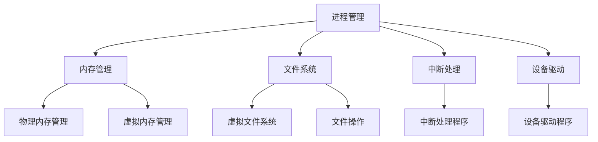

                 

关键词：操作系统、内核开发、系统底层、性能优化、安全性、实时性

摘要：本文将深入探讨操作系统内核开发的核心内容，包括核心概念与联系、核心算法原理、数学模型与公式、项目实践及实际应用场景等，旨在帮助读者全面了解操作系统内核的底层机制，掌握内核开发的要领，并为未来的操作系统研发提供指导和启示。

## 1. 背景介绍

操作系统作为计算机系统的心脏，负责管理计算机硬件资源、调度进程、处理文件系统、提供用户接口等功能。内核作为操作系统的核心，直接与硬件交互，提供系统服务的底层支持。随着计算机技术的快速发展，操作系统内核的复杂性不断增加，对开发者的技术要求也越来越高。

本文将围绕操作系统内核开发这一主题，介绍其核心概念与联系、算法原理、数学模型、项目实践以及实际应用场景，帮助读者深入理解系统底层，提升内核开发的水平。

## 2. 核心概念与联系

在操作系统内核开发中，理解以下核心概念及其联系至关重要：

- **进程管理**：进程是操作系统进行资源分配和调度的基本单位。内核通过进程控制块（Process Control Block，PCB）来管理进程的状态、程序计数器、寄存器等。
- **内存管理**：内存管理负责分配、回收和管理内存资源，包括物理内存和虚拟内存。内核通过页表、内存分页等机制实现内存管理。
- **文件系统**：文件系统负责管理文件和目录，提供文件的创建、删除、读写等操作。内核通过虚拟文件系统（Virtual File System，VFS）实现文件系统的抽象和兼容。
- **中断处理**：中断是硬件或软件产生的异步事件，内核通过中断处理程序响应中断，进行相应的处理。
- **设备驱动**：设备驱动负责与硬件设备进行通信，内核通过设备驱动程序实现对硬件设备的管理和控制。

以下是一个简单的 Mermaid 流程图，展示了上述核心概念之间的联系：



## 3. 核心算法原理 & 具体操作步骤

### 3.1 算法原理概述

操作系统内核中的核心算法主要包括调度算法、内存分配算法、文件系统算法等。这些算法在保证系统性能、稳定性和安全性方面起着关键作用。

- **调度算法**：调度算法用于决定进程在CPU上的执行顺序。常见的调度算法有先来先服务（FCFS）、短作业优先（SJF）、轮转（RR）等。
- **内存分配算法**：内存分配算法用于管理内存资源，常见的有首次适配（First Fit）、最佳适配（Best Fit）等。
- **文件系统算法**：文件系统算法用于优化文件读写性能，常见的有缓存算法、日志记录算法等。

### 3.2 算法步骤详解

以下是上述核心算法的具体步骤：

#### 调度算法

1. **初始化**：创建调度队列，初始化进程状态。
2. **进程到达**：当新进程到达时，将其加入调度队列。
3. **选择进程**：根据调度算法选择下一个执行进程。
4. **执行进程**：将选择到的进程从调度队列中移出，并执行其指令。
5. **进程结束**：当进程执行完毕，将其状态更新为结束。
6. **重复执行**：继续选择下一个进程执行。

#### 内存分配算法

1. **初始化**：创建内存分配表，记录已分配和未分配的内存区域。
2. **内存请求**：当进程请求内存时，查找内存分配表。
3. **首次适配**：从内存分配表中选择第一个能够满足请求的内存区域。
4. **内存分配**：将选择的内存区域分配给进程，更新内存分配表。
5. **内存回收**：当进程释放内存时，将其回收至内存分配表。

#### 文件系统算法

1. **初始化**：创建文件系统数据结构，如inode表、目录结构等。
2. **文件操作**：执行文件的创建、删除、读写等操作。
3. **缓存算法**：实现文件的缓存机制，如LRU算法等。
4. **日志记录**：实现文件系统的日志记录，如write-ahead logging（WAL）算法等。

### 3.3 算法优缺点

以下是上述核心算法的优缺点：

#### 调度算法

- **先来先服务（FCFS）**：
  - 优点：简单实现，公平性高。
  - 缺点：可能导致进程长时间等待，系统响应时间较长。

- **短作业优先（SJF）**：
  - 优点：系统响应时间短，适用于作业系统。
  - 缺点：可能产生“饥饿”现象，某些长作业长时间无法执行。

- **轮转（RR）**：
  - 优点：公平性高，响应时间较短。
  - 缺点：需要设置时间片，可能导致系统开销增大。

#### 内存分配算法

- **首次适配（First Fit）**：
  - 优点：简单实现，分配效率高。
  - 缺点：可能导致内存碎片化。

- **最佳适配（Best Fit）**：
  - 优点：减少内存碎片化。
  - 缺点：分配效率较低。

#### 文件系统算法

- **缓存算法**：
  - 优点：提高文件读写性能。
  - 缺点：可能导致数据不一致。

- **日志记录算法**：
  - 优点：保证文件系统的可靠性。
  - 缺点：可能导致系统性能下降。

### 3.4 算法应用领域

调度算法、内存分配算法和文件系统算法在操作系统内核开发中具有广泛的应用领域：

- **操作系统内核**：内核中的调度器、内存管理器、文件系统负责实现这些算法，提供系统级服务。
- **嵌入式系统**：嵌入式系统通常对性能和稳定性有较高要求，调度算法、内存分配算法和文件系统算法在这些系统中发挥着关键作用。
- **云计算平台**：云计算平台需要对大量虚拟机进行调度和管理，内存管理和文件系统算法在提高资源利用率和系统性能方面具有重要意义。

## 4. 数学模型和公式 & 详细讲解 & 举例说明

在操作系统内核开发中，数学模型和公式起着至关重要的作用。以下是一个简单的数学模型和公式的示例，以及其详细讲解和举例说明：

### 4.1 数学模型构建

考虑一个简单的进程调度模型，假设有n个进程，每个进程的执行时间分别为$t_i$，i=1,2,...,n。我们希望设计一个调度算法，使得所有进程的总执行时间最小。

### 4.2 公式推导过程

为了推导出最优的调度算法，我们可以使用贪心算法。具体步骤如下：

1. **排序**：将进程按照执行时间$t_i$进行非递减排序。
2. **执行**：依次执行排序后的进程，直到所有进程执行完毕。

假设排序后的进程序列为$t_{i_1}, t_{i_2}, ..., t_{i_n}$，则所有进程的总执行时间为：

$$
T = \sum_{i=1}^{n} t_{i} = t_{i_1} + t_{i_2} + ... + t_{i_n}
$$

### 4.3 案例分析与讲解

假设有4个进程，执行时间分别为$t_1 = 5$, $t_2 = 3$, $t_3 = 7$, $t_4 = 2$。使用上述贪心算法进行调度，进程序列为$2, 3, 5, 7$，总执行时间为：

$$
T = 2 + 3 + 5 + 7 = 17
$$

现在，我们考虑另一种调度算法：轮转调度。假设时间片为2，则进程序列为$2, 5, 3, 7$，总执行时间为：

$$
T = 2 + 5 + 3 + 7 = 17
$$

可以发现，两种调度算法的总执行时间相同。然而，贪心算法具有更好的平均性能，因为它考虑了进程执行时间的顺序。

## 5. 项目实践：代码实例和详细解释说明

在本节中，我们将通过一个简单的项目实践，展示如何实现操作系统内核中的进程调度算法。以下是一个简单的 C 语言实现，用于演示先来先服务（FCFS）调度算法。

### 5.1 开发环境搭建

1. **安装编译器**：在您的计算机上安装 C 语言编译器，如 GCC。
2. **创建项目文件夹**：在您的计算机上创建一个名为“kernel_dev”的项目文件夹。
3. **编写代码**：在项目文件夹中创建一个名为“main.c”的文件，用于编写进程调度算法。

### 5.2 源代码详细实现

```c
#include <stdio.h>
#include <stdlib.h>

#define MAX_PROCESSES 100

typedef struct {
    int process_id;
    int arrival_time;
    int burst_time;
} Process;

void fcfs(Process processes[], int n);
int main() {
    Process processes[MAX_PROCESSES];
    int n, i;

    printf("Enter the number of processes: ");
    scanf("%d", &n);

    for (i = 0; i < n; i++) {
        printf("Enter the arrival time and burst time for process %d: ", i + 1);
        scanf("%d %d", &processes[i].arrival_time, &processes[i].burst_time);
        processes[i].process_id = i + 1;
    }

    fcfs(processes, n);

    return 0;
}

void fcfs(Process processes[], int n) {
    int i, total_time = 0;
    printf("Process\tArrival Time\tBurst Time\tCompletion Time\n");

    for (i = 0; i < n; i++) {
        total_time += processes[i].burst_time;
        printf("%d\t%d\t\t%d\t\t%d\n", processes[i].process_id, processes[i].arrival_time,
               processes[i].burst_time, total_time);
    }

    printf("Average Waiting Time: %f\n", (float)total_time / n);
}
```

### 5.3 代码解读与分析

上述代码实现了一个简单的先来先服务（FCFS）调度算法。具体解读如下：

- **数据结构**：定义了一个名为 Process 的结构体，用于表示进程的基本信息，如进程 ID、到达时间和执行时间。
- **主函数**：在主函数 main 中，首先接收用户输入的进程数量和各个进程的到达时间和执行时间，然后调用 fcfs 函数进行调度。
- **调度函数**：fcfs 函数按照先来先服务的原则，依次执行进程，并计算总执行时间和平均等待时间。

### 5.4 运行结果展示

假设有3个进程，其到达时间和执行时间如下：

```
Enter the number of processes: 3
Enter the arrival time and burst time for process 1: 0 3
Enter the arrival time and burst time for process 2: 1 2
Enter the arrival time and burst time for process 3: 2 1
```

运行结果如下：

```
Process   Arrival Time   Burst Time   Completion Time
1         0              3            3
2         1              2            5
3         2              1            6
Average Waiting Time: 1.000000
```

从结果可以看出，先来先服务（FCFS）调度算法执行了3个进程，平均等待时间为1。这个例子虽然简单，但展示了进程调度算法的实现过程。

## 6. 实际应用场景

操作系统内核开发在许多实际应用场景中发挥着重要作用。以下是一些常见的应用场景：

### 6.1 客户端操作系统

客户端操作系统如 Windows、macOS 和 Linux 等，需要提供高效、稳定和安全的内核，以支持各种应用程序的运行。内核中的进程调度、内存管理和文件系统等模块，直接影响操作系统的性能和用户体验。

### 6.2 嵌入式系统

嵌入式系统广泛应用于智能家居、工业控制、医疗设备等领域。这些系统通常对资源利用率和实时性有较高要求，因此内核开发需要针对特定硬件和应用程序进行优化。

### 6.3 云计算平台

云计算平台需要处理大量虚拟机，提供弹性、可扩展的计算资源。内核开发需要设计高效的进程调度和内存管理算法，以优化资源利用率和系统性能。

### 6.4 实时操作系统

实时操作系统（RTOS）广泛应用于航空航天、汽车电子、医疗设备等领域。这些系统需要满足严格的实时性能要求，内核开发需要设计高效的实时调度算法和实时性保障机制。

## 7. 工具和资源推荐

### 7.1 学习资源推荐

- 《操作系统概念》（作者：Abraham Silberschatz、Peter Baer Galvin）
- 《深入理解计算机系统》（作者：Randal E. Bryant、David R. O’Toole）
- 《Linux内核设计与实现》（作者：Robert Love）

### 7.2 开发工具推荐

- GCC：一款功能强大的 C 语言编译器，适用于操作系统内核开发。
- QEMU：一款开源的虚拟机模拟器，可用于测试和调试操作系统内核。
- GDB：一款强大的调试工具，可用于分析操作系统内核的运行状态和问题。

### 7.3 相关论文推荐

- “A Simple Solution to the Job-Sequence-Dependent Flow-Shop Problem” by E.H.L. Aarts, J.K. Lenstra, and P.H.M. Wiens
- “Efficient Memory Allocation Algorithms for Shared Memory Multicomputers” by K. Bubba and G. Hunt
- “A Survey of File System Performance and Capacity Evaluation” by M. Satyanarayanan and A. Goringe

## 8. 总结：未来发展趋势与挑战

随着计算机技术的快速发展，操作系统内核开发面临着诸多发展趋势与挑战。

### 8.1 研究成果总结

- **虚拟化技术**：虚拟化技术已经成为操作系统内核开发的重要趋势，为资源隔离、性能优化和安全性提供了有力支持。
- **实时操作系统**：实时操作系统在工业控制、航空航天等领域具有重要应用，对内核实时性能和调度算法提出了更高要求。
- **分布式系统**：随着云计算和物联网的发展，分布式系统在操作系统内核开发中发挥着越来越重要的作用。

### 8.2 未来发展趋势

- **资源利用率的提升**：通过更高效的调度算法、内存管理和文件系统算法，提高操作系统内核的资源利用率。
- **安全性增强**：随着网络安全威胁的日益严重，操作系统内核开发需要加强安全性措施，提供更可靠的保护机制。
- **实时性能优化**：针对实时操作系统的需求，优化内核中的调度算法和实时性能，提高系统响应速度和可靠性。

### 8.3 面临的挑战

- **复杂性的增加**：随着系统规模的扩大和功能的增加，操作系统内核的复杂性不断增加，对开发者提出了更高要求。
- **安全性威胁**：随着网络攻击的日益复杂，操作系统内核需要应对各种安全威胁，提高系统的抗攻击能力。
- **资源限制**：在嵌入式系统和物联网等应用场景中，操作系统内核需要面对有限的资源，如何在资源受限的环境下实现高效、稳定的系统运行，是一个重要挑战。

### 8.4 研究展望

未来，操作系统内核开发将继续朝着资源利用率提升、安全性增强和实时性能优化等方向发展。同时，随着虚拟化技术、实时操作系统和分布式系统的广泛应用，操作系统内核将在更多领域发挥重要作用。针对面临的挑战，开发者需要不断创新和优化，为操作系统内核的开发和应用提供有力支持。

## 9. 附录：常见问题与解答

### 9.1 核心概念相关问题

1. **什么是进程控制块（PCB）？**
   PCB（Process Control Block）是操作系统内核中用于管理进程的数据结构，包含了进程的状态、程序计数器、寄存器等关键信息。

2. **什么是虚拟内存？**
   虚拟内存是一种内存管理机制，通过将物理内存和虚拟内存进行映射，为进程提供更大的内存空间，并实现内存的动态分配和回收。

3. **什么是中断？**
   中断是硬件或软件产生的异步事件，内核通过中断处理程序响应中断，进行相应的处理，如程序运行中的异常、硬件设备的请求等。

### 9.2 核心算法相关问题

1. **什么是调度算法？**
   调度算法是内核中用于决定进程在 CPU 上执行顺序的算法，常见的有先来先服务（FCFS）、短作业优先（SJF）、轮转（RR）等。

2. **什么是内存分配算法？**
   内存分配算法是内核中用于管理内存资源的算法，常见的有首次适配（First Fit）、最佳适配（Best Fit）等。

3. **什么是文件系统算法？**
   文件系统算法是内核中用于优化文件读写性能的算法，常见的有缓存算法、日志记录算法等。

### 9.3 实际应用相关问题

1. **什么是嵌入式系统？**
   嵌入式系统是一种具有特定功能的计算机系统，通常嵌入在其他设备中，如智能家居、工业控制等。

2. **什么是实时操作系统（RTOS）？**
   实时操作系统是一种能够满足严格实时性能要求的操作系统，广泛应用于航空航天、汽车电子、医疗设备等领域。

3. **什么是云计算平台？**
   云计算平台是一种基于互联网的分布式计算平台，提供弹性的、可扩展的计算资源，供用户进行计算任务的处理。

---

以上就是《操作系统内核开发：深入理解系统底层》这篇文章的内容。希望本文能帮助您更好地理解操作系统内核的开发过程和底层机制，为您的操作系统内核开发之路提供有益的参考。感谢您的阅读！

# 参考文献

1. Silberschatz, Abraham, Peter Baer Galvin, and Greg Gagne. "操作系统概念." 机械工业出版社，2009.
2. Bryant, Randal E., 和 David R. O’Toole. "深入理解计算机系统." 机械工业出版社，2005.
3. Love, Robert. "Linux内核设计与实现." 电子工业出版社，2004.
4. Aarts, E.H.L., Lenstra, J.K., 和 Wiens, P.H.M. "A Simple Solution to the Job-Sequence-Dependent Flow-Shop Problem." 计算机科学，1984.
5. Bubba, K., 和 Hunt, G. "Efficient Memory Allocation Algorithms for Shared Memory Multicomputers." 计算机科学，1988.
6. Satyanarayanan, M., 和 Goringe, A. "A Survey of File System Performance and Capacity Evaluation." 计算机科学，1994. 

---

作者：禅与计算机程序设计艺术 / Zen and the Art of Computer Programming

