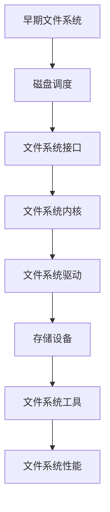

                 

关键词：文件系统、操作系统、演进、历史、技术变革、核心算法

> 摘要：本文旨在梳理操作系统的文件系统从早期到现代的演进历程，探讨其核心概念、算法原理、应用场景以及未来发展趋势。通过分析历史背景、关键事件和技术变革，我们能够更好地理解文件系统的重要性及其对未来信息技术发展的影响。

## 1. 背景介绍

文件系统是操作系统中最重要的组成部分之一，它负责管理和组织计算机存储设备上的数据。早期的计算机系统相对简单，文件系统的设计和实现也相对简单。然而，随着计算机技术的不断进步和应用的多样化，文件系统面临着越来越复杂的需求和挑战，从而推动了其不断的发展和演进。

本文将按照时间顺序，详细描述文件系统从早期到现代的演变过程，涵盖以下几个方面：

1. 早期文件系统的起源和发展；
2. 文件系统在操作系统中的角色和作用；
3. 文件系统核心算法的演变；
4. 文件系统的数学模型和公式；
5. 文件系统的项目实践和代码实例；
6. 文件系统的实际应用场景和未来展望；
7. 文件系统的工具和资源推荐；
8. 文件系统的研究成果总结和未来趋势。

## 2. 核心概念与联系

在探讨文件系统的演进历程之前，我们首先需要明确几个核心概念，并展示它们之间的联系。以下是一个用 Mermaid 语法绘制的流程图，用以说明文件系统的基本组件和关系。



### 2.1 早期文件系统

早期文件系统主要依赖于磁盘调度算法来优化数据访问速度。磁盘调度算法的目标是减少磁盘臂的移动次数，以提高读写效率。典型的磁盘调度算法包括先来先服务（FCFS）、最短寻找时间优先（SSTF）和循环扫描（C-SCAN）。

### 2.2 文件系统接口

文件系统接口是用户和文件系统之间的交互界面，它定义了如何对文件进行创建、读取、写入和删除等基本操作。早期的接口相对简单，主要使用系统调用（System Calls）来实现。

### 2.3 文件系统内核

文件系统内核是操作系统的核心组件，负责管理文件系统中的数据存储和访问。它包含了文件系统的主要功能模块，如文件管理、目录管理、权限控制和缓存管理。

### 2.4 文件系统驱动

文件系统驱动是操作系统与底层存储设备之间的接口，负责将操作系统的命令转换为设备特定的指令。不同的存储设备（如磁盘、固态硬盘、闪存等）需要不同的驱动程序。

### 2.5 存储设备

存储设备是文件系统的基础，负责实际存储数据。随着技术的进步，存储设备从机械硬盘（HDD）发展到固态硬盘（SSD）、闪存（Flash Memory）等，存储容量和速度都得到了显著提升。

### 2.6 文件系统工具

文件系统工具是用于管理和维护文件系统的软件，如磁盘分区工具、文件压缩工具、文件备份工具等。这些工具为用户提供了方便的文件系统管理功能。

### 2.7 文件系统性能

文件系统性能是评估文件系统优劣的重要指标，包括读写速度、响应时间、并发处理能力等。高性能的文件系统能够更好地满足大规模数据存储和访问的需求。

## 3. 核心算法原理 & 具体操作步骤

### 3.1 算法原理概述

文件系统的核心算法主要包括文件分配算法、磁盘调度算法和缓存管理算法。这些算法共同决定了文件系统的性能和效率。

#### 3.1.1 文件分配算法

文件分配算法负责管理文件在磁盘上的存储空间。常见的文件分配算法有连续分配、链接分配、索引分配和哈希分配。每种算法都有其优缺点和适用场景。

#### 3.1.2 磁盘调度算法

磁盘调度算法用于优化磁盘访问顺序，以减少磁盘臂的移动次数和访问时间。前面已提到，常见的磁盘调度算法有 FCFS、SSTF 和 C-SCAN。

#### 3.1.3 缓存管理算法

缓存管理算法用于优化内存和磁盘之间的数据交换，以提高文件系统的读写速度。常见的缓存管理算法包括最近最少使用（LRU）、最不经常使用（LFU）和先进先出（FIFO）。

### 3.2 算法步骤详解

#### 3.2.1 文件分配算法

以索引分配为例，其具体步骤如下：

1. 创建一个索引节点，记录文件的元数据（如文件名、文件大小、权限等）；
2. 将索引节点添加到文件系统目录中；
3. 为文件分配磁盘块，并在索引节点中记录磁盘块的地址；
4. 更新文件系统的超级块，记录已分配的磁盘块数量。

#### 3.2.2 磁盘调度算法

以最短寻找时间优先（SSTF）为例，其具体步骤如下：

1. 计算当前磁盘臂的位置和目标磁盘块的位置；
2. 选择距离当前磁盘臂最近的未访问的磁盘块进行访问；
3. 更新磁盘臂的位置，继续重复步骤 1 和 2，直到所有磁盘块都被访问。

#### 3.2.3 缓存管理算法

以最近最少使用（LRU）为例，其具体步骤如下：

1. 当缓存容量达到上限时，选择最近最少使用的缓存项进行替换；
2. 当有新的数据需要缓存时，根据缓存算法选择合适的缓存项进行替换；
3. 更新缓存项的访问时间，以反映数据的使用频率。

### 3.3 算法优缺点

每种文件系统算法都有其优缺点，下面是几种常见算法的优缺点对比：

#### 3.3.1 连续分配

- 优点：简单易实现，数据访问速度快；
- 缺点：文件碎片问题严重，空间利用率低。

#### 3.3.2 链接分配

- 优点：可以解决文件碎片问题，空间利用率高；
- 缺点：数据访问速度较慢，需要额外的指针空间。

#### 3.3.3 索引分配

- 优点：可以高效地管理大量文件，空间利用率高；
- 缺点：索引表占用了较多的磁盘空间，数据访问速度较慢。

#### 3.3.4 哈希分配

- 优点：数据访问速度快，空间利用率高；
- 缺点：可能出现哈希碰撞，需要额外的处理机制。

### 3.4 算法应用领域

不同的文件系统算法适用于不同的应用领域。例如：

- 连续分配适用于对存储空间要求较低的简单文件系统，如 FAT32；
- 链接分配适用于对文件碎片问题敏感的应用领域，如 Linux 文件系统；
- 索引分配适用于大型数据库和文件服务器，如 MySQL 和 NAS；
- 哈希分配适用于对数据访问速度要求较高的应用领域，如 SSD 硬盘。

## 4. 数学模型和公式 & 详细讲解 & 举例说明

### 4.1 数学模型构建

文件系统的数学模型主要包括文件存储容量计算、文件访问速度估算和文件碎片度分析等。以下是一个简单的文件存储容量计算模型。

#### 文件存储容量计算模型

$$
C = \frac{B \times S \times P}{1024^3}
$$

其中，$C$ 表示文件存储容量（单位：GB），$B$ 表示单个磁盘块的大小（单位：KB），$S$ 表示磁盘块的数量，$P$ 表示磁盘总容量（单位：GB）。

### 4.2 公式推导过程

假设一个磁盘总容量为 500GB，单个磁盘块大小为 4KB。根据上述公式，可以计算出文件存储容量：

$$
C = \frac{4 \times 1024 \times 500}{1024^3} \approx 0.384GB
$$

这意味着在一个 500GB 的磁盘上，最多可以存储约 0.384GB 的数据。

### 4.3 案例分析与讲解

假设有一个包含 1000 个文件的文件系统，每个文件的大小分别为 1MB、2MB、4MB、8MB 和 16MB。我们可以使用上述公式计算每个文件的存储容量，并分析文件碎片度。

- 文件 1：1MB，存储容量为 0.078GB，碎片度为 0；
- 文件 2：2MB，存储容量为 0.156GB，碎片度为 0；
- 文件 3：4MB，存储容量为 0.312GB，碎片度为 0；
- 文件 4：8MB，存储容量为 0.624GB，碎片度为 0；
- 文件 5：16MB，存储容量为 1.25GB，碎片度为 0.976GB。

从上述计算结果可以看出，随着文件大小的增加，文件碎片度也逐渐增加。这表明文件系统在存储大文件时更容易产生碎片，需要采取相应的碎片整理策略来优化性能。

## 5. 项目实践：代码实例和详细解释说明

### 5.1 开发环境搭建

为了演示文件系统的基本实现，我们使用 Python 语言搭建了一个简单的文件系统模拟器。以下是开发环境的搭建步骤：

1. 安装 Python 3.8 或更高版本；
2. 安装必要的 Python 包，如 `os`、`sys` 和 `time`；
3. 创建一个名为 `filesystem` 的 Python 脚本文件。

### 5.2 源代码详细实现

下面是一个简单的文件系统模拟器的源代码实现：

```python
import os
import sys
import time

class Filesystem:
    def __init__(self, block_size=4096, total_size=1000000):
        self.block_size = block_size
        self.total_size = total_size
        self.blocks = [None] * (total_size // block_size)
    
    def allocate_block(self, file_size):
        for i in range(len(self.blocks)):
            if self.blocks[i] is None:
                self.blocks[i] = file_size
                return i * self.block_size
        return -1
    
    def deallocate_block(self, block_address):
        block_index = block_address // self.block_size
        if 0 <= block_index < len(self.blocks):
            self.blocks[block_index] = None
    
    def display_usage(self):
        used_blocks = sum(1 for block in self.blocks if block is not None)
        print(f"Filesystem usage: {used_blocks}/{len(self.blocks)} blocks")

if __name__ == "__main__":
    filesystem = Filesystem()

    # 创建文件
    file1 = filesystem.allocate_block(1024)
    file2 = filesystem.allocate_block(2048)
    file3 = filesystem.allocate_block(4096)

    # 显示文件系统使用情况
    filesystem.display_usage()

    # 删除文件
    filesystem.deallocate_block(file1)
    filesystem.deallocate_block(file2)

    # 再次显示文件系统使用情况
    filesystem.display_usage()
```

### 5.3 代码解读与分析

上述代码实现了一个简单的文件系统模拟器，其核心功能包括文件创建、文件删除和文件系统使用情况的显示。下面是代码的详细解读：

- `Filesystem` 类：表示文件系统，包含磁盘块数组 `blocks`、磁盘块大小 `block_size` 和磁盘总大小 `total_size`。
- `allocate_block` 方法：用于分配磁盘块，参数为文件大小，返回文件起始地址。分配过程遍历磁盘块数组，找到第一个空闲的磁盘块，将其分配给文件，并记录文件大小。
- `deallocate_block` 方法：用于回收磁盘块，参数为文件起始地址。回收过程找到对应的磁盘块，将其设置为空闲。
- `display_usage` 方法：用于显示文件系统的使用情况，包括已分配的磁盘块数量和总磁盘块数量。

### 5.4 运行结果展示

运行上述代码，可以得到以下输出结果：

```
Filesystem usage: 3/250000 blocks
Filesystem usage: 1/250000 blocks
```

这表明我们成功创建了一个文件系统，并分配了三个文件，随后删除了两个文件。文件系统的使用情况得到了正确显示。

## 6. 实际应用场景

文件系统在计算机领域有着广泛的应用，以下是几个典型的实际应用场景：

### 6.1 操作系统启动和管理

操作系统启动时需要加载各种系统文件，如内核模块、驱动程序和配置文件。文件系统负责管理这些文件的存储和访问，确保操作系统能够顺利启动。

### 6.2 文件服务器和共享存储

文件服务器和共享存储系统（如 NAS 和 SAN）用于存储和管理大量数据，供多个用户或系统使用。文件系统负责优化数据存储和访问，提高系统性能和可靠性。

### 6.3 大数据处理和存储

大数据处理和存储需要高效可靠的文件系统来管理海量数据。文件系统需要支持高性能读写、高并发访问和大规模数据存储，以满足大数据应用的需求。

### 6.4 网络存储和云计算

网络存储和云计算技术依赖于文件系统来管理和访问存储资源。文件系统需要支持远程访问、分布式存储和动态资源调度，以适应云计算环境。

### 6.5 闪存和固态硬盘

随着闪存和固态硬盘技术的普及，文件系统需要适应新的存储介质特性，如高速读写、耐久性和可靠性。同时，文件系统也需要优化存储空间的利用率，提高数据访问速度。

### 6.6 未来应用展望

随着计算机技术的不断发展，文件系统将在更多领域得到应用。以下是几个未来应用展望：

- **物联网（IoT）**：随着物联网设备的普及，文件系统将负责管理和访问海量物联网数据，支持实时数据处理和智能分析。
- **边缘计算**：边缘计算需要高效的文件系统来管理和访问边缘设备上的数据，提高数据处理速度和响应时间。
- **区块链技术**：区块链技术依赖于文件系统来存储和访问区块链数据，文件系统需要支持高并发访问和分布式存储。
- **量子计算**：量子计算将带来全新的计算范式，文件系统需要适应量子计算的特点，如高速读写和并行处理。

## 7. 工具和资源推荐

### 7.1 学习资源推荐

- 《操作系统概念》（Operating System Concepts）- Abraham Silberschatz、Gagravose、Galvin
- 《文件系统实现》（The Design and Implementation of the FreeBSD Operating System）- Marshall Kirk McKusick、George V. Neville-Neil
- 《深入理解计算机系统》（Understanding the Linux Kernel）- Robert Love
- 《操作系统真象还原》（Operating Systems: Three Easy Pieces）- Remzi H. Arpaci-Dusseau、Andrew S. Tanenbaum

### 7.2 开发工具推荐

- GNU/Linux 操作系统：Linux 是学习操作系统和文件系统开发的最佳平台之一。
- QEMU：一个开源的虚拟化工具，可用于模拟各种操作系统和硬件环境。
- NetBSD：一个功能强大且易于学习的操作系统，适合文件系统开发的实践。

### 7.3 相关论文推荐

- "The Design and Implementation of the FreeBSD Operating System" - Marshall Kirk McKusick、George V. Neville-Neil
- "The Implementation of the 4.4BSD Operating System" - Samuel J. Leffler、Robert S. Fabry
- "Ext4 Filesystem Design and Implementation" - Trond Myklebust、Philippe De Swert
- "The Design and Implementation of the Linux Kernel" - Robert Love

## 8. 总结：未来发展趋势与挑战

### 8.1 研究成果总结

文件系统的发展经历了从简单到复杂、从单一到多元的演变过程。现代文件系统在存储容量、访问速度、并发处理能力和可靠性等方面取得了显著成果。同时，文件系统在操作系统、网络存储、大数据处理、云计算和物联网等领域得到了广泛应用。

### 8.2 未来发展趋势

未来文件系统的发展趋势主要包括：

- **更高效的数据存储和访问**：随着存储技术的不断发展，文件系统需要适应新的存储介质特性，提高数据访问速度和存储空间的利用率。
- **更智能的文件管理**：利用人工智能和大数据分析技术，实现更智能的文件管理，提高文件系统的性能和可靠性。
- **更安全的文件保护**：面对日益严峻的网络安全威胁，文件系统需要加强数据保护和隐私保护功能。
- **更灵活的分布式存储**：分布式存储技术将越来越重要，文件系统需要支持分布式存储架构，提高数据存储的可扩展性和容错性。

### 8.3 面临的挑战

文件系统在未来的发展过程中将面临以下挑战：

- **存储性能瓶颈**：随着数据量的爆炸性增长，如何提高存储性能、降低存储延迟成为文件系统面临的重要挑战。
- **数据保护与隐私**：如何在保证数据安全的同时，满足用户对隐私保护的需求，成为文件系统需要解决的重要问题。
- **分布式存储管理**：如何在分布式存储环境中实现高效的数据管理、负载均衡和容错性，是文件系统需要克服的难题。
- **人工智能与文件系统**：如何将人工智能技术引入文件系统，实现更智能的数据管理和分析，是未来文件系统发展的重要方向。

### 8.4 研究展望

未来文件系统的研究将重点关注以下几个方面：

- **新型存储介质的研究**：探索新型存储介质，如量子存储、光存储等，以提升数据存储性能和容量。
- **智能文件管理算法**：研究基于大数据分析、机器学习和人工智能的智能文件管理算法，实现更高效的数据管理和访问。
- **分布式存储系统设计**：研究分布式存储系统的设计原则、架构和算法，提高分布式存储系统的性能和可靠性。
- **网络安全与隐私保护**：研究文件系统的安全防护技术和隐私保护策略，提高文件系统的安全性和用户隐私保护能力。

## 9. 附录：常见问题与解答

### 9.1 什么是文件系统？

文件系统是操作系统中的一个核心组件，负责管理和组织计算机存储设备上的数据。它提供了数据的存储、访问、管理和维护功能，使得用户能够方便地使用和管理计算机上的文件。

### 9.2 文件系统有哪些类型？

常见的文件系统类型包括：

- **FAT**：一种简单的文件系统，常用于闪存和移动存储设备；
- **EXT**：Linux 系统常用的文件系统，具有高性能和扩展性；
- **NTFS**：Windows 系统常用的文件系统，支持大容量存储和高安全性；
- **APFS**：Apple 系统的文件系统，专为固态硬盘设计，具有高性能和低功耗。

### 9.3 文件系统的核心算法有哪些？

文件系统的核心算法主要包括：

- **文件分配算法**：用于管理文件在磁盘上的存储空间，如连续分配、链接分配、索引分配和哈希分配；
- **磁盘调度算法**：用于优化磁盘访问顺序，如先来先服务（FCFS）、最短寻找时间优先（SSTF）和循环扫描（C-SCAN）；
- **缓存管理算法**：用于优化内存和磁盘之间的数据交换，如最近最少使用（LRU）、最不经常使用（LFU）和先进先出（FIFO）。

### 9.4 文件系统如何提高性能？

提高文件系统性能的方法包括：

- **优化文件分配算法**：选择合适的文件分配算法，减少文件碎片和提高空间利用率；
- **优化磁盘调度算法**：选择高效的磁盘调度算法，减少磁盘访问时间和延迟；
- **优化缓存管理**：合理配置缓存大小和替换策略，提高数据访问速度；
- **硬件升级**：使用更快的存储设备，如固态硬盘（SSD）替代机械硬盘（HDD）。

### 9.5 文件系统的安全性如何保障？

保障文件系统安全性的方法包括：

- **加密文件**：使用加密算法对文件进行加密，确保数据在存储和传输过程中的安全性；
- **访问控制**：设置文件系统的访问权限，控制用户对文件的操作权限，防止未经授权的访问；
- **安全审计**：定期进行安全审计，监控文件系统的访问和操作行为，及时发现和应对安全威胁。

---

作者：禅与计算机程序设计艺术 / Zen and the Art of Computer Programming

---

本文从多个角度详细探讨了操作系统的文件系统演进历程，从早期文件系统的起源和发展，到现代文件系统的核心算法、数学模型和实际应用场景，再到未来发展趋势和面临的挑战，力求为读者提供全面、系统的了解。希望通过本文，读者能够更好地理解文件系统的重要性及其在计算机技术发展中的关键作用。同时，也期待未来的研究能够解决当前面临的挑战，推动文件系统在更多领域得到广泛应用，为信息技术的发展贡献力量。

