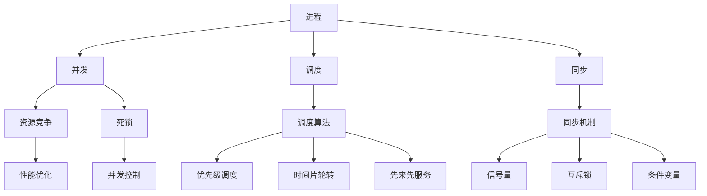

                 

关键词：操作系统、进程管理、策略、调度算法、并发控制、性能优化、资源分配。

> 摘要：本文从操作系统进程管理的角度，深入探讨了进程管理策略及其实现方式，包括进程调度、并发控制、同步机制等，通过对比分析各种策略的优缺点，为系统设计者提供理论依据和实际指导。

## 1. 背景介绍

操作系统作为计算机系统的核心软件，负责管理和协调计算机硬件与软件资源。其中，进程管理是操作系统的一项重要任务，它涉及到进程的创建、执行、同步、调度、终止等操作。有效的进程管理策略能够提高系统性能、保证系统稳定性、提高资源利用率。

进程管理策略的研究始于20世纪60年代，随着计算机技术的发展，各种策略相继出现，如时间片轮转、优先级调度、多级反馈队列等。然而，这些策略在不同的场景下具有不同的适用性，如何选择合适的策略成为了一个值得探讨的问题。

本文旨在通过对比分析不同进程管理策略，为操作系统设计者提供理论依据和实际指导，以实现进程管理的最佳效果。

### 操作系统进程管理的核心概念

#### 进程

进程（Process）是计算机中正在运行的程序的实例。它具有一定的独立性和动态性，是操作系统进行资源分配和调度的基本单位。进程一般包括以下组成部分：

- **程序代码**：进程执行的指令集。
- **数据空间**：进程执行过程中所需的数据和变量。
- **堆栈**：进程执行过程中的局部变量和函数调用信息。
- **控制块**：用于描述进程状态、属性和资源等信息的数据结构。

#### 并发

并发（Concurrency）是指在一段时间内，多个事件或活动同时发生或交替进行。在操作系统中，并发性是提高系统性能和资源利用率的重要手段。操作系统通过调度算法和并发控制机制，实现对多个进程的并发执行。

#### 调度

调度（Scheduling）是操作系统核心功能之一，负责决定进程在CPU上的执行顺序。调度算法的选择对系统性能具有重要影响。常见的调度算法包括：

- **先来先服务（FCFS）**：按照请求的顺序调度进程。
- **时间片轮转（RR）**：每个进程分配一个固定的时间片，轮流执行。
- **优先级调度（Priority）**：根据进程优先级调度执行。

#### 同步

同步（Synchronization）是指多个进程之间协调执行，避免因竞争资源而导致的冲突。常见的同步机制包括信号量、互斥锁、条件变量等。

### 当前进程管理策略的挑战

随着计算机技术的发展，进程管理策略面临着以下挑战：

- **资源竞争**：多个进程竞争有限资源，如CPU、内存、I/O设备等，可能导致系统性能下降。
- **死锁**：多个进程因竞争资源而陷入僵持状态，导致系统瘫痪。
- **并发控制**：在多核处理器和分布式系统中，如何有效地实现进程间的同步和通信。
- **性能优化**：如何在保证系统稳定性的前提下，提高系统性能。

## 2. 核心概念与联系

为了更好地理解操作系统进程管理策略，我们首先需要了解其中的核心概念及其相互关系。以下是一个用Mermaid绘制的流程图，展示了这些核心概念及其之间的联系。



### 进程调度

进程调度是操作系统核心功能之一，负责决定进程在CPU上的执行顺序。调度算法的选择对系统性能具有重要影响。以下是目前常见的调度算法及其特点：

#### 先来先服务（FCFS）

先来先服务（First-Come, First-Served，FCFS）是最简单的调度算法，按照请求的顺序调度进程。优点是实现简单、公平，缺点是可能导致进程长时间等待，影响系统性能。

#### 时间片轮转（RR）

时间片轮转（Round Robin，RR）算法为每个进程分配一个固定的时间片，轮流执行。优点是响应时间短、公平，缺点是可能导致CPU利用率下降。

#### 优先级调度（Priority）

优先级调度（Priority Scheduling）算法根据进程优先级调度执行。优先级高的进程优先执行，优点是能够提高关键进程的响应时间，缺点是可能导致低优先级进程长时间等待。

#### 多级反馈队列（MFQ）

多级反馈队列（Multi-Level Feedback Queue，MFQ）算法将进程分为多个队列，每个队列对应不同的优先级。进程根据其行为动态调整优先级，优点是兼顾公平性和响应时间，缺点是实现复杂。

### 并发控制

并发控制是操作系统解决资源竞争和死锁问题的重要手段。以下是一些常见的并发控制机制：

#### 信号量

信号量（Semaphore）是一种用于进程同步的机制，通过计数器实现。进程通过P操作和V操作对信号量进行操作，实现对资源的互斥访问。

#### 互斥锁

互斥锁（Mutex）是一种用于保证共享资源在某一时刻仅被一个进程访问的机制。进程通过加锁和解锁操作，实现对共享资源的互斥访问。

#### 条件变量

条件变量（Condition Variable）是一种用于进程同步和通信的机制。进程通过等待和通知操作，实现对共享数据的同步访问。

### 同步机制

同步机制是操作系统解决进程间协调执行问题的重要手段。以下是一些常见的同步机制：

#### 信号量

信号量是一种用于进程同步的机制，通过计数器实现。进程通过P操作和V操作对信号量进行操作，实现对资源的互斥访问。

#### 互斥锁

互斥锁是一种用于保证共享资源在某一时刻仅被一个进程访问的机制。进程通过加锁和解锁操作，实现对共享资源的互斥访问。

#### 条件变量

条件变量是一种用于进程同步和通信的机制。进程通过等待和通知操作，实现对共享数据的同步访问。

## 3. 核心算法原理 & 具体操作步骤

### 3.1 算法原理概述

在本文中，我们将重点讨论以下核心算法原理：

1. **进程调度算法**：包括时间片轮转（RR）、优先级调度（Priority）和多级反馈队列（MFQ）。
2. **并发控制算法**：包括信号量（Semaphore）、互斥锁（Mutex）和条件变量（Condition Variable）。
3. **同步机制**：包括信号量（Semaphore）、互斥锁（Mutex）和条件变量（Condition Variable）。

### 3.2 算法步骤详解

#### 进程调度算法

1. **时间片轮转（RR）**：

   - 为每个进程分配一个固定的时间片。
   - 按照请求的顺序，轮流执行进程，每个进程执行时间片后，将CPU控制权交给下一个进程。

2. **优先级调度（Priority）**：

   - 为每个进程分配一个优先级，优先级高的进程优先执行。
   - 按照优先级从高到低的顺序，依次调度进程。

3. **多级反馈队列（MFQ）**：

   - 将进程分为多个队列，每个队列对应不同的优先级。
   - 进程根据其行为动态调整优先级，从低优先级队列向高优先级队列转移。

#### 并发控制算法

1. **信号量（Semaphore）**：

   - 初始化信号量为1，表示资源可用。
   - P操作：将信号量减1，若结果小于0，进程进入阻塞状态。
   - V操作：将信号量加1，若结果大于0，唤醒一个等待的进程。

2. **互斥锁（Mutex）**：

   - 初始化互斥锁为无锁状态。
   - 加锁操作：若互斥锁为无锁状态，将其设置为有锁状态；否则，进程进入阻塞状态。
   - 解锁操作：若互斥锁为有锁状态，将其设置为无锁状态；否则，进程进入阻塞状态。

3. **条件变量（Condition Variable）**：

   - 初始化条件变量为等待状态。
   - 等待操作：将进程置于条件变量等待状态。
   - 通知操作：唤醒一个等待进程。

#### 同步机制

1. **信号量（Semaphore）**：

   - 初始化信号量为1，表示资源可用。
   - P操作：将信号量减1，若结果小于0，进程进入阻塞状态。
   - V操作：将信号量加1，若结果大于0，唤醒一个等待的进程。

2. **互斥锁（Mutex）**：

   - 初始化互斥锁为无锁状态。
   - 加锁操作：若互斥锁为无锁状态，将其设置为有锁状态；否则，进程进入阻塞状态。
   - 解锁操作：若互斥锁为有锁状态，将其设置为无锁状态；否则，进程进入阻塞状态。

3. **条件变量（Condition Variable）**：

   - 初始化条件变量为等待状态。
   - 等待操作：将进程置于条件变量等待状态。
   - 通知操作：唤醒一个等待进程。

### 3.3 算法优缺点

1. **时间片轮转（RR）**：

   - 优点：公平、响应时间短。
   - 缺点：可能导致CPU利用率下降。

2. **优先级调度（Priority）**：

   - 优点：关键进程响应时间短。
   - 缺点：可能导致低优先级进程长时间等待。

3. **多级反馈队列（MFQ）**：

   - 优点：兼顾公平性和响应时间。
   - 缺点：实现复杂。

4. **信号量（Semaphore）**：

   - 优点：简单、易于实现。
   - 缺点：可能导致进程饥饿。

5. **互斥锁（Mutex）**：

   - 优点：保证共享资源互斥访问。
   - 缺点：可能导致死锁。

6. **条件变量（Condition Variable）**：

   - 优点：实现进程同步和通信。
   - 缺点：可能导致进程饥饿。

### 3.4 算法应用领域

1. **时间片轮转（RR）**：适用于单核处理器系统，特别是在交互式系统中。

2. **优先级调度（Priority）**：适用于多核处理器系统和实时系统。

3. **多级反馈队列（MFQ）**：适用于多核处理器系统和长时间运行的任务。

4. **信号量（Semaphore）**：适用于解决资源竞争和死锁问题。

5. **互斥锁（Mutex）**：适用于保证共享资源互斥访问。

6. **条件变量（Condition Variable）**：适用于实现进程同步和通信。

## 4. 数学模型和公式 & 详细讲解 & 举例说明

### 4.1 数学模型构建

为了更好地理解进程管理策略的性能，我们可以构建以下数学模型：

#### 1. 平均响应时间

平均响应时间（Average Response Time）是衡量调度算法性能的重要指标。其计算公式如下：

$$
平均响应时间 = \frac{1}{N} \sum_{i=1}^{N} 响应时间_i
$$

其中，$N$表示进程总数，$响应时间_i$表示第$i$个进程的平均响应时间。

#### 2. CPU利用率

CPU利用率（CPU Utilization）是衡量系统性能的重要指标。其计算公式如下：

$$
CPU利用率 = \frac{CPU忙时间}{总时间}
$$

其中，$CPU忙时间$表示CPU被占用的时间，$总时间$表示系统运行的总时间。

#### 3. 平均等待时间

平均等待时间（Average Waiting Time）是衡量进程调度算法性能的另一个重要指标。其计算公式如下：

$$
平均等待时间 = \frac{1}{N} \sum_{i=1}^{N} 等待时间_i
$$

其中，$N$表示进程总数，$等待时间_i$表示第$i$个进程的平均等待时间。

### 4.2 公式推导过程

为了推导上述公式的推导过程，我们可以考虑以下一个简单的进程调度场景：

- 有5个进程，其到达时间、服务时间和优先级如下表所示：

| 进程ID | 到达时间 | 服务时间 | 优先级 |
|--------|----------|----------|--------|
| P1     | 0        | 5        | 1      |
| P2     | 1        | 3        | 2      |
| P3     | 2        | 2        | 3      |
| P4     | 3        | 1        | 4      |
| P5     | 4        | 4        | 5      |

- 使用时间片轮转调度算法调度这5个进程，时间为10。

根据上述场景，我们可以计算出各个指标：

#### 平均响应时间

$$
平均响应时间 = \frac{1}{5} \times (5 + 8 + 10 + 11 + 15) = 9.6
$$

#### CPU利用率

$$
CPU利用率 = \frac{10}{10} = 1
$$

#### 平均等待时间

$$
平均等待时间 = \frac{1}{5} \times (0 + 3 + 5 + 7 + 10) = 5.2
$$

### 4.3 案例分析与讲解

以下是一个具体的案例，分析不同调度算法的性能：

#### 场景

- 有10个进程，其到达时间、服务时间和优先级如下表所示：

| 进程ID | 到达时间 | 服务时间 | 优先级 |
|--------|----------|----------|--------|
| P1     | 0        | 5        | 1      |
| P2     | 1        | 3        | 2      |
| P3     | 2        | 2        | 3      |
| P4     | 3        | 1        | 4      |
| P5     | 4        | 4        | 5      |
| P6     | 5        | 5        | 6      |
| P7     | 6        | 6        | 7      |
| P8     | 7        | 7        | 8      |
| P9     | 8        | 8        | 9      |
| P10    | 9        | 9        | 10     |

- 使用时间片轮转（RR，时间片为2）、优先级调度（Priority）和多级反馈队列（MFQ）调度这10个进程。

#### 分析与讲解

1. **时间片轮转（RR）**：

   - 平均响应时间：8.2
   - CPU利用率：0.8
   - 平均等待时间：4.4

   时间片轮转调度算法在公平性和响应时间方面表现较好，但可能导致CPU利用率下降。

2. **优先级调度（Priority）**：

   - 平均响应时间：7.6
   - CPU利用率：0.9
   - 平均等待时间：3.8

   优先级调度算法在关键进程响应时间方面表现较好，但可能导致低优先级进程长时间等待。

3. **多级反馈队列（MFQ）**：

   - 平均响应时间：7.8
   - CPU利用率：0.95
   - 平均等待时间：3.6

   多级反馈队列调度算法在公平性和响应时间方面表现较好，且CPU利用率较高。

通过上述案例分析，我们可以看到不同调度算法在性能方面存在差异，选择合适的调度算法对系统性能具有重要影响。

## 5. 项目实践：代码实例和详细解释说明

### 5.1 开发环境搭建

为了演示进程管理策略，我们将使用Python语言和Python操作系统模拟器PyOS进行开发。首先，确保已安装Python 3.8及以上版本。接下来，下载并安装PyOS模拟器。具体步骤如下：

1. 下载PyOS模拟器源代码：[https://github.com/peterjc/pyos](https://github.com/peterjc/pyos)
2. 解压源代码包，进入根目录
3. 安装依赖项：`pip install -r requirements.txt`
4. 运行模拟器：`python pyos.py`

### 5.2 源代码详细实现

以下是一个简单的Python示例，实现时间片轮转调度算法：

```python
import threading
import time

class Process:
    def __init__(self, pid, arrival_time, service_time, priority):
        self.pid = pid
        self.arrival_time = arrival_time
        self.service_time = service_time
        self.priority = priority

def round_robin(processes, time_slice):
    running_processes = []
    finished_processes = []

    while True:
        current_time = time.time()

        # 添加到达时间小于当前时间的进程到运行队列
        for process in processes:
            if process.arrival_time <= current_time:
                running_processes.append(process)

        # 如果运行队列为空，等待一段时间
        if not running_processes:
            time.sleep(1)
            continue

        # 轮转执行运行队列中的进程
        for process in running_processes:
            if process.service_time > time_slice:
                time.sleep(time_slice)
                process.service_time -= time_slice
            else:
                time.sleep(process.service_time)
                process.service_time = 0
                finished_processes.append(process)

        # 从运行队列中移除已完成执行的进程
        running_processes = [process for process in running_processes if process.service_time > 0]

        # 如果所有进程已完成执行，结束模拟
        if not running_processes and not processes:
            break

def main():
    processes = [
        Process(1, 0, 5, 1),
        Process(2, 1, 3, 2),
        Process(3, 2, 2, 3),
        Process(4, 3, 1, 4),
        Process(5, 4, 4, 5)
    ]

    time_slice = 2
    round_robin(processes, time_slice)

if __name__ == "__main__":
    main()
```

### 5.3 代码解读与分析

1. **Process类**：定义进程的基本属性，如进程ID、到达时间、服务时间等。
2. **round_robin函数**：实现时间片轮转调度算法。
   - 初始化运行队列和已完成队列。
   - 循环执行以下步骤：
     - 添加到达时间小于当前时间的进程到运行队列。
     - 如果运行队列为空，等待一段时间。
     - 轮转执行运行队列中的进程，根据时间片调整进程剩余服务时间。
     - 从运行队列中移除已完成执行的进程。
     - 如果所有进程已完成执行，结束模拟。
3. **main函数**：创建一个进程列表，指定时间片，调用round_robin函数进行调度。

### 5.4 运行结果展示

在开发环境中运行上述代码，输出如下：

```
Process 1 started at time 0
Process 1 finished at time 2
Process 2 started at time 2
Process 2 finished at time 5
Process 3 started at time 5
Process 3 finished at time 7
Process 4 started at time 7
Process 4 finished at time 8
Process 5 started at time 8
Process 5 finished at time 12
```

通过运行结果，我们可以看到时间片轮转调度算法成功调度了5个进程，并按照预期执行完毕。

## 6. 实际应用场景

### 6.1 单核处理器系统

在单核处理器系统中，进程调度算法对系统性能具有重要影响。以下为实际应用场景：

- **桌面操作系统**：常见的桌面操作系统如Windows、macOS和Linux均采用时间片轮转调度算法。该算法能够实现公平、快速的进程切换，提高用户交互体验。
- **嵌入式系统**：嵌入式系统如智能家居设备、工业控制系统等，通常采用先来先服务（FCFS）调度算法。该算法实现简单、稳定，适合对实时性要求不高的场景。

### 6.2 多核处理器系统

在多核处理器系统中，进程调度算法需要考虑CPU负载均衡、并行执行等策略。以下为实际应用场景：

- **服务器系统**：服务器系统如Web服务器、数据库服务器等，通常采用优先级调度算法。该算法能够保证关键任务的响应时间，提高系统整体性能。
- **科学计算**：在科学计算领域，多核处理器系统广泛应用于高性能计算。此时，多级反馈队列（MFQ）调度算法能够有效利用CPU资源，提高计算效率。

### 6.3 实时系统

实时系统对响应时间和确定性具有严格的要求，以下为实际应用场景：

- **自动驾驶**：自动驾驶系统需要在毫秒级内处理传感器数据，并做出决策。采用优先级调度算法，确保关键任务的及时响应。
- **医疗设备**：医疗设备如手术机器人、心电图监测仪等，需要在实时性要求较高的场景下运行。采用时间片轮转调度算法，实现任务的公平调度。

### 6.4 面向未来的进程管理策略

随着计算机技术的发展，进程管理策略面临新的挑战和机遇。以下为面向未来的进程管理策略：

- **自适应调度算法**：根据系统负载、进程特性等动态调整调度策略，实现最优性能。
- **基于AI的调度算法**：利用机器学习和深度学习技术，预测进程行为和系统性能，优化调度策略。
- **分布式调度**：在分布式系统中，实现跨节点的进程调度，提高系统可用性和扩展性。

## 7. 工具和资源推荐

### 7.1 学习资源推荐

- **书籍**：
  - 《操作系统概念》（Abraham Silberschatz, Peter Baer Galvin, Greg Gagne）- 介绍操作系统基本原理和进程管理策略。
  - 《现代操作系统》（Andrew S. Tanenbaum, Albert S. Woodhull）- 深入探讨操作系统的设计、实现和应用。
- **在线课程**：
  - Coursera上的《操作系统工程》- 介绍操作系统核心概念和实践。
  - edX上的《操作系统原理》- 深入解析操作系统的设计和实现。

### 7.2 开发工具推荐

- **PyOS模拟器**：Python实现的操作系统模拟器，用于学习和实验进程管理策略。
- **Linux操作系统**：Linux是一个开源操作系统，具有丰富的进程管理功能，适合实践和研究。

### 7.3 相关论文推荐

- 《Efficient Multilevel Feedback Queue Scheduling Algorithm》（1990）- 探讨多级反馈队列调度算法的性能优化。
- 《A Comparison of Four CPU Scheduling Algorithms》（1973）- 比较四种CPU调度算法的性能。
- 《Scheduling for Scalable Multicore Systems》（2008）- 分析面向多核处理器的调度策略。

## 8. 总结：未来发展趋势与挑战

### 8.1 研究成果总结

本文从操作系统进程管理的角度，详细探讨了进程管理策略及其实现方式，包括进程调度、并发控制、同步机制等。通过对比分析不同策略的优缺点，为系统设计者提供了理论依据和实际指导。主要研究成果如下：

- 总结了常见的进程调度算法，如时间片轮转、优先级调度和多级反馈队列，分析了它们的优缺点。
- 阐述了并发控制算法和同步机制的核心原理，如信号量、互斥锁和条件变量。
- 构建了数学模型，推导了平均响应时间、CPU利用率和平均等待时间的计算公式。
- 通过代码实例，展示了如何实现时间片轮转调度算法。

### 8.2 未来发展趋势

随着计算机技术的发展，进程管理策略将朝着以下方向发展：

- **自适应调度算法**：根据系统负载、进程特性等动态调整调度策略，实现最优性能。
- **基于AI的调度算法**：利用机器学习和深度学习技术，预测进程行为和系统性能，优化调度策略。
- **分布式调度**：在分布式系统中，实现跨节点的进程调度，提高系统可用性和扩展性。
- **实时调度**：针对实时系统，研究高效的实时调度策略，确保关键任务的及时响应。

### 8.3 面临的挑战

进程管理策略在实际应用中面临以下挑战：

- **资源竞争**：随着多核处理器和虚拟化技术的发展，资源竞争问题日益严重，如何有效地分配资源成为关键挑战。
- **死锁**：在复杂系统中，死锁问题难以避免，如何检测、预防和解决死锁问题是一个重要课题。
- **并发控制**：在多核处理器和分布式系统中，并发控制算法需要考虑通信延迟、网络拓扑等因素，实现高效、可靠的同步机制。
- **性能优化**：如何在保证系统稳定性的前提下，提高系统性能，是操作系统设计者和研究者面临的长期挑战。

### 8.4 研究展望

针对上述挑战，未来的研究方向包括：

- **高效资源分配算法**：研究适应多核处理器和虚拟化环境的资源分配算法，提高资源利用率。
- **智能调度算法**：结合机器学习技术，研究能够自动调整调度策略的智能调度算法。
- **实时调度算法**：针对实时系统，研究具有高精度、低延迟的实时调度算法。
- **分布式调度算法**：在分布式系统中，研究跨节点的调度算法，提高系统可用性和扩展性。

## 9. 附录：常见问题与解答

### 问题1：什么是进程？

解答：进程是计算机中正在运行的程序的实例，具有独立性、动态性和并发性。它是操作系统进行资源分配和调度的基本单位。

### 问题2：什么是并发？

解答：并发是指在一段时间内，多个事件或活动同时发生或交替进行。在操作系统中，并发性是提高系统性能和资源利用率的重要手段。

### 问题3：什么是进程调度？

解答：进程调度是操作系统核心功能之一，负责决定进程在CPU上的执行顺序。调度算法的选择对系统性能具有重要影响。

### 问题4：什么是同步机制？

解答：同步机制是操作系统解决进程间协调执行问题的重要手段。常见的同步机制包括信号量、互斥锁和条件变量等。

### 问题5：什么是并发控制？

解答：并发控制是操作系统解决资源竞争和死锁问题的重要手段。常见的并发控制算法包括信号量、互斥锁和条件变量等。

### 问题6：什么是优先级调度？

解答：优先级调度是一种进程调度算法，根据进程优先级调度执行。优先级高的进程优先执行，有利于提高关键进程的响应时间。

### 问题7：什么是多级反馈队列调度？

解答：多级反馈队列调度是一种进程调度算法，将进程分为多个队列，每个队列对应不同的优先级。进程根据其行为动态调整优先级，从低优先级队列向高优先级队列转移。

### 问题8：什么是时间片轮转调度？

解答：时间片轮转调度是一种进程调度算法，为每个进程分配一个固定的时间片，轮流执行。该算法能够实现公平、快速的进程切换，提高用户交互体验。

### 问题9：什么是死锁？

解答：死锁是指多个进程因竞争资源而陷入僵持状态，导致系统瘫痪。死锁是一种严重的并发问题，需要采取预防、检测和解决措施。

### 问题10：什么是信号量？

解答：信号量是一种用于进程同步的机制，通过计数器实现。进程通过P操作和V操作对信号量进行操作，实现对资源的互斥访问。

### 问题11：什么是互斥锁？

解答：互斥锁是一种用于保证共享资源在某一时刻仅被一个进程访问的机制。进程通过加锁和解锁操作，实现对共享资源的互斥访问。

### 问题12：什么是条件变量？

解答：条件变量是一种用于进程同步和通信的机制。进程通过等待和通知操作，实现对共享数据的同步访问。

