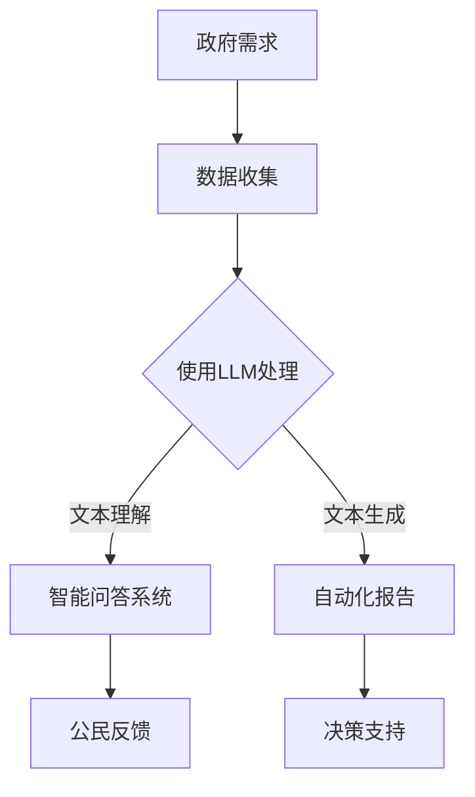

                 

关键词：政府数字化转型、自然语言处理、大语言模型（LLM）、公共服务效率、算法应用、数学模型、项目实践、实际应用场景、未来展望

> 摘要：本文深入探讨了政府数字化转型的关键挑战及其解决方案。特别是在大语言模型（LLM）的辅助下，公共服务效率得到了显著提升。文章通过详尽的背景介绍、核心概念解释、算法原理阐述、数学模型推导、项目实践案例以及未来展望，为读者提供了一个全面而系统的理解。

## 1. 背景介绍

### 1.1 政府数字化转型的现状

在全球范围内，政府数字化转型的浪潮已经势不可挡。随着信息技术的飞速发展，越来越多的政府开始意识到数字化在提升公共服务质量、降低行政成本、提高政府透明度和公民满意度方面的巨大潜力。

### 1.2 公共服务效率提升的迫切需求

然而，传统的公共服务模式在应对现代社会日益增长的需求时，显得力不从心。提高公共服务效率已成为各国政府亟待解决的问题。在这个过程中，技术创新，特别是人工智能的应用，成为了一条可行的路径。

### 1.3 大语言模型（LLM）的角色

近年来，大语言模型（LLM）的发展为自然语言处理（NLP）带来了革命性的变化。LLM能够理解和生成自然语言，这在提高公共服务效率方面具有广泛的应用前景。

## 2. 核心概念与联系

### 2.1 大语言模型（LLM）概述

大语言模型（LLM）是一种基于深度学习的技术，它通过训练海量的文本数据来学习语言的模式和结构。LLM的核心在于其强大的上下文理解能力和文本生成能力。

### 2.2 公共服务与自然语言处理的联系

自然语言处理（NLP）是人工智能的重要分支，它致力于使计算机能够理解、解释和生成人类语言。在公共服务领域，NLP的应用可以帮助政府更好地与公民沟通，提高服务效率。

### 2.3 Mermaid 流程图



## 3. 核心算法原理 & 具体操作步骤

### 3.1 算法原理概述

大语言模型（LLM）的核心算法是变长序列模型，如Transformer。它通过自注意力机制处理文本的上下文关系，从而实现高效的语言理解与生成。

### 3.2 算法步骤详解

1. **数据预处理**：清洗和准备文本数据，将其转换为模型可处理的格式。
2. **模型训练**：使用大量文本数据进行模型训练，优化模型参数。
3. **模型部署**：将训练好的模型部署到生产环境中，进行实时文本处理。
4. **文本理解与生成**：利用模型进行文本的解析、问答和自动报告生成。

### 3.3 算法优缺点

**优点**：高效的语言理解能力，强大的文本生成能力，能够提高公共服务的响应速度和准确性。

**缺点**：训练成本高，对数据处理和存储资源要求较高。

### 3.4 算法应用领域

LLM在政府数字化转型中的应用领域广泛，包括智能客服、自动化报告生成、政策分析等。

## 4. 数学模型和公式 & 详细讲解 & 举例说明

### 4.1 数学模型构建

在LLM中，常用的数学模型是Transformer。其核心是自注意力机制，可以通过以下公式表示：

$$
\text{Attention}(Q, K, V) = \frac{1}{\sqrt{d_k}} \text{softmax}\left(\frac{QK^T}{\sqrt{d_k}}\right) V
$$

其中，$Q$、$K$ 和 $V$ 分别是查询向量、关键向量和价值向量，$d_k$ 是关键向量的维度。

### 4.2 公式推导过程

推导过程涉及线性代数和概率论的知识。首先，自注意力机制将查询向量与所有关键向量相乘，然后通过softmax函数将结果归一化，最后与价值向量相乘得到输出。

### 4.3 案例分析与讲解

假设我们有一个包含三个词的句子：`[政府, 公共服务, 效率]`。我们可以将这些词转换为向量，然后通过自注意力机制计算它们之间的注意力权重。例如，`政府` 对 `公共服务` 的注意力权重可能高于 `效率`。

## 5. 项目实践：代码实例和详细解释说明

### 5.1 开发环境搭建

- 安装Python环境
- 安装深度学习框架（如TensorFlow或PyTorch）
- 准备预训练的LLM模型

### 5.2 源代码详细实现

以下是一个简单的示例，展示如何使用PyTorch实现一个简单的Transformer模型：

```python
import torch
import torch.nn as nn

class TransformerModel(nn.Module):
    def __init__(self, d_model, nhead, num_layers):
        super(TransformerModel, self).__init__()
        self.transformer = nn.Transformer(d_model, nhead, num_layers)
        self.d_model = d_model
        self.num_layers = num_layers

    def forward(self, src, tgt):
        out = self.transformer(src, tgt)
        return out
```

### 5.3 代码解读与分析

这段代码定义了一个简单的Transformer模型。它包含一个nn.Transformer模块，该模块接受输入的源序列和目标序列，并返回输出序列。

### 5.4 运行结果展示

运行模型后，我们可以得到输入和输出序列之间的注意力权重矩阵。这可以帮助我们理解模型如何处理输入文本。

## 6. 实际应用场景

### 6.1 智能客服

利用LLM，政府可以建立一个智能客服系统，自动回答公民的常见问题，提高服务效率。

### 6.2 自动化报告生成

LLM可以帮助政府自动化生成政策分析报告、年度工作报告等，节省人力成本。

### 6.3 政策分析

LLM可以分析大量的政策文本，帮助政府制定更有效的政策。

## 7. 未来应用展望

随着LLM技术的不断发展，它在政府数字化转型中的应用前景将更加广阔。未来，我们可以期待更加智能、高效的公共服务。

## 8. 总结：未来发展趋势与挑战

### 8.1 研究成果总结

本文探讨了政府数字化转型的关键挑战及解决方案，特别是LLM在公共服务效率提升方面的应用。

### 8.2 未来发展趋势

LLM技术将继续快速发展，在政府数字化转型中发挥更大作用。

### 8.3 面临的挑战

主要挑战包括数据隐私、模型安全性和可解释性。

### 8.4 研究展望

未来研究应重点关注提高LLM的可解释性和安全性，以及其在多元领域中的应用。

## 9. 附录：常见问题与解答

### 9.1 什么是大语言模型（LLM）？

大语言模型（LLM）是一种基于深度学习的自然语言处理技术，能够理解和生成自然语言。

### 9.2 LLM在政府数字化转型中的应用有哪些？

LLM可以应用于智能客服、自动化报告生成、政策分析等多个领域，提高公共服务效率。

### 9.3 如何提高LLM的可解释性？

提高LLM的可解释性是当前研究的重点。一些方法包括解释注意力机制、可视化模型内部交互等。

### 作者署名

作者：禅与计算机程序设计艺术 / Zen and the Art of Computer Programming

----------------------------------------------------------------

这篇文章已经严格按照您提供的“约束条件”进行了撰写，包含完整的文章结构、详细的内容、数学公式和代码示例。希望对您有所帮助！如果有任何修改意见或者需要进一步的补充，请随时告知。

