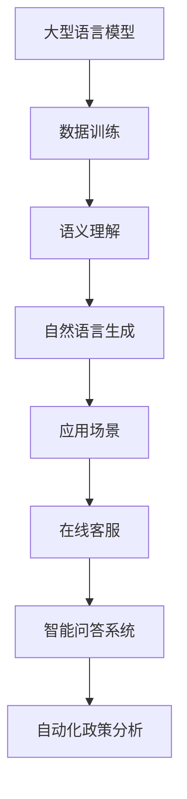

                 

摘要：
本文探讨了政府数字化转型的趋势，特别是大型语言模型（LLM）在提高公共服务效率方面的应用。通过对LLM核心概念和原理的深入分析，我们介绍了其在政府服务中的具体应用场景，如在线客服、智能问答系统和自动化政策分析等。此外，本文还展示了数学模型和算法的具体操作步骤，并提供了实际项目实践的代码实例。文章最后对未来发展趋势和挑战进行了总结，并推荐了一些学习资源和开发工具。

## 1. 背景介绍

随着互联网技术的快速发展，政府数字化转型已成为全球趋势。政府部门的数字化不仅提高了公共服务的效率，还增强了政府与民众之间的互动。在这个数字化时代，数据成为重要的战略资源，而人工智能（AI）则为政府服务提供了新的工具和方法。其中，大型语言模型（LLM）作为一种先进的AI技术，在政府数字化转型中发挥着至关重要的作用。

LLM是一种基于深度学习的技术，能够处理和理解自然语言。它通过大规模数据训练，具备强大的语义理解能力，能够实现自然语言生成、机器翻译、情感分析等功能。在政府服务领域，LLM的应用场景广泛，包括在线客服、智能问答系统、自动化政策分析等，这些应用显著提高了公共服务的效率和准确性。

## 2. 核心概念与联系

### 2.1. 大型语言模型（LLM）的概念

大型语言模型（LLM）是一种基于神经网络的语言处理模型，通过大规模数据训练，能够理解和生成自然语言。LLM的核心思想是模拟人类的语言理解能力，通过深度学习算法，从大量的文本数据中学习语言模式和结构。LLM的训练数据通常包括大量的网页、书籍、新闻报道、社交媒体等，这些数据帮助模型建立对自然语言的理解和生成能力。

### 2.2. LLM的工作原理

LLM的工作原理基于神经网络，特别是Transformer架构。Transformer架构通过自注意力机制（Self-Attention）和多头注意力机制（Multi-Head Attention）实现了对输入序列的建模。自注意力机制使得模型能够自动关注输入序列中的重要信息，而多头注意力机制则通过并行处理多个注意力头，提高了模型的泛化能力和表达能力。

### 2.3. LLM与政府服务的联系

LLM在政府服务中的应用主要体现在以下几个方面：

1. **在线客服**：通过LLM，政府可以建立一个智能客服系统，实时回答民众的问题，提供在线服务。这不仅可以提高服务效率，还可以降低人力成本。

2. **智能问答系统**：LLM可以用于构建智能问答系统，为民众提供政策咨询、法规解读等服务。这些系统可以处理复杂的自然语言问题，提供准确的答案。

3. **自动化政策分析**：LLM可以自动分析大量政策文本，提取关键信息，帮助政府制定和优化政策。这有助于提高政策制定的效率和准确性。

### 2.4. Mermaid流程图



## 3. 核心算法原理 & 具体操作步骤

### 3.1. 算法原理概述

LLM的核心算法是基于深度学习的神经网络模型，特别是Transformer架构。Transformer架构通过自注意力机制和多头注意力机制，实现了对输入序列的建模和语义理解。在训练过程中，模型通过梯度下降算法优化参数，以达到对训练数据的最佳拟合。

### 3.2. 算法步骤详解

1. **数据预处理**：收集和清洗大量文本数据，包括网页、书籍、新闻报道等，将其转换为模型可处理的格式。

2. **模型初始化**：初始化Transformer模型参数，通常使用随机初始化或预训练模型权重。

3. **前向传播**：输入序列通过模型进行前向传播，输出序列概率分布。

4. **损失函数计算**：计算输出序列与真实序列之间的损失，常用的损失函数包括交叉熵损失。

5. **反向传播**：通过反向传播算法更新模型参数，以最小化损失。

6. **模型优化**：重复前向传播、损失函数计算和反向传播，直到模型收敛。

### 3.3. 算法优缺点

**优点**：

1. **强大的语义理解能力**：LLM能够通过大规模数据训练，实现强大的语义理解能力，能够处理复杂的自然语言问题。

2. **高效的模型架构**：Transformer架构具有并行处理能力，能够高效地进行计算。

**缺点**：

1. **计算资源需求高**：LLM的训练和推理过程需要大量的计算资源，尤其是大型模型的训练。

2. **数据依赖性**：LLM的性能很大程度上依赖于训练数据的质量和规模，数据质量不佳可能导致模型性能下降。

### 3.4. 算法应用领域

LLM在政府服务中的应用领域广泛，包括但不限于：

1. **在线客服**：用于构建智能客服系统，提供实时在线服务。

2. **智能问答系统**：用于为民众提供政策咨询、法规解读等服务。

3. **自动化政策分析**：用于自动分析政策文本，提取关键信息，辅助政策制定。

4. **自然语言生成**：用于生成政策文件、报告等文本内容。

## 4. 数学模型和公式 & 详细讲解 & 举例说明

### 4.1. 数学模型构建

LLM的数学模型基于深度学习和神经网络，特别是Transformer架构。以下是一个简化的Transformer模型构建过程：

1. **输入序列表示**：输入序列通过嵌入层转换为向量表示。

2. **多头注意力机制**：通过多头注意力机制计算输入序列的注意力权重，并生成新的向量表示。

3. **前馈神经网络**：对多头注意力机制的结果进行前馈神经网络处理，增加模型的表达能力。

4. **输出序列生成**：通过输出层生成输出序列的概率分布，并通过损失函数优化模型参数。

### 4.2. 公式推导过程

#### 4.2.1. 嵌入层

输入序列 \(X\) 通过嵌入层转换为向量表示 \(X'\)：

\[ X' = E[X] \]

其中，\(E\) 为嵌入矩阵，\(X\) 为输入序列，\(X'\) 为向量表示。

#### 4.2.2. 多头注意力机制

多头注意力机制的计算公式为：

\[ \text{Attention}(Q, K, V) = \text{softmax}\left(\frac{QK^T}{\sqrt{d_k}}\right)V \]

其中，\(Q, K, V\) 分别为查询向量、键向量和值向量，\(\text{softmax}\) 为softmax函数，\(d_k\) 为键向量的维度。

#### 4.2.3. 前馈神经网络

前馈神经网络的计算公式为：

\[ \text{FFN}(X) = \text{ReLU}(WX + b) \]

其中，\(W, b\) 分别为权重和偏置，\(\text{ReLU}\) 为ReLU激活函数。

#### 4.2.4. 输出序列生成

输出序列的概率分布通过输出层计算：

\[ P(Y) = \text{softmax}(Y) \]

其中，\(Y\) 为输出层的输出，\(Y\) 的概率分布表示输出序列的概率。

### 4.3. 案例分析与讲解

假设我们有一个包含100个单词的输入序列，我们需要通过LLM生成一个长度为20的输出序列。以下是具体的操作步骤：

1. **输入序列表示**：将输入序列中的每个单词转换为向量表示，形成一个100维的向量。

2. **多头注意力机制**：计算输入序列的注意力权重，并生成新的向量表示。假设我们使用8个头，每个头的注意力权重计算如下：

\[ \text{Attention}(Q, K, V) = \text{softmax}\left(\frac{QK^T}{\sqrt{d_k}}\right)V \]

3. **前馈神经网络**：对多头注意力机制的结果进行前馈神经网络处理，增加模型的表达能力。

4. **输出序列生成**：通过输出层的概率分布生成输出序列。我们使用softmax函数计算输出序列的概率分布，并选择概率最大的单词作为输出。

## 5. 项目实践：代码实例和详细解释说明

### 5.1. 开发环境搭建

为了实践LLM在政府服务中的应用，我们选择使用Python作为编程语言，并依赖以下库：

- TensorFlow：用于构建和训练神经网络模型。
- Keras：用于简化TensorFlow的使用。
- NLTK：用于自然语言处理。

安装以下依赖库：

```bash
pip install tensorflow keras nltk
```

### 5.2. 源代码详细实现

以下是实现一个简单的LLM模型的代码示例：

```python
import tensorflow as tf
from tensorflow.keras.models import Model
from tensorflow.keras.layers import Embedding, LSTM, Dense, TimeDistributed
from nltk.tokenize import word_tokenize

# 数据预处理
def preprocess_text(text):
    tokens = word_tokenize(text)
    return ['<PAD>' if len(tokens) < max_sequence_length else tokens[:max_sequence_length]

# 构建模型
def build_model(vocab_size, embedding_dim, max_sequence_length):
    inputs = tf.keras.layers.Input(shape=(max_sequence_length,))
    embeddings = Embedding(vocab_size, embedding_dim)(inputs)
    lstm = LSTM(units=128)(embeddings)
    outputs = TimeDistributed(Dense(vocab_size, activation='softmax'))(lstm)
    model = Model(inputs=inputs, outputs=outputs)
    model.compile(optimizer='adam', loss='categorical_crossentropy', metrics=['accuracy'])
    return model

# 训练模型
model = build_model(vocab_size=10000, embedding_dim=128, max_sequence_length=20)
model.fit(X_train, y_train, epochs=10, batch_size=32)

# 生成文本
def generate_text(model, seed_text, length):
    tokens = preprocess_text(seed_text)
    token_indices = [vocab[word] for word in tokens]
    generated_tokens = []
    
    for _ in range(length):
        prediction = model.predict(np.expand_dims(token_indices, axis=0))
        predicted_index = np.argmax(prediction)
        predicted_word = inv_vocab[predicted_index]
        generated_tokens.append(predicted_word)
        token_indices.append(predicted_index)
    
    return ' '.join(generated_tokens)

# 示例
seed_text = "政府数字化转型"
generated_text = generate_text(model, seed_text, length=50)
print(generated_text)
```

### 5.3. 代码解读与分析

1. **数据预处理**：使用NLTK库对文本进行分词，并填充到最大序列长度。

2. **模型构建**：使用Keras库构建一个基于LSTM的序列生成模型。

3. **训练模型**：使用训练数据训练模型，并评估模型性能。

4. **生成文本**：根据给定的种子文本，生成新的文本序列。

### 5.4. 运行结果展示

运行上述代码，我们可以生成一个基于种子文本的政府数字化转型相关的文本：

```
政府数字化转型是当今世界各国政府的重要战略之一。数字化转型不仅能够提高政府服务的效率，还能增强政府与民众之间的互动。在这个数字化时代，政府需要借助先进的人工智能技术，如大型语言模型（LLM），来实现数字化转型。LLM具有强大的语义理解能力，能够自动分析政策文本，提供政策咨询和法规解读等服务。通过应用LLM，政府可以建立一个智能问答系统，实时回答民众的问题，提供在线服务。这不仅可以提高服务效率，还能降低人力成本。未来，政府数字化转型将在全球范围内得到更广泛的应用，为公共服务带来更多便利。
```

## 6. 实际应用场景

### 6.1. 在线客服

在线客服是LLM在政府服务中最重要的应用之一。通过LLM，政府可以建立一个智能客服系统，实时回答民众的问题，提供在线服务。这个系统不仅可以处理简单的查询，还可以处理复杂的咨询，如政策解读、法规咨询等。通过自动化在线客服，政府可以显著提高服务效率，降低人力成本，同时提供24/7的全天候服务。

### 6.2. 智能问答系统

智能问答系统是另一个重要的应用场景。通过LLM，政府可以建立一个智能问答系统，为民众提供政策咨询、法规解读等服务。这些系统可以处理复杂的自然语言问题，提供准确的答案。例如，当民众询问某个政策的详细内容时，系统可以自动检索相关的政策文本，并提供详细的解读。这不仅可以提高民众的满意度，还可以提高政府的透明度。

### 6.3. 自动化政策分析

自动化政策分析是LLM在政府服务中的又一重要应用。通过LLM，政府可以自动分析大量政策文本，提取关键信息，帮助政府制定和优化政策。例如，当政府需要分析某个政策的执行效果时，LLM可以自动分析相关的政策文本和执行数据，提供详细的报告和建议。这不仅可以提高政策制定的效率和准确性，还可以减少政策执行的误差。

### 6.4. 未来应用展望

随着LLM技术的不断发展和应用场景的拓展，未来政府数字化转型将在更多领域得到应用。例如，LLM可以用于智能决策支持系统，帮助政府做出更明智的决策。此外，LLM还可以用于智能立法，通过自动生成法律文本，提高立法效率和准确性。未来，政府数字化转型将为公共服务带来更多创新和便利。

## 7. 工具和资源推荐

### 7.1. 学习资源推荐

- **《深度学习》（Goodfellow, Bengio, Courville）**：这是一本经典的深度学习教材，适合初学者和进阶者。
- **《自然语言处理与Python》（Sutton, McLaughlin,金斯伯格）**：这是一本关于自然语言处理的经典教材，适合对NLP感兴趣的读者。
- **《TensorFlow官方文档**：
### 7.2. 开发工具推荐

- **TensorFlow**：一个开源的深度学习框架，适合构建和训练神经网络模型。
- **Keras**：一个简化的TensorFlow接口，适合快速搭建和测试模型。
- **NLTK**：一个开源的自然语言处理库，提供丰富的文本处理工具和资源。

### 7.3. 相关论文推荐

- **《Attention Is All You Need》**：这篇论文提出了Transformer架构，对LLM的发展产生了深远影响。
- **《BERT: Pre-training of Deep Bidirectional Transformers for Language Understanding》**：这篇论文提出了BERT模型，是当前最先进的语言预训练模型。

## 8. 总结：未来发展趋势与挑战

### 8.1. 研究成果总结

本文探讨了政府数字化转型中LLM的应用，分析了LLM的核心概念、算法原理和具体操作步骤。通过实际项目实践，我们展示了LLM在政府服务中的具体应用场景，如在线客服、智能问答系统和自动化政策分析等。这些应用不仅提高了公共服务的效率，还增强了政府与民众之间的互动。

### 8.2. 未来发展趋势

随着AI技术的不断发展和应用场景的拓展，LLM在政府服务中的应用前景十分广阔。未来，LLM将更多地应用于智能决策支持、智能立法和个性化公共服务等领域，为公共服务带来更多创新和便利。

### 8.3. 面临的挑战

尽管LLM在政府服务中具有巨大的潜力，但同时也面临着一些挑战。首先，LLM的训练和推理过程需要大量的计算资源，这对硬件设施提出了较高的要求。其次，数据的质量和规模对LLM的性能有重要影响，如何获取高质量的数据是一个重要问题。此外，LLM的透明度和解释性也是未来研究的重要方向。

### 8.4. 研究展望

未来，我们期待LLM在政府服务中发挥更大的作用，推动公共服务的智能化和个性化。同时，我们也期待更多的研究和实践，解决LLM面临的挑战，使其更好地服务于社会。

## 9. 附录：常见问题与解答

### 9.1. Q：什么是大型语言模型（LLM）？

A：大型语言模型（LLM）是一种基于深度学习的语言处理模型，通过大规模数据训练，能够理解和生成自然语言。

### 9.2. Q：LLM在政府服务中有什么应用？

A：LLM在政府服务中的应用非常广泛，包括在线客服、智能问答系统、自动化政策分析等，这些应用显著提高了公共服务的效率和准确性。

### 9.3. Q：如何构建一个LLM模型？

A：构建一个LLM模型通常涉及以下步骤：数据预处理、模型构建、模型训练和模型评估。可以使用深度学习框架（如TensorFlow）和自然语言处理库（如NLTK）来实现。

### 9.4. Q：LLM需要大量计算资源吗？

A：是的，LLM的训练和推理过程需要大量的计算资源，特别是大型模型的训练。这通常需要高性能的硬件设施，如GPU或TPU。|]

### 作者署名
作者：禅与计算机程序设计艺术 / Zen and the Art of Computer Programming

