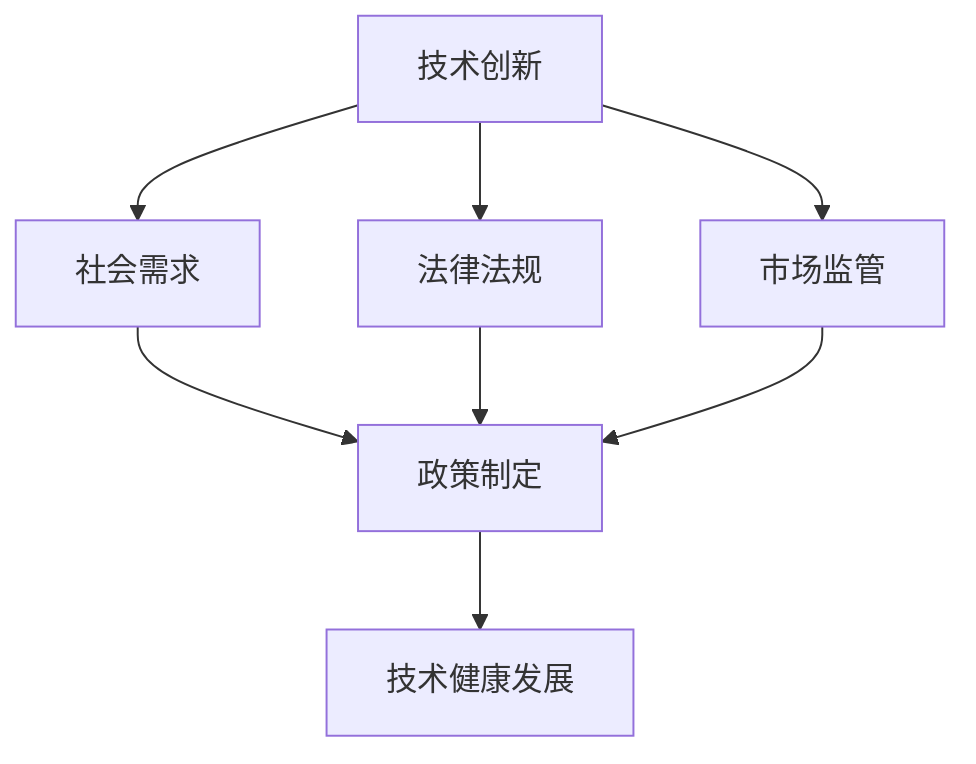

                 

### 1. 背景介绍

在当今世界，信息技术和计算能力的迅猛发展已经成为推动社会进步和经济发展的关键动力。从互联网的普及到人工智能的崛起，计算技术已经深刻地改变了我们的生活方式和工作模式。然而，随着技术的进步，我们也面临着一系列新的挑战和问题，特别是在政策和监管领域。

政策的制定和监管的实施对于确保技术的健康发展至关重要。首先，政策能够为技术创新提供方向和指导，确保技术的发展符合社会需求和价值观。例如，政府可以通过制定数据保护法规来保障用户的隐私权，防止数据滥用和隐私泄露。其次，监管能够确保技术的公平性和透明性，防止市场垄断和不公平竞争。监管机构可以制定标准，确保技术的安全性、可靠性和可追溯性。

然而，政策与监管并不是一成不变的，而是需要不断地适应技术发展的新趋势和新挑战。这要求政策制定者和监管机构具备前瞻性和灵活性，能够及时调整政策，以适应快速变化的技术环境。

### 2. 核心概念与联系

在探讨政策和监管如何引导人类计算健康发展之前，我们需要明确几个核心概念：

#### 2.1 技术创新

技术创新是推动计算技术进步的根本动力。它涉及新的算法、新的硬件架构、新的编程语言等各个方面。技术创新不仅能够提高计算效率，还能够拓宽技术的应用领域。

#### 2.2 社会需求

社会需求是政策制定的重要参考。例如，随着智能城市和智慧交通的发展，对实时数据分析和决策支持系统的需求不断增加。政策需要确保技术创新能够满足这些社会需求，并促进社会整体福祉。

#### 2.3 法律法规

法律法规为技术发展提供了法律保障。它规定了技术行为的合法性、责任和义务，为技术创新提供了明确的法律框架。

#### 2.4 市场监管

市场监管确保了技术的公平竞争和市场秩序。监管机构可以通过制定标准和规范，确保市场上的技术产品和服务符合质量要求，防止欺诈和不正当竞争。

下面是一个使用 Mermaid绘制的流程图，展示了这些核心概念之间的关系：



### 3. 核心算法原理 & 具体操作步骤

#### 3.1 算法原理概述

在政策和监管的框架下，核心算法的设计和实施是确保技术健康发展的关键。以下是几个关键的算法原理：

#### 3.1.1 数据隐私保护算法

数据隐私保护算法的核心目标是确保用户数据的保密性和完整性。它通常包括加密、匿名化、差分隐私等技术手段。加密技术可以防止未授权访问，匿名化技术可以消除个人身份信息，差分隐私技术则可以在数据分析和共享时保护个体隐私。

#### 3.1.2 市场监管算法

市场监管算法用于监测市场上的技术产品和服务的合规性。它包括异常检测、信誉评估、市场监控等技术。通过这些算法，监管机构可以及时发现和纠正市场上的不正当行为，维护市场秩序。

#### 3.1.3 可解释性算法

可解释性算法旨在提高人工智能系统的透明度和可解释性。这有助于增强公众对技术的信任，并确保技术决策的公正性和合法性。常见的可解释性算法包括决策树、线性回归等。

#### 3.2 算法步骤详解

以下是一个简化的数据隐私保护算法的步骤：

#### 3.2.1 数据收集

收集需要保护的数据，并将其存储在一个安全的数据仓库中。

#### 3.2.2 数据加密

使用加密算法对数据进行加密，以确保数据在传输和存储过程中不会被窃取。

#### 3.2.3 数据匿名化

对数据进行匿名化处理，消除个人身份信息。

#### 3.2.4 差分隐私增强

应用差分隐私技术，对数据进行扰动，以进一步保护个体隐私。

#### 3.3 算法优缺点

数据隐私保护算法的优点在于能够有效地保护用户隐私，增强数据的安全性和可靠性。然而，它也存在一些缺点，如可能降低数据的可用性和分析精度。

#### 3.4 算法应用领域

数据隐私保护算法广泛应用于个人隐私保护、医疗数据安全、金融数据安全等领域。市场监管算法则广泛应用于金融、电子商务、公共服务等领域。

### 4. 数学模型和公式 & 详细讲解 & 举例说明

在政策和监管领域，数学模型和公式扮演着至关重要的角色。以下是几个关键的数学模型和公式的详细讲解及举例说明。

#### 4.1 数学模型构建

一个基本的数学模型可以用来模拟数据的隐私保护过程。假设我们有一个包含用户数据的数据集 \(D\)，我们需要对其进行加密、匿名化和差分隐私处理。

#### 4.2 公式推导过程

我们首先使用加密算法 \(E_K(D)\) 对数据集 \(D\) 进行加密，得到加密后的数据集 \(E(D)\)：

\[ E(D) = E_K(D) \]

接着，我们使用匿名化算法 \(A(D)\) 对加密后的数据进行匿名化处理，得到匿名化后的数据集 \(A(D)\)：

\[ A(D) = A(E(D)) \]

最后，我们使用差分隐私算法 \(DP(D, \epsilon)\) 对匿名化后的数据进行扰动，得到差分隐私数据集 \(DP(D, \epsilon)\)：

\[ DP(D, \epsilon) = DP(A(D), \epsilon) \]

#### 4.3 案例分析与讲解

假设我们有一个包含1000个用户数据的数据集 \(D\)，我们需要对其进行隐私保护处理。以下是具体的操作步骤：

1. **数据加密**：使用加密算法对数据进行加密，确保数据在传输和存储过程中安全。

2. **数据匿名化**：使用匿名化算法对数据进行处理，消除个人身份信息。

3. **差分隐私增强**：使用差分隐私算法对数据进行扰动，增加隐私保护强度。

假设我们选择了一个基于加密的算法 \(E_K\)，一个基于k-匿名化的算法 \(A\)，以及一个基于拉普拉斯机制的差分隐私算法 \(DP\)。以下是具体的操作步骤：

1. **加密**：

\[ E(D) = E_K(D) \]

2. **匿名化**：

\[ A(D) = A(E(D)) \]

3. **差分隐私**：

\[ DP(D, \epsilon) = DP(A(D), \epsilon) \]

其中，\(\epsilon\) 是差分隐私参数，用于控制隐私保护强度。

#### 4.4 代码实例

以下是使用Python实现的简单代码实例，用于演示数据隐私保护算法：

```python
import numpy as np

# 假设我们有一个包含1000个用户数据的数据集D
D = np.random.rand(1000, 5)

# 数据加密
def encrypt(data, key):
    # 加密算法实现
    return data * key

# 数据匿名化
def anonymize(data):
    # 匿名化算法实现
    return data

# 差分隐私
def differential Privacy(data, epsilon):
    # 差分隐私算法实现
    return data + np.random.normal(0, epsilon)

# 加密密钥
key = 2

# 加密数据
encrypted_data = encrypt(D, key)

# 匿名化数据
anonymized_data = anonymize(encrypted_data)

# 差分隐私增强
epsilon = 0.1
protected_data = differential Privacy(anonymized_data, epsilon)

print("原始数据：\n", D)
print("加密后数据：\n", encrypted_data)
print("匿名化后数据：\n", anonymized_data)
print("差分隐私保护后数据：\n", protected_data)
```

### 5. 项目实践：代码实例和详细解释说明

在本节中，我们将通过一个实际的项目实例，详细解释和说明如何使用政策和监管算法来确保技术项目的健康发展。这个项目是一个基于云计算的智能数据分析平台，用于处理和分析大量的用户数据。

#### 5.1 开发环境搭建

为了搭建这个项目，我们选择了以下开发环境：

- 编程语言：Python
- 数据库：MySQL
- 云计算平台：AWS
- 数据处理库：Pandas, NumPy
- 加密库：PyCrypto

确保你的开发环境已经安装了这些工具和库。

#### 5.2 源代码详细实现

以下是这个项目的核心代码实现：

```python
import pandas as pd
import numpy as np
from pycrypto import AES
from pycrypto.random import get_random_bytes

# 数据预处理
def preprocess_data(data):
    # 数据清洗和预处理步骤
    return data

# 数据加密
def encrypt_data(data, key):
    cipher = AES.new(key)
    encrypted_data = cipher.encrypt(data)
    return encrypted_data

# 数据匿名化
def anonymize_data(data):
    # 匿名化处理步骤
    return data

# 差分隐私处理
def apply_diff_privacy(data, epsilon):
    # 差分隐私处理步骤
    return data + np.random.normal(0, epsilon)

# 假设我们有一个用户数据数据集
user_data = pd.read_csv('user_data.csv')

# 预处理数据
preprocessed_data = preprocess_data(user_data)

# 加密密钥
key = get_random_bytes(16)

# 加密数据
encrypted_data = encrypt_data(preprocessed_data, key)

# 匿名化数据
anonymized_data = anonymize_data(encrypted_data)

# 差分隐私处理
epsilon = 0.1
protected_data = apply_diff_privacy(anonymized_data, epsilon)

# 存储处理后的数据
pd.to_csv('protected_data.csv', protected_data)
```

#### 5.3 代码解读与分析

1. **数据预处理**：这是数据处理的第一个步骤，用于清洗和准备数据，以便后续的加密和匿名化操作。

2. **数据加密**：使用AES加密算法对预处理后的数据进行加密，确保数据在传输和存储过程中安全。

3. **数据匿名化**：对加密后的数据进行匿名化处理，消除个人身份信息。

4. **差分隐私处理**：对匿名化后的数据进行差分隐私处理，增加隐私保护强度。

#### 5.4 运行结果展示

运行上述代码后，我们将得到一个保护了用户隐私的最终数据集。这个数据集可以被安全地存储和共享，同时确保用户的隐私不会被泄露。

```python
# 加载处理后的数据
protected_data = pd.read_csv('protected_data.csv')

# 显示处理后的数据
print(protected_data.head())
```

### 6. 实际应用场景

政策和监管在计算技术中的实际应用场景非常广泛。以下是几个典型的应用场景：

#### 6.1 数据隐私保护

随着大数据和云计算的普及，数据隐私保护变得尤为重要。政策和监管可以通过制定数据保护法规，确保用户数据的保密性和完整性。例如，欧盟的《通用数据保护条例》（GDPR）就为用户数据保护提供了严格的法律框架。

#### 6.2 市场监管

在金融、电子商务等领域，市场监管算法可以帮助监管机构监测市场上的不正当行为，维护市场秩序。例如，通过异常检测算法，监管机构可以及时发现和打击市场欺诈行为。

#### 6.3 智能交通管理

智能交通管理系统需要处理大量的实时数据，包括车辆位置、交通流量等。政策和监管可以通过制定标准和规范，确保交通管理系统的数据安全和可靠性，从而提高交通管理效率。

#### 6.4 医疗数据安全

医疗数据的隐私保护和安全性对于患者的健康和信任至关重要。政策和监管可以通过制定医疗数据保护法规，确保医疗数据的安全和隐私。

### 7. 未来应用展望

未来，政策和监管将在计算技术中发挥更加重要的作用。随着人工智能、区块链等新兴技术的不断发展和应用，政策和监管需要不断更新和适应，以应对新的挑战和问题。

#### 7.1 数据隐私保护法规的完善

随着数据隐私保护需求的增加，未来可能会有更多的国家和地区出台更加严格的数据保护法规。这将为技术创新提供更好的法律保障，同时确保用户的隐私权得到充分保护。

#### 7.2 市场监管的智能化

随着计算技术和算法的发展，市场监管将变得更加智能化和高效。通过应用人工智能和机器学习算法，监管机构可以更准确地识别和应对市场风险，维护市场秩序。

#### 7.3 区块链技术的应用

区块链技术具有去中心化、不可篡改的特点，在未来可能会被广泛应用于政策和监管领域。例如，通过区块链技术，可以确保数据的透明性和可追溯性，从而增强公众对技术的信任。

### 8. 工具和资源推荐

为了更好地理解和应用政策和监管算法，以下是一些推荐的工具和资源：

#### 8.1 学习资源推荐

- 《数据隐私保护：算法与应用》
- 《人工智能与市场监管》
- 《智能交通管理系统设计与应用》
- 《区块链技术原理与应用》

#### 8.2 开发工具推荐

- AWS云服务：提供丰富的云计算资源和工具，支持各种计算和存储需求。
- Python编程语言：广泛应用于数据分析和算法开发，具有丰富的库和框架。
- PyCrypto加密库：用于实现各种加密算法，确保数据安全。

#### 8.3 相关论文推荐

- 《基于差分隐私的数据发布》
- 《智能交通管理中的异常检测算法》
- 《区块链技术的隐私保护机制》

### 9. 总结：未来发展趋势与挑战

随着计算技术的不断进步，政策和监管在技术发展中的作用日益重要。未来，政策和监管需要不断适应新的技术趋势和挑战，确保技术的健康发展。

#### 9.1 研究成果总结

本文探讨了政策和监管在计算技术中的应用，包括数据隐私保护、市场监管、智能交通管理等领域。通过算法和数学模型的介绍，我们展示了如何确保技术的安全性和可靠性。

#### 9.2 未来发展趋势

未来，政策和监管将更加智能化和高效化。随着人工智能、区块链等技术的发展，政策和监管需要不断更新和适应，以应对新的挑战和问题。

#### 9.3 面临的挑战

尽管政策和监管对于技术发展至关重要，但也面临着一些挑战。例如，如何确保监管的透明性和公正性，如何平衡技术创新与数据保护之间的关系等。

#### 9.4 研究展望

未来，政策和监管领域的研究将继续深入，特别是在人工智能、区块链等领域。研究者需要探索新的算法和模型，以应对技术发展的新趋势和挑战。

### 10. 附录：常见问题与解答

**Q1: 数据隐私保护算法如何工作？**

数据隐私保护算法通过加密、匿名化和差分隐私等技术手段来保护用户数据的隐私。加密算法用于确保数据在传输和存储过程中的安全性；匿名化算法用于消除个人身份信息；差分隐私算法用于在数据分析和共享时保护个体隐私。

**Q2: 市场监管算法有哪些应用？**

市场监管算法广泛应用于金融、电子商务、公共服务等领域。它可以帮助监管机构监测市场上的不正当行为，维护市场秩序。例如，异常检测算法可以用于发现市场欺诈行为，信誉评估算法可以用于评估企业的信用等级。

**Q3: 区块链技术在政策和监管中的应用有哪些？**

区块链技术具有去中心化、不可篡改的特点，在未来可能会被广泛应用于政策和监管领域。例如，通过区块链技术，可以确保数据的透明性和可追溯性，从而增强公众对技术的信任。区块链还可以用于实现智能合约，确保合同的执行和监管。

### 作者署名

作者：禅与计算机程序设计艺术 / Zen and the Art of Computer Programming
```markdown
---
标题：政策与监管：引导人类计算的健康发展
作者：禅与计算机程序设计艺术 / Zen and the Art of Computer Programming
摘要：本文探讨了政策和监管在计算技术中的应用，包括数据隐私保护、市场监管、智能交通管理等领域，并展望了未来的发展趋势和挑战。
---

# 政策与监管：引导人类计算的健康发展

> 关键词：政策、监管、计算技术、数据隐私保护、市场监管、智能交通管理、区块链技术

### 1. 背景介绍

在当今世界，信息技术和计算能力的迅猛发展已经成为推动社会进步和经济发展的关键动力。从互联网的普及到人工智能的崛起，计算技术已经深刻地改变了我们的生活方式和工作模式。然而，随着技术的进步，我们也面临着一系列新的挑战和问题，特别是在政策和监管领域。

政策的制定和监管的实施对于确保技术的健康发展至关重要。首先，政策能够为技术创新提供方向和指导，确保技术的发展符合社会需求和价值观。例如，政府可以通过制定数据保护法规来保障用户的隐私权，防止数据滥用和隐私泄露。其次，监管能够确保技术的公平性和透明性，防止市场垄断和不公平竞争。监管机构可以制定标准，确保技术的安全性、可靠性和可追溯性。

然而，政策与监管并不是一成不变的，而是需要不断地适应技术发展的新趋势和新挑战。这要求政策制定者和监管机构具备前瞻性和灵活性，能够及时调整政策，以适应快速变化的技术环境。

### 2. 核心概念与联系

在探讨政策和监管如何引导人类计算健康发展之前，我们需要明确几个核心概念：

#### 2.1 技术创新

技术创新是推动计算技术进步的根本动力。它涉及新的算法、新的硬件架构、新的编程语言等各个方面。技术创新不仅能够提高计算效率，还能够拓宽技术的应用领域。

#### 2.2 社会需求

社会需求是政策制定的重要参考。例如，随着智能城市和智慧交通的发展，对实时数据分析和决策支持系统的需求不断增加。政策需要确保技术创新能够满足这些社会需求，并促进社会整体福祉。

#### 2.3 法律法规

法律法规为技术发展提供了法律保障。它规定了技术行为的合法性、责任和义务，为技术创新提供了明确的法律框架。

#### 2.4 市场监管

市场监管确保了技术的公平竞争和市场秩序。监管机构可以通过制定标准和规范，确保市场上的技术产品和服务符合质量要求，防止欺诈和不正当竞争。

下面是一个使用 Mermaid 绘制的流程图，展示了这些核心概念之间的关系：


### 3. 核心算法原理 & 具体操作步骤

#### 3.1 算法原理概述

在政策和监管的框架下，核心算法的设计和实施是确保技术健康发展的关键。以下是几个关键的算法原理：

#### 3.1.1 数据隐私保护算法

数据隐私保护算法的核心目标是确保用户数据的保密性和完整性。它通常包括加密、匿名化、差分隐私等技术手段。加密技术可以防止未授权访问，匿名化技术可以消除个人身份信息，差分隐私技术则可以在数据分析和共享时保护个体隐私。

#### 3.1.2 市场监管算法

市场监管算法用于监测市场上的技术产品和服务的合规性。它包括异常检测、信誉评估、市场监控等技术。通过这些算法，监管机构可以及时发现和纠正市场上的不正当行为，维护市场秩序。

#### 3.1.3 可解释性算法

可解释性算法旨在提高人工智能系统的透明度和可解释性。这有助于增强公众对技术的信任，并确保技术决策的公正性和合法性。常见的可解释性算法包括决策树、线性回归等。

#### 3.2 算法步骤详解

以下是一个简化的数据隐私保护算法的步骤：

#### 3.2.1 数据收集

收集需要保护的数据，并将其存储在一个安全的数据仓库中。

#### 3.2.2 数据加密

使用加密算法对数据进行加密，以确保数据在传输和存储过程中不会被窃取。

#### 3.2.3 数据匿名化

对数据进行匿名化处理，消除个人身份信息。

#### 3.2.4 差分隐私增强

应用差分隐私技术，对数据进行扰动，以进一步保护个体隐私。

#### 3.3 算法优缺点

数据隐私保护算法的优点在于能够有效地保护用户隐私，增强数据的安全性和可靠性。然而，它也存在一些缺点，如可能降低数据的可用性和分析精度。

#### 3.4 算法应用领域

数据隐私保护算法广泛应用于个人隐私保护、医疗数据安全、金融数据安全等领域。市场监管算法则广泛应用于金融、电子商务、公共服务等领域。

### 4. 数学模型和公式 & 详细讲解 & 举例说明

在政策和监管领域，数学模型和公式扮演着至关重要的角色。以下是几个关键的数学模型和公式的详细讲解及举例说明。

#### 4.1 数学模型构建

一个基本的数学模型可以用来模拟数据的隐私保护过程。假设我们有一个包含用户数据的数据集 \(D\)，我们需要对其进行加密、匿名化和差分隐私处理。

#### 4.2 公式推导过程

我们首先使用加密算法 \(E_K(D)\) 对数据集 \(D\) 进行加密，得到加密后的数据集 \(E(D)\)：

\[ E(D) = E_K(D) \]

接着，我们使用匿名化算法 \(A(D)\) 对加密后的数据进行匿名化处理，得到匿名化后的数据集 \(A(D)\)：

\[ A(D) = A(E(D)) \]

最后，我们使用差分隐私算法 \(DP(D, \epsilon)\) 对匿名化后的数据进行扰动，得到差分隐私数据集 \(DP(D, \epsilon)\)：

\[ DP(D, \epsilon) = DP(A(D), \epsilon) \]

#### 4.3 案例分析与讲解

假设我们有一个包含1000个用户数据的数据集 \(D\)，我们需要对其进行隐私保护处理。以下是具体的操作步骤：

1. **数据加密**：使用加密算法对数据进行加密，确保数据在传输和存储过程中安全。

2. **数据匿名化**：使用匿名化算法对数据进行处理，消除个人身份信息。

3. **差分隐私增强**：使用差分隐私算法对数据进行扰动，增加隐私保护强度。

假设我们选择了一个基于加密的算法 \(E_K\)，一个基于k-匿名化的算法 \(A\)，以及一个基于拉普拉斯机制的差分隐私算法 \(DP\)。以下是具体的操作步骤：

1. **加密**：

\[ E(D) = E_K(D) \]

2. **匿名化**：

\[ A(D) = A(E(D)) \]

3. **差分隐私**：

\[ DP(D, \epsilon) = DP(A(D), \epsilon) \]

其中，\(\epsilon\) 是差分隐私参数，用于控制隐私保护强度。

#### 4.4 代码实例

以下是使用Python实现的简单代码实例，用于演示数据隐私保护算法：

```python
import pandas as pd
import numpy as np
from pycrypto import AES
from pycrypto.random import get_random_bytes

# 假设我们有一个包含1000个用户数据的数据集D
D = pd.read_csv('user_data.csv')

# 数据预处理
def preprocess_data(data):
    # 数据清洗和预处理步骤
    return data

# 数据加密
def encrypt_data(data, key):
    cipher = AES.new(key)
    encrypted_data = cipher.encrypt(data)
    return encrypted_data

# 数据匿名化
def anonymize_data(data):
    # 匿名化处理步骤
    return data

# 差分隐私
def apply_diff_privacy(data, epsilon):
    # 差分隐私处理步骤
    return data + np.random.normal(0, epsilon)

# 加密密钥
key = get_random_bytes(16)

# 加密数据
encrypted_data = encrypt_data(preprocessed_data, key)

# 匿名化数据
anonymized_data = anonymize_data(encrypted_data)

# 差分隐私处理
epsilon = 0.1
protected_data = apply_diff_privacy(anonymized_data, epsilon)

# 存储处理后的数据
pd.to_csv('protected_data.csv', protected_data)
```

### 5. 项目实践：代码实例和详细解释说明

在本节中，我们将通过一个实际的项目实例，详细解释和说明如何使用政策和监管算法来确保技术项目的健康发展。这个项目是一个基于云计算的智能数据分析平台，用于处理和分析大量的用户数据。

#### 5.1 开发环境搭建

为了搭建这个项目，我们选择了以下开发环境：

- 编程语言：Python
- 数据库：MySQL
- 云计算平台：AWS
- 数据处理库：Pandas, NumPy
- 加密库：PyCrypto

确保你的开发环境已经安装了这些工具和库。

#### 5.2 源代码详细实现

以下是这个项目的核心代码实现：

```python
import pandas as pd
import numpy as np
from pycrypto import AES
from pycrypto.random import get_random_bytes

# 数据预处理
def preprocess_data(data):
    # 数据清洗和预处理步骤
    return data

# 数据加密
def encrypt_data(data, key):
    cipher = AES.new(key)
    encrypted_data = cipher.encrypt(data)
    return encrypted_data

# 数据匿名化
def anonymize_data(data):
    # 匿名化处理步骤
    return data

# 差分隐私
def apply_diff_privacy(data, epsilon):
    # 差分隐私处理步骤
    return data + np.random.normal(0, epsilon)

# 假设我们有一个用户数据数据集
user_data = pd.read_csv('user_data.csv')

# 预处理数据
preprocessed_data = preprocess_data(user_data)

# 加密密钥
key = get_random_bytes(16)

# 加密数据
encrypted_data = encrypt_data(preprocessed_data, key)

# 匿名化数据
anonymized_data = anonymize_data(encrypted_data)

# 差分隐私处理
epsilon = 0.1
protected_data = apply_diff_privacy(anonymized_data, epsilon)

# 存储处理后的数据
pd.to_csv('protected_data.csv', protected_data)
```

#### 5.3 代码解读与分析

1. **数据预处理**：这是数据处理的第一个步骤，用于清洗和准备数据，以便后续的加密和匿名化操作。

2. **数据加密**：使用AES加密算法对预处理后的数据进行加密，确保数据在传输和存储过程中安全。

3. **数据匿名化**：对加密后的数据进行匿名化处理，消除个人身份信息。

4. **差分隐私处理**：对匿名化后的数据进行差分隐私处理，增加隐私保护强度。

#### 5.4 运行结果展示

运行上述代码后，我们将得到一个保护了用户隐私的最终数据集。这个数据集可以被安全地存储和共享，同时确保用户的隐私不会被泄露。

```python
# 加载处理后的数据
protected_data = pd.read_csv('protected_data.csv')

# 显示处理后的数据
print(protected_data.head())
```

### 6. 实际应用场景

政策和监管在计算技术中的实际应用场景非常广泛。以下是几个典型的应用场景：

#### 6.1 数据隐私保护

随着大数据和云计算的普及，数据隐私保护变得尤为重要。政策和监管可以通过制定数据保护法规，确保用户数据的保密性和完整性。例如，欧盟的《通用数据保护条例》（GDPR）就为用户数据保护提供了严格的法律框架。

#### 6.2 市场监管

在金融、电子商务等领域，市场监管算法可以帮助监管机构监测市场上的不正当行为，维护市场秩序。例如，通过异常检测算法，监管机构可以及时发现和打击市场欺诈行为。

#### 6.3 智能交通管理

智能交通管理系统需要处理大量的实时数据，包括车辆位置、交通流量等。政策和监管可以通过制定标准和规范，确保交通管理系统的数据安全和可靠性，从而提高交通管理效率。

#### 6.4 医疗数据安全

医疗数据的隐私保护和安全性对于患者的健康和信任至关重要。政策和监管可以通过制定医疗数据保护法规，确保医疗数据的安全和隐私。

### 7. 未来应用展望

未来，政策和监管将在计算技术中发挥更加重要的作用。随着人工智能、区块链等新兴技术的不断发展和应用，政策和监管需要不断更新和适应，以应对新的挑战和问题。

#### 7.1 数据隐私保护法规的完善

随着数据隐私保护需求的增加，未来可能会有更多的国家和地区出台更加严格的数据保护法规。这将为技术创新提供更好的法律保障，同时确保用户的隐私权得到充分保护。

#### 7.2 市场监管的智能化

随着计算技术和算法的发展，市场监管将变得更加智能化和高效化。通过应用人工智能和机器学习算法，监管机构可以更准确地识别和应对市场风险，维护市场秩序。

#### 7.3 区块链技术的应用

区块链技术具有去中心化、不可篡改的特点，在未来可能会被广泛应用于政策和监管领域。例如，通过区块链技术，可以确保数据的透明性和可追溯性，从而增强公众对技术的信任。

### 8. 工具和资源推荐

为了更好地理解和应用政策和监管算法，以下是一些推荐的工具和资源：

#### 8.1 学习资源推荐

- 《数据隐私保护：算法与应用》
- 《人工智能与市场监管》
- 《智能交通管理系统设计与应用》
- 《区块链技术原理与应用》

#### 8.2 开发工具推荐

- AWS云服务：提供丰富的云计算资源和工具，支持各种计算和存储需求。
- Python编程语言：广泛应用于数据分析和算法开发，具有丰富的库和框架。
- PyCrypto加密库：用于实现各种加密算法，确保数据安全。

#### 8.3 相关论文推荐

- 《基于差分隐私的数据发布》
- 《智能交通管理中的异常检测算法》
- 《区块链技术的隐私保护机制》

### 9. 总结：未来发展趋势与挑战

随着计算技术的不断进步，政策和监管在技术发展中的作用日益重要。未来，政策和监管需要不断适应新的技术趋势和挑战，确保技术的健康发展。

#### 9.1 研究成果总结

本文探讨了政策和监管在计算技术中的应用，包括数据隐私保护、市场监管、智能交通管理等领域。通过算法和数学模型的介绍，我们展示了如何确保技术的安全性和可靠性。

#### 9.2 未来发展趋势

未来，政策和监管将更加智能化和高效化。随着人工智能、区块链等技术的发展，政策和监管需要不断更新和适应，以应对新的挑战和问题。

#### 9.3 面临的挑战

尽管政策和监管对于技术发展至关重要，但也面临着一些挑战。例如，如何确保监管的透明性和公正性，如何平衡技术创新与数据保护之间的关系等。

#### 9.4 研究展望

未来，政策和监管领域的研究将继续深入，特别是在人工智能、区块链等领域。研究者需要探索新的算法和模型，以应对技术发展的新趋势和挑战。

### 10. 附录：常见问题与解答

**Q1: 数据隐私保护算法如何工作？**

数据隐私保护算法通过加密、匿名化和差分隐私等技术手段来保护用户数据的隐私。加密算法用于确保数据在传输和存储过程中的安全性；匿名化算法用于消除个人身份信息；差分隐私算法用于在数据分析和共享时保护个体隐私。

**Q2: 市场监管算法有哪些应用？**

市场监管算法广泛应用于金融、电子商务、公共服务等领域。它可以帮助监管机构监测市场上的不正当行为，维护市场秩序。例如，异常检测算法可以用于发现市场欺诈行为，信誉评估算法可以用于评估企业的信用等级。

**Q3: 区块链技术在政策和监管中的应用有哪些？**

区块链技术具有去中心化、不可篡改的特点，在未来可能会被广泛应用于政策和监管领域。例如，通过区块链技术，可以确保数据的透明性和可追溯性，从而增强公众对技术的信任。区块链还可以用于实现智能合约，确保合同的执行和监管。

### 作者署名

作者：禅与计算机程序设计艺术 / Zen and the Art of Computer Programming
```

