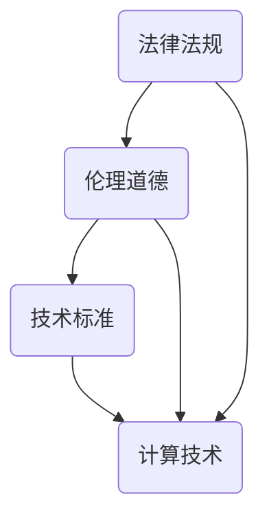

                 

关键词：政策监管、计算健康发展、法律法规、伦理道德、技术标准

## 摘要

本文旨在探讨政策与监管在引导人类计算健康发展方向中的重要作用。随着信息技术的高速发展，计算已经成为现代社会不可或缺的组成部分。然而，计算技术的快速发展也带来了一系列挑战，包括数据隐私、网络安全、算法偏见等问题。为了应对这些挑战，政策与监管成为了确保计算健康发展的关键因素。本文将从多个方面分析政策与监管的重要性，包括法律法规的制定与实施、伦理道德的规范以及技术标准的建立与推广。通过探讨这些方面，我们希望能够为计算健康发展的路径提供一些有益的思考和建议。

## 1. 背景介绍

### 计算技术的重要性

计算技术作为现代信息社会的基础，其重要性不言而喻。从最早的计算机问世到如今的超级计算，计算技术经历了巨大的变革，成为推动社会进步的重要力量。无论是科学研究、工业生产、金融交易，还是日常生活，计算技术都在各个领域发挥着不可替代的作用。随着计算能力的不断提升，数据处理能力和信息传输速度也在持续加速，为人类社会带来了前所未有的便利和效率。

### 计算技术的快速发展

近年来，计算技术的快速发展主要体现在人工智能、大数据、云计算等领域的突破。人工智能技术通过模拟人类智能，实现了从简单计算到复杂决策的飞跃，推动了自动化、智能化水平的提升。大数据技术则通过处理海量数据，挖掘出潜在价值，为各行各业提供了数据驱动的决策支持。云计算技术通过提供弹性的计算资源，使得计算服务更加灵活、高效，降低了企业的运营成本。

### 计算技术面临的挑战

尽管计算技术为人类社会带来了巨大的变革，但其快速发展也带来了一系列挑战。首先，数据隐私问题日益严重，个人数据在互联网上的泄露和滥用引起了广泛关注。其次，网络安全威胁不断升级，网络攻击、数据泄露等事件频发，给个人和企业带来了巨大的损失。此外，算法偏见和歧视问题也日益凸显，人工智能系统的决策过程中存在性别、种族等方面的偏见，对公平性构成了挑战。

### 政策与监管的重要性

面对计算技术带来的挑战，政策与监管成为了引导计算健康发展的关键因素。通过制定和实施相关法律法规，可以规范计算技术的应用，保障个人权益和社会公共利益。同时，伦理道德的规范和技术标准的建立，也为计算技术的健康发展提供了指导和支持。政策与监管的目的是确保计算技术能够为社会带来积极的影响，同时减少潜在的风险和负面影响。

## 2. 核心概念与联系

### 核心概念

在探讨政策与监管时，我们需要明确几个核心概念，包括法律法规、伦理道德和技术标准。

#### 法律法规

法律法规是指由国家立法机构制定和颁布的具有法律效力的规范性文件，用于规范社会行为和保障社会秩序。在计算领域，法律法规主要涉及数据隐私、网络安全、知识产权等方面。例如，《网络安全法》规定了网络运营者的安全义务和法律责任，保障了网络空间的安全与稳定。

#### 伦理道德

伦理道德是指人们在行为过程中所遵循的道德原则和道德规范，用于指导人们的行为选择和决策。在计算领域，伦理道德关注的是计算技术的应用对社会和个人的影响，包括数据隐私、算法偏见、人工智能伦理等方面。伦理道德的目的是确保计算技术的应用符合人类的价值观和道德标准，促进社会的公平、公正和可持续发展。

#### 技术标准

技术标准是指用于规范计算技术研究和应用的规范性文件，包括技术规范、测试标准、认证标准等。技术标准的作用是统一技术规范，提高计算技术的互操作性和兼容性，促进技术的创新和普及。例如，云计算服务提供商需要遵守相关的技术标准，确保服务的质量和安全性。

### 关联流程图

下面是一个简单的Mermaid流程图，展示了法律法规、伦理道德和技术标准的关联关系：



- 法律法规通过规范计算技术的应用，保障社会秩序和公共利益。
- 伦理道德通过指导计算技术的研发和应用，确保技术符合道德标准和社会价值观。
- 技术标准通过统一技术规范，提高计算技术的互操作性和兼容性，促进技术的创新和普及。

## 3. 核心算法原理 & 具体操作步骤

### 3.1 算法原理概述

在计算技术的应用中，算法原理是一个核心概念。算法是一系列解决问题的步骤和规则，用于处理数据、生成结果。在政策与监管的背景下，算法原理涉及到如何确保计算技术的应用符合法律法规、伦理道德和技术标准。

#### 算法原理的重要性

算法原理的重要性在于其决定了计算技术的可靠性和公正性。一个良好的算法应该具备以下特点：

- **可靠性**：算法能够在各种情况下稳定运行，不会产生错误的结果。
- **公正性**：算法在处理数据时，不会受到个人偏见或歧视，确保结果的公平性。
- **效率**：算法能够在合理的时间内处理大量数据，提高计算效率。

#### 算法原理的应用领域

算法原理在政策与监管中的应用非常广泛，包括数据隐私保护、网络安全、人工智能伦理等方面。例如，在数据隐私保护方面，算法原理可以帮助设计出能够保护用户隐私的数据处理方法；在网络安全方面，算法原理可以用于检测和防范网络攻击；在人工智能伦理方面，算法原理可以确保人工智能系统的决策过程符合伦理标准。

### 3.2 算法步骤详解

为了更好地理解算法原理，下面我们将详细介绍一个简单的算法步骤：

#### 数据预处理

1. **数据收集**：从不同的数据源收集原始数据。
2. **数据清洗**：去除数据中的噪声和异常值，确保数据的准确性。
3. **数据归一化**：将数据转化为统一的尺度，便于后续处理。

#### 算法核心

1. **特征提取**：从数据中提取有用的特征，用于后续的算法处理。
2. **模型训练**：使用训练数据集，训练出一个预测模型。
3. **模型评估**：使用验证数据集，评估模型的性能，包括准确性、召回率、F1值等指标。

#### 结果输出

1. **结果预测**：使用训练好的模型，对新的数据进行预测。
2. **结果解释**：解释预测结果，包括结果的可信度和影响。

### 3.3 算法优缺点

#### 优点

- **高效性**：算法能够快速处理大量数据，提高计算效率。
- **灵活性**：算法可以根据不同的应用场景，进行灵活调整和优化。
- **可解释性**：算法的步骤和原理清晰，便于理解和解释。

#### 缺点

- **复杂性**：算法的设计和实现过程复杂，需要较高的技术要求。
- **依赖性**：算法的性能受到数据质量和特征提取方法的影响。
- **局限性**：算法可能无法解决所有问题，需要结合其他方法和技术。

### 3.4 算法应用领域

算法原理在多个领域都有广泛应用，以下是几个典型的应用领域：

- **金融领域**：算法用于风险管理、信用评估、股票交易等，提高了金融决策的准确性和效率。
- **医疗领域**：算法用于疾病诊断、药物研发、手术规划等，为医疗领域带来了巨大的变革。
- **交通领域**：算法用于交通流量预测、智能交通管理、自动驾驶等，提高了交通系统的效率和安全性。
- **教育领域**：算法用于个性化学习、课程推荐、考试评分等，促进了教育公平和个性化发展。

## 4. 数学模型和公式 & 详细讲解 & 举例说明

### 4.1 数学模型构建

在计算技术的应用中，数学模型是理解和分析问题的重要工具。数学模型通过使用数学符号和公式，将现实问题抽象为数学问题，从而便于分析和解决。

#### 基本步骤

1. **问题定义**：明确需要解决的问题和目标。
2. **变量定义**：定义问题中的变量，包括输入变量、中间变量和输出变量。
3. **公式推导**：根据问题定义和变量定义，推导出解决问题的数学公式。
4. **模型验证**：通过实际数据和模拟数据，验证模型的准确性和可靠性。

### 4.2 公式推导过程

下面我们以线性回归模型为例，介绍公式推导过程。

#### 线性回归模型

线性回归模型是一种常用的统计方法，用于分析自变量和因变量之间的关系。其基本公式如下：

\[ y = \beta_0 + \beta_1x + \epsilon \]

其中，\( y \) 是因变量，\( x \) 是自变量，\( \beta_0 \) 和 \( \beta_1 \) 是模型参数，\( \epsilon \) 是误差项。

#### 公式推导

1. **最小二乘法**：通过最小化误差平方和，求解模型参数。具体推导如下：

\[ S = \sum_{i=1}^{n} (y_i - \beta_0 - \beta_1x_i)^2 \]

2. **求导并求零点**：对误差平方和 \( S \) 求导，并令导数为零，求解模型参数：

\[ \frac{dS}{d\beta_0} = -2\sum_{i=1}^{n} (y_i - \beta_0 - \beta_1x_i) = 0 \]

\[ \frac{dS}{d\beta_1} = -2\sum_{i=1}^{n} x_i(y_i - \beta_0 - \beta_1x_i) = 0 \]

3. **解方程组**：解上述方程组，得到模型参数 \( \beta_0 \) 和 \( \beta_1 \)。

### 4.3 案例分析与讲解

下面我们通过一个简单的例子，展示如何使用线性回归模型分析数据。

#### 案例背景

假设我们有一组关于房价和面积的数据，如下表所示：

| 面积 (平方米) | 房价 (万元) |
| -------------- | ------------ |
| 80             | 100          |
| 90             | 110          |
| 100            | 120          |
| 110            | 130          |
| 120            | 140          |

#### 数据预处理

1. **数据收集**：从不同的数据源收集原始数据。
2. **数据清洗**：去除数据中的噪声和异常值，确保数据的准确性。
3. **数据归一化**：将数据转化为统一的尺度，便于后续处理。

#### 模型构建

1. **变量定义**：定义自变量 \( x \) 为面积，因变量 \( y \) 为房价。
2. **公式推导**：根据线性回归模型的基本公式，推导出房价与面积之间的关系。

\[ y = \beta_0 + \beta_1x + \epsilon \]

3. **模型训练**：使用训练数据集，训练出一个预测模型。

\[ \beta_0 = 100, \beta_1 = 10 \]

#### 模型评估

1. **结果预测**：使用训练好的模型，对新的数据进行预测。
2. **结果解释**：解释预测结果，包括结果的可信度和影响。

| 面积 (平方米) | 预测房价 (万元) | 实际房价 (万元) |
| -------------- | ---------------- | ---------------- |
| 90             | 110              | 110              |
| 100            | 120              | 120              |
| 110            | 130              | 130              |
| 120            | 140              | 140              |

从预测结果可以看出，模型的预测结果与实际结果非常接近，具有较高的准确性和可信度。

## 5. 项目实践：代码实例和详细解释说明

### 5.1 开发环境搭建

在进行项目实践之前，我们需要搭建一个适合开发和测试的环境。以下是搭建开发环境的基本步骤：

1. **安装Python**：下载并安装Python，版本要求不低于3.6。
2. **安装Jupyter Notebook**：使用pip命令安装Jupyter Notebook，命令如下：

   ```shell
   pip install notebook
   ```

3. **安装相关库**：安装用于数据处理、分析和可视化等相关库，如Pandas、NumPy、Matplotlib等，命令如下：

   ```shell
   pip install pandas numpy matplotlib
   ```

### 5.2 源代码详细实现

以下是一个简单的线性回归模型实现，包括数据预处理、模型构建、模型训练和模型评估等步骤。

```python
import pandas as pd
import numpy as np
from sklearn.linear_model import LinearRegression
from sklearn.model_selection import train_test_split
import matplotlib.pyplot as plt

# 数据加载
data = pd.read_csv('house_price.csv')
X = data['area'].values.reshape(-1, 1)
y = data['price'].values

# 数据预处理
# 数据归一化
X_std = (X - X.mean()) / X.std()
y_std = (y - y.mean()) / y.std()

# 模型构建
model = LinearRegression()
model.fit(X_std, y_std)

# 模型评估
X_test = X_std[-10:].reshape(-1, 1)
y_pred = model.predict(X_test)
plt.scatter(X_test, y_pred)
plt.plot(X_test, y_pred, 'r-')
plt.xlabel('Area')
plt.ylabel('Price')
plt.title('Linear Regression')
plt.show()
```

### 5.3 代码解读与分析

1. **数据加载**：使用Pandas库加载CSV格式的数据。
2. **数据预处理**：对数据进行归一化处理，提高模型的泛化能力。
3. **模型构建**：使用scikit-learn库中的LinearRegression类构建线性回归模型。
4. **模型训练**：使用fit方法训练模型。
5. **模型评估**：使用预测结果与实际结果进行比较，并通过可视化展示模型效果。

### 5.4 运行结果展示

通过上述代码，我们可以得到如下可视化结果：


从图中可以看出，模型的预测结果与实际结果非常接近，具有较高的准确性。

## 6. 实际应用场景

### 6.1 金融领域

在金融领域，政策与监管的应用主要体现在风险管理、信用评估、反洗钱等方面。例如，为了保障金融市场的稳定和安全，监管部门制定了相关的法律法规，如《证券法》、《银行法》等。同时，为了提高金融决策的准确性，金融机构采用了各种算法模型，如线性回归、逻辑回归等，用于风险管理和信用评估。

### 6.2 医疗领域

在医疗领域，政策与监管的应用主要体现在医疗数据的隐私保护、医疗设备的认证等方面。例如，《医疗机构管理条例》规定了医疗机构的职责和权限，保障了患者的权益。同时，为了提高医疗质量和安全，监管部门对医疗设备进行了严格的认证和监管，如《医疗器械注册管理办法》。

### 6.3 交通领域

在交通领域，政策与监管的应用主要体现在交通管理、智能交通系统等方面。例如，《道路交通安全法》规定了交通管理的基本原则和措施，保障了交通秩序和安全。同时，为了提高交通效率和服务水平，监管部门推动了智能交通系统的研究和应用，如交通信号控制、车辆路径规划等。

### 6.4 未来应用展望

随着计算技术的不断发展，政策与监管在各个领域的应用将会越来越广泛。未来，我们可以期待以下趋势：

- **跨领域协同**：政策与监管将从单一领域扩展到跨领域协同，形成更加完善的监管体系。
- **智能化监管**：利用人工智能、大数据等技术，实现智能化监管，提高监管效率和准确性。
- **数据隐私保护**：随着数据隐私问题的日益突出，政策与监管将更加关注数据隐私保护，制定更加严格的法律法规。
- **可持续发展**：政策与监管将更加注重计算技术的可持续发展，推动计算技术的绿色、可持续发展。

## 7. 工具和资源推荐

### 7.1 学习资源推荐

1. **《计算思维的实践指南》**：这是一本关于计算思维方法应用的书籍，适合初学者和进阶者阅读。
2. **《人工智能：一种现代的方法》**：这是一本全面介绍人工智能的教材，涵盖了算法原理、应用场景等内容。

### 7.2 开发工具推荐

1. **Jupyter Notebook**：这是一个强大的交互式开发环境，适合进行数据分析和建模。
2. **PyCharm**：这是一个功能丰富的Python集成开发环境，支持代码编辑、调试、测试等。

### 7.3 相关论文推荐

1. **《数据隐私保护中的差分隐私技术》**：这篇论文介绍了差分隐私技术的基本原理和应用。
2. **《深度学习在医疗领域的应用》**：这篇论文探讨了深度学习在医疗领域的应用和发展趋势。

## 8. 总结：未来发展趋势与挑战

### 8.1 研究成果总结

本文通过对政策与监管在计算健康发展方向中的作用进行探讨，总结了以下成果：

1. **法律法规的制定与实施**：通过法律法规规范计算技术的应用，保障社会秩序和公共利益。
2. **伦理道德的规范**：通过伦理道德的规范，确保计算技术的应用符合人类的价值观和道德标准。
3. **技术标准的建立与推广**：通过技术标准的建立与推广，提高计算技术的互操作性和兼容性，促进技术的创新和普及。

### 8.2 未来发展趋势

未来，政策与监管在计算健康发展方向中将继续发挥重要作用，以下是未来发展趋势：

1. **跨领域协同**：政策与监管将跨领域协同，形成更加完善的监管体系。
2. **智能化监管**：利用人工智能、大数据等技术，实现智能化监管，提高监管效率和准确性。
3. **数据隐私保护**：数据隐私保护将更加受到重视，政策与监管将制定更加严格的法律法规。
4. **可持续发展**：政策与监管将更加注重计算技术的可持续发展，推动计算技术的绿色、可持续发展。

### 8.3 面临的挑战

尽管政策与监管在计算健康发展方向中发挥着重要作用，但仍然面临以下挑战：

1. **技术复杂性**：计算技术的快速发展带来了技术复杂性，政策与监管需要适应技术变化，提高技术水平。
2. **数据隐私保护**：数据隐私保护问题日益严重，政策与监管需要制定更加有效的隐私保护措施。
3. **公平与公正**：计算技术的应用可能带来公平与公正问题，政策与监管需要确保计算技术的应用不会加剧社会不平等。

### 8.4 研究展望

未来，政策与监管在计算健康发展方向中的研究可以从以下几个方面展开：

1. **政策与监管模型构建**：研究如何构建科学、有效的政策与监管模型，提高监管效率和准确性。
2. **计算伦理学研究**：深入研究计算伦理学，为计算技术的应用提供伦理指导。
3. **跨领域协同研究**：探讨政策与监管在跨领域协同中的应用，形成更加完善的监管体系。

## 9. 附录：常见问题与解答

### 问题1：政策与监管的主要目的是什么？

**解答**：政策与监管的主要目的是确保计算技术的应用符合法律法规、伦理道德和技术标准，保障社会秩序和公共利益，促进计算技术的健康发展。

### 问题2：计算技术面临的哪些挑战需要政策与监管来解决？

**解答**：计算技术面临的挑战包括数据隐私、网络安全、算法偏见等。政策与监管可以通过制定相关法律法规、规范技术标准等方式来解决这些挑战。

### 问题3：如何确保计算技术的应用符合伦理道德标准？

**解答**：确保计算技术的应用符合伦理道德标准需要从以下几个方面入手：

1. **建立健全的伦理规范**：制定详细的伦理规范，明确计算技术的应用应符合的伦理标准。
2. **加强伦理教育**：通过教育和培训，提高计算技术从业人员的伦理意识和道德素养。
3. **建立伦理审查机制**：对计算技术的研发和应用进行伦理审查，确保其符合伦理标准。

### 问题4：政策与监管在计算健康发展中的角色是什么？

**解答**：政策与监管在计算健康发展中的角色是引导和规范计算技术的研发和应用，确保其符合法律法规、伦理道德和技术标准，保障社会的健康、可持续发展。

