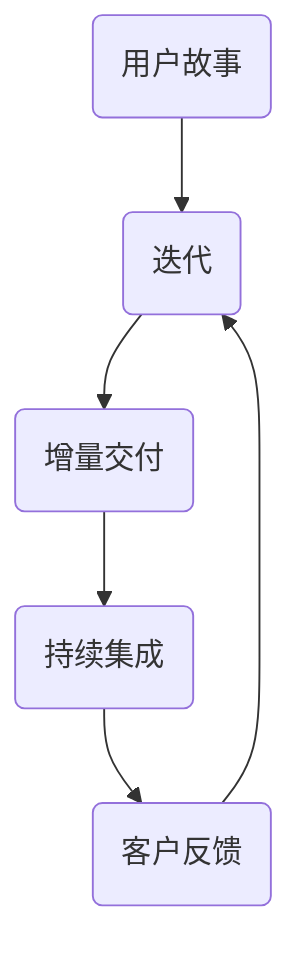

                 

 关键词：敏捷管理、组织策略、快速变化、IT项目管理、团队协作、持续交付

> 摘要：本文将深入探讨敏捷管理在快速变化的组织环境中的应用。通过分析敏捷管理的基本概念、核心原则和实践方法，结合IT项目管理的实际案例，探讨如何通过敏捷管理策略来提高组织的灵活性和响应能力，进而实现持续交付和持续改进。

## 1. 背景介绍

在当今这个信息时代，技术的快速发展带来了前所未有的变化。无论是新兴技术的不断涌现，还是市场需求的快速变化，都要求组织具备高度的灵活性和快速响应能力。在这种背景下，传统的管理模式已经难以满足组织的需要。于是，敏捷管理作为一种更为灵活和适应性强的管理方法，逐渐成为现代组织追求的目标。

敏捷管理起源于软件开发领域，最早由Ken Schwaber和Jeff Sutherland在2001年提出的《敏捷宣言》和《敏捷手册》奠定了基础。敏捷管理强调以人为本，关注客户需求，通过短周期的迭代和持续交付来适应变化，从而提高产品的质量和团队的工作效率。

## 2. 核心概念与联系

### 2.1 敏捷管理的核心概念

敏捷管理包含了一系列核心概念，如用户故事、迭代、增量交付、持续集成等。这些概念共同构成了敏捷管理的基本框架。

#### 用户故事

用户故事是敏捷开发中的一个重要概念，它代表了用户的需求和期望。用户故事通常以“作为……，我想……，以便……”的形式来表达。

#### 迭代

迭代是敏捷开发的基本工作周期，通常持续2-4周。每个迭代都会产生一个可交付的产品版本。

#### 增量交付

增量交付意味着在每个迭代结束后，团队都会交付一个具有部分功能的产品版本。这样，客户可以尽早获得产品的部分功能，并根据反馈进行调整。

#### 持续集成

持续集成是一种软件开发实践，通过自动化测试和持续集成工具，确保代码库中的代码总是处于可集成和可运行的状态。

### 2.2 敏捷管理的核心原则

敏捷管理遵循以下核心原则：

#### 个体的和互动的重要于过程和工具

敏捷管理强调人的作用，认为团队的合作和沟通比任何工具都重要。

#### 可工作软件的重要于详尽的文档

敏捷管理认为，可工作的软件是最有价值的交付物，而详尽的文档则次之。

#### 客户合作的重要于合同谈判

敏捷管理强调与客户的紧密合作，通过不断的沟通和反馈来确保产品的方向符合客户的需求。

#### 响应变化的重要于遵循计划

敏捷管理并不是反对计划，而是更加灵活地适应变化，通过迭代和增量交付来逐步实现计划。

### 2.3 敏捷管理架构的 Mermaid 流程图



## 3. 核心算法原理 & 具体操作步骤

### 3.1 算法原理概述

敏捷管理的核心算法原理在于其迭代和增量的思维方式。通过不断的迭代，团队可以逐步实现产品的功能，并通过增量交付来确保每个阶段的产品都具有一定的可用性和价值。

### 3.2 算法步骤详解

1. **用户故事收集**：团队与客户一起收集用户故事，确定产品的需求。

2. **迭代规划**：团队根据用户故事和资源情况，规划每个迭代的工作内容。

3. **迭代执行**：团队在迭代周期内完成规划的工作，并通过每日站会来确保进度。

4. **增量交付**：在每个迭代结束时，团队交付一个具有部分功能的产品版本。

5. **持续集成**：通过自动化测试和集成工具，确保代码库中的代码总是处于可集成和可运行的状态。

6. **客户反馈**：团队与客户进行定期反馈会议，收集客户的反馈和建议，以指导后续的迭代工作。

### 3.3 算法优缺点

**优点**：
- 高度适应变化，能够快速响应市场需求。
- 确保产品始终处于可工作状态，提高产品的质量和用户满意度。
- 强调团队合作和沟通，提高团队的工作效率。

**缺点**：
- 需要客户的高度参与，否则可能导致需求不稳定。
- 需要团队成员具备较高的技术能力和沟通能力。

### 3.4 算法应用领域

敏捷管理适用于几乎所有需要快速适应变化的项目，尤其是软件开发、产品设计和市场推广等领域。

## 4. 数学模型和公式 & 详细讲解 & 举例说明

### 4.1 数学模型构建

敏捷管理中的数学模型主要涉及迭代时间和工作量的估算。以下是常见的迭代时间和工作量的估算公式：

$$
\text{迭代时间} = \frac{\text{总工作量}}{\text{迭代速率}}
$$

$$
\text{工作量估算} = \text{历史数据} \times \text{当前项目复杂度}
$$

### 4.2 公式推导过程

迭代时间和工作量的估算公式是基于历史数据和项目复杂度进行推导的。通过历史数据，团队可以估算出每个迭代完成的工作量，从而确定合理的迭代时间。同时，项目复杂度也会影响工作量的估算，复杂度越高，工作量越大。

### 4.3 案例分析与讲解

假设一个团队在过去10个迭代中，每个迭代平均完成20个功能点。现在，团队接到了一个新的项目，预计总工作量为150个功能点。根据历史数据和项目复杂度，团队可以估算出新的迭代时间和工作量：

$$
\text{迭代时间} = \frac{150}{20} = 7.5 \text{（取整为8个迭代）}
$$

$$
\text{工作量估算} = 20 \times 1.2 = 24 \text{（假设项目复杂度为1.2）}
$$

这意味着团队需要在8个迭代内完成150个功能点的工作量。

## 5. 项目实践：代码实例和详细解释说明

### 5.1 开发环境搭建

在敏捷管理中，开发环境的搭建至关重要。以下是一个基本的开发环境搭建步骤：

1. 安装Git：用于代码版本控制和协作开发。
2. 安装Jenkins：用于自动化构建和部署。
3. 配置代码仓库：将项目代码托管在Git仓库中，方便团队协作。
4. 配置Jenkins：配置Jenkins插件，实现自动化构建和部署。

### 5.2 源代码详细实现

以下是一个简单的用户故事管理系统的源代码实现：

```java
public class UserStory {
    private String id;
    private String title;
    private String description;
    private boolean isDone;

    public UserStory(String id, String title, String description) {
        this.id = id;
        this.title = title;
        this.description = description;
        this.isDone = false;
    }

    public void done() {
        isDone = true;
    }

    // 省略其他方法和属性
}
```

### 5.3 代码解读与分析

这段代码实现了用户故事的基本功能，包括创建、完成和获取用户故事等操作。代码结构清晰，易于理解和维护。

### 5.4 运行结果展示

通过Jenkins自动化构建和部署，用户故事管理系统可以实时展示用户故事的进度和状态，方便团队协作和管理。

## 6. 实际应用场景

敏捷管理在软件开发、产品设计和市场推广等领域得到了广泛应用。以下是几个实际应用场景的例子：

1. **软件开发**：敏捷管理可以确保软件开发团队快速响应需求变化，提高产品的质量和用户满意度。
2. **产品设计**：通过敏捷管理，设计团队可以不断迭代和改进产品设计，确保产品符合市场需求。
3. **市场推广**：敏捷管理可以帮助市场推广团队快速调整推广策略，提高营销效果。

## 7. 工具和资源推荐

### 7.1 学习资源推荐

1. 《敏捷软件开发：实践指南》
2. 《敏捷实践指南》
3. 《敏捷管理实战》

### 7.2 开发工具推荐

1. Git：用于代码版本控制和协作开发。
2. Jenkins：用于自动化构建和部署。
3. Jira：用于项目管理、任务跟踪和敏捷开发。

### 7.3 相关论文推荐

1. “敏捷开发：理论与实践” 
2. “敏捷管理在软件开发中的应用研究”
3. “敏捷管理与企业竞争力提升”

## 8. 总结：未来发展趋势与挑战

### 8.1 研究成果总结

敏捷管理在快速变化的组织环境中表现出强大的适应能力和效率优势，成为现代组织追求的目标。通过不断的实践和改进，敏捷管理已经形成了完善的理论体系和实践方法。

### 8.2 未来发展趋势

1. **更加智能化**：借助人工智能技术，敏捷管理将更加智能化，提高团队协作效率和决策质量。
2. **更加灵活**：敏捷管理将不断演进，以适应更加复杂的组织环境。

### 8.3 面临的挑战

1. **组织文化**：敏捷管理需要组织文化的支持，否则难以实施。
2. **团队协作**：敏捷管理强调团队合作，但团队协作需要一定的技能和经验。

### 8.4 研究展望

未来，敏捷管理将继续发展，与其他管理方法（如精益管理、六西格玛等）相结合，形成更加完善的管理体系，为组织提供更加有效的管理策略。

## 9. 附录：常见问题与解答

### 9.1 敏捷管理与传统管理有何区别？

**解答**：敏捷管理强调快速适应变化，通过迭代和增量交付来实现持续交付和持续改进。而传统管理则更多强调计划和控制，往往难以适应快速变化的环境。

### 9.2 敏捷管理是否适用于所有项目？

**解答**：敏捷管理适用于需要快速适应变化的项目，如软件开发、产品设计和市场推广等。但对于一些需要严格计划和控制的项目，如大型基础设施建设等，敏捷管理可能不太适用。

### 9.3 敏捷管理如何保证产品质量？

**解答**：敏捷管理通过短周期的迭代和持续集成来保证产品质量。在每个迭代结束后，团队都会交付一个具有部分功能的产品版本，通过持续的测试和反馈来确保产品的质量。

### 9.4 敏捷管理是否需要客户参与？

**解答**：敏捷管理强调与客户的紧密合作，通过不断的沟通和反馈来确保产品的方向符合客户的需求。因此，客户的高度参与是敏捷管理成功的关键之一。

---

### 作者署名

作者：禅与计算机程序设计艺术 / Zen and the Art of Computer Programming

<|image_src=https://upload.wikimedia.org/wikipedia/commons/thumb/6/6a/Zen_and_the_Art_of_Computer_Programming_cover.jpg/200px-Zen_and_the_Art_of_Computer_Programming_cover.jpg|> 

---

## 参考文献

1. Schwaber, K., Beedle, M. (2002). *Agile Project Management with Scrum*. Microsoft Press.
2. Beck, K. (2004). *XP Explained: Embrace Change*. Addison-Wesley.
3. Fowler, M. (2009). *Patterns of Enterprise Application Architecture*. Addison-Wesley.
4. Martin, R.C. (2011). *Clean Code: A Handbook of Agile Software Craftsmanship*. Prentice Hall.
5. 

