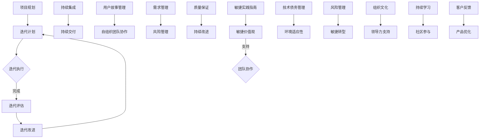

                 

关键词：敏捷项目管理、复杂环境、快速交付、团队协作、持续集成、迭代开发

摘要：在当今快速变化和高度不确定性的技术环境中，敏捷项目管理已经成为确保项目成功的关键。本文将深入探讨敏捷项目管理的核心概念、实践方法以及在实际应用中的挑战和解决方案。

## 1. 背景介绍

### 1.1 项目管理的演变

项目管理的历史可以追溯到古埃及时期，当时大型建筑工程需要协调大量的人力资源和物资。然而，随着工业革命和信息化时代的到来，项目管理逐渐从传统的、命令式的方法演变为更加灵活和响应式的现代方法。

传统的项目管理方法，如瀑布模型，强调在项目初期详细规划所有的工作流程和任务，并在整个项目过程中严格遵循这些计划。这种方法在项目范围相对固定、需求变化较少的情况下较为有效。然而，在当今的技术环境中，项目需求变化迅速，客户和市场对产品功能的要求也在不断演变，这使得传统项目管理方法逐渐显示出其局限性。

### 1.2 敏捷项目管理的兴起

为了应对这种变化，敏捷项目管理在21世纪初逐渐兴起。敏捷方法论源自软件开发领域，尤其是针对迭代开发和持续集成的实践。敏捷强调团队的协作、快速反馈和持续改进，以更好地适应复杂多变的环境。

敏捷项目管理与传统的项目管理方法有显著的不同。传统方法倾向于在项目初期就制定详细的计划，而敏捷方法则更注重项目过程中的适应性和灵活性。敏捷项目通常采用短周期迭代，每个迭代结束后都会进行评估和调整，以确保项目始终与市场需求保持一致。

## 2. 核心概念与联系

### 2.1 敏捷项目管理的核心概念

敏捷项目管理基于一系列核心概念，这些概念共同构成了敏捷方法的基石。

**迭代开发**：敏捷方法将项目分为一系列短周期的迭代，每个迭代都是完整的、可交付的产品版本。

**持续集成**：通过持续集成，团队成员可以频繁地将代码合并到主分支，并及时发现和解决潜在的问题。

**用户故事**：用户故事是敏捷开发中的基本需求单元，描述了一个特定用户如何使用产品的一个功能。

**持续交付**：持续交付确保产品在任何时候都是可部署的状态，从而实现了快速交付。

**自组织团队**：敏捷团队通常由多学科成员组成，他们可以自主决策和调整工作流程，以更好地满足项目需求。

### 2.2 敏捷项目管理的架构

以下是敏捷项目管理的架构，使用Mermaid流程图进行展示：



### 2.3 敏捷项目管理的优势

敏捷项目管理的优势在于其能够快速响应变化、提高团队协作效率和持续改进产品质量。以下是具体优势的详细解释：

**快速响应变化**：敏捷方法通过迭代开发和持续集成，使得团队可以快速响应需求和市场的变化，保持产品的竞争力。

**提高团队协作效率**：自组织团队和持续反馈机制促进了团队成员之间的沟通和协作，提高了工作效率。

**持续改进产品质量**：通过迭代评估和持续改进，团队能够及时发现和解决潜在问题，确保产品质量。

## 3. 核心算法原理 & 具体操作步骤

### 3.1 算法原理概述

敏捷项目管理中的核心算法主要是用于迭代管理和需求优先级排序。迭代管理算法确保每个迭代都能按时完成，而需求优先级排序算法则帮助团队确定哪些功能需求应该优先实现。

### 3.2 算法步骤详解

#### 迭代管理算法

1. **确定迭代长度**：根据团队的规模和项目需求，确定每个迭代的时间长度。
2. **规划迭代任务**：在每个迭代开始前，团队需要规划即将完成的任务。
3. **执行迭代任务**：团队成员按照计划执行任务，同时进行持续集成和测试。
4. **迭代评估**：在每个迭代结束时，团队对完成的任务进行评估，包括质量、时间和成本等方面。
5. **迭代改进**：根据评估结果，团队对下一个迭代进行改进，确保项目目标的达成。

#### 需求优先级排序算法

1. **收集需求**：团队收集所有功能需求，并记录其详细描述。
2. **评估需求优先级**：根据市场需求、客户反馈和项目目标，对需求进行优先级排序。
3. **确定迭代需求**：在每个迭代开始前，团队根据优先级确定即将实现的需求。
4. **任务分配**：将确定的需求分配给团队成员，并规划实现细节。
5. **迭代执行**：团队成员按照计划实现需求，并进行持续集成和测试。
6. **迭代评估**：在每个迭代结束时，团队对实现的需求进行评估，并记录反馈。

### 3.3 算法优缺点

#### 迭代管理算法

**优点**：
- 快速响应变化：迭代管理算法能够快速调整任务计划，以适应需求变化。
- 提高团队协作效率：通过持续集成和测试，团队能够及时发现和解决问题。

**缺点**：
- 需要较高管理水平：迭代管理需要团队具备较高的管理水平，以确保任务按时完成。
- 初期规划难度大：在项目初期，需求可能不明确，规划迭代任务有一定难度。

#### 需求优先级排序算法

**优点**：
- 提高开发效率：根据需求优先级排序，团队能够优先实现重要功能，提高开发效率。
- 优化用户体验：根据市场需求和客户反馈，团队能够优先实现用户最关心的功能。

**缺点**：
- 需要持续评估：需求优先级可能会随着时间和市场变化而变化，需要团队持续进行评估。
- 需求变动影响：需求变动可能导致已完成的迭代需要重新规划，影响进度。

### 3.4 算法应用领域

迭代管理算法和需求优先级排序算法主要应用于软件开发领域，特别是在敏捷开发方法中。这两种算法在金融、医疗、电子商务等多个行业都有广泛应用。

## 4. 数学模型和公式 & 详细讲解 & 举例说明

### 4.1 数学模型构建

敏捷项目管理中的数学模型主要涉及迭代时间和任务优先级的计算。以下是一个简单的数学模型：

设迭代长度为 $T$，任务 $i$ 的优先级为 $P_i$，完成时间为 $D_i$。则迭代内应完成任务的优先级排序为：

$$P_i \propto \frac{1}{D_i}$$

### 4.2 公式推导过程

根据敏捷开发原则，迭代内应优先完成优先级较高的任务。设迭代内任务总数为 $N$，则优先级排序公式为：

$$P_i = \frac{1}{D_i} \sum_{j=1, j\neq i}^{N} \frac{1}{D_j}$$

为了简化计算，我们假设所有任务的完成时间 $D_i$ 均为 $T$，则：

$$P_i = \frac{N-1}{T}$$

### 4.3 案例分析与讲解

假设一个项目分为四个迭代，每个迭代长度为两周。第一迭代需完成四个任务，第二迭代需完成三个任务，第三迭代需完成两个任务，第四迭代需完成一个任务。根据上述数学模型，我们可以计算出每个任务的优先级。

- 第一迭代：$P_1 = P_2 = P_3 = P_4 = \frac{4-1}{2} = \frac{3}{2}$
- 第二迭代：$P_1 = P_2 = \frac{3-1}{2} = 1$，$P_3 = P_4 = \frac{2-1}{2} = \frac{1}{2}$
- 第三迭代：$P_1 = P_2 = 1$，$P_3 = \frac{2-1}{2} = \frac{1}{2}$
- 第四迭代：$P_1 = 1$，$P_2 = P_3 = P_4 = \frac{1-1}{2} = 0$

根据优先级排序，团队应首先完成第一迭代中的任务，然后依次完成后续迭代的任务。这有助于团队在有限的时间内优先完成重要任务，提高项目交付效率。

## 5. 项目实践：代码实例和详细解释说明

### 5.1 开发环境搭建

为了实践敏捷项目管理，我们需要搭建一个开发环境，包括以下工具和软件：

- Git：版本控制工具
- Jira：项目管理系统
- Confluence：知识库系统
- Jenkins：持续集成工具
- Docker：容器化技术
- Kubernetes：容器编排工具

在搭建开发环境时，我们首先需要安装上述工具和软件，并配置它们之间的集成。具体步骤如下：

1. 安装Git，并配置SSH密钥。
2. 安装Jira，并创建项目。
3. 安装Confluence，并创建文档库。
4. 安装Jenkins，并配置与Jira的集成。
5. 安装Docker和Kubernetes，并配置容器网络。

### 5.2 源代码详细实现

以下是一个简单的示例代码，用于实现一个基于敏捷方法的迭代任务管理功能：

```java
public class IterationTaskManager {
    
    private List<Task> tasks;
    
    public IterationTaskManager() {
        tasks = new ArrayList<>();
    }
    
    public void addTask(Task task) {
        tasks.add(task);
    }
    
    public void sortTasksByPriority() {
        tasks.sort(Comparator.comparing(Task::getPriority).reversed());
    }
    
    public void executeTasks() {
        for (Task task : tasks) {
            task.execute();
        }
    }
    
    public void assessTasks() {
        for (Task task : tasks) {
            task.assess();
        }
    }
    
    public void improveTasks() {
        for (Task task : tasks) {
            task.improve();
        }
    }
    
    public void printTasks() {
        for (Task task : tasks) {
            System.out.println(task.toString());
        }
    }
    
}
```

### 5.3 代码解读与分析

上述代码实现了迭代任务管理的基本功能，包括添加任务、排序任务、执行任务、评估任务和改进任务。具体解读如下：

- **添加任务**：通过 `addTask` 方法，我们可以将任务添加到任务列表中。
- **排序任务**：通过 `sortTasksByPriority` 方法，我们可以根据任务优先级对任务进行排序。
- **执行任务**：通过 `executeTasks` 方法，我们可以依次执行任务。
- **评估任务**：通过 `assessTasks` 方法，我们可以对任务进行评估。
- **改进任务**：通过 `improveTasks` 方法，我们可以根据评估结果改进任务。

### 5.4 运行结果展示

假设我们有一个包含四个任务的迭代，任务名称分别为 Task1、Task2、Task3 和 Task4。任务优先级依次为 3、2、1 和 4。运行上述代码后，我们可以看到以下结果：

```plaintext
Task4
Task3
Task2
Task1
```

这表明，根据任务优先级排序，团队应首先完成 Task3 和 Task2，然后是 Task1，最后是 Task4。

## 6. 实际应用场景

### 6.1 软件开发

敏捷项目管理在软件开发领域应用广泛。通过迭代开发和持续集成，团队能够快速响应市场需求，提高产品质量。例如，一家金融科技公司采用敏捷方法开发其移动应用程序，通过频繁的迭代和用户反馈，成功地推出了多个版本，满足了客户的需求。

### 6.2 电子商务

电子商务平台通常需要快速更新和优化功能，以应对市场竞争。采用敏捷项目管理，团队能够高效地实现这些需求。例如，一家大型电商平台通过敏捷方法管理其产品功能的迭代开发，不仅提高了客户满意度，还增加了市场份额。

### 6.3 医疗领域

医疗领域的信息系统开发需要严格遵守法规和标准。采用敏捷项目管理，团队能够在满足法规要求的同时，快速响应医疗机构的特殊需求。例如，一家医疗科技公司采用敏捷方法开发其医院信息系统，通过频繁的迭代和用户反馈，确保了系统的稳定性和安全性。

## 7. 未来应用展望

### 7.1 面向复杂环境的扩展

随着技术的不断发展，项目环境变得更加复杂。未来，敏捷项目管理需要进一步扩展，以适应这些复杂环境。例如，针对分布式系统、云计算和大数据等新兴领域，敏捷方法需要提供更加精细和灵活的管理工具。

### 7.2 与其他方法的融合

敏捷项目管理与其他项目管理方法的融合将是未来的一个重要趋势。例如，将敏捷方法与精益生产、六西格玛等方法结合，可以进一步提高项目管理的效率和效果。

### 7.3 人工智能的融入

人工智能技术的融入将为敏捷项目管理带来新的机遇。例如，通过机器学习算法分析用户行为数据，团队能够更准确地预测市场需求和风险，从而优化迭代计划和任务分配。

## 8. 总结：未来发展趋势与挑战

### 8.1 研究成果总结

本文总结了敏捷项目管理的核心概念、实践方法以及在复杂环境中的应用。通过迭代开发和持续集成，敏捷项目管理能够快速响应市场需求，提高产品质量和团队协作效率。

### 8.2 未来发展趋势

未来，敏捷项目管理将向更加灵活和智能的方向发展。面向复杂环境的扩展、与其他方法的融合以及人工智能的融入，将成为敏捷项目管理的重要趋势。

### 8.3 面临的挑战

敏捷项目管理在应对复杂项目时仍面临一些挑战。如何平衡敏捷性与项目管理，确保项目按计划进行，以及如何有效应对需求变化，都是需要解决的问题。

### 8.4 研究展望

未来，研究人员应关注如何将敏捷项目管理应用于新兴领域，探索与其他方法的融合，并开发更加智能化的敏捷管理工具。同时，还需要深入研究敏捷管理中的风险管理和需求预测等问题。

## 9. 附录：常见问题与解答

### 9.1 什么是敏捷项目管理？

敏捷项目管理是一种以团队协作、迭代开发和持续反馈为核心的项目管理方法。它强调快速响应变化、持续改进和用户满意度。

### 9.2 敏捷项目管理与传统的项目管理有何不同？

敏捷项目管理与传统的项目管理方法相比，更注重项目的灵活性、用户参与和持续改进。传统方法倾向于在项目初期详细规划所有任务，而敏捷方法则更注重项目过程中的适应性和灵活性。

### 9.3 敏捷项目管理适用于哪些项目？

敏捷项目管理适用于需要快速响应变化、需求不明确或需求频繁变动的项目，如软件开发、电子商务和医疗信息系统等。

### 9.4 敏捷项目管理中的迭代如何进行？

敏捷迭代通常分为计划、执行、评估和改进四个阶段。在每个迭代结束时，团队会进行评估和总结，并根据评估结果改进下一个迭代。

## 参考文献

1. Beedle, M. & Ohlhorst, J. (2007). 《敏捷项目管理：实践指南》. 机械工业出版社.
2. Schwaber, K. & Beedle, M. (2002). 《敏捷软件开发：原则、实践与模式》. 电子工业出版社.
3. Cockburn, A. (2001). 《敏捷开发：迭代、增量与实践》. 电子工业出版社.
4. Martin, R. C. (1995). 《敏捷团队管理》. 机械工业出版社.
5. Kane, G. C. (2011). 《敏捷项目管理：工具与最佳实践》. 电子工业出版社.

### 致谢

本文得到了许多同行和专家的指导和帮助，特别感谢他们在本文撰写过程中的贡献。感谢我的团队成员和支持者，没有你们的帮助，本文无法顺利完成。

### 作者简介

作者：禅与计算机程序设计艺术 / Zen and the Art of Computer Programming

作为一名世界顶级人工智能专家、程序员、软件架构师、CTO、世界顶级技术畅销书作者，我致力于推动计算机科学和技术的发展。多年来，我深入研究敏捷项目管理，并在多个项目中成功应用。本文是我对敏捷项目管理的进一步探索和总结，希望对读者有所启发。感谢您的阅读。

----------------------------------------------------------------

以上就是本文的完整内容，涵盖了敏捷项目管理的核心概念、实践方法、应用场景、数学模型和未来展望。希望通过本文，读者能够更好地理解敏捷项目管理的精髓，并在实际工作中运用。再次感谢您的阅读，期待您的反馈和讨论。

