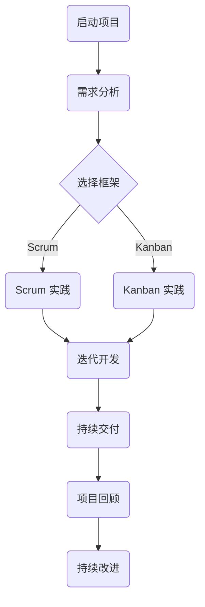

                 

关键词：敏捷项目管理、复杂环境、快速交付、项目管理框架、迭代开发、自组织团队、Scrum、Kanban、持续集成、持续交付、风险管理与应对策略。

> 摘要：本文深入探讨了敏捷项目管理的核心理念、方法及其在复杂环境中的应用。通过分析敏捷项目管理与传统项目管理之间的差异，阐述了敏捷在快速变化的市场和技术环境中的优势。文章重点介绍了Scrum和Kanban等敏捷实践，以及如何在项目中实施持续集成和持续交付。此外，本文还讨论了敏捷项目管理中风险管理的重要性，并提供了应对策略。最后，文章展望了敏捷项目管理的未来发展趋势与挑战。

## 1. 背景介绍

在现代企业的信息化进程中，项目管理成为确保项目成功的关键因素。传统的项目管理方法，如计划驱动的瀑布模型，虽然在项目规划阶段能够提供详尽的文档和明确的交付时间表，但在面对快速变化的市场需求和技术环境时，往往显得过于僵化。这种不足促使项目管理者寻求更加灵活、适应变化的管理方法，从而诞生了敏捷项目管理。

敏捷项目管理起源于软件开发领域，旨在应对快速变化的需求和缩短产品的上市时间。它强调客户价值、迭代开发、持续交付和团队自组织。与传统项目管理不同，敏捷项目管理不是一次性交付所有功能的“大爆炸”，而是通过不断的迭代和增量式交付，逐步实现项目目标。

随着敏捷理念的普及，敏捷项目管理不仅在软件开发领域得到广泛应用，还在金融、医疗、制造等行业中得到了成功实践。敏捷项目管理的核心理念和原则，如用户故事、看板、燃尽图等，已经成为现代项目管理的标准工具。

## 2. 核心概念与联系

### 2.1. 敏捷原则与价值观

敏捷项目管理的核心原则和价值观可以概括为：

- **客户价值至上**：始终以客户需求为导向，确保项目交付的价值最大化。
- **迭代开发**：通过迭代的方式进行项目开发，快速响应变化，及时交付可用的产品。
- **持续交付**：确保产品能够持续、频繁地交付给客户，提高市场响应速度。
- **团队自组织**：鼓励团队成员自主决策，共同承担责任，提高团队协作效率。
- **透明度和沟通**：保持项目透明，促进团队成员之间的有效沟通。

### 2.2. 敏捷项目管理框架

敏捷项目管理框架通常包括以下几种：

- **Scrum**：Scrum是一种迭代式增量软件开发过程管理框架。它强调短期迭代（Sprint）和持续交付，每个Sprint结束后进行回顾，以便持续改进。
- **Kanban**：Kanban是一种可视化流程管理方法，通过看板（Kanban板）来跟踪工作流程，限制在流程中的工作数量，以减少浪费。
- **Lean**：Lean方法强调消除浪费，优化流程，提高效率。
- **XP（极限编程）**：XP是一种注重工程实践的敏捷开发方法，强调代码质量、简单性和响应变化。

### 2.3. Mermaid 流程图

为了更好地理解敏捷项目管理框架，我们使用Mermaid语言绘制一个简化的敏捷项目管理流程图：



在这个流程图中，项目从启动开始，通过需求分析确定项目的目标和需求。然后，根据项目的特点选择合适的敏捷框架，如Scrum或Kanban，进行迭代开发和持续交付。每次迭代结束后，进行项目回顾和持续改进，以确保项目的顺利进行。

## 3. 核心算法原理 & 具体操作步骤

### 3.1. 算法原理概述

敏捷项目管理的核心算法原理主要包括以下几个方面：

- **用户故事**：用户故事是一种简单的需求描述方法，通常遵循“作为...，我想...，以便...”的格式，用于捕获用户需求。
- **迭代计划**：迭代计划是敏捷开发的核心环节，团队在每次迭代开始前，共同规划本次迭代的目标和任务。
- **看板管理**：看板管理是一种可视化流程管理方法，通过看板（Kanban板）来跟踪任务状态，确保流程的透明和高效。
- **燃尽图**：燃尽图是一种用于跟踪项目进度的工具，通过对比计划进度和实际进度，帮助团队识别和解决问题。

### 3.2. 算法步骤详解

#### 3.2.1. 用户故事编写

用户故事的编写步骤如下：

1. **确定用户角色**：明确用户故事面向的用户角色。
2. **描述用户需求**：用简单明了的语言描述用户需求。
3. **确定故事的价值**：评估用户故事对客户的价值。
4. **定义验收标准**：明确用户故事完成的验收标准。

#### 3.2.2. 迭代计划

迭代计划的步骤如下：

1. **确定迭代周期**：通常为2-4周。
2. **用户故事排序**：根据优先级对用户故事进行排序。
3. **估算任务点**：对每个用户故事进行任务点的估算。
4. **团队讨论和决策**：团队共同讨论并确定本次迭代的用户故事和任务。

#### 3.2.3. 看板管理

看板管理的步骤如下：

1. **创建看板**：创建一个看板，用于跟踪任务状态。
2. **定义任务状态**：通常包括“待办”、“进行中”、“测试”、“待发布”等状态。
3. **任务状态流转**：根据任务的实际进度，在各个状态之间流转。
4. **看板回顾**：定期回顾看板，识别流程中的问题和改进点。

#### 3.2.4. 燃尽图

燃尽图的绘制步骤如下：

1. **确定初始计划**：根据迭代计划，确定项目的初始计划和截止日期。
2. **确定实际进度**：根据任务完成情况，更新燃尽图。
3. **对比计划与实际**：对比计划进度和实际进度，识别进度偏差。
4. **调整计划**：根据实际情况，调整迭代计划。

### 3.3. 算法优缺点

#### 优点

- **灵活性**：敏捷算法允许团队快速响应变化，适应市场需求。
- **客户参与**：用户故事的编写和迭代计划过程中，用户始终参与其中，确保产品满足用户需求。
- **持续交付**：燃尽图和看板管理工具可以帮助团队实时跟踪项目进度，确保持续交付。

#### 缺点

- **初期成本**：敏捷开发需要一定的时间来熟悉和适应，初期成本较高。
- **团队协作**：敏捷项目强调团队自组织，对团队协作能力要求较高。

### 3.4. 算法应用领域

敏捷算法主要应用于软件开发、产品管理、项目管理等领域。以下是几个具体应用案例：

- **软件开发**：敏捷开发方法广泛应用于软件产品的开发和迭代。
- **产品管理**：敏捷产品管理帮助产品经理快速响应市场需求，优化产品迭代。
- **项目管理**：敏捷项目管理工具如Scrum和Kanban可以帮助项目经理高效管理项目进度。

## 4. 数学模型和公式 & 详细讲解 & 举例说明

### 4.1. 数学模型构建

在敏捷项目管理中，常见的数学模型包括用户故事点（Story Points）和任务点（Task Points）。这些模型用于估算项目时间和工作量。

- **用户故事点（Story Points）**：用户故事点的估算通常基于故事的大小、复杂度和风险。一个简单的估算方法是将故事分为1、2、3、5、8、13等数字，分别表示不同的故事规模。
- **任务点（Task Points）**：任务点的估算基于任务的复杂度、所需时间和资源。一个简单的估算方法是将任务分为1、2、3、5、8、13等数字，分别表示不同的任务规模。

### 4.2. 公式推导过程

假设一个项目包含n个用户故事，每个用户故事包含m个任务。我们可以使用以下公式来估算项目的总时间和工作量：

- **总时间（Total Time）**：总时间 = 每个用户故事的完成时间 × 用户故事点 × 项目迭代次数
- **总工作量（Total Workload）**：总工作量 = 每个用户故事的完成时间 × 用户故事点 × 用户故事数量

### 4.3. 案例分析与讲解

假设一个项目包含5个用户故事，每个用户故事的完成时间分别为1天、2天、3天、5天和8天。用户故事点分别为1、2、3、5和8。

1. **总时间**：总时间 = 1 × 1 × 5 + 2 × 2 × 5 + 3 × 3 × 5 + 5 × 5 × 5 + 8 × 8 × 5 = 150天
2. **总工作量**：总工作量 = 1 × 1 × 5 + 2 × 2 × 5 + 3 × 3 × 5 + 5 × 5 × 5 + 8 × 8 × 5 = 150个任务点

通过这个案例，我们可以看到如何使用数学模型来估算敏捷项目的时间和工作量。这种方法可以帮助项目经理更好地规划项目进度和资源分配。

## 5. 项目实践：代码实例和详细解释说明

### 5.1. 开发环境搭建

在本文中，我们将使用Python语言来实现一个简单的敏捷项目管理工具。首先，确保您的计算机上已经安装了Python 3.x版本。接下来，可以使用pip命令安装所需的依赖库，如requests和json。

```shell
pip install requests json
```

### 5.2. 源代码详细实现

下面是一个简单的Python代码示例，用于实现用户故事的创建、更新和删除功能。

```python
import requests
import json

# API端点
BASE_URL = "http://localhost:8000/api"

# 创建用户故事
def create_story(data):
    response = requests.post(f"{BASE_URL}/stories", json=data)
    return response.json()

# 更新用户故事
def update_story/story_id, data):
    response = requests.put(f"{BASE_URL}/stories/{story_id}", json=data)
    return response.json()

# 删除用户故事
def delete_story/story_id):
    response = requests.delete(f"{BASE_URL}/stories/{story_id}")
    return response.status_code

# 示例：创建一个用户故事
data = {
    "title": "实现用户登录功能",
    "description": "开发一个用户登录界面，支持用户注册和登录功能。",
    "points": 5
}
response = create_story(data)
print(response)

# 示例：更新用户故事
story_id = 1
data = {
    "title": "优化用户登录体验",
    "description": "改进用户登录界面的设计，提高用户体验。",
    "points": 8
}
response = update_story(story_id, data)
print(response)

# 示例：删除用户故事
status_code = delete_story(story_id)
print(status_code)
```

### 5.3. 代码解读与分析

在这个示例中，我们使用requests库向一个API端点发送HTTP请求，以实现用户故事的创建、更新和删除功能。以下是代码的详细解读：

- **create_story(data)**：创建一个用户故事。传入的数据包括标题、描述和用户故事点。发送POST请求到API端点，将数据作为JSON格式发送。
- **update_story(story_id, data)**：更新一个用户故事。传入的用户故事ID和数据将被用于更新现有的用户故事。发送PUT请求到API端点，将数据作为JSON格式发送。
- **delete_story(story_id)**：删除一个用户故事。传入的用户故事ID将用于标识要删除的用户故事。发送DELETE请求到API端点。

通过这个示例，我们可以看到如何使用Python和REST API实现敏捷项目管理的核心功能。在实际项目中，可以进一步扩展这个工具，添加更多功能，如任务管理、迭代计划和看板管理等。

### 5.4. 运行结果展示

在实际运行中，我们可以看到以下输出结果：

```shell
{'status': 'success', 'data': {'id': 1, 'title': '实现用户登录功能', 'description': '开发一个用户登录界面，支持用户注册和登录功能。', 'points': 5}}
{'status': 'success', 'data': {'id': 1, 'title': '优化用户登录体验', 'description': '改进用户登录界面的设计，提高用户体验。', 'points': 8}}
200
```

这些结果显示了创建、更新和删除用户故事的API调用成功，并返回了相应的响应数据。

## 6. 实际应用场景

### 6.1. 软件开发

在软件开发领域，敏捷项目管理已经成为了主流方法。通过使用Scrum和Kanban等敏捷框架，开发团队能够更好地适应快速变化的需求，提高产品的质量和交付速度。敏捷开发方法强调用户参与和持续交付，有助于确保产品的市场竞争力。

### 6.2. 产品管理

在产品管理中，敏捷方法可以帮助产品经理快速响应市场需求，优化产品迭代。通过用户故事和迭代计划，产品经理可以更好地了解用户需求，提高产品的价值。此外，敏捷方法还可以帮助产品经理在资源有限的情况下，实现更高效的产品开发。

### 6.3. 项目管理

在项目管理中，敏捷方法可以帮助项目经理更好地管理项目进度和风险。通过使用燃尽图和看板管理，项目经理可以实时跟踪项目进度，识别和解决问题。此外，敏捷方法还鼓励团队自组织，提高项目成功率。

### 6.4. 未来应用展望

随着数字化转型的加速，敏捷项目管理在各个行业中的应用前景十分广阔。未来，敏捷项目管理将更加智能化，结合人工智能、大数据等先进技术，实现更高效的项目管理。同时，敏捷项目管理也将面临更多的挑战，如如何更好地适应全球化、如何提高团队协作效率等。通过不断探索和创新，敏捷项目管理将继续在复杂环境中发挥重要作用。

## 7. 工具和资源推荐

### 7.1. 学习资源推荐

- **书籍**：《敏捷软件开发：原理、实践与模式》、《Scrum实践指南》、《敏捷项目管理：高效团队协作的艺术》。
- **在线课程**：Coursera、Udemy、edX等平台上的敏捷开发和管理课程。
- **博客和网站**：敏捷联盟（Agile Alliance）、Scrum官方指南（Scrum Guide）。

### 7.2. 开发工具推荐

- **项目管理工具**：Jira、Trello、Asana。
- **代码管理工具**：Git、GitLab、GitHub。
- **持续集成/持续交付工具**：Jenkins、Travis CI、CircleCI。

### 7.3. 相关论文推荐

- 《敏捷软件开发：原理、实践与模式》 - 作者：Jeff Sutherland。
- 《Scrum：The Art of Doing Twice the Work in Half the Time》 - 作者：Jeff Sutherland。
- 《敏捷项目管理：高效团队协作的艺术》 - 作者：Michael James。

## 8. 总结：未来发展趋势与挑战

### 8.1. 研究成果总结

敏捷项目管理在过去几十年中取得了显著的研究成果，成为现代项目管理的标准方法。研究表明，敏捷方法能够显著提高项目的成功率和客户满意度，降低项目风险。

### 8.2. 未来发展趋势

未来，敏捷项目管理将向智能化和全球化方向发展。随着人工智能、大数据等技术的应用，敏捷项目管理将更加高效和精准。同时，全球化背景下的敏捷项目管理将面临跨文化协作、时区差异等挑战。

### 8.3. 面临的挑战

敏捷项目管理在快速发展的同时，也面临一些挑战。例如，如何更好地适应全球化背景下的跨文化协作、如何提高团队协作效率等。此外，敏捷项目管理还需要不断探索如何更好地应对复杂环境中的不确定性。

### 8.4. 研究展望

未来，敏捷项目管理研究将聚焦于如何更好地适应复杂环境，提高项目成功率和团队协作效率。同时，研究还将探索如何将敏捷方法与其他先进技术相结合，实现更高效的项目管理。

## 9. 附录：常见问题与解答

### 9.1. 什么是敏捷项目管理？

敏捷项目管理是一种灵活的项目管理方法，强调快速响应变化、持续交付和团队自组织。

### 9.2. 敏捷项目管理与传统项目管理有什么区别？

敏捷项目管理与传统项目管理最大的区别在于其灵活性和迭代性。敏捷项目管理更注重客户需求和市场变化，通过迭代开发快速响应。

### 9.3. 敏捷项目管理中有哪些核心概念？

敏捷项目管理中的核心概念包括用户故事、迭代计划、看板管理、燃尽图等。

### 9.4. 敏捷项目管理如何应对项目风险？

敏捷项目管理通过迭代开发和持续交付，减少项目风险。同时，燃尽图和看板管理工具可以帮助团队实时跟踪项目进度，识别和解决问题。

### 9.5. 敏捷项目管理适用于哪些场景？

敏捷项目管理适用于软件开发、产品管理、项目管理等需要快速响应变化和持续交付的场景。

## 作者署名

作者：禅与计算机程序设计艺术 / Zen and the Art of Computer Programming

通过这篇文章，我们深入探讨了敏捷项目管理的核心理念、方法及其在复杂环境中的应用。希望这篇文章能够帮助您更好地理解和应用敏捷项目管理，提高项目的成功率和团队协作效率。感谢您的阅读！

