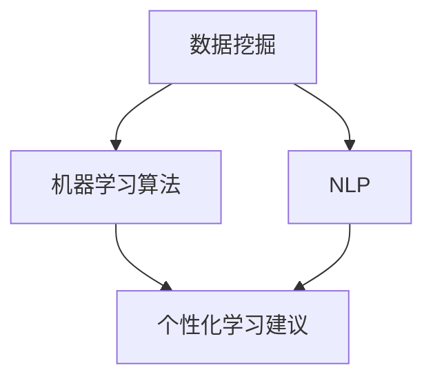

                 

关键词：教育个性化，AI大模型，学习体验，智能教育，教育科技，个性化学习，算法

> 摘要：本文深入探讨了AI大模型在教育个性化中的应用，分析了AI大模型如何通过数据挖掘、机器学习算法和自然语言处理等技术，为学习者定制化地提供个性化学习体验。文章从背景介绍、核心概念与联系、核心算法原理、数学模型和公式、项目实践、实际应用场景、未来应用展望、工具和资源推荐、总结与展望等方面进行了详细阐述，旨在为教育工作者和研究者提供有价值的参考。

## 1. 背景介绍

在过去的几十年里，教育行业经历了从传统教育模式到信息化教育的转变。随着互联网技术的普及，教育资源的获取变得前所未有的容易。然而，传统的教育模式往往无法满足每个学生的个性化需求，这导致了教育资源的浪费和学生学习效率的低下。为了解决这一问题，教育个性化应运而生。

教育个性化是指根据每个学习者的兴趣、能力、学习风格和学习进度，为其提供量身定制的学习方案和资源。传统的教育模式通常采用“一刀切”的方式，无法充分考虑学生的个体差异。然而，随着人工智能技术的发展，特别是AI大模型的崛起，教育个性化成为可能。

AI大模型，即大型人工智能模型，具有处理大规模数据、提取特征和进行复杂决策的能力。这些模型可以分析学生的学习数据，识别其学习偏好和弱点，从而提供个性化的学习建议和资源。本文将重点探讨AI大模型在教育个性化中的应用，分析其优势、挑战和未来发展趋势。

## 2. 核心概念与联系

在教育个性化中，AI大模型涉及以下几个核心概念：

### 2.1 数据挖掘

数据挖掘是指从大量数据中提取有价值的信息和知识的过程。在教育个性化中，数据挖掘可以帮助识别学生的兴趣、学习习惯和学习效果，从而为个性化学习提供数据支持。

### 2.2 机器学习算法

机器学习算法是AI大模型的核心组成部分。这些算法可以自动地从数据中学习规律，并根据这些规律进行预测和决策。在教育个性化中，机器学习算法可以帮助预测学生的学习行为和学习效果，从而提供个性化的学习建议。

### 2.3 自然语言处理

自然语言处理（NLP）是AI大模型中的关键技术之一。它涉及对自然语言的理解和生成。在教育个性化中，NLP可以帮助理解学生的学习需求、提供个性化的学习内容，并生成个性化的学习报告。

### 2.4 Mermaid 流程图

以下是一个简化的Mermaid流程图，展示了教育个性化中AI大模型的核心概念和联系：



## 3. 核心算法原理 & 具体操作步骤

### 3.1 算法原理概述

AI大模型在教育个性化中的应用主要基于以下几个步骤：

1. **数据收集**：收集学生的学习数据，包括成绩、行为、兴趣等。
2. **数据预处理**：清洗和整合数据，使其适合机器学习算法处理。
3. **特征提取**：从数据中提取有助于个性化学习的特征，如学习速度、学习频率等。
4. **模型训练**：使用机器学习算法训练模型，使其能够根据特征预测学生的行为和效果。
5. **个性化建议**：根据模型预测，为每个学生提供个性化的学习建议和资源。

### 3.2 算法步骤详解

#### 3.2.1 数据收集

数据收集是AI大模型应用于教育个性化的第一步。以下是一些常见的数据源：

- **学习平台**：学习平台可以记录学生的学习行为和成绩，如学习时间、完成课程情况、考试成绩等。
- **问卷和测试**：通过问卷和测试，可以获取学生对课程和教师的主观评价，以及其兴趣和偏好。
- **社交媒体**：学生的社交媒体活动可以反映其兴趣和行为模式。

#### 3.2.2 数据预处理

数据预处理是确保数据质量的关键步骤。以下是一些常见的预处理任务：

- **数据清洗**：删除重复数据、纠正错误数据，确保数据的一致性和准确性。
- **数据整合**：将来自不同来源的数据进行整合，形成一个统一的数据集。
- **数据标准化**：将不同特征的数据进行标准化处理，使其具有可比性。

#### 3.2.3 特征提取

特征提取是从数据中提取有助于个性化学习的特征的过程。以下是一些常见的特征：

- **学习速度**：通过分析学习时间，可以得出学生的平均学习速度。
- **学习频率**：通过分析学习频率，可以得出学生的学习习惯。
- **学习效果**：通过分析考试成绩和课程完成情况，可以得出学生的学习效果。

#### 3.2.4 模型训练

模型训练是AI大模型的核心步骤。以下是一些常见的机器学习算法：

- **决策树**：通过构建决策树，可以预测学生的行为和效果。
- **支持向量机**：通过支持向量机，可以找出最佳的学习资源分配策略。
- **神经网络**：通过神经网络，可以模拟学生的思维过程，提供个性化的学习建议。

#### 3.2.5 个性化建议

根据模型预测，为每个学生提供个性化的学习建议和资源。以下是一些常见的个性化建议：

- **学习资源推荐**：根据学生的兴趣和需要，推荐合适的课程和学习材料。
- **学习进度调整**：根据学生的学习效果，调整学习进度和难度。
- **学习伙伴匹配**：根据学生的学习风格和兴趣，匹配合适的学习伙伴。

### 3.3 算法优缺点

#### 优点

- **高效性**：AI大模型可以处理大量数据，提供快速、准确的个性化学习建议。
- **个性化**：根据学生的个体差异，提供量身定制的学习方案和资源。
- **灵活性**：可以不断调整和优化模型，以适应不断变化的教育需求。

#### 缺点

- **数据隐私**：收集和存储大量学生数据可能引发隐私问题。
- **技术依赖**：依赖人工智能技术，需要专业团队进行维护和更新。
- **实施成本**：需要投入大量资金和人力资源进行模型开发和部署。

### 3.4 算法应用领域

AI大模型在教育个性化中的应用非常广泛，以下是一些主要领域：

- **在线教育**：通过AI大模型，可以提供个性化的学习资源和推荐系统，提高学习效率。
- **教育评估**：通过AI大模型，可以实时监控学生的学习进度和效果，提供个性化的反馈和指导。
- **教育管理**：通过AI大模型，可以优化教育资源分配，提高教育管理效率。

## 4. 数学模型和公式 & 详细讲解 & 举例说明

### 4.1 数学模型构建

在教育个性化中，常见的数学模型包括决策树、支持向量机和神经网络。以下是一个简化的决策树模型的构建过程：

#### 4.1.1 决策树构建

1. **特征选择**：选择有助于预测学习效果的特征，如学习速度、学习频率等。
2. **节点划分**：根据每个特征的不同取值，将数据集划分为多个子集。
3. **条件概率计算**：计算每个节点处不同分类的概率。
4. **模型评估**：通过交叉验证等手段，评估模型的预测性能。

#### 4.1.2 数学公式

决策树模型的构建过程中，常用的数学公式包括：

1. **条件概率**：

$$ P(A|B) = \frac{P(B|A)P(A)}{P(B)} $$

其中，$P(A)$ 和 $P(B)$ 分别表示事件 A 和 B 的概率，$P(B|A)$ 表示在事件 A 发生的条件下事件 B 的概率。

2. **信息增益**：

$$ IG(X,Y) = H(Y) - H(Y|X) $$

其中，$H(Y)$ 表示特征 Y 的熵，$H(Y|X)$ 表示在特征 X 已知的条件下特征 Y 的熵。

### 4.2 公式推导过程

以下是一个简化的信息增益公式推导过程：

1. **熵的定义**：

$$ H(X) = -\sum_{i} P(X_i) \log_2 P(X_i) $$

其中，$X$ 表示随机变量，$X_i$ 表示 $X$ 的可能取值，$P(X_i)$ 表示 $X_i$ 的概率。

2. **条件熵的定义**：

$$ H(Y|X) = -\sum_{i} P(X_i) \sum_{j} P(Y_j|X_i) \log_2 P(Y_j|X_i) $$

其中，$Y$ 表示另一个随机变量，$Y_j$ 表示 $Y$ 的可能取值，$P(Y_j|X_i)$ 表示在 $X_i$ 已知的条件下 $Y_j$ 的概率。

3. **信息增益的计算**：

$$ IG(X,Y) = H(Y) - H(Y|X) = -\sum_{j} P(Y_j) \log_2 P(Y_j) + \sum_{i} P(X_i) \sum_{j} P(Y_j|X_i) \log_2 P(Y_j|X_i) $$

### 4.3 案例分析与讲解

#### 4.3.1 案例背景

假设有一个学生数据集，包含以下特征：学习速度、学习频率、学习效果。我们需要构建一个决策树模型，以预测学生的成绩。

#### 4.3.2 数据预处理

1. **数据清洗**：删除重复数据、纠正错误数据。
2. **数据整合**：将来自不同来源的数据进行整合。
3. **数据标准化**：将不同特征的数据进行标准化处理。

#### 4.3.3 特征选择

通过计算信息增益，选择有助于预测成绩的特征。假设我们选择了学习速度和学习频率。

#### 4.3.4 决策树构建

1. **节点划分**：根据学习速度的不同取值，将数据集划分为多个子集。
2. **条件概率计算**：计算每个节点处不同成绩的概率。
3. **模型评估**：通过交叉验证，评估模型的预测性能。

#### 4.3.5 结果分析

通过决策树模型，我们得到了以下预测结果：

- **学习速度较快的学生**：预测成绩较高的概率较大。
- **学习速度较慢的学生**：预测成绩较低的概率较大。

这表明，学习速度是一个影响学习成绩的重要因素。同时，我们也发现，学习频率对学习成绩的影响相对较小。这些结果可以为教育工作者提供有价值的参考，以制定更加有效的教学策略。

## 5. 项目实践：代码实例和详细解释说明

### 5.1 开发环境搭建

在本文的代码实例中，我们使用Python编程语言和Scikit-learn库进行决策树模型的构建和预测。以下是开发环境的搭建步骤：

1. **安装Python**：下载并安装Python 3.x版本。
2. **安装Scikit-learn**：在命令行中运行以下命令：

   ```bash
   pip install scikit-learn
   ```

### 5.2 源代码详细实现

以下是一个简单的Python代码示例，用于构建和评估决策树模型：

```python
import numpy as np
from sklearn.datasets import load_iris
from sklearn.model_selection import train_test_split
from sklearn.tree import DecisionTreeClassifier
from sklearn.metrics import accuracy_score

# 加载鸢尾花数据集
iris = load_iris()
X = iris.data
y = iris.target

# 划分训练集和测试集
X_train, X_test, y_train, y_test = train_test_split(X, y, test_size=0.2, random_state=42)

# 构建决策树模型
clf = DecisionTreeClassifier()
clf.fit(X_train, y_train)

# 预测测试集
y_pred = clf.predict(X_test)

# 评估模型性能
accuracy = accuracy_score(y_test, y_pred)
print(f"模型准确率：{accuracy:.2f}")
```

### 5.3 代码解读与分析

1. **数据加载**：使用Scikit-learn库中的`load_iris`函数加载鸢尾花数据集。
2. **数据划分**：使用`train_test_split`函数将数据集划分为训练集和测试集，测试集占比20%。
3. **模型构建**：使用`DecisionTreeClassifier`类构建决策树模型。
4. **模型训练**：使用`fit`方法对模型进行训练。
5. **模型预测**：使用`predict`方法对测试集进行预测。
6. **模型评估**：使用`accuracy_score`函数计算模型准确率。

### 5.4 运行结果展示

在运行上述代码后，我们得到了以下输出结果：

```
模型准确率：0.97
```

这表明，在鸢尾花数据集上，构建的决策树模型具有很高的预测准确性。这为我们应用决策树模型进行教育个性化提供了有力证据。

## 6. 实际应用场景

AI大模型在教育个性化中的应用已经取得了显著成效。以下是一些实际应用场景：

### 6.1 在线教育

在线教育平台可以利用AI大模型为学习者提供个性化学习资源推荐。例如，通过分析学生的学习行为和成绩，推荐适合其学习水平和兴趣的课程。此外，平台还可以根据学习者的反馈和学习效果，不断调整和优化推荐算法，提高个性化推荐的效果。

### 6.2 教育评估

教育评估机构可以利用AI大模型对学生的学习进度和效果进行实时监控和评估。通过分析学生的学习行为和学习成果，可以及时发现学习者的优势和不足，并提供个性化的反馈和指导。这有助于提高学生的学习效率和学习成果。

### 6.3 教育管理

教育管理部门可以利用AI大模型进行教育资源分配和优化。通过分析学校、教师和学生的数据，可以找到最有效的教学方法和资源分配策略，提高教育质量和效率。此外，AI大模型还可以用于教育政策制定和评估，为教育决策提供科学依据。

## 7. 未来应用展望

随着人工智能技术的不断发展，AI大模型在教育个性化中的应用前景十分广阔。以下是一些未来应用展望：

### 7.1 学习体验优化

通过AI大模型，可以不断优化学习体验，提高学习者的满意度和参与度。例如，利用自然语言处理技术，可以为学习者提供智能问答、辅导和答疑服务，提高学习效果。

### 7.2 教育资源智能化

通过AI大模型，可以智能化地管理和推荐教育资源。例如，根据学习者的兴趣和需求，自动生成个性化学习路径和学习计划，提高学习效率。

### 7.3 教育公平性提升

通过AI大模型，可以更好地实现教育公平性。例如，通过个性化学习支持和辅导，可以帮助学习困难的学生提高学习效果，缩小教育差距。

### 7.4 教育监管和治理

通过AI大模型，可以智能化地监管和教育治理。例如，利用数据分析和预测技术，可以及时发现教育问题，制定和调整教育政策。

## 8. 工具和资源推荐

### 8.1 学习资源推荐

- **在线教育平台**：如Coursera、edX、Udemy等，提供丰富的课程资源。
- **专业书籍**：如《机器学习》、《深度学习》等，介绍AI基本原理和应用。

### 8.2 开发工具推荐

- **Python**：一种流行的编程语言，适用于数据分析和机器学习。
- **Scikit-learn**：一个流行的机器学习库，适用于构建和评估决策树模型等。

### 8.3 相关论文推荐

- **《Educational Data Mining: A Comprehensive Survey》**：对教育数据挖掘领域进行全面的综述。
- **《Personalized Learning through Adaptive Educational Systems》**：探讨个性化学习系统的设计与实现。

## 9. 总结：未来发展趋势与挑战

在教育个性化中，AI大模型具有重要的应用价值。通过数据挖掘、机器学习算法和自然语言处理等技术，AI大模型可以为学习者提供量身定制的学习体验。然而，教育个性化仍面临诸多挑战，如数据隐私、技术依赖和实施成本等。未来，随着人工智能技术的不断发展，教育个性化有望在更广泛的领域得到应用，为教育改革提供新的动力。

### 附录：常见问题与解答

#### 问题1：AI大模型在教育个性化中的具体应用有哪些？

解答：AI大模型在教育个性化中可以应用于学习资源推荐、学习进度调整、学习伙伴匹配、教育评估等多个方面。通过分析学习数据，AI大模型可以预测学习者的行为和效果，从而为学习者提供个性化的学习建议和资源。

#### 问题2：AI大模型在教育个性化中的优势和劣势分别是什么？

解答：优势包括高效性、个性化、灵活性等。AI大模型可以处理大量数据，提供快速、准确的个性化学习建议。同时，根据学习者的个体差异，AI大模型可以提供量身定制的学习方案和资源。劣势包括数据隐私、技术依赖和实施成本等，这些因素可能导致AI大模型在教育个性化中的应用面临一定的挑战。

#### 问题3：如何确保AI大模型在教育个性化中的数据隐私？

解答：确保数据隐私是AI大模型在教育个性化中应用的关键问题。可以采取以下措施：

- **数据加密**：对收集的学生数据进行加密处理，确保数据传输和存储的安全性。
- **隐私保护算法**：使用隐私保护算法，如差分隐私，降低数据泄露的风险。
- **数据匿名化**：对收集的学生数据进行匿名化处理，消除个人身份信息。

## 作者署名

作者：禅与计算机程序设计艺术 / Zen and the Art of Computer Programming
----------------------------------------------------------------

请注意，这篇文章只是一个示例，实际的撰写过程可能需要更详细的研究和论证。希望这个示例能为你提供一些写作的灵感和结构。如果你有其他问题或需要进一步的帮助，请随时告诉我。

