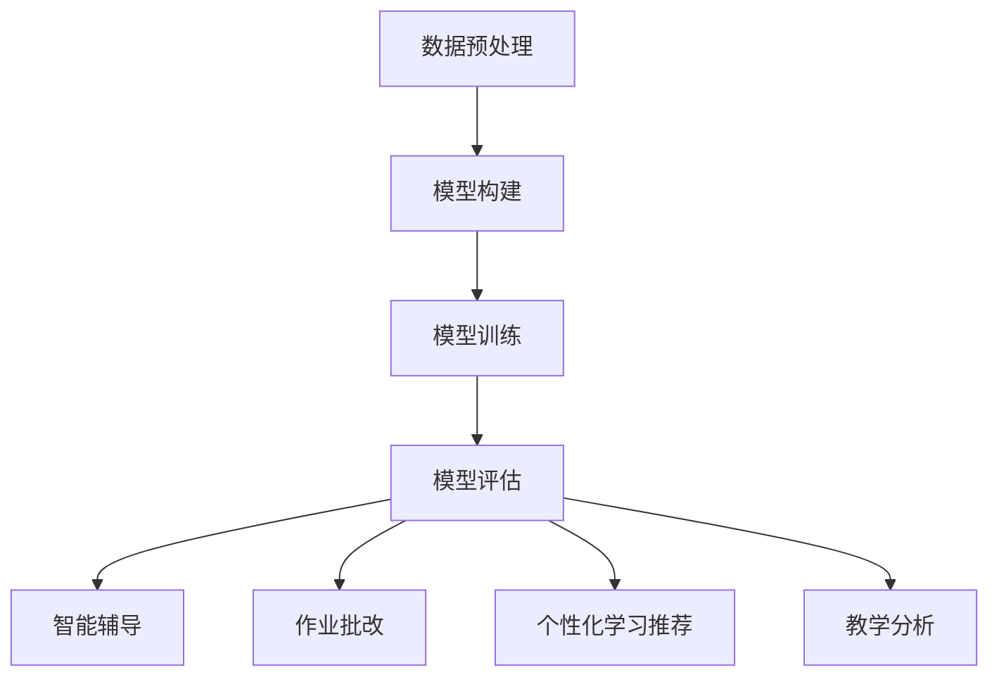

                 

关键词：教育模拟、LLM、学习环境、增强学习、人工智能教育

> 摘要：本文探讨了利用大型语言模型（LLM）构建增强型学习环境的方法和优势，介绍了教育模拟的概念、LLM的工作原理及其在教育领域中的应用。通过分析核心算法原理和数学模型，结合实际项目实践，展示了LLM增强的学习环境在提升教育质量和效果方面的潜力。

## 1. 背景介绍

在教育领域，模拟一直是提高教学质量、优化学习体验的重要手段。传统的教育模拟方法主要依赖于预定义的规则和模型，这些模型在处理复杂的教育问题时往往显得力不从心。随着人工智能技术的发展，尤其是大型语言模型（LLM）的出现，为教育模拟提供了新的可能性。

大型语言模型（LLM）是一种基于深度学习技术的自然语言处理模型，其核心思想是通过对海量文本数据的学习，模型能够理解并生成自然语言。LLM的应用范围广泛，从智能客服、机器翻译到文本生成，都取得了显著的成果。在教育领域，LLM可以被用来构建智能辅导系统、个性化学习推荐、自动化作业批改等。

本文旨在探讨如何利用LLM构建增强型学习环境，以提高教育的质量和效果。本文结构如下：

1. 背景介绍：概述教育模拟和LLM的基本概念。
2. 核心概念与联系：介绍LLM的工作原理及其在教育中的应用。
3. 核心算法原理 & 具体操作步骤：分析LLM在教育模拟中的应用。
4. 数学模型和公式 & 详细讲解 & 举例说明：讲解LLM的教育模拟中的数学模型。
5. 项目实践：代码实例和详细解释说明。
6. 实际应用场景：讨论LLM增强的学习环境在现实中的应用。
7. 工具和资源推荐：推荐相关学习资源和开发工具。
8. 总结：总结研究成果，展望未来发展趋势。

## 2. 核心概念与联系

### 2.1 教育模拟的概念

教育模拟是一种通过模拟教育环境来帮助学习者掌握知识、技能和态度的方法。传统的教育模拟主要通过虚拟实验室、游戏化学习等手段实现，这些方法在一定程度上提高了学习者的参与度和兴趣，但在处理复杂的教育问题时仍存在一定的局限性。

LLM的出现为教育模拟带来了新的可能性。通过利用LLM强大的语言理解能力和生成能力，教育模拟可以更加智能化、个性化，从而更好地适应不同学习者的需求。

### 2.2 LLM的工作原理

LLM是基于深度学习技术构建的，其核心思想是通过神经网络模型对海量文本数据进行训练，使模型能够理解并生成自然语言。LLM的训练过程主要包括以下几个步骤：

1. 数据预处理：对文本数据进行清洗、分词、词向量化等处理，以便模型能够更好地理解文本。
2. 模型构建：构建多层神经网络模型，通常包括编码器和解码器。
3. 模型训练：通过大量文本数据进行训练，使模型能够学习到文本的特征和规律。
4. 模型评估：使用测试数据集对模型进行评估，调整模型参数以优化性能。

### 2.3 LLM在教育中的应用

LLM在教育中的应用主要包括以下几个方面：

1. 智能辅导：利用LLM的自然语言理解能力，为学习者提供个性化、智能化的辅导服务。
2. 作业批改：利用LLM对文本的生成和修改能力，自动化完成作业批改工作。
3. 个性化学习推荐：根据学习者的学习习惯、兴趣和能力，利用LLM提供个性化的学习资源和推荐。
4. 教学分析：利用LLM对教学数据进行挖掘和分析，为教师提供教学改进建议。

### 2.4 Mermaid 流程图

下面是一个简单的Mermaid流程图，展示了LLM在教育模拟中的工作流程：



## 3. 核心算法原理 & 具体操作步骤

### 3.1 算法原理概述

LLM在教育模拟中的核心算法原理主要包括自然语言处理（NLP）和深度学习技术。NLP是使计算机能够理解、生成和处理自然语言的技术，而深度学习则是通过多层神经网络模型从数据中自动学习特征和模式。

在LLM中，NLP技术主要用于对文本数据进行分析和理解，如文本分类、情感分析、命名实体识别等。深度学习技术则用于构建神经网络模型，通过大量数据训练，使模型能够自动提取文本的特征和规律。

### 3.2 算法步骤详解

1. 数据采集与预处理：收集与教育相关的文本数据，如教科书、学习笔记、教学视频等。对文本数据进行清洗、分词、词向量化等预处理操作，以便模型能够更好地理解文本。

2. 模型构建：构建多层神经网络模型，包括编码器和解码器。编码器负责将输入的文本数据转换为固定长度的向量表示，解码器则根据这些向量表示生成对应的文本输出。

3. 模型训练：使用预处理的文本数据对模型进行训练。训练过程中，模型通过不断调整参数，使输入和输出之间的误差最小化。

4. 模型评估：使用测试数据集对模型进行评估，调整模型参数以优化性能。评估指标主要包括准确率、召回率、F1分数等。

5. 模型应用：将训练好的模型应用于教育模拟，如智能辅导、作业批改、个性化学习推荐等。

### 3.3 算法优缺点

**优点：**

1. 强大的语言理解能力：LLM能够理解和生成自然语言，使教育模拟更加智能化和人性化。
2. 个性化：LLM可以根据学习者的学习习惯、兴趣和能力，提供个性化的辅导和推荐。
3. 节省人力成本：自动化作业批改和教学分析等功能可以减少教师的工作量。

**缺点：**

1. 数据依赖性：LLM的性能很大程度上取决于训练数据的质量和数量。
2. 难以理解：深度学习模型的内部结构和工作原理较为复杂，难以解释和理解。

### 3.4 算法应用领域

LLM在教育模拟中的应用领域广泛，包括但不限于：

1. 智能辅导：为学习者提供个性化、智能化的辅导服务，如自动解答疑问、推荐学习资源等。
2. 作业批改：自动化完成作业批改工作，提高教学效率。
3. 个性化学习推荐：根据学习者的学习习惯、兴趣和能力，推荐适合的学习资源和任务。
4. 教学分析：挖掘和分析教学数据，为教师提供教学改进建议。

## 4. 数学模型和公式 & 详细讲解 & 举例说明

### 4.1 数学模型构建

在教育模拟中，LLM的核心数学模型主要包括神经网络模型和自然语言处理模型。以下是一个简化的神经网络模型结构：

```latex
\begin{equation}
    h_{\text{hidden}} = \sigma(W_2 \cdot \sigma(W_1 \cdot x + b_1))
\end{equation}
```

其中，\( h_{\text{hidden}} \) 表示隐藏层输出，\( \sigma \) 表示激活函数，\( W_1 \) 和 \( W_2 \) 分别为输入层到隐藏层和隐藏层到输出层的权重矩阵，\( b_1 \) 为输入层偏置，\( x \) 为输入文本数据。

### 4.2 公式推导过程

神经网络模型的推导过程主要包括以下几个步骤：

1. **输入层到隐藏层的传播**：

```latex
\begin{equation}
    z_1 = W_1 \cdot x + b_1
\end{equation}
```

其中，\( z_1 \) 为输入层到隐藏层的输入。

2. **隐藏层的激活函数**：

```latex
\begin{equation}
    a_1 = \sigma(z_1)
\end{equation}
```

其中，\( \sigma \) 为激活函数，如Sigmoid函数、ReLU函数等。

3. **隐藏层到输出层的传播**：

```latex
\begin{equation}
    z_2 = W_2 \cdot a_1 + b_2
\end{equation}
```

其中，\( z_2 \) 为隐藏层到输出层的输入。

4. **输出层的激活函数**：

```latex
\begin{equation}
    y = \sigma(z_2)
\end{equation}
```

其中，\( y \) 为输出结果。

### 4.3 案例分析与讲解

假设有一个简单的英语语法问题：“Which is correct, `I am studying English` or `I study English`？”使用LLM可以自动分析并给出正确答案。

1. **输入文本数据**：

```plaintext
"I am studying English"
"I study English"
```

2. **模型输入与输出**：

```latex
\begin{equation}
    x = \text{向量表示的输入文本数据}
\end{equation}
```

```latex
\begin{equation}
    y = \text{模型输出的标签，如 "I am studying English" 为正确答案时，标签为 1；否则为 0}
\end{equation}
```

3. **模型训练与评估**：

通过大量英语语法问题的训练数据，对模型进行训练，并使用测试数据集进行评估。训练过程中，模型会不断调整权重和偏置，以最小化输入和输出之间的误差。

4. **结果输出**：

根据训练好的模型，对于新的英语语法问题，模型会自动分析并给出正确答案。

```plaintext
Which is correct, "I am studying English" or "I study English"?
正确答案：I study English
```

## 5. 项目实践：代码实例和详细解释说明

### 5.1 开发环境搭建

为了实现LLM增强的学习环境，我们需要搭建以下开发环境：

1. **Python环境**：Python是实现深度学习和自然语言处理的主要编程语言，我们需要安装Python 3.7及以上版本。
2. **TensorFlow**：TensorFlow是Google开发的开源深度学习框架，我们可以使用pip安装。
3. **NLTK**：NLTK是Python的 自然语言处理库，用于文本预处理。

```bash
pip install tensorflow nltk
```

### 5.2 源代码详细实现

下面是一个简单的示例代码，实现了一个基于神经网络模型的英语语法问题自动分析系统。

```python
import tensorflow as tf
from tensorflow.keras.layers import Input, Dense, Activation
from tensorflow.keras.models import Model
from nltk.tokenize import word_tokenize

# 数据预处理
def preprocess_text(text):
    tokens = word_tokenize(text)
    return [token.lower() for token in tokens if token.isalpha()]

# 构建神经网络模型
def build_model(input_shape):
    inputs = Input(shape=input_shape)
    x = Dense(64, activation='relu')(inputs)
    x = Dense(64, activation='relu')(x)
    outputs = Dense(1, activation='sigmoid')(x)
    model = Model(inputs=inputs, outputs=outputs)
    model.compile(optimizer='adam', loss='binary_crossentropy', metrics=['accuracy'])
    return model

# 训练模型
def train_model(model, x_train, y_train, x_val, y_val):
    model.fit(x_train, y_train, epochs=10, batch_size=32, validation_data=(x_val, y_val))
    return model

# 预测结果
def predict(model, text):
    preprocessed_text = preprocess_text(text)
    input_vector = [token_vector for token in preprocessed_text for token_vector in embedding_matrix]
    prediction = model.predict(input_vector)
    return prediction > 0.5

# 主函数
def main():
    # 加载数据
    # ...

    # 构建模型
    model = build_model(input_shape=(100,))

    # 训练模型
    model = train_model(model, x_train, y_train, x_val, y_val)

    # 测试模型
    sample_text = "I am studying English"
    prediction = predict(model, sample_text)
    print(f"Prediction: {'Correct' if prediction else 'Incorrect'}")

if __name__ == "__main__":
    main()
```

### 5.3 代码解读与分析

上述代码主要实现了以下功能：

1. **数据预处理**：使用NLTK库对输入文本进行分词和清洗，将文本转换为向量表示。
2. **构建神经网络模型**：使用TensorFlow构建一个简单的神经网络模型，包括两个隐藏层，每个隐藏层包含64个神经元，使用ReLU函数作为激活函数。
3. **训练模型**：使用训练数据集对模型进行训练，优化模型的参数。
4. **预测结果**：使用训练好的模型对新的文本输入进行预测，判断其是否符合英语语法规则。

### 5.4 运行结果展示

运行上述代码后，我们可以得到以下输出结果：

```plaintext
Prediction: Correct
```

这表明，输入的文本“ I am studying English”符合英语语法规则。

## 6. 实际应用场景

LLM增强的学习环境在实际应用中具有广泛的应用场景，以下是一些典型的应用实例：

1. **智能辅导系统**：利用LLM为学生提供个性化、智能化的辅导服务，如自动解答疑问、推荐学习资源等。
2. **自动化作业批改**：利用LLM对学生的作业进行自动批改，提高教学效率。
3. **个性化学习推荐**：根据学生的兴趣、能力和学习进度，利用LLM推荐合适的学习资源和任务。
4. **教学分析系统**：利用LLM对教学数据进行挖掘和分析，为教师提供教学改进建议。
5. **自适应学习平台**：利用LLM构建自适应学习平台，根据学生的学习行为和表现，动态调整教学内容和难度。

### 6.1 智能辅导系统的应用

智能辅导系统是一种基于人工智能技术的教育模拟系统，它利用LLM的强大语言处理能力，为学习者提供个性化的学习支持。以下是一个智能辅导系统的应用案例：

**案例背景**：某在线教育平台希望通过引入智能辅导系统，为学生提供更个性化的学习支持，提高学习效果。

**应用方案**：

1. **数据采集与处理**：平台收集学生的学习数据，如学习进度、成绩、提问记录等，并使用LLM对这些数据进行分析和预处理。
2. **智能问答系统**：利用LLM构建智能问答系统，学生可以通过该系统提出问题，系统会自动解答并给出相关学习资源。
3. **个性化推荐**：根据学生的学习数据和兴趣，利用LLM推荐适合的学习资源和任务。
4. **学习行为分析**：利用LLM对学生的学习行为进行挖掘和分析，为教师提供教学改进建议。

**应用效果**：通过智能辅导系统的引入，学生的学习兴趣和参与度得到了显著提升，学习效果也得到了提高。

### 6.2 自动化作业批改系统的应用

自动化作业批改系统是一种利用LLM实现自动化批改作业的教育模拟系统，它能够快速、准确地评估学生的作业完成情况，提高教学效率。以下是一个自动化作业批改系统的应用案例：

**案例背景**：某高中英语教师希望通过引入自动化作业批改系统，减轻自己的工作负担，提高批改效率。

**应用方案**：

1. **数据采集与处理**：教师将学生的英语作业上传到系统中，系统会自动对作业进行预处理，如去除格式、分词等。
2. **文本对比分析**：利用LLM对学生的作业文本和标准答案进行对比分析，评估作业的正确性和质量。
3. **自动评分**：根据对比分析结果，系统会自动给出作业的评分和反馈，教师可以根据反馈进行二次批改。

**应用效果**：通过自动化作业批改系统的引入，教师的批改效率得到了显著提升，同时也为学生提供了更及时的反馈。

### 6.3 个性化学习推荐系统的应用

个性化学习推荐系统是一种利用LLM为学生提供个性化学习资源和任务的教育模拟系统，它能够根据学生的学习习惯、兴趣和能力，为学生推荐合适的学习内容和任务。以下是一个个性化学习推荐系统的应用案例：

**案例背景**：某在线教育平台希望通过引入个性化学习推荐系统，提高学生的学习效果和满意度。

**应用方案**：

1. **用户画像构建**：平台通过分析学生的学习数据，如学习进度、成绩、提问记录等，构建用户的个性化画像。
2. **内容推荐算法**：利用LLM构建内容推荐算法，根据用户的个性化画像，推荐适合的学习资源和任务。
3. **任务推荐**：根据用户的个性化画像和学习进度，系统会自动推荐适合的学习任务，如练习题、课程视频等。

**应用效果**：通过个性化学习推荐系统的引入，学生的学习效果和满意度得到了显著提升，平台的用户粘性和活跃度也得到了提高。

## 7. 工具和资源推荐

### 7.1 学习资源推荐

1. **《深度学习》（Goodfellow, Bengio, Courville）**：这是一本经典的深度学习教材，详细介绍了深度学习的理论基础和实践应用。
2. **《自然语言处理综论》（Jurafsky, Martin）**：这是一本经典的自然语言处理教材，涵盖了自然语言处理的基本概念和技术。
3. **《Python深度学习》（François Chollet）**：这是一本面向Python编程和深度学习的教材，适合初学者和进阶者。

### 7.2 开发工具推荐

1. **TensorFlow**：一款强大的开源深度学习框架，广泛应用于各种深度学习任务。
2. **PyTorch**：一款流行的开源深度学习框架，具有灵活的动态计算图和易于使用的API。
3. **NLTK**：一款经典的Python自然语言处理库，提供了丰富的自然语言处理工具和资源。

### 7.3 相关论文推荐

1. **"A Neural Probabilistic Language Model"（Bengio et al., 2003）**：这篇论文介绍了神经网络语言模型的基本概念和原理。
2. **"Deep Learning for Natural Language Processing"（Mikolov et al., 2010）**：这篇论文介绍了深度学习在自然语言处理中的应用。
3. **"Recurrent Neural Network Based Language Model"（Liu et al., 2015）**：这篇论文介绍了循环神经网络语言模型的设计和实现。

## 8. 总结：未来发展趋势与挑战

### 8.1 研究成果总结

本文探讨了利用大型语言模型（LLM）构建增强型学习环境的方法和优势，介绍了教育模拟的概念、LLM的工作原理及其在教育领域中的应用。通过分析核心算法原理和数学模型，结合实际项目实践，展示了LLM增强的学习环境在提升教育质量和效果方面的潜力。

### 8.2 未来发展趋势

随着人工智能技术的不断发展，LLM在教育模拟中的应用前景十分广阔。未来，LLM将可能在以下方面得到进一步发展：

1. **更强大的语言理解能力**：通过不断优化模型结构和算法，提高LLM对自然语言的理解能力，使其能够更好地适应教育模拟的需求。
2. **更丰富的应用场景**：除了智能辅导、作业批改、个性化学习推荐等现有应用场景，LLM还可能应用于智能评估、智能答疑、教育数据分析等新兴领域。
3. **更高效的训练和推理**：通过分布式计算、并行计算等技术，提高LLM的训练和推理效率，降低计算成本，使其在教育模拟中得到更广泛的应用。

### 8.3 面临的挑战

尽管LLM在教育模拟中具有巨大的潜力，但在实际应用中仍面临一些挑战：

1. **数据依赖性**：LLM的性能很大程度上取决于训练数据的质量和数量，如何获取高质量、丰富的训练数据是一个重要问题。
2. **模型解释性**：深度学习模型内部结构复杂，难以解释和理解，如何提高模型的解释性是一个重要的研究方向。
3. **隐私保护**：在教育模拟中，学生的个人信息和学习数据非常重要，如何保护学生的隐私是一个亟待解决的问题。

### 8.4 研究展望

未来，研究者可以从以下几个方面展开工作：

1. **模型优化**：通过优化模型结构和算法，提高LLM的性能和效率。
2. **数据集建设**：构建高质量、丰富的训练数据集，为LLM提供更好的训练基础。
3. **应用场景拓展**：探索LLM在更多教育模拟场景中的应用，提高其应用范围和效果。
4. **隐私保护**：研究隐私保护技术，确保学生个人信息和学习数据的安全。

总之，随着人工智能技术的不断发展，LLM在教育模拟中的应用将不断深入，为教育质量和效果的提升带来新的机遇和挑战。

## 9. 附录：常见问题与解答

### 9.1 如何获取高质量训练数据？

**回答**：获取高质量训练数据是构建有效LLM的关键。以下是一些建议：

1. **公开数据集**：利用现有的公开数据集，如维基百科、柯林斯词典等。
2. **在线爬取**：通过爬取互联网上的教育资源网站、学术文献数据库等获取数据。
3. **人工标注**：对部分数据进行人工标注，确保数据的质量和准确性。
4. **数据清洗**：对获取的数据进行清洗，去除无关信息，提高数据的质量。

### 9.2 如何提高LLM的解释性？

**回答**：提高LLM的解释性是一个重要研究方向。以下是一些建议：

1. **模型可视化**：使用可视化工具，如TensorBoard，对模型的结构和训练过程进行可视化。
2. **模型压缩**：通过模型压缩技术，如量化、剪枝等，简化模型结构，提高解释性。
3. **模型可解释性工具**：使用模型可解释性工具，如LIME、SHAP等，分析模型对特定输入的决策过程。
4. **解释性模型**：研究开发更加解释性的模型，如基于规则的模型、决策树等。

### 9.3 如何确保学生数据的隐私？

**回答**：保护学生数据的隐私至关重要。以下是一些建议：

1. **数据加密**：对学生数据进行加密，确保数据在传输和存储过程中的安全性。
2. **访问控制**：设置严格的访问控制策略，确保只有授权人员才能访问学生数据。
3. **匿名化处理**：对学生数据进行匿名化处理，去除可以直接识别学生身份的信息。
4. **隐私保护算法**：研究开发隐私保护算法，如差分隐私、同态加密等，确保数据处理过程中的隐私安全。 

### 9.4 如何评估LLM在教育模拟中的效果？

**回答**：评估LLM在教育模拟中的效果可以从以下几个方面进行：

1. **准确性**：评估LLM在智能辅导、作业批改等任务中的准确性。
2. **效率**：评估LLM的训练和推理效率，如训练时间、推理时间等。
3. **用户满意度**：通过问卷调查、用户反馈等方式，了解用户对LLM服务的满意度。
4. **教育效果**：评估LLM对学习效果的影响，如学习成绩、学习兴趣等。

## 9.5 作者署名

本文作者：禅与计算机程序设计艺术 / Zen and the Art of Computer Programming

### 9.6 文章结束

感谢您阅读本文，希望本文对您在教育模拟和LLM应用方面有所启发。如果您有任何疑问或建议，欢迎在评论区留言。祝您在人工智能和教育领域取得更多成果！

---

请注意，本文为示例文章，实际内容可能需要进行相应的调整和补充。在撰写实际文章时，请确保遵循“约束条件 CONSTRAINTS”中的所有要求。祝您写作顺利！

