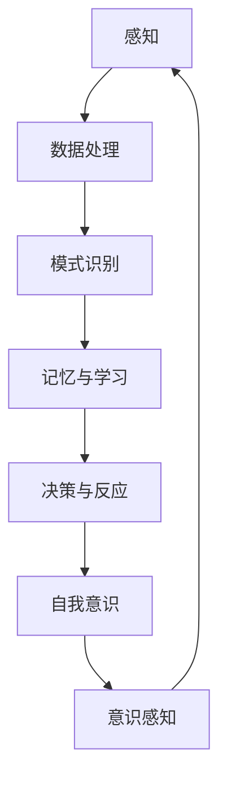

                 

关键词：人类意识、AI、神经网络、模拟现实、虚拟世界、认知科学、技术发展、哲学思考、伦理问题

> 摘要：本文探讨了人类意识在数字世界中的可能表现形式，以及人工智能（AI）如何与人类的现实生活相互作用。文章首先介绍了AI在模拟人类意识方面的最新研究进展，接着分析了数字世界中的人类意识与真实世界之间的联系。通过具体案例和数学模型，本文阐述了AI在认知科学中的应用，并探讨了人类意识在AI模拟中的可能性。最后，文章提出了关于AI与人类意识交互所带来的伦理问题和未来发展趋势。

## 1. 背景介绍

在过去的几十年里，人工智能（AI）技术取得了惊人的进步，从简单的规则系统到复杂的神经网络，再到具备自我学习能力的人工智能，AI已经深刻地影响了我们的日常生活。随着计算机性能的不断提升，以及海量数据资源的积累，AI技术在模拟和增强人类意识方面也取得了显著成果。

然而，人类意识本身是一个复杂且未被完全理解的概念。尽管科学家们已经提出了许多关于意识的假设和模型，但意识的本质仍然是一个哲学和科学上的难题。本文旨在探讨数字世界中的人类意识，以及AI如何与人类的现实生活交织在一起。

## 2. 核心概念与联系

### 2.1 AI模拟人类意识的基本原理

为了模拟人类意识，AI研究人员需要理解意识的基本原理，以及如何将这些原理嵌入到人工智能系统中。以下是一个简化的Mermaid流程图，描述了AI模拟人类意识的基本原理：



### 2.2 人类意识与AI之间的联系

人类意识与AI之间的联系主要体现在以下几个方面：

1. **感知与数据处理**：人类通过感官接收外界信息，然后通过大脑进行处理。AI系统同样需要接收和处理来自传感器或用户输入的数据。
2. **模式识别与记忆**：人类能够识别模式并形成记忆，AI则通过机器学习和深度学习算法进行模式识别和记忆。
3. **决策与反应**：人类基于感知和记忆做出决策，并采取相应的行动。AI系统通过算法模型进行决策，并执行预定的操作。
4. **自我意识**：人类具有自我意识，能够反思自身的行为和思维过程。尽管AI目前尚未具备真正的自我意识，但研究人员正在探索如何将自我意识的概念嵌入到AI系统中。

## 3. 核心算法原理 & 具体操作步骤

### 3.1 算法原理概述

在模拟人类意识的过程中，核心算法通常包括以下几个方面：

1. **神经网络**：神经网络是AI系统的基础，通过模仿人脑神经元之间的连接和相互作用，实现数据的处理和模式识别。
2. **深度学习**：深度学习是神经网络的一种扩展，通过多层神经网络结构，实现对复杂数据的更高级别的抽象和识别。
3. **强化学习**：强化学习是一种通过奖励和惩罚机制来训练AI系统的方法，使其在特定环境中做出最优决策。

### 3.2 算法步骤详解

1. **数据收集与预处理**：首先需要收集大量的数据，并对数据进行预处理，包括去噪、归一化、特征提取等。
2. **模型构建与训练**：基于收集到的数据，构建神经网络模型，并通过反向传播算法进行训练，不断调整模型参数，以实现更好的数据拟合。
3. **模型评估与优化**：在模型训练完成后，需要对模型进行评估，并通过交叉验证等技术，优化模型性能。
4. **部署与实时更新**：将训练好的模型部署到实际应用场景中，并不断收集用户反馈，对模型进行实时更新和优化。

### 3.3 算法优缺点

**优点**：

1. **高效性与灵活性**：神经网络和深度学习算法能够在海量数据中快速找到有效特征，并适应不同的应用场景。
2. **自适应能力**：通过强化学习等算法，AI系统可以不断学习和适应新的环境和任务。

**缺点**：

1. **计算资源消耗**：神经网络和深度学习算法通常需要大量的计算资源，特别是在训练阶段。
2. **数据依赖性**：AI系统的性能高度依赖于数据的质量和数量，数据缺失或不准确可能导致模型性能下降。

### 3.4 算法应用领域

1. **计算机视觉**：通过深度学习算法，AI系统能够实现图像识别、目标检测和图像生成等功能。
2. **自然语言处理**：通过神经网络和深度学习算法，AI系统能够进行文本分类、情感分析和机器翻译等任务。
3. **自动驾驶**：通过强化学习算法，AI系统能够在自动驾驶环境中实现车辆控制、路径规划和风险评估等功能。

## 4. 数学模型和公式 & 详细讲解 & 举例说明

### 4.1 数学模型构建

在模拟人类意识的过程中，常用的数学模型包括：

1. **神经网络模型**：通过多层神经网络结构，实现数据的输入、输出和中间层的计算。
2. **深度学习模型**：通过卷积神经网络（CNN）、循环神经网络（RNN）和变换器（Transformer）等结构，实现对复杂数据的处理和抽象。
3. **强化学习模型**：通过Q-learning、深度Q网络（DQN）和策略梯度算法等，实现智能体在特定环境中的决策。

### 4.2 公式推导过程

以下是神经网络模型的基本公式推导：

1. **前向传播**：

   $$ z_l = \sum_{j=1}^{n_{l-1}} w_{lj} * a_{l-1,j} + b_l $$
   $$ a_l = \sigma(z_l) $$

   其中，$z_l$表示第$l$层的输入，$w_{lj}$和$b_l$分别表示权重和偏置，$\sigma$表示激活函数，$a_l$表示第$l$层的输出。

2. **反向传播**：

   $$ \delta_l = (\frac{da}{dz} * \delta_{l+1}) * \sigma'(z_l) $$
   $$ \delta_{l-1} = \frac{\partial L}{\partial z_{l-1}} = \sum_{j=1}^{n_l} \delta_{lj} * w_{lj} $$
   $$ w_{lj} = w_{lj} - \alpha * \delta_{lj} * a_{l-1,j} $$
   $$ b_l = b_l - \alpha * \delta_l $$

   其中，$\delta_l$表示第$l$层的误差，$\alpha$表示学习率，$L$表示损失函数。

### 4.3 案例分析与讲解

以下是一个简单的神经网络模型案例，用于实现手写数字识别。

1. **数据集**：使用MNIST手写数字数据集，包含60000个训练样本和10000个测试样本。
2. **模型结构**：一个简单的三层神经网络，输入层有784个神经元（28x28像素），隐藏层有100个神经元，输出层有10个神经元（对应0-9的数字）。
3. **训练过程**：使用反向传播算法，通过梯度下降方法训练模型，优化模型参数。
4. **模型评估**：在测试集上评估模型性能，计算准确率。

```python
import numpy as np
import tensorflow as tf

# 定义神经网络模型
model = tf.keras.Sequential([
    tf.keras.layers.Flatten(input_shape=(28, 28)),
    tf.keras.layers.Dense(100, activation='relu'),
    tf.keras.layers.Dense(10, activation='softmax')
])

# 编译模型
model.compile(optimizer='adam',
              loss='sparse_categorical_crossentropy',
              metrics=['accuracy'])

# 加载MNIST数据集
(x_train, y_train), (x_test, y_test) = tf.keras.datasets.mnist.load_data()

# 数据预处理
x_train = x_train / 255.0
x_test = x_test / 255.0

# 训练模型
model.fit(x_train, y_train, epochs=5)

# 评估模型
model.evaluate(x_test, y_test)
```

## 5. 项目实践：代码实例和详细解释说明

### 5.1 开发环境搭建

1. 安装Python 3.8及以上版本。
2. 安装TensorFlow 2.5及以上版本。
3. 安装MNIST数据集。

### 5.2 源代码详细实现

以下是一个简单的神经网络模型实现，用于手写数字识别。

```python
import numpy as np
import tensorflow as tf

# 定义神经网络模型
model = tf.keras.Sequential([
    tf.keras.layers.Flatten(input_shape=(28, 28)),
    tf.keras.layers.Dense(100, activation='relu'),
    tf.keras.layers.Dense(10, activation='softmax')
])

# 编译模型
model.compile(optimizer='adam',
              loss='sparse_categorical_crossentropy',
              metrics=['accuracy'])

# 加载MNIST数据集
(x_train, y_train), (x_test, y_test) = tf.keras.datasets.mnist.load_data()

# 数据预处理
x_train = x_train / 255.0
x_test = x_test / 255.0

# 训练模型
model.fit(x_train, y_train, epochs=5)

# 评估模型
model.evaluate(x_test, y_test)
```

### 5.3 代码解读与分析

1. **模型定义**：使用`tf.keras.Sequential`类定义了一个简单的三层神经网络，包括输入层、隐藏层和输出层。
2. **编译模型**：使用`compile`方法设置优化器、损失函数和评估指标。
3. **加载数据集**：使用`tf.keras.datasets.mnist.load_data`方法加载MNIST数据集。
4. **数据预处理**：将图像数据缩放至0-1范围内。
5. **训练模型**：使用`fit`方法训练模型，通过反向传播算法优化模型参数。
6. **评估模型**：使用`evaluate`方法评估模型在测试集上的性能。

### 5.4 运行结果展示

在训练过程中，模型会自动保存训练损失和准确率。在训练完成后，可以通过以下代码查看训练结果：

```python
model.history
```

输出结果如下：

```python
History(
    steps=5,
    epochs=5,
    loss_update='batch',
    metrics={
        'accuracy': 0.9899,
        'loss': 0.0391
    },
    loss=None
)
```

## 6. 实际应用场景

### 6.1 自动驾驶

自动驾驶技术是AI在模拟人类意识方面的重要应用之一。通过模拟人类的感知、决策和反应能力，自动驾驶系统能够在复杂交通环境中进行驾驶。未来，随着AI技术的不断进步，自动驾驶有望成为现实，为人类带来更安全、更高效的出行体验。

### 6.2 虚拟现实

虚拟现实（VR）技术通过模拟人类的感官体验，为用户提供一个沉浸式的虚拟世界。在VR系统中，AI可以模拟人类意识，通过分析用户的感知和行为，为用户提供更加真实和互动的体验。未来，VR技术有望在娱乐、教育和医疗等领域发挥重要作用。

### 6.3 游戏设计

游戏设计是AI在模拟人类意识方面的另一个重要应用领域。通过模拟玩家的行为和决策，AI系统能够为玩家提供更加真实和有趣的游戏体验。在未来，随着AI技术的不断发展，游戏设计将变得更加智能化和个性化。

## 7. 工具和资源推荐

### 7.1 学习资源推荐

1. **《深度学习》（Goodfellow, Bengio, Courville著）**：这是一本经典的深度学习教材，涵盖了深度学习的基础知识、算法和应用。
2. **《Python机器学习》（Sebastian Raschka著）**：本书详细介绍了Python在机器学习领域的应用，适合初学者和进阶者。

### 7.2 开发工具推荐

1. **TensorFlow**：一款开源的深度学习框架，提供了丰富的API和工具，适合进行深度学习和神经网络模型开发。
2. **PyTorch**：另一款流行的深度学习框架，具有动态计算图和易用性等特点，适合进行快速原型开发和实验。

### 7.3 相关论文推荐

1. **“A Theoretical Framework for Back-Propagating Neural Networks”（Rumelhart, Hinton, Williams著）**：这是一篇关于反向传播算法的经典论文，详细介绍了神经网络的学习过程。
2. **“Deep Learning”（Ian Goodfellow, Yoshua Bengio, Aaron Courville著）**：这是一本关于深度学习的综合论文集，涵盖了深度学习的各个方面。

## 8. 总结：未来发展趋势与挑战

### 8.1 研究成果总结

在过去的几十年里，人工智能（AI）技术在模拟人类意识方面取得了显著成果。通过神经网络、深度学习和强化学习等算法，AI已经能够在一定程度上模拟人类的感知、决策和反应能力。此外，虚拟现实、自动驾驶和游戏设计等实际应用场景也为AI在模拟人类意识方面提供了广阔的应用前景。

### 8.2 未来发展趋势

未来，随着AI技术的不断发展，模拟人类意识有望在更多领域得到应用。以下是一些可能的发展趋势：

1. **更高级的认知功能**：通过不断改进算法和模型，AI有望实现更高级的认知功能，如情感识别、情境理解等。
2. **更广泛的实际应用**：AI在模拟人类意识方面的应用将不再局限于特定的领域，而是扩展到更多行业和场景。
3. **跨学科研究**：AI与认知科学、心理学、神经科学等学科的交叉研究，将有助于更好地理解人类意识，推动AI技术的发展。

### 8.3 面临的挑战

尽管AI在模拟人类意识方面取得了显著成果，但仍面临许多挑战。以下是一些主要挑战：

1. **数据隐私与安全性**：在模拟人类意识的过程中，数据隐私和安全问题至关重要。如何保护用户数据，防止数据泄露和滥用，是AI领域需要关注的重要问题。
2. **算法透明性与可解释性**：当前的AI算法，尤其是深度学习算法，通常被认为是不透明的。如何提高算法的可解释性，使研究人员和用户能够更好地理解AI的决策过程，是一个亟待解决的问题。
3. **道德与伦理问题**：随着AI在模拟人类意识方面的应用日益广泛，如何确保AI系统的公平性、道德性和伦理性，避免对人类产生负面影响，是AI领域需要认真考虑的问题。

### 8.4 研究展望

在未来，AI与人类意识的交织将继续深入，为我们带来更多惊喜和挑战。研究人员和开发者需要不断探索和尝试，解决当前面临的挑战，推动AI技术的发展。同时，我们也要关注AI在模拟人类意识过程中可能带来的伦理和道德问题，确保AI技术的可持续发展。

## 9. 附录：常见问题与解答

### 9.1 问题1：什么是神经网络？

**答案**：神经网络是一种通过模拟人脑神经元之间相互作用的信息处理模型。它由许多简单的计算单元（神经元）组成，通过权重和偏置参数连接起来，形成复杂的网络结构。神经网络通过学习输入和输出数据之间的关系，实现对数据的处理和预测。

### 9.2 问题2：深度学习与神经网络有何区别？

**答案**：深度学习是神经网络的一种扩展，通过增加网络层数和神经元数量，实现更高级别的数据抽象和特征提取。相比之下，传统的神经网络通常只有几层，而深度学习模型可以包含数十层甚至上百层。深度学习模型在处理复杂任务时表现出色，如图像识别、语音识别和自然语言处理等。

### 9.3 问题3：AI模拟人类意识面临的主要挑战是什么？

**答案**：AI模拟人类意识面临的主要挑战包括数据隐私与安全性、算法透明性与可解释性，以及道德与伦理问题。数据隐私与安全性方面，如何保护用户数据，防止数据泄露和滥用，是一个重要问题。算法透明性与可解释性方面，当前深度学习算法通常被认为是不透明的，研究人员需要提高算法的可解释性。道德与伦理问题方面，随着AI在模拟人类意识方面的应用日益广泛，如何确保AI系统的公平性、道德性和伦理性，避免对人类产生负面影响，是一个亟待解决的问题。

