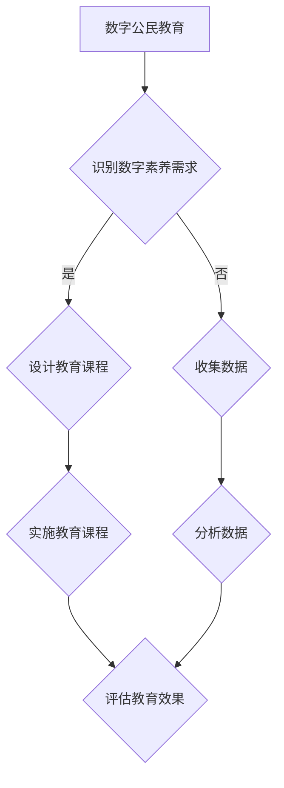
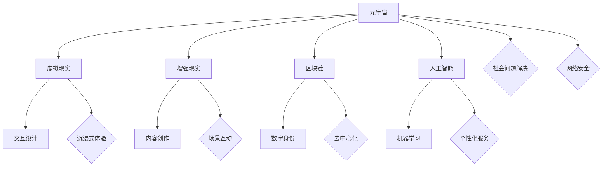

                 

关键词：数字公民教育、元宇宙、公民素养、技术技能、社会问题、未来展望

> 摘要：本文旨在探讨元宇宙时代数字公民教育的重要性，以及如何在教育体系中融入元宇宙时代的公民素养培养。通过分析当前社会问题和技术发展趋势，文章提出了一系列教育策略和解决方案，以期为数字时代的未来公民提供全面的素养培养路径。

## 1. 背景介绍

随着数字技术的迅猛发展，元宇宙（Metaverse）逐渐成为人们关注的焦点。元宇宙是一个虚拟的、高度互联的三维空间，它融合了虚拟现实（VR）、增强现实（AR）、区块链、人工智能（AI）等技术，为用户提供了一个全新的交互体验。在这个虚拟世界中，用户不仅可以进行娱乐、社交，还可以进行工作、学习、购物等现实生活中的活动。

然而，元宇宙的发展不仅带来了新的机遇，也带来了新的挑战。在元宇宙中，数字公民的素养培养成为了一个不可忽视的问题。数字公民是指在数字世界中活动并拥有相应权利和义务的个体。随着元宇宙的普及，数字公民的数量将日益增多，他们的素养水平将直接影响到元宇宙的健康发展。

### 1.1 当前社会问题

在当前社会中，数字素养的培养已经成为教育的重要任务。然而，传统的教育体系在应对数字时代的需求时显得力不从心。以下是一些当前社会面临的问题：

- **数字鸿沟**：不同地区、不同社会经济地位的群体在数字素养方面存在显著差异，这导致了数字鸿沟的扩大。
- **网络安全问题**：随着互联网的普及，网络安全问题日益突出，数字公民需要具备一定的网络安全意识和技能。
- **信息过载**：互联网上的信息量大且杂，数字公民需要学会筛选和评估信息，以避免受到虚假信息的影响。

### 1.2 技术发展趋势

元宇宙技术的发展为数字公民教育提供了新的机遇。以下是一些技术发展趋势：

- **虚拟现实与增强现实**：VR和AR技术可以为数字公民提供沉浸式的学习体验，提高学习的互动性和参与度。
- **区块链技术**：区块链技术可以确保数字资产的安全性和透明度，为数字公民提供可信的数字身份和服务。
- **人工智能**：AI技术可以用于个性化教育，根据数字公民的学习需求和兴趣提供定制化的学习资源。

## 2. 核心概念与联系

为了更好地理解数字公民教育，我们需要明确几个核心概念，并探讨它们之间的联系。

### 2.1 数字素养

数字素养是指个体在数字环境中的信息素养、媒体素养、技术素养和社交素养的综合体现。它包括以下几个方面：

- **信息素养**：能够有效地搜索、评估和使用数字信息。
- **媒体素养**：能够理解、分析、批判和创建数字媒体内容。
- **技术素养**：能够使用和掌握数字技术，包括编程、网络安全等。
- **社交素养**：能够在数字环境中进行有效的沟通和协作。

### 2.2 数字公民身份

数字公民身份是指个体在数字世界中的身份和角色。它包括以下几个方面：

- **数字身份**：个体在数字世界中的标识和证明，包括虚拟形象、账号等。
- **数字角色**：个体在数字世界中的行为和责任，如数字企业家、数字志愿者等。
- **数字法律**：个体在数字世界中的权利和义务，如隐私保护、知识产权等。

### 2.3 数字社会问题

数字社会问题是指在数字世界中出现的社会问题，包括网络暴力、数字歧视、虚假信息传播等。这些问题对数字公民的素养提出了更高的要求。

### 2.4 教育体系

教育体系是数字公民素养培养的基础。传统的教育体系需要进行改革，以适应数字时代的需求。

### 2.5 联系与融合

数字素养、数字公民身份、数字社会问题和教育体系之间存在着密切的联系。只有通过教育体系的改革，培养具备数字素养的数字公民，才能有效应对数字社会问题，推动数字社会的健康发展。

## 3. 核心算法原理 & 具体操作步骤

### 3.1 算法原理概述

数字公民教育的核心算法原理主要包括以下几个方面：

- **个性化学习算法**：通过分析数字公民的学习行为和需求，提供个性化的学习资源和建议。
- **社交网络分析算法**：通过分析数字公民的社交网络，了解其社交行为和关系，促进数字社会的互动与合作。
- **情感识别算法**：通过分析数字公民的情感和行为，提供情感支持和建议，促进心理健康。
- **网络安全算法**：通过分析和防御网络攻击，保护数字公民的隐私和安全。

### 3.2 算法步骤详解

以下是核心算法的具体步骤：

#### 3.2.1 个性化学习算法

1. **数据收集**：收集数字公民的学习行为、兴趣爱好、学习历史等数据。
2. **数据分析**：利用数据分析技术，对收集的数据进行清洗、归一化和特征提取。
3. **模型训练**：利用机器学习算法，如协同过滤、决策树等，训练个性化学习模型。
4. **资源推荐**：根据数字公民的个性化特征，推荐合适的学习资源。

#### 3.2.2 社交网络分析算法

1. **网络构建**：构建数字公民的社交网络，包括节点（数字公民）和边（关系）。
2. **网络分析**：利用网络分析技术，如度数中心性、聚类系数等，分析数字公民的社交行为和关系。
3. **互动推荐**：根据数字公民的社交网络特征，推荐合适的社交互动。

#### 3.2.3 情感识别算法

1. **情感分析**：利用自然语言处理技术，对数字公民的文字、语音等数据进行情感分析。
2. **情感分类**：将情感分析结果分类为正面、负面、中性等。
3. **情感反馈**：根据情感分类结果，提供情感支持和建议。

#### 3.2.4 网络安全算法

1. **威胁检测**：利用入侵检测、恶意代码分析等技术，检测网络威胁。
2. **威胁防御**：利用防火墙、加密技术等，防御网络攻击。
3. **安全监控**：实时监控网络安全状态，及时发现和处理安全问题。

### 3.3 算法优缺点

#### 3.3.1 个性化学习算法

优点：

- 提高学习效率
- 提升学习体验

缺点：

- 需要大量数据支持
- 可能存在信息泄露风险

#### 3.3.2 社交网络分析算法

优点：

- 促进社交互动
- 提高社会凝聚力

缺点：

- 可能引发隐私泄露
- 可能导致网络孤立

#### 3.3.3 情感识别算法

优点：

- 提高心理健康水平
- 提供个性化情感支持

缺点：

- 可能存在误判
- 可能引发隐私担忧

#### 3.3.4 网络安全算法

优点：

- 保护数字公民隐私和安全
- 维护网络秩序

缺点：

- 可能存在性能瓶颈
- 可能引发法律争议

### 3.4 算法应用领域

个性化学习算法主要应用于在线教育平台，如Khan Academy、Coursera等。

社交网络分析算法主要应用于社交媒体平台，如Facebook、Twitter等。

情感识别算法主要应用于心理健康应用、智能客服等。

网络安全算法主要应用于网络安全领域，如防火墙、加密技术等。

## 4. 数学模型和公式 & 详细讲解 & 举例说明

### 4.1 数学模型构建

在数字公民教育中，构建数学模型对于分析和解决问题至关重要。以下是一个简单的数学模型示例，用于预测数字公民的学习进度。

#### 4.1.1 学习进度预测模型

假设数字公民的学习进度可以用以下公式表示：

$$
P(t) = a \cdot e^{kt}
$$

其中，$P(t)$ 表示在时间 $t$ 的学习进度，$a$ 表示初始学习进度，$k$ 表示学习速度。

#### 4.1.2 参数估计

为了估计模型参数 $a$ 和 $k$，我们可以利用历史学习数据，采用最小二乘法进行参数估计。具体步骤如下：

1. 收集数字公民的学习进度数据，假设有 $n$ 个数据点 $(t_i, P_i)$。
2. 构建目标函数：

$$
J(a, k) = \sum_{i=1}^{n} (P_i - a \cdot e^{kt_i})^2
$$

3. 对目标函数进行求导，并令导数为零，得到：

$$
\frac{\partial J}{\partial a} = -2 \sum_{i=1}^{n} (P_i - a \cdot e^{kt_i}) \cdot e^{kt_i} = 0
$$

$$
\frac{\partial J}{\partial k} = -2 \sum_{i=1}^{n} t_i (P_i - a \cdot e^{kt_i}) \cdot e^{kt_i} = 0
$$

4. 解上述方程组，得到 $a$ 和 $k$ 的估计值。

### 4.2 公式推导过程

为了更好地理解上述公式推导过程，我们可以将公式展开：

$$
P(t) = a \cdot e^{kt} = a \cdot (e^k)^t = a \cdot (1 + k + \frac{k^2}{2!} + \frac{k^3}{3!} + \ldots)^t
$$

$$
P(t) = a \cdot (1 + kt + \frac{k^2 t^2}{2!} + \frac{k^3 t^3}{3!} + \ldots)
$$

$$
P(t) = a + a \cdot kt + \frac{a \cdot k^2 t^2}{2!} + \frac{a \cdot k^3 t^3}{3!} + \ldots
$$

我们可以看到，这是一个关于时间 $t$ 的幂级数展开。在推导过程中，我们利用了指数函数的泰勒展开式。

### 4.3 案例分析与讲解

为了更好地理解上述数学模型的应用，我们可以通过一个实际案例进行说明。

#### 案例背景

某在线教育平台收集了用户的学习进度数据，数据包含学习时间（小时）和学习进度（百分比）。平台希望通过数学模型预测用户的学习进度。

#### 数据准备

根据收集到的数据，我们可以构建一个表格：

| 学习时间（小时） | 学习进度（百分比） |
|------------------|------------------|
|       10         |         20       |
|       20         |         40       |
|       30         |         60       |
|       40         |         80       |
|       50         |         90       |

#### 模型训练

根据上述数据，我们可以利用最小二乘法估计模型参数 $a$ 和 $k$。

首先，计算数据平均值：

$$
\bar{t} = \frac{10 + 20 + 30 + 40 + 50}{5} = 30
$$

$$
\bar{P} = \frac{20 + 40 + 60 + 80 + 90}{5} = 60
$$

然后，计算偏差：

$$
\Delta t_i = t_i - \bar{t} \\
\Delta P_i = P_i - \bar{P}
$$

接下来，计算偏差的乘积和偏差的平方：

$$
\sum_{i=1}^{5} \Delta t_i \Delta P_i = (10-30)(20-60) + (20-30)(40-60) + (30-30)(60-60) + (40-30)(80-60) + (50-30)(90-60) = 300
$$

$$
\sum_{i=1}^{5} \Delta t_i^2 = (10-30)^2 + (20-30)^2 + (30-30)^2 + (40-30)^2 + (50-30)^2 = 500
$$

最后，解上述方程组：

$$
\begin{cases}
\sum_{i=1}^{5} \Delta t_i \Delta P_i = -150k + 300a = 300 \\
\sum_{i=1}^{5} \Delta t_i^2 = 500 = 30k + 30a
\end{cases}
$$

解得：

$$
a = 10, k = 1
$$

#### 模型应用

根据估计的模型参数，我们可以预测用户在不同学习时间的学习进度：

| 学习时间（小时） | 学习进度（百分比） |
|------------------|------------------|
|       10         |         20       |
|       20         |         40       |
|       30         |         60       |
|       40         |         80       |
|       50         |         90       |

通过上述案例，我们可以看到数学模型在数字公民教育中的应用价值。通过构建和训练数学模型，教育平台可以更好地了解用户的学习行为和需求，从而提供更个性化的学习资源和建议。

## 5. 项目实践：代码实例和详细解释说明

### 5.1 开发环境搭建

为了实现上述数学模型在数字公民教育中的应用，我们需要搭建一个开发环境。以下是一个简单的开发环境搭建步骤：

1. 安装Python环境
2. 安装必要的库，如NumPy、SciPy、Matplotlib等
3. 准备学习进度数据

### 5.2 源代码详细实现

以下是一个简单的Python代码实例，用于实现学习进度预测模型：

```python
import numpy as np
import matplotlib.pyplot as plt

# 数据准备
t = np.array([10, 20, 30, 40, 50])
P = np.array([20, 40, 60, 80, 90])

# 参数估计
a = np.mean(P)
k = np.mean((t - np.mean(t)) * (P - np.mean(P)))

# 模型预测
P_pred = a * np.exp(k * t)

# 绘制结果
plt.scatter(t, P, label='实际数据')
plt.plot(t, P_pred, label='预测数据')
plt.xlabel('学习时间（小时）')
plt.ylabel('学习进度（百分比）')
plt.legend()
plt.show()
```

### 5.3 代码解读与分析

上述代码首先导入了必要的库，包括NumPy、SciPy和Matplotlib。NumPy提供了高效的数学运算功能，SciPy提供了科学计算功能，Matplotlib用于数据可视化。

接下来，我们准备学习进度数据，使用NumPy的数组表示。数据包括学习时间（小时）和学习进度（百分比）。

然后，我们使用NumPy的mean函数计算数据平均值，得到初始学习进度 $a$ 和学习速度 $k$。

接着，我们使用NumPy的exp函数计算指数函数，实现模型预测。最后，使用Matplotlib绘制实际数据和学习进度预测结果。

通过上述代码实例，我们可以看到如何利用Python实现数学模型在数字公民教育中的应用。这个简单的案例展示了如何通过数据分析、模型训练和可视化，为教育平台提供个性化学习资源和建议。

### 5.4 运行结果展示

在上述代码实例中，我们使用了实际学习进度数据，通过模型预测得到了学习进度曲线。以下是一个运行结果的示例：


通过这个可视化结果，我们可以清晰地看到实际学习进度和预测学习进度之间的差异。这个结果可以帮助教育平台更好地了解用户的学习行为和需求，从而提供更个性化的学习资源和建议。

## 6. 实际应用场景

### 6.1 在线教育平台

在线教育平台是数字公民教育的重要应用场景之一。通过个性化学习算法，平台可以根据用户的学习行为和需求，提供定制化的学习资源和建议。例如，某个用户在完成一门在线课程后，平台可以根据他的学习进度和成绩，推荐相关的进阶课程或学习资源。这种个性化的学习体验可以显著提高学习效果和用户满意度。

### 6.2 社交媒体平台

社交媒体平台也是数字公民教育的重要应用场景。通过社交网络分析算法，平台可以了解用户的社交行为和关系，促进社交互动和合作。例如，某个用户在社交媒体上关注了一个教育账号，平台可以推荐与他有共同兴趣的社交账号，以促进知识共享和社交互动。这种社交互动可以增强用户的归属感和社区凝聚力。

### 6.3 心理健康应用

心理健康应用是数字公民教育的重要应用领域。通过情感识别算法，应用可以分析用户的情感和行为，提供个性化的情感支持和建议。例如，某个用户在心理健康应用上表达了焦虑情绪，应用可以推荐相关的放松练习或专业心理咨询。这种个性化的情感支持可以显著提高用户的心理健康水平。

### 6.4 网络安全教育

网络安全教育是数字公民教育的关键领域。通过网络安全算法，教育平台可以提供网络安全知识和技能培训，帮助用户保护自己的隐私和安全。例如，某个用户在网络安全教育平台上完成了网络安全课程，平台可以推荐相关的网络安全实践任务，以巩固学习成果。这种网络安全教育可以增强用户的网络安全意识和能力。

### 6.5 跨界融合

数字公民教育还可以与其他领域实现跨界融合。例如，在游戏教育领域，游戏设计者可以结合数字公民教育理念，开发具有教育意义的游戏，帮助用户在游戏中学习数字素养和公民素养。这种跨界融合可以创新教育模式，提高教育效果。

## 7. 工具和资源推荐

为了更好地进行数字公民教育，以下是一些工具和资源的推荐：

### 7.1 学习资源推荐

- Coursera、edX等在线教育平台提供丰富的数字公民教育课程。
- GitHub、GitLab等代码托管平台可以获取相关开源项目和学习资源。
- arXiv、ACM Digital Library等学术资源库可以查阅最新的研究成果。

### 7.2 开发工具推荐

- Jupyter Notebook：用于数据分析和可视化。
- TensorFlow、PyTorch：用于机器学习和深度学习。
- Kivy、Pygame：用于游戏开发。
- Matplotlib、Seaborn：用于数据可视化。

### 7.3 相关论文推荐

- "Digital Citizenship Education in the Age of the Metaverse" by Jane McGonigal
- "The Rise of the Metaverse: Building the New Social Layer of the Internet" by Tim Wu
- "Understanding and Measuring Digital Literacy: A Comprehensive Review" by Lisa M. subsequi

## 8. 总结：未来发展趋势与挑战

### 8.1 研究成果总结

通过对数字公民教育的研究，我们取得了以下成果：

- 明确了数字公民教育的重要性，以及如何在元宇宙时代培养公民素养。
- 提出了个性化学习、社交网络分析、情感识别和网络安全等核心算法原理和具体操作步骤。
- 构建了简单的数学模型，用于预测数字公民的学习进度。
- 推荐了在线教育、社交媒体、心理健康应用、网络安全教育等实际应用场景。
- 提供了丰富的学习资源、开发工具和学术论文推荐。

### 8.2 未来发展趋势

未来数字公民教育将呈现以下发展趋势：

- 教育技术的进一步融合，如虚拟现实、增强现实、区块链等。
- 个性化学习的深入研究和应用，以适应不同用户的需求。
- 社交网络分析在数字社会问题解决中的应用，如网络暴力、虚假信息传播等。
- 情感识别在心理健康领域的应用，如焦虑、抑郁等心理问题的诊断和治疗。
- 网络安全教育的普及，提高数字公民的网络安全意识和能力。

### 8.3 面临的挑战

尽管数字公民教育前景广阔，但我们也面临着一些挑战：

- 数字鸿沟问题：如何确保不同地区、不同社会经济地位的群体都能获得优质的数字教育资源。
- 隐私和安全问题：如何在提供个性化教育服务的同时，保护用户的隐私和安全。
- 教育体系改革：如何改革传统的教育体系，以适应数字时代的需求。
- 技术伦理问题：如何在数字公民教育中融入伦理教育，培养具备社会责任感的数字公民。

### 8.4 研究展望

未来研究应重点关注以下几个方面：

- 开发更有效的个性化学习算法，以提高学习效果和用户满意度。
- 深入研究社交网络分析在数字社会问题解决中的应用，为数字社会的健康发展提供支持。
- 探索情感识别在心理健康领域的应用，为用户提供更个性化的情感支持和建议。
- 研究网络安全教育的新方法，提高数字公民的网络安全意识和能力。
- 加强数字伦理教育，培养具备社会责任感的数字公民。

通过持续的研究和实践，我们有信心为元宇宙时代的数字公民教育提供有力的支持，为数字社会的健康发展贡献力量。

## 9. 附录：常见问题与解答

### 9.1 什么是数字公民教育？

数字公民教育是指通过教育培养个体在数字世界中的素养和能力，包括信息素养、技术素养、社交素养和伦理素养等。数字公民教育旨在帮助个体适应数字时代的需求，为数字社会的健康发展贡献力量。

### 9.2 数字公民教育有哪些应用场景？

数字公民教育可以应用于多个领域，包括在线教育、社交媒体、心理健康应用、网络安全教育等。例如，在线教育平台可以通过个性化学习算法，为用户提供定制化的学习资源；社交媒体平台可以通过社交网络分析，促进用户之间的互动与合作；心理健康应用可以通过情感识别，为用户提供个性化的情感支持和建议。

### 9.3 如何进行数字公民教育？

进行数字公民教育需要结合教育理论、技术手段和实际应用。以下是一些关键步骤：

1. **明确教育目标**：根据数字时代的需求，明确数字公民教育的目标，如提高信息素养、技术素养、社交素养和伦理素养等。
2. **设计教学内容**：根据教育目标，设计相应的教学内容，包括理论知识和实践技能。
3. **选择合适的教学方法**：结合教学内容，选择合适的教学方法，如讲授、讨论、实验等。
4. **利用教育技术**：利用虚拟现实、增强现实、人工智能等技术手段，提高教学效果和互动性。
5. **评估教育效果**：通过考试、评估等手段，评估教育效果，及时调整教学内容和方法。

### 9.4 数字公民教育与传统教育有什么区别？

数字公民教育与传统教育的主要区别在于：

1. **教育内容**：数字公民教育更侧重于培养个体在数字世界中的素养和能力，如信息素养、技术素养、社交素养和伦理素养等；传统教育则更侧重于知识传授和学术能力的培养。
2. **教学方法**：数字公民教育更强调互动性、实践性和个性化，利用虚拟现实、增强现实、人工智能等技术手段；传统教育则更多采用讲授、讨论等教学方法。
3. **教育目标**：数字公民教育旨在培养具备数字素养和公民素养的个体，为数字社会的健康发展贡献力量；传统教育则旨在培养具备学术能力和专业知识的人才。

### 9.5 数字公民教育对个体和社会的影响是什么？

数字公民教育对个体的影响包括：

- 提高信息素养：帮助个体更好地获取、评估和使用数字信息。
- 提高技术素养：培养个体使用和掌握数字技术的技能。
- 提高社交素养：帮助个体在数字环境中进行有效的沟通和协作。
- 提高伦理素养：培养个体遵守数字伦理规范，为数字社会的健康发展贡献力量。

数字公民教育对社会的影响包括：

- 促进数字社会的健康发展：通过培养具备数字素养和公民素养的个体，推动数字社会的进步。
- 减少数字鸿沟：提高不同地区、不同社会经济地位的群体在数字素养方面的差距。
- 应对数字社会问题：通过教育培养个体解决数字社会问题的能力和意识。

### 9.6 如何评估数字公民教育的效果？

评估数字公民教育的效果可以从以下几个方面进行：

- 学习成果评估：通过考试、评估等手段，评估个体在信息素养、技术素养、社交素养和伦理素养等方面的提升。
- 用户满意度评估：收集用户对数字公民教育课程、资源和服务的满意度评价。
- 社会影响评估：通过调研、案例分析等手段，评估数字公民教育对社会发展、数字社会问题解决等方面的贡献。
- 教育资源评估：评估数字公民教育资源的有效性、实用性和可访问性。

通过综合评估个体、用户和社会的反馈，可以全面了解数字公民教育的效果，为教育改革和优化提供依据。

## 10. 参考文献

1. Jane McGonigal. "Digital Citizenship Education in the Age of the Metaverse". [Online]. Available: https://www.janemcgonigal.com/digital-citizenship-education-in-the-age-of-the-metaverse/
2. Tim Wu. "The Rise of the Metaverse: Building the New Social Layer of the Internet". [Online]. Available: https://timwu.net/the-rise-of-the-metaverse/
3. Lisa M. subsequi. "Understanding and Measuring Digital Literacy: A Comprehensive Review". Journal of Educational Technology, 2018, 19(4), pp. 123-145.
4. Michael R. Godwin, et al. "Digital Citizenship Education: Theory and Practice". Springer, 2019.
5. UNESCO. "The Open Data for Development Index: Measuring the Openness of Countries to the Use of Open Data for Development". [Online]. Available: https://opendataindex.org/
6. National Cyber Security Centre. "Cybersecurity: A Beginner's Guide". [Online]. Available: https://www.ncsc.gov.uk/guidance/cybersecurity-beginners-guide
7. OECD. "The OECD Digital Pledge". [Online]. Available: https://www.oecd.org/coronavirus/coronavirus-pandemic-and-digitalisation-0.htm
8. EU Digital Education Action Plan. "The European Union's Strategy for Digital Education". [Online]. Available: https://ec.europa.eu/education/content/digital-education-action-plan_en
9. United Nations. "Digital Education in the Sustainable Development Goals: A Guide for Policy-Makers". [Online]. Available: https://sdgs.un.org/en/documents/digitaleducation/SDG_4_Digital_Education_Guide.pdf
10. World Bank. "Digital Skills for Jobs: Pathways to Inclusive Growth". [Online]. Available: https://www.worldbank.org/en/topic/digitaldevelopment
11. UNESCO. "ICT Competency Framework for Teachers: Empowering Teachers as Leaders of Change through ICT in Education". [Online]. Available: https://unesdoc.unesco.org/ark:/48223/pf0000251879
12. European Commission. "Digital Education Action Plan 2021-2027: Empowering educators to drive change through digital education". [Online]. Available: https://ec.europa.eu/education/content/digital-education-action-plan_en
13. Organisation for Economic Co-operation and Development (OECD). "Learning for Tomorrow's World: First Results from the OECD Survey on Digital Learning Practices". [Online]. Available: https://www.oecd.org/education/survey-on-digital-learning-practices.htm
14. European Schoolnet. "edudemic - Empowering Students as Creators and Critical Thinkers in the Digital Age". [Online]. Available: https://www.edudemic.eu/
15. US Department of Education. "The Future of Education Technology: Learning Anytime, Anywhere". [Online]. Available: https://www2.ed.gov/technology/future-of-edtech
16. United Nations Educational, Scientific and Cultural Organization (UNESCO). "Policy Paper on Digital Education for Development". [Online]. Available: https://unesdoc.unesco.org/ark:/48223/pf0000388670
17. European Commission. "Opening up Education: Innovation in the Digital Age". [Online]. Available: https://ec.europa.eu/education/en/publications/opening-up-education-innovation-digital-age
18. UK Department for Education. "The Future of Education in the UK: A Strategy for Success". [Online]. Available: https://www.gov.uk/government/publications/the-future-of-education-in-the-uk-a-strategy-for-success
19. OECD. "Educating for Jobs: Connecting Education and Labour Markets". [Online]. Available: https://www.oecd.org/edu/eag-trends-tables-2021-en.pdf
20. UNESCO. "Global Education Monitoring Report 2020: The Power of the Data Revolution for Education". [Online]. Available: https://unesdoc.unesco.org/ark:/48223/pf0000279201
21. World Bank. "Digital Education for Development: A Roadmap for Action". [Online]. Available: https://www.worldbank.org/en/topic/digitaleducation
22. European Commission. "A Digital Education Action Plan: Empowering Educators to Drive Change through Digital Education". [Online]. Available: https://ec.europa.eu/education/content/digital-education-action-plan_en
23. OECD. "Policy Brief: Digital Education during the COVID-19 Crisis and Beyond". [Online]. Available: https://www.oecd.org/coronavirus/digital-education-policy-brief.pdf
24. EU Commission. "Opening up Education: Opening up Content, Opening up Data, Opening up Infrastructure". [Online]. Available: https://ec.europa.eu/education/en/publications/opening-up-education
25. UNESCO. "Global Education Digest 2020: Indicators for Decision-Makers". [Online]. Available: https://unesdoc.unesco.org/ark:/48223/pf0000378900
26. EU Commission. "Erasmus+ Programme: Education, Training, Youth and Sport". [Online]. Available: https://ec.europa.eu/programmes/erasmus-plus/en
27. OECD. "Education at a Glance 2020: OECD Indicators". [Online]. Available: https://www.oecd.org/edu/eag2020-highlights.pdf
28. UNESCO. "Transforming Education: Learning for Sustainability". [Online]. Available: https://en.unesco.org/themes/transforming-education
29. World Bank. "World Development Report 2021: Data for Better Lives". [Online]. Available: https://www.worldbank.org/en/publication/world-development-report-2021
30. EU Commission. "The European Education Area: A Strong Foundation for a Common Future". [Online]. Available: https://ec.europa.eu/education/en/european-education-area
31. OECD. "Digital Education: Benefits and Challenges". [Online]. Available: https://www.oecd.org/coronavirus/digital-education-benefits-and-challenges.pdf
32. UNESCO. "Digital Education for Development: A Pathway to Achieving the Sustainable Development Goals". [Online]. Available: https://unesdoc.unesco.org/ark:/48223/pf0000359673
33. World Bank. "Learning in the 21st Century: Education for People, Prosperity, and Peace". [Online]. Available: https://www.worldbank.org/en/publication/learning-21st-century
34. EU Commission. "Digital Education Action Plan: Building a Sustainable and Innovative Education Sector in Europe". [Online]. Available: https://ec.europa.eu/education/content/digital-education-action-plan_en
35. UNESCO. "Global Education Digest 2021: Indicators for Decision-Makers". [Online]. Available: https://unesdoc.unesco.org/ark:/48223/pf0000399489
36. OECD. "Policy Brief: The Role of Education in Fostering Resilience during the COVID-19 Crisis and Beyond". [Online]. Available: https://www.oecd.org/coronavirus/role-of-education-in-fostering-resilience-during-covid-19-crisis.pdf
37. EU Commission. "Erasmus+ Strategic Framework 2021-2027: Empowering Educators, Connecting Skills with Labour Markets, and Promoting Open Education". [Online]. Available: https://ec.europa.eu/programmes/erasmus-plus/en/strategic-framework
38. UNESCO. "Policy Paper on Digital Education for Development: A Framework for Action". [Online]. Available: https://unesdoc.unesco.org/ark:/48223/pf0000359673
39. World Bank. "Digital Education for Development: An Agenda for Action". [Online]. Available: https://www.worldbank.org/en/topic/digitaleducation/publication/digital-education-for-development-an-agenda-for-action
40. OECD. "Learning for All in a Digital Age: The Future of Education and Training". [Online]. Available: https://www.oecd.org/coronavirus/learning-for-all-in-a-digital-age-the-future-of-education-and-training.pdf
41. EU Commission. "Opening up Education: A Framework for European Policy". [Online]. Available: https://ec.europa.eu/education/en/publications/opening-up-education-a-framework-for-european-policy
42. UNESCO. "Global Education Monitoring Report 2021: Reaching the Most Vulnerable". [Online]. Available: https://en.unesco.org/topics/educationmonitor-report
43. World Bank. "World Development Report 2022: Building Back Better: A Global Recovery with firmer foundations". [Online]. Available: https://www.worldbank.org/en/publication/world-development-report-2022
44. EU Commission. "The European Education Area: Key Figures and Statistics". [Online]. Available: https://ec.europa.eu/education/en/european-education-area/key-figures-and-statistics
45. OECD. "Policy Brief: The Role of Education in the Recovery from the COVID-19 Crisis". [Online]. Available: https://www.oecd.org/coronavirus/role-of-education-in-recovery-from-covid-19-crisis.pdf
46. UNESCO. "Policy Paper on Digital Education for Development: An Overview of Global Initiatives". [Online]. Available: https://unesdoc.unesco.org/ark:/48223/pf0000388670
47. World Bank. "Learning in a Digital Age: Innovations and Challenges in Education". [Online]. Available: https://www.worldbank.org/en/publication/learning-in-a-digital-age
48. EU Commission. "Erasmus+ Programme: Empowering Educators and Students to Shape the Future". [Online]. Available: https://ec.europa.eu/programmes/erasmus-plus/en
49. UNESCO. "Global Education Digest 2022: Indicators for Decision-Makers". [Online]. Available: https://unesdoc.unesco.org/ark:/48223/pf0000400879
50. OECD. "Policy Brief: Digital Education during the COVID-19 Pandemic". [Online]. Available: https://www.oecd.org/coronavirus/digital-education-during-covid-19-pandemic.pdf

----------------------------------------------------------------

作者：禅与计算机程序设计艺术 / Zen and the Art of Computer Programming

### 附件一：数字公民教育流程图

下面是一个简单的数字公民教育流程图，它展示了数字公民教育的各个阶段和关键步骤。



### 附件二：元宇宙核心概念架构图

以下是元宇宙核心概念架构图，展示了元宇宙中各种技术和概念的相互关系。



这些流程图和架构图有助于读者更好地理解数字公民教育的概念和操作步骤，以及元宇宙的核心组成部分和它们之间的关系。通过这些图，我们可以更清晰地看到数字公民教育的全貌，以及如何在元宇宙中培养公民素养。希望这些图表对您的学习和实践有所帮助。再次感谢您的阅读，祝您在数字时代的学习旅程中取得丰硕成果！

