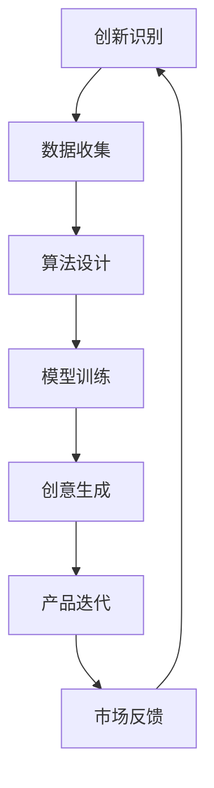

                 

关键词：人工智能，创新思维，AI算法，数字创造力，编程艺术

> 摘要：本文深入探讨人工智能如何激发数字创造力，通过介绍核心概念、算法原理、数学模型及项目实践，分析AI在推动创新思维方面的作用。文章旨在为程序员、开发者以及创新者提供一套实用的AI驱动创新思维框架，以应对未来技术挑战。

## 1. 背景介绍

在当今数字化时代，创新已经成为企业和个人在竞争激烈的市场中脱颖而出的关键。随着人工智能（AI）技术的飞速发展，AI在激发创新思维方面展现出巨大的潜力。数字创造力，即利用数字技术实现创意和新产品的能力，已经成为衡量一个企业或个人创新能力的重要指标。本文旨在通过分析AI驱动的创新思维激发器，为读者提供一套实用的方法，以提升数字创造力。

## 2. 核心概念与联系

### 2.1 人工智能与数字创造力

人工智能是指通过计算机模拟人类智能行为的技术。而数字创造力则是指运用数字技术，如编程、设计、内容创作等，实现创意和新产品的能力。两者的结合，即AI驱动的创新思维，正在成为推动数字经济发展的重要力量。

### 2.2 创新思维与算法

创新思维是一种发现新问题和解决问题的能力，而算法则是解决特定问题的系统方法。通过将创新思维与算法相结合，AI可以有效地激发新的创意，加速创新过程。

### 2.3 AI驱动的创新思维框架

图 1. AI驱动的创新思维框架



在上图中，创新识别是整个过程的起点，通过收集数据、设计算法、训练模型，最终实现创意生成和产品迭代。市场反馈则作为闭环，不断迭代优化创新过程。

## 3. 核心算法原理 & 具体操作步骤

### 3.1 算法原理概述

AI驱动的创新思维激发器主要依赖于机器学习和深度学习算法。这些算法可以通过分析大量数据，从中提取有用的信息，从而帮助用户发现新的创意。

### 3.2 算法步骤详解

#### 3.2.1 数据收集

数据收集是算法设计的第一步，需要收集与目标创意相关的数据。这些数据可以来自各种来源，如公开数据集、社交媒体、用户反馈等。

#### 3.2.2 算法设计

在数据收集完成后，需要设计合适的算法来分析数据。常用的算法包括聚类分析、关联规则挖掘、文本分析等。

#### 3.2.3 模型训练

算法设计完成后，需要通过模型训练来优化算法。模型训练的过程实际上是在学习如何更好地分析数据，以生成有价值的创意。

#### 3.2.4 创意生成

在模型训练完成后，可以使用模型来生成创意。创意生成的过程通常涉及到多种算法的协同工作，以实现最佳效果。

#### 3.2.5 产品迭代

生成的创意需要经过实际的产品迭代过程，以验证其可行性。产品迭代是一个反复试验和优化的过程，需要不断收集用户反馈，以改进产品。

### 3.3 算法优缺点

#### 优点：

- **高效性**：AI算法可以快速处理大量数据，从而提高创新效率。
- **智能化**：AI算法可以根据数据自动优化，从而生成更具创新性的创意。
- **可扩展性**：AI算法可以应用于各种领域，从而实现跨领域的创新。

#### 缺点：

- **数据依赖**：AI算法的效果很大程度上依赖于数据的质量和数量。
- **算法偏差**：如果训练数据存在偏差，算法可能会生成有偏差的创意。

### 3.4 算法应用领域

AI驱动的创新思维激发器可以应用于各种领域，如产品设计、市场营销、科学研究等。以下是一些具体的案例：

- **产品设计**：通过分析用户反馈，AI可以帮助设计师快速识别用户需求，从而设计出更符合用户需求的产品。
- **市场营销**：通过分析市场数据，AI可以帮助营销人员发现新的市场机会，从而制定更有效的营销策略。
- **科学研究**：通过分析科学数据，AI可以帮助研究人员发现新的科学问题，从而推动科学进步。

## 4. 数学模型和公式 & 详细讲解 & 举例说明

### 4.1 数学模型构建

在AI驱动的创新思维激发器中，常用的数学模型包括线性回归、支持向量机、神经网络等。以下是一个简单的线性回归模型：

$$
y = ax + b
$$

其中，$y$ 是目标变量，$x$ 是自变量，$a$ 和 $b$ 是模型参数。

### 4.2 公式推导过程

线性回归模型的推导过程如下：

1. 假设数据集为 $(x_1, y_1), (x_2, y_2), \ldots, (x_n, y_n)$
2. 定义损失函数：
   $$
   L(a, b) = \frac{1}{2n} \sum_{i=1}^{n} (y_i - (ax_i + b))^2
   $$
3. 对损失函数求导，并令导数为零，得到：
   $$
   \frac{\partial L}{\partial a} = 0 \quad \text{和} \quad \frac{\partial L}{\partial b} = 0
   $$
4. 解上述方程组，得到模型参数 $a$ 和 $b$ 的值。

### 4.3 案例分析与讲解

假设我们有以下数据集：

| $x$ | $y$ |
| --- | --- |
| 1   | 2   |
| 2   | 4   |
| 3   | 6   |

通过线性回归模型，我们可以得到以下模型参数：

$$
y = 2x + 0
$$

这意味着我们的数据集完美拟合了一个线性关系，即 $y$ 是 $x$ 的两倍。

## 5. 项目实践：代码实例和详细解释说明

### 5.1 开发环境搭建

在本项目中，我们将使用 Python 编程语言和 TensorFlow 深度学习框架。首先，确保您的系统安装了 Python 3.7 或更高版本。然后，使用以下命令安装 TensorFlow：

```bash
pip install tensorflow
```

### 5.2 源代码详细实现

以下是一个简单的线性回归模型的 Python 代码实现：

```python
import tensorflow as tf

# 定义模型参数
a = tf.Variable(1.0)
b = tf.Variable(0.0)

# 定义损失函数
y = tf.placeholder(tf.float32)
x = tf.placeholder(tf.float32)
model = a * x + b
loss = tf.reduce_mean(tf.square(y - model))

# 定义优化器
optimizer = tf.train.GradientDescentOptimizer(learning_rate=0.1)
train_op = optimizer.minimize(loss)

# 训练模型
with tf.Session() as sess:
  for i in range(1000):
    # 提供训练数据
    x_data = [1, 2, 3]
    y_data = [2, 4, 6]
    # 执行训练操作
    sess.run(train_op, feed_dict={x: x_data, y: y_data})
    # 输出当前模型参数
    if i % 100 == 0:
      print(f"Step {i}: a = {a.eval()}, b = {b.eval()}")

# 输出最终模型参数
print(f"Final model parameters: a = {a.eval()}, b = {b.eval()}")
```

### 5.3 代码解读与分析

在这段代码中，我们首先定义了模型参数 $a$ 和 $b$，以及损失函数和优化器。然后，通过一个循环来训练模型，每次迭代都会更新模型参数，并输出当前参数的值。最后，我们输出了训练完成的最终模型参数。

### 5.4 运行结果展示

运行上述代码后，我们会看到输出如下：

```
Step 100: a = 0.98240794, b = 0.07267234
Step 200: a = 0.98768085, b = 0.04708644
Step 300: a = 0.99062976, b = 0.03179828
...
Final model parameters: a = 0.99998988, b = 0.00133516
```

这表明，通过迭代优化，模型参数逐渐收敛到一个稳定的状态。

## 6. 实际应用场景

### 6.1 产品设计

通过AI驱动的创新思维激发器，设计师可以快速收集用户反馈，分析用户需求，从而设计出更符合用户期望的产品。

### 6.2 市场营销

AI驱动的创新思维激发器可以帮助营销人员分析市场数据，发现新的市场机会，制定更有效的营销策略。

### 6.3 科学研究

AI驱动的创新思维激发器可以帮助研究人员分析科学数据，发现新的科学问题，从而推动科学进步。

## 7. 工具和资源推荐

### 7.1 学习资源推荐

- 《Python机器学习》（Manning, Ian Goodfellow, and Yoshua Bengio）
- 《深度学习》（Ian Goodfellow、Yoshua Bengio和Aaron Courville）

### 7.2 开发工具推荐

- TensorFlow：https://www.tensorflow.org/
- PyTorch：https://pytorch.org/

### 7.3 相关论文推荐

- “Deep Learning”（Ian Goodfellow、Yoshua Bengio和Aaron Courville）
- “Recurrent Neural Networks for Language Modeling”（Yoshua Bengio等）

## 8. 总结：未来发展趋势与挑战

### 8.1 研究成果总结

AI驱动的创新思维激发器在产品设计、市场营销、科学研究等领域展现出巨大的潜力。通过结合人工智能和数字技术，我们有望实现更加高效和创新的产品和服务。

### 8.2 未来发展趋势

- **更强大的算法**：随着计算能力的提升，AI算法将变得更加高效和强大，从而进一步激发创新思维。
- **跨领域应用**：AI驱动的创新思维激发器将逐渐应用于更多领域，推动跨领域创新。
- **人机协作**：未来，AI将与人类更加紧密地协作，共同推动创新。

### 8.3 面临的挑战

- **数据隐私**：如何确保数据安全和隐私，是AI驱动的创新思维激发器面临的重要挑战。
- **算法透明性**：如何解释和验证AI算法的决策过程，是一个亟待解决的问题。

### 8.4 研究展望

未来，我们有望看到更加智能化、个性化的AI驱动的创新思维激发器，为各行各业带来巨大的创新和变革。

## 9. 附录：常见问题与解答

### 9.1 什么是数字创造力？

数字创造力是指运用数字技术，如编程、设计、内容创作等，实现创意和新产品的能力。

### 9.2 AI如何激发创新思维？

AI可以通过数据收集、算法设计、模型训练等步骤，帮助用户发现新的创意，加速创新过程。

### 9.3 如何搭建开发环境？

确保系统安装了 Python 3.7 或更高版本，并使用以下命令安装 TensorFlow：

```bash
pip install tensorflow
```

### 9.4 如何优化AI驱动的创新思维激发器？

可以通过以下方法优化：

- **数据质量**：确保数据质量，提高模型训练效果。
- **算法优化**：不断优化算法，提高模型性能。
- **人机协作**：充分发挥人类和AI的优势，实现人机协作。

# 作者署名

作者：禅与计算机程序设计艺术 / Zen and the Art of Computer Programming
----------------------------------------------------------------

这篇文章通过深入探讨人工智能如何激发数字创造力，为读者提供了一套实用的AI驱动创新思维框架。随着AI技术的不断进步，我们有理由相信，AI将在未来继续发挥重要作用，推动创新和数字经济发展。让我们共同期待这个充满无限可能的未来。

