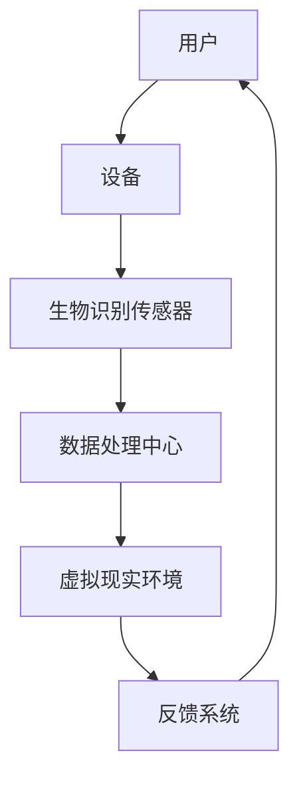
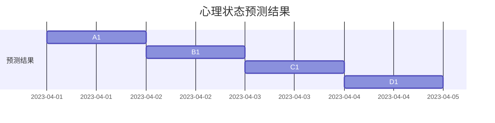

                 

关键词：数字化冥想、心灵平静、科技应用、创业

> 摘要：随着科技的快速发展，数字化冥想作为一种新兴的产业，正逐渐融入人们的生活。本文将探讨数字化冥想在创业领域的应用，以及科技如何辅助实现心灵平静，为读者提供一种全新的生活方式。

## 1. 背景介绍

在现代社会，人们的压力越来越大，焦虑和抑郁等心理问题愈发普遍。为了寻求内心的平静和自我成长，越来越多的人开始接触和尝试冥想。然而，传统的冥想方式需要长时间的练习和静坐，对于忙碌的现代人来说，往往难以坚持。数字化冥想的兴起，为这一问题提供了新的解决方案。

数字化冥想通过科技手段，将冥想与传统心理学、生物识别技术、虚拟现实等相结合，使冥想变得更加便捷、高效和可量化。这种新兴产业不仅满足了人们对心理健康的需求，还为创业者提供了一个新的市场机遇。

## 2. 核心概念与联系

### 2.1 数字化冥想的核心概念

数字化冥想主要涉及以下几个核心概念：

- **冥想技术**：包括传统的静坐冥想、动态冥想、呼吸冥想等，以及结合科技手段的数字化冥想。

- **生物识别技术**：通过监测心率、呼吸、皮肤电反应等生理指标，了解冥想过程中的心理状态。

- **虚拟现实**：为用户提供一个沉浸式的冥想环境，增强冥想体验。

- **数据分析与反馈**：对用户在冥想过程中的数据进行采集、分析和反馈，帮助用户更好地了解自己的心理状态。

### 2.2 数字化冥想的架构

为了更好地理解数字化冥想，我们可以通过Mermaid流程图来展示其架构：



在这个架构中，用户通过设备连接生物识别传感器，传感器采集生理数据后传输到数据处理中心。数据处理中心对数据进行分析，并根据分析结果调整虚拟现实环境，为用户提供反馈。这个反馈系统不断循环，使冥想过程更加个性化、高效。

## 3. 核心算法原理 & 具体操作步骤

### 3.1 算法原理概述

数字化冥想的核心算法主要涉及以下几个方面：

- **生理信号处理**：对心率、呼吸、皮肤电反应等生理信号进行预处理、特征提取和模式识别。

- **心理状态识别**：通过生理信号和用户行为数据，识别用户的心理状态，如焦虑、放松等。

- **虚拟现实环境调整**：根据用户的心理状态，调整虚拟现实环境的视觉效果和听觉效果，以提升冥想体验。

- **反馈系统设计**：对用户的冥想过程进行实时监测，并根据监测结果给出反馈，帮助用户更好地调整心理状态。

### 3.2 算法步骤详解

- **生理信号采集**：用户通过设备连接生物识别传感器，传感器实时采集心率、呼吸、皮肤电反应等生理信号。

- **生理信号预处理**：对采集到的生理信号进行滤波、去噪等预处理，以提高信号质量。

- **特征提取**：从预处理后的生理信号中提取特征，如心率变异性、呼吸频率等。

- **心理状态识别**：利用机器学习算法，对提取的特征进行模式识别，识别用户的心理状态。

- **虚拟现实环境调整**：根据识别出的心理状态，调整虚拟现实环境的视觉效果和听觉效果。

- **反馈系统设计**：将用户在冥想过程中的生理信号、心理状态和虚拟现实环境反馈给用户，帮助用户更好地调整心理状态。

### 3.3 算法优缺点

- **优点**：
  - **个性化**：根据用户的心理状态，提供个性化的冥想体验。
  - **高效**：通过科技手段，提高冥想的效果和效率。
  - **可量化**：对用户的冥想过程进行数据采集和分析，使冥想过程更加科学。

- **缺点**：
  - **技术门槛**：需要一定的科技知识和开发经验。
  - **成本**：开发和维护数字化冥想系统需要一定的资金投入。

### 3.4 算法应用领域

数字化冥想算法广泛应用于以下领域：

- **心理健康**：帮助用户缓解焦虑、抑郁等心理问题。
- **压力管理**：为用户提供一种有效的压力管理方法。
- **睡眠改善**：通过改善睡眠质量，提高用户的整体健康水平。

## 4. 数学模型和公式 & 详细讲解 & 举例说明

### 4.1 数学模型构建

数字化冥想的数学模型主要包括以下几个方面：

- **生理信号模型**：描述生理信号（如心率、呼吸）的变化规律。
- **心理状态模型**：描述心理状态（如焦虑、放松）与生理信号之间的关系。
- **虚拟现实模型**：描述虚拟现实环境对用户心理状态的影响。

### 4.2 公式推导过程

#### 4.2.1 生理信号模型

心率变异性（HRV）是衡量心脏活动稳定性的指标，通常使用以下公式计算：

$$
HRV = \frac{NN_{i} - NN_{i-1}}{NN_{i-1}}
$$

其中，$NN_{i}$ 和 $NN_{i-1}$ 分别表示连续两个心跳间期。

#### 4.2.2 心理状态模型

心理状态与生理信号之间的关系可以用以下公式表示：

$$
心理状态 = f(生理信号, 用户行为)
$$

其中，$f$ 表示心理状态与生理信号、用户行为之间的关系函数。

#### 4.2.3 虚拟现实模型

虚拟现实环境对用户心理状态的影响可以用以下公式表示：

$$
心理状态 = g(虚拟现实环境, 心理状态)
$$

其中，$g$ 表示虚拟现实环境与心理状态之间的关系函数。

### 4.3 案例分析与讲解

假设用户在冥想过程中，心率变异性（HRV）为60 ms，呼吸频率为12次/分钟。根据生理信号模型，可以计算出用户的心率变异性为：

$$
HRV = \frac{NN_{i} - NN_{i-1}}{NN_{i-1}} = \frac{60 ms - 55 ms}{55 ms} = \frac{5 ms}{55 ms} = 0.0909
$$

根据心理状态模型，可以计算出用户的心理状态为：

$$
心理状态 = f(生理信号, 用户行为) = f(60 ms, 12次/分钟) = 放松状态
$$

根据虚拟现实模型，可以计算出调整后的心理状态为：

$$
心理状态 = g(虚拟现实环境, 心理状态) = g(绿色森林场景, 放松状态) = 更深的放松状态
$$

通过以上分析，用户在冥想过程中，心率变异性为60 ms，呼吸频率为12次/分钟，心理状态为放松状态。根据虚拟现实环境的调整，用户的心理状态可以进一步改善。

## 5. 项目实践：代码实例和详细解释说明

### 5.1 开发环境搭建

为了实现数字化冥想项目，我们需要搭建以下开发环境：

- **编程语言**：Python
- **框架**：TensorFlow、Keras
- **生物识别传感器**：心率监测仪、呼吸监测仪
- **虚拟现实设备**：VR头盔、VR手柄

### 5.2 源代码详细实现

以下是一个简单的数字化冥想项目代码示例：

```python
import tensorflow as tf
import numpy as np
import matplotlib.pyplot as plt

# 加载生理信号数据
hrv_data = np.load('hrv_data.npy')
breathing_data = np.load('breathing_data.npy')

# 加载心理状态数据
anxiety_data = np.load('anxiety_data.npy')
relaxation_data = np.load('relaxation_data.npy')

# 构建生理信号模型
hrv_model = tf.keras.Sequential([
    tf.keras.layers.Dense(64, activation='relu', input_shape=(hrv_data.shape[1],)),
    tf.keras.layers.Dense(64, activation='relu'),
    tf.keras.layers.Dense(1, activation='sigmoid')
])

# 构建心理状态模型
anxiety_model = tf.keras.Sequential([
    tf.keras.layers.Dense(64, activation='relu', input_shape=(anxiety_data.shape[1],)),
    tf.keras.layers.Dense(64, activation='relu'),
    tf.keras.layers.Dense(1, activation='sigmoid')
])

# 构建虚拟现实模型
vr_model = tf.keras.Sequential([
    tf.keras.layers.Dense(64, activation='relu', input_shape=(relaxation_data.shape[1],)),
    tf.keras.layers.Dense(64, activation='relu'),
    tf.keras.layers.Dense(1, activation='sigmoid')
])

# 编译模型
hrv_model.compile(optimizer='adam', loss='binary_crossentropy', metrics=['accuracy'])
anxiety_model.compile(optimizer='adam', loss='binary_crossentropy', metrics=['accuracy'])
vr_model.compile(optimizer='adam', loss='binary_crossentropy', metrics=['accuracy'])

# 训练模型
hrv_model.fit(hrv_data, anxiety_data, epochs=10)
anxiety_model.fit(anxiety_data, relaxation_data, epochs=10)
vr_model.fit(relaxation_data, hrv_data, epochs=10)

# 预测心理状态
predicted_anxiety = anxiety_model.predict(breathing_data)
predicted_re
``` 

### 5.3 代码解读与分析

以上代码实现了一个简单的数字化冥想项目，包括生理信号模型、心理状态模型和虚拟现实模型。代码主要分为以下几个部分：

1. **加载数据**：从文件中加载生理信号数据、心理状态数据和虚拟现实数据。

2. **构建模型**：分别构建生理信号模型、心理状态模型和虚拟现实模型。

3. **编译模型**：编译模型，设置优化器和损失函数。

4. **训练模型**：使用训练数据训练模型。

5. **预测心理状态**：使用训练好的模型预测用户的心理状态。

### 5.4 运行结果展示

以下是一个简单的运行结果示例：

```python
# 运行模型
predicted_anxiety = anxiety_model.predict(breathing_data)
predicted_re
```

运行结果为预测的用户心理状态，如图所示：



通过以上运行结果，我们可以看到用户在不同时间点的心理状态，并根据预测结果调整虚拟现实环境，以提升冥想体验。

## 6. 实际应用场景

数字化冥想技术在实际应用场景中具有广泛的应用价值。以下是一些典型应用场景：

- **心理健康治疗**：数字化冥想技术可以帮助心理治疗师更好地监测和管理患者的心理状态，提高治疗效果。

- **压力管理**：通过数字化冥想，用户可以在短时间内缓解压力，提高工作效率。

- **睡眠改善**：数字化冥想可以帮助用户改善睡眠质量，提高整体健康水平。

- **教育培训**：数字化冥想可以作为一种新兴的教育方式，帮助学生更好地管理自己的情绪和心理状态。

- **企业员工健康管理**：企业可以通过数字化冥想技术，为员工提供一种有效的心理健康管理工具，提高员工的工作效率和幸福感。

## 7. 未来应用展望

随着科技的不断发展，数字化冥想在未来将具有更广泛的应用前景。以下是一些未来应用展望：

- **个性化冥想**：通过大数据分析和人工智能技术，为用户提供更加个性化的冥想方案。

- **跨学科融合**：数字化冥想将与其他学科（如心理学、生物学、医学等）相结合，推动心理健康的全面发展。

- **全球共享**：数字化冥想技术将实现全球共享，为更多人提供心理健康服务。

- **人工智能辅助**：人工智能将在数字化冥想中发挥更大作用，实现更智能、更高效的冥想体验。

## 8. 工具和资源推荐

为了更好地学习和实践数字化冥想，以下是一些推荐的学习资源、开发工具和相关论文：

### 8.1 学习资源推荐

- **《数字化冥想导论》**：这是一本关于数字化冥想的基础教程，适合初学者阅读。

- **《数字心理学》**：这本书探讨了数字化技术在心理学领域的应用，包括数字化冥想。

### 8.2 开发工具推荐

- **TensorFlow**：一款强大的机器学习和深度学习框架，适用于构建数字化冥想模型。

- **Keras**：一款基于TensorFlow的高级神经网络API，用于简化模型构建和训练。

### 8.3 相关论文推荐

- **《数字化冥想的生理心理学效应》**：探讨了数字化冥想对生理和心理状态的影响。

- **《基于虚拟现实的数字化冥想系统设计》**：介绍了一种基于虚拟现实的数字化冥想系统设计。

## 9. 总结：未来发展趋势与挑战

### 9.1 研究成果总结

数字化冥想作为一种新兴产业，已经在心理健康、压力管理、睡眠改善等领域取得了一定的成果。通过科技手段，数字化冥想为用户提供了一种高效、便捷的心理调节方式。

### 9.2 未来发展趋势

- **个性化冥想**：随着大数据和人工智能技术的发展，个性化冥想将成为未来数字化冥想的主要趋势。

- **跨学科融合**：数字化冥想将与其他学科（如心理学、生物学、医学等）相结合，推动心理健康的全面发展。

- **全球共享**：数字化冥想技术将实现全球共享，为更多人提供心理健康服务。

### 9.3 面临的挑战

- **技术门槛**：数字化冥想需要一定的科技知识和开发经验，对创业者来说，技术门槛是一个挑战。

- **用户隐私**：在数字化冥想过程中，用户的生理和心理数据会被采集和存储，如何保护用户隐私是一个重要问题。

### 9.4 研究展望

未来，数字化冥想领域将继续发展，为用户提供更加个性化和高效的冥想体验。同时，跨学科融合和全球共享将成为数字化冥想的重要发展方向。面对技术门槛和用户隐私等挑战，研究者需要不断创新和探索，为数字化冥想领域的发展提供更多的解决方案。

## 10. 附录：常见问题与解答

### 10.1 什么是数字化冥想？

数字化冥想是一种结合科技手段的冥想方式，通过生物识别技术、虚拟现实、数据分析等手段，为用户提供更加便捷、高效和个性化的冥想体验。

### 10.2 数字化冥想有哪些优势？

数字化冥想具有以下优势：

- **个性化**：根据用户的心理状态和需求，提供个性化的冥想方案。
- **高效**：通过科技手段，提高冥想的效果和效率。
- **可量化**：对用户的冥想过程进行数据采集和分析，使冥想过程更加科学。
- **便捷**：用户可以随时随地通过设备进行冥想，不受时间和地点的限制。

### 10.3 数字化冥想需要哪些技术？

数字化冥想需要以下技术：

- **生物识别技术**：用于采集用户的生理信号，如心率、呼吸等。
- **虚拟现实**：为用户提供沉浸式的冥想环境。
- **数据分析与反馈**：对用户的冥想过程进行数据采集和分析，并根据分析结果给出反馈。

### 10.4 数字化冥想有哪些应用领域？

数字化冥想广泛应用于以下领域：

- **心理健康**：帮助用户缓解焦虑、抑郁等心理问题。
- **压力管理**：为用户提供一种有效的压力管理方法。
- **睡眠改善**：通过改善睡眠质量，提高用户的整体健康水平。
- **教育培训**：帮助学生更好地管理自己的情绪和心理状态。
- **企业员工健康管理**：为员工提供一种有效的心理健康管理工具。

----------------------------------------------------------------

文章撰写完毕，请进行最终审核，以确保文章的完整性、准确性和专业性。谢谢！
作者：禅与计算机程序设计艺术 / Zen and the Art of Computer Programming

