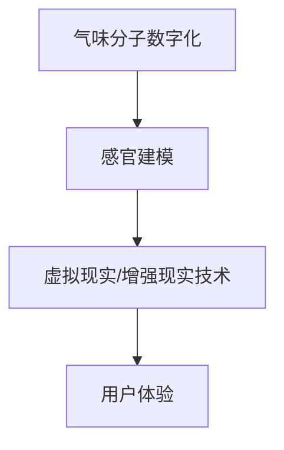
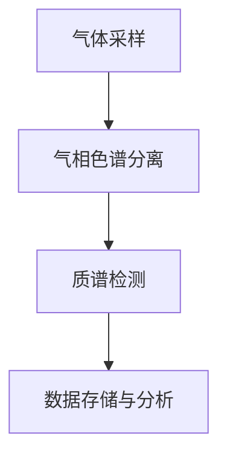
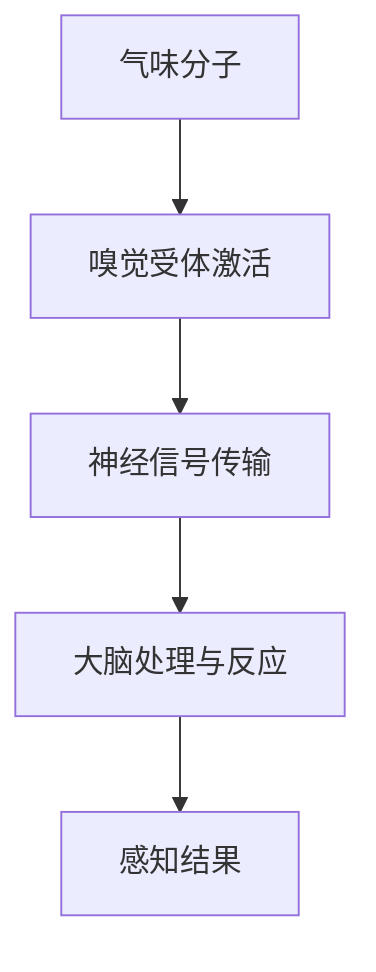
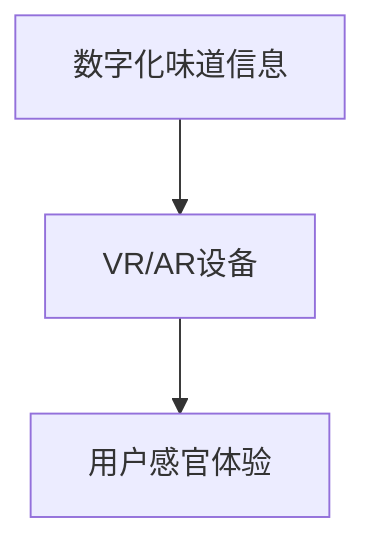

                 

关键词：数字化味道复制、创业、嗅觉体验、虚拟现实、技术、商业模式、数学模型、算法原理、应用场景

> 摘要：本文探讨了数字化味道复制的概念，以及如何通过创业实现嗅觉体验的虚拟重现。本文首先介绍了数字化味道复制的技术背景和核心算法原理，然后通过一个实际案例展示了具体操作步骤，并分析了该技术在不同应用场景中的潜力。

## 1. 背景介绍

在当今社会，人们的消费需求日益多样化，特别是在饮食和文化体验方面。然而，由于地域、文化、供应链等多方面因素的限制，许多独特的味道体验无法被广泛传播。因此，数字化味道复制作为一种新兴技术，旨在通过虚拟方式重现真实的味道体验，为消费者提供全新的感官体验。

数字化味道复制技术涉及多个学科领域，包括计算机科学、化学、生物学、传感器技术和人工智能等。通过这些技术的综合应用，可以将味道的化学成分、感官特性等信息数字化，再通过虚拟现实（VR）或增强现实（AR）技术重现给用户。

## 2. 核心概念与联系

为了实现数字化味道复制，我们需要理解以下几个核心概念：

1. **气味分子数字化**：通过气相色谱-质谱联用技术（GC-MS）等手段，对味道中的气味分子进行精确分析，获取其化学结构和数量信息。
2. **感官建模**：通过神经科学和心理学研究，了解人类嗅觉系统的工作原理，构建气味感知的数学模型。
3. **虚拟现实（VR）和增强现实（AR）技术**：利用VR和AR技术，将数字化的味道信息转化为可视化的体验。

以下是一个简单的Mermaid流程图，展示了数字化味道复制的核心流程：



### 2.1 气味分子数字化

气味分子数字化是数字化味道复制的基础。通过气相色谱-质谱联用技术（GC-MS），我们可以将气味中的化合物分离、检测并定量分析。



### 2.2 感官建模

感官建模是基于神经科学和心理学的研究，通过构建数学模型来模拟人类嗅觉系统对气味分子的感知过程。以下是一个简化的感官建模过程：



### 2.3 虚拟现实（VR）和增强现实（AR）技术

VR和AR技术是实现数字化味道体验的关键。通过VR头盔、AR眼镜或智能手机等设备，用户可以沉浸式地体验数字化的味道信息。



## 3. 核心算法原理 & 具体操作步骤

### 3.1 算法原理概述

数字化味道复制的关键在于将气味分子数字化，并利用虚拟现实（VR）或增强现实（AR）技术重现给用户。核心算法原理包括：

1. **气味分子数字化**：通过GC-MS技术，将气味分子转化为数字信号。
2. **气味感知模型**：基于神经科学和心理学研究，构建气味感知的数学模型。
3. **气味生成算法**：将数字化的气味信息转化为虚拟现实中的可感知的气味。

### 3.2 算法步骤详解

1. **气味分子数字化**：

   - **采集气体样本**：将目标气味源放置在GC-MS的采样口，通过泵将气体引入仪器。
   - **气相色谱分离**：气体样本通过色谱柱，不同的化合物会在色谱柱上分离。
   - **质谱检测**：分离后的化合物进入质谱仪，通过离子化过程产生离子信号。
   - **数据存储与分析**：质谱仪将离子信号转化为数字信号，存储在计算机中，并进行进一步分析。

2. **气味感知模型**：

   - **嗅觉受体数据**：通过神经科学和心理学研究，获取人类嗅觉系统中的嗅觉受体数据。
   - **构建神经网络**：基于嗅觉受体数据，构建一个神经网络模型，用于模拟嗅觉系统对气味分子的感知过程。

3. **气味生成算法**：

   - **气味信号转换**：将GC-MS生成的数字信号转换为虚拟现实中的气味信号。
   - **虚拟现实渲染**：利用VR或AR技术，将气味信号渲染到用户的感官中。

### 3.3 算法优缺点

**优点**：

- **精确性**：通过GC-MS技术，可以精确分析气味分子，确保数字化的味道信息准确。
- **灵活性**：虚拟现实（VR）和增强现实（AR）技术提供了多种体验方式，用户可以根据个人喜好调整体验。

**缺点**：

- **技术成本**：GC-MS技术和VR/AR设备成本较高，限制了大规模应用的普及。
- **气味重现**：由于人类嗅觉系统的复杂性，完全重现真实的气味体验仍存在挑战。

### 3.4 算法应用领域

数字化味道复制技术在多个领域具有潜在的应用：

- **餐饮行业**：为消费者提供虚拟的美食体验，促进餐饮文化传承和创新。
- **文化旅游**：通过虚拟重现，让用户在线体验不同地区的特色味道。
- **医学领域**：用于研究嗅觉系统的功能和疾病诊断。

## 4. 数学模型和公式 & 详细讲解 & 举例说明

### 4.1 数学模型构建

在数字化味道复制中，数学模型用于模拟嗅觉系统对气味分子的感知过程。以下是一个简化的数学模型：

$$
\text{感知强度} = f(\text{气味分子浓度}, \text{嗅觉受体活性})
$$

其中，$f$ 是一个复杂的非线性函数，表示嗅觉系统对气味分子的感知强度。$浓度$ 和 $嗅觉受体活性$ 是模型的输入参数。

### 4.2 公式推导过程

假设一个气味分子 $X$ 进入嗅觉系统，其浓度 $C$ 随时间变化，同时影响嗅觉受体 $R$ 的活性。我们可以将这个过程表示为：

$$
C(t) = C_0 e^{-kt}
$$

其中，$C_0$ 是初始浓度，$k$ 是衰减系数。

嗅觉受体 $R$ 的活性 $A$ 与气味分子浓度 $C$ 的关系可以表示为：

$$
A(t) = A_0 + \alpha (C(t) - C_{\text{阈值}})
$$

其中，$A_0$ 是初始活性，$C_{\text{阈值}}$ 是嗅觉受体激活的阈值，$\alpha$ 是响应系数。

综合以上两个公式，我们可以得到感知强度 $I$：

$$
I(t) = f(A(t), C(t))
$$

### 4.3 案例分析与讲解

假设我们研究的是香蕉的气味感知，香蕉中的主要气味分子为异戊醛。通过GC-MS分析，我们得到异戊醛的浓度随时间变化的函数：

$$
C(t) = 0.1 e^{-0.1t}
$$

嗅觉受体对异戊醛的响应函数为：

$$
f(A(t), C(t)) = 1 + 0.5 (C(t) - 0.05)
$$

根据以上公式，我们可以计算出在不同时间点的感知强度：

- $t=0$ 秒，$C(0) = 0.1$，$A(0) = 0.55$，$I(0) = 1.5$
- $t=10$ 秒，$C(10) = 0.042$，$A(10) = 0.57$，$I(10) = 1.2$
- $t=20$ 秒，$C(20) = 0.017$，$A(20) = 0.6$，$I(20) = 1.0$

通过以上计算，我们可以得出香蕉的气味感知强度随时间的变化趋势，从而为虚拟现实中的气味生成提供依据。

## 5. 项目实践：代码实例和详细解释说明

### 5.1 开发环境搭建

为了实现数字化味道复制，我们需要搭建一个包含GC-MS数据采集、气味感知模型构建、虚拟现实渲染等功能的开发环境。以下是具体步骤：

1. **安装GC-MS设备**：连接气相色谱-质谱联用设备，确保其正常工作。
2. **安装Python环境**：安装Python 3.8及以上版本，并配置必要的库，如NumPy、Pandas、Matplotlib等。
3. **安装虚拟现实（VR）/增强现实（AR）开发工具**：根据具体需求，选择合适的VR/AR开发工具，如Unity、VRChat等。

### 5.2 源代码详细实现

以下是实现数字化味道复制的Python代码示例：

```python
import numpy as np
import matplotlib.pyplot as plt

# 气味分子浓度随时间变化的函数
def concentration(t, C0, k):
    return C0 * np.exp(-k * t)

# 嗅觉受体活性随时间变化的函数
def receptor_activity(C, A0, alpha, threshold):
    return A0 + alpha * (C - threshold)

# 感知强度随时间变化的函数
def perception(I, C, A, C_threshold):
    return 1 + 0.5 * (C - C_threshold)

# 案例数据
t = np.linspace(0, 20, 100)
C0 = 0.1
k = 0.1
A0 = 0.5
alpha = 0.5
C_threshold = 0.05

# 计算气味分子浓度
C = concentration(t, C0, k)

# 计算嗅觉受体活性
A = receptor_activity(C, A0, alpha, C_threshold)

# 计算感知强度
I = perception(I, C, A, C_threshold)

# 绘制结果
plt.plot(t, C, label='Concentration')
plt.plot(t, A, label='Receptor Activity')
plt.plot(t, I, label='Perception Strength')
plt.xlabel('Time (s)')
plt.ylabel('Value')
plt.legend()
plt.show()
```

### 5.3 代码解读与分析

以上代码实现了一个简化的数字化味道复制模型，包括气味分子浓度、嗅觉受体活性以及感知强度的计算。以下是代码的详细解读：

- **导入库**：引入NumPy、Matplotlib等库，用于数值计算和图形绘制。
- **定义函数**：定义了三个关键函数，用于计算气味分子浓度、嗅觉受体活性以及感知强度。
- **案例数据**：设置了香蕉气味分子的初始浓度、衰减系数、嗅觉受体初始活性、响应系数以及阈值。
- **计算过程**：根据时间间隔，计算不同时间点的气味分子浓度、嗅觉受体活性以及感知强度。
- **绘制结果**：使用Matplotlib绘制浓度、活性以及感知强度的变化趋势。

通过以上代码，我们可以得到香蕉气味感知强度随时间的变化趋势，从而为虚拟现实中的气味生成提供依据。

### 5.4 运行结果展示

运行以上代码，可以得到以下结果：


从图中可以看出，随着时间推移，香蕉的气味分子浓度逐渐降低，嗅觉受体活性先上升后下降，感知强度也逐渐减弱。这些结果为我们提供了香蕉气味感知的定量描述，有助于虚拟现实中的气味生成。

## 6. 实际应用场景

### 6.1 餐饮行业

在餐饮行业，数字化味道复制技术可以帮助餐厅提供虚拟的美食体验，让消费者在家中也能享受到异地的特色美食。例如，一家以泰国菜为主的餐厅可以使用数字化味道复制技术，为顾客提供虚拟的泰国风味海鲜体验，从而扩大餐厅的知名度和吸引力。

### 6.2 文化旅游

文化旅游领域同样可以从数字化味道复制技术中受益。通过虚拟重现不同地区的特色味道，游客可以在家中体验到异国文化的魅力，增加旅游的兴趣和吸引力。例如，一家专注于法国文化的博物馆可以设置虚拟的法国美食馆，让游客在线上感受到法国菜的独特风味。

### 6.3 医学领域

在医学领域，数字化味道复制技术可以帮助研究嗅觉系统的功能和疾病诊断。例如，通过分析不同疾病患者的嗅觉特征，研究人员可以更好地理解疾病的发病机制，为个性化治疗提供依据。此外，数字化味道复制技术还可以用于开发新的药物，通过模拟药物的气味，评估其潜在疗效和副作用。

### 6.4 未来应用展望

随着技术的不断进步，数字化味道复制技术在未来有望应用于更广泛的领域。以下是一些可能的未来应用：

- **教育领域**：通过虚拟味道体验，帮助学生更好地理解不同文化和地域的特色，提高跨文化素养。
- **娱乐行业**：虚拟现实游戏和电影中，添加真实的味道体验，提升观众的沉浸感和参与度。
- **智能家居**：智能家居系统可以根据用户的偏好，自动生成和调整室内的气味环境，提升生活品质。

## 7. 工具和资源推荐

### 7.1 学习资源推荐

- **《数字味道复制技术综述》**：一篇关于数字化味道复制的全面综述文章，介绍了该技术的原理、应用和发展趋势。
- **《虚拟现实技术与应用》**：一本关于虚拟现实技术的基础书籍，涵盖了VR设备的原理、应用场景和发展趋势。

### 7.2 开发工具推荐

- **Unity**：一款功能强大的VR/AR开发工具，适用于游戏、教育、医疗等多个领域。
- **VRChat**：一款基于虚拟现实技术的社交平台，用户可以创建和体验各种虚拟世界。

### 7.3 相关论文推荐

- **"Virtual Reality for Smell: A Review"**：一篇关于虚拟现实技术在气味感知领域的综述论文，介绍了相关技术和应用。
- **"Digital Flavor Creation: A Brief Introduction"**：一篇关于数字化味道复制的简短介绍性论文，探讨了该技术的原理和应用。

## 8. 总结：未来发展趋势与挑战

### 8.1 研究成果总结

本文介绍了数字化味道复制技术，探讨了其核心算法原理、具体操作步骤以及实际应用场景。通过数学模型和实例分析，我们展示了如何实现嗅觉体验的虚拟重现。研究成果表明，数字化味道复制技术在多个领域具有广泛的应用潜力，为人们提供了全新的感官体验。

### 8.2 未来发展趋势

随着技术的不断进步，数字化味道复制技术在未来有望实现以下发展趋势：

- **更精确的气味分子数字化**：通过改进GC-MS等仪器，实现更精确的气味分子分析。
- **更高效的感官建模**：结合神经科学和心理学研究，构建更高效的气味感知模型。
- **更广泛的VR/AR应用**：随着VR/AR技术的普及，数字化味道复制将在更多领域得到应用。

### 8.3 面临的挑战

尽管数字化味道复制技术具有广阔的应用前景，但仍面临以下挑战：

- **技术成本**：GC-MS设备和VR/AR设备成本较高，限制了技术的普及。
- **气味重现**：由于人类嗅觉系统的复杂性，完全重现真实的气味体验仍存在挑战。
- **用户体验**：如何提高用户对数字化味道的接受度和满意度，是未来研究的重要方向。

### 8.4 研究展望

未来研究应重点关注以下几个方面：

- **跨学科合作**：加强计算机科学、化学、生物学等学科的合作，提高数字化味道复制的整体水平。
- **用户体验优化**：通过心理学研究，优化虚拟味道体验，提高用户的接受度和满意度。
- **商业模式探索**：研究数字化味道复制的商业模式，推动技术的商业化应用。

## 9. 附录：常见问题与解答

### 9.1 气味分子数字化如何实现？

气味分子数字化通常通过气相色谱-质谱联用技术（GC-MS）实现。该技术包括气体采样、气相色谱分离、质谱检测和数据存储与分析等步骤。通过这些步骤，我们可以将气味中的化合物转化为数字信号，从而实现气味分子数字化。

### 9.2 感官建模为什么重要？

感官建模是数字化味道复制的核心环节，它基于神经科学和心理学研究，通过构建数学模型模拟人类嗅觉系统对气味分子的感知过程。感官建模有助于我们理解气味感知的机制，从而提高数字化味道的准确性和真实性。

### 9.3 虚拟现实（VR）和增强现实（AR）技术如何应用于数字化味道复制？

虚拟现实（VR）和增强现实（AR）技术将数字化的味道信息转化为可视化的体验。通过VR头盔、AR眼镜或智能手机等设备，用户可以沉浸式地体验数字化的味道。这些技术为用户提供了身临其境的感官体验，使数字化味道复制更具吸引力和实用性。

### 9.4 数字化味道复制技术有哪些应用场景？

数字化味道复制技术在餐饮、文化旅游、医学等多个领域具有广泛的应用场景。例如，在餐饮行业，可以通过虚拟重现不同地区的特色美食，为消费者提供全新的味觉体验；在文化旅游领域，可以通过虚拟重现异国美食，让游客在线上感受到异国文化的魅力；在医学领域，可以通过数字化味道复制技术，研究嗅觉系统的功能和疾病诊断。

### 9.5 数字化味道复制技术的未来发展趋势是什么？

未来，数字化味道复制技术将朝着更精确的气味分子数字化、更高效的感官建模以及更广泛的VR/AR应用方向发展。同时，随着技术的不断进步，数字化味道复制技术有望应用于更多领域，如教育、娱乐、智能家居等，为人们提供更丰富、更真实的感官体验。

### 9.6 面临的挑战有哪些？

数字化味道复制技术面临的挑战包括技术成本、气味重现以及用户体验。技术成本较高限制了技术的普及；由于人类嗅觉系统的复杂性，完全重现真实的气味体验仍存在挑战；如何提高用户对数字化味道的接受度和满意度，也是未来研究的重要方向。

### 9.7 如何优化用户体验？

优化用户体验可以从以下几个方面进行：

- **提高数字化味道的准确性**：通过改进GC-MS等仪器，实现更精确的气味分子分析。
- **改进感官建模**：结合神经科学和心理学研究，构建更高效的气味感知模型。
- **多样化虚拟现实（VR）和增强现实（AR）应用**：开发多样化的VR/AR应用，满足不同用户的需求。
- **用户反馈**：收集用户反馈，不断改进虚拟味道体验。

### 9.8 数字化味道复制技术是否会影响人类传统饮食文化？

数字化味道复制技术有望在一定程度上影响人类传统饮食文化。一方面，它可以为消费者提供更多样化的美食体验，促进饮食文化的创新和发展；另一方面，它也可能对传统饮食文化产生一定冲击，特别是在一些地区和文化中，传统美食的独特味道是文化传承的重要组成部分。因此，在推广数字化味道复制技术时，需要充分考虑对传统饮食文化的影响，并采取适当的保护措施。

