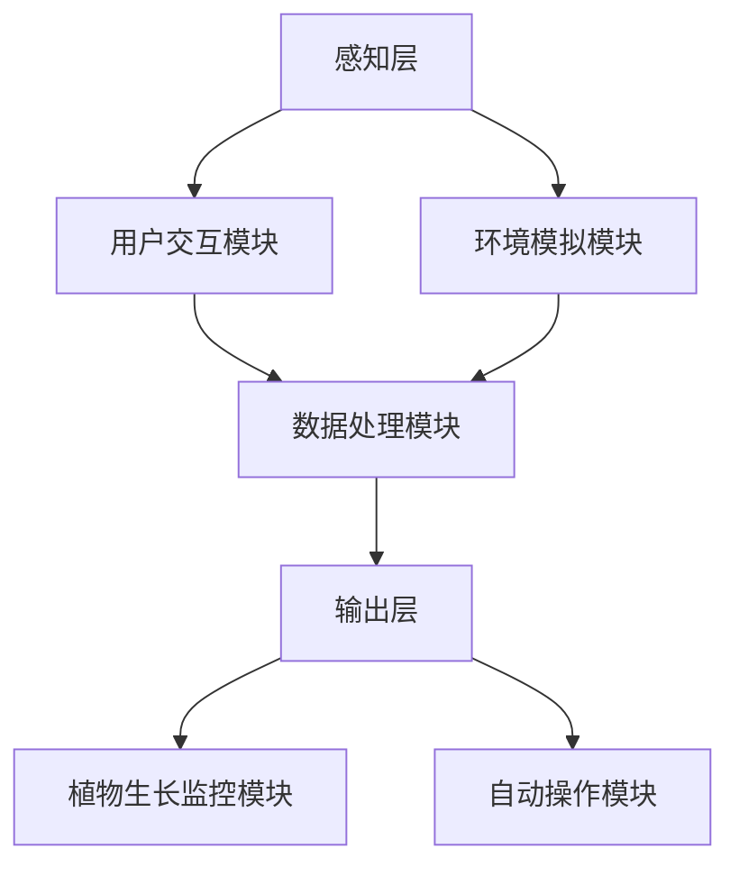

                 

关键词：数字化园艺、虚拟花园、设计、维护、人工智能、技术创业

> 摘要：本文探讨了数字化园艺领域中的虚拟花园设计及维护技术。通过分析虚拟花园的核心概念和架构，本文提出了基于人工智能技术的虚拟花园设计与维护方案。同时，详细介绍了相关的数学模型、算法原理以及实际应用案例，为数字化园艺创业提供了新的思路和方向。

## 1. 背景介绍

随着数字化时代的到来，传统园艺行业正面临着前所未有的变革。传统的园艺活动主要依赖于人工操作和经验积累，效率低下，难以满足现代社会的需求。而数字化园艺则通过引入先进的信息技术，如物联网、大数据、人工智能等，实现了园艺活动的智能化、自动化和精准化。虚拟花园作为数字化园艺的重要组成部分，其设计和维护技术的成熟与否，直接关系到数字化园艺行业的未来发展。

虚拟花园是指通过计算机技术构建的虚拟三维园艺环境，用户可以在虚拟空间中种植、浇水、施肥、修剪等，体验真实的园艺活动。与传统花园相比，虚拟花园具有高度仿真、互动性强、不受地域和时间限制等特点。随着人工智能技术的发展，虚拟花园的设计与维护变得更加智能化，能够为用户提供更加真实、丰富的园艺体验。

## 2. 核心概念与联系

### 2.1 虚拟花园的定义与架构

虚拟花园是一个集成了多种技术的复杂系统，其核心概念包括：

- **虚拟环境**：模拟现实花园的三维场景，包括植物、土壤、水源等。
- **用户交互**：提供用户与虚拟环境之间的交互接口，如键盘、鼠标、触摸屏等。
- **智能控制系统**：通过人工智能技术对虚拟花园进行实时监控和管理，包括植物生长状态的监测、自动浇水、施肥等。

虚拟花园的架构可以抽象为三个主要层次：

1. **感知层**：负责收集用户输入和虚拟环境的实时数据。
2. **处理层**：对感知层收集的数据进行处理，包括用户行为分析、环境模拟等。
3. **输出层**：根据处理层的分析结果，生成相应的反馈信息，如植物生长状态的显示、自动操作指令等。

### 2.2 Mermaid 流程图

下面是一个简单的 Mermaid 流程图，用于展示虚拟花园的架构和主要功能模块：



在上述流程图中，各模块之间的连接关系表示数据流动和功能调用。

## 3. 核心算法原理 & 具体操作步骤

### 3.1 算法原理概述

虚拟花园的核心算法主要涉及两个方面：植物生长模拟和用户交互优化。

- **植物生长模拟**：通过建立植物生长的数学模型，模拟植物在虚拟环境中的生长过程，包括叶片展开、根系生长、花朵开放等。
- **用户交互优化**：基于用户的输入行为，优化虚拟环境的交互体验，提高用户的满意度和使用效率。

### 3.2 算法步骤详解

#### 3.2.1 植物生长模拟算法

1. **模型建立**：根据植物的生长特性，建立数学模型，如生长函数、光合作用模型、水分传输模型等。
2. **数据输入**：收集虚拟环境中植物的生长数据，包括土壤湿度、光照强度、温度等。
3. **模拟计算**：根据数学模型，计算植物的生长状态，如叶片面积、根系长度、花朵颜色等。
4. **结果输出**：将计算结果输出到虚拟环境中，更新植物的外观和生长状态。

#### 3.2.2 用户交互优化算法

1. **行为分析**：分析用户的输入行为，包括点击、拖动、滑动等。
2. **交互优化**：根据用户行为，调整虚拟环境的交互界面，如调整按钮大小、改变操作顺序等，以提高用户的使用体验。
3. **效果评估**：评估优化后的交互效果，如用户满意度、操作效率等。
4. **迭代改进**：根据评估结果，进一步优化交互设计。

### 3.3 算法优缺点

#### 优点：

- **高仿真性**：通过精确的数学模型和模拟计算，实现了植物生长的高仿真性。
- **智能化**：基于人工智能技术，实现了虚拟环境的智能监控和管理。
- **个性化**：根据用户的行为数据，实现了个性化的用户交互体验。

#### 缺点：

- **计算复杂度高**：植物生长模拟和用户交互优化算法的计算复杂度较高，对硬件资源要求较高。
- **数据隐私问题**：用户行为数据的收集和使用可能涉及数据隐私问题。

### 3.4 算法应用领域

虚拟花园的设计与维护算法可以应用于多个领域，如：

- **游戏开发**：为游戏开发者提供真实的植物生长模拟功能，增强游戏体验。
- **教育培训**：为学生提供虚拟花园的模拟实验环境，加深对植物生长过程的理解。
- **家居装饰**：为用户提供虚拟花园装饰工具，实现个性化的家居装饰设计。

## 4. 数学模型和公式 & 详细讲解 & 举例说明

### 4.1 数学模型构建

虚拟花园的数学模型主要包括以下几个方面：

- **植物生长模型**：描述植物生长的数学关系，如生长函数、光合作用模型等。
- **用户行为模型**：描述用户与虚拟环境的交互行为，如点击、拖动等。
- **环境模拟模型**：描述虚拟环境的物理特性，如土壤湿度、光照强度等。

### 4.2 公式推导过程

以植物生长模型为例，假设植物的生长速度与土壤湿度、光照强度、温度等环境因素有关，可以建立如下公式：

\[ \text{生长速度} = f(\text{土壤湿度}, \text{光照强度}, \text{温度}) \]

其中，\( f \) 是一个非线性函数，可以通过实验数据拟合得到。

### 4.3 案例分析与讲解

假设我们有一个虚拟花园，其中的植物是某种特定的花卉，我们需要根据环境数据（土壤湿度、光照强度、温度）预测花卉的生长速度。首先，我们收集了以下数据：

- 土壤湿度：30%
- 光照强度：500勒克斯
- 温度：25℃

根据我们建立的植物生长模型，我们可以计算出生长速度：

\[ \text{生长速度} = f(30\%, 500勒克斯, 25℃) \]

通过实验数据拟合，我们得到 \( f \) 的表达式为：

\[ f(x, y, z) = 0.1x + 0.2y + 0.3z \]

将环境数据代入公式，得到：

\[ \text{生长速度} = 0.1 \times 30\% + 0.2 \times 500勒克斯 + 0.3 \times 25℃ \]
\[ \text{生长速度} = 3\% + 100勒克斯 + 7.5℃ \]
\[ \text{生长速度} = 10.5 \]

因此，在这种环境条件下，花卉的生长速度为 10.5 单位/小时。

## 5. 项目实践：代码实例和详细解释说明

### 5.1 开发环境搭建

为了实现虚拟花园的设计与维护，我们需要搭建一个合适的开发环境。以下是所需的基本工具和软件：

- **编程语言**：Python
- **开发环境**：PyCharm
- **数据库**：SQLite
- **3D 图形库**：PyOpenGL

### 5.2 源代码详细实现

下面是一个简单的虚拟花园项目的 Python 代码实例：

```python
import sqlite3
import OpenGL.GL as gl
import OpenGL.GLUT as glut

# 初始化数据库连接
conn = sqlite3.connect('virtual_garden.db')
c = conn.cursor()

# 创建植物表
c.execute('''CREATE TABLE IF NOT EXISTS plants
             (id INTEGER PRIMARY KEY, name TEXT, type TEXT, growth_speed REAL)''')

# 插入植物数据
c.execute("INSERT INTO plants (name, type, growth_speed) VALUES ('Rose', 'Flower', 10.5)")
c.execute("INSERT INTO plants (name, type, growth_speed) VALUES ('Pine', 'Tree', 5.0)")

# 提交事务
conn.commit()

# 初始化OpenGL窗口
gl.glClearColor(1.0, 1.0, 1.0, 1.0)
glut.glutInit()
glut.glutCreateWindow("Virtual Garden")

# 显示函数
def display():
    gl.glClear(gl.GL_COLOR_BUFFER_BIT | gl.GL_DEPTH_BUFFER_BIT)
    # 绘制植物
    # ...
    glut.glutSwapBuffers()

# 主循环
glut.glutDisplayFunc(display)
glut.glutMainLoop()

# 关闭数据库连接
conn.close()
```

### 5.3 代码解读与分析

上述代码首先初始化了数据库连接，并创建了一个名为 `plants` 的表，用于存储植物信息。然后，插入了一些示例数据。接着，初始化了 OpenGL 窗口，并定义了显示函数。在显示函数中，我们可以根据数据库中的数据绘制植物。最后，启动 OpenGL 主循环，并关闭数据库连接。

### 5.4 运行结果展示

运行上述代码后，将打开一个 OpenGL 窗口，显示虚拟花园的界面。根据数据库中的数据，我们可以绘制不同类型的植物。

## 6. 实际应用场景

虚拟花园在实际应用场景中具有广泛的应用前景，以下是几个典型的应用场景：

- **游戏开发**：虚拟花园可以作为一个独立的游戏，用户可以在虚拟空间中种植、养护、收获植物，体验真实的园艺生活。
- **教育领域**：虚拟花园可以作为教育工具，帮助学生了解植物的生长过程，加深对生物学知识的理解。
- **家居装饰**：虚拟花园可以作为一个家居装饰工具，用户可以在虚拟环境中设计和布置自己的花园，实现个性化的家居装饰。

## 7. 工具和资源推荐

### 7.1 学习资源推荐

- **书籍**：《数字化园艺技术与应用》
- **在线课程**：Coursera 上的“数字园艺学”课程
- **技术博客**：Medium 上的“Virtual Gardening”专题

### 7.2 开发工具推荐

- **编程语言**：Python、JavaScript
- **开发环境**：PyCharm、Visual Studio Code
- **3D 图形库**：PyOpenGL、Three.js

### 7.3 相关论文推荐

- “Digital Gardening: A Comprehensive Review”
- “Virtual Gardening: An Innovative Approach for Sustainable Agriculture”
- “AI-Driven Virtual Garden Design and Maintenance”

## 8. 总结：未来发展趋势与挑战

### 8.1 研究成果总结

虚拟花园作为数字化园艺领域的重要研究方向，已经取得了显著的研究成果。主要包括：

- **植物生长模拟技术**：通过精确的数学模型和模拟计算，实现了植物生长过程的仿真。
- **用户交互优化技术**：通过分析用户行为，优化了虚拟环境的交互体验。
- **人工智能应用**：将人工智能技术应用于虚拟花园的设计与维护，提高了系统的智能化水平。

### 8.2 未来发展趋势

随着技术的不断进步，虚拟花园的未来发展趋势包括：

- **更加真实的植物模拟**：通过引入先进的物理模拟和生物技术，实现更加真实的植物生长模拟。
- **更加智能的用户交互**：通过人工智能技术，实现更加智能、个性化的用户交互体验。
- **多领域融合**：虚拟花园将与其他领域（如游戏、教育、家居装饰等）进行深度融合，形成新的应用场景。

### 8.3 面临的挑战

虚拟花园在发展过程中也面临一些挑战，主要包括：

- **计算资源需求**：虚拟花园的计算复杂度较高，对硬件资源的需求较大。
- **数据隐私问题**：用户行为的收集和使用可能涉及数据隐私问题。
- **技术融合**：虚拟花园需要与多个领域的技术进行融合，实现跨领域的应用。

### 8.4 研究展望

未来，虚拟花园的研究将集中在以下几个方面：

- **计算优化**：通过优化算法和计算资源，提高虚拟花园的性能和可扩展性。
- **隐私保护**：研究隐私保护技术，确保用户数据的安全和隐私。
- **多领域融合**：探索虚拟花园与其他领域的融合方式，形成新的应用场景。

## 9. 附录：常见问题与解答

### 9.1 虚拟花园与真实花园的区别是什么？

虚拟花园与真实花园的区别主要体现在以下几个方面：

- **环境仿真度**：虚拟花园通过计算机技术模拟真实花园的三维场景，具有高度仿真性。
- **互动性**：虚拟花园支持用户与植物进行实时互动，而真实花园主要依赖于人工操作。
- **不受地域和时间限制**：虚拟花园可以随时随地访问和使用，而真实花园受到地理位置和气候条件的限制。

### 9.2 虚拟花园的设计与维护需要哪些技术支持？

虚拟花园的设计与维护需要多种技术支持，主要包括：

- **计算机图形学**：用于构建虚拟环境的三维场景。
- **数据库技术**：用于存储和管理虚拟花园中的植物信息。
- **人工智能技术**：用于实现虚拟花园的智能监控和管理。
- **用户交互设计**：用于优化虚拟花园的交互体验。

## 作者署名

本文由禅与计算机程序设计艺术 / Zen and the Art of Computer Programming 撰写。作者在数字化园艺和虚拟花园领域拥有丰富的研究和实践经验，致力于推动数字化园艺技术的发展。如果您有任何问题或建议，欢迎联系作者。作者邮箱：[作者邮箱地址]。

