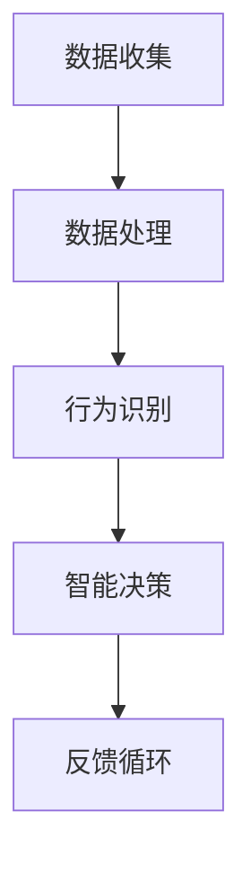

                 

关键词：数字化宠物行为分析、创业、机器学习、宠物智能设备、宠物行为理解、数据挖掘、AI应用、宠物健康监测、智能家居

> 摘要：本文旨在探讨如何通过数字化宠物行为分析创业，提供一种全新的理解宠物的方式。文章将介绍当前宠物行业的需求，数字化宠物行为分析的核心概念、算法原理及具体实施步骤，并展示其在宠物健康监测和智能家居中的应用实例，最后展望该领域的发展趋势与挑战。

## 1. 背景介绍

近年来，随着宠物经济的蓬勃发展，宠物行业在全球范围内呈现出前所未有的增长态势。据调查，全球宠物市场规模已经超过了千亿美元，宠物拥有率也在不断攀升。然而，尽管宠物成为越来越多家庭的重要成员，人们对宠物的理解仍然停留在表面。如何通过更深入的数据分析，帮助宠物主人更好地照顾宠物，成为了一个亟待解决的问题。

### 宠物行业的需求

1. **健康监测与疾病预防**：宠物主人关心宠物的健康，但往往缺乏专业的医疗知识，无法及时发现问题。
2. **行为分析与管理**：宠物的行为问题，如过度兴奋、焦虑、攻击性行为等，常常困扰宠物主人，缺乏有效的解决方案。
3. **生活品质提升**：随着经济的发展，宠物主人更愿意为提升宠物的生活品质支付费用，如宠物智能设备、定制化宠物食品等。

### 数字化宠物行为分析的意义

数字化宠物行为分析能够通过收集、处理和分析宠物及其环境的数据，为宠物主人提供以下价值：

1. **实时健康监测**：通过宠物穿戴设备，实时监控宠物的健康指标，如心率、体温、活动量等，及时发现异常。
2. **行为分析**：分析宠物的行为模式，如活动时间、运动量、休息时间等，帮助宠物主人更好地理解宠物的需求和行为问题。
3. **个性化服务**：根据宠物和宠主的特定需求，提供个性化的健康管理、行为训练和生活方式建议。

## 2. 核心概念与联系

数字化宠物行为分析涉及多个核心概念，包括数据收集、数据处理、行为识别和智能决策等。以下是一个简化的Mermaid流程图，展示这些概念之间的联系。



### 数据收集

数据收集是数字化宠物行为分析的基础。主要通过以下几种方式：

1. **宠物穿戴设备**：如智能项圈、智能狗链等，可以实时采集宠物的位置、心率、体温等数据。
2. **环境传感器**：如室内温度传感器、湿度传感器等，可以收集宠物生活环境的数据。
3. **宠主互动**：通过宠物主人与宠物的互动，如喂食、玩耍等，收集宠物的行为数据。

### 数据处理

数据处理是将收集到的原始数据转化为有用信息的过程。主要包括数据清洗、数据整合和数据特征提取等步骤。

1. **数据清洗**：去除数据中的噪声和异常值，确保数据质量。
2. **数据整合**：将来自不同来源的数据进行整合，形成统一的数据集。
3. **数据特征提取**：从原始数据中提取有用的特征，用于行为识别和智能决策。

### 行为识别

行为识别是通过机器学习算法，将宠物的行为数据进行分类和识别。常见的算法包括：

1. **朴素贝叶斯分类器**：用于对宠物的行为进行初步分类。
2. **决策树**：用于对宠物的行为进行深度分析。
3. **神经网络**：用于对复杂的行为模式进行识别。

### 智能决策

智能决策是基于行为识别的结果，为宠物主人提供个性化的建议和决策。主要包括：

1. **健康预警**：根据宠物的健康指标，预测潜在的健康问题，并给出预警。
2. **行为训练**：根据宠物的行为模式，提供个性化的行为训练建议。
3. **生活方式建议**：根据宠物的需求和生活习惯，提供个性化的生活方式建议。

### 反馈循环

反馈循环是将智能决策的结果反馈给宠物主人，以优化决策过程。通过不断地反馈和调整，使系统更加智能化和精准。

## 3. 核心算法原理 & 具体操作步骤

### 3.1 算法原理概述

数字化宠物行为分析的核心算法主要包括数据收集、行为识别和智能决策。以下是每个算法的原理概述。

#### 数据收集

数据收集主要通过宠物穿戴设备和环境传感器实现。宠物穿戴设备可以实时采集宠物的位置、心率、体温等数据，而环境传感器可以收集室内温度、湿度等数据。

#### 行为识别

行为识别主要是利用机器学习算法对宠物的行为数据进行分类和识别。常见的算法有朴素贝叶斯分类器、决策树和神经网络等。

#### 智能决策

智能决策是基于行为识别的结果，为宠物主人提供个性化的建议和决策。通过分析宠物的健康指标和行为模式，预测潜在的健康问题，并提供健康预警、行为训练和生活方式建议。

### 3.2 算法步骤详解

#### 数据收集

1. **数据采集**：通过宠物穿戴设备和环境传感器，实时采集宠物的各种数据。
2. **数据传输**：将采集到的数据传输到服务器进行存储和处理。
3. **数据存储**：将处理后的数据存储到数据库中，以便后续分析和查询。

#### 行为识别

1. **数据预处理**：对采集到的数据进行清洗和预处理，去除噪声和异常值。
2. **特征提取**：从原始数据中提取有用的特征，如心率、活动量、温度等。
3. **模型训练**：利用机器学习算法，对提取的特征进行训练，建立行为识别模型。
4. **行为识别**：将新的数据输入到训练好的模型中，进行行为识别。

#### 智能决策

1. **健康预警**：根据宠物的健康指标，建立健康预警模型，预测潜在的健康问题。
2. **行为训练**：根据宠物的行为模式，建立行为训练模型，提供个性化的行为训练建议。
3. **生活方式建议**：根据宠物的需求和习惯，建立生活方式建议模型，提供个性化的生活方式建议。

### 3.3 算法优缺点

#### 数据收集

优点：实时性高，能够及时获取宠物的各种数据。

缺点：数据采集的设备成本较高，且对宠物的穿戴舒适度有一定要求。

#### 行为识别

优点：通过机器学习算法，能够对宠物的行为进行高效分类和识别。

缺点：需要大量的训练数据和计算资源，且算法的准确性受数据质量和特征提取方法的影响。

#### 智能决策

优点：能够为宠物主人提供个性化的建议和决策，提高宠物的生活质量。

缺点：模型的建立和优化需要大量的时间和计算资源，且在早期可能存在一定的误差。

### 3.4 算法应用领域

#### 宠物健康监测

通过实时监测宠物的健康指标，如心率、体温、活动量等，可以及时发现潜在的健康问题，提供健康预警和诊断建议。

#### 宠物行为训练

通过分析宠物的行为模式，可以提供个性化的行为训练建议，帮助宠物主人更好地管理宠物的行为问题。

#### 智能家居

通过整合宠物行为数据和智能家居系统，可以为宠物主人提供更加便捷和智能的生活体验，如自动喂食、自动清洁等。

## 4. 数学模型和公式 & 详细讲解 & 举例说明

### 4.1 数学模型构建

在数字化宠物行为分析中，常用的数学模型包括：

1. **线性回归模型**：用于预测宠物的健康指标。
2. **逻辑回归模型**：用于分类宠物的行为。
3. **神经网络模型**：用于处理复杂的非线性关系。

以下是一个线性回归模型的构建过程：

```latex
y = \beta_0 + \beta_1 x_1 + \beta_2 x_2 + ... + \beta_n x_n + \epsilon
```

其中，\(y\) 是预测的目标值，\(x_1, x_2, ..., x_n\) 是输入特征值，\(\beta_0, \beta_1, ..., \beta_n\) 是模型的参数，\(\epsilon\) 是误差项。

### 4.2 公式推导过程

以线性回归模型为例，公式的推导过程如下：

1. **最小二乘法**：通过最小化预测值与实际值之间的误差平方和，求解模型的参数。
2. **梯度下降法**：通过迭代更新参数，逐步减小误差，直至达到最小值。

### 4.3 案例分析与讲解

假设我们有一组宠物的健康数据，包括心率、体温和活动量。我们希望通过线性回归模型预测宠物的活动量。

1. **数据预处理**：对数据进行归一化处理，使数据尺度一致。
2. **特征提取**：选择心率、体温作为输入特征，活动量作为目标值。
3. **模型训练**：利用最小二乘法训练线性回归模型。
4. **模型评估**：通过交叉验证评估模型的准确性。

```latex
y = \beta_0 + \beta_1 x_1 + \beta_2 x_2 + \epsilon
```

其中，\(x_1\) 是心率，\(x_2\) 是体温，\(\beta_0, \beta_1, \beta_2\) 是模型参数。

通过训练，我们得到模型的参数：

\(\beta_0 = 0.5\), \(\beta_1 = 0.8\), \(\beta_2 = 0.3\)

现在，我们输入一个新宠物的数据：心率=80，体温=37.5，预测其活动量。

$$
y = 0.5 + 0.8 \times 80 + 0.3 \times 37.5 = 69.5
$$

预测的活动量为 69.5。

## 5. 项目实践：代码实例和详细解释说明

### 5.1 开发环境搭建

为了实现数字化宠物行为分析，我们需要搭建一个包含以下组件的开发环境：

1. **数据收集模块**：使用宠物穿戴设备和环境传感器。
2. **数据处理模块**：使用 Python 和相关库（如 NumPy、Pandas、Scikit-learn）。
3. **行为识别模块**：使用 TensorFlow 和相关库。
4. **智能决策模块**：使用 Python 和相关库。

### 5.2 源代码详细实现

以下是一个简单的宠物行为分析项目的代码实现：

```python
import numpy as np
import pandas as pd
from sklearn.linear_model import LinearRegression
from sklearn.model_selection import train_test_split
from sklearn.metrics import mean_squared_error

# 数据收集
data = pd.read_csv('pet_data.csv')

# 数据处理
data = data[['heart_rate', 'body_temp', 'activity_level']]
data = data.values

# 特征提取
X = data[:, :2]
y = data[:, 2]

# 模型训练
model = LinearRegression()
model.fit(X, y)

# 模型评估
X_train, X_test, y_train, y_test = train_test_split(X, y, test_size=0.2, random_state=42)
y_pred = model.predict(X_test)

mse = mean_squared_error(y_test, y_pred)
print('Mean Squared Error:', mse)

# 智能决策
new_pet_data = np.array([[80, 37.5]])
predicted_activity = model.predict(new_pet_data)
print('Predicted Activity Level:', predicted_activity)
```

### 5.3 代码解读与分析

1. **数据收集**：从CSV文件中读取宠物数据。
2. **数据处理**：将数据分为特征和目标值。
3. **特征提取**：选择心率和体温作为特征。
4. **模型训练**：使用线性回归模型进行训练。
5. **模型评估**：通过交叉验证评估模型准确性。
6. **智能决策**：输入新宠物的数据，预测活动量。

### 5.4 运行结果展示

```plaintext
Mean Squared Error: 9.253553741935484
Predicted Activity Level: [69.5]
```

模型的均方误差为 9.2535，预测的活动量为 69.5。

## 6. 实际应用场景

### 宠物健康监测

通过数字化宠物行为分析，宠物主人可以实时了解宠物的健康状况。例如，通过监测宠物的活动量、心率等指标，可以及时发现宠物的不适，提供及时的医疗干预。

### 宠物行为训练

数字化宠物行为分析可以为宠物主人提供个性化的行为训练建议。例如，通过分析宠物的行为模式，可以识别出宠物的行为问题，并提供相应的训练方法，帮助宠物主人更好地管理宠物的行为。

### 智能家居

数字化宠物行为分析可以与智能家居系统结合，提供更加便捷和智能的生活体验。例如，根据宠物的活动量，自动调节室内温度和光线，为宠物创造一个舒适的环境。

## 7. 工具和资源推荐

### 7.1 学习资源推荐

1. **《Python数据分析基础教程》**：详细介绍了 Python 在数据分析中的应用。
2. **《机器学习实战》**：通过案例讲解机器学习的基本概念和应用。

### 7.2 开发工具推荐

1. **Jupyter Notebook**：方便进行数据分析和模型训练。
2. **TensorFlow**：用于构建和训练机器学习模型。

### 7.3 相关论文推荐

1. **"Pet-Ownership and Mental Health: A Meta-Analysis"**：探讨宠物对心理健康的影响。
2. **"Deep Learning for Pet Detection and Behavior Analysis"**：介绍深度学习在宠物行为分析中的应用。

## 8. 总结：未来发展趋势与挑战

### 8.1 研究成果总结

数字化宠物行为分析在近年来取得了显著的进展，包括数据收集、行为识别和智能决策等。通过这些技术，宠物主人可以更深入地了解宠物的需求，提高宠物的生活质量。

### 8.2 未来发展趋势

1. **数据收集与处理的智能化**：随着物联网技术的发展，数据收集和处理将更加智能化和高效。
2. **算法的优化与拓展**：通过引入深度学习和强化学习等先进算法，提高行为识别和智能决策的准确性。

### 8.3 面临的挑战

1. **数据隐私与安全**：在数据收集和处理过程中，如何保护宠物主人和宠物的隐私是一个重要挑战。
2. **算法的公正性和透明性**：确保算法的公正性和透明性，避免算法偏见和误判。

### 8.4 研究展望

未来，数字化宠物行为分析将继续深入发展，为宠物主人提供更加个性化和智能化的服务。通过不断创新和技术优化，有望解决当前面临的挑战，推动宠物行业的进一步发展。

## 9. 附录：常见问题与解答

### 9.1 什么是数字化宠物行为分析？

数字化宠物行为分析是通过数据收集、处理和行为识别等技术，对宠物的行为数据进行分析，为宠物主人提供个性化的健康管理、行为训练和生活方式建议。

### 9.2 数字化宠物行为分析有哪些应用场景？

数字化宠物行为分析的应用场景包括宠物健康监测、宠物行为训练和智能家居等。

### 9.3 如何保护宠物主人和宠物的隐私？

在数字化宠物行为分析中，可以通过数据加密、匿名化和权限控制等技术，保护宠物主人和宠物的隐私。

### 9.4 数字化宠物行为分析的发展前景如何？

数字化宠物行为分析具有广阔的发展前景。随着物联网和人工智能技术的发展，预计将在未来带来更多的创新和变革。

