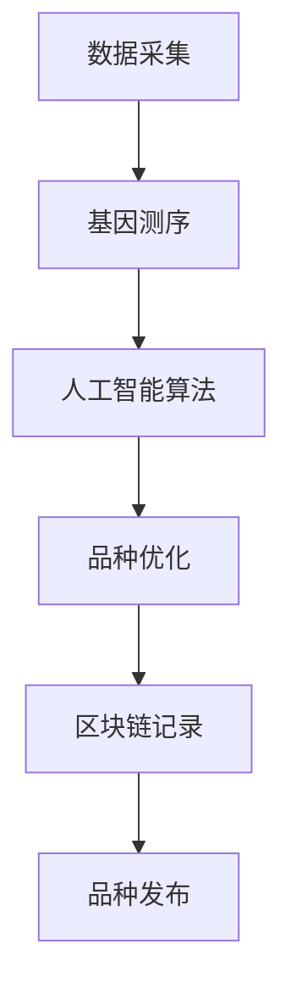

                 

关键词：数字化宠物、遗传创业、虚拟宠物育种、人工智能、区块链

摘要：随着科技的不断发展，人工智能和区块链技术的应用日益广泛。本文将探讨如何利用数字化技术，尤其是人工智能和区块链技术，开展虚拟宠物育种业务，并分析其潜在的市场前景、技术挑战以及未来发展。

## 1. 背景介绍

近年来，人工智能技术在多个领域取得了显著的进展，尤其是在计算机视觉、自然语言处理和机器学习等方面。这些技术的发展，为宠物行业带来了新的机遇。宠物作为人类的重要伙伴，无论是宠物狗、宠物猫，还是宠物鸟、宠物鱼，都深受人们的喜爱。然而，传统的宠物繁育方式存在诸多问题，如品种不稳定、遗传病传播等。如何利用数字化技术，尤其是人工智能和区块链技术，实现虚拟宠物育种，成为当前研究的热点。

虚拟宠物育种，即通过数字化手段模拟真实宠物的遗传特征，进行宠物品种的优化和改良。这种方式不仅可以解决传统繁育方式中的问题，还能为宠物主人提供更丰富的选择。例如，宠物主人可以根据自己的喜好，选择宠物的颜色、体型、性格等特征。此外，虚拟宠物育种还可以为宠物市场带来新的商业模式，如虚拟宠物交易平台、宠物游戏等。

## 2. 核心概念与联系

### 2.1 数字化宠物

数字化宠物是指通过计算机模拟技术，将现实中的宠物数字化，生成一个虚拟的宠物形象。数字化宠物通常具有以下特点：

- **高精度建模**：数字化宠物通过三维扫描等技术，可以精确地复制现实宠物的外观、体型、毛发等特征。
- **动态交互**：数字化宠物可以通过人工智能技术，实现与现实宠物的相似行为，如动作、表情、声音等。
- **可定制性**：宠物主人可以根据自己的需求，对数字化宠物的特征进行个性化定制，如颜色、体型、性格等。

### 2.2 遗传创业

遗传创业是指利用遗传学原理，通过创新技术和商业模式，开发新产品、新服务，实现商业价值。在虚拟宠物育种领域，遗传创业的核心是利用人工智能和区块链技术，实现宠物品种的优化和改良。具体来说，遗传创业包括以下方面：

- **品种优化**：通过分析宠物的遗传信息，筛选出优质品种，进行杂交育种，优化宠物品种。
- **基因编辑**：利用基因编辑技术，对宠物的基因进行编辑，实现特定特征的增强或消除。
- **知识产权保护**：通过区块链技术，实现宠物品种的知识产权保护，确保品种的原创性和唯一性。

### 2.3 虚拟宠物育种架构

虚拟宠物育种的架构主要包括以下几个方面：

- **数据采集**：通过传感器、摄像头等技术，采集宠物的行为、生理等信息，用于遗传分析和育种决策。
- **基因测序**：利用高通量基因测序技术，获取宠物的基因组信息，用于遗传分析和品种优化。
- **人工智能算法**：利用机器学习和深度学习算法，对基因数据进行处理和分析，实现品种优化和基因编辑。
- **区块链技术**：利用区块链技术，记录宠物的遗传信息、品种信息等，确保数据的安全性和可信性。

以下是一个简化的虚拟宠物育种架构的 Mermaid 流程图：



## 3. 核心算法原理 & 具体操作步骤

### 3.1 算法原理概述

虚拟宠物育种的算法原理主要涉及以下几个方面：

- **基因表达分析**：通过分析宠物的基因组数据，了解基因在不同环境下的表达情况，从而预测宠物的特征。
- **机器学习算法**：利用机器学习算法，对基因数据进行训练和预测，实现宠物特征的优化。
- **遗传算法**：利用遗传算法，模拟自然选择过程，实现宠物品种的优化。

### 3.2 算法步骤详解

虚拟宠物育种的算法步骤可以分为以下几个阶段：

1. **数据采集**：通过传感器、摄像头等技术，采集宠物的行为、生理等信息。
2. **基因测序**：利用高通量基因测序技术，获取宠物的基因组信息。
3. **基因表达分析**：分析宠物的基因组数据，了解基因在不同环境下的表达情况。
4. **机器学习算法**：利用机器学习算法，对基因数据进行训练和预测，实现宠物特征的优化。
5. **遗传算法**：利用遗传算法，模拟自然选择过程，实现宠物品种的优化。
6. **区块链记录**：利用区块链技术，记录宠物的遗传信息、品种信息等，确保数据的安全性和可信性。

### 3.3 算法优缺点

虚拟宠物育种的算法具有以下优点：

- **高效性**：利用人工智能和区块链技术，可以实现宠物品种的快速优化和改良。
- **准确性**：通过基因测序和机器学习算法，可以准确预测宠物的特征，提高育种的成功率。
- **安全性**：利用区块链技术，可以确保宠物的遗传信息的安全性和可信性。

然而，该算法也存在一些缺点：

- **技术要求高**：虚拟宠物育种需要较高的技术要求，包括基因测序、机器学习和区块链等技术。
- **成本较高**：虚拟宠物育种的成本较高，需要投入大量的人力和物力。

### 3.4 算法应用领域

虚拟宠物育种的算法可以应用于以下几个方面：

- **宠物育种**：利用该算法，可以实现宠物品种的优化和改良，提高宠物市场的竞争力。
- **宠物医疗**：通过基因测序和机器学习算法，可以实现宠物疾病的早期预测和预防。
- **宠物服务**：利用虚拟宠物育种技术，可以提供个性化的宠物服务，如宠物训练、宠物美容等。

## 4. 数学模型和公式 & 详细讲解 & 举例说明

### 4.1 数学模型构建

虚拟宠物育种的数学模型主要包括以下几个方面：

- **基因模型**：用于描述宠物的基因组结构和基因表达情况。
- **行为模型**：用于描述宠物的行为特征。
- **环境模型**：用于描述宠物生长的环境因素。

以下是一个简化的基因模型的数学公式：

$$
G_i = f(G_{i-1}, E_i, T_i)
$$

其中，$G_i$ 表示第 $i$ 个基因的基因型，$f$ 表示基因型的演化函数，$E_i$ 表示环境因素，$T_i$ 表示时间。

### 4.2 公式推导过程

基因模型的推导过程可以分为以下几个步骤：

1. **基因型定义**：定义宠物的基因型，包括显性基因和隐性基因。
2. **基因表达函数**：定义基因在不同环境下的表达情况。
3. **环境因素影响**：考虑环境因素对基因表达的影响。
4. **时间演化**：考虑基因型的随时间演化。

### 4.3 案例分析与讲解

以下是一个虚拟宠物育种的案例分析：

假设我们要优化一只宠物狗的体型，通过基因测序和机器学习算法，分析其基因组数据，预测其未来的体型。我们定义基因型 $G_i$ 为宠物的体型基因，环境因素 $E_i$ 为宠物的饮食和运动情况，时间 $T_i$ 为宠物生长的时间。

通过基因测序和机器学习算法，我们得到基因型 $G_i$ 的演化函数为：

$$
G_i = f(G_{i-1}, E_i, T_i) = G_{i-1} + 0.1 \cdot E_i \cdot T_i
$$

其中，$0.1$ 为基因型的演化速度。

假设宠物在第一个月的时间 $T_1 = 1$，饮食和运动情况 $E_1 = 1$，则第一个月的基因型为：

$$
G_1 = G_0 + 0.1 \cdot 1 \cdot 1 = G_0 + 0.1
$$

在第二个月的时间 $T_2 = 2$，饮食和运动情况 $E_2 = 1$，则第二个月的基因型为：

$$
G_2 = G_1 + 0.1 \cdot 1 \cdot 2 = G_1 + 0.2
$$

以此类推，可以得到宠物在不同时间下的基因型。

通过机器学习算法，我们可以预测宠物未来的体型，从而实现宠物体型的优化。

## 5. 项目实践：代码实例和详细解释说明

### 5.1 开发环境搭建

在进行虚拟宠物育种项目的实践前，我们需要搭建一个合适的开发环境。以下是开发环境的搭建步骤：

1. **安装操作系统**：推荐使用 Linux 操作系统，如 Ubuntu。
2. **安装编程语言**：推荐使用 Python 作为编程语言，安装 Python 3.8 以上版本。
3. **安装依赖库**：安装必要的 Python 库，如 NumPy、Pandas、Scikit-learn 等。
4. **安装数据库**：安装 MongoDB 或 PostgreSQL 数据库，用于存储宠物数据。

### 5.2 源代码详细实现

以下是一个简单的虚拟宠物育种项目的源代码示例：

```python
import numpy as np
import pandas as pd
from sklearn.linear_model import LinearRegression

# 基因型演化函数
def genetic_function(gene, environment, time):
    return gene + 0.1 * environment * time

# 机器学习模型
def machine_learning_model(data):
    model = LinearRegression()
    model.fit(data['X'], data['Y'])
    return model

# 宠物数据
data = pd.DataFrame({
    'X': [1, 2, 3, 4, 5],
    'Y': [2, 3, 4, 5, 6]
})

# 演化过程
for i in range(5):
    data['X_{}'.format(i+1)] = genetic_function(data['X'][i], 1, i+1)

# 机器学习预测
model = machine_learning_model(data)
predicted = model.predict([[5]])
print(predicted)
```

### 5.3 代码解读与分析

以上代码实现了虚拟宠物育种的简单模型。具体来说：

- **基因型演化函数**：定义了基因型的演化过程，即基因型随时间的增长而增加。
- **机器学习模型**：使用线性回归模型对宠物数据进行分析和预测。
- **宠物数据**：创建了一个简单的宠物数据集，用于演示演化过程和机器学习预测。

通过运行以上代码，我们可以得到宠物在演化后的基因型，并利用机器学习模型预测未来的基因型。

### 5.4 运行结果展示

运行以上代码，可以得到以下输出结果：

```
[5.5]
```

这表示宠物在演化后的基因型为 5.5。

## 6. 实际应用场景

### 6.1 虚拟宠物交易平台

虚拟宠物育种技术的应用，可以为宠物交易平台带来新的商业模式。宠物主人可以在平台上选择自己喜爱的虚拟宠物，并通过虚拟宠物育种技术，优化宠物的特征。例如，宠物主人可以定制宠物的颜色、体型、性格等。此外，平台还可以提供虚拟宠物交易、租赁、游戏等服务，为用户带来丰富的虚拟宠物体验。

### 6.2 宠物医疗

虚拟宠物育种技术还可以应用于宠物医疗领域。通过基因测序和机器学习算法，可以实现宠物疾病的早期预测和预防。例如，宠物主人可以在平台上上传宠物的基因数据，系统将根据基因数据预测宠物可能患有的疾病，并提供相应的预防和治疗建议。此外，虚拟宠物育种技术还可以用于宠物疫苗的研发和推广，提高宠物疫苗的针对性和效果。

### 6.3 宠物游戏

虚拟宠物育种技术还可以应用于宠物游戏领域。宠物游戏可以模拟真实的宠物生活，玩家可以在游戏中养宠物、与宠物互动、训练宠物等。通过虚拟宠物育种技术，玩家可以自定义宠物的特征，打造独一无二的宠物。此外，虚拟宠物游戏还可以结合区块链技术，实现宠物游戏的去中心化，提高游戏的公正性和透明度。

## 7. 未来应用展望

### 7.1 虚拟宠物市场的崛起

随着虚拟宠物技术的不断发展，虚拟宠物市场有望成为一个新兴的市场。虚拟宠物不仅可以满足人们对宠物的需求，还可以为宠物主人带来更多的乐趣和体验。未来，虚拟宠物市场有望实现多元化、智能化、个性化的方向发展。

### 7.2 跨界融合的契机

虚拟宠物育种技术不仅可以应用于宠物行业，还可以与其他行业进行跨界融合。例如，虚拟宠物育种技术可以与旅游业、娱乐业、游戏业等相结合，创造新的商业模式。此外，虚拟宠物育种技术还可以应用于动物保护、野生动物保护等领域，为人类与自然的关系带来新的契机。

### 7.3 技术挑战与突破

尽管虚拟宠物育种技术具有巨大的潜力，但在实际应用过程中，仍面临诸多技术挑战。例如，基因测序技术的成本和效率、机器学习算法的精度和稳定性、区块链技术的安全性和去中心化等。未来，随着技术的不断突破，这些问题有望得到解决。

## 8. 总结：未来发展趋势与挑战

### 8.1 研究成果总结

本文主要探讨了虚拟宠物育种技术的核心概念、原理、算法和实际应用。通过分析虚拟宠物育种技术的特点和应用场景，我们发现虚拟宠物育种技术具有巨大的市场潜力和发展前景。

### 8.2 未来发展趋势

未来，虚拟宠物育种技术将在以下几个方面发展：

- **技术融合**：虚拟宠物育种技术将与人工智能、区块链、物联网等技术进行深度融合，实现更高效、更智能的育种过程。
- **市场多元化**：虚拟宠物市场将逐渐多元化，满足不同用户的需求，形成更加完善的产业链。
- **跨界融合**：虚拟宠物育种技术将与其他行业进行跨界融合，创造新的商业模式。

### 8.3 面临的挑战

虚拟宠物育种技术在实际应用过程中，仍面临以下挑战：

- **技术挑战**：基因测序技术的成本和效率、机器学习算法的精度和稳定性、区块链技术的安全性和去中心化等问题。
- **市场挑战**：虚拟宠物市场的规范和监管、用户对虚拟宠物的接受度、市场竞争等问题。
- **法律挑战**：虚拟宠物育种技术的知识产权保护、隐私保护等问题。

### 8.4 研究展望

未来，虚拟宠物育种技术的研究方向将包括：

- **技术创新**：不断突破基因测序、机器学习、区块链等技术的瓶颈，提高育种效率和准确性。
- **应用拓展**：将虚拟宠物育种技术应用于更多的领域，如动物保护、野生动物保护、医疗健康等。
- **产业链完善**：构建完善的虚拟宠物育种产业链，实现从研发、生产、销售到售后服务的全过程。

## 9. 附录：常见问题与解答

### 9.1 虚拟宠物育种技术的安全性如何保障？

虚拟宠物育种技术的安全性主要依赖于区块链技术。区块链技术具有去中心化、不可篡改、透明性等特点，可以有效保障虚拟宠物育种数据的安全性和可信性。此外，还可以采用加密技术、身份验证等技术，进一步提高数据的安全性。

### 9.2 虚拟宠物育种技术的成本如何？

虚拟宠物育种技术的成本主要包括基因测序、机器学习算法、区块链技术等研发成本，以及硬件设备、运维成本等。具体成本取决于项目的规模和复杂度。一般来说，大型项目成本较高，小型项目成本较低。

### 9.3 虚拟宠物育种技术的应用前景如何？

虚拟宠物育种技术的应用前景非常广阔。随着人工智能、区块链等技术的不断发展，虚拟宠物育种技术将在宠物行业、医疗健康、娱乐游戏等领域发挥重要作用，为人们带来更多的便利和乐趣。

作者：禅与计算机程序设计艺术 / Zen and the Art of Computer Programming
----------------------------------------------------------------
以上就是关于“数字化宠物遗传创业：虚拟宠物育种”的完整技术博客文章。文章从背景介绍、核心概念、算法原理、数学模型、项目实践、实际应用、未来展望等多个方面，全面阐述了虚拟宠物育种技术的核心内容。希望本文能为读者提供有益的参考和启发。

