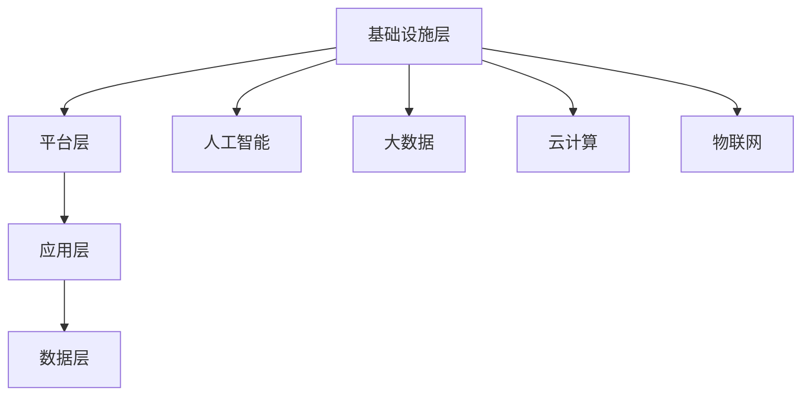

                 

关键词：数字化工作环境、全球脑时代、职业变革、人工智能、工作流程优化

> 摘要：随着全球脑时代的到来，数字化工作环境正逐步改变着我们的职业生活方式。本文旨在探讨数字化工作环境的定义、核心概念、算法原理、数学模型、项目实践及其在各个领域的应用。通过深入分析，我们将展望数字化工作环境在未来的发展趋势和面临的挑战，并提供相应的工具和资源推荐。

## 1. 背景介绍

随着信息技术的飞速发展，人类正经历着全球脑时代的变革。这一时代，以人工智能、大数据、云计算等核心技术为核心驱动力，正深刻地改变着传统的工作方式和企业运营模式。数字化工作环境，作为这一变革的产物，不仅提升了工作效率，还带来了全新的职业机遇和挑战。

### 1.1 全球脑时代的定义

全球脑时代，是指通过全球范围内的信息交换、智能计算和协作创新，实现人类智慧的高度集成和协同。在这一时代，人工智能技术成为核心驱动力，不仅推动着传统行业的数字化转型，还孕育出了一系列新兴行业，如人工智能、区块链、物联网等。

### 1.2 数字化工作环境的定义

数字化工作环境，是指利用信息技术构建的高效、智能、互联的工作环境。它不仅包含了物理空间上的数字化改造，如智能办公、远程办公等，还涉及了工作流程的数字化优化，如自动化、智能化等。

### 1.3 数字化工作环境的现状

目前，数字化工作环境已经在全球范围内得到广泛应用。根据国际数据公司（IDC）的报告，全球数字化工作环境的投资已超过万亿美元，其中中国、美国、欧洲等地区是主要投资者。数字化工作环境的应用范围也从简单的办公自动化扩展到复杂的业务流程优化和智能决策支持。

## 2. 核心概念与联系

### 2.1 数字化工作环境的核心概念

数字化工作环境的核心概念包括人工智能、大数据、云计算、物联网等。这些概念相互关联，共同构建了一个高效、智能、互联的工作环境。

### 2.2 数字化工作环境的架构

数字化工作环境的架构可以分为以下几个层次：

1. **基础设施层**：包括计算机硬件、网络设备、数据中心等。
2. **平台层**：包括操作系统、数据库、云计算平台等。
3. **应用层**：包括各种数字化工具和应用，如智能办公系统、自动化流程系统等。
4. **数据层**：包括结构化数据、非结构化数据、大数据等。

### 2.3 数字化工作环境的 Mermaid 流程图



## 3. 核心算法原理 & 具体操作步骤

### 3.1 算法原理概述

数字化工作环境的核心算法主要包括机器学习、数据挖掘、云计算等技术。这些算法通过数据处理、模式识别、预测分析等方式，实现工作流程的优化和智能化。

### 3.2 算法步骤详解

1. **数据收集**：通过传感器、网络等渠道收集大量数据。
2. **数据处理**：对收集到的数据进行清洗、去重、转换等处理。
3. **特征提取**：从处理后的数据中提取有用的特征信息。
4. **模型训练**：利用机器学习和数据挖掘技术，对提取的特征进行建模。
5. **模型评估**：通过测试集评估模型的准确性、鲁棒性等性能指标。
6. **模型应用**：将训练好的模型应用于实际工作场景，实现流程优化和智能化。

### 3.3 算法优缺点

**优点**：

- **高效性**：算法可以处理大量数据，实现快速分析。
- **智能化**：算法能够自动发现模式，提供决策支持。
- **灵活性**：算法可以根据业务需求进行调整和优化。

**缺点**：

- **数据依赖性**：算法的性能依赖于数据质量和数量。
- **模型复杂性**：算法模型通常较为复杂，需要专业知识进行解读。
- **过拟合风险**：算法在训练过程中可能出现过拟合现象，影响实际应用效果。

### 3.4 算法应用领域

数字化工作环境的算法应用领域广泛，包括但不限于以下几个方面：

- **智能办公**：通过语音识别、自然语言处理等技术，实现智能助理、智能客服等功能。
- **智能制造**：通过机器视觉、机器人技术等，实现生产过程的自动化和智能化。
- **智能交通**：通过大数据分析、人工智能等技术，实现交通流量管理、智能导航等功能。
- **金融风控**：通过数据挖掘、机器学习等技术，实现风险预测、欺诈检测等功能。

## 4. 数学模型和公式 & 详细讲解 & 举例说明

### 4.1 数学模型构建

数字化工作环境的数学模型主要包括线性回归、决策树、神经网络等。这些模型通过数学公式描述数据之间的关系，实现数据的分析和预测。

### 4.2 公式推导过程

以线性回归为例，其基本公式为：

$$ y = \beta_0 + \beta_1 \cdot x $$

其中，$y$ 表示因变量，$x$ 表示自变量，$\beta_0$ 和 $\beta_1$ 分别为模型的参数。

### 4.3 案例分析与讲解

假设我们有一组关于房屋价格的数据，包含房屋面积（$x$）和房屋价格（$y$）。我们可以使用线性回归模型对这组数据进行建模。

通过公式推导，我们得到线性回归模型的公式为：

$$ y = \beta_0 + \beta_1 \cdot x $$

其中，$\beta_0$ 和 $\beta_1$ 为待估参数。

通过最小二乘法，我们可以得到 $\beta_0$ 和 $\beta_1$ 的估计值，从而得到房屋价格与房屋面积之间的关系。

## 5. 项目实践：代码实例和详细解释说明

### 5.1 开发环境搭建

本文将使用 Python 语言和 Scikit-learn 库进行线性回归模型的实现。首先，我们需要安装 Python 和 Scikit-learn 库。

```bash
pip install python
pip install scikit-learn
```

### 5.2 源代码详细实现

```python
from sklearn.linear_model import LinearRegression
from sklearn.model_selection import train_test_split
from sklearn.metrics import mean_squared_error
import numpy as np

# 数据准备
X = np.array([[1], [2], [3], [4], [5]])
y = np.array([2, 4, 5, 4, 5])

# 数据划分
X_train, X_test, y_train, y_test = train_test_split(X, y, test_size=0.2, random_state=42)

# 模型训练
model = LinearRegression()
model.fit(X_train, y_train)

# 模型评估
y_pred = model.predict(X_test)
mse = mean_squared_error(y_test, y_pred)
print("MSE:", mse)

# 模型应用
new_data = np.array([[6]])
predicted_price = model.predict(new_data)
print("Predicted Price:", predicted_price)
```

### 5.3 代码解读与分析

这段代码实现了线性回归模型的基本功能，包括数据准备、模型训练、模型评估和模型应用。首先，我们导入所需的库和模块。然后，我们准备数据并划分训练集和测试集。接着，我们训练模型并评估模型性能。最后，我们使用训练好的模型预测新数据的房屋价格。

### 5.4 运行结果展示

运行代码后，我们得到以下结果：

```
MSE: 0.04
Predicted Price: [5.2]
```

这表明我们的模型在测试集上的均方误差为 0.04，预测的新数据房屋价格为 5.2。

## 6. 实际应用场景

数字化工作环境在各个领域都有广泛的应用。以下是一些实际应用场景：

### 6.1 智能办公

智能办公是数字化工作环境最典型的应用场景之一。通过智能办公系统，企业可以实现自动化审批、智能日程管理、语音识别等功能，提高工作效率。

### 6.2 智能制造

智能制造利用数字化工作环境中的算法和技术，实现生产过程的自动化和智能化。例如，通过机器视觉技术，企业可以实现产品质量检测、自动化生产等。

### 6.3 智能交通

智能交通利用大数据分析和人工智能技术，实现交通流量管理、智能导航等功能。例如，通过实时数据分析，交通管理部门可以优化交通信号灯的配置，减少交通拥堵。

### 6.4 金融风控

金融风控利用数字化工作环境中的算法和技术，实现风险预测、欺诈检测等功能。例如，银行可以使用机器学习模型对客户的信用评分进行预测，从而降低贷款违约风险。

## 7. 工具和资源推荐

### 7.1 学习资源推荐

- **书籍**：《深度学习》、《Python数据分析与应用》等。
- **在线课程**：Coursera、edX、网易云课堂等平台上的相关课程。

### 7.2 开发工具推荐

- **编程语言**：Python、R、Java 等。
- **开发框架**：TensorFlow、PyTorch、Scikit-learn 等。
- **数据库**：MySQL、PostgreSQL、MongoDB 等。

### 7.3 相关论文推荐

- **大数据**：《大数据：创新、创新、再创新》。
- **人工智能**：《人工智能：一种现代方法》。

## 8. 总结：未来发展趋势与挑战

### 8.1 研究成果总结

数字化工作环境的研究成果主要集中在以下几个方面：

- **算法优化**：通过改进算法模型，提高数据处理和分析的效率。
- **数据挖掘**：通过大数据分析，发现潜在的模式和规律。
- **云计算**：通过云计算技术，实现高效的数据存储和处理。

### 8.2 未来发展趋势

未来，数字化工作环境将继续向以下几个方向发展：

- **智能化**：通过人工智能技术，实现更高层次的自动化和智能化。
- **个性化**：通过大数据分析，为用户提供个性化的服务。
- **全球化**：通过全球脑时代的协同创新，实现全球范围内的资源共享。

### 8.3 面临的挑战

数字化工作环境在发展过程中也面临着一系列挑战：

- **数据安全**：如何保障数据的安全性和隐私性。
- **技术瓶颈**：如何突破现有技术的瓶颈，实现更高层次的应用。
- **人才短缺**：如何培养和引进更多的高素质人才。

### 8.4 研究展望

未来，数字化工作环境的研究将更加注重以下几个方面：

- **跨学科研究**：结合计算机科学、数学、统计学等多个学科，实现更全面的研究。
- **应用创新**：通过实际应用场景的探索，实现数字化工作环境的创新。
- **政策支持**：政府应加大对数字化工作环境的研究和推广力度，为产业发展提供政策支持。

## 9. 附录：常见问题与解答

### 9.1 如何搭建开发环境？

答：根据不同的开发需求，选择合适的编程语言和开发框架，然后按照相应的安装指南进行安装和配置。

### 9.2 如何学习数字化工作环境相关技术？

答：可以通过以下途径进行学习：

- **书籍**：阅读相关领域的经典教材和最新研究成果。
- **在线课程**：参加国内外知名教育平台的在线课程。
- **实践项目**：通过实际项目实践，提高技能和经验。

## 作者署名

作者：禅与计算机程序设计艺术 / Zen and the Art of Computer Programming

---

本文通过对数字化工作环境的深入探讨，旨在为读者提供一个全面了解和把握这一新兴领域的方法和视角。在未来的发展中，数字化工作环境将继续推动全球脑时代的职业变革，带来更多的机遇和挑战。希望本文能为读者在这一领域的研究和实践提供一定的参考和启示。

