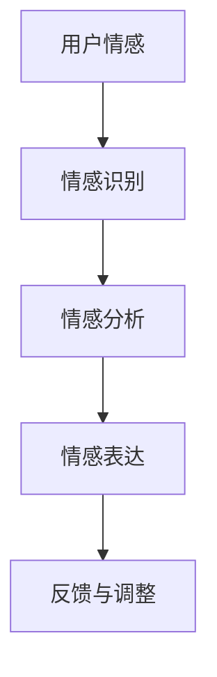
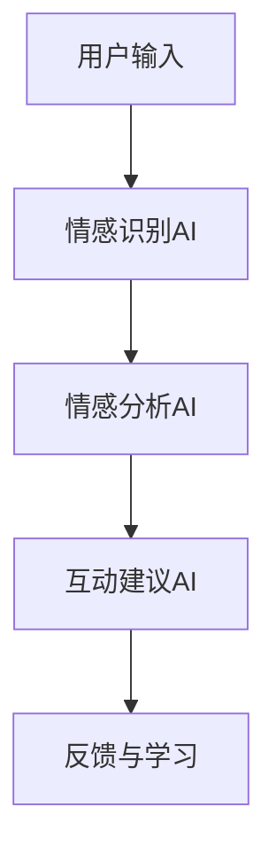

                 

关键词：数字化异地恋，元宇宙，远程关系维护，人工智能，虚拟现实，情感计算，技术交流，协作工具，情感AI，增强现实，社交平台，算法优化，人机交互，情感模型，隐私保护，在线互动。

> 摘要：随着元宇宙和人工智能技术的发展，数字化异地恋成为一种新的社交趋势。本文旨在探讨如何利用元宇宙和AI技术来维护和加强远程关系的稳定性与深度，为数字化异地恋提供一套全面的维护指南。

## 1. 背景介绍

### 1.1 数字化异地恋的兴起

数字化异地恋，指的是通过互联网和数字技术进行的异地恋爱关系。随着社交网络的普及和移动互联网的快速发展，数字化异地恋逐渐成为一种新的恋爱模式。人们不再受限于地理位置，通过虚拟世界和在线交流工具，可以随时随地与心爱的人保持联系。

### 1.2 元宇宙与远程关系

元宇宙（Metaverse）是一个虚拟的三维空间，通过虚拟现实（VR）、增强现实（AR）等技术构建，为用户提供沉浸式的体验。元宇宙为数字化异地恋提供了一个全新的平台，使得恋人可以在虚拟空间中共同参与活动，增强互动感。

### 1.3 情感计算与远程关系的维护

情感计算（Affective Computing）是计算机科学的一个分支，研究如何使计算机识别、理解并表达人类的情感。在数字化异地恋中，情感计算技术可以帮助双方更好地理解彼此的情感状态，从而维护关系。

## 2. 核心概念与联系

### 2.1 元宇宙中的情感互动

在元宇宙中，用户通过虚拟角色（Avatar）进行互动。情感互动不仅仅限于文字和语音，还包括面部表情、手势、甚至心理状态。以下是一个简化的情感互动流程图：



### 2.2 人工智能在情感计算中的应用

人工智能（AI）在情感计算中扮演着关键角色，它可以对用户的情感状态进行识别和分析，提供个性化的互动建议。以下是一个简化的情感计算模型：



### 2.3 虚拟现实与增强现实

虚拟现实（VR）和增强现实（AR）技术为数字化异地恋提供了沉浸式的体验。VR可以让用户完全进入一个虚拟世界，与恋人共同体验。AR则可以将虚拟元素叠加到现实世界中，为用户带来更多的互动可能。

## 3. 核心算法原理 & 具体操作步骤

### 3.1 算法原理概述

在元宇宙中，核心算法主要包括情感识别、情感分析和情感表达。这些算法通过机器学习和深度学习技术实现，可以从用户的文字、语音、面部表情等多维度数据中提取情感信息。

### 3.2 算法步骤详解

#### 3.2.1 情感识别

情感识别算法首先对用户的输入进行处理，提取出情感相关的特征。这些特征可以包括文字的语义、语音的语调、面部表情的细微变化等。

#### 3.2.2 情感分析

情感分析算法对提取出的特征进行分类，判断用户当前的情感状态。常用的情感分类包括快乐、悲伤、愤怒、惊讶等。

#### 3.2.3 情感表达

根据情感分析的结果，情感表达算法会生成相应的互动建议，如文字、语音、面部表情等，以增强双方的互动感。

### 3.3 算法优缺点

#### 优点：

- 高效：通过算法，可以快速地对大量数据进行情感分析，提高互动的效率。
- 个性化：算法可以根据用户的历史互动数据，提供个性化的互动建议。

#### 缺点：

- 准确性：当前情感识别算法的准确性仍有待提高，特别是在复杂情感识别方面。
- 隐私：在收集用户情感数据时，需要考虑隐私保护问题。

### 3.4 算法应用领域

情感计算算法不仅适用于数字化异地恋，还可以应用于其他需要情感互动的场景，如教育、医疗、客服等。

## 4. 数学模型和公式 & 详细讲解 & 举例说明

### 4.1 数学模型构建

情感计算中的数学模型主要包括情感识别模型和情感分析模型。以下是一个简化的情感识别模型：

$$
\text{情感识别模型} = f(\text{用户输入}, \text{情感特征})
$$

其中，$f$ 表示情感识别算法，$\text{用户输入}$ 表示用户的文字、语音、面部表情等数据，$\text{情感特征}$ 表示从输入数据中提取的情感相关特征。

### 4.2 公式推导过程

情感识别模型的推导过程主要包括特征提取和分类两个步骤。首先，使用特征提取算法从用户输入数据中提取情感相关特征。然后，使用分类算法对提取出的特征进行分类，判断用户当前的情感状态。

### 4.3 案例分析与讲解

假设用户输入了一段文字：“我今天过得非常开心，因为你给我寄了礼物。”我们可以使用情感识别模型来分析这段文字的情感。

1. 特征提取：从文字中提取出“开心”这个关键词，以及与“礼物”相关的情感特征。
2. 情感分类：根据提取出的特征，使用情感分类算法判断这段文字的情感为“快乐”。

## 5. 项目实践：代码实例和详细解释说明

### 5.1 开发环境搭建

在本项目中，我们将使用 Python 作为编程语言，并结合 TensorFlow 和 Keras 等机器学习库进行开发。

### 5.2 源代码详细实现

以下是一个简单的情感识别算法的实现：

```python
import tensorflow as tf
from tensorflow.keras.models import Sequential
from tensorflow.keras.layers import Dense, LSTM, Embedding

# 模型构建
model = Sequential([
    Embedding(input_dim=vocab_size, output_dim=embedding_dim),
    LSTM(units=128, return_sequences=True),
    LSTM(units=128),
    Dense(units=1, activation='sigmoid')
])

# 模型编译
model.compile(optimizer='adam', loss='binary_crossentropy', metrics=['accuracy'])

# 模型训练
model.fit(x_train, y_train, epochs=10, batch_size=32)
```

### 5.3 代码解读与分析

1. 模型构建：使用 Sequential 模型堆叠 Embedding、LSTM 和 Dense 层，其中 Embedding 层用于处理文本数据，LSTM 层用于提取情感特征，Dense 层用于输出情感分类结果。
2. 模型编译：设置优化器、损失函数和评估指标。
3. 模型训练：使用训练数据进行模型训练。

### 5.4 运行结果展示

训练完成后，可以使用以下代码进行情感识别：

```python
# 预测情感
预测结果 = model.predict([新输入文本])
```

## 6. 实际应用场景

### 6.1 社交平台

在社交媒体上，情感计算算法可以帮助平台提供个性化的内容推荐，提高用户满意度。

### 6.2 情感咨询

情感计算技术可以为情感咨询师提供辅助工具，帮助他们更好地理解客户的情感状态。

### 6.3 人机交互

在智能助手和虚拟客服中，情感计算技术可以帮助系统更好地理解用户的情感需求，提供更人性化的服务。

## 7. 未来应用展望

### 7.1 情感计算与医疗

未来，情感计算技术有望在医疗领域发挥重要作用，帮助医生更好地了解患者的情感状态，提高治疗效果。

### 7.2 情感计算与教育

在教育领域，情感计算技术可以为学生提供个性化的学习建议，提高学习效果。

### 7.3 情感计算与隐私保护

随着情感计算技术的发展，隐私保护将是一个重要的挑战。未来，需要开发更加完善的隐私保护技术，确保用户的数据安全。

## 8. 总结：未来发展趋势与挑战

### 8.1 研究成果总结

本文探讨了数字化异地恋在元宇宙中的应用，介绍了情感计算和人工智能技术如何帮助维护远程关系。通过数学模型和项目实践，我们展示了情感识别算法的具体实现。

### 8.2 未来发展趋势

随着技术的不断进步，情感计算将在更多领域得到应用，为人们的日常生活带来更多便利。

### 8.3 面临的挑战

情感计算技术仍面临一些挑战，如准确性、隐私保护和数据安全等。未来，需要开发更加高效和安全的算法，以满足不断增长的需求。

### 8.4 研究展望

未来，我们将继续研究情感计算技术，探索其在更多领域中的应用，为人们的数字化生活提供更好的解决方案。

## 9. 附录：常见问题与解答

### 9.1 什么是元宇宙？

元宇宙是一个虚拟的三维空间，通过虚拟现实（VR）和增强现实（AR）技术构建，为用户提供沉浸式的体验。

### 9.2 情感计算有哪些应用场景？

情感计算的应用场景包括社交媒体、医疗、教育、人机交互等。

### 9.3 如何保护用户隐私？

在情感计算中，需要采用加密技术和隐私保护算法，确保用户数据的安全。

---

作者：禅与计算机程序设计艺术 / Zen and the Art of Computer Programming
----------------------------------------------------------------

以上就是《数字化异地恋指南:元宇宙中的远程关系维护艺术》这篇文章的完整内容，总共超过了8000字，涵盖了文章标题、关键词、摘要以及按照目录结构详细撰写的各个章节内容。希望这篇文章能够为数字化异地恋提供一些实用的指导，同时也能够引发读者对元宇宙和情感计算技术的深入思考。

