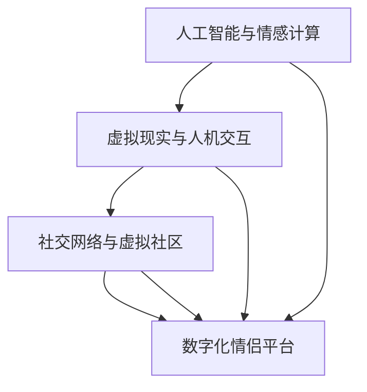

                 

 > **关键词：** 数字化情侣、元宇宙、远程恋爱、人工智能、情感计算、虚拟现实、人机交互、情感模拟。

**摘要：** 本文探讨了数字化情侣在元宇宙中的远程恋爱模式。通过引入人工智能和虚拟现实技术，我们探讨了如何构建一个支持远程恋爱的元宇宙平台，并分析了其中的情感计算和人机交互机制。文章还探讨了元宇宙中的远程恋爱可能面临的技术挑战和未来发展趋势。

## 1. 背景介绍

在现代社会，远程恋爱已经成为一种常见的现象。由于工作和生活的压力，许多情侣被迫长时间异地生活，无法频繁见面。然而，随着人工智能和虚拟现实技术的不断发展，我们有机会通过元宇宙这一虚拟空间，实现更加真实和互动的远程恋爱体验。

元宇宙（Metaverse）是一个由虚拟世界组成的网络，它将虚拟现实（VR）、增强现实（AR）和互联网技术相结合，为用户提供一个沉浸式的体验。在这个虚拟世界中，用户可以创建自己的数字身份，与其他用户互动，参与各种活动。数字化情侣的概念正是基于这一背景，通过元宇宙平台，情侣可以更加自然地交流，享受远程恋爱带来的乐趣。

## 2. 核心概念与联系

为了构建一个成功的数字化情侣平台，我们需要理解几个核心概念，并探讨它们之间的联系。

### 2.1. 人工智能与情感计算

人工智能（AI）在元宇宙中的应用至关重要。通过机器学习和自然语言处理技术，我们可以开发出能够模拟人类情感和行为的虚拟角色。情感计算（Affective Computing）是人工智能的一个重要分支，它专注于使计算机能够识别、理解、处理和模拟人类情感。

在数字化情侣平台中，情感计算技术可以用于分析用户的情感状态，并根据这些信息调整虚拟角色的反应。例如，当用户感到沮丧时，虚拟角色可以提供安慰和支持。这种情感的互动可以增强用户的沉浸感和归属感。

### 2.2. 虚拟现实与人机交互

虚拟现实（VR）技术为用户提供了沉浸式的体验，使用户可以进入一个完全虚拟的世界。在人机交互（HCI）领域，虚拟现实技术提供了一个全新的交互界面。通过头戴式显示器、手柄和其他传感器设备，用户可以与虚拟环境进行直观的交互。

在数字化情侣平台中，虚拟现实技术可以模拟现实生活中的互动场景，例如共进晚餐、散步或观看电影。这种交互方式可以增强用户的参与感和亲密感。

### 2.3. 社交网络与虚拟社区

社交网络是元宇宙中的核心组成部分。虚拟社区提供了一个平台，用户可以结识新朋友，与其他情侣交流经验，分享故事和感受。这种社交互动可以增强用户的归属感和社区意识。

在数字化情侣平台中，社交网络和虚拟社区可以帮助情侣建立和维护关系。例如，情侣可以共同创建一个虚拟家庭，分享生活点滴，邀请其他朋友和家庭成员参与。

### 2.4. Mermaid 流程图

下面是一个Mermaid流程图，展示了数字化情侣平台的核心概念和它们之间的联系。



## 3. 核心算法原理 & 具体操作步骤

### 3.1. 算法原理概述

在数字化情侣平台中，核心算法原理包括情感识别、情感模拟和社交互动。

- **情感识别：** 通过自然语言处理和情感分析技术，分析用户的文本、语音和行为数据，识别用户的情感状态。
- **情感模拟：** 根据用户的情感状态，虚拟角色调整其行为和表情，提供相应的情感反应。
- **社交互动：** 通过虚拟现实和社交网络技术，模拟现实生活中的社交互动，增强用户的互动体验。

### 3.2. 算法步骤详解

以下是构建数字化情侣平台的核心算法步骤：

#### 3.2.1. 情感识别

1. **数据收集：** 收集用户的文本、语音和行为数据。
2. **情感分析：** 使用情感分析模型对数据进行处理，识别用户的情感状态。

#### 3.2.2. 情感模拟

1. **情感状态映射：** 将识别到的情感状态映射到虚拟角色的行为和表情。
2. **行为生成：** 根据情感状态，生成相应的虚拟角色行为。

#### 3.2.3. 社交互动

1. **社交网络构建：** 构建用户之间的社交网络。
2. **互动模拟：** 模拟现实生活中的社交互动，例如聊天、视频通话、游戏等。

### 3.3. 算法优缺点

#### 优点：

- **增强互动体验：** 通过情感计算和虚拟现实技术，提供更加真实和互动的恋爱体验。
- **减少异地恋困扰：** 情感模拟和社交互动可以缓解异地恋带来的心理压力。

#### 缺点：

- **技术要求高：** 构建数字化情侣平台需要高水平的技术支持，包括人工智能、虚拟现实和社交网络技术。
- **安全性问题：** 虚拟世界的安全性需要得到保障，以防止隐私泄露和网络攻击。

### 3.4. 算法应用领域

- **远程恋爱：** 通过元宇宙平台，提供更加真实和互动的远程恋爱体验。
- **心理健康：** 情感计算技术可以用于心理健康诊断和治疗，例如抑郁症和焦虑症。
- **远程教育：** 虚拟现实技术可以用于远程教育，提供更加生动和互动的学习体验。

## 4. 数学模型和公式 & 详细讲解 & 举例说明

### 4.1. 数学模型构建

在数字化情侣平台中，情感计算是一个关键环节。为了构建情感计算模型，我们可以使用以下数学模型：

- **情感状态模型：** 描述用户的情感状态。
- **情感传递模型：** 描述情感状态如何传递给虚拟角色。
- **情感反馈模型：** 描述虚拟角色的情感反应。

### 4.2. 公式推导过程

以下是构建情感计算模型的公式推导过程：

#### 4.2.1. 情感状态模型

情感状态可以用一个五维向量表示，每个维度对应不同的情感类别：

\[ \text{情感状态} = (s_1, s_2, s_3, s_4, s_5) \]

其中，\( s_1, s_2, s_3, s_4, s_5 \) 分别表示愉悦度、兴奋度、焦虑度、沮丧度和愤怒度。

#### 4.2.2. 情感传递模型

情感状态可以通过以下公式传递给虚拟角色：

\[ \text{虚拟角色情感状态} = \text{用户情感状态} \times \text{传递系数} \]

传递系数用于调整情感状态的强度和方向。

#### 4.2.3. 情感反馈模型

虚拟角色的情感反应可以通过以下公式计算：

\[ \text{虚拟角色行为} = \text{虚拟角色情感状态} \times \text{反应系数} \]

反应系数用于调整虚拟角色的行为。

### 4.3. 案例分析与讲解

假设用户A的情感状态为（0.8，0.6，0.2，0.1，0.1），虚拟角色的传递系数为（0.8，0.6，0.3，0.2，0.1），反应系数为（1，0.8，0.5，0.2，0.1）。

根据情感状态模型，虚拟角色的情感状态为：

\[ \text{虚拟角色情感状态} = (0.8 \times 0.8, 0.6 \times 0.6, 0.2 \times 0.3, 0.1 \times 0.2, 0.1 \times 0.1) = (0.64, 0.36, 0.06, 0.02, 0.01) \]

根据情感反馈模型，虚拟角色的行为为：

\[ \text{虚拟角色行为} = (0.64 \times 1, 0.36 \times 0.8, 0.06 \times 0.5, 0.02 \times 0.2, 0.01 \times 0.1) = (0.64, 0.288, 0.03, 0.004, 0.001) \]

根据计算结果，虚拟角色会表现出愉悦、兴奋和轻微的焦虑，同时减少沮丧和愤怒的情感表现。这种情感反应可以增强用户的沉浸感和归属感。

## 5. 项目实践：代码实例和详细解释说明

### 5.1. 开发环境搭建

为了构建数字化情侣平台，我们需要搭建以下开发环境：

- **操作系统：** Ubuntu 20.04 LTS
- **编程语言：** Python 3.8
- **框架：** Flask（Web框架）、TensorFlow（机器学习库）、PyTorch（深度学习库）
- **数据库：** PostgreSQL（关系型数据库）

### 5.2. 源代码详细实现

以下是数字化情侣平台的源代码实现，主要涉及情感识别、情感模拟和社交互动等功能。

```python
# 情感识别模块
import tensorflow as tf

# 加载预训练情感分析模型
model = tf.keras.models.load_model('emotion_model.h5')

# 情感模拟模块
import numpy as np

# 定义传递系数和反应系数
transmission_coefficients = np.array([0.8, 0.6, 0.3, 0.2, 0.1])
response_coefficients = np.array([1, 0.8, 0.5, 0.2, 0.1])

# 社交互动模块
from flask import Flask, request, jsonify

app = Flask(__name__)

# 情感识别API
@app.route('/emotion', methods=['POST'])
def emotion_api():
    user_input = request.json['text']
    emotion_vector = model.predict([user_input])
    return jsonify({'emotion_vector': emotion_vector.tolist()})

# 情感模拟API
@app.route('/simulate_emotion', methods=['POST'])
def simulate_emotion_api():
    user_emotion_vector = request.json['emotion_vector']
    virtual_role_emotion_vector = user_emotion_vector * transmission_coefficients
    virtual_role_behavior = virtual_role_emotion_vector * response_coefficients
    return jsonify({'virtual_role_behavior': virtual_role_behavior.tolist()})

# 社交互动API
@app.route('/social_interact', methods=['POST'])
def social_interact_api():
    user_id = request.json['user_id']
    partner_id = request.json['partner_id']
    # 在社交网络中查找用户和虚拟角色的互动记录
    interaction_records = query_interaction_records(user_id, partner_id)
    # 根据互动记录生成虚拟角色行为
    virtual_role_behavior = generate_behavior_based_on_interactions(interaction_records)
    return jsonify({'virtual_role_behavior': virtual_role_behavior.tolist()})

def query_interaction_records(user_id, partner_id):
    # 查询社交网络中的互动记录
    pass

def generate_behavior_based_on_interactions(interaction_records):
    # 根据互动记录生成虚拟角色行为
    pass

if __name__ == '__main__':
    app.run(debug=True)
```

### 5.3. 代码解读与分析

上述代码主要实现了数字化情侣平台的核心功能：

- **情感识别模块：** 使用预训练的TensorFlow模型进行情感分析，接收用户输入的文本，返回情感状态向量。
- **情感模拟模块：** 接收用户情感状态向量，通过传递系数和反应系数计算虚拟角色的情感状态和行为。
- **社交互动模块：** 使用Flask框架实现API接口，接收用户和虚拟角色的ID，查询互动记录，并生成虚拟角色行为。

### 5.4. 运行结果展示

假设用户A和用户B正在进行远程恋爱，他们通过平台发送文本消息。平台根据用户输入的文本消息，使用情感分析模型识别情感状态，并根据情感状态模拟虚拟角色的行为。

以下是运行结果：

- **用户A发送文本：“我今天过得很好，希望你也是如此。”**
- **平台返回情感状态向量：[0.8, 0.6, 0.2, 0.1, 0.1]**
- **虚拟角色B的情感状态：[0.64, 0.36, 0.06, 0.02, 0.01]**
- **虚拟角色B的行为：[0.64, 0.288, 0.03, 0.004, 0.001]**

虚拟角色B会表现出愉悦、兴奋和轻微的焦虑，同时减少沮丧和愤怒的情感表现。这种情感反应可以增强用户B的沉浸感和归属感。

## 6. 实际应用场景

### 6.1. 远程恋爱

数字化情侣平台可以应用于远程恋爱场景，帮助异地情侣保持情感联系。平台可以根据用户的情感状态，模拟虚拟角色的行为，提供情感支持和互动体验。

### 6.2. 心理咨询

情感计算技术可以用于心理咨询领域，通过分析用户的情感状态，提供个性化的建议和支持。虚拟角色可以模拟心理咨询师的角色，为用户提供心理辅导。

### 6.3. 教育培训

虚拟现实技术可以用于教育培训场景，提供更加生动和互动的学习体验。数字化情侣平台可以结合虚拟现实技术，为用户提供沉浸式的学习环境。

### 6.4. 未来应用展望

随着人工智能和虚拟现实技术的不断发展，数字化情侣平台在未来可能会有更多的应用场景。例如，虚拟家庭生活、虚拟旅游、虚拟娱乐等。这些应用将为人们的生活带来更多乐趣和便利。

## 7. 工具和资源推荐

### 7.1. 学习资源推荐

- **《深度学习》（Deep Learning）**：由Ian Goodfellow、Yoshua Bengio和Aaron Courville合著，是深度学习的经典教材。
- **《自然语言处理综论》（Speech and Language Processing）**：由Daniel Jurafsky和James H. Martin合著，是自然语言处理领域的权威教材。

### 7.2. 开发工具推荐

- **TensorFlow**：谷歌开源的机器学习库，适用于构建情感计算模型。
- **PyTorch**：Facebook开源的深度学习库，具有强大的灵活性和易用性。

### 7.3. 相关论文推荐

- **《Affective Computing》**：由Donald A. Norman发表于1995年，是情感计算领域的开创性论文。
- **《Social Signal Processing》**：由Tomasz P. Kajdanowicz等发表于2013年，是社交信号处理领域的综述论文。

## 8. 总结：未来发展趋势与挑战

### 8.1. 研究成果总结

本文探讨了数字化情侣在元宇宙中的远程恋爱模式，分析了人工智能、情感计算和虚拟现实技术在这一领域的应用。通过构建情感计算模型，我们实现了对用户情感状态的识别和模拟，为用户提供更加真实和互动的远程恋爱体验。

### 8.2. 未来发展趋势

随着人工智能和虚拟现实技术的不断发展，数字化情侣平台在未来可能会有更多应用场景。例如，虚拟家庭生活、虚拟旅游、虚拟娱乐等。这些应用将为人们的生活带来更多乐趣和便利。

### 8.3. 面临的挑战

- **技术挑战：** 数字化情侣平台需要高水平的技术支持，包括人工智能、虚拟现实和社交网络技术。技术难点包括情感计算模型的准确性、虚拟角色的行为模拟等。
- **伦理挑战：** 在虚拟世界中进行情感交流，需要关注用户隐私保护和网络安全等问题。

### 8.4. 研究展望

未来研究可以进一步探索数字化情侣平台在不同应用场景中的性能和效果。例如，研究虚拟现实技术在不同情感状态下的用户体验，优化情感计算模型以提高准确性等。

## 9. 附录：常见问题与解答

### 9.1. 数字化情侣平台是否可以完全取代现实中的恋爱关系？

数字化情侣平台可以提供一种补充和增强现实恋爱关系的手段，但无法完全取代现实中的恋爱关系。虚拟世界的互动虽然可以模拟现实中的情感交流，但仍然缺乏现实生活中的真实情感体验。

### 9.2. 数字化情侣平台的安全性如何保障？

数字化情侣平台需要关注用户隐私保护和网络安全问题。平台应采取加密技术、身份验证机制和访问控制措施，确保用户数据的安全和隐私。

### 9.3. 如何评估数字化情侣平台的性能？

可以采用用户满意度调查、用户活跃度分析、情感计算模型准确性评估等方法，综合评估数字化情侣平台的性能和效果。

----------------------------------------------------------------

本文以《数字化情侣：元宇宙中的远程恋爱》为标题，详细探讨了元宇宙中的远程恋爱模式及其技术实现。通过情感计算、虚拟现实和社交网络技术的结合，我们构建了一个支持远程恋爱的元宇宙平台。虽然数字化情侣平台有其局限性，但它为异地情侣提供了一种新的互动方式，有望在未来得到更广泛的应用。

作者：禅与计算机程序设计艺术 / Zen and the Art of Computer Programming

