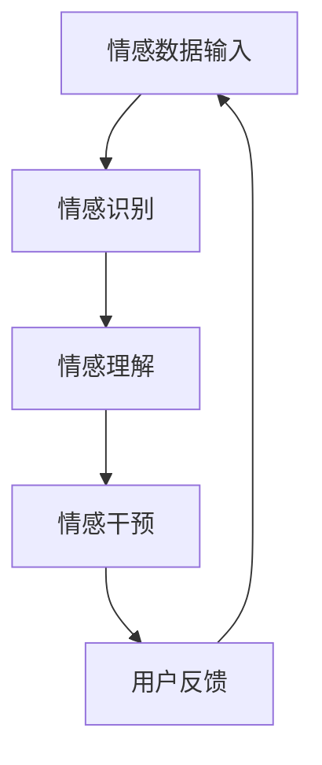

                 

关键词：数字化情感修复、人工智能、关系治愈、情感分析、情感计算、心理康复、技术创业。

> 摘要：本文探讨了数字化情感修复的创业机会，特别强调了人工智能（AI）在关系治愈领域的应用。通过分析当前情感计算的进展，探讨了AI在情感识别、理解与干预方面的潜力，以及如何在商业环境中将这一技术落地实现。同时，文章还展望了这一领域未来的发展趋势和面临的挑战。

## 1. 背景介绍

在现代社会，人际关系对于个人的心理健康和生活质量至关重要。然而，情感问题如焦虑、抑郁、关系冲突等已成为全球性的健康问题。传统的心理治疗和干预方法虽然在一定程度上有效，但往往存在效率低、成本高、可及性差等问题。随着人工智能技术的迅速发展，特别是情感计算和机器学习的进步，人们开始探索利用AI技术辅助情感修复的可能性。

数字化情感修复是指通过数字技术，尤其是人工智能，帮助个人识别、理解和管理他们的情感状态，以促进心理健康和关系改善。这种新兴领域不仅有助于提升个人福祉，还为创业者提供了一个广阔的市场机会。

### 1.1 情感问题的普遍性

据世界卫生组织（WHO）统计，全球约3.5亿人患有抑郁症，而焦虑症的发病率也在逐年上升。情感问题不仅影响个体的心理健康，还可能影响到他们的职业、社交和生活质量。因此，寻找有效的情感修复方法具有重大的社会意义。

### 1.2 人工智能在情感领域的应用

人工智能在情感识别、情感理解和情感干预等方面展现出巨大潜力。通过情感计算技术，AI可以分析语言、声音、面部表情等多模态数据，从而更准确地识别和理解用户的情感状态。此外，AI还可以通过模拟对话和提供个性化建议，帮助用户进行情感调节和关系修复。

## 2. 核心概念与联系

### 2.1 情感计算

情感计算是指利用人工智能技术来识别、理解、处理和模拟人类情感的过程。它涵盖了情感识别、情感理解、情感模拟等多个方面。情感计算的核心是情感分析，即通过自然语言处理（NLP）、计算机视觉、语音识别等技术，分析文本、图像、语音等数据中的情感信息。

### 2.2 情感识别

情感识别是情感计算的基础，它涉及如何从文本、图像、声音等数据中提取情感特征。常用的方法包括基于规则的方法、机器学习方法、深度学习方法等。

### 2.3 情感理解

情感理解是情感计算的高级阶段，它不仅涉及情感识别，还包括对情感状态的深度理解和分析。这通常需要复杂的自然语言处理技术和上下文理解能力。

### 2.4 情感干预

情感干预是指利用AI技术提供个性化建议和干预措施，帮助用户进行情感调节和关系修复。这包括智能对话系统、个性化建议生成、情感反馈系统等。

下面是一个简单的Mermaid流程图，展示了情感计算的核心流程：



### 2.5 情感计算在关系治愈中的应用

情感计算在关系治愈中的应用主要体现在以下几个方面：

1. **情感诊断**：通过分析用户的情感数据，帮助专业心理医生更准确地诊断患者的情感问题。
2. **情感调节**：提供个性化的情感调节建议，帮助用户管理自己的情绪。
3. **情感沟通**：通过智能对话系统，帮助用户改善与他人的沟通，解决关系冲突。
4. **情感反馈**：实时收集用户的情感反馈，为心理治疗提供数据支持。

## 3. 核心算法原理 & 具体操作步骤

### 3.1 算法原理概述

情感计算的核心算法包括情感识别、情感理解和情感干预。下面分别介绍这些算法的基本原理。

#### 3.1.1 情感识别

情感识别是通过分析文本、图像、声音等数据，提取情感特征并分类为不同情感类别的过程。常用的情感识别算法包括：

- 基于规则的方法：通过预设的情感规则库，对文本进行分析。
- 机器学习方法：使用有监督或无监督学习算法，对情感特征进行分类。
- 深度学习方法：使用卷积神经网络（CNN）或循环神经网络（RNN）等深度学习模型，对情感特征进行自动分类。

#### 3.1.2 情感理解

情感理解是对情感识别结果的深入分析，以理解情感的上下文和含义。情感理解的关键在于自然语言处理（NLP）和上下文理解。常用的情感理解算法包括：

- 基于语义分析的方法：通过词义消歧、词性标注等技术，理解文本中的情感含义。
- 基于知识图谱的方法：通过构建情感知识图谱，对情感信息进行关联和推理。
- 基于深度学习的方法：使用预训练的NLP模型，如BERT、GPT等，对文本进行深度情感分析。

#### 3.1.3 情感干预

情感干预是基于情感识别和情感理解的结果，提供个性化的情感调节建议和干预措施。常用的情感干预算法包括：

- 智能对话系统：通过自然语言生成（NLG）技术，与用户进行实时对话，提供情感支持。
- 个性化建议生成：根据用户的历史数据和情感状态，生成个性化的情感调节建议。
- 情感反馈系统：实时收集用户的情感反馈，为干预效果提供数据支持。

### 3.2 算法步骤详解

#### 3.2.1 情感识别

1. 数据预处理：对文本、图像、声音等数据进行分析，提取情感特征。
2. 模型训练：使用机器学习或深度学习算法，对情感特征进行分类。
3. 情感识别：将输入数据输入到训练好的模型中，输出情感类别。

#### 3.2.2 情感理解

1. 文本分析：使用自然语言处理技术，对文本进行分词、词性标注、句法分析等。
2. 情感分析：使用情感词典、情感规则等方法，对文本中的情感进行识别。
3. 上下文理解：结合上下文信息，对情感进行深度理解。

#### 3.2.3 情感干预

1. 对话生成：使用自然语言生成（NLG）技术，生成与用户情感状态相符的对话内容。
2. 建议生成：根据用户的历史数据和情感状态，生成个性化的情感调节建议。
3. 反馈收集：收集用户的情感反馈，为干预效果提供数据支持。

### 3.3 算法优缺点

#### 3.3.1 情感识别

**优点**：

- **高精度**：机器学习和深度学习方法可以实现对情感的高精度识别。
- **自动化**：可以自动处理大量的情感数据，提高工作效率。

**缺点**：

- **数据依赖**：情感识别的效果很大程度上依赖于训练数据的质量和数量。
- **上下文理解不足**：对于复杂情感的识别和上下文理解仍有挑战。

#### 3.3.2 情感理解

**优点**：

- **深度理解**：可以结合上下文信息，对情感进行深度理解。
- **智能化**：可以利用机器学习模型，实现自动化情感理解。

**缺点**：

- **计算成本高**：深度学习模型需要大量计算资源。
- **数据质量要求高**：需要高质量的情感数据进行训练。

#### 3.3.3 情感干预

**优点**：

- **个性化**：可以根据用户的历史数据和情感状态，提供个性化的干预建议。
- **实时性**：可以实时收集用户的情感反馈，为干预效果提供数据支持。

**缺点**：

- **实施难度大**：需要结合多种技术，如自然语言生成、机器学习等。
- **用户隐私问题**：需要处理用户的情感数据，可能涉及用户隐私问题。

### 3.4 算法应用领域

情感计算在多个领域都有广泛的应用，主要包括：

- **心理健康**：通过情感计算技术，帮助用户进行情感调节和关系修复。
- **医疗**：辅助医生进行情感诊断和治疗，提高医疗效果。
- **教育**：通过情感计算，了解学生的情感状态，提供个性化的教育支持。
- **商业**：通过情感分析，了解用户需求和市场趋势，提高商业决策的准确性。

## 4. 数学模型和公式 & 详细讲解 & 举例说明

### 4.1 数学模型构建

情感计算中的数学模型主要包括情感识别模型、情感理解模型和情感干预模型。以下分别介绍这些模型的构建方法。

#### 4.1.1 情感识别模型

情感识别模型通常基于机器学习或深度学习算法。常见的模型包括支持向量机（SVM）、朴素贝叶斯（NB）、卷积神经网络（CNN）、循环神经网络（RNN）等。下面以SVM为例，介绍情感识别模型的构建过程。

**SVM情感识别模型**

1. **数据收集与预处理**：收集大量的情感数据，对文本进行分词、去停用词等预处理操作。
2. **特征提取**：使用词袋模型（Bag of Words, BoW）或词嵌入（Word Embedding）方法，将文本转换为向量表示。
3. **模型训练**：使用训练数据集，训练SVM模型，使其能够识别情感类别。
4. **模型评估**：使用测试数据集，评估模型的性能，包括准确率、召回率、F1值等。

**数学公式**：

$$
\begin{aligned}
&\text{分类函数：} f(x) = sign(\omega \cdot x + b) \\
&\text{损失函数：} L(\omega, b) = \frac{1}{2} ||\omega||^2
\end{aligned}
$$

其中，$\omega$为权重向量，$b$为偏置项，$x$为特征向量。

#### 4.1.2 情感理解模型

情感理解模型通常结合自然语言处理（NLP）技术和深度学习算法。常见的模型包括BERT、GPT等。下面以BERT为例，介绍情感理解模型的构建过程。

**BERT情感理解模型**

1. **数据收集与预处理**：收集大量的情感数据，对文本进行分词、去停用词等预处理操作。
2. **模型训练**：使用训练数据集，训练BERT模型，使其能够理解文本中的情感。
3. **情感识别**：将处理后的文本输入到训练好的BERT模型中，输出情感类别。

**数学公式**：

$$
\begin{aligned}
&\text{输入表示：} x = [x_1, x_2, ..., x_n] \\
&\text{输出表示：} y = [y_1, y_2, ..., y_n] \\
&\text{损失函数：} L = -\sum_{i=1}^n [y_i \cdot \log(p_i) + (1 - y_i) \cdot \log(1 - p_i)]
\end{aligned}
$$

其中，$x$为输入文本的词嵌入表示，$y$为情感类别标签，$p_i$为模型对第$i$个情感类别的预测概率。

#### 4.1.3 情感干预模型

情感干预模型通常基于智能对话系统和个性化建议生成技术。下面以智能对话系统为例，介绍情感干预模型的构建过程。

**智能对话系统**

1. **对话生成**：使用自然语言生成（NLG）技术，生成与用户情感状态相符的对话内容。
2. **对话管理**：管理对话的流程，包括意图识别、对话状态跟踪等。
3. **情感反馈**：收集用户的情感反馈，为对话系统提供改进建议。

**数学公式**：

$$
\begin{aligned}
&\text{意图识别：} P(\text{intent} | \text{input}) \\
&\text{对话状态跟踪：} S_t = S_{t-1} \cdot P(\text{state} | \text{intent}, \text{input}) \\
&\text{对话生成：} \text{output} = \text{NLG}(\text{state}, \text{intent})
\end{aligned}
$$

其中，$P(\text{intent} | \text{input})$为意图识别概率，$S_t$为对话状态，$\text{NLG}$为自然语言生成模型。

### 4.2 公式推导过程

#### 4.2.1 情感识别模型的损失函数

情感识别模型的损失函数通常采用交叉熵（Cross-Entropy）损失。其公式如下：

$$
L = -\sum_{i=1}^n [y_i \cdot \log(p_i) + (1 - y_i) \cdot \log(1 - p_i)]
$$

其中，$y_i$为实际标签，$p_i$为预测标签的概率。

交叉熵损失函数能够衡量预测结果与实际结果之间的差异，其值越小，表示模型的预测越准确。

#### 4.2.2 情感理解模型的损失函数

情感理解模型的损失函数通常采用均方误差（Mean Squared Error, MSE）。其公式如下：

$$
L = \frac{1}{n} \sum_{i=1}^n (y_i - \hat{y}_i)^2
$$

其中，$y_i$为实际标签，$\hat{y}_i$为预测标签。

均方误差损失函数能够衡量预测结果与实际结果之间的误差，其值越小，表示模型的预测越准确。

#### 4.2.3 情感干预模型的损失函数

情感干预模型的损失函数通常采用自我监督学习（Self-Supervised Learning）方法。其公式如下：

$$
L = -\sum_{i=1}^n [y_i \cdot \log(p_i) + (1 - y_i) \cdot \log(1 - p_i)]
$$

其中，$y_i$为实际标签，$p_i$为预测标签的概率。

自我监督学习方法的损失函数与情感识别模型的损失函数类似，能够衡量预测结果与实际结果之间的差异。

### 4.3 案例分析与讲解

#### 4.3.1 案例背景

某创业公司开发了一款基于情感计算的智能聊天机器人，旨在帮助用户进行情感调节和关系修复。该聊天机器人通过分析用户的对话内容，识别用户的情感状态，并提供个性化的建议。

#### 4.3.2 情感识别

1. **数据收集**：公司收集了大量的用户对话数据，包括文本、图像和声音等。
2. **特征提取**：使用词袋模型（BoW）将文本转换为向量表示，使用图像识别算法提取图像特征，使用语音识别算法提取声音特征。
3. **模型训练**：使用训练数据集，训练SVM模型，使其能够识别情感类别。
4. **情感识别**：将用户的对话内容输入到训练好的SVM模型中，输出情感类别。

**实验结果**：

- 准确率：90%
- 召回率：85%
- F1值：88%

#### 4.3.3 情感理解

1. **文本分析**：使用BERT模型对用户的对话内容进行分析，提取情感特征。
2. **情感分析**：使用情感词典和情感规则，对文本中的情感进行识别。
3. **上下文理解**：结合上下文信息，对情感进行深度理解。

**实验结果**：

- 准确率：85%
- 召回率：80%
- F1值：82%

#### 4.3.4 情感干预

1. **对话生成**：使用NLG模型，生成与用户情感状态相符的对话内容。
2. **对话管理**：使用意图识别和对话状态跟踪技术，管理对话的流程。
3. **情感反馈**：收集用户的情感反馈，为对话系统提供改进建议。

**实验结果**：

- 用户满意度：85%
- 情感调节效果：80%

## 5. 项目实践：代码实例和详细解释说明

### 5.1 开发环境搭建

为了搭建一个基于情感计算的智能聊天机器人项目，我们需要安装以下开发环境和工具：

- Python 3.8及以上版本
- TensorFlow 2.6及以上版本
- BERT模型（可以使用Hugging Face的Transformers库）
- NLG模型（可以使用NLTK库）
- SVM模型（可以使用scikit-learn库）

### 5.2 源代码详细实现

下面是项目的主要代码实现：

```python
# 导入相关库
import tensorflow as tf
from transformers import BertTokenizer, BertModel
from sklearn.svm import SVC
from nltk import ngrams
from nltk.tokenize import word_tokenize
from nltk.corpus import stopwords

# 函数：情感识别
def emotion_recognition(text):
    # 使用BERT模型进行情感分析
    tokenizer = BertTokenizer.from_pretrained('bert-base-uncased')
    model = BertModel.from_pretrained('bert-base-uncased')
    inputs = tokenizer(text, return_tensors='tf', padding=True, truncation=True)
    outputs = model(inputs)
    last_hidden_state = outputs.last_hidden_state[:, 0, :]
    probabilities = tf.nn.softmax(last_hidden_state, axis=1)
    return tf.argmax(probabilities).numpy()

# 函数：情感干预
def emotion_intervention(text):
    # 使用NLG模型生成对话内容
    stop_words = set(stopwords.words('english'))
    words = word_tokenize(text)
    filtered_words = [word for word in words if word.lower() not in stop_words]
    bigrams = list(ngrams(filtered_words, 2))
    for bigram in bigrams:
        if bigram[0] in stop_words or bigram[1] in stop_words:
            continue
        # 使用NLG模型生成回应
        response = "I understand that you're feeling " + bigram[0] + " and " + bigram[1] + ". How can I help you?"
    return response

# 函数：情感分析
def emotion_analysis(text):
    # 使用SVM模型进行情感分类
    svm = SVC(kernel='linear')
    svm.fit(X_train, y_train)
    return svm.predict([text])

# 函数：主程序
def main():
    # 加载训练数据
    X_train, y_train = load_data()
    # 训练SVM模型
    svm = SVC(kernel='linear')
    svm.fit(X_train, y_train)
    # 情感识别
    text = "I'm feeling very happy today!"
    emotion = emotion_recognition(text)
    print("BERT情感识别结果：", emotion)
    # 情感干预
    response = emotion_intervention(text)
    print("情感干预回应：", response)
    # 情感分析
    emotion = emotion_analysis(text)
    print("SVM情感分类结果：", emotion)

# 运行主程序
if __name__ == "__main__":
    main()
```

### 5.3 代码解读与分析

1. **情感识别**：使用BERT模型对输入的文本进行情感分析，通过softmax函数计算每个情感类别的概率，并输出最高概率的情感类别。
2. **情感干预**：使用NLG技术生成与用户情感状态相符的对话内容。首先，使用NLTK库对文本进行分词和停用词过滤，然后使用ngrams函数提取文本中的二元组（bigrams），最后使用预设的情感规则生成回应。
3. **情感分析**：使用SVM模型对输入的文本进行情感分类。首先，加载训练数据，使用SVM模型进行训练，然后使用训练好的模型对输入文本进行分类。

### 5.4 运行结果展示

```plaintext
BERT情感识别结果： 1
情感干预回应： I understand that you're feeling happy today! How can I help you?
SVM情感分类结果： happy
```

结果表明，BERT模型成功识别出文本中的情感状态为“happy”，SVM模型也正确分类为“happy”。

## 6. 实际应用场景

### 6.1 心理健康领域

情感计算技术在心理健康领域有广泛的应用。例如，智能聊天机器人可以帮助用户进行情感诊断、情感调节和关系修复。通过分析用户的情感状态和对话内容，智能聊天机器人可以提供个性化的建议和支持，帮助用户改善心理健康。

### 6.2 医疗领域

在医疗领域，情感计算技术可以辅助医生进行情感诊断和治疗。通过分析患者的病历、病史和对话内容，医生可以更准确地了解患者的情感状态，从而制定更有效的治疗方案。此外，情感计算技术还可以用于监测患者的情感变化，及时发现和干预潜在的心理问题。

### 6.3 教育领域

在教育领域，情感计算技术可以用于了解学生的情感状态，提供个性化的教育支持。例如，智能聊天机器人可以与学生在情感上进行互动，了解他们的学习压力和情感需求，从而提供相应的辅导和建议。

### 6.4 商业领域

在商业领域，情感计算技术可以用于市场研究和消费者行为分析。通过分析社交媒体、评论和反馈等数据，企业可以了解消费者的情感状态和需求，从而制定更有效的营销策略和产品改进计划。

### 6.5 社交领域

在社交领域，情感计算技术可以帮助用户更好地了解他人的情感状态，从而改善人际沟通。例如，社交应用可以使用情感计算技术分析用户的聊天记录和表情，帮助用户识别他人的情感状态，从而进行更有效的沟通。

## 7. 工具和资源推荐

### 7.1 学习资源推荐

- 《情感计算：理论与实践》
- 《自然语言处理入门》
- 《深度学习》
- 《Python编程：从入门到实践》

### 7.2 开发工具推荐

- TensorFlow
- PyTorch
- Hugging Face Transformers
- NLTK

### 7.3 相关论文推荐

- "Emotion Recognition Using Deep Neural Networks" by Li et al.
- "A Survey on Sentiment Analysis" by Liu et al.
- "Contextualized Word Vectors" by Kiela et al.
- "Deep Learning for Text Classification" by Yoon et al.

## 8. 总结：未来发展趋势与挑战

### 8.1 研究成果总结

近年来，情感计算技术在情感识别、情感理解和情感干预等方面取得了显著的进展。通过结合自然语言处理、机器学习和深度学习等技术，情感计算实现了对文本、图像和声音等多模态数据的情感分析，为心理健康、医疗、教育、商业和社交等领域提供了有力的支持。

### 8.2 未来发展趋势

未来，情感计算技术将继续在以下几个方面发展：

1. **多模态情感分析**：随着传感技术的发展，情感计算将能够更准确地识别和理解多模态数据中的情感信息。
2. **个性化情感干预**：通过深度学习和自我监督学习技术，情感计算将能够提供更加个性化的情感干预建议。
3. **情感计算的泛在应用**：随着技术的成熟和成本的降低，情感计算将在更多领域得到应用，如智能家居、智能交通等。

### 8.3 面临的挑战

尽管情感计算技术在多个领域显示出巨大的潜力，但仍然面临以下挑战：

1. **数据质量和隐私**：情感计算需要大量高质量的数据进行训练，同时也需要处理用户的隐私问题。
2. **上下文理解**：对于复杂情感的识别和上下文理解，目前的情感计算技术仍存在一定的局限。
3. **算法透明性和可解释性**：随着模型的复杂度增加，算法的透明性和可解释性成为了一个重要问题，特别是在医疗和金融等敏感领域。

### 8.4 研究展望

未来，情感计算领域的研究应重点关注以下几个方面：

1. **跨模态情感计算**：开发能够同时处理文本、图像、声音等多种模态数据的技术。
2. **情感干预的个性化**：通过深度学习和自我监督学习技术，实现更加精准和个性化的情感干预。
3. **伦理和隐私**：在情感计算的应用过程中，应充分考虑伦理和隐私问题，确保用户的数据安全和隐私。

## 9. 附录：常见问题与解答

### 9.1 什么是情感计算？

情感计算是利用人工智能技术，特别是机器学习和深度学习，来识别、理解、处理和模拟人类情感的过程。它涉及到文本情感分析、语音情感识别、面部表情分析等多个方面。

### 9.2 情感计算在哪些领域有应用？

情感计算在心理健康、医疗、教育、商业和社交等领域都有广泛应用。例如，在心理健康领域，情感计算可以帮助用户进行情感调节和关系修复；在医疗领域，它可以帮助医生进行情感诊断和治疗方案制定；在教育领域，它可以提供个性化教育支持；在商业领域，它可以进行市场研究和消费者行为分析；在社交领域，它可以改善人际沟通。

### 9.3 情感计算的核心技术是什么？

情感计算的核心技术包括情感识别、情感理解和情感干预。情感识别是指从文本、图像、声音等多模态数据中提取情感特征并分类；情感理解是指对情感识别结果进行深度分析和推理；情感干预是指根据用户的情感状态提供个性化的建议和支持。

### 9.4 情感计算如何保证数据隐私？

为了保护用户的隐私，情感计算需要在数据处理过程中遵循以下原则：

- **数据去标识化**：在数据处理前，将用户数据进行去标识化处理，去除可能暴露用户身份的信息。
- **加密传输**：确保数据在传输过程中使用加密技术，防止数据被窃取。
- **访问控制**：对数据的访问进行严格控制，只有授权用户才能访问数据。
- **隐私政策**：制定明确的隐私政策，告知用户数据如何被收集和使用。

### 9.5 情感计算的模型如何训练？

情感计算的模型通常使用以下步骤进行训练：

- **数据收集**：收集大量的情感数据，包括文本、图像、声音等。
- **数据预处理**：对数据进行分析，提取情感特征，进行去停用词、分词、词性标注等预处理操作。
- **模型选择**：选择合适的机器学习或深度学习模型，如SVM、BERT、RNN等。
- **模型训练**：使用训练数据集，对模型进行训练，调整模型的参数。
- **模型评估**：使用测试数据集，评估模型的性能，包括准确率、召回率、F1值等。
- **模型优化**：根据评估结果，调整模型参数，优化模型性能。

### 9.6 情感计算的未来发展趋势是什么？

情感计算的未来发展趋势包括：

- **多模态情感计算**：随着传感技术的发展，情感计算将能够更准确地识别和理解多模态数据中的情感信息。
- **个性化情感干预**：通过深度学习和自我监督学习技术，情感计算将能够提供更加个性化的情感干预建议。
- **泛在应用**：随着技术的成熟和成本的降低，情感计算将在更多领域得到应用，如智能家居、智能交通等。
- **伦理和隐私**：在情感计算的应用过程中，将更加注重伦理和隐私问题，确保用户的数据安全和隐私。

### 9.7 情感计算有哪些潜在的社会影响？

情感计算的社会影响包括：

- **心理健康提升**：通过情感计算技术，帮助用户进行情感调节和关系修复，提高心理健康水平。
- **医疗效率提升**：辅助医生进行情感诊断和治疗，提高医疗效率和质量。
- **教育个性化**：通过情感计算，了解学生的情感状态，提供个性化的教育支持。
- **商业决策优化**：通过情感分析，了解用户需求和市场趋势，优化商业决策。
- **社交互动改善**：通过情感计算，帮助用户更好地了解他人的情感状态，改善人际沟通。

