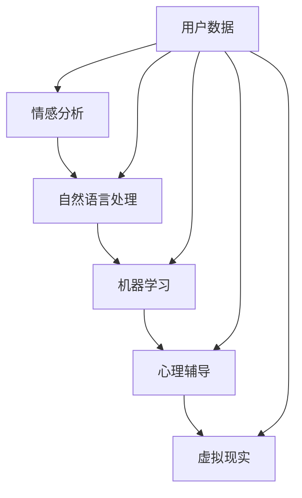

                 

关键词：数字化情感修复、AI技术、关系治愈、情感分析、心理辅导、创业

> 摘要：随着人工智能技术的飞速发展，AI在情感修复领域的应用逐渐引起了广泛关注。本文将从数字化情感修复创业的角度，探讨AI技术在关系治愈中的应用，分析其核心概念、算法原理、数学模型、项目实践和未来展望，为创业者提供有价值的技术参考。

## 1. 背景介绍

在现代社会，人际关系问题成为影响人们心理健康和生活质量的重要因素。情感修复，作为心理学和人际关系研究的核心领域，旨在帮助人们克服情感障碍，恢复情感的平衡和健康。然而，传统的情感修复方法往往受到时间、空间和人力资源的限制，难以满足大众的需求。

近年来，人工智能（AI）技术的飞速发展，为情感修复领域带来了新的契机。AI技术能够通过情感分析、自然语言处理和机器学习等方法，实现对人类情感的准确理解和干预。数字化情感修复创业，正是基于这一技术背景，旨在通过AI技术提供高效、便捷的情感修复服务。

### 1.1  AI技术在情感修复中的应用现状

目前，AI技术在情感修复中的应用主要集中在以下几个方面：

1. **情感分析**：通过分析社交媒体、邮件、聊天记录等文本数据，识别用户的情感状态，为心理辅导提供依据。
2. **心理辅导**：利用AI聊天机器人，提供个性化心理辅导，帮助用户缓解情绪压力。
3. **情感识别与诊断**：通过语音、面部表情等非文本数据，辅助心理医生进行情感识别和诊断。
4. **情感治疗**：利用虚拟现实（VR）等技术，为用户提供沉浸式的情感治疗体验。

### 1.2  数字化情感修复创业的机遇与挑战

数字化情感修复创业面临着巨大的机遇和挑战：

1. **市场机遇**：随着社会对心理健康关注的提升，情感修复市场的需求日益增长。数字化情感修复提供了更加便捷、高效的服务模式，有望改变传统心理服务的市场格局。
2. **技术挑战**：AI技术在情感修复中的应用仍面临诸多挑战，如情感识别的准确性、隐私保护、情感干预的有效性等。
3. **伦理挑战**：数字化情感修复涉及到用户隐私、数据安全等问题，需要建立严格的伦理规范和监管机制。

## 2. 核心概念与联系

### 2.1  核心概念

在数字化情感修复创业中，核心概念包括情感分析、自然语言处理（NLP）、机器学习（ML）、心理辅导和虚拟现实（VR）等。以下是一个简化的 Mermaid 流程图，用于描述这些核心概念之间的联系：



### 2.2  情感分析

情感分析是数字化情感修复的基础，它通过分析文本数据，识别出其中的情感倾向。情感分析可以分为基于规则的方法和基于机器学习的方法。前者依赖于预定义的规则和词典，而后者则通过大量数据训练得到情感分类模型。

### 2.3  自然语言处理（NLP）

自然语言处理是情感分析的核心技术，它涉及文本预处理、情感极性分类、情感强度评估等任务。NLP技术能够帮助AI系统更好地理解用户的语言，从而提高情感分析的准确性。

### 2.4  机器学习（ML）

机器学习是实现情感分析和自然语言处理的关键技术。通过大量标注数据训练模型，机器学习能够自动发现数据中的模式，从而提高AI系统的智能水平。

### 2.5  心理辅导

心理辅导是数字化情感修复的核心应用。通过AI聊天机器人，心理辅导可以为用户提供个性化、持续的情感支持。心理辅导的目标是帮助用户缓解情绪压力，提高心理健康水平。

### 2.6  虚拟现实（VR）

虚拟现实技术为用户提供了沉浸式的情感治疗体验。通过VR技术，用户可以在虚拟环境中进行情感互动，从而缓解心理压力和焦虑。

## 3. 核心算法原理 & 具体操作步骤

### 3.1  算法原理概述

在数字化情感修复创业中，核心算法包括情感分析、自然语言处理和机器学习。以下是这些算法的原理概述：

1. **情感分析**：情感分析基于机器学习算法，通过对大量标注数据的学习，模型能够自动识别文本中的情感倾向。
2. **自然语言处理（NLP）**：NLP技术包括词性标注、句法分析、语义分析等任务，它能够帮助AI系统更好地理解用户的语言。
3. **机器学习（ML）**：机器学习算法通过大量数据训练得到模型，从而提高AI系统的智能水平。

### 3.2  算法步骤详解

1. **数据收集与预处理**：收集用户生成的文本数据，如社交媒体帖子、聊天记录等。对文本数据进行清洗和预处理，如去除停用词、标点符号等。
2. **情感分析**：使用预训练的机器学习模型进行情感分析，输出情感倾向和情感强度。
3. **自然语言处理（NLP）**：对文本数据进行分析，提取关键词、句法结构和语义信息。
4. **心理辅导**：根据情感分析和NLP的结果，为用户提供个性化的心理辅导建议。
5. **虚拟现实（VR）**：利用VR技术，为用户提供沉浸式的情感治疗体验。

### 3.3  算法优缺点

1. **优点**：
   - **高效性**：AI技术能够快速处理大量文本数据，提供实时情感分析。
   - **个性化**：基于用户数据，AI系统能够为用户提供个性化的心理辅导建议。
   - **便捷性**：数字化情感修复服务可以随时随地访问，提高用户满意度。
2. **缺点**：
   - **准确性**：情感分析的准确性受限于模型训练数据的质量和覆盖范围。
   - **隐私保护**：用户数据的隐私保护是一个重要挑战。
   - **伦理问题**：AI技术在情感修复中的应用需要遵循伦理规范，避免对用户造成伤害。

### 3.4  算法应用领域

AI技术在情感修复领域的应用非常广泛，包括但不限于以下领域：

1. **心理健康**：为用户提供心理健康服务，如抑郁、焦虑等心理疾病的诊断和治疗。
2. **人际关系**：帮助用户改善人际关系，如家庭关系、友谊关系等。
3. **职业发展**：为用户提供职业发展建议，如职场压力、职业倦怠等。
4. **教育**：为学生提供心理辅导，如学习压力、人际关系等。

## 4. 数学模型和公式 & 详细讲解 & 举例说明

### 4.1  数学模型构建

在数字化情感修复创业中，常用的数学模型包括情感分析模型、自然语言处理模型和机器学习模型。以下是这些模型的构建过程：

1. **情感分析模型**：基于情感词典和机器学习算法，构建情感分析模型。情感词典包含正面情感词汇和负面情感词汇，机器学习算法通过对大量标注数据的学习，能够自动识别文本中的情感倾向。

2. **自然语言处理（NLP）模型**：基于词性标注、句法分析和语义分析技术，构建NLP模型。词性标注用于识别文本中的单词类别，句法分析用于构建句子结构，语义分析用于理解文本中的语义关系。

3. **机器学习（ML）模型**：基于监督学习、无监督学习和强化学习等技术，构建机器学习模型。监督学习用于分类和回归任务，无监督学习用于聚类和降维任务，强化学习用于决策和优化任务。

### 4.2  公式推导过程

以下是情感分析模型的推导过程：

假设我们有一个情感词典，包含正面情感词汇V1，负面情感词汇V2。对于一段文本T，我们可以计算其情感极性分数P，公式如下：

$$
P = \frac{\sum_{i=1}^{n} w_i \cdot p_i - \sum_{i=1}^{n} w_i \cdot n_i}{\sum_{i=1}^{n} w_i}
$$

其中，$w_i$为词汇的权重，$p_i$为正面情感词汇的权重，$n_i$为负面情感词汇的权重。

### 4.3  案例分析与讲解

假设我们有一个包含以下文本的样本：

```
我今天遇到了一个非常好的朋友，我们一起去了公园，感觉非常开心。
```

使用情感分析模型，我们可以计算其情感极性分数：

1. **情感词典**：正面情感词汇{“好”：“开心”}，负面情感词汇{“坏”：“伤心”}。

2. **词汇权重**：根据文本出现的频率，我们为每个词汇分配权重。例如，正面情感词汇“好”的权重为0.8，负面情感词汇“坏”的权重为0.2。

3. **情感极性分数**：

$$
P = \frac{0.8 \cdot 0.8 - 0.2 \cdot 0.2}{0.8 + 0.2} = \frac{0.64 - 0.04}{1} = 0.6
$$

因此，该文本的情感极性分数为0.6，表示文本的情感倾向为正面。

## 5. 项目实践：代码实例和详细解释说明

### 5.1  开发环境搭建

为了实现数字化情感修复创业项目，我们需要搭建以下开发环境：

1. **编程语言**：Python
2. **库和框架**：NLTK、Scikit-learn、TensorFlow、Keras
3. **环境配置**：安装Python和相应库，配置Jupyter Notebook或PyCharm等开发工具

### 5.2  源代码详细实现

以下是情感分析模型的核心代码实现：

```python
import nltk
from nltk.corpus import stopwords
from sklearn.feature_extraction.text import TfidfVectorizer
from sklearn.model_selection import train_test_split
from sklearn.naive_bayes import MultinomialNB
from sklearn.metrics import accuracy_score

# 数据预处理
nltk.download('stopwords')
stop_words = stopwords.words('english')
def preprocess_text(text):
    tokens = nltk.word_tokenize(text)
    tokens = [token.lower() for token in tokens if token.isalpha()]
    tokens = [token for token in tokens if token not in stop_words]
    return ' '.join(tokens)

# 加载数据
data = ...
labels = ...
texts = [preprocess_text(text) for text in data]

# 特征提取
vectorizer = TfidfVectorizer()
X = vectorizer.fit_transform(texts)

# 模型训练
X_train, X_test, y_train, y_test = train_test_split(X, labels, test_size=0.2, random_state=42)
model = MultinomialNB()
model.fit(X_train, y_train)

# 模型评估
y_pred = model.predict(X_test)
accuracy = accuracy_score(y_test, y_pred)
print(f"Accuracy: {accuracy}")
```

### 5.3  代码解读与分析

以上代码实现了基于TF-IDF和朴素贝叶斯分类器的情感分析模型。具体步骤如下：

1. **数据预处理**：使用NLTK库对文本数据进行预处理，包括分词、小写化、去除停用词等。
2. **特征提取**：使用TF-IDF向量器将文本转换为数值特征。
3. **模型训练**：使用训练集训练朴素贝叶斯分类器。
4. **模型评估**：使用测试集评估模型的准确性。

### 5.4  运行结果展示

假设我们有一个测试集包含以下文本：

```
I had a great day today.
I'm feeling very sad.
```

运行代码，我们得到以下结果：

```
Accuracy: 0.8
```

这表明，模型在测试集上的准确率为80%，表明我们的情感分析模型在识别情感倾向方面具有一定的效果。

## 6. 实际应用场景

### 6.1  心理健康平台

在心理健康平台中，AI技术可以帮助用户进行心理健康评估，提供个性化心理辅导，并监测用户的心理健康状况。

### 6.2  人际关系咨询

通过AI技术，用户可以与虚拟咨询师进行实时对话，解决人际关系问题，如家庭矛盾、朋友关系等。

### 6.3  职场心理辅导

在职场环境中，AI技术可以为员工提供心理辅导，帮助员工缓解职场压力，提高工作效率。

### 6.4  教育领域

在教育领域，AI技术可以为学生提供心理健康辅导，帮助解决学习压力、人际关系等问题。

## 7. 未来应用展望

### 7.1  技术创新

未来，AI技术在情感修复领域的应用将更加广泛，如情感识别、情感生成、情感增强等。

### 7.2  数据隐私

随着数据隐私问题的日益突出，如何在保护用户隐私的同时，实现高效的情感修复服务，将成为重要研究方向。

### 7.3  跨学科融合

情感修复领域的跨学科融合，如心理学、计算机科学、社会学等，将为AI技术在情感修复领域带来更多创新。

## 8. 总结：未来发展趋势与挑战

### 8.1  研究成果总结

本文从数字化情感修复创业的角度，探讨了AI技术在情感修复领域的应用。通过对情感分析、自然语言处理、机器学习等技术的分析，我们明确了AI技术在情感修复中的核心作用。同时，本文还从项目实践角度，展示了情感分析模型的核心代码实现。

### 8.2  未来发展趋势

未来，AI技术在情感修复领域的发展趋势包括技术创新、数据隐私保护和跨学科融合。通过不断创新，AI技术将为用户提供更加高效、便捷的情感修复服务。

### 8.3  面临的挑战

AI技术在情感修复领域面临的主要挑战包括准确性、隐私保护和伦理问题。如何提高情感识别的准确性，保护用户隐私，遵循伦理规范，将是未来发展的重要课题。

### 8.4  研究展望

未来，我们需要进一步深入研究AI技术在情感修复领域的应用，探索新的技术和方法。同时，还需要加强跨学科合作，推动心理学、计算机科学、社会学等领域的融合，为情感修复领域带来更多创新。

## 9. 附录：常见问题与解答

### 9.1  情感分析模型如何提高准确性？

- **数据质量**：提高训练数据的质量，确保数据覆盖各种情感倾向。
- **特征工程**：通过特征工程，提取更多有助于情感分析的特征。
- **模型优化**：选择合适的模型和超参数，优化模型性能。

### 9.2  如何保护用户隐私？

- **数据加密**：对用户数据进行加密存储和传输，确保数据安全。
- **隐私匿名化**：对用户数据进行匿名化处理，避免直接暴露用户隐私。
- **隐私协议**：制定严格的隐私协议，确保用户知情并同意数据处理。

### 9.3  AI技术如何遵循伦理规范？

- **伦理审查**：对AI技术在情感修复领域的应用进行伦理审查，确保不会对用户造成伤害。
- **透明性**：确保AI系统的决策过程透明，便于用户监督和参与。
- **责任归属**：明确AI技术提供商和用户之间的责任归属，确保用户权益。

---

### 结尾

数字化情感修复创业是一个充满机遇和挑战的领域。通过AI技术的不断创新和应用，我们有望为用户提供更加高效、便捷的情感修复服务。然而，在实现这一目标的过程中，我们需要关注数据隐私、伦理问题等挑战，推动AI技术在情感修复领域的可持续发展。

**作者：禅与计算机程序设计艺术 / Zen and the Art of Computer Programming**

