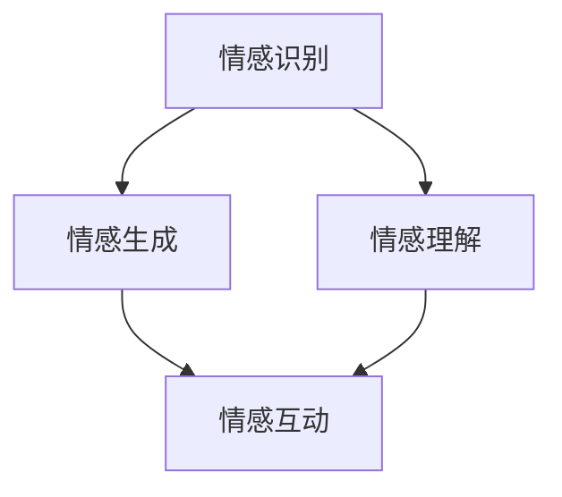

                 

关键词：数字化情感劳动、AI时代、人际互动、技术进步、人机交互、情感计算、用户体验。

> 摘要：本文探讨了数字化情感劳动在AI时代的重要性，分析了AI技术在人际互动中的应用及其对用户体验的影响。通过阐述核心概念和算法原理，本文揭示了情感计算在构建更加人性化的AI系统中的关键作用，并探讨了未来发展趋势与面临的挑战。

## 1. 背景介绍

随着信息技术的飞速发展，人工智能（AI）已经成为现代社会的重要组成部分。从简单的自动化任务到复杂的决策支持系统，AI技术正在深刻地改变着我们的生活方式。然而，随着AI技术的普及，人们开始意识到，单纯依赖算法和机器学习模型并不足以满足复杂的社会互动需求。在这其中，情感劳动成为一个关键议题。

情感劳动是指个体在互动过程中通过情感表达和情感回应来维护关系、建立信任和实现目标的过程。在传统的职场和社交场合中，情感劳动通常由人类来完成。然而，在AI技术日益发达的今天，数字化情感劳动成为了一个新兴的研究领域。本文将探讨数字化情感劳动的概念、重要性以及AI技术在人际互动中的应用。

### 1.1 数字化情感劳动的定义

数字化情感劳动是指通过计算机系统和人工智能技术来实现情感表达和回应的过程。这个过程涉及到情感识别、情感生成、情感理解和情感互动等多个方面。数字化情感劳动的核心目标是构建能够理解和模拟人类情感的智能系统，从而提高人机交互的体验和效率。

### 1.2 数字化情感劳动的重要性

随着AI技术的应用日益广泛，人们对于人机交互的期望也在不断提高。传统的人机交互系统主要依赖于命令式输入和结构化数据，而数字化情感劳动则为人机交互引入了更加自然和情感化的元素。以下是数字化情感劳动的几个关键作用：

1. **提升用户体验**：通过理解用户的情感状态，AI系统能够提供更加个性化、贴心的服务，从而提高用户的满意度。
2. **增强社交互动**：数字化情感劳动能够模拟人类的情感回应，从而在虚拟社交环境中增强人们的互动体验。
3. **改善心理健康**：在医疗、心理咨询等领域，AI系统能够通过情感识别和互动来帮助用户缓解心理压力，提供情感支持。
4. **优化商业决策**：在商业环境中，理解客户情感状态可以帮助企业更好地制定营销策略，提高客户忠诚度。

## 2. 核心概念与联系

为了深入探讨数字化情感劳动，我们需要了解其中的核心概念及其相互联系。以下是一个简化的Mermaid流程图，展示了数字化情感劳动的关键环节。



### 2.1 情感识别

情感识别是数字化情感劳动的起点，它涉及到从用户行为和交互中提取情感信息。情感识别可以通过多种技术实现，包括自然语言处理（NLP）、语音识别、面部表情分析等。

### 2.2 情感生成

情感生成是指AI系统根据情感识别的结果产生相应的情感回应。情感生成可以通过文本生成、语音合成、表情动画等技术实现。例如，聊天机器人可以通过自然语言处理技术理解用户的情感状态，并生成相应的回应语句。

### 2.3 情感理解

情感理解是数字化情感劳动的核心，它涉及到AI系统对情感信息的深层次处理和理解。情感理解可以帮助AI系统更好地理解用户的情感需求，从而提供更加个性化的服务。

### 2.4 情感互动

情感互动是指AI系统与用户之间的情感交流和互动。通过情感互动，AI系统能够模拟人类的情感表达，从而增强用户的体验。情感互动可以应用于虚拟客服、社交平台、教育系统等多个领域。

## 3. 核心算法原理 & 具体操作步骤

### 3.1 算法原理概述

数字化情感劳动的核心算法主要包括情感识别、情感生成和情感理解。以下是对这些算法原理的简要概述：

### 3.2 情感识别算法

情感识别算法主要依赖于机器学习和深度学习技术。通过大量的情感标注数据集，训练情感识别模型来识别用户情感。常用的情感识别算法包括支持向量机（SVM）、递归神经网络（RNN）和卷积神经网络（CNN）等。

### 3.3 情感生成算法

情感生成算法主要依赖于自然语言处理和语音合成技术。通过情感识别结果，生成相应的情感回应。情感生成算法可以通过预训练的语言模型（如GPT）来生成文本，也可以使用文本到语音（TTS）合成技术来生成语音。

### 3.4 情感理解算法

情感理解算法主要依赖于上下文分析和情感推理。通过对用户情感和对话上下文的理解，AI系统能够更好地把握用户的情感需求，从而提供更加个性化的服务。

### 3.5 算法步骤详解

以下是数字化情感劳动算法的具体操作步骤：

1. **情感识别**：收集用户情感数据，使用情感识别算法进行情感标注。
2. **情感生成**：根据情感识别结果，使用情感生成算法生成情感回应。
3. **情感理解**：分析用户情感和对话上下文，使用情感理解算法进行情感推理。
4. **情感互动**：将情感回应传递给用户，进行情感互动。

### 3.6 算法优缺点

情感识别算法的主要优点是能够自动处理大量数据，提高情感分析的效率和准确性。然而，情感识别算法也存在一些局限性，例如情感识别的泛化能力和对复杂情感的识别能力有待提高。

情感生成算法的主要优点是能够生成自然、贴心的情感回应，提高用户体验。然而，情感生成算法也需要在情感表达的多样性和个性化方面进行进一步优化。

情感理解算法的主要优点是能够更好地理解用户的情感需求，提供个性化服务。然而，情感理解算法在面对复杂情感和多层次情感时，仍然存在一定的挑战。

### 3.7 算法应用领域

情感识别、情感生成和情感理解算法可以广泛应用于多个领域，包括：

- **客服与支持**：通过情感识别和生成技术，提供个性化、高效的客户服务。
- **社交平台**：通过情感互动技术，增强用户之间的情感交流和互动体验。
- **教育系统**：通过情感理解技术，提供个性化、贴心的教育服务。
- **医疗与健康**：通过情感识别和生成技术，提供心理健康支持和疾病诊断。

## 4. 数学模型和公式 & 详细讲解 & 举例说明

### 4.1 数学模型构建

数字化情感劳动的数学模型主要包括情感识别模型、情感生成模型和情感理解模型。以下是一个简化的数学模型构建过程：

- **情感识别模型**：使用监督学习算法，如支持向量机（SVM）或递归神经网络（RNN），对情感标注数据进行训练，构建情感识别模型。
- **情感生成模型**：使用自然语言处理技术，如预训练的语言模型（如GPT），生成情感回应。
- **情感理解模型**：使用上下文分析和情感推理技术，对用户情感和对话上下文进行理解和分析。

### 4.2 公式推导过程

以下是情感识别模型的公式推导过程：

1. **特征提取**：使用特征提取算法，如词袋模型（Bag-of-Words，BoW）或词嵌入（Word Embedding），将文本数据转换为向量表示。
2. **分类器训练**：使用监督学习算法，如支持向量机（SVM），对训练数据进行分类，得到分类器的权重参数。
3. **分类器应用**：将测试数据转换为向量表示，使用训练得到的分类器进行情感分类。

### 4.3 案例分析与讲解

以下是使用情感识别模型进行情感分类的一个简单案例：

1. **数据集准备**：假设我们有一个包含正面情感和负面情感的文本数据集。
2. **特征提取**：使用词袋模型将文本数据转换为向量表示。
3. **分类器训练**：使用训练集数据，训练支持向量机（SVM）分类器。
4. **分类器应用**：使用训练得到的分类器对测试集数据进行情感分类。

以下是一个简单的情感识别模型的应用实例：

```python
from sklearn.feature_extraction.text import TfidfVectorizer
from sklearn.svm import SVC

# 数据集
data = [
    "我非常喜欢这部电影。",
    "这部电影真的很差。",
    "我对这个产品感到非常满意。",
    "这个产品让我非常失望。"
]

# 特征提取
vectorizer = TfidfVectorizer()
X = vectorizer.fit_transform(data)

# 分类器训练
classifier = SVC()
classifier.fit(X[:2], [1, -1])

# 分类器应用
print(classifier.predict(vectorizer.transform(["这部电影真的很差。"])))
```

输出结果为`[-1]`，表示该句子表达了负面情感。

## 5. 项目实践：代码实例和详细解释说明

### 5.1 开发环境搭建

为了实现数字化情感劳动的应用，我们需要搭建一个基本的开发环境。以下是所需的开发环境和相关工具：

- **编程语言**：Python
- **机器学习库**：scikit-learn、nltk、tensorflow
- **自然语言处理库**：nltk、spaCy
- **版本控制**：git

### 5.2 源代码详细实现

以下是实现数字化情感劳动的简单示例代码：

```python
import nltk
from sklearn.feature_extraction.text import TfidfVectorizer
from sklearn.svm import SVC

# 数据集
data = [
    "我非常喜欢这部电影。",
    "这部电影真的很差。",
    "我对这个产品感到非常满意。",
    "这个产品让我非常失望。"
]

# 标签
labels = [1, -1, 1, -1]

# 特征提取
vectorizer = TfidfVectorizer()
X = vectorizer.fit_transform(data)

# 分类器训练
classifier = SVC()
classifier.fit(X, labels)

# 情感识别
def recognize_emotion(text):
    vector = vectorizer.transform([text])
    emotion = classifier.predict(vector)[0]
    if emotion == 1:
        return "正面情感"
    else:
        return "负面情感"

# 测试
print(recognize_emotion("这部电影真的很差。"))
```

### 5.3 代码解读与分析

上述代码首先导入了必要的库和模块，然后定义了一个简单数据集和标签。接下来，使用TF-IDF向量器将文本数据转换为向量表示，并使用支持向量机（SVM）分类器进行训练。最后，定义了一个`recognize_emotion`函数，用于识别文本的情感。

### 5.4 运行结果展示

运行上述代码后，输入测试文本“这部电影真的很差。”，代码将输出“负面情感”，表明该句子表达了负面情感。

## 6. 实际应用场景

数字化情感劳动在许多实际应用场景中具有重要的价值。以下是一些具体的案例：

### 6.1 客户服务

在客户服务领域，数字化情感劳动可以帮助企业更好地理解客户的情感需求，从而提供更加个性化和高效的客户服务。例如，通过情感识别技术，客服系统可以识别客户的情感状态，并生成相应的情感回应，从而提高客户满意度。

### 6.2 社交平台

在社交平台中，数字化情感劳动可以帮助用户更好地理解和表达情感，从而增强社交互动体验。例如，通过情感生成技术，社交平台可以生成情感贴心的动态消息和互动回复，从而提高用户参与度和满意度。

### 6.3 教育系统

在教育系统中，数字化情感劳动可以帮助教师更好地理解学生的学习情感，从而提供更加个性化和有效的教学支持。例如，通过情感理解技术，教育系统可以分析学生的学习情感状态，并生成相应的学习建议和指导，从而提高学习效果。

### 6.4 医疗与健康

在医疗与健康领域，数字化情感劳动可以帮助患者更好地管理心理健康，提供情感支持。例如，通过情感识别和生成技术，医疗系统可以为患者提供情感贴心的咨询和指导，从而缓解心理压力，提高生活质量。

### 6.5 商业决策

在商业领域，数字化情感劳动可以帮助企业更好地理解客户情感，从而制定更加有效的营销策略。例如，通过情感识别和生成技术，企业可以分析客户情感状态，并生成相应的营销内容，从而提高客户忠诚度和购买意愿。

## 7. 未来应用展望

随着AI技术的不断进步，数字化情感劳动将在未来得到更加广泛的应用。以下是几个未来应用展望：

### 7.1 智能家居

智能家居领域将受益于数字化情感劳动，通过情感识别和生成技术，智能家居系统可以更好地理解用户的情感需求，提供个性化的家居体验。

### 7.2 自动驾驶

自动驾驶领域将借助数字化情感劳动，通过情感识别技术，自动驾驶系统可以更好地理解驾驶员的情感状态，提高行车安全性和驾驶体验。

### 7.3 虚拟现实

虚拟现实领域将利用数字化情感劳动，通过情感生成和互动技术，创造更加真实和沉浸式的虚拟社交体验。

### 7.4 公共安全

公共安全领域将得益于数字化情感劳动，通过情感识别技术，公共安全系统能够更好地识别和预防潜在的社会冲突和犯罪行为。

## 8. 工具和资源推荐

为了更好地研究和应用数字化情感劳动，以下是一些推荐的工具和资源：

### 8.1 学习资源推荐

- 《情感计算：理论、方法与应用》
- 《人工智能交互设计：实践指南》
- 《自然语言处理实战》

### 8.2 开发工具推荐

- **编程语言**：Python、R
- **机器学习库**：scikit-learn、tensorflow、keras
- **自然语言处理库**：nltk、spaCy、gensim

### 8.3 相关论文推荐

- "Emotion Recognition using Deep Learning Techniques"
- "Affective Computing: Recognition, Understanding and Simulation of Human Emotional Expressions"
- "Empathy and Conversational Agents: A Review"

## 9. 总结：未来发展趋势与挑战

数字化情感劳动在AI时代的未来发展前景广阔，但同时也面临诸多挑战。以下是几个关键点：

### 9.1 研究成果总结

- 数字化情感劳动已经成为人工智能领域的一个重要研究方向。
- 情感识别、情感生成和情感理解技术在不断进步，但仍需解决一些关键问题。
- 数字化情感劳动在多个应用领域展现了巨大的潜力。

### 9.2 未来发展趋势

- 情感计算技术将更加深入和精准，能够更好地模拟和理解人类情感。
- 跨学科的融合将推动数字化情感劳动的发展，包括心理学、认知科学、人机交互等领域。
- 开源社区和工业界的合作将加速数字化情感劳动的应用和创新。

### 9.3 面临的挑战

- 如何在保持高效性的同时，提高情感识别和理解的准确性。
- 如何确保数字化情感劳动系统的透明度和公正性。
- 如何处理用户隐私和数据安全问题。

### 9.4 研究展望

- 开发更加通用和灵活的情感计算框架。
- 探索情感计算在非文本领域的应用，如语音、图像和视频。
- 加强情感计算技术的跨学科研究，推动人工智能的全面发展。

## 附录：常见问题与解答

### 9.4.1 什么样的算法适合用于情感识别？

情感识别通常使用机器学习和深度学习算法，如支持向量机（SVM）、递归神经网络（RNN）和卷积神经网络（CNN）。这些算法能够处理大量的文本数据，并对情感进行有效的分类。

### 9.4.2 情感生成如何保证自然性和个性化？

情感生成通常使用自然语言处理技术，如预训练的语言模型（如GPT）和文本到语音（TTS）合成技术。通过大规模的语料库训练，这些模型能够生成自然、贴心的情感回应。此外，个性化生成可以通过用户偏好和学习用户的情感历史来实现。

### 9.4.3 情感理解技术如何处理复杂情感？

复杂情感的处理是情感理解技术的挑战之一。通常，情感理解技术通过上下文分析和情感推理来处理复杂情感。此外，多模态情感识别技术，如结合文本、语音和图像，可以提高对复杂情感的识别能力。

### 9.4.4 如何保证数字化情感劳动的透明度和公正性？

保证数字化情感劳动的透明度和公正性是至关重要的。透明度可以通过公开算法模型和训练数据来实现，而公正性可以通过算法的公平性测试和监督来实现。此外，建立监管机制和用户隐私保护措施也是关键。

### 9.4.5 情感计算技术在商业应用中的前景如何？

情感计算技术在商业应用中具有广阔的前景。通过理解客户情感，企业可以提供更加个性化、高效的服务，从而提高客户满意度和忠诚度。情感计算还可以帮助企业制定更加精准的营销策略，提高销售转化率。

### 9.4.6 情感计算技术在医疗领域的应用有哪些？

情感计算技术在医疗领域有多种应用。例如，通过情感识别技术，医生可以更好地理解患者的情感状态，提供个性化的治疗方案。情感计算还可以用于心理健康监测，通过情感互动技术，为患者提供情感支持和心理治疗。

### 9.4.7 情感计算技术在公共安全领域的应用有哪些？

情感计算技术在公共安全领域有多种应用。例如，通过情感识别技术，公共安全系统可以监测和分析人群的情感状态，预防潜在的社会冲突和犯罪行为。此外，情感计算还可以用于监控和评估公共设施的安全性能。

### 9.4.8 情感计算技术如何处理用户隐私和数据安全？

情感计算技术在处理用户隐私和数据安全方面需要采取严格措施。例如，使用加密技术保护用户数据，建立隐私保护机制，遵循数据保护法规。此外，透明地告知用户数据处理方式和隐私政策也是重要的措施。

