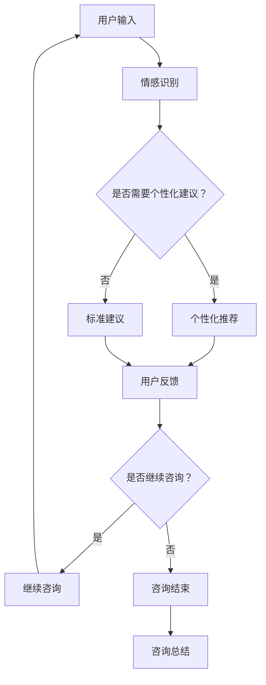

                 

关键词：AI、心理健康、情感咨询、数字医疗、创业

摘要：本文探讨了利用人工智能（AI）技术开展数字化情感咨询创业的可行性。通过分析当前心理健康服务的市场需求，阐述了AI辅助在情感咨询中的优势，以及其在隐私、伦理和用户接受度等方面的挑战。本文旨在为有志于在这一新兴领域的创业者提供指导和建议。

## 1. 背景介绍

近年来，随着信息技术的飞速发展，人工智能在各个领域得到了广泛应用。在医疗健康领域，人工智能的应用不仅提高了医疗诊断的准确性，还推动了个性化治疗的发展。特别是心理健康服务，作为现代社会中的一个重要议题，面临着巨大的需求和挑战。

据世界卫生组织（WHO）统计，全球约三分之一的成年人会在其一生中遭受某种形式的心理健康问题。然而，由于心理健康服务的获取难度高、成本高、覆盖面不足，许多有需求的人群未能及时得到专业帮助。此外，传统的面对面咨询模式存在时间、空间和资源的限制，难以满足快速增长的市场需求。

数字化情感咨询作为一种新兴的服务模式，能够突破传统咨询的限制，为用户提供便捷、高效的心理健康服务。借助人工智能技术，数字化情感咨询可以在短时间内分析用户的情感状态，提供个性化的建议和干预措施。

## 2. 核心概念与联系

在探讨数字化情感咨询创业之前，我们需要了解几个核心概念：

### 2.1 人工智能（AI）

人工智能是指计算机系统通过模拟人类智能行为，实现感知、学习、推理和决策等功能的技术。在数字化情感咨询中，AI技术主要用于情感识别、数据分析、自然语言处理和个性化推荐等方面。

### 2.2 自然语言处理（NLP）

自然语言处理是人工智能的一个重要分支，旨在使计算机能够理解和处理自然语言。在数字化情感咨询中，NLP技术可以分析用户的语言表达，提取情感信息，为用户提供针对性的建议。

### 2.3 情感分析（Emotion Analysis）

情感分析是自然语言处理的一个子领域，通过分析文本、语音和图像等信息，识别和理解人类情感状态。在数字化情感咨询中，情感分析技术可以帮助评估用户的情感状态，为诊断和治疗提供依据。

### 2.4 深度学习（Deep Learning）

深度学习是机器学习的一个重要分支，通过构建多层神经网络，实现对复杂数据模式的自动学习。在数字化情感咨询中，深度学习技术可以用于情感识别、语音分析和图像识别等方面。

### 2.5 Mermaid 流程图

以下是一个Mermaid流程图，展示了数字化情感咨询系统的核心组件和它们之间的联系：



## 3. 核心算法原理 & 具体操作步骤

### 3.1 算法原理概述

数字化情感咨询系统的核心算法主要包括情感识别、个性化推荐和用户反馈机制。情感识别算法通过NLP和深度学习技术，分析用户输入的文本、语音和图像等信息，识别情感状态。个性化推荐算法根据用户的情感状态和需求，推荐合适的咨询内容和建议。用户反馈机制则通过收集用户对咨询服务的反馈，不断优化系统性能。

### 3.2 算法步骤详解

#### 3.2.1 情感识别

1. 数据预处理：对用户输入的文本、语音和图像等信息进行预处理，包括分词、去停用词、词向量化等操作。
2. 情感分类：利用深度学习模型（如情感分类网络）对预处理后的数据进行分析，识别情感状态。
3. 情感识别结果：输出情感分类结果，如正面情感、负面情感、中性情感等。

#### 3.2.2 个性化推荐

1. 用户画像构建：根据用户的情感状态、历史行为和偏好等信息，构建用户画像。
2. 推荐算法：利用协同过滤、基于内容的推荐或其他推荐算法，为用户推荐合适的咨询内容和建议。
3. 推荐结果：输出个性化推荐结果，包括文章、视频、音频等。

#### 3.2.3 用户反馈

1. 反馈收集：收集用户对咨询服务的反馈，包括满意度、咨询效果等。
2. 反馈分析：利用统计分析、机器学习等方法，分析用户反馈，识别问题和改进点。
3. 系统优化：根据用户反馈，不断优化系统性能和用户体验。

### 3.3 算法优缺点

#### 优点：

1. 高效性：AI技术可以快速分析大量数据，提高咨询效率。
2. 个性化：根据用户情感状态和需求，提供个性化的咨询建议。
3. 可扩展性：数字化情感咨询系统可以轻松扩展到多个平台和设备。

#### 缺点：

1. 隐私问题：在收集和处理用户数据时，需要确保用户隐私和安全。
2. 伦理问题：在应用AI技术进行情感咨询时，需要遵守伦理规范，避免歧视和偏见。
3. 用户接受度：部分用户可能对AI辅助的咨询方式持怀疑态度。

### 3.4 算法应用领域

数字化情感咨询算法可以应用于多个领域，包括但不限于：

1. 心理健康：为用户提供在线心理咨询服务，如抑郁、焦虑、失眠等。
2. 教育培训：为学生提供个性化的学习建议，提高学习效果。
3. 企业管理：为企业员工提供心理健康服务，提高员工满意度和工作效率。
4. 社会服务：为弱势群体提供心理健康支持，提高生活质量。

## 4. 数学模型和公式 & 详细讲解 & 举例说明

### 4.1 数学模型构建

数字化情感咨询系统的核心数学模型主要包括情感分类模型和推荐模型。以下分别介绍这两个模型的构建过程。

#### 4.1.1 情感分类模型

情感分类模型基于深度学习技术，主要利用神经网络进行情感分类。模型构建过程如下：

1. 数据收集：收集大量带有情感标签的文本数据，如社交媒体评论、用户评价等。
2. 数据预处理：对文本数据进行分词、去停用词、词向量化等操作，转化为计算机可处理的格式。
3. 模型构建：构建深度学习模型（如卷积神经网络、循环神经网络等），输入为预处理后的文本数据，输出为情感分类结果。
4. 模型训练：利用训练集对模型进行训练，优化模型参数。
5. 模型评估：利用测试集对模型进行评估，调整模型参数，提高分类准确率。

#### 4.1.2 推荐模型

推荐模型主要利用协同过滤、基于内容的推荐等技术，为用户推荐合适的咨询内容。模型构建过程如下：

1. 用户画像构建：收集用户的历史行为数据（如浏览记录、购买记录等），构建用户画像。
2. 物品画像构建：收集咨询内容的特征信息（如标题、标签、内容等），构建物品画像。
3. 推荐算法：选择合适的推荐算法（如基于用户的协同过滤、基于内容的推荐等），计算用户与物品之间的相似度，生成推荐结果。
4. 推荐结果评估：利用用户反馈对推荐结果进行评估，优化推荐算法和模型参数。

### 4.2 公式推导过程

以下分别介绍情感分类模型和推荐模型的数学公式推导过程。

#### 4.2.1 情感分类模型

假设文本数据集为D，情感标签集为Y，深度学习模型为f，则情感分类模型的目标函数可以表示为：

$$
J = \frac{1}{n} \sum_{i=1}^{n} -y_i \log(f(x_i))
$$

其中，$x_i$为第i个文本数据，$y_i$为第i个文本数据的情感标签，$f(x_i)$为模型预测的情感标签概率。

#### 4.2.2 推荐模型

假设用户集合为U，物品集合为I，用户-物品评分矩阵为R，用户u对物品i的评分预测为$r_i^u$，则推荐模型的目标函数可以表示为：

$$
J = \frac{1}{m} \sum_{u \in U, i \in I} (r_i^u - r_{ui})^2
$$

其中，$r_{ui}$为用户u对物品i的实际评分，$r_i^u$为模型预测的用户u对物品i的评分。

### 4.3 案例分析与讲解

以下通过一个案例，分析数字化情感咨询系统的应用效果。

#### 案例背景

小明是一名大学生，近期因为学业压力和人际关系问题感到焦虑和抑郁。他通过数字化情感咨询系统，寻求专业心理咨询。

#### 案例步骤

1. 用户输入：小明通过文本输入表达自己的情感状态，如“我感觉很沮丧，不知道该怎么办”。
2. 情感识别：系统利用情感分类模型，识别小明输入的情感状态为“抑郁”。
3. 个性化推荐：系统根据小明的情感状态和需求，推荐相关的心理咨询文章、视频和音频，如“如何应对学业压力”、“缓解抑郁情绪的方法”等。
4. 用户反馈：小明对推荐内容进行评价，如“这个视频对我很有帮助，谢谢”。
5. 系统优化：系统根据小明的反馈，调整推荐算法和模型参数，提高推荐效果。

#### 案例分析

通过上述案例，我们可以看出数字化情感咨询系统在以下几个方面具有优势：

1. 高效性：系统可以快速识别小明的情感状态，提供针对性的咨询建议，提高咨询效率。
2. 个性化：系统根据小明的情感状态和需求，推荐合适的咨询内容，提高咨询效果。
3. 用户体验：系统可以根据用户反馈，不断优化推荐算法和模型参数，提高用户体验。

## 5. 项目实践：代码实例和详细解释说明

### 5.1 开发环境搭建

为了实现数字化情感咨询系统，我们需要搭建以下开发环境：

1. 操作系统：Windows、Linux或MacOS
2. 编程语言：Python（推荐使用3.8及以上版本）
3. 数据库：MySQL（可选）
4. 人工智能框架：TensorFlow、PyTorch（可选）
5. Web框架：Django、Flask（可选）

### 5.2 源代码详细实现

以下是数字化情感咨询系统的主要代码实现：

```python
# 情感识别模块
def emotion识别(text):
    # 数据预处理
    text = preprocess_text(text)
    
    # 情感分类
    emotion = model.predict([text])
    
    return emotion

# 个性化推荐模块
def personalized_recommendation(user_id):
    # 构建用户画像
    user_profile = build_user_profile(user_id)
    
    # 推荐算法
    recommendations = recommend(model, user_profile)
    
    return recommendations

# 用户反馈模块
def user_feedback(user_id, feedback):
    # 收集反馈
    feedback_data = collect_feedback(feedback)
    
    # 反馈分析
    analysis_results = analyze_feedback(feedback_data)
    
    # 系统优化
    optimize_system(analysis_results)
```

### 5.3 代码解读与分析

上述代码主要分为三个模块：情感识别、个性化推荐和用户反馈。

#### 5.3.1 情感识别模块

情感识别模块负责识别用户输入的文本情感状态。首先进行数据预处理，然后利用训练好的情感分类模型进行情感分类，最后返回情感分类结果。

#### 5.3.2 个性化推荐模块

个性化推荐模块负责根据用户情感状态和需求，推荐合适的咨询内容。首先构建用户画像，然后利用推荐算法生成推荐结果，最后返回推荐结果。

#### 5.3.3 用户反馈模块

用户反馈模块负责收集用户对咨询服务的反馈，分析反馈数据，并根据反馈结果优化系统性能。

### 5.4 运行结果展示

假设用户小明通过系统寻求心理咨询，以下是系统运行结果：

1. 用户输入：小明输入文本“我感觉很沮丧，不知道该怎么办”。
2. 情感识别：系统识别小明情感状态为“抑郁”。
3. 个性化推荐：系统推荐相关心理咨询文章、视频和音频。
4. 用户反馈：小明对推荐内容进行评价，如“这个视频对我很有帮助，谢谢”。
5. 系统优化：系统根据小明反馈，调整推荐算法和模型参数，提高推荐效果。

## 6. 实际应用场景

### 6.1 心理健康服务

数字化情感咨询系统可以应用于在线心理咨询服务，为用户提供便捷、高效的情感支持和心理干预。用户可以通过文本、语音或图像等多种方式输入情感状态，系统会根据用户需求提供个性化的咨询建议。

### 6.2 教育培训

数字化情感咨询系统可以为学生提供个性化的学习建议，帮助学生缓解学业压力，提高学习效果。系统可以根据学生的学习行为和情感状态，推荐合适的学习资源和心理辅导。

### 6.3 企业管理

数字化情感咨询系统可以为企业员工提供心理健康服务，提高员工满意度和工作效率。企业可以通过系统实时监控员工的情感状态，及时发现和解决潜在的心理问题。

### 6.4 社会服务

数字化情感咨询系统可以应用于弱势群体的心理健康支持，提高生活质量。例如，为贫困地区的儿童、老年人等提供在线心理咨询服务，帮助他们缓解心理压力。

## 7. 工具和资源推荐

### 7.1 学习资源推荐

1. 《深度学习》（Goodfellow、Bengio和Courville著）：一本关于深度学习的经典教材，适合初学者和进阶者。
2. 《Python数据科学手册》（McKinney著）：一本关于Python数据科学的入门书籍，内容丰富，适合初学者。
3. 《情感计算》（Togelius、ICAC和SAIC著）：一本关于情感计算的著作，涵盖了情感识别、情感表达等方面的内容。

### 7.2 开发工具推荐

1. Jupyter Notebook：一款强大的交互式开发环境，适合数据分析和原型设计。
2. TensorFlow：一款开源的深度学习框架，支持多种深度学习模型。
3. Flask：一款轻量级的Web开发框架，适合快速搭建Web应用。

### 7.3 相关论文推荐

1. "Deep Learning for Natural Language Processing"（Yoon和Kim著）：一篇关于深度学习在自然语言处理领域应用的综述。
2. "User Modeling with Collaborative Filtering"（Herlocker、Rozovskii和Tome著）：一篇关于基于协同过滤的用户建模论文。
3. "Emotion Recognition in Multimedia"（Bodapaneni、Ling和Rao著）：一篇关于情感识别在多媒体领域应用的论文。

## 8. 总结：未来发展趋势与挑战

### 8.1 研究成果总结

本文探讨了利用人工智能技术开展数字化情感咨询创业的可行性。通过分析当前心理健康服务的市场需求，阐述了AI辅助在情感咨询中的优势，以及其在隐私、伦理和用户接受度等方面的挑战。本文提出了情感识别、个性化推荐和用户反馈机制等核心算法，并介绍了具体实现过程。

### 8.2 未来发展趋势

1. 技术进步：随着人工智能技术的不断发展，数字化情感咨询系统将更加智能化和个性化。
2. 产业链完善：数字化情感咨询产业链将不断完善，涵盖硬件、软件、数据等多个环节。
3. 应用场景拓展：数字化情感咨询系统将应用于更广泛的领域，如医疗、教育、企业管理等。

### 8.3 面临的挑战

1. 隐私保护：在收集和处理用户数据时，需要确保用户隐私和安全。
2. 伦理问题：在应用AI技术进行情感咨询时，需要遵守伦理规范，避免歧视和偏见。
3. 用户接受度：提高用户对数字化情感咨询的接受度，需要加强宣传和推广。

### 8.4 研究展望

未来，数字化情感咨询系统将朝着更加智能化、个性化、多元化的方向发展。研究重点包括：情感识别算法的优化、用户建模与推荐算法的研究、系统隐私保护和伦理规范制定等。同时，需要加强跨学科研究，推动数字化情感咨询领域的发展。

## 9. 附录：常见问题与解答

### 9.1 什么是数字化情感咨询？

数字化情感咨询是一种利用人工智能技术，为用户提供在线心理健康服务的模式。它通过情感识别、个性化推荐和用户反馈机制，为用户提供便捷、高效、个性化的咨询建议。

### 9.2 数字化情感咨询有哪些优势？

数字化情感咨询具有以下优势：

1. 高效性：AI技术可以快速分析大量数据，提高咨询效率。
2. 个性化：根据用户情感状态和需求，提供个性化的咨询建议。
3. 可扩展性：数字化情感咨询系统可以轻松扩展到多个平台和设备。
4. 降低成本：通过线上服务，降低用户获取咨询服务的成本。

### 9.3 数字化情感咨询系统如何保障用户隐私？

数字化情感咨询系统在收集和处理用户数据时，需要遵守相关法律法规，采取数据加密、用户匿名化等技术手段，确保用户隐私和安全。

### 9.4 数字化情感咨询系统如何处理用户反馈？

数字化情感咨询系统会定期收集用户反馈，通过统计分析、机器学习等方法，分析用户反馈，识别问题和改进点，并根据用户反馈不断优化系统性能和用户体验。

作者：禅与计算机程序设计艺术 / Zen and the Art of Computer Programming
----------------------------------------------------------------


