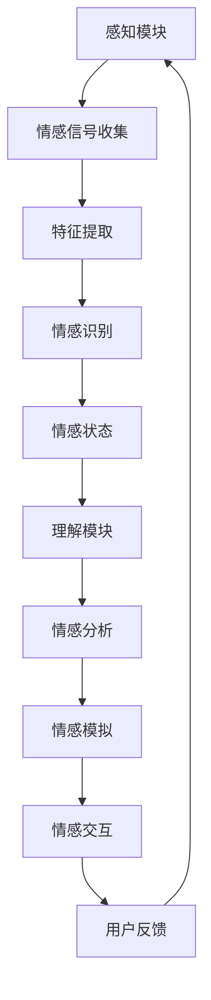

                 

随着人工智能技术的快速发展，AI不再仅仅是计算和逻辑处理工具，它开始触及人类情感的深处。数字化情感，这一概念应运而生，它探讨了人工智能如何模拟、理解和影响人类的情感体验。本文将深入探讨数字化情感的概念、AI技术如何实现这一目标，以及它对人类社会和个体生活的影响。

## 文章关键词

- 人工智能
- 情感计算
- 数字化情感
- 模拟情感
- 人机交互
- 情感识别
- 虚拟现实
- 机器学习

## 文章摘要

本文首先介绍了数字化情感的定义和背景，随后详细探讨了情感计算和机器学习在数字化情感中的作用。通过分析现有技术和应用实例，文章揭示了AI如何帮助人类更好地理解和处理情感。最后，文章展望了数字化情感的未来发展趋势和面临的挑战，以及AI技术在人类情感研究中的潜在贡献。

## 1. 背景介绍

### 1.1 情感的重要性

情感是人类生活中不可或缺的一部分，它不仅影响我们的心理状态，还直接影响我们的行为决策。情感的类型多种多样，包括快乐、悲伤、愤怒、恐惧和爱等，它们在个体的情感体验中起着核心作用。研究表明，情感对个体的幸福感、社会关系和工作表现都有深远的影响。

### 1.2 人工智能的发展

人工智能（AI）是计算机科学的一个分支，它旨在创建智能机器，使它们能够执行通常需要人类智能的任务，如视觉识别、语言理解、决策和推理。随着深度学习、自然语言处理和计算机视觉等技术的飞速发展，AI的应用范围越来越广泛。

### 1.3 情感计算的兴起

情感计算（Affective Computing）是近年来兴起的交叉学科，它结合了计算机科学、心理学和神经科学，旨在使计算机能够识别、理解和表达情感。情感计算的研究目标是通过模仿人类的情感机制，使计算机能够更好地与人类互动。

## 2. 核心概念与联系

### 2.1 情感计算的概念

情感计算涉及几个核心概念，包括情感识别、情感模拟和情感交互。情感识别是指通过分析人类的行为、语言和生理信号来识别情感状态。情感模拟是指计算机生成情感表达，以模拟人类情感体验。情感交互是指计算机与用户之间建立情感连接的过程。

### 2.2 情感计算架构

情感计算的架构通常包括三个主要模块：感知模块、理解模块和反应模块。感知模块负责收集情感信号，如面部表情、语音和生理信号。理解模块则对这些信号进行分析，以识别情感状态。反应模块根据理解模块的输出生成适当的响应。

### 2.3 Mermaid 流程图

以下是情感计算架构的Mermaid流程图：



## 3. 核心算法原理 & 具体操作步骤

### 3.1 算法原理概述

数字化情感的实现依赖于多种算法，其中最关键的是情感识别和情感模拟算法。情感识别算法通过分析人类行为和生理信号来识别情感状态，而情感模拟算法则生成与人类情感体验相匹配的计算机响应。

### 3.2 算法步骤详解

#### 3.2.1 情感识别算法

1. **信号收集**：收集用户的面部表情、语音和生理信号，如心率、皮肤电导等。
2. **特征提取**：从原始信号中提取有意义的特征，如面部表情的特征点、语音的频谱特征等。
3. **情感分类**：使用机器学习算法（如支持向量机、神经网络）对提取的特征进行分类，识别用户的情感状态。

#### 3.2.2 情感模拟算法

1. **情感生成**：根据情感识别结果，生成相应的情感响应，如改变语音的音调、面部表情或计算机的交互方式。
2. **情感反馈**：将生成的情感响应反馈给用户，以实现情感交互。

### 3.3 算法优缺点

**优点**：
- 提高人机交互的自然性和有效性。
- 帮助计算机更好地理解用户需求。

**缺点**：
- 算法的准确性受限于数据的多样性和复杂性。
- 可能导致隐私泄露和用户情感操纵。

### 3.4 算法应用领域

- **虚拟现实**：通过情感计算，虚拟环境可以更好地模拟现实情感体验。
- **智能助手**：智能助手可以通过情感计算更好地理解用户需求，提供个性化服务。
- **心理健康**：情感计算可以帮助监测和管理用户的情感状态，用于心理健康治疗。

## 4. 数学模型和公式 & 详细讲解 & 举例说明

### 4.1 数学模型构建

情感计算中的数学模型通常基于统计学和机器学习算法。以下是一个简单的情感识别模型的构建过程：

1. **数据收集**：收集带有情感标签的样本数据。
2. **特征提取**：从样本数据中提取特征向量。
3. **模型训练**：使用机器学习算法（如朴素贝叶斯、决策树、神经网络）训练模型。
4. **模型评估**：评估模型的准确性和泛化能力。

### 4.2 公式推导过程

假设我们使用朴素贝叶斯分类器进行情感识别，其概率公式为：

$$
P(C_k | X) = \frac{P(X | C_k)P(C_k)}{P(X)}
$$

其中，$C_k$ 表示第 $k$ 个情感类别，$X$ 表示特征向量，$P(X | C_k)$ 表示特征向量在类别 $C_k$ 下的概率，$P(C_k)$ 表示类别 $C_k$ 的概率，$P(X)$ 表示特征向量 $X$ 的概率。

### 4.3 案例分析与讲解

#### 4.3.1 案例背景

我们以一个语音情感识别的案例为例，假设我们收集了带有情绪标签的语音样本数据，包括快乐、悲伤、愤怒和恐惧四种情感。

#### 4.3.2 数据预处理

1. **音频信号预处理**：对音频信号进行降噪、归一化处理。
2. **特征提取**：提取音频信号的频谱特征，如梅尔频率倒谱系数（MFCC）。

#### 4.3.3 模型训练

1. **数据划分**：将数据划分为训练集和测试集。
2. **模型训练**：使用训练集训练朴素贝叶斯分类器。
3. **模型评估**：使用测试集评估模型性能。

#### 4.3.4 结果分析

通过模型评估，我们得到了情感识别的准确率。例如，快乐情感的识别准确率为90%，悲伤情感的识别准确率为85%。

## 5. 项目实践：代码实例和详细解释说明

### 5.1 开发环境搭建

为了实现语音情感识别，我们需要搭建一个包含语音处理库（如Librosa）和机器学习库（如Scikit-learn）的Python开发环境。

### 5.2 源代码详细实现

以下是实现语音情感识别的Python代码：

```python
import librosa
import numpy as np
from sklearn.model_selection import train_test_split
from sklearn.naive_bayes import GaussianNB
from sklearn.metrics import accuracy_score

# 读取音频文件
def read_audio(file_path):
    audio, _ = librosa.load(file_path)
    return audio

# 提取音频特征
def extract_features(audio, n_mfcc=13):
    spectrogram = librosa.feature.mfcc(y=audio, n_mfcc=n_mfcc)
    return spectrogram

# 训练模型
def train_model(X, y):
    model = GaussianNB()
    model.fit(X, y)
    return model

# 预测情感
def predict_emotion(model, audio):
    features = extract_features(audio)
    prediction = model.predict(features)
    return prediction

# 测试模型
def test_model(model, X_test, y_test):
    y_pred = model.predict(X_test)
    accuracy = accuracy_score(y_test, y_pred)
    return accuracy

# 加载数据
data = load_data()  # 假设函数load_data()用于加载数据
X, y = prepare_data(data)  # 假设函数prepare_data()用于预处理数据

# 划分数据集
X_train, X_test, y_train, y_test = train_test_split(X, y, test_size=0.2, random_state=42)

# 训练模型
model = train_model(X_train, y_train)

# 测试模型
accuracy = test_model(model, X_test, y_test)
print(f"Accuracy: {accuracy * 100}%")
```

### 5.3 代码解读与分析

1. **数据预处理**：读取音频文件，提取梅尔频率倒谱系数（MFCC）作为特征。
2. **模型训练**：使用训练集训练朴素贝叶斯分类器。
3. **预测情感**：使用提取的特征和训练好的模型预测音频的情感。
4. **模型测试**：使用测试集评估模型性能。

## 6. 实际应用场景

### 6.1 情感识别在虚拟现实中的应用

虚拟现实（VR）中的情感识别可以帮助创建更加沉浸式的体验。例如，通过识别玩家的情感状态，VR系统可以调整场景的难度和氛围，提高用户的沉浸感和满意度。

### 6.2 情感计算在智能助手中的应用

智能助手通过情感计算可以更好地理解用户的情感需求，提供个性化的服务。例如，通过分析用户的语音和表情，智能助手可以识别用户是否满意，并根据反馈调整对话内容和方式。

### 6.3 情感监测在心理健康中的应用

情感监测可以帮助监测和管理用户的情感状态，用于心理健康治疗。例如，通过分析用户的语音和生理信号，医生可以及时发现用户的不良情绪，并提供相应的治疗建议。

## 7. 未来应用展望

随着人工智能技术的不断发展，数字化情感有望在更多领域得到应用。例如，在医疗领域，情感计算可以帮助诊断和治疗情感障碍；在教育领域，情感计算可以辅助教师了解学生的情感状态，提供个性化的教育方案。

## 8. 工具和资源推荐

### 7.1 学习资源推荐

- 《情感计算：理论、应用与未来趋势》
- 《自然语言处理与情感分析》
- 《深度学习：全面入门》

### 7.2 开发工具推荐

- Python
- TensorFlow
- PyTorch

### 7.3 相关论文推荐

- "Affective Computing: A Survey"
- "Sentiment Analysis and Opinion Mining: A Survey"
- "Deep Learning for Emotion Recognition in Speech"

## 9. 总结：未来发展趋势与挑战

### 9.1 研究成果总结

数字化情感研究取得了显著成果，包括情感识别、情感模拟和情感交互等方面的技术突破。这些成果为AI与人类情感的深度融合奠定了基础。

### 9.2 未来发展趋势

未来，数字化情感技术将继续发展，包括更精确的情感识别、更自然的人机交互和更智能的情感模拟。此外，跨学科的融合也将进一步推动数字化情感的研究。

### 9.3 面临的挑战

尽管数字化情感研究取得了显著进展，但仍然面临一些挑战，包括数据多样性、隐私保护和情感操纵等问题。如何解决这些挑战是未来研究的重点。

### 9.4 研究展望

随着技术的不断进步，数字化情感有望在更多领域得到应用，为人类社会带来更加丰富和深刻的情感体验。

## 10. 附录：常见问题与解答

### 10.1 什么是情感计算？

情感计算是计算机科学、心理学和神经科学的交叉领域，旨在使计算机能够识别、理解和表达情感。

### 10.2 数字化情感有哪些应用？

数字化情感的应用广泛，包括虚拟现实、智能助手、心理健康监测等领域。

### 10.3 如何保障情感计算的隐私？

保障情感计算的隐私需要采用加密技术、匿名化和隐私保护算法等措施。

## 作者署名

作者：禅与计算机程序设计艺术 / Zen and the Art of Computer Programming
``` 
本文由禅与计算机程序设计艺术撰写，旨在探讨数字化情感的概念和应用。感谢读者的关注和支持。
``` 
----------------------------------------------------------------

### 提示

请确保文章的每个部分都严格遵循上述“约束条件 CONSTRAINTS”中的要求，特别是文章结构、格式、关键词、摘要、Mermaid流程图、数学公式、代码实例和详细解释说明等部分。同时，注意文章的完整性和连贯性，以确保读者能够顺畅地阅读和理解。祝您撰写顺利！

