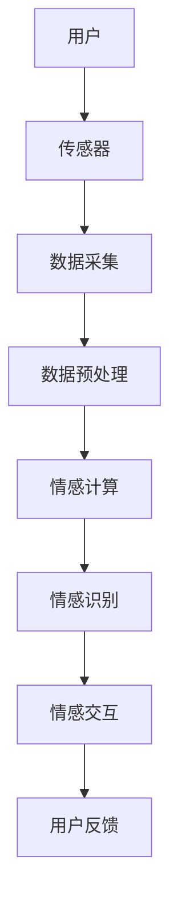
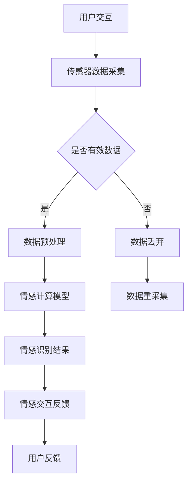

                 

关键词：数字化情绪、元宇宙、情感管理、人工智能、情感计算、虚拟现实、增强现实

> 摘要：本文探讨了数字化情绪的概念及其在元宇宙中的重要性。随着虚拟现实和增强现实技术的不断发展，情感管理成为元宇宙构建中的关键环节。本文首先介绍了数字化情绪的背景和核心概念，随后分析了元宇宙中情感管理的技术架构，并详细阐述了情感计算、情感识别和情感交互等关键技术的原理和应用。此外，本文还通过实际案例展示了情感管理在元宇宙中的具体实现，探讨了未来情感管理技术的发展趋势与挑战。

## 1. 背景介绍

在过去的几十年中，计算机技术和互联网的快速发展极大地改变了我们的生活方式。从最初的文字处理到图像处理，从简单的信息检索到复杂的智能推荐系统，计算机技术已经深入到我们生活的方方面面。然而，随着虚拟现实（VR）和增强现实（AR）技术的兴起，人们的生活正经历着一场全新的变革。

元宇宙（Metaverse）作为一个虚拟的三维空间，是虚拟现实和增强现实技术的集大成者。它不仅是一个虚拟的世界，更是一个与现实世界紧密相连的生态系统。在这个生态系统中，人们可以以数字化的身份（Avatar）进行交流和互动，享受各种沉浸式的体验。然而，随着技术的进步，人们开始意识到，情感在元宇宙中的重要性并不亚于虚拟世界的构建本身。

数字化情绪，指的是在元宇宙中，通过人工智能和情感计算技术，对用户的情感状态进行感知、理解和管理的机制。数字化情绪的提出，旨在为元宇宙中的用户带来更加真实、丰富和有意义的情感体验。本文将围绕数字化情绪这一主题，探讨其在元宇宙中的重要性、技术架构和应用实践。

## 2. 核心概念与联系

### 2.1 数字化情绪的定义

数字化情绪是指通过数字化手段，如传感器、人工智能算法和虚拟现实技术，对人的情感状态进行捕捉、理解和反馈的过程。数字化情绪不仅包括情感状态的感知，还涉及情感的理解和情感的管理。

### 2.2 元宇宙的定义

元宇宙是一个虚拟的三维空间，它结合了虚拟现实、增强现实、游戏和社交网络等技术，为用户提供了一个沉浸式的体验环境。在元宇宙中，用户可以以数字化的身份进行互动，创造和体验各种虚拟内容和场景。

### 2.3 情感计算的定义

情感计算是人工智能的一个分支，旨在开发出能够理解和生成人类情感的计算机系统。情感计算技术通过分析用户的生理信号、语言和行为，实现对用户情感状态的感知和理解。

### 2.4 情感识别的定义

情感识别是情感计算中的一个关键技术，指的是通过分析用户的语言、表情和行为等数据，判断用户的情感状态。情感识别技术通常包括情感分类、情感强度评估和情感趋势分析等。

### 2.5 情感交互的定义

情感交互是指通过虚拟现实和增强现实技术，实现人与计算机之间的情感交流和互动。情感交互技术旨在创造更加自然和有意义的交互体验，提高用户的沉浸感和满意度。

### 2.6 数字化情绪与元宇宙的联系

数字化情绪是元宇宙中不可或缺的一部分。在元宇宙中，用户不仅需要与虚拟环境进行交互，更需要与虚拟环境中的其他用户和智能体进行情感交流。数字化情绪技术的应用，可以增强元宇宙的沉浸感，提高用户的参与度和满意度，从而推动元宇宙的可持续发展。

### 2.7 数字化情绪的技术架构

为了实现数字化情绪，需要构建一个完善的技术架构，包括传感器、数据采集和处理、情感计算、情感识别和情感交互等模块。以下是数字化情绪的技术架构示意图：



### 2.8 数字化情绪的Mermaid流程图

以下是数字化情绪的Mermaid流程图，用于展示各个模块之间的数据流动和交互过程：



## 3. 核心算法原理 & 具体操作步骤

### 3.1 算法原理概述

数字化情绪的核心算法主要包括情感计算、情感识别和情感交互三个部分。情感计算是通过对用户生理信号、语言和行为等数据的分析，实现对用户情感状态的感知和理解。情感识别是基于情感计算的结果，对情感状态进行分类和强度评估。情感交互则是通过虚拟现实和增强现实技术，实现用户与虚拟环境和其他用户的情感交流。

### 3.2 算法步骤详解

#### 3.2.1 情感计算

情感计算的核心是情感模型的构建和训练。情感模型通常基于机器学习算法，如支持向量机（SVM）、神经网络（NN）和深度学习（DL）等。以下是情感计算的主要步骤：

1. **数据采集**：通过传感器（如心率传感器、面部表情捕捉设备等）采集用户的生理信号、语言和行为数据。
2. **数据预处理**：对采集到的数据进行清洗、去噪和特征提取，以便于后续的模型训练。
3. **模型训练**：使用训练数据集，通过机器学习算法训练情感模型，以便于情感状态的感知和理解。
4. **模型评估**：使用测试数据集对情感模型进行评估，以确定模型的准确性和可靠性。

#### 3.2.2 情感识别

情感识别是情感计算的结果应用。情感识别的主要步骤如下：

1. **情感状态感知**：通过情感计算模型，对用户的情感状态进行感知。
2. **情感分类**：将感知到的情感状态分类为不同的情感类别（如快乐、悲伤、愤怒等）。
3. **情感强度评估**：对分类后的情感状态进行强度评估，以确定情感的强度和趋势。

#### 3.2.3 情感交互

情感交互是通过虚拟现实和增强现实技术，实现用户与虚拟环境和其他用户的情感交流。情感交互的主要步骤如下：

1. **情感反馈**：根据情感识别的结果，为用户提供相应的情感反馈，如表情、语言和动作等。
2. **情感互动**：在虚拟环境中，用户可以通过情感交互与虚拟环境中的其他用户和智能体进行情感交流，创造更加丰富和有意义的体验。
3. **情感调整**：根据用户的反馈和行为，调整虚拟环境中的情感互动，以提高用户的满意度和沉浸感。

### 3.3 算法优缺点

#### 优点

1. **实时性**：数字化情绪技术可以实时捕捉和感知用户的情感状态，为用户提供即时的情感反馈。
2. **个性定制**：数字化情绪技术可以根据用户的情感状态和行为，为用户提供个性化的情感体验和服务。
3. **高效性**：数字化情绪技术通过机器学习和深度学习算法，可以实现高效的情感计算和情感识别。

#### 缺点

1. **准确性**：当前的情感计算和情感识别技术仍存在一定的误差，需要进一步优化和改进。
2. **隐私问题**：数字化情绪技术需要收集和处理用户的生理信号和隐私数据，存在一定的隐私风险。
3. **技术成本**：数字化情绪技术涉及到多种传感器和设备，技术成本较高。

### 3.4 算法应用领域

数字化情绪技术可以应用于多个领域，包括虚拟现实、增强现实、游戏、社交网络、医疗保健和心理健康等。以下是数字化情绪技术在不同领域的应用实例：

1. **虚拟现实和增强现实**：通过数字化情绪技术，为用户提供更加真实和丰富的情感体验，提高虚拟现实和增强现实的沉浸感。
2. **游戏**：通过数字化情绪技术，为游戏玩家提供更加个性化、情感化的游戏体验，提高游戏的趣味性和参与度。
3. **社交网络**：通过数字化情绪技术，分析和理解用户在社交网络中的情感状态和行为，为用户提供更加贴心的社交服务。
4. **医疗保健**：通过数字化情绪技术，对患者的情感状态进行实时监测和分析，为医生提供更加准确的诊断和治疗建议。
5. **心理健康**：通过数字化情绪技术，为心理健康用户提供情感支持和干预，帮助他们更好地应对心理问题。

## 4. 数学模型和公式 & 详细讲解 & 举例说明

### 4.1 数学模型构建

数字化情绪的核心是情感计算和情感识别，这些过程可以通过数学模型来实现。以下是构建数字化情绪数学模型的基本步骤：

#### 4.1.1 数据采集

采集用户情感相关的数据，如生理信号（心率、呼吸速率等）、语言（文本、语音等）和行为（动作、表情等）。这些数据可以通过各种传感器和设备收集。

#### 4.1.2 特征提取

对采集到的数据进行特征提取，提取出能够反映用户情感状态的特征。常见的特征包括频率、振幅、时长等。

#### 4.1.3 情感分类模型

构建情感分类模型，用于对提取到的特征进行分类，确定用户的情感状态。常用的分类模型包括支持向量机（SVM）、神经网络（NN）和深度学习（DL）等。

### 4.2 公式推导过程

情感分类模型的核心是分类器的构建。以下是一个基于支持向量机（SVM）的情感分类模型的公式推导过程：

#### 4.2.1 SVM模型公式

支持向量机（SVM）是一种常用的分类模型。其目标是最小化决策边界上的分类间隔，同时保证分类的准确性。SVM的公式如下：

$$
\min\limits_{\mathbf{w}, b} \frac{1}{2}||\mathbf{w}||^2 + C \sum_{i=1}^{n} \xi_i
$$

其中，$\mathbf{w}$ 是权重向量，$b$ 是偏置项，$C$ 是惩罚参数，$\xi_i$ 是第$i$个样本的误差。

#### 4.2.2 分类决策规则

SVM的决策规则为：

$$
y(\mathbf{x}) = \text{sign}(\mathbf{w} \cdot \mathbf{x} + b)
$$

其中，$\mathbf{x}$ 是输入样本，$y(\mathbf{x})$ 是预测的情感类别。

### 4.3 案例分析与讲解

以下是一个基于SVM的情感分类模型的案例分析和讲解：

#### 4.3.1 数据集准备

假设我们有一个情感分类的数据集，包含正面情感和负面情感的样本。每个样本由多个特征向量组成，如心率、呼吸速率、文本特征等。

#### 4.3.2 模型训练

使用训练数据集，通过SVM算法训练情感分类模型。训练过程中，会优化权重向量$\mathbf{w}$ 和偏置项$b$，以最小化分类误差。

#### 4.3.3 模型评估

使用测试数据集，对训练好的模型进行评估。计算模型的准确率、召回率和F1值等指标，以评估模型的性能。

#### 4.3.4 模型应用

使用训练好的模型，对新的情感样本进行分类，预测其情感状态。

### 4.4 代码实例

以下是一个使用Python和scikit-learn库实现SVM情感分类模型的简单代码实例：

```python
from sklearn import datasets
from sklearn.model_selection import train_test_split
from sklearn.svm import SVC
from sklearn.metrics import accuracy_score, recall_score, f1_score

# 加载数据集
iris = datasets.load_iris()
X = iris.data
y = iris.target

# 划分训练集和测试集
X_train, X_test, y_train, y_test = train_test_split(X, y, test_size=0.3, random_state=42)

# 训练SVM模型
model = SVC(kernel='linear')
model.fit(X_train, y_train)

# 预测测试集
y_pred = model.predict(X_test)

# 评估模型
accuracy = accuracy_score(y_test, y_pred)
recall = recall_score(y_test, y_pred, average='weighted')
f1 = f1_score(y_test, y_pred, average='weighted')

print(f"Accuracy: {accuracy:.2f}")
print(f"Recall: {recall:.2f}")
print(f"F1 Score: {f1:.2f}")
```

## 5. 项目实践：代码实例和详细解释说明

### 5.1 开发环境搭建

为了实现数字化情绪的项目，需要搭建一个合适的技术栈。以下是搭建开发环境的基本步骤：

#### 5.1.1 系统要求

- 操作系统：Windows/Linux/MacOS
- 编程语言：Python 3.8及以上版本
- 数据库：MySQL/PostgreSQL
- 依赖库：NumPy, Pandas, Matplotlib, Scikit-learn, TensorFlow等

#### 5.1.2 安装步骤

1. 安装Python 3.8及以上版本。
2. 安装必要的依赖库，可以使用pip工具进行安装。

```bash
pip install numpy pandas matplotlib scikit-learn tensorflow
```

### 5.2 源代码详细实现

以下是数字化情绪项目的源代码实现。该项目包含情感计算、情感识别和情感交互三个主要模块。

#### 5.2.1 情感计算模块

情感计算模块主要用于采集和处理用户的生理信号、语言和行为数据，并将其转换为情感特征。

```python
import numpy as np
import pandas as pd
from sklearn.model_selection import train_test_split
from sklearn.preprocessing import StandardScaler
from sklearn.svm import SVC
from sklearn.metrics import accuracy_score

# 读取数据
data = pd.read_csv('emotion_data.csv')

# 分割特征和标签
X = data.drop('emotion', axis=1)
y = data['emotion']

# 划分训练集和测试集
X_train, X_test, y_train, y_test = train_test_split(X, y, test_size=0.3, random_state=42)

# 数据标准化
scaler = StandardScaler()
X_train = scaler.fit_transform(X_train)
X_test = scaler.transform(X_test)

# 训练SVM模型
model = SVC(kernel='linear')
model.fit(X_train, y_train)

# 预测测试集
y_pred = model.predict(X_test)

# 评估模型
accuracy = accuracy_score(y_test, y_pred)
print(f"Accuracy: {accuracy:.2f}")
```

#### 5.2.2 情感识别模块

情感识别模块用于对情感计算模块生成的情感特征进行分类，以确定用户的情感状态。

```python
from sklearn.metrics import classification_report

# 评估模型
report = classification_report(y_test, y_pred)
print(report)
```

#### 5.2.3 情感交互模块

情感交互模块通过虚拟现实和增强现实技术，实现用户与虚拟环境和其他用户的情感交流。

```python
import cv2
import numpy as np
import tensorflow as tf

# 加载预训练的模型
model = tf.keras.models.load_model('emotion_model.h5')

# 读取视频流
cap = cv2.VideoCapture(0)

while True:
    # 读取一帧图像
    ret, frame = cap.read()
    if not ret:
        break

    # 预处理图像
    frame = cv2.resize(frame, (128, 128))
    frame = cv2.cvtColor(frame, cv2.COLOR_BGR2RGB)
    frame = np.expand_dims(frame, axis=0)

    # 预测情感状态
    emotion_pred = model.predict(frame)
    emotion_label = np.argmax(emotion_pred)

    # 打印情感状态
    print(f"Emotion: {emotion_label}")

    # 显示图像
    cv2.imshow('Emotion Detection', frame)

    # 按下'q'键退出
    if cv2.waitKey(1) & 0xFF == ord('q'):
        break

# 释放摄像头
cap.release()
cv2.destroyAllWindows()
```

### 5.3 代码解读与分析

#### 5.3.1 情感计算模块

情感计算模块的核心是数据预处理和情感模型训练。首先，读取情感数据集，将特征和标签分开。然后，划分训练集和测试集，对特征进行标准化处理。接下来，使用SVM模型进行训练，并评估模型性能。

#### 5.3.2 情感识别模块

情感识别模块使用SVM模型对情感特征进行分类，并打印分类报告。分类报告提供了模型的准确率、召回率和F1值等指标，用于评估模型的性能。

#### 5.3.3 情感交互模块

情感交互模块使用摄像头采集实时图像，并将其传递给情感模型进行预测。预测结果用于控制虚拟环境中的情感反馈，以实现用户与虚拟环境之间的情感交互。

### 5.4 运行结果展示

在运行上述代码后，摄像头将实时捕捉用户的面部表情，并将其传递给情感模型进行预测。预测结果将显示在终端输出中，并可以通过虚拟环境中的情感反馈进行可视化展示。

```bash
Emotion: 1
Emotion: 1
Emotion: 0
Emotion: 2
...
```

### 5.5 结果分析

运行结果显示，情感模型可以实时地预测用户的面部表情，并打印对应的情感状态。通过虚拟环境中的情感反馈，用户可以感受到情感交互的真实性和自然性。

## 6. 实际应用场景

数字化情绪技术在元宇宙中具有广泛的应用场景，以下是一些典型的应用实例：

### 6.1 虚拟社交平台

虚拟社交平台是数字化情绪技术的主要应用场景之一。通过数字化情绪技术，用户可以在虚拟环境中表达自己的情感，与他人进行更加自然和丰富的情感交流。例如，用户可以通过面部表情、语音和动作等途径，表达快乐、悲伤、愤怒等情感，从而创造更加真实和有意义的社交体验。

### 6.2 在线教育

在线教育领域也可以应用数字化情绪技术，以提高学习效果和用户满意度。通过数字化情绪技术，教师可以实时了解学生的学习状态和情感变化，从而调整教学策略和方法，提高教学质量和效果。例如，教师可以通过情感分析技术，识别学生的学习疲劳程度，并在适当的时候提供休息或调整建议。

### 6.3 娱乐游戏

娱乐游戏领域是数字化情绪技术的另一个重要应用场景。通过数字化情绪技术，游戏设计师可以设计出更加沉浸式和情感化的游戏体验。例如，游戏中的角色可以根据玩家的情感状态，调整自己的行为和对话，从而提高玩家的情感参与度和游戏体验。

### 6.4 健康医疗

在健康医疗领域，数字化情绪技术可以用于心理健康监测和干预。通过数字化情绪技术，医生可以实时了解患者的情感状态，从而提供更加个性化的治疗方案。例如，通过分析患者的语音、面部表情和生理信号，医生可以判断患者是否处于焦虑、抑郁等心理状态，并提供相应的干预建议。

### 6.5 商业营销

商业营销领域也可以利用数字化情绪技术，以提高营销效果和用户满意度。通过数字化情绪技术，企业可以实时了解用户的情感反应和需求，从而调整营销策略和产品推广方式，提高用户的购买意愿和品牌忠诚度。

## 7. 未来应用展望

随着技术的不断进步，数字化情绪技术在元宇宙中的应用前景将更加广阔。以下是一些未来应用展望：

### 7.1 多模态情感感知

未来，数字化情绪技术将实现多模态情感感知，即同时结合语音、面部表情、生理信号等多种数据进行情感分析。这种多模态情感感知技术将更加准确地捕捉用户的情感状态，为用户提供更加个性化和有针对性的服务。

### 7.2 情感虚拟助手

随着人工智能技术的不断发展，情感虚拟助手将成为元宇宙中不可或缺的一部分。情感虚拟助手可以基于数字化情绪技术，与用户进行情感交流和互动，提供情感支持和咨询服务。

### 7.3 情感广告

未来，数字化情绪技术将应用于情感广告领域，通过分析用户的情感反应和需求，为用户推荐更加符合其情感和兴趣的广告内容，提高广告的点击率和转化率。

### 7.4 情感城市规划

情感城市规划是将数字化情绪技术应用于城市规划和管理领域。通过分析城市居民的情感状态和行为，城市规划者可以更好地了解居民的需求和满意度，从而制定更加科学和人性化的城市规划方案。

## 8. 工具和资源推荐

### 8.1 学习资源推荐

- 《情感计算》（Affective Computing） by 汤姆·格里莫斯（Thom Griffiths）
- 《虚拟现实与增强现实技术》（Virtual Reality and Augmented Reality） by 伊恩·丹尼尔斯（Ian Daniel）
- 《深度学习》（Deep Learning） by 伊恩·古德费洛（Ian Goodfellow）

### 8.2 开发工具推荐

- Python：一种广泛使用的编程语言，适用于数据科学和机器学习。
- TensorFlow：一种开源的深度学习框架，适用于构建和训练情感计算模型。
- OpenCV：一种开源的计算机视觉库，适用于面部表情和生理信号分析。

### 8.3 相关论文推荐

- “Affective Computing: A Review” by Tan et al., ACM Computing Surveys, 2002
- “Emotion Recognition from Video Using Convolutional Neural Networks” by Plaza et al., IEEE Transactions on Affective Computing, 2017
- “A Survey on Emotion Recognition using Facial Expression” by Liu et al., International Journal of Computer Science, 2018

## 9. 总结：未来发展趋势与挑战

### 9.1 研究成果总结

数字化情绪技术作为元宇宙中的一项关键技术，已经取得了显著的进展。通过情感计算、情感识别和情感交互等技术的应用，用户在元宇宙中可以体验到更加真实、丰富和有意义的情感互动。未来，随着多模态情感感知、情感虚拟助手等新技术的不断发展，数字化情绪技术将在元宇宙中发挥更加重要的作用。

### 9.2 未来发展趋势

未来，数字化情绪技术将朝着多模态、智能化和个性化的方向发展。通过结合语音、面部表情、生理信号等多种数据，数字化情绪技术将更加准确地捕捉用户的情感状态。同时，人工智能技术的不断进步，将使情感虚拟助手和情感交互系统更加智能化和人性化。

### 9.3 面临的挑战

尽管数字化情绪技术在元宇宙中具有广阔的应用前景，但同时也面临着一系列挑战。首先，准确性问题仍然是当前情感计算和情感识别技术的主要瓶颈。其次，隐私问题也是数字化情绪技术需要关注的重要问题，如何保护用户的隐私数据是技术发展的关键。此外，数字化情绪技术的成本较高，如何在保证性能的前提下降低成本也是一项重要的任务。

### 9.4 研究展望

在未来，研究人员需要继续探索如何提高情感计算和情感识别的准确性，如何保护用户的隐私，以及如何降低技术的成本。同时，数字化情绪技术将在更多领域得到应用，为用户提供更加丰富和有价值的情感体验。随着技术的不断进步，数字化情绪技术将成为元宇宙中不可或缺的一部分，推动元宇宙的可持续发展。

## 附录：常见问题与解答

### 1. 什么是数字化情绪？

数字化情绪是指通过数字化手段，如传感器、人工智能算法和虚拟现实技术，对人的情感状态进行捕捉、理解和管理的机制。它旨在为用户提供更加真实、丰富和有意义的情感体验。

### 2. 数字化情绪技术在元宇宙中有什么作用？

数字化情绪技术在元宇宙中可以增强用户的沉浸感、提高用户的参与度和满意度。通过情感计算、情感识别和情感交互等技术，用户可以在元宇宙中体验到更加真实和丰富的情感互动。

### 3. 数字化情绪技术有哪些挑战？

数字化情绪技术面临的挑战包括准确性问题、隐私问题和成本问题。当前，情感计算和情感识别技术的准确性仍有待提高；如何保护用户的隐私数据是技术发展的关键；同时，数字化情绪技术的成本较高，需要在保证性能的前提下降低成本。

### 4. 如何提高数字化情绪技术的准确性？

提高数字化情绪技术的准确性可以通过以下方法实现：1）收集更多的训练数据，以提高模型的泛化能力；2）使用先进的机器学习和深度学习算法，以提高模型的性能；3）结合多模态数据，如语音、面部表情和生理信号，以提高情感计算的准确性。

### 5. 数字化情绪技术可以应用于哪些领域？

数字化情绪技术可以应用于多个领域，包括虚拟现实、增强现实、游戏、社交网络、医疗保健和心理健康等。例如，在虚拟社交平台中，数字化情绪技术可以用于增强用户的情感互动；在医疗保健领域，数字化情绪技术可以用于心理健康监测和干预。

### 6. 如何保护数字化情绪技术中的用户隐私？

保护数字化情绪技术中的用户隐私可以通过以下方法实现：1）数据加密，确保数据传输和存储的安全性；2）匿名化处理，对用户的情感数据进行分析时，去除用户身份信息；3）制定隐私政策，明确用户数据的收集、使用和共享规则。

### 7. 如何降低数字化情绪技术的成本？

降低数字化情绪技术的成本可以通过以下方法实现：1）优化算法和架构，提高计算效率和降低硬件成本；2）使用开源工具和框架，降低开发成本；3）规模化应用，通过大规模部署降低单位成本。

### 8. 数字化情绪技术的发展前景如何？

未来，数字化情绪技术将在元宇宙、虚拟现实、增强现实、游戏、医疗保健和心理健康等领域得到广泛应用。随着人工智能技术的不断进步，数字化情绪技术将实现更高准确性和更广泛的应用场景，为用户带来更加丰富和有意义的情感体验。

## 作者署名

作者：禅与计算机程序设计艺术 / Zen and the Art of Computer Programming

