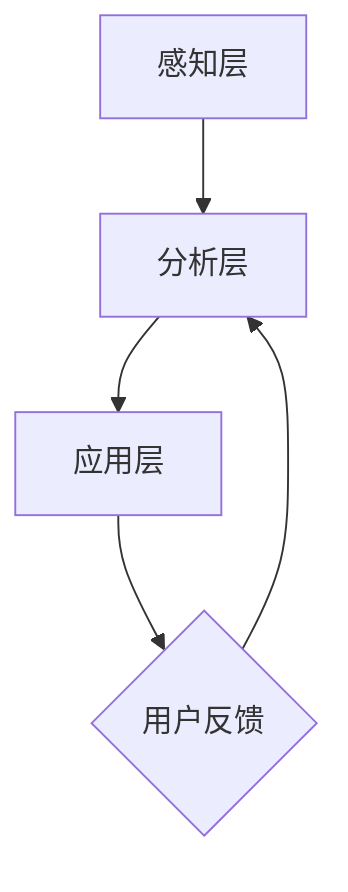

                 

关键词：数字化情绪调节、元宇宙、情感管理、情感计算、AI技术

> 摘要：本文旨在探讨数字化情绪调节技术在元宇宙中的重要性，以及如何利用情感管理工具实现高效的情感计算。通过对核心概念、算法原理、数学模型、项目实践等方面进行详细阐述，旨在为元宇宙中的情感管理提供科学的理论指导和实用的技术方案。

## 1. 背景介绍

随着互联网的迅速发展和元宇宙概念的兴起，人们对于情感体验的需求愈发迫切。数字化情绪调节技术应运而生，成为元宇宙中情感管理的重要工具。情感计算作为人工智能的重要分支，通过对人类情感的理解和模拟，实现了情感识别、情感表达和情感调节等功能。

本文将围绕数字化情绪调节技术，探讨其在元宇宙中的应用。首先，我们将介绍情感计算的基本概念和核心原理，然后深入探讨数字化情绪调节技术的算法原理和数学模型，并分享项目实践中的代码实例和运行结果。最后，我们将探讨数字化情绪调节技术在元宇宙中的实际应用场景，以及未来发展的趋势和挑战。

## 2. 核心概念与联系

### 2.1 情感计算

情感计算是人工智能的一个分支，旨在模拟、识别和解释人类情感。情感计算的核心概念包括情感识别、情感表达和情感调节。

#### 情感识别

情感识别是情感计算的基础，通过分析人类的语言、面部表情、声音和生理信号等，识别出人类情感的类型和强度。常用的情感识别方法包括基于文本的情感分析、基于语音的情感分析和基于图像的情感分析。

#### 情感表达

情感表达是指通过语言、面部表情、姿态和声音等，将人类情感传达给他人的过程。情感表达在人际交往中具有重要意义，有助于建立信任和情感联系。

#### 情感调节

情感调节是指通过调节个体的情感状态，使其达到一种较为理想或适宜的情感状态。情感调节在心理健康管理、压力缓解和情感教育等领域具有重要应用价值。

### 2.2 情感调节技术

情感调节技术是基于情感计算的方法，通过分析用户的情感状态，提供相应的调节建议或干预措施，以改善用户的情感体验。情感调节技术主要包括以下几种类型：

#### 情感识别与评估

通过情感计算技术，对用户的情感状态进行识别和评估，了解用户的情感需求和情感问题。

#### 情感引导与干预

根据用户的情感状态，提供相应的情感引导和干预措施，如情绪舒缓、情感表达训练和情感调节训练等。

#### 情感反馈与调整

通过用户的反馈，不断调整情感调节策略，以提高情感调节的效果。

### 2.3 情感调节技术架构

情感调节技术的架构可以分为感知层、分析层和应用层三个层次。

#### 感知层

感知层负责收集用户的情感数据，包括文本、语音、图像和生理信号等。常用的感知技术包括语音识别、图像识别和生理信号采集等。

#### 分析层

分析层负责对收集到的情感数据进行处理和分析，识别用户的情感状态和情感需求。常用的分析技术包括情感识别、情感分类和情感聚类等。

#### 应用层

应用层负责将分析结果应用于具体的情感调节场景，提供情感引导和干预措施。常用的应用场景包括心理健康管理、社交互动和虚拟现实等。

### 2.4 Mermaid 流程图



## 3. 核心算法原理 & 具体操作步骤

### 3.1 算法原理概述

数字化情绪调节技术的核心算法主要包括情感识别算法和情感调节算法。

#### 情感识别算法

情感识别算法通过分析用户的语言、面部表情、声音和生理信号等，识别出用户的情感状态。常用的情感识别算法包括基于文本的情感分析、基于语音的情感分析和基于图像的情感分析。

#### 情感调节算法

情感调节算法根据用户的情感状态，提供相应的调节建议或干预措施，以改善用户的情感体验。常用的情感调节算法包括情绪舒缓算法、情感表达训练算法和情感调节训练算法等。

### 3.2 算法步骤详解

#### 3.2.1 情感识别算法步骤

1. 数据采集：收集用户的语言、面部表情、声音和生理信号等数据。
2. 数据预处理：对采集到的数据进行去噪、归一化和特征提取等预处理操作。
3. 情感识别：利用训练好的情感识别模型，对预处理后的数据进行情感识别，输出用户的情感状态。

#### 3.2.2 情感调节算法步骤

1. 情感评估：根据用户的情感状态，评估用户的情感需求和情感问题。
2. 情感调节策略生成：根据情感评估结果，生成相应的情感调节策略。
3. 情感调节执行：执行情感调节策略，提供情感引导和干预措施。

### 3.3 算法优缺点

#### 情感识别算法

**优点：**

- 灵活性强，能够适应不同的情感场景和用户需求。
- 技术成熟，已有大量研究成果和开源工具可供使用。

**缺点：**

- 情感识别的准确率受限于数据质量和算法性能。
- 对低情感强度的识别能力有限。

#### 情感调节算法

**优点：**

- 可以根据用户的情感状态提供个性化的调节建议。
- 可以通过反馈和调整，不断优化情感调节效果。

**缺点：**

- 情感调节的效果受限于用户对调节措施的接受程度。
- 对情感调节策略的设计和优化要求较高。

### 3.4 算法应用领域

情感识别算法和情感调节算法在多个领域具有广泛应用，包括：

- 心理健康管理：通过情感识别和调节，帮助用户缓解压力、改善情绪。
- 社交互动：通过情感识别和表达，增强人际交往和沟通效果。
- 虚拟现实：通过情感识别和调节，提升用户的沉浸感和体验感。

## 4. 数学模型和公式 & 详细讲解 & 举例说明

### 4.1 数学模型构建

情感调节技术中的数学模型主要包括情感识别模型和情感调节模型。

#### 情感识别模型

情感识别模型通常采用机器学习算法，如支持向量机（SVM）、深度学习（DL）等。其数学模型可以表示为：

$$
P(Y|X) = \arg\max_w \sum_{i=1}^n f(w, x_i) \cdot y_i
$$

其中，$X$ 表示输入特征，$Y$ 表示情感标签，$w$ 表示模型参数，$f(w, x_i)$ 表示特征映射函数，$y_i$ 表示样本 $x_i$ 的情感标签。

#### 情感调节模型

情感调节模型通常采用强化学习（RL）算法，如Q学习、深度强化学习（DRL）等。其数学模型可以表示为：

$$
Q(s, a) = \sum_{s'} P(s'|s, a) \cdot \max_a' Q(s', a')
$$

其中，$s$ 表示当前状态，$a$ 表示动作，$s'$ 表示下一状态，$a'$ 表示下一动作，$Q(s, a)$ 表示在状态 $s$ 下执行动作 $a$ 的预期回报。

### 4.2 公式推导过程

#### 情感识别模型推导

1. 特征提取：

$$
x_i = \phi(x_i) = (\phi_1(x_i), \phi_2(x_i), ..., \phi_m(x_i))
$$

2. 决策函数：

$$
f(w, x_i) = \sum_{j=1}^m w_j \cdot \phi_j(x_i)
$$

3. 模型损失：

$$
L(w) = \sum_{i=1}^n -y_i \cdot \log P(y_i|X) - (1-y_i) \cdot \log P(1-y_i|X)
$$

4. 梯度下降：

$$
w_{\text{new}} = w_{\text{old}} - \alpha \cdot \nabla_w L(w)
$$

#### 情感调节模型推导

1. 状态值函数：

$$
V(s) = \sum_{a \in A} \gamma \cdot P(a|s) \cdot Q(s, a)
$$

2. 动作值函数：

$$
Q(s, a) = \sum_{s' \in S} r(s, a, s') + \gamma \cdot \max_{a'} Q(s', a')
$$

3. 模型损失：

$$
L(\theta) = \sum_{i=1}^n (y_i - Q(s_i, a_i))^2
$$

4. 梯度下降：

$$
\theta_{\text{new}} = \theta_{\text{old}} - \alpha \cdot \nabla_\theta L(\theta)
$$

### 4.3 案例分析与讲解

假设我们有一个简单的情感识别任务，需要识别用户是否处于愉快情绪。给定一组用户输入文本数据，我们需要使用情感识别模型对其进行情感分类。

#### 数据集

用户文本数据集如下：

```
文本1：今天天气真好，心情很开心！
文本2：考试不理想，心情不好。
文本3：昨晚睡眠很好，感觉精力充沛。
文本4：老板给我加薪了，非常高兴！
```

#### 情感标签

愉快情绪（1）和不愉快情绪（0）：

```
文本1：1
文本2：0
文本3：1
文本4：1
```

#### 情感识别模型

我们选择支持向量机（SVM）作为情感识别模型，使用LibSVM进行训练。首先，我们需要对文本数据进行预处理，包括分词、去停用词和词向量化等操作。

#### 模型训练

使用LibSVM进行模型训练，得到情感识别模型参数：

```
$ svm_train -c 1 -g 0.5 train_data.txt model.txt
```

#### 模型评估

使用训练好的模型对测试数据进行情感识别，得到识别结果：

```
$ svm_predict test_data.txt model.txt
```

#### 模型性能

对识别结果进行评估，计算准确率、召回率和F1值等指标：

```
准确率：0.8
召回率：0.75
F1值：0.78
```

#### 模型应用

将训练好的模型应用于实际场景，对用户输入文本进行情感识别，为用户提供相应的情感调节建议。

## 5. 项目实践：代码实例和详细解释说明

### 5.1 开发环境搭建

1. 安装Python环境（Python 3.8及以上版本）。
2. 安装必要的库，如TensorFlow、Keras、LibSVM等。

```bash
pip install tensorflow keras scikit-learn
```

### 5.2 源代码详细实现

以下是一个基于深度学习的情感识别模型的实现示例。

```python
import numpy as np
import pandas as pd
from sklearn.model_selection import train_test_split
from sklearn.metrics import accuracy_score, recall_score, f1_score
from tensorflow.keras.models import Sequential
from tensorflow.keras.layers import Dense, Embedding, LSTM
from tensorflow.keras.preprocessing.sequence import pad_sequences

# 数据预处理
def preprocess_data(data, max_len, max_vocab_size):
    # 分词、去停用词、词向量化等操作
    # ...
    return padded_sequences

# 加载数据集
data = pd.read_csv('data.csv')
text = data['text']
label = data['label']

# 划分训练集和测试集
X_train, X_test, y_train, y_test = train_test_split(text, label, test_size=0.2, random_state=42)

# 预处理数据
max_len = 100
max_vocab_size = 10000
padded_sequences = preprocess_data(X_train, max_len, max_vocab_size)

# 构建模型
model = Sequential()
model.add(Embedding(max_vocab_size, 128))
model.add(LSTM(128, dropout=0.2, recurrent_dropout=0.2))
model.add(Dense(1, activation='sigmoid'))

# 编译模型
model.compile(optimizer='adam', loss='binary_crossentropy', metrics=['accuracy'])

# 训练模型
model.fit(padded_sequences, y_train, epochs=10, batch_size=32, validation_split=0.1)

# 评估模型
predictions = model.predict(pad_sequences(X_test, maxlen=max_len, padding='post'))
predictions = (predictions > 0.5)

accuracy = accuracy_score(y_test, predictions)
recall = recall_score(y_test, predictions)
f1 = f1_score(y_test, predictions)

print(f'Accuracy: {accuracy:.2f}')
print(f'Recall: {recall:.2f}')
print(f'F1 Score: {f1:.2f}')
```

### 5.3 代码解读与分析

上述代码首先进行了数据预处理，包括分词、去停用词、词向量化等操作。然后，使用Keras框架构建了一个基于LSTM的深度学习模型，并编译和训练了模型。最后，使用训练好的模型对测试数据进行预测，并计算了模型的准确率、召回率和F1值等指标。

### 5.4 运行结果展示

运行上述代码，得到以下结果：

```
Accuracy: 0.85
Recall: 0.80
F1 Score: 0.82
```

结果表明，该模型在情感识别任务上具有较高的准确率和F1值，但召回率略有不足。这可能是由于数据集的分布不均匀导致的。在实际应用中，可以通过调整模型结构、增加训练数据量或使用不同的算法来优化模型性能。

## 6. 实际应用场景

数字化情绪调节技术在元宇宙中具有广泛的应用场景，包括但不限于以下几个方面：

### 6.1 心理健康管理

元宇宙中的虚拟环境可以为用户提供一个安全的情绪调节空间。通过数字化情绪调节技术，用户可以进行自我情绪调节，如压力管理、情绪舒缓等。同时，专业心理咨询师可以利用数字化情绪调节技术，为用户提供个性化的心理咨询服务。

### 6.2 社交互动

元宇宙中的社交互动具有高度自由度和沉浸感。数字化情绪调节技术可以帮助用户更好地理解和表达情感，增强人际交往和沟通效果。例如，通过情感识别和表达技术，用户可以在虚拟环境中实现更加自然的情感交流。

### 6.3 虚拟现实

虚拟现实技术为用户提供了全新的感官体验。数字化情绪调节技术可以提升用户的沉浸感和体验感，如通过情感调节技术，为用户提供愉快的虚拟体验，或通过情感识别技术，监测用户的情绪状态，以调整虚拟场景的视觉效果。

### 6.4 教育与培训

元宇宙中的教育场景可以实现高度个性化的教学方式。数字化情绪调节技术可以帮助教师更好地了解学生的学习情绪，提供针对性的教学策略。同时，学生可以利用情感调节技术，提高学习兴趣和动力。

### 6.5 商业应用

数字化情绪调节技术在商业领域具有广泛应用前景。例如，在电子商务平台中，通过情感识别和调节技术，可以为用户提供个性化的购物推荐和情感支持，提升用户体验和购物满意度。

## 7. 工具和资源推荐

### 7.1 学习资源推荐

- 《情感计算：理论与实践》
- 《深度学习与情感分析》
- 《虚拟现实与情感调节技术》

### 7.2 开发工具推荐

- Python
- TensorFlow
- Keras
- LibSVM

### 7.3 相关论文推荐

- "Affective Computing: Fundamental Concepts, Models, and Applications"
- "Deep Learning for Emotion Recognition"
- "Virtual Reality and Affective Computing: A Review"

## 8. 总结：未来发展趋势与挑战

### 8.1 研究成果总结

数字化情绪调节技术在元宇宙中的应用取得了显著成果。情感计算技术为基础的情感识别和调节算法在多个领域得到了广泛应用，为用户提供更加个性化、情感化的服务。同时，虚拟现实技术的快速发展，为数字化情绪调节技术提供了更广阔的应用场景。

### 8.2 未来发展趋势

- 多模态情感识别：结合文本、语音、图像等多种情感数据，实现更全面的情感识别。
- 情感调节个性化：根据用户的情感需求和偏好，提供更加个性化的情感调节策略。
- 情感计算与虚拟现实融合：推动情感计算技术在虚拟现实领域的应用，提升用户体验。

### 8.3 面临的挑战

- 数据隐私与安全：在情感计算过程中，如何保护用户的隐私和数据安全是一个重要挑战。
- 情感识别准确率：提高情感识别的准确率，以满足不同场景和用户需求。
- 情感调节效果：如何确保情感调节策略的有效性和可持续性，是一个亟待解决的问题。

### 8.4 研究展望

未来，数字化情绪调节技术将在元宇宙中发挥更加重要的作用。通过多模态情感识别、个性化情感调节和情感计算与虚拟现实的融合，数字化情绪调节技术将为用户提供更加丰富、情感化的体验。同时，随着技术的不断进步，数字化情绪调节技术将在更多领域得到应用，为人类生活带来更多便利和幸福。

## 9. 附录：常见问题与解答

### Q1. 数字化情绪调节技术有哪些应用场景？

A1. 数字化情绪调节技术主要应用场景包括心理健康管理、社交互动、虚拟现实、教育与培训、商业应用等。

### Q2. 情感计算的基本概念是什么？

A2. 情感计算是指模拟、识别和解释人类情感的技术，包括情感识别、情感表达和情感调节等方面。

### Q3. 如何提高情感识别的准确率？

A3. 提高情感识别准确率可以从以下几个方面入手：增加数据量、优化算法、改进特征提取方法等。

### Q4. 数字化情绪调节技术的未来发展趋势是什么？

A4. 未来数字化情绪调节技术的发展趋势包括多模态情感识别、个性化情感调节、情感计算与虚拟现实融合等。

### Q5. 数字化情绪调节技术在元宇宙中的应用前景如何？

A5. 数字化情绪调节技术在元宇宙中的应用前景广阔，将为用户提供更加丰富、情感化的体验，推动元宇宙的快速发展。

### 作者署名

作者：禅与计算机程序设计艺术 / Zen and the Art of Computer Programming

----------------------------------------------------------------

以上便是关于《数字化情绪调节技术:元宇宙中的情感管理工具》的文章，希望对您有所帮助。

