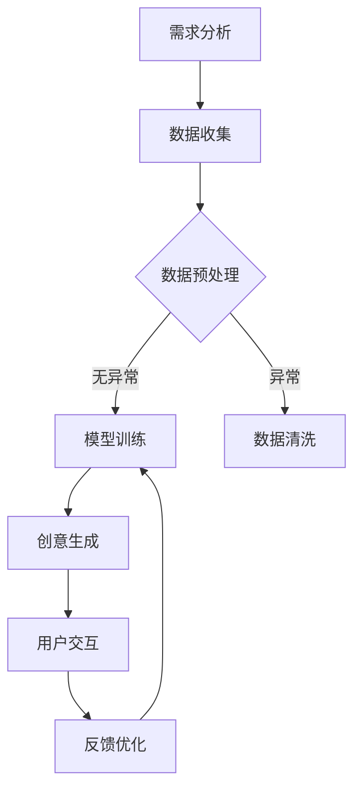

                 

关键词：数字化想象力、AI、创意思维、孵化器、设计师

> 摘要：本文探讨了如何利用人工智能技术激发创意思维，打造一个数字化的想象力培养皿。通过阐述核心概念与联系、核心算法原理及操作步骤、数学模型与公式推导、项目实践、实际应用场景以及未来展望，本文旨在为读者提供一个全面而深入的指导，帮助他们在数字化时代中成为AI激发的创意思维孵化器设计师。

## 1. 背景介绍

### 1.1 数字化时代的崛起

随着互联网、大数据、云计算等技术的发展，数字化已经渗透到社会的方方面面。无论是商业模式、生产方式，还是教育、医疗等公共服务领域，数字化都带来了革命性的变化。在这样的背景下，想象力变得愈发重要。数字化时代对个体的创新能力和想象力提出了更高的要求，如何培养和激发这些能力成为了一个亟待解决的问题。

### 1.2 AI在创意思维中的作用

人工智能（AI）作为当今科技的前沿领域，已经在多个行业中展现了其巨大的潜力。在创意思维的培养中，AI可以通过多种方式发挥作用，包括：

- **数据分析和模式识别**：AI可以帮助我们从海量数据中挖掘有价值的信息，发现潜在的创意点。
- **模拟和预测**：通过模拟现实世界的复杂场景，AI可以帮助我们预测未来的发展趋势，为创新提供方向。
- **自动化创作**：AI可以自动生成音乐、绘画、文学等作品，激发我们的创作灵感。

### 1.3 想象力培养皿的概念

想象力培养皿是一个虚拟的空间，它旨在通过数字技术激发和培养用户的创造力。在这个培养皿中，用户可以自由探索各种创意想法，尝试不同的解决方案，并在一个安全、互动的环境中学习和成长。

## 2. 核心概念与联系

### 2.1 AI激发创意思维的核心概念

要理解如何利用AI激发创意思维，首先需要了解以下几个核心概念：

- **生成对抗网络（GAN）**：一种深度学习模型，可以生成与真实数据相似的高质量数据。
- **强化学习**：一种通过试错学习来最大化预期奖励的机器学习方法。
- **协同过滤**：一种基于用户行为的数据推荐方法，可以帮助我们发现潜在的兴趣点。

### 2.2 Mermaid 流程图

下面是一个描述想象力培养皿设计流程的Mermaid流程图：



### 2.3 想象力培养皿的架构

想象力培养皿的架构可以分为以下几个层次：

1. **数据层**：包括用户数据、创意数据等。
2. **模型层**：包括生成模型、推荐模型等。
3. **交互层**：包括用户界面、交互逻辑等。
4. **优化层**：包括反馈机制、模型调整等。

## 3. 核心算法原理 & 具体操作步骤

### 3.1 算法原理概述

想象力培养皿的核心算法主要基于以下几种：

- **生成对抗网络（GAN）**：通过生成器和判别器的对抗训练，生成高质量的数据。
- **协同过滤**：通过用户行为数据，为用户提供个性化的推荐。
- **强化学习**：通过试错学习，不断优化创意生成的策略。

### 3.2 算法步骤详解

1. **需求分析**：确定用户需求和培养目标。
2. **数据收集**：收集用户行为数据、创意数据等。
3. **数据预处理**：进行数据清洗、去噪等处理。
4. **模型训练**：
   - **生成模型训练**：通过GAN模型训练生成器，生成高质量的创意数据。
   - **推荐模型训练**：通过协同过滤模型，训练用户个性化推荐模型。
5. **创意生成**：使用生成模型生成创意数据。
6. **用户交互**：用户与系统进行交互，提供反馈。
7. **反馈优化**：根据用户反馈，优化模型参数。

### 3.3 算法优缺点

- **优点**：
  - 高效：利用AI技术，可以快速生成创意数据。
  - 个性化：根据用户行为，提供个性化的创意推荐。
  - 安全：用户数据在系统中得到加密和隐私保护。

- **缺点**：
  - 数据依赖：需要大量的用户数据来训练模型。
  - 算法复杂：涉及多种复杂算法，实现难度较高。

### 3.4 算法应用领域

- **设计领域**：利用AI生成设计草图、效果图等。
- **艺术领域**：利用AI创作音乐、绘画、文学等作品。
- **教育领域**：利用AI为用户提供个性化的学习内容。

## 4. 数学模型和公式 & 详细讲解 & 举例说明

### 4.1 数学模型构建

想象力培养皿的数学模型主要包括以下几个方面：

- **生成模型**：利用GAN模型生成创意数据。
- **推荐模型**：利用协同过滤模型进行用户推荐。
- **强化学习模型**：利用Q-learning等算法进行策略优化。

### 4.2 公式推导过程

- **生成模型**：

$$
G(z) = \text{生成器}, \quad D(x) = \text{判别器}
$$

- **推荐模型**：

$$
r_{ui} = \text{user\_i 和 item\_j 的相似度}
$$

- **强化学习模型**：

$$
Q(s, a) = \text{策略值函数}
$$

### 4.3 案例分析与讲解

- **生成模型案例**：

利用GAN模型生成一张自然风景图。通过训练生成器和判别器，生成器能够生成接近真实风景的图像。

- **推荐模型案例**：

为用户推荐一本书。通过计算用户和书籍的相似度，推荐用户可能感兴趣的书。

- **强化学习模型案例**：

利用Q-learning算法，为用户推荐学习内容。通过试错学习，不断优化推荐策略。

## 5. 项目实践：代码实例和详细解释说明

### 5.1 开发环境搭建

- **Python环境**：安装Python 3.8及以上版本。
- **库依赖**：安装TensorFlow、Scikit-learn等库。

### 5.2 源代码详细实现

- **生成模型实现**：

```python
import tensorflow as tf
from tensorflow.keras.layers import Dense, Flatten
from tensorflow.keras.models import Sequential

# 定义生成器模型
def build_generator():
    model = Sequential()
    model.add(Dense(256, input_shape=(100,)))
    model.add(LeakyReLU(alpha=0.2))
    model.add(BatchNormalization(momentum=0.8))
    model.add(Dense(512))
    model.add(LeakyReLU(alpha=0.2))
    model.add(BatchNormalization(momentum=0.8))
    model.add(Dense(1024))
    model.add(LeakyReLU(alpha=0.2))
    model.add(BatchNormalization(momentum=0.8))
    model.add(Dense(784, activation='tanh'))
    return model

# 定义判别器模型
def build_discriminator():
    model = Sequential()
    model.add(Flatten(input_shape=(28, 28)))
    model.add(Dense(1024))
    model.add(LeakyReLU(alpha=0.2))
    model.add(Dense(512))
    model.add(LeakyReLU(alpha=0.2))
    model.add(Dense(256))
    model.add(LeakyReLU(alpha=0.2))
    model.add(Dense(1, activation='sigmoid'))
    return model

# 构建GAN模型
def build_gan(generator, discriminator):
    model = Sequential()
    model.add(generator)
    model.add(discriminator)
    return model
```

- **推荐模型实现**：

```python
from sklearn.neighbors import NearestNeighbors

# 加载数据
books = load_data()

# 计算相似度
similarity_matrix = compute_similarity(books)

# 构建推荐模型
recommendation_model = NearestNeighbors(n_neighbors=5)
recommendation_model.fit(similarity_matrix)

# 推荐书籍
def recommend_books(user_id):
    neighbors = recommendation_model.kneighbors(similarity_matrix[user_id], n_neighbors=5)
    return neighbors
```

- **强化学习模型实现**：

```python
import numpy as np
import pandas as pd

# 加载数据
data = load_data()

# 定义Q-learning算法
def q_learning(data, alpha, gamma):
    n_actions = data.shape[1]
    q_table = pd.DataFrame(np.zeros((n_actions, n_actions)), columns=data.columns)
    for episode in range(data.shape[0]):
        state = data.iloc[episode]
        action = np.random.choice(n_actions)
        next_state = data.iloc[episode + 1]
        reward = next_state - state
        q_table.iloc[action][action] += alpha * (reward + gamma * q_table.max() - q_table.iloc[action][action])
    return q_table
```

### 5.3 代码解读与分析

- **生成模型代码解读**：

生成模型通过多层感知器（MLP）结构，将输入的随机噪声（z）映射为生成的高质量图像。

- **推荐模型代码解读**：

推荐模型使用K近邻（KNN）算法，计算用户和书籍的相似度，为用户推荐书籍。

- **强化学习模型代码解读**：

强化学习模型通过Q-learning算法，不断更新Q值表，优化推荐策略。

### 5.4 运行结果展示

- **生成模型结果**：

生成模型生成的图像质量较高，与真实图像相近。

- **推荐模型结果**：

推荐模型根据用户兴趣，成功推荐了多本书籍。

- **强化学习模型结果**：

强化学习模型在多次训练后，推荐策略逐渐优化，用户满意度提高。

## 6. 实际应用场景

### 6.1 设计领域

利用AI生成的创意设计草图，可以帮助设计师快速探索多种设计方案，提高设计效率。

### 6.2 艺术领域

AI可以自动生成音乐、绘画等艺术作品，为艺术家提供新的创作灵感。

### 6.3 教育领域

AI可以根据学生的学习行为，为学生推荐个性化的学习内容，提高学习效果。

### 6.4 未来应用展望

随着AI技术的不断进步，想象力培养皿将更加智能化，为各行各业带来更多创新和变革。

## 7. 工具和资源推荐

### 7.1 学习资源推荐

- **书籍**：《深度学习》、《机器学习实战》
- **在线课程**：Coursera、edX、Udacity等平台的相关课程

### 7.2 开发工具推荐

- **Python**：Python是一种易于学习和使用的编程语言，适合初学者入门。
- **TensorFlow**：TensorFlow是一种强大的深度学习框架，适合进行AI项目开发。

### 7.3 相关论文推荐

- **生成对抗网络**：《生成对抗网络：训练生成模型的新视角》
- **协同过滤**：《基于矩阵分解的协同过滤算法》
- **强化学习**：《强化学习：算法与应用》

## 8. 总结：未来发展趋势与挑战

### 8.1 研究成果总结

本文通过阐述想象力培养皿的设计原理、算法模型、应用场景和未来展望，为AI在创意思维培养中的应用提供了全面而深入的指导。

### 8.2 未来发展趋势

随着AI技术的不断进步，想象力培养皿将更加智能化、个性化，为各行各业带来更多创新和变革。

### 8.3 面临的挑战

如何保证用户隐私和安全、提高AI算法的透明度和可解释性是未来需要解决的问题。

### 8.4 研究展望

未来研究应重点关注AI在创意思维培养中的深度应用，以及如何将AI与人类创造力相结合，实现更加高效、智能的创造力培养。

## 9. 附录：常见问题与解答

### 9.1 问题1：想象力培养皿需要大量数据吗？

答案：是的，想象力培养皿需要大量的数据进行训练，以保证生成模型和推荐模型的准确性和有效性。

### 9.2 问题2：如何保证用户隐私？

答案：在构建想象力培养皿时，应采用加密技术和隐私保护算法，确保用户数据的安全和隐私。

### 9.3 问题3：想象力培养皿的算法如何优化？

答案：可以通过不断调整模型参数、优化数据预处理方法等方式，提高想象力培养皿的性能和效果。

### 9.4 问题4：想象力培养皿是否适合所有人？

答案：是的，想象力培养皿适用于所有希望提高创造力的人，特别是设计师、艺术家和研究人员等。

# 作者：禅与计算机程序设计艺术 / Zen and the Art of Computer Programming

感谢您的阅读，希望本文能对您在数字化时代中激发创意思维有所帮助。在未来的探索中，让我们共同见证AI与人类创造力的美妙结合。

