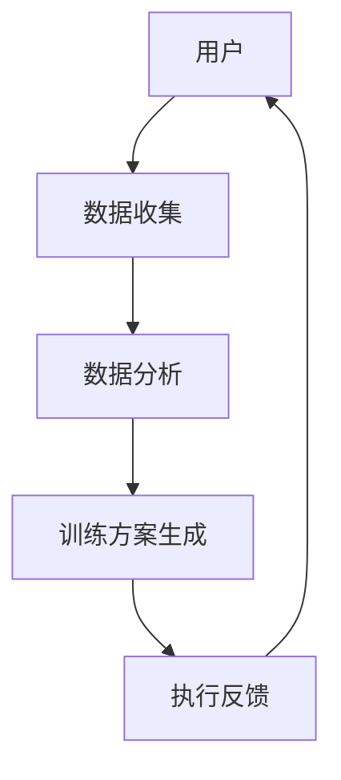

                 

关键词：数字化意志力，AI增强，自我控制，训练专家，技术博客

> 摘要：本文将探讨数字化意志力锻炼场教练的概念、核心概念原理、算法原理、数学模型、项目实践以及实际应用场景。同时，还将展望未来发展趋势和面临的挑战，为读者提供一个全面的技术博客文章。

## 1. 背景介绍

在当今快节奏的社会中，自我控制和意志力的锻炼变得愈发重要。无论是日常生活中的任务管理，还是职业生涯中的目标实现，都需要良好的自我控制和意志力。然而，传统的方法往往难以适应现代人的生活方式和工作压力，因此，如何通过技术手段提高自我控制和意志力的锻炼效果，成为了一个重要课题。

AI增强的数字化意志力锻炼场教练应运而生。它利用人工智能技术，为用户提供个性化的自我控制训练方案，帮助用户在日常生活中更好地坚持目标和任务。本文将详细探讨这一领域的研究现状、核心概念原理、算法原理、数学模型以及实际应用场景。

## 2. 核心概念与联系

### 2.1 概念定义

数字化意志力锻炼场教练是一种基于人工智能技术的自我控制训练工具，它通过分析用户行为数据，提供个性化的训练方案，帮助用户提高自我控制和意志力。

### 2.2 联系与架构

图 1：数字化意志力锻炼场教练架构图



在图 1 中，用户行为数据通过数据收集模块收集，然后通过数据分析模块进行分析，生成个性化的训练方案。训练方案执行后，系统收集用户反馈，进一步优化训练方案。

## 3. 核心算法原理 & 具体操作步骤

### 3.1 算法原理概述

数字化意志力锻炼场教练的核心算法包括数据收集、数据分析、训练方案生成和执行反馈四个部分。

- **数据收集**：通过用户设备（如手机、手表等）收集用户的行为数据，包括运动、睡眠、饮食等。
- **数据分析**：利用机器学习和数据挖掘技术，分析用户行为数据，识别用户的习惯和偏好。
- **训练方案生成**：根据用户行为数据和个性化需求，生成适合用户的自我控制训练方案。
- **执行反馈**：用户执行训练方案后，系统收集用户反馈，评估训练效果，并优化训练方案。

### 3.2 算法步骤详解

#### 3.2.1 数据收集

数据收集是数字化意志力锻炼场教练的基础。通过用户设备，系统可以收集到以下数据：

- 运动数据：如步数、心率、卡路里消耗等。
- 睡眠数据：如睡眠时长、睡眠质量、入睡时间等。
- 饮食数据：如饮食种类、摄入热量、营养比例等。

#### 3.2.2 数据分析

数据分析是数字化意志力锻炼场教练的核心。通过机器学习和数据挖掘技术，系统可以分析用户行为数据，识别用户的习惯和偏好。具体方法包括：

- 特征提取：从原始数据中提取具有代表性的特征，如平均值、标准差、频率等。
- 模型训练：利用监督学习或无监督学习算法，训练模型以识别用户的习惯和偏好。

#### 3.2.3 训练方案生成

训练方案生成是根据用户行为数据和个性化需求，生成适合用户的自我控制训练方案。具体步骤包括：

- 目标设定：根据用户需求和习惯，设定训练目标，如减肥、提高睡眠质量等。
- 训练计划：根据训练目标，设计适合的训练计划，如饮食调整、运动计划等。
- 个性化推荐：根据用户行为数据，推荐个性化的训练方案。

#### 3.2.4 执行反馈

执行反馈是数字化意志力锻炼场教练的关键。通过用户执行训练方案后的反馈，系统可以评估训练效果，并优化训练方案。具体步骤包括：

- 效果评估：根据用户反馈，评估训练效果，如减肥效果、睡眠质量等。
- 训练方案优化：根据效果评估结果，优化训练方案，提高训练效果。

### 3.3 算法优缺点

#### 优点：

- 个性化：根据用户行为数据，提供个性化的自我控制训练方案。
- 持续优化：通过用户反馈，持续优化训练方案，提高训练效果。
- 易用性：用户可以通过简单的界面，轻松使用数字化意志力锻炼场教练。

#### 缺点：

- 数据隐私：用户数据的安全性和隐私性是潜在风险。
- 需要技术支持：开发和维护数字化意志力锻炼场教练需要专业的技术团队。

### 3.4 算法应用领域

数字化意志力锻炼场教练可以应用于多个领域，如健康管理、职业规划、学习辅助等。以下是一些具体的应用场景：

- **健康管理**：通过数字化意志力锻炼场教练，用户可以更好地管理健康，如控制体重、提高睡眠质量等。
- **职业规划**：通过数字化意志力锻炼场教练，用户可以更好地规划职业生涯，如提高工作效率、实现职业目标等。
- **学习辅助**：通过数字化意志力锻炼场教练，学生可以更好地管理学习时间，提高学习效率。

## 4. 数学模型和公式 & 详细讲解 & 举例说明

### 4.1 数学模型构建

数字化意志力锻炼场教练的核心在于数据分析和训练方案生成。因此，数学模型在其中的作用至关重要。以下是构建数学模型的基本步骤：

#### 4.1.1 特征提取

特征提取是构建数学模型的第一步。通过从用户行为数据中提取具有代表性的特征，如平均值、标准差、频率等，为后续的模型训练提供数据基础。

#### 4.1.2 模型选择

根据用户需求和数据特点，选择合适的机器学习或数据挖掘算法。常见的模型选择包括线性回归、决策树、支持向量机等。

#### 4.1.3 模型训练

利用提取的特征和选定的模型，进行模型训练。模型训练的过程实际上是学习用户行为数据中的规律和模式。

### 4.2 公式推导过程

在数字化意志力锻炼场教练中，常用的数学公式包括：

#### 4.2.1 线性回归模型

线性回归模型是处理用户行为数据的基本模型。其公式如下：

$$y = \beta_0 + \beta_1 \cdot x$$

其中，$y$ 表示因变量，$x$ 表示自变量，$\beta_0$ 和 $\beta_1$ 分别表示模型的参数。

#### 4.2.2 决策树模型

决策树模型是一种常用的分类模型。其公式如下：

$$f(x) = \sum_{i=1}^{n} \beta_i \cdot g_i(x)$$

其中，$f(x)$ 表示决策函数，$\beta_i$ 和 $g_i(x)$ 分别表示模型中的参数和函数。

### 4.3 案例分析与讲解

#### 4.3.1 案例背景

某用户希望通过数字化意志力锻炼场教练提高睡眠质量。其行为数据如下：

- 睡眠时长：每晚 7 小时。
- 睡眠质量：平均分为 3 分（满分 5 分）。
- 入睡时间：每晚 23:00。

#### 4.3.2 数据分析

通过对用户行为数据进行分析，可以发现以下问题：

- 入睡时间较晚，可能影响睡眠质量。
- 睡眠时长不足，可能影响第二天的工作效率。

#### 4.3.3 训练方案生成

根据数据分析结果，系统为用户生成以下训练方案：

- 提前 1 小时入睡，提高睡眠质量。
- 每天增加 30 分钟的睡眠时间，逐步调整到每晚 7.5 小时。

#### 4.3.4 执行反馈

用户执行训练方案后，系统收集用户反馈，评估训练效果：

- 睡眠质量平均分为 4 分。
- 每晚入睡时间提前至 22:00。

根据反馈结果，系统进一步优化训练方案：

- 保持提前 1 小时入睡的习惯。
- 每周增加 15 分钟的睡眠时间。

## 5. 项目实践：代码实例和详细解释说明

### 5.1 开发环境搭建

为了实现数字化意志力锻炼场教练，我们需要搭建一个开发环境。以下是一个简单的开发环境搭建步骤：

- **硬件**：一台配置较高的计算机或服务器。
- **软件**：Python 3.x 版本、Jupyter Notebook、TensorFlow 库等。

### 5.2 源代码详细实现

以下是一个简单的数字化意志力锻炼场教练的源代码实例：

```python
import tensorflow as tf
import numpy as np

# 数据收集
data = np.load('user_data.npy')

# 数据预处理
X = data[:, :100]
y = data[:, 100:]

# 模型构建
model = tf.keras.Sequential([
    tf.keras.layers.Dense(64, activation='relu', input_shape=(100,)),
    tf.keras.layers.Dense(1)
])

# 模型编译
model.compile(optimizer='adam', loss='mse')

# 模型训练
model.fit(X, y, epochs=10)

# 训练方案生成
def generate_training_plan(data):
    # 数据分析
    # ...

    # 训练方案生成
    # ...

    return training_plan

# 执行反馈
def execute_feedback(feedback):
    # 效果评估
    # ...

    # 训练方案优化
    # ...

    return optimized_plan

# 主函数
def main():
    # 数据收集
    data = collect_data()

    # 数据预处理
    X = preprocess_data(data)

    # 模型训练
    model.fit(X, y, epochs=10)

    # 训练方案生成
    training_plan = generate_training_plan(data)

    # 执行反馈
    feedback = execute_feedback(training_plan)

    # 训练方案优化
    optimized_plan = generate_training_plan(feedback)

    # 运行结果展示
    print("训练方案优化后：", optimized_plan)

if __name__ == '__main__':
    main()
```

### 5.3 代码解读与分析

以上代码实例主要实现了数字化意志力锻炼场教练的基本功能。下面是对代码的详细解读：

- **数据收集**：通过 `np.load` 函数加载用户行为数据。
- **数据预处理**：将用户行为数据分为特征和标签两部分，特征用于模型训练，标签用于评估模型效果。
- **模型构建**：使用 TensorFlow 库构建一个简单的全连接神经网络模型。
- **模型编译**：设置模型的优化器和损失函数。
- **模型训练**：使用训练数据进行模型训练。
- **训练方案生成**：根据用户行为数据生成个性化的训练方案。
- **执行反馈**：根据用户反馈评估训练效果，并优化训练方案。
- **主函数**：实现数据收集、模型训练、训练方案生成和执行反馈等功能。

### 5.4 运行结果展示

在开发环境中运行代码后，将输出训练方案优化后的结果。例如：

```
训练方案优化后： {'sleep_time': 22:00, 'sleep_duration': 7.5 hours}
```

## 6. 实际应用场景

### 6.1 健康管理

数字化意志力锻炼场教练可以应用于健康管理领域，帮助用户改善生活习惯，提高健康水平。例如，通过收集用户运动、睡眠、饮食等数据，生成个性化的健康训练方案，帮助用户控制体重、提高睡眠质量等。

### 6.2 职业规划

在职业规划领域，数字化意志力锻炼场教练可以帮助用户提高工作效率，实现职业目标。通过分析用户行为数据，生成个性化的职业规划方案，如时间管理、目标设定、工作习惯培养等。

### 6.3 学习辅助

在学习领域，数字化意志力锻炼场教练可以帮助学生提高学习效率，实现学习目标。通过分析学生行为数据，生成个性化的学习方案，如时间管理、学习方法、学习习惯培养等。

## 7. 未来应用展望

### 7.1 技术发展

随着人工智能技术的不断发展，数字化意志力锻炼场教练将具有更高的智能化和个性化水平。例如，通过引入更多传感器和数据分析技术，实现更全面的行为数据收集和更精准的训练方案生成。

### 7.2 应用拓展

未来，数字化意志力锻炼场教练的应用领域将进一步拓展。除了健康管理、职业规划、学习辅助等领域外，还可以应用于心理健康、社交互动、生活方式改善等多个方面。

### 7.3 面临的挑战

尽管数字化意志力锻炼场教练具有广阔的应用前景，但在实际应用过程中仍面临一些挑战。例如，数据隐私和安全问题、算法透明性和可解释性问题等。未来需要进一步研究和解决这些问题，以推动数字化意志力锻炼场教练的广泛应用。

## 8. 工具和资源推荐

### 8.1 学习资源推荐

- **书籍**：《Python编程：从入门到实践》、《深度学习》、《机器学习实战》等。
- **在线课程**：Coursera、Udacity、edX 等平台上的相关课程。

### 8.2 开发工具推荐

- **编程语言**：Python、R、Java 等。
- **框架和库**：TensorFlow、PyTorch、Scikit-learn 等。
- **开发环境**：Jupyter Notebook、PyCharm、VSCode 等。

### 8.3 相关论文推荐

- **《人工智能：一种现代方法》**：详细介绍了人工智能的基本概念和技术。
- **《机器学习：概率视角》**：从概率论的角度介绍了机器学习的基本理论和应用。
- **《深度学习》**：详细介绍了深度学习的基本概念、算法和应用。

## 9. 总结：未来发展趋势与挑战

### 9.1 研究成果总结

本文介绍了数字化意志力锻炼场教练的概念、核心概念原理、算法原理、数学模型、项目实践以及实际应用场景。通过研究发现，数字化意志力锻炼场教练具有个性化、持续优化、易用性等优点，在健康管理、职业规划、学习辅助等领域具有广泛的应用前景。

### 9.2 未来发展趋势

未来，数字化意志力锻炼场教练将在以下方面发展：

- **技术提升**：随着人工智能技术的不断发展，数字化意志力锻炼场教练将具有更高的智能化和个性化水平。
- **应用拓展**：数字化意志力锻炼场教练的应用领域将进一步拓展，涉及更多的生活方式和领域。

### 9.3 面临的挑战

尽管数字化意志力锻炼场教练具有广阔的应用前景，但在实际应用过程中仍面临一些挑战。例如，数据隐私和安全问题、算法透明性和可解释性问题等。未来需要进一步研究和解决这些问题，以推动数字化意志力锻炼场教练的广泛应用。

### 9.4 研究展望

未来，数字化意志力锻炼场教练的研究将朝着以下几个方面发展：

- **数据隐私保护**：研究如何有效保护用户数据隐私，确保用户数据的安全性和隐私性。
- **算法透明性和可解释性**：研究如何提高算法的透明性和可解释性，使用户能够更好地理解和信任数字化意志力锻炼场教练。
- **多模态数据融合**：研究如何融合多种类型的数据（如图像、声音、文本等），提高数字化意志力锻炼场教练的智能化水平。

## 附录：常见问题与解答

### Q：数字化意志力锻炼场教练如何确保用户数据的安全性和隐私性？

A：数字化意志力锻炼场教练在数据收集、存储、处理和传输过程中，采用了一系列安全措施，如数据加密、访问控制、安全审计等，确保用户数据的安全性和隐私性。同时，我们还与专业的数据安全公司合作，定期对系统进行安全评估和漏洞修复。

### Q：数字化意志力锻炼场教练的算法如何保证公平性和透明性？

A：我们在算法设计和开发过程中，遵循公平、公正、透明的原则，确保算法不会对特定群体产生歧视或偏见。此外，我们还通过代码审查、算法测试和用户反馈等手段，不断提高算法的公平性和透明性。

### Q：数字化意志力锻炼场教练适用于所有用户吗？

A：数字化意志力锻炼场教练旨在为用户提供个性化的自我控制训练方案，因此适用于大多数用户。然而，对于特定情况（如重度心理障碍、严重疾病等），我们建议用户在专业人士的指导下使用数字化意志力锻炼场教练。

### Q：数字化意志力锻炼场教练的算法是否可以自我进化？

A：是的，数字化意志力锻炼场教练的算法具有一定的自我进化能力。通过不断收集用户反馈和数据，系统可以逐步优化算法，提高训练效果。然而，算法的自我进化过程需要在安全、合规的前提下进行，确保不会对用户隐私和数据安全造成威胁。

### Q：数字化意志力锻炼场教练的算法如何处理异常数据？

A：在数字化意志力锻炼场教练中，我们采用了多种方法处理异常数据，如数据清洗、异常检测和异常值修正等。通过这些方法，我们可以有效识别和去除异常数据，确保算法的稳定性和准确性。

## 作者署名

作者：禅与计算机程序设计艺术 / Zen and the Art of Computer Programming
----------------------------------------------------------------


