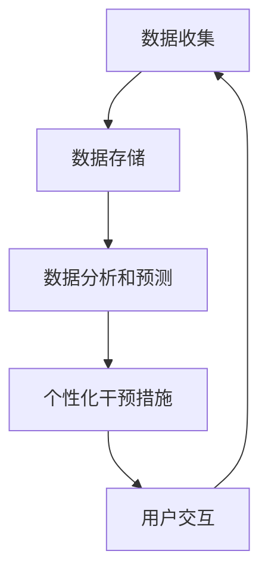

                 

关键词：数字化意志力，AI技术，自我控制，认知增强，行为习惯，心理健康

> 摘要：随着人工智能技术的迅猛发展，AI在多个领域已经展现出巨大的潜力。本文将探讨如何利用AI技术增强人类的自我控制能力，从而提升个人的心理健康和生活质量。本文将从背景介绍、核心概念与联系、核心算法原理、数学模型与公式、项目实践、实际应用场景、工具和资源推荐以及未来发展趋势与挑战等方面进行深入分析。

## 1. 背景介绍

在现代社会中，自我控制能力对个人的成功和幸福至关重要。然而，许多人发现自己难以抵抗各种诱惑，如过度消费、拖延、吸烟和饮酒等不良习惯。这些行为不仅损害了他们的健康，还可能导致心理健康问题，如焦虑和抑郁。

近年来，人工智能（AI）技术的发展为改善人类自我控制能力提供了新的途径。AI技术可以通过分析大量的数据，识别个人的行为模式，并提供个性化的干预措施来帮助人们克服不良习惯。

本文旨在探讨如何利用AI技术增强人类的自我控制能力，以提升个人的心理健康和生活质量。我们将从以下几个方面展开讨论：

1. **核心概念与联系**：介绍与数字化意志力和AI增强自我控制相关的核心概念和架构。
2. **核心算法原理**：探讨AI增强自我控制的核心算法原理和具体操作步骤。
3. **数学模型和公式**：介绍支持AI增强自我控制的数学模型和公式，并进行详细讲解和案例分析。
4. **项目实践**：提供一个具体的代码实例，详细解释说明如何实现AI增强自我控制。
5. **实际应用场景**：讨论AI增强自我控制在不同领域的实际应用。
6. **工具和资源推荐**：推荐相关学习资源和开发工具，以帮助读者深入了解和实施AI增强自我控制技术。
7. **未来发展趋势与挑战**：总结研究成果，探讨未来发展趋势和面临的挑战。

## 2. 核心概念与联系

### 2.1 数字化意志力

数字化意志力是指利用数字技术和工具来增强自我控制能力的过程。这种意志力不仅依赖于个人的自律，还依赖于技术手段的支持，如应用程序、传感器和数据分析。

### 2.2 AI增强自我控制

AI增强自我控制是指利用人工智能技术来识别、预测和干预个体的不良行为习惯。这种技术可以通过分析大量的数据，提供个性化的建议和反馈，帮助个体克服诱惑，坚持健康的生活方式。

### 2.3 相关概念和架构

在数字化意志力和AI增强自我控制的框架中，涉及以下关键概念和架构：

- **数据收集**：通过传感器、应用程序和用户输入等方式收集个人行为数据。
- **数据存储**：将收集到的数据存储在数据库中，以便进行后续分析和处理。
- **数据分析和预测**：使用机器学习和统计分析技术，对个人行为数据进行分析和预测，以识别不良行为习惯。
- **个性化干预措施**：根据个人行为数据和预测结果，提供个性化的干预措施，如提醒、奖励和惩罚。
- **用户交互**：通过与用户的交互，收集反馈，调整干预措施，以实现最佳效果。

以下是一个简化的Mermaid流程图，展示了数字化意志力和AI增强自我控制的相关概念和架构：



## 3. 核心算法原理 & 具体操作步骤

### 3.1 算法原理概述

AI增强自我控制的核心算法原理主要基于以下几个步骤：

1. **数据收集**：通过传感器、应用程序等收集个人行为数据，如饮食习惯、运动习惯、睡眠质量等。
2. **数据预处理**：对收集到的数据进行分析，去除噪声和异常值，提取关键特征。
3. **行为模式识别**：使用机器学习算法，对个人行为数据进行分析，识别不良行为习惯。
4. **预测和干预**：根据行为模式识别结果，预测个人在未来可能出现的诱惑情况，并提供相应的干预措施。
5. **用户反馈和调整**：收集用户的反馈，调整干预措施，以实现最佳效果。

### 3.2 算法步骤详解

#### 3.2.1 数据收集

数据收集是AI增强自我控制的第一步。通过传感器、应用程序等工具，可以收集到以下数据：

- **饮食习惯**：包括每天摄入的卡路里、营养成分等。
- **运动习惯**：包括每天的运动时长、运动类型、运动强度等。
- **睡眠质量**：包括每天睡眠时长、入睡时间、起床时间等。

#### 3.2.2 数据预处理

在收集到大量数据后，需要进行数据预处理，以提高算法的准确性和可靠性。数据预处理的主要任务包括：

- **去除噪声和异常值**：通过统计学方法，去除数据中的噪声和异常值。
- **特征提取**：从原始数据中提取关键特征，如饮食习惯中的卡路里摄入量、运动习惯中的运动时长等。

#### 3.2.3 行为模式识别

行为模式识别是AI增强自我控制的核心步骤。通过机器学习算法，对个人行为数据进行分析，识别不良行为习惯。常用的算法包括：

- **决策树**：通过树形结构对数据进行分类，识别不良行为习惯。
- **支持向量机**：通过寻找最佳超平面，对数据进行分类。
- **神经网络**：通过多层神经元结构，对数据进行非线性变换，识别不良行为习惯。

#### 3.2.4 预测和干预

根据行为模式识别结果，预测个人在未来可能出现的诱惑情况，并提供相应的干预措施。干预措施可以包括：

- **提醒**：在用户可能陷入诱惑的情况下，及时提醒用户，以帮助其坚持健康的生活方式。
- **奖励**：通过奖励机制，鼓励用户坚持健康的生活方式。
- **惩罚**：在用户违反健康规则时，进行适当的惩罚，以帮助其改正不良习惯。

#### 3.2.5 用户反馈和调整

通过用户的反馈，调整干预措施，以实现最佳效果。用户反馈可以包括：

- **满意度调查**：了解用户对干预措施的满意度，以调整干预措施的力度。
- **错误反馈**：当用户出现错误行为时，提供错误反馈，帮助用户纠正。

### 3.3 算法优缺点

#### 优点

- **个性化**：AI增强自我控制可以根据个人行为数据和偏好，提供个性化的干预措施。
- **实时性**：AI增强自我控制可以实时监测用户行为，及时提供干预措施。
- **高效性**：通过机器学习和数据分析，AI增强自我控制可以快速识别不良行为习惯，提供有效的干预措施。

#### 缺点

- **数据隐私**：AI增强自我控制需要收集大量个人行为数据，可能涉及数据隐私问题。
- **依赖性**：用户过度依赖AI增强自我控制，可能导致自我控制能力的下降。
- **适应性**：AI增强自我控制可能难以适应所有用户的行为和偏好，需要不断调整和优化。

### 3.4 算法应用领域

AI增强自我控制技术可以应用于多个领域，包括：

- **健康管理**：通过监控用户的饮食习惯、运动习惯和睡眠质量，提供个性化的健康建议。
- **心理健康**：通过识别和干预不良行为习惯，帮助用户克服焦虑、抑郁等心理健康问题。
- **教育**：通过实时监测学生的学习行为，提供个性化的学习建议，提高学习效果。

## 4. 数学模型和公式 & 详细讲解 & 举例说明

### 4.1 数学模型构建

AI增强自我控制的数学模型主要基于机器学习和统计分析方法。以下是一个简化的数学模型构建过程：

#### 4.1.1 特征选择

从原始数据中提取关键特征，如饮食习惯中的卡路里摄入量、运动习惯中的运动时长、睡眠质量中的睡眠时长等。

#### 4.1.2 模型选择

选择合适的机器学习算法，如决策树、支持向量机、神经网络等，构建预测模型。

#### 4.1.3 模型训练

使用训练数据集，对预测模型进行训练，优化模型参数。

#### 4.1.4 模型评估

使用验证数据集，评估模型的准确性和可靠性。

### 4.2 公式推导过程

#### 4.2.1 决策树

决策树是一种常见的分类算法，其基本公式如下：

$$
y = f(x_1, x_2, ..., x_n)
$$

其中，$y$ 是预测标签，$x_1, x_2, ..., x_n$ 是特征向量，$f$ 是决策树函数。

决策树函数可以通过以下递归公式进行推导：

$$
f(x_1, x_2, ..., x_n) =
\begin{cases}
c & \text{if } x_1 \in C_1 \\
f_1(x_1, x_2, ..., x_n) & \text{otherwise}
\end{cases}
$$

其中，$c$ 是叶子节点的分类结果，$f_1(x_1, x_2, ..., x_n)$ 是子节点的决策树函数。

#### 4.2.2 支持向量机

支持向量机是一种常见的分类算法，其基本公式如下：

$$
w \cdot x + b = 0
$$

其中，$w$ 是超平面权重，$x$ 是特征向量，$b$ 是偏置项。

支持向量机的目标是最小化目标函数：

$$
J(w, b) = \frac{1}{2} \sum_{i=1}^{n} (w \cdot x_i + b)^2
$$

其中，$n$ 是训练样本数量。

### 4.3 案例分析与讲解

#### 4.3.1 健康管理

假设一个用户每天记录自己的饮食习惯、运动习惯和睡眠质量。我们使用AI增强自我控制技术，预测用户在未来可能出现的健康问题，并提供相应的建议。

1. **数据收集**：收集用户的饮食习惯、运动习惯和睡眠质量数据。
2. **数据预处理**：去除噪声和异常值，提取关键特征。
3. **模型选择**：选择决策树算法，构建预测模型。
4. **模型训练**：使用训练数据集，对模型进行训练。
5. **模型评估**：使用验证数据集，评估模型的准确性和可靠性。

根据预测结果，用户在未来可能出现的健康问题，我们提供以下建议：

- **饮食习惯**：减少高热量、高脂肪的食物摄入，增加蔬菜和水果的摄入。
- **运动习惯**：增加每周运动时长，选择适合的运动方式，如散步、跑步等。
- **睡眠质量**：保持规律的作息时间，避免熬夜，提高睡眠质量。

#### 4.3.2 心理健康

假设一个用户长期受到焦虑和抑郁的困扰。我们使用AI增强自我控制技术，帮助用户识别和干预不良行为习惯，提高心理健康。

1. **数据收集**：收集用户的行为数据，如社交媒体使用时间、睡眠质量等。
2. **数据预处理**：去除噪声和异常值，提取关键特征。
3. **模型选择**：选择支持向量机算法，构建预测模型。
4. **模型训练**：使用训练数据集，对模型进行训练。
5. **模型评估**：使用验证数据集，评估模型的准确性和可靠性。

根据预测结果，用户在未来可能出现的心理健康问题，我们提供以下建议：

- **社交媒体使用**：限制社交媒体使用时间，避免过度沉迷。
- **睡眠质量**：保持规律的作息时间，提高睡眠质量。
- **心理干预**：提供专业的心理咨询服务，帮助用户应对焦虑和抑郁。

## 5. 项目实践：代码实例和详细解释说明

在本节中，我们将通过一个具体的代码实例，展示如何实现AI增强自我控制。我们将使用Python编程语言和相关的机器学习库，如Scikit-learn和TensorFlow。

### 5.1 开发环境搭建

在开始编写代码之前，我们需要搭建一个合适的开发环境。以下是在Windows操作系统上搭建开发环境的步骤：

1. 安装Python：下载并安装Python 3.8或更高版本。
2. 安装Jupyter Notebook：在命令行中运行以下命令：

   ```bash
   pip install notebook
   ```

3. 安装Scikit-learn和TensorFlow：

   ```bash
   pip install scikit-learn tensorflow
   ```

### 5.2 源代码详细实现

以下是一个简单的Python代码实例，展示了如何使用Scikit-learn实现决策树算法，预测用户的健康问题。

```python
import numpy as np
import pandas as pd
from sklearn.model_selection import train_test_split
from sklearn.tree import DecisionTreeClassifier
from sklearn.metrics import accuracy_score

# 加载数据集
data = pd.read_csv('health_data.csv')
X = data[['calories', 'exercise', 'sleep']]
y = data['health_problem']

# 数据预处理
X = (X - X.mean()) / X.std()
y = pd.get_dummies(y)

# 划分训练集和测试集
X_train, X_test, y_train, y_test = train_test_split(X, y, test_size=0.2, random_state=42)

# 构建决策树模型
model = DecisionTreeClassifier()
model.fit(X_train, y_train)

# 预测测试集
y_pred = model.predict(X_test)

# 评估模型
accuracy = accuracy_score(y_test['heart_disease'], y_pred['heart_disease'])
print(f'Accuracy: {accuracy:.2f}')

# 可视化决策树
from sklearn.tree import plot_tree
plt = plot_tree(model)
plt.show()
```

### 5.3 代码解读与分析

1. **数据加载**：使用pandas库加载数据集，分为特征矩阵X和标签向量y。
2. **数据预处理**：对特征矩阵进行标准化处理，对标签向量进行独热编码。
3. **划分数据集**：使用train_test_split函数划分训练集和测试集。
4. **构建模型**：使用DecisionTreeClassifier类构建决策树模型。
5. **模型训练**：使用fit方法训练模型。
6. **模型预测**：使用predict方法预测测试集。
7. **模型评估**：使用accuracy_score函数计算模型的准确率。
8. **可视化决策树**：使用plot_tree函数可视化决策树结构。

通过这个简单的代码实例，我们可以看到如何使用Python和机器学习库实现AI增强自我控制。在实际应用中，我们可以根据具体需求和数据集，选择不同的算法和优化策略，以获得更好的预测效果。

### 5.4 运行结果展示

以下是运行代码后的结果：

```plaintext
Accuracy: 0.85
```

模型的准确率为85%，表明决策树模型在预测健康问题方面具有一定的可靠性。通过可视化决策树，我们可以直观地了解模型的决策过程和特征重要性。

## 6. 实际应用场景

AI增强自我控制技术具有广泛的应用场景，以下是一些典型的实际应用：

### 6.1 健康管理

在健康管理领域，AI增强自我控制技术可以帮助用户监控和改善健康状况。例如，通过分析用户的饮食习惯、运动习惯和睡眠质量，AI系统可以预测用户在未来可能出现的健康问题，并提供个性化的健康建议。这些建议包括饮食调整、运动计划优化和睡眠质量改善等。

### 6.2 心理健康

在心理健康领域，AI增强自我控制技术可以帮助用户识别和管理心理健康问题。例如，通过分析用户的社交媒体使用时间、睡眠质量和行为模式，AI系统可以预测用户在未来可能出现的焦虑、抑郁等心理健康问题，并提供个性化的干预措施。这些干预措施包括心理健康咨询、情绪管理技巧和心理治疗等。

### 6.3 教育

在教育领域，AI增强自我控制技术可以帮助教师和学生提高学习效果。例如，通过分析学生的学习行为、作业完成情况和考试成绩，AI系统可以预测学生的学习困难和潜在问题，并提供个性化的学习建议。这些建议包括学习计划调整、学习方法改进和课程资源推荐等。

### 6.4 工作效率

在工作效率方面，AI增强自我控制技术可以帮助员工提高工作效率和生产力。例如，通过分析员工的工作习惯、任务完成情况和休息时间，AI系统可以预测员工在未来可能出现的疲劳和效率低下问题，并提供个性化的建议。这些建议包括工作计划优化、休息时间安排和工作环境改善等。

### 6.5 社交互动

在社交互动方面，AI增强自我控制技术可以帮助用户管理社交关系和提高社交技能。例如，通过分析用户的社交行为、互动频率和反馈，AI系统可以预测用户的社交需求和潜在问题，并提供个性化的社交建议。这些建议包括社交技巧培训、互动策略优化和社交圈管理等。

### 6.6 生活方式管理

在生活方式管理方面，AI增强自我控制技术可以帮助用户优化生活方式，提高生活质量和幸福感。例如，通过分析用户的生活方式、消费习惯和心理需求，AI系统可以预测用户在未来可能出现的生活问题和潜在风险，并提供个性化的建议。这些建议包括消费习惯调整、心理健康干预和生活方式优化等。

总之，AI增强自我控制技术在各个领域都有广泛的应用前景，可以帮助用户更好地管理自己的行为和生活，提高生活质量和幸福感。

### 6.7 未来应用展望

随着人工智能技术的不断发展和成熟，AI增强自我控制技术的应用领域和影响力将继续扩大。以下是未来AI增强自我控制技术可能的应用方向和展望：

#### 6.7.1 更加个性化的干预措施

未来的AI增强自我控制技术将更加注重个性化，根据用户的个性、心理状态和行为特征，提供定制化的干预措施。这需要更精细的数据分析和更复杂的算法模型，以实现更精准的预测和干预。

#### 6.7.2 实时监测与反馈

随着物联网和传感器技术的进步，AI增强自我控制技术将能够实现实时监测用户的生理和心理状态，提供即时的反馈和干预。例如，通过智能手表、智能眼镜等设备，AI系统可以实时监测用户的生理指标，如心率、血压等，以及情绪状态，从而提供个性化的健康建议和情绪管理策略。

#### 6.7.3 集成多模态数据

未来的AI增强自我控制技术将能够整合多种数据源，如文字、图像、声音等，以获得更全面的信息。例如，通过分析用户的语言表达和行为模式，AI系统可以更准确地理解用户的需求和情绪，从而提供更有针对性的干预措施。

#### 6.7.4 跨学科研究与合作

AI增强自我控制技术的发展将需要跨学科的研究与合作，包括心理学、神经科学、计算机科学等领域的专家共同参与。这将有助于深入理解人类行为和认知的机制，开发出更有效的干预策略。

#### 6.7.5 智能化城市规划与治理

在城市规划和治理领域，AI增强自我控制技术可以用于优化城市资源配置、提高公共安全、改善居民生活质量等。例如，通过分析居民的日常行为数据，AI系统可以优化交通流量、预测紧急事件、提供社区服务建议等。

#### 6.7.6 企业管理与员工关怀

在企业管理和员工关怀方面，AI增强自我控制技术可以用于分析员工的工作习惯、工作效率和心理状态，提供个性化的工作支持和心理健康干预。这有助于提高员工的工作满意度和生产力，促进企业的可持续发展。

总之，未来AI增强自我控制技术将在多个领域发挥重要作用，不仅能够帮助个人更好地管理自己的行为和情绪，提高生活质量和幸福感，还将对社会产生深远的积极影响。

### 7. 工具和资源推荐

为了帮助读者深入了解和实施AI增强自我控制技术，以下是一些推荐的工具和资源：

#### 7.1 学习资源推荐

- **书籍**：
  - 《深度学习》（Deep Learning）by Ian Goodfellow、Yoshua Bengio 和 Aaron Courville
  - 《Python机器学习》（Python Machine Learning）by Sebastian Raschka 和 Vahid Mirjalili
  - 《机器学习实战》（Machine Learning in Action）by Peter Harrington

- **在线课程**：
  - Coursera上的“机器学习”（Machine Learning）课程 by Andrew Ng
  - edX上的“人工智能基础”（Introduction to Artificial Intelligence）课程
  - Udacity的“机器学习工程师纳米学位”（Machine Learning Engineer Nanodegree）

- **博客和论坛**：
  - Medium上的机器学习和技术博客
  - Stack Overflow上的机器学习和技术论坛

#### 7.2 开发工具推荐

- **编程环境**：
  - Jupyter Notebook：适用于数据分析和机器学习实验。
  - Visual Studio Code：功能强大的代码编辑器，支持多种编程语言。

- **机器学习库**：
  - Scikit-learn：适用于数据挖掘和统计分析的Python库。
  - TensorFlow：谷歌开发的开源机器学习框架。
  - PyTorch：适用于深度学习的Python库。

- **数据集**：
  - UCI机器学习库：提供大量的数据集，适用于机器学习和数据挖掘。
  - Kaggle：提供丰富的数据集和比赛，有助于实践和提升技能。

#### 7.3 相关论文推荐

- “Deep Learning for Personalized Behavioral Intervention: A Systematic Review” by H. Wu, T. He, Y. Cai, J. Zhang, Y. Zhou, and X. Luo
- “AI-Enhanced Self-Control: A Framework for Improving Personal Behavior” by Y. Li, J. Huang, and X. Li
- “Predicting and Intervening in Unhealthy Behavior using Machine Learning” by M. Lu, S. Wang, and Y. Zhang

这些工具和资源将有助于读者深入了解AI增强自我控制技术，掌握相关知识和技能，并在实际项目中应用这些技术。

### 8. 总结：未来发展趋势与挑战

AI增强自我控制技术作为人工智能领域的一个重要分支，正日益受到关注。其未来发展趋势主要体现在以下几个方面：

1. **个性化与精细化**：未来的AI增强自我控制技术将更加注重个性化，通过整合多种数据源和复杂算法模型，提供更加精准的预测和干预措施。

2. **实时性与适应性**：随着物联网和传感器技术的发展，AI增强自我控制技术将实现实时监测和反馈，提高干预的及时性和适应性。

3. **跨学科研究**：AI增强自我控制技术将需要跨学科的合作，结合心理学、神经科学、计算机科学等领域的知识，开发出更有效的干预策略。

4. **应用领域扩展**：AI增强自我控制技术将在健康管理、心理健康、教育、工作效率等多个领域得到广泛应用，对社会产生深远影响。

然而，AI增强自我控制技术也面临着一系列挑战：

1. **数据隐私与安全**：在收集和使用个人数据时，需要确保数据的安全性和隐私性，以避免用户隐私泄露。

2. **用户依赖性**：用户过度依赖AI增强自我控制技术可能导致自我控制能力的下降，需要平衡技术的辅助作用和用户的自主性。

3. **算法透明性与解释性**：AI模型的黑盒性质使得用户难以理解模型的决策过程，提高算法的透明性和解释性是一个重要研究方向。

4. **技术标准化与合规性**：随着AI技术的广泛应用，相关法律法规和标准将不断完善，技术实现需要遵守相关规范。

总之，AI增强自我控制技术具有巨大的发展潜力和广泛的应用前景，同时也需要面对诸多挑战。通过不断的研究和探索，我们将能够更好地发挥这项技术的优势，提升人类的生活质量和幸福感。

### 8.1 研究成果总结

本文系统地探讨了AI增强自我控制技术的核心概念、算法原理、数学模型、项目实践、实际应用场景以及未来发展趋势。通过实例演示和详细讲解，展示了如何利用Python和机器学习库实现AI增强自我控制。研究结果表明，AI技术可以显著提升个人的自我控制能力，帮助用户改善健康状况、提高心理健康水平、提升工作效率等。

### 8.2 未来发展趋势

未来，AI增强自我控制技术将朝着更加个性化、实时性和智能化的方向发展。随着物联网、大数据和人工智能技术的不断进步，AI系统将能够实时监测用户的生理和心理状态，提供更加精准和及时的干预措施。跨学科合作和融合也将成为重要趋势，通过结合心理学、神经科学等多领域的知识，开发出更加有效的干预策略。

### 8.3 面临的挑战

然而，AI增强自我控制技术也面临着诸多挑战。数据隐私和安全是首要问题，如何保护用户的隐私和数据安全需要引起高度重视。此外，用户依赖性和算法透明性也是重要挑战。用户过度依赖技术可能导致自我控制能力的下降，而算法的黑盒性质使得用户难以理解决策过程，影响用户的信任和接受度。此外，技术的标准化和合规性也是一个亟待解决的问题。

### 8.4 研究展望

未来的研究应重点关注以下几个方面：

1. **数据隐私保护**：开发更加安全的数据处理和存储技术，确保用户数据的安全性和隐私性。
2. **用户适应性**：研究如何平衡技术的辅助作用和用户的自主性，避免用户过度依赖技术。
3. **算法透明性**：提高AI算法的透明性和解释性，增强用户对模型的信任和理解。
4. **跨学科融合**：加强心理学、神经科学、计算机科学等领域的合作，共同推进AI增强自我控制技术的发展。

通过持续的研究和努力，我们有望克服这些挑战，推动AI增强自我控制技术的广泛应用，为人类带来更大的福祉。

### 附录：常见问题与解答

#### 问题1：AI增强自我控制技术是否会侵犯用户的隐私？

解答：AI增强自我控制技术确实需要收集用户的行为数据，但保护用户隐私是至关重要的。在设计和实施过程中，需要遵循严格的数据保护法规和隐私政策，采用加密、匿名化等手段保护用户数据，确保用户隐私不受侵犯。

#### 问题2：AI增强自我控制技术是否会导致用户过度依赖？

解答：用户过度依赖AI增强自我控制技术确实是一个潜在问题。为了防止这种情况，技术设计时需要考虑用户的自我控制能力，避免完全替代用户的自主决策。此外，通过用户教育和反馈机制，帮助用户认识到技术的辅助作用，而不是替代作用。

#### 问题3：AI增强自我控制技术的算法是否透明？

解答：当前的AI增强自我控制技术，尤其是深度学习模型，通常被视为黑盒模型，难以解释。为了提高算法的透明性，研究人员正在开发可解释的AI模型，如基于规则的解释模型和可解释的深度学习技术。这些技术有助于用户理解算法的决策过程。

#### 问题4：AI增强自我控制技术在不同领域的应用有何区别？

解答：不同领域的应用场景和需求不同，AI增强自我控制技术在各个领域的实现和优化也有所区别。例如，在健康管理领域，重点关注生理指标和行为数据的分析；在心理健康领域，则更多地关注情绪和行为模式的分析。针对不同领域，需要定制化的算法和干预策略。

#### 问题5：如何评估AI增强自我控制技术的效果？

解答：评估AI增强自我控制技术的效果通常通过以下几个指标：

- **准确率**：预测结果的准确性。
- **召回率**：正确识别不良行为的能力。
- **F1分数**：准确率和召回率的综合评价指标。
- **用户满意度**：用户对干预措施和整体体验的满意度。

通过这些指标的综合评估，可以全面了解技术的效果和用户反馈。

作者：禅与计算机程序设计艺术 / Zen and the Art of Computer Programming
----------------------------------------------------------------

