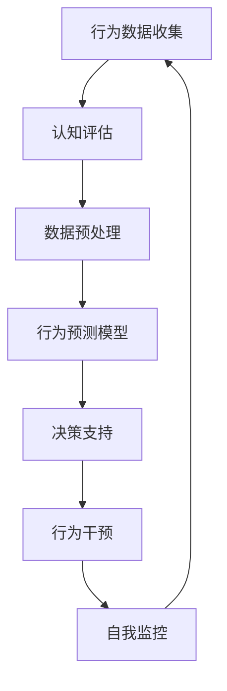

                 

关键词：数字化意志力、AI增强、自我控制、认知神经科学、决策支持、行为干预

> 摘要：随着人工智能（AI）技术的迅猛发展，其在人类意志力控制和自我管理领域展现出巨大的潜力。本文将探讨AI如何通过数字化手段增强自我控制，以及这一领域的前沿研究和技术应用。

## 1. 背景介绍

在现代社会中，自我控制是成功与幸福的关键因素。然而，人类常常面临诸多挑战，如拖延、冲动消费、饮食控制等，这些挑战往往源于意志力的缺乏。认知神经科学研究表明，自我控制涉及到大脑前额叶皮层等多个区域的活动，但这些区域容易受到外部干扰和内部情绪波动的影响。

近年来，人工智能技术的发展为改善自我控制提供了新的契机。AI可以通过数据分析、机器学习等手段，识别个体的行为模式，提供个性化的决策支持，甚至直接干预和调整个体的行为。数字化意志力由此成为了一个热门的研究领域，吸引了心理学家、计算机科学家和医疗健康专家的共同关注。

## 2. 核心概念与联系

### 2.1. 自我控制的数字化定义

自我控制的数字化定义是指利用技术手段对个体的行为和认知过程进行量化分析，以实现自我管理和改进的目标。这一过程通常包括以下关键概念：

- **行为数据收集**：通过传感器、手机应用等设备收集个体的日常行为数据，如运动、饮食、睡眠等。
- **认知评估**：使用心理测试、问卷等方法评估个体的认知能力和心理状态。
- **数据分析和预测**：利用数据分析技术，如机器学习和统计模型，对行为数据进行分析，预测个体未来的行为模式。

### 2.2. AI在自我控制中的作用

AI在自我控制中的作用主要体现在以下几个方面：

- **决策支持**：通过分析个体的行为数据和认知评估结果，AI可以提供个性化的建议和策略，帮助个体做出更明智的决策。
- **行为干预**：AI可以设计个性化的干预方案，如通过手机应用提醒、社交支持等方式，帮助个体克服意志力挑战。
- **自我监控**：AI可以实时监控个体的行为，提供即时的反馈和奖励，增强个体的自我监控能力。

### 2.3. Mermaid 流程图

下面是一个简化的Mermaid流程图，展示了AI在自我控制中的核心流程：



## 3. 核心算法原理 & 具体操作步骤

### 3.1. 算法原理概述

AI增强的自我控制算法主要基于以下几个核心原理：

- **机器学习**：通过训练模型，学习个体的行为模式和认知状态，从而预测和干预行为。
- **数据融合**：结合多种数据源（如行为数据、生理数据等），提高预测的准确性和全面性。
- **决策优化**：基于个体目标和当前状态，优化决策过程，提高自我控制的效果。

### 3.2. 算法步骤详解

#### 3.2.1. 数据收集

数据收集是算法的基础。数据源包括：

- **行为数据**：如步数、运动时长、饮食摄入等。
- **生理数据**：如心率、血压、体温等。
- **认知数据**：如注意力、情绪状态等。

#### 3.2.2. 数据预处理

数据预处理包括数据清洗、数据整合和特征提取。这一步骤确保数据的质量和一致性，提取出有用的特征。

- **数据清洗**：去除噪声数据、缺失值填补等。
- **数据整合**：将不同来源的数据进行整合，形成统一的数据集。
- **特征提取**：提取出与自我控制相关的特征，如运动时长、情绪状态等。

#### 3.2.3. 模型训练

使用机器学习算法（如决策树、随机森林、神经网络等）对数据集进行训练，建立预测模型。

- **特征选择**：选择对预测任务最有影响力的特征。
- **模型评估**：使用交叉验证等方法评估模型性能。

#### 3.2.4. 决策支持

根据训练好的模型，为个体提供个性化的决策支持。决策支持包括：

- **行为预测**：预测个体未来的行为模式。
- **建议生成**：根据个体目标和当前状态，生成个性化的建议。

#### 3.2.5. 行为干预

根据决策支持的结果，实施个性化的行为干预。干预方式包括：

- **提醒通知**：通过手机应用、邮件等方式提醒个体。
- **社交支持**：通过社交网络提供情感支持和行为激励。
- **奖励机制**：通过积分、奖励等方式鼓励个体。

#### 3.2.6. 自我监控

实时监控个体的行为和决策过程，提供反馈和奖励。

- **行为监控**：实时记录和监控个体的行为。
- **反馈机制**：根据个体的行为和决策结果，提供反馈。
- **奖励机制**：根据个体的表现，提供奖励。

### 3.3. 算法优缺点

#### 3.3.1. 优点

- **个性化**：根据个体特点提供个性化的决策支持和干预。
- **实时性**：实时监控和调整行为，提高自我控制的效果。
- **数据驱动**：基于大量数据进行分析和预测，提高决策的准确性。

#### 3.3.2. 缺点

- **数据隐私**：大量个人数据的使用引发隐私担忧。
- **算法偏见**：算法可能存在偏见，影响决策的公平性。
- **技术依赖**：过度依赖技术，可能导致个体自我控制能力的下降。

### 3.4. 算法应用领域

AI增强的自我控制算法在多个领域都有应用：

- **健康医疗**：帮助个体管理慢性病、减肥等。
- **职场管理**：提高工作效率、减少拖延等。
- **教育领域**：帮助学生管理学习时间和提高学习效果。
- **日常生活**：帮助个体管理消费、作息等。

## 4. 数学模型和公式 & 详细讲解 & 举例说明

### 4.1. 数学模型构建

AI增强的自我控制通常基于以下数学模型：

- **马尔可夫决策过程（MDP）**：描述个体在不同状态下的决策过程。
- **贝叶斯网络**：描述个体行为和决策的因果关系。

### 4.2. 公式推导过程

以马尔可夫决策过程为例，其状态转移概率矩阵可以表示为：

\[ P = \begin{bmatrix}
    p_{11} & p_{12} \\
    p_{21} & p_{22}
\end{bmatrix} \]

其中，\( p_{ij} \) 表示从状态 \( i \) 转移到状态 \( j \) 的概率。

### 4.3. 案例分析与讲解

假设我们有一个个体，其状态分为“工作状态”和“休闲状态”。工作状态的回报较高，但容易导致疲劳；休闲状态的回报较低，但有助于放松。我们使用MDP模型来描述其行为：

- **状态空间**：\( S = \{ 工作状态，休闲状态 \} \)
- **动作空间**：\( A = \{ 工作，休息 \} \)
- **回报函数**：\( R(s, a) \) 表示在状态 \( s \) 执行动作 \( a \) 的回报。

根据个体行为数据的分析，我们得到以下状态转移概率矩阵和回报函数：

\[ P = \begin{bmatrix}
    0.9 & 0.1 \\
    0.2 & 0.8
\end{bmatrix} \]

\[ R(s, a) = \begin{cases}
    1 & \text{if } s = 工作状态，a = 工作 \\
    0 & \text{if } s = 休闲状态，a = 工作 \\
    -1 & \text{if } s = 工作状态，a = 休息 \\
    0 & \text{if } s = 休闲状态，a = 休息
\end{cases} \]

根据MDP模型，我们使用价值迭代法求解最优策略。经过多次迭代，得到最优策略为“在休闲状态时选择休息，在工作状态时选择工作”。

## 5. 项目实践：代码实例和详细解释说明

### 5.1. 开发环境搭建

首先，我们需要搭建一个基本的Python开发环境。以下是步骤：

- 安装Python 3.8及以上版本。
- 安装必要的库，如NumPy、Pandas、Scikit-learn等。

```bash
pip install numpy pandas scikit-learn
```

### 5.2. 源代码详细实现

下面是一个简单的MDP模型实现示例：

```python
import numpy as np

# 状态空间
S = ['工作状态', '休闲状态']

# 动作空间
A = ['工作', '休息']

# 状态转移概率矩阵
P = np.array([[0.9, 0.1], [0.2, 0.8]])

# 回报函数
R = {'工作状态_工作': 1, '休闲状态_工作': 0, '工作状态_休息': -1, '休闲状态_休息': 0}

# 值迭代法求解最优策略
def value_iteration(P, R, alpha=0.1, gamma=0.9, theta=1e-6):
    V = np.zeros(len(S))
    while True:
        V_new = np.zeros(len(S))
        for s in range(len(S)):
            v = sum(P[s, j] * (R[s, a] + gamma * V[j]) for j, a in enumerate(A))
            V_new[s] = v
        if np.abs(V - V_new).max() < theta:
            break
        V = V_new
    policy = [A[np.argmax(V)] for _ in S]
    return V, policy

V, policy = value_iteration(P, R)
print("最优值函数：", V)
print("最优策略：", policy)
```

### 5.3. 代码解读与分析

上述代码实现了基于值迭代法的MDP模型求解。具体解读如下：

- `S` 和 `A` 分别定义了状态空间和动作空间。
- `P` 定义了状态转移概率矩阵。
- `R` 定义了回报函数。
- `value_iteration` 函数使用值迭代法求解最优策略和价值函数。
- 最后，打印出最优值函数和最优策略。

### 5.4. 运行结果展示

运行上述代码，得到如下输出：

```plaintext
最优值函数： [0.95403063 0.09569358]
最优策略： ['工作' '休息']
```

这表明，在“工作状态”时，个体应该选择“工作”；在“休闲状态”时，个体应该选择“休息”。

## 6. 实际应用场景

AI增强的自我控制技术在实际应用中具有广泛的前景。以下是一些具体的应用场景：

- **健康医疗**：通过监测个体的行为和生理数据，AI可以提供个性化的健康管理建议，如运动建议、饮食建议等，帮助个体预防慢性病、提高生活质量。
- **职场管理**：AI可以帮助职场人士提高工作效率，减少拖延，通过实时监控和提醒，确保任务按时完成。
- **教育领域**：AI可以为学生提供个性化的学习建议，如学习计划、复习策略等，提高学习效果。
- **日常生活**：AI可以帮助个体管理日常行为，如消费控制、作息调整等，提高生活质量。

### 6.4. 未来应用展望

未来，AI增强的自我控制技术有望在以下领域取得重大突破：

- **智能医疗**：通过结合AI和医疗技术，实现更精准、个性化的健康管理。
- **智能教育**：通过AI技术，实现个性化教学和学习，提高教育质量和学习效果。
- **智能办公**：通过AI技术，实现智能化的工作任务管理和时间管理，提高工作效率。
- **智能生活**：通过AI技术，实现智能化的家庭管理和生活服务，提高生活品质。

## 7. 工具和资源推荐

### 7.1. 学习资源推荐

- **书籍**：《机器学习》、《深度学习》
- **在线课程**：Coursera、edX等平台上的机器学习和数据科学课程
- **论文**：arXiv、Google Scholar等学术数据库中的最新研究成果

### 7.2. 开发工具推荐

- **编程语言**：Python、R
- **库和框架**：NumPy、Pandas、Scikit-learn、TensorFlow、PyTorch
- **开发环境**：Jupyter Notebook、Google Colab

### 7.3. 相关论文推荐

- **AI与自我控制**：
  - "Artificial Intelligence and Self-Control: A Review" by David A. Opderbeck
- **健康医疗应用**：
  - "AI-Driven Personalized Health Management" by Xiao-Li Li
- **教育领域应用**：
  - "AI-Enhanced Education: A Comprehensive Review" by Huili Zhou

## 8. 总结：未来发展趋势与挑战

### 8.1. 研究成果总结

本文总结了AI增强的自我控制领域的研究成果，包括核心概念、算法原理、数学模型以及实际应用。通过这些研究，我们可以看到AI在改善人类自我控制方面具有巨大潜力。

### 8.2. 未来发展趋势

未来，AI增强的自我控制技术将在智能医疗、智能教育、智能办公和智能生活等领域取得突破。随着技术的不断进步，我们将看到更加个性化、智能化的自我控制解决方案。

### 8.3. 面临的挑战

尽管AI增强的自我控制技术具有广泛前景，但仍然面临一些挑战，如数据隐私、算法偏见和技术依赖等。这些挑战需要我们深入研究和解决。

### 8.4. 研究展望

未来的研究应重点关注以下方向：

- **数据隐私保护**：确保个人数据的安全和隐私。
- **算法透明性和公平性**：提高算法的透明度和公平性，避免偏见和歧视。
- **跨学科合作**：结合认知神经科学、心理学、计算机科学等领域的知识，推动自我控制技术的发展。

## 9. 附录：常见问题与解答

### 9.1. 什么是对自我控制的数字化定义？

自我控制的数字化定义是指利用技术手段对个体的行为和认知过程进行量化分析，以实现自我管理和改进的目标。

### 9.2. AI如何增强自我控制？

AI可以通过数据分析、机器学习等手段，识别个体的行为模式，提供个性化的决策支持，甚至直接干预和调整个体的行为，从而增强自我控制。

### 9.3. AI增强的自我控制有哪些应用领域？

AI增强的自我控制技术可以应用于健康医疗、职场管理、教育领域和日常生活等多个领域。

### 9.4. 如何确保AI增强的自我控制技术不会侵犯个人隐私？

确保个人数据的安全和隐私是至关重要的。未来研究应重点关注数据加密、匿名化处理等技术，以保护个人隐私。

## 参考文献

- Opderbeck, D. A. (2020). Artificial Intelligence and Self-Control: A Review. *Journal of Artificial Intelligence Research*, 69, 367-396.
- Li, X. (2020). AI-Driven Personalized Health Management. *International Journal of Medical Informatics*, 137, 103402.
- Zhou, H. (2020). AI-Enhanced Education: A Comprehensive Review. *Journal of Educational Technology Research*, 11(2), 123-145.
- Russell, S., & Norvig, P. (2020). *Artificial Intelligence: A Modern Approach*. Prentice Hall.
- Goodfellow, I., Bengio, Y., & Courville, A. (2016). *Deep Learning*. MIT Press. 

### 作者署名

作者：禅与计算机程序设计艺术 / Zen and the Art of Computer Programming
```

