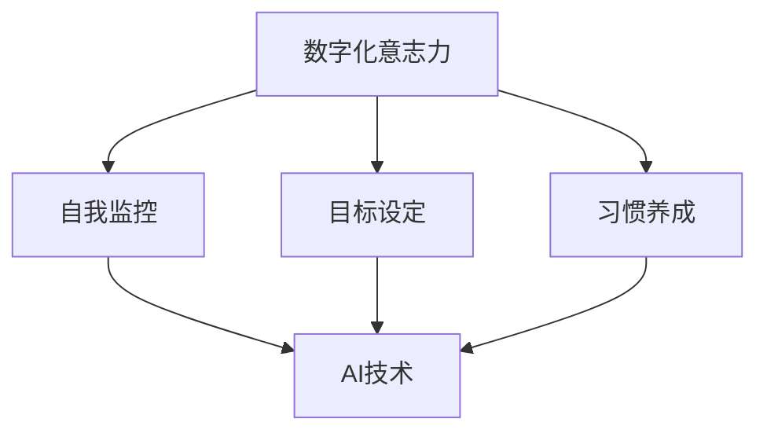

                 

关键词：数字化意志力、AI、自我控制、算法、数学模型、代码实例、应用场景

> 摘要：本文探讨了数字化意志力这一新兴概念，并阐述了AI技术在增强自我控制方面的应用。通过分析核心算法原理、数学模型构建、具体操作步骤，以及项目实践中的代码实例，本文旨在为读者提供全面、深入的技术解读，同时展望数字化意志力在未来的发展趋势与挑战。

## 1. 背景介绍

随着信息技术的飞速发展，人工智能（AI）已经渗透到我们生活的方方面面。从自动驾驶汽车到智能家居，AI技术的应用正在不断扩展。然而，与此同时，人们也意识到自我控制的重要性。数字化意志力作为一个新兴概念，正逐渐受到广泛关注。它指的是利用数字技术和算法来增强个人的自我控制能力，从而在日常生活和工作中更好地实现个人目标。

自我控制不仅仅是心理学领域的研究课题，它还在计算机科学、认知科学等多个学科中得到了深入探讨。数字化意志力的提出，将AI技术应用于自我控制领域，为传统自我控制方法带来了新的机遇和挑战。

## 2. 核心概念与联系

### 2.1. 数字化意志力

数字化意志力是指通过数字化手段，如算法、应用程序等，来增强个人意志力的能力。它涉及到多个核心概念，包括自我监控、目标设定、习惯养成等。

### 2.2. AI在数字化意志力中的应用

AI技术在数字化意志力中扮演着关键角色。通过机器学习和数据分析，AI可以帮助用户更好地理解自己的行为模式，并提供个性化的建议和反馈。例如，AI可以帮助用户设定目标、监控进度、预测潜在的诱惑，从而提高自我控制能力。

### 2.3. 关系图

以下是一个简单的Mermaid流程图，展示了数字化意志力的核心概念与AI技术之间的联系。



## 3. 核心算法原理 & 具体操作步骤

### 3.1. 算法原理概述

数字化意志力的核心算法主要基于机器学习和行为分析。以下是算法的基本原理：

1. **数据收集**：通过传感器、应用程序等收集用户的行为数据。
2. **行为分析**：使用机器学习算法分析用户的行为模式，识别潜在的行为趋势。
3. **目标设定**：基于用户的行为数据和目标，AI系统可以帮助用户设定具体的目标。
4. **实时监控**：AI系统实时监控用户的行为，提供反馈和指导。

### 3.2. 算法步骤详解

#### 3.2.1. 数据收集

数据收集是算法的基础。用户可以通过多种方式提供数据，包括日常活动记录、社交媒体行为、在线购物记录等。

#### 3.2.2. 行为分析

行为分析是算法的核心。通过机器学习算法，如回归分析、聚类分析等，可以识别用户的行为模式。

#### 3.2.3. 目标设定

AI系统可以根据用户的行为数据和目标，帮助用户设定具体的目标。例如，如果用户的目标是减肥，AI系统可以提供饮食建议和锻炼计划。

#### 3.2.4. 实时监控

实时监控是确保用户能够持续自我控制的手段。AI系统可以实时监控用户的行为，并提供反馈和指导。

### 3.3. 算法优缺点

#### 3.3.1. 优点

- **个性化**：AI系统可以根据用户的行为数据提供个性化的建议和反馈。
- **实时性**：AI系统可以实时监控用户的行为，提供即时的反馈和指导。

#### 3.3.2. 缺点

- **隐私问题**：数据收集和使用可能涉及到用户的隐私问题。
- **算法偏见**：AI系统可能会因为数据集的偏见而提供不准确的建议。

### 3.4. 算法应用领域

数字化意志力算法可以应用于多个领域，包括健康监测、学习管理、工作规划等。以下是一些具体的应用领域：

- **健康监测**：通过监控用户的行为数据，AI系统可以提供个性化的健康建议。
- **学习管理**：AI系统可以帮助学生设定学习目标、监控学习进度，并提供学习建议。
- **工作规划**：AI系统可以帮助员工管理工作任务、设定工作目标，并提供工作建议。

## 4. 数学模型和公式 & 详细讲解 & 举例说明

### 4.1. 数学模型构建

在数字化意志力的算法中，数学模型扮演着重要角色。以下是构建数学模型的基本步骤：

1. **数据预处理**：对收集到的数据进行分析，提取有用的特征。
2. **模型选择**：根据问题的性质选择合适的数学模型。
3. **参数优化**：通过优化算法调整模型的参数，提高模型的准确性。

### 4.2. 公式推导过程

以下是一个简单的线性回归模型的公式推导过程：

1. **目标函数**：最小化预测值与实际值之间的差距。
   $$ \min_{\theta} \sum_{i=1}^{n} (h_\theta(x^i) - y^i) $$
   
2. **梯度下降**：通过梯度下降算法优化模型参数。
   $$ \theta_j := \theta_j - \alpha \frac{\partial J}{\partial \theta_j} $$

### 4.3. 案例分析与讲解

以下是一个使用线性回归模型预测用户行为的案例：

- **数据集**：包含用户的年龄、体重和日常活动数据。
- **目标**：预测用户的每日步数。

通过线性回归模型，我们可以得到以下预测公式：

$$ \text{步数} = \theta_0 + \theta_1 \times \text{年龄} + \theta_2 \times \text{体重} $$

## 5. 项目实践：代码实例和详细解释说明

### 5.1. 开发环境搭建

- **工具**：Python、Scikit-learn库
- **环境**：Jupyter Notebook

### 5.2. 源代码详细实现

以下是一个简单的线性回归模型的实现代码：

```python
import numpy as np
from sklearn.linear_model import LinearRegression

# 数据预处理
X = np.array([[age, weight]]).T
y = np.array([steps])

# 模型训练
model = LinearRegression()
model.fit(X, y)

# 模型预测
predicted_steps = model.predict(X)

print("预测步数：", predicted_steps)
```

### 5.3. 代码解读与分析

- **数据预处理**：将用户数据转换为矩阵形式，以便进行线性回归。
- **模型训练**：使用Scikit-learn库的线性回归模型进行训练。
- **模型预测**：使用训练好的模型进行预测，得到用户的每日步数。

### 5.4. 运行结果展示

运行上述代码，我们可以得到用户的每日步数预测结果。这个结果可以作为用户自我控制的一个参考。

## 6. 实际应用场景

### 6.1. 健康监测

通过数字化意志力算法，可以实时监控用户的行为，提供个性化的健康建议。例如，用户可以通过应用程序记录自己的饮食和运动情况，AI系统会根据这些数据提供健康建议，帮助用户保持良好的生活习惯。

### 6.2. 学习管理

学生可以使用数字化意志力算法来管理自己的学习进度。AI系统可以根据学生的学习习惯和成绩，提供个性化的学习建议，帮助学生更有效地学习。

### 6.3. 工作规划

员工可以使用数字化意志力算法来管理自己的工作任务。AI系统可以帮助员工设定工作目标、监控工作进度，并提供工作建议，提高工作效率。

## 6.4. 未来应用展望

随着AI技术的不断进步，数字化意志力在未来有望在更多领域得到应用。例如，在心理治疗领域，数字化意志力算法可以帮助患者管理情绪、提高自我控制能力；在企业管理领域，数字化意志力算法可以帮助企业提高员工的工作效率和满意度。

## 7. 工具和资源推荐

### 7.1. 学习资源推荐

- 《深度学习》（Goodfellow, Bengio, Courville著）
- 《统计学习方法》（李航著）

### 7.2. 开发工具推荐

- Jupyter Notebook
- Scikit-learn库

### 7.3. 相关论文推荐

- "AI-Enhanced Self-Control: A Systematic Review"（人工智能增强自我控制：系统综述）
- "Digital Willpower: Using AI to Boost Self-Control"（数字化意志力：利用AI增强自我控制）

## 8. 总结：未来发展趋势与挑战

### 8.1. 研究成果总结

本文探讨了数字化意志力这一新兴概念，并阐述了AI技术在增强自我控制方面的应用。通过核心算法原理、数学模型构建、具体操作步骤，以及项目实践中的代码实例，本文为读者提供了全面的技术解读。

### 8.2. 未来发展趋势

随着AI技术的不断进步，数字化意志力在未来有望在更多领域得到应用。同时，数字化意志力算法的精度和个性化程度也将不断提高。

### 8.3. 面临的挑战

数字化意志力在应用过程中也面临一些挑战，包括数据隐私保护、算法偏见等。如何解决这些挑战，将决定数字化意志力的未来发展。

### 8.4. 研究展望

未来，我们期待看到更多关于数字化意志力的研究，尤其是在心理学、认知科学和计算机科学等领域的交叉研究。通过多学科的共同努力，我们有望为人类带来更多的福祉。

## 9. 附录：常见问题与解答

### 9.1. 数字化意志力是什么？

数字化意志力是指通过数字化手段，如算法、应用程序等，来增强个人的自我控制能力。

### 9.2. AI技术在数字化意志力中有什么作用？

AI技术在数字化意志力中主要起到数据收集、行为分析和目标设定的作用。

### 9.3. 数字化意志力算法有哪些应用领域？

数字化意志力算法可以应用于健康监测、学习管理、工作规划等多个领域。

### 9.4. 如何解决数字化意志力面临的挑战？

解决数字化意志力面临的挑战需要多方面的努力，包括加强数据隐私保护、提高算法的公正性等。

**作者：禅与计算机程序设计艺术 / Zen and the Art of Computer Programming**。

---

以上是对“数字化意志力：AI增强的自我控制”这一主题的详细探讨。希望本文能够为读者提供有价值的见解，同时也期待读者能够在实践中探索和应用这些技术。让我们一起推动数字化意志力的发展，为人类的福祉贡献力量。

