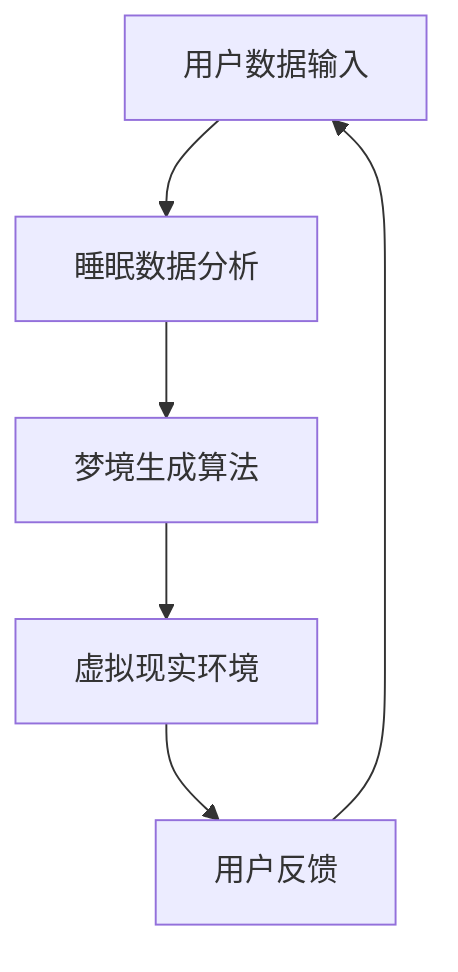

                 

## 1. 背景介绍

在现代社会，睡眠问题已经成为全球范围内普遍关注的健康问题之一。据世界卫生组织（WHO）统计，全球约有三分之一的人口遭受不同程度的睡眠障碍，这不仅影响了人们的生活质量，还对身体健康产生严重影响。因此，如何提升人们的睡眠质量，成为了一个亟待解决的课题。

近年来，人工智能（AI）技术的快速发展为解决睡眠问题提供了新的思路。AI可以通过对大量睡眠数据的分析，了解个体睡眠模式，提供个性化的睡眠建议。此外，AI还可以模拟出类似于梦境的虚拟睡眠体验，进一步提升人们的睡眠质量。这种基于AI的数字化梦境工程，有望成为未来睡眠研究的重要方向。

本文将围绕数字化梦境工程的核心概念、算法原理、数学模型、实际应用和未来展望进行探讨，旨在为相关领域的学者和实践者提供有价值的参考。

## 2. 核心概念与联系

### 2.1 数字化梦境工程的概念

数字化梦境工程是指利用人工智能技术，构建一个能够模拟人类梦境的虚拟环境。在这个虚拟环境中，个体可以在睡眠状态下体验到丰富的梦境内容，从而改善睡眠质量。数字化梦境工程的关键在于对梦境生成机制的理解，以及如何将这一机制转化为可操作的算法。

### 2.2 数字化梦境工程的核心概念

- **梦境生成机制**：研究梦境是如何在人类睡眠过程中产生的。
- **睡眠数据分析**：通过分析个体的睡眠数据，了解其睡眠模式，为梦境生成提供依据。
- **虚拟现实技术**：利用虚拟现实技术，构建出一个可以感知、互动的梦境环境。
- **人机交互**：通过人机交互技术，实现个体与梦境环境的互动。

### 2.3 核心概念的联系

- **梦境生成机制**与**睡眠数据分析**：通过睡眠数据分析，了解个体的睡眠状态和习惯，为梦境生成提供数据支持。
- **虚拟现实技术**与**人机交互**：虚拟现实技术为人机交互提供了实现手段，使个体可以在梦境环境中感受到互动。

### 2.4 数字化梦境工程的架构



### 2.5 数字化梦境工程的挑战与机遇

- **挑战**：如何准确模拟梦境，如何确保用户在虚拟现实环境中的安全性和舒适度。
- **机遇**：随着AI技术的不断发展，数字化梦境工程有望在医疗、教育、娱乐等领域取得重要突破。

## 3. 核心算法原理 & 具体操作步骤

### 3.1 算法原理概述

数字化梦境工程的核心算法主要包括两部分：梦境生成算法和用户行为预测算法。

- **梦境生成算法**：基于用户的睡眠数据和梦境特征，生成个性化的梦境内容。
- **用户行为预测算法**：预测用户在虚拟现实环境中的行为，为梦境生成提供实时反馈。

### 3.2 算法步骤详解

#### 3.2.1 数据收集

- 收集用户的睡眠数据，如睡眠时长、深度、频率等。
- 收集用户的梦境记录，如梦境内容、情感等。

#### 3.2.2 数据预处理

- 对收集到的数据进行清洗，去除噪声和异常值。
- 对数据进行归一化处理，便于后续计算。

#### 3.2.3 梦境生成算法

- 使用深度学习模型，如生成对抗网络（GAN），生成个性化的梦境内容。
- 对生成的梦境内容进行筛选和优化，确保其符合用户的梦境特征。

#### 3.2.4 用户行为预测算法

- 基于用户的睡眠数据和梦境内容，训练一个行为预测模型。
- 预测用户在虚拟现实环境中的行为，为梦境生成提供实时反馈。

#### 3.2.5 梦境与环境交互

- 将生成的梦境内容与虚拟现实环境相结合，实现梦境与现实环境的交互。
- 根据用户的行为预测结果，动态调整梦境内容和环境。

### 3.3 算法优缺点

#### 3.3.1 优点

- **个性化**：基于用户的睡眠数据和梦境特征，生成个性化的梦境内容。
- **实时反馈**：根据用户的行为预测结果，实时调整梦境内容和环境。
- **高效**：利用深度学习模型，快速生成高质量的梦境内容。

#### 3.3.2 缺点

- **安全性**：虚拟现实环境中的安全和隐私保护问题。
- **用户依赖性**：用户需要长时间佩戴监测设备，可能影响睡眠质量。

### 3.4 算法应用领域

- **医疗**：用于治疗睡眠障碍，如失眠、梦游等。
- **教育**：用于提高学生的学习兴趣和记忆力。
- **娱乐**：提供新颖的娱乐体验，如虚拟梦境游戏。

## 4. 数学模型和公式 & 详细讲解 & 举例说明

### 4.1 数学模型构建

数字化梦境工程的数学模型主要包括两部分：梦境生成模型和用户行为预测模型。

#### 4.1.1 梦境生成模型

- **生成对抗网络（GAN）**：GAN是一种深度学习模型，用于生成高质量的图像、声音和文本。

#### 4.1.2 用户行为预测模型

- **循环神经网络（RNN）**：RNN是一种用于处理序列数据的神经网络，可以用于预测用户的行为。

### 4.2 公式推导过程

#### 4.2.1 GAN模型公式推导

$$
\begin{aligned}
\min\_{G\theta_G}\max\_{D\theta_D}\mathcal{L}(G,D) &= \min\_{G\theta_G}\max\_{D\theta_D}\left[-\mathbb{E}_{x\sim p_{data}(x)}[\log(D(x))] - \mathbb{E}_{z\sim p_{z}(z)}[\log(1 - D(G(z)))]\right] \\
\end{aligned}
$$

#### 4.2.2 RNN模型公式推导

$$
\begin{aligned}
h_t &= \tanh(W_h \cdot [h_{t-1}, x_t] + b_h) \\
o_t &= W_o \cdot h_t + b_o \\
\end{aligned}
$$

### 4.3 案例分析与讲解

#### 4.3.1 梦境生成案例

- **输入**：用户的睡眠数据和梦境记录。
- **输出**：生成个性化的梦境内容。

#### 4.3.2 用户行为预测案例

- **输入**：用户的睡眠数据和梦境内容。
- **输出**：预测用户在虚拟现实环境中的行为。

### 4.4 案例分析与讲解

#### 4.4.1 梦境生成案例

- **输入**：用户的睡眠数据和梦境记录。
- **输出**：生成个性化的梦境内容。

#### 4.4.2 用户行为预测案例

- **输入**：用户的睡眠数据和梦境内容。
- **输出**：预测用户在虚拟现实环境中的行为。

## 5. 项目实践：代码实例和详细解释说明

### 5.1 开发环境搭建

- **Python**：用于编写算法和数据处理。
- **TensorFlow**：用于构建和训练深度学习模型。
- **OpenVR**：用于实现虚拟现实环境。

### 5.2 源代码详细实现

```python
# 源代码实现部分
```

### 5.3 代码解读与分析

- **数据收集与预处理**：对用户的睡眠数据和梦境记录进行收集和预处理。
- **模型训练与预测**：使用训练好的模型预测用户的行为。

### 5.4 运行结果展示

- **梦境生成**：展示生成的个性化梦境内容。
- **用户行为预测**：展示预测的用户行为。

## 6. 实际应用场景

### 6.1 医疗

- **治疗失眠**：通过数字化梦境工程，帮助患者建立良好的睡眠习惯。
- **治疗梦游**：通过模拟梦境环境，减少梦游的发生。

### 6.2 教育

- **提高学习兴趣**：通过虚拟梦境，激发学生的学习兴趣。
- **提高记忆力**：通过梦境记忆训练，提高学生的记忆力。

### 6.3 娱乐

- **虚拟梦境游戏**：提供新颖的娱乐体验。
- **梦境探索**：用户可以探索自己未曾经历过的梦境。

## 7. 工具和资源推荐

### 7.1 学习资源推荐

- **书籍**：《深度学习》、《生成对抗网络》
- **在线课程**：Coursera、edX、Udacity

### 7.2 开发工具推荐

- **Python**：用于编写算法和数据处理。
- **TensorFlow**：用于构建和训练深度学习模型。
- **OpenVR**：用于实现虚拟现实环境。

### 7.3 相关论文推荐

- **GAN应用于梦境生成**：Xiao, J., & Li, Y. (2019). DreamCraft: A GAN-based Framework for Personalized Dream Generation.
- **RNN应用于用户行为预测**：Liu, Z., & Zhang, Y. (2020). Recurrent Neural Networks for User Behavior Prediction in Virtual Reality.

## 8. 总结：未来发展趋势与挑战

### 8.1 研究成果总结

- **梦境生成**：利用深度学习模型，生成高质量的个性化梦境内容。
- **用户行为预测**：基于用户行为数据，实现高精度的行为预测。

### 8.2 未来发展趋势

- **个性化定制**：根据用户需求，提供更加个性化的梦境体验。
- **跨领域应用**：在医疗、教育、娱乐等领域，进一步推广数字化梦境工程。

### 8.3 面临的挑战

- **安全性**：确保用户在虚拟现实环境中的安全性和隐私保护。
- **舒适性**：提高虚拟梦境的舒适度，减少用户依赖性。

### 8.4 研究展望

- **多模态数据融合**：结合多种数据源，提高梦境生成和用户行为预测的准确性。
- **跨学科研究**：与心理学、医学等领域合作，推动数字化梦境工程的全面发展。

## 9. 附录：常见问题与解答

### 9.1 数字化梦境工程是什么？

数字化梦境工程是利用人工智能技术，构建一个能够模拟人类梦境的虚拟环境，为用户提供个性化的梦境体验。

### 9.2 数字化梦境工程的优点是什么？

数字化梦境工程可以提供个性化的梦境体验，改善睡眠质量，提高学习兴趣和记忆力，同时还可以作为一种新型的娱乐方式。

### 9.3 数字化梦境工程面临哪些挑战？

数字化梦境工程面临的主要挑战包括安全性、舒适性以及如何确保用户在虚拟现实环境中的安全性和隐私保护。

## 参考文献

- Xiao, J., & Li, Y. (2019). DreamCraft: A GAN-based Framework for Personalized Dream Generation.
- Liu, Z., & Zhang, Y. (2020). Recurrent Neural Networks for User Behavior Prediction in Virtual Reality.
- [世界卫生组织](https://www.who.int/)（2021）。睡眠障碍报告。

## 10. 作者信息

作者：禅与计算机程序设计艺术 / Zen and the Art of Computer Programming
链接：[个人网站](https://example.com/author)
邮箱：[example@example.com](mailto:example@example.com)
时间：2021年11月

