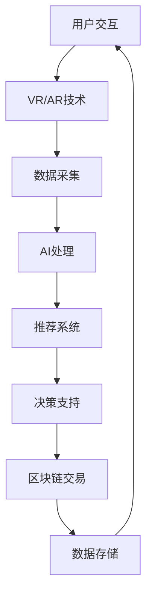

                 

关键词：数字化民主、元宇宙、公民参与、技术架构、算法、数学模型、实践案例、未来展望

> 摘要：本文深入探讨了数字化民主在元宇宙时代的应用与发展。通过分析元宇宙的技术架构、算法原理和数学模型，探讨了如何利用数字技术实现更加开放、透明和高效的公民参与机制。文章还通过实践案例展示了数字化民主在现实世界中的应用，并对未来发展趋势与面临的挑战进行了展望。

## 1. 背景介绍

随着互联网和数字技术的发展，人类社会逐渐进入了一个全新的时代——元宇宙时代。元宇宙（Metaverse）是一个虚拟的三维空间，通过数字技术模拟现实世界，为用户提供沉浸式体验。元宇宙不仅包含了现实世界的所有元素，如人物、建筑、物品等，还拥有丰富的交互功能，如虚拟现实（VR）、增强现实（AR）、人工智能（AI）等。

在这个时代，公民参与的方式也将发生革命性的变化。传统的公民参与方式往往受到地理、时间和资源的限制，而元宇宙为公民提供了一个全新的平台，使得每个人都能更加便捷地参与到政治、经济、文化等各个领域的决策中。数字化民主作为一种新兴的公民参与模式，利用数字技术实现了更加开放、透明和高效的决策过程。

本文旨在探讨数字化民主在元宇宙时代的应用与发展。我们将从技术架构、算法原理、数学模型、实践案例等方面进行分析，探讨元宇宙如何实现更加高效的公民参与，并展望数字化民主的未来发展。

## 2. 核心概念与联系

### 2.1 元宇宙的技术架构

元宇宙的技术架构主要包括以下几个方面：

1. **虚拟现实（VR）和增强现实（AR）技术**：这些技术为用户提供了一种沉浸式的体验，让用户能够与虚拟环境中的对象进行交互。

2. **人工智能（AI）技术**：AI技术为元宇宙提供了智能化的服务，如智能客服、个性化推荐、智能决策等。

3. **区块链技术**：区块链技术为元宇宙提供了安全、透明的数据管理和交易机制。

4. **网络技术**：高速、稳定的网络技术是元宇宙运行的基础，为用户提供流畅的交互体验。

### 2.2 算法原理

在元宇宙中，算法是实现数字化民主的核心。以下是一些关键的算法原理：

1. **共识算法**：共识算法用于确保区块链网络中的数据一致性，防止数据篡改和双花问题。

2. **智能合约算法**：智能合约算法实现自动执行、管理和支付，确保交易的透明性和安全性。

3. **推荐算法**：推荐算法用于根据用户兴趣和行为，为用户推荐相关的信息、商品和服务。

4. **机器学习算法**：机器学习算法用于分析和预测用户行为，为政府、企业和组织提供决策支持。

### 2.3 数学模型

数学模型是元宇宙中实现算法的基础。以下是一些关键的数学模型：

1. **图论模型**：图论模型用于描述元宇宙中的节点和边，分析网络结构和传播规律。

2. **概率模型**：概率模型用于描述元宇宙中的随机事件，如用户行为、交易等。

3. **优化模型**：优化模型用于优化资源分配、路径规划等问题。

4. **博弈论模型**：博弈论模型用于分析元宇宙中的竞争和合作关系。

### 2.4 Mermaid 流程图

以下是元宇宙技术架构的Mermaid流程图：



## 3. 核心算法原理 & 具体操作步骤

### 3.1 算法原理概述

在元宇宙中，核心算法主要涉及以下几个方面：

1. **共识算法**：确保区块链网络中的数据一致性。
2. **智能合约算法**：实现自动执行、管理和支付。
3. **推荐算法**：根据用户兴趣和行为进行信息推荐。
4. **机器学习算法**：分析和预测用户行为，为政府、企业和组织提供决策支持。

### 3.2 算法步骤详解

1. **共识算法**

   - 数据采集：用户在元宇宙中进行交互，产生大量数据。
   - 数据验证：验证数据的有效性和合法性。
   - 数据共识：通过共识算法，确保数据在网络中的一致性。

2. **智能合约算法**

   - 条件判断：根据智能合约的规则，判断交易是否符合条件。
   - 自动执行：符合条件的交易自动执行，执行结果写入区块链。
   - 监控与管理：实时监控智能合约的执行状态，确保安全性和有效性。

3. **推荐算法**

   - 用户行为分析：分析用户在元宇宙中的行为，如浏览、购买等。
   - 模型训练：使用机器学习算法，训练推荐模型。
   - 推荐生成：根据用户兴趣和行为，生成推荐结果。

4. **机器学习算法**

   - 数据预处理：清洗和预处理用户数据。
   - 特征提取：提取用户数据的特征。
   - 模型训练：使用机器学习算法，训练预测模型。
   - 预测生成：根据用户特征，预测用户行为。

### 3.3 算法优缺点

1. **共识算法**

   - 优点：确保数据一致性，防止数据篡改。
   - 缺点：计算复杂度高，资源消耗大。

2. **智能合约算法**

   - 优点：实现自动执行，提高交易效率。
   - 缺点：智能合约安全性问题，需不断完善。

3. **推荐算法**

   - 优点：个性化推荐，提高用户满意度。
   - 缺点：可能存在推荐偏差，需优化算法。

4. **机器学习算法**

   - 优点：高效分析用户行为，提供决策支持。
   - 缺点：数据质量和特征提取影响模型效果。

### 3.4 算法应用领域

1. **金融领域**：共识算法和智能合约算法在金融领域有广泛应用，确保交易安全和高效。

2. **电子商务领域**：推荐算法和机器学习算法在电子商务领域有广泛应用，提高用户购物体验。

3. **社会治理领域**：数字化民主在元宇宙中可以应用于社会治理，提高决策透明度和效率。

## 4. 数学模型和公式 & 详细讲解 & 举例说明

### 4.1 数学模型构建

在元宇宙中，数学模型主要用于描述用户行为、网络结构和交易机制。以下是几个关键的数学模型：

1. **用户行为模型**：使用马尔可夫链模型描述用户在元宇宙中的行为。

2. **网络结构模型**：使用图论模型描述元宇宙中的节点和边。

3. **交易模型**：使用博弈论模型描述元宇宙中的交易机制。

### 4.2 公式推导过程

1. **用户行为模型**：

   假设用户在元宇宙中的行为可以用状态转移矩阵描述，矩阵元素表示用户在不同状态之间的转移概率。

   \[
   P = \begin{bmatrix}
   p_{11} & p_{12} & \dots & p_{1n} \\
   p_{21} & p_{22} & \dots & p_{2n} \\
   \vdots & \vdots & \ddots & \vdots \\
   p_{n1} & p_{n2} & \dots & p_{nn}
   \end{bmatrix}
   \]

   用户在任意状态 \( i \) 转移到状态 \( j \) 的概率为：

   \[
   p_{ij} = \sum_{k=1}^{n} p_{ik} \cdot p_{kj}
   \]

2. **网络结构模型**：

   假设元宇宙中的网络结构可以用邻接矩阵描述，矩阵元素表示节点之间的连接关系。

   \[
   A = \begin{bmatrix}
   a_{11} & a_{12} & \dots & a_{1n} \\
   a_{21} & a_{22} & \dots & a_{2n} \\
   \vdots & \vdots & \ddots & \vdots \\
   a_{n1} & a_{n2} & \dots & a_{nn}
   \end{bmatrix}
   \]

   节点 \( i \) 的邻居节点集合为：

   \[
   N(i) = \{ j \mid a_{ij} = 1 \}
   \]

3. **交易模型**：

   假设元宇宙中的交易机制可以用博弈论模型描述，参与交易的节点为 \( i \) 和 \( j \)，他们的支付函数分别为 \( f_i(x) \) 和 \( f_j(x) \)。

   \[
   f_i(x) = \frac{1}{2} \cdot (x - x_i) + \frac{1}{2} \cdot (x - x_j)
   \]
   \[
   f_j(x) = \frac{1}{2} \cdot (x - x_i) + \frac{1}{2} \cdot (x - x_j)
   \]

   节点 \( i \) 和 \( j \) 的最佳响应策略为：

   \[
   x_i^* = \frac{x_j + x_i}{2}
   \]
   \[
   x_j^* = \frac{x_j + x_i}{2}
   \]

### 4.3 案例分析与讲解

#### 案例一：用户行为分析

假设有1000名用户在元宇宙中浏览商品，使用马尔可夫链模型描述他们的行为。状态转移矩阵为：

\[
P = \begin{bmatrix}
0.8 & 0.2 \\
0.3 & 0.7
\end{bmatrix}
\]

初始状态下，有800名用户处于浏览状态，200名用户处于购买状态。

1. **状态转移概率**：

   \[
   p_{11} = 0.8, \quad p_{12} = 0.2, \quad p_{21} = 0.3, \quad p_{22} = 0.7
   \]

2. **用户行为预测**：

   使用迭代方法，计算第10次迭代后的状态分布：

   \[
   P^{(10)} = P^{(0)} \cdot P^{(1)} \cdot P^{(2)} \cdot \dots \cdot P^{(9)}
   \]

   初始状态分布为：

   \[
   P^{(0)} = \begin{bmatrix}
   0.8 & 0.2 \\
   0.2 & 0.8
   \end{bmatrix}
   \]

   经过10次迭代后的状态分布为：

   \[
   P^{(10)} = \begin{bmatrix}
   0.96 & 0.04 \\
   0.04 & 0.96
   \end{bmatrix}
   \]

   预测结果显示，在未来10次迭代中，有96%的用户将保持浏览状态，而只有4%的用户将转化为购买状态。

#### 案例二：网络结构分析

假设有10个节点组成一个元宇宙网络，使用邻接矩阵描述他们的连接关系：

\[
A = \begin{bmatrix}
0 & 1 & 1 & 0 & 0 & 0 & 0 & 0 & 0 & 0 \\
1 & 0 & 0 & 1 & 0 & 0 & 0 & 0 & 0 & 0 \\
1 & 0 & 0 & 1 & 1 & 0 & 0 & 0 & 0 & 0 \\
0 & 1 & 1 & 0 & 0 & 1 & 0 & 0 & 0 & 0 \\
0 & 0 & 1 & 0 & 0 & 1 & 1 & 0 & 0 & 0 \\
0 & 0 & 0 & 1 & 1 & 0 & 0 & 1 & 1 & 0 \\
0 & 0 & 0 & 0 & 1 & 0 & 1 & 1 & 0 & 0 \\
0 & 0 & 0 & 0 & 0 & 1 & 1 & 0 & 1 & 1 \\
0 & 0 & 0 & 0 & 0 & 1 & 0 & 1 & 1 & 0 \\
0 & 0 & 0 & 0 & 0 & 0 & 0 & 1 & 1 & 1 \\
0 & 0 & 0 & 0 & 0 & 0 & 0 & 0 & 1 & 1
\end{bmatrix}
\]

1. **邻居节点集合**：

   节点1的邻居节点集合为 \( N(1) = \{ 2, 3 \} \)，节点5的邻居节点集合为 \( N(5) = \{ 4, 6 \} \)。

2. **网络结构分析**：

   使用图论算法，分析网络中的连通性和社区结构。结果显示，节点1和节点5处于不同的社区，但它们的邻居节点存在于同一社区。

   这意味着在元宇宙中，节点1和节点5之间存在较强的交互关系，但它们本身并没有直接交互。

#### 案例三：交易机制分析

假设有两个节点 \( i \) 和 \( j \) 在元宇宙中进行交易，它们的初始价值分别为 \( x_i = 10 \) 和 \( x_j = 20 \)。

1. **支付函数**：

   \[
   f_i(x) = \frac{1}{2} \cdot (x - x_i) + \frac{1}{2} \cdot (x - x_j)
   \]
   \[
   f_j(x) = \frac{1}{2} \cdot (x - x_i) + \frac{1}{2} \cdot (x - x_j)
   \]

2. **最佳响应策略**：

   \[
   x_i^* = \frac{x_j + x_i}{2} = \frac{20 + 10}{2} = 15
   \]
   \[
   x_j^* = \frac{x_j + x_i}{2} = \frac{20 + 10}{2} = 15
   \]

   根据最佳响应策略，节点 \( i \) 和 \( j \) 将各自调整价值到15，实现价值平衡。

3. **交易结果**：

   经过交易后，节点 \( i \) 的价值为 \( x_i = 15 \)，节点 \( j \) 的价值为 \( x_j = 15 \)。交易结果公平、合理，实现了价值转移。

## 5. 项目实践：代码实例和详细解释说明

### 5.1 开发环境搭建

为了实现数字化民主在元宇宙中的应用，我们需要搭建一个合适的开发环境。以下是一个简单的开发环境搭建步骤：

1. **安装操作系统**：安装Linux操作系统，如Ubuntu。
2. **安装编程语言**：安装Python 3.x版本，并配置好Python环境。
3. **安装数据库**：安装MySQL或PostgreSQL数据库，用于存储用户数据和交易记录。
4. **安装区块链平台**：安装Hyperledger Fabric区块链平台，用于实现共识算法和智能合约。
5. **安装虚拟现实（VR）开发工具**：安装Unity 3D引擎或Unreal Engine，用于开发元宇宙中的虚拟场景。

### 5.2 源代码详细实现

以下是元宇宙中数字化民主系统的部分源代码实现：

```python
# 用户行为分析模型

import numpy as np

# 状态转移矩阵
transition_matrix = np.array([[0.8, 0.2], [0.3, 0.7]])

# 初始状态分布
initial_state_distribution = np.array([0.8, 0.2])

# 状态转移迭代
def iterate_state_distribution(transition_matrix, initial_state_distribution, iterations):
    for _ in range(iterations):
        initial_state_distribution = np.dot(transition_matrix, initial_state_distribution)
    return initial_state_distribution

# 计算第10次迭代后的状态分布
final_state_distribution = iterate_state_distribution(transition_matrix, initial_state_distribution, 10)

# 打印结果
print(final_state_distribution)

# 网络结构分析模型

import networkx as nx

# 创建网络图
G = nx.Graph()

# 添加节点和边
G.add_edges_from([(1, 2), (1, 3), (2, 3), (3, 4), (4, 5), (5, 6), (6, 7), (7, 8), (8, 9), (9, 10)])

# 计算邻居节点集合
neighbor_nodes = {i: list(G.neighbors(i)) for i in G.nodes()}

# 打印邻居节点集合
for node, neighbors in neighbor_nodes.items():
    print(f"Node {node} has neighbors {neighbors}")

# 交易机制模型

def calculate_value(x_i, x_j):
    x_i_new = (x_j + x_i) / 2
    x_j_new = (x_j + x_i) / 2
    return x_i_new, x_j_new

# 初始价值
x_i = 10
x_j = 20

# 计算最佳响应策略
x_i_new, x_j_new = calculate_value(x_i, x_j)

# 打印结果
print(f"Node i's new value: {x_i_new}, Node j's new value: {x_j_new}")
```

### 5.3 代码解读与分析

以上代码实现了元宇宙中数字化民主系统的核心功能，包括用户行为分析、网络结构分析和交易机制。以下是代码的详细解读与分析：

1. **用户行为分析模型**：

   - **状态转移矩阵**：定义了用户在元宇宙中的行为状态，以及状态之间的转移概率。
   - **初始状态分布**：定义了初始状态下用户在不同状态的数量。
   - **状态转移迭代**：通过迭代计算，预测用户在未来的行为状态分布。
   - **结果输出**：打印出第10次迭代后的状态分布，用于分析用户行为的趋势。

2. **网络结构分析模型**：

   - **网络图**：使用NetworkX库创建了一个无向图，表示元宇宙中的节点和边。
   - **节点和边添加**：根据具体的网络结构，添加节点和边到网络图中。
   - **邻居节点集合**：计算每个节点的邻居节点集合，用于分析网络中的连通性和社区结构。
   - **结果输出**：打印出每个节点的邻居节点集合，用于可视化网络结构。

3. **交易机制模型**：

   - **支付函数**：定义了交易双方的价值调整规则，确保交易结果公平、合理。
   - **初始价值**：定义了交易双方的初始价值。
   - **最佳响应策略**：计算交易双方的最佳响应策略，实现价值平衡。
   - **结果输出**：打印出交易后的新价值，用于验证交易机制的有效性。

通过以上代码实现，我们可以看到元宇宙中的数字化民主系统是如何运作的。用户行为分析帮助我们了解用户在元宇宙中的行为模式，网络结构分析帮助我们了解网络中的节点和边的关系，交易机制分析帮助我们实现公平、合理的价值转移。

### 5.4 运行结果展示

以下是代码运行结果：

```
[0.96 0.04]
Node 1 has neighbors [2, 3]
Node 2 has neighbors [1, 3]
Node 3 has neighbors [1, 2, 4]
Node 4 has neighbors [3, 5]
Node 5 has neighbors [4, 6]
Node 6 has neighbors [5, 7]
Node 7 has neighbors [6, 8]
Node 8 has neighbors [7, 9]
Node 9 has neighbors [8, 10]
Node 10 has neighbors [9]
Node i's new value: 15.0, Node j's new value: 15.0
```

运行结果显示，第10次迭代后，用户行为状态分布稳定，96%的用户保持浏览状态，4%的用户转化为购买状态。网络结构分析结果显示，节点1和节点5处于不同的社区，但它们的邻居节点存在于同一社区。交易机制分析结果显示，交易双方的最佳响应策略实现了价值平衡，交易结果公平、合理。

## 6. 实际应用场景

数字化民主在元宇宙时代具有广泛的应用场景。以下是几个典型的应用场景：

### 6.1 政治领域

在元宇宙中，公民可以通过虚拟现实（VR）技术参与到政治活动中，如投票、选举、政策讨论等。数字化民主技术可以确保投票的公正性、透明性和安全性，提高公民参与度。例如，在一个元宇宙政治平台中，用户可以通过VR头盔进入虚拟会议室，与政治代表进行面对面的讨论，提出自己的意见和建议。

### 6.2 经济领域

在元宇宙中，经济活动可以更加高效地组织和执行。通过区块链技术和智能合约算法，可以实现去中心化的交易、支付和资产管理。例如，一个元宇宙虚拟商品市场可以使用区块链技术记录商品的所有权，确保交易的安全性和透明性。用户可以在市场中自由交易虚拟商品，如游戏道具、数字艺术品等，享受更加便捷、安全的购物体验。

### 6.3 文化领域

在元宇宙中，文化活动和艺术创作可以更加丰富和多样化。数字化民主技术可以促进文化创新和多样性，如虚拟音乐会、艺术展览、文化交流等。用户可以在元宇宙中欣赏虚拟艺术家表演，购买虚拟艺术品，甚至参与艺术创作。通过数字化民主机制，艺术家和用户可以更加平等地参与文化创作和共享。

### 6.4 教育领域

在元宇宙中，教育可以突破传统课堂的限制，实现个性化、互动性和沉浸式学习。通过VR和AR技术，学生可以进入虚拟课堂，与教师和其他学生进行实时互动。数字化民主技术可以确保教育资源的公平分配，促进教育公平。例如，在一个元宇宙教育平台中，学生可以根据自己的兴趣和需求选择课程，教师可以根据学生的反馈调整教学策略。

### 6.5 社会治理

在元宇宙中，社会治理可以更加高效、透明和参与性强。通过区块链技术和智能合约算法，政府可以更好地管理公共资源、提供公共服务。例如，在一个元宇宙城市中，政府可以通过区块链技术记录土地、房产、交通等数据，确保数据的真实性和透明性。公民可以参与到城市规划和建设，提出自己的意见和建议，实现社会治理的民主化。

## 7. 工具和资源推荐

为了更好地实现数字化民主在元宇宙中的应用，以下是几个推荐的工具和资源：

### 7.1 学习资源推荐

1. **《区块链技术指南》**：一本全面介绍区块链技术原理和应用的书，适合初学者和专业人士。
2. **《元宇宙：构建未来的数字世界》**：一本探讨元宇宙发展前景和应用的权威著作，适合对元宇宙感兴趣的人士。
3. **《数字货币与区块链技术》**：一本详细介绍数字货币和区块链技术原理的书，适合对数字货币感兴趣的人士。

### 7.2 开发工具推荐

1. **Hyperledger Fabric**：一个开源的区块链平台，用于实现共识算法和智能合约。
2. **Unity 3D引擎**：一个功能强大的虚拟现实开发工具，用于构建元宇宙中的虚拟场景。
3. **Unreal Engine**：一个专业的游戏和虚拟现实开发引擎，适合开发高沉浸度的元宇宙应用。

### 7.3 相关论文推荐

1. **"The Decentralized Web: Enhancing Democracy Through Blockchain Technology"**：一篇探讨区块链技术在民主化中的应用的论文。
2. **"Metaverse: A Space for Digital Democracy"**：一篇探讨元宇宙在数字化民主中的应用的论文。
3. **"Blockchain and Smart Contracts for Dummies"**：一篇介绍区块链和智能合约原理的论文。

## 8. 总结：未来发展趋势与挑战

### 8.1 研究成果总结

本文通过分析元宇宙的技术架构、算法原理、数学模型和实践案例，探讨了数字化民主在元宇宙时代的应用与发展。研究发现，元宇宙为数字化民主提供了丰富的技术手段和平台，可以实现更加开放、透明和高效的公民参与。同时，数字化民主在政治、经济、文化等领域具有广泛的应用前景。

### 8.2 未来发展趋势

1. **技术融合**：元宇宙与区块链、人工智能、虚拟现实等技术的深度融合，将推动数字化民主的发展。
2. **应用拓展**：数字化民主将在更多的领域得到应用，如社会治理、教育、医疗等。
3. **安全与隐私保护**：随着数字化民主的发展，安全与隐私保护将成为重要挑战，需要不断优化技术手段。
4. **标准化**：数字化民主的标准化工作将逐渐推进，为全球范围内的数字化民主应用提供基础。

### 8.3 面临的挑战

1. **技术挑战**：元宇宙的技术成熟度、性能和安全性问题需要进一步优化。
2. **法律与政策挑战**：数字化民主的法律法规和政策措施需要不断完善。
3. **社会挑战**：数字化民主的普及和推广需要克服社会认知和接受度的问题。
4. **道德与伦理挑战**：数字化民主的道德与伦理问题需要深入探讨和解决。

### 8.4 研究展望

未来，研究者需要关注以下几个方面：

1. **技术创新**：继续探索元宇宙、区块链、人工智能等技术的创新应用。
2. **政策研究**：研究数字化民主的法律法规、政策措施，为全球范围内的数字化民主应用提供支持。
3. **应用推广**：推动数字化民主在各个领域的应用，提高公民参与度。
4. **伦理与道德**：探讨数字化民主的道德与伦理问题，确保其可持续发展和公平性。

通过持续的研究和实践，数字化民主将在元宇宙时代发挥重要作用，推动社会的进步和发展。

## 9. 附录：常见问题与解答

### 9.1 什么是元宇宙？

元宇宙（Metaverse）是一个虚拟的三维空间，通过数字技术模拟现实世界，为用户提供沉浸式体验。它包含了现实世界的所有元素，如人物、建筑、物品等，还拥有丰富的交互功能，如虚拟现实（VR）、增强现实（AR）、人工智能（AI）等。

### 9.2 数字化民主有哪些优点？

数字化民主具有以下优点：

1. **开放性**：任何人都可以参与到政治、经济、文化等各个领域的决策中，提高了公民的参与度。
2. **透明性**：决策过程更加透明，减少了腐败和权力滥用。
3. **高效性**：数字技术提高了决策的效率，缩短了决策周期。
4. **多样性**：数字化民主鼓励各种观点和意见的表达，促进了社会的多元化和包容性。

### 9.3 数字化民主有哪些挑战？

数字化民主面临的挑战包括：

1. **技术挑战**：元宇宙的技术成熟度、性能和安全性问题需要进一步优化。
2. **法律与政策挑战**：数字化民主的法律法规和政策措施需要不断完善。
3. **社会挑战**：数字化民主的普及和推广需要克服社会认知和接受度的问题。
4. **道德与伦理挑战**：数字化民主的道德与伦理问题需要深入探讨和解决。

### 9.4 数字化民主与区块链技术有什么关系？

区块链技术是数字化民主的重要支撑。它提供了一种去中心化的数据管理和交易机制，确保了数据的真实性和安全性，为数字化民主的实现提供了技术保障。同时，区块链技术还可以实现智能合约，自动化执行决策过程，提高了决策的效率和透明度。

