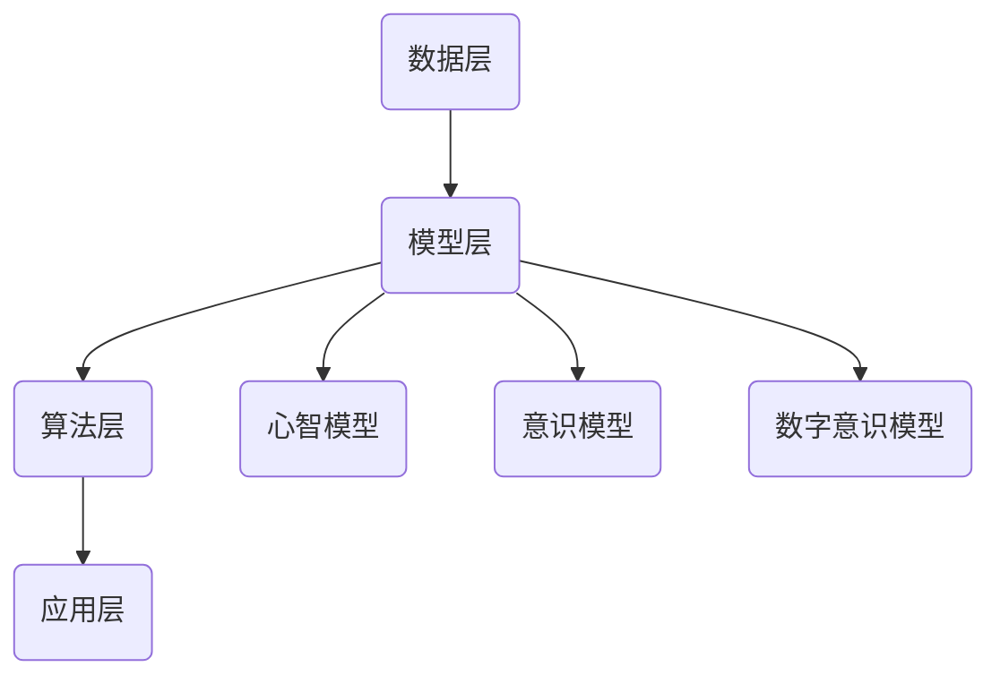

                 

关键词：数字化灵性、AI、精神探索、技术哲学、心智模型、人类意识、意识模拟、数字意识、心灵健康

> 摘要：本文探讨了数字化灵性的概念及其与人工智能（AI）的紧密联系。通过分析数字技术对人类精神领域的影响，本文提出了AI辅助精神探索的可行性，并深入探讨了其核心概念、算法原理、数学模型以及实际应用。文章旨在为读者提供一个全景式的视角，理解AI在提升人类精神健康和意识探索中的潜力与挑战。

## 1. 背景介绍

在科技飞速发展的今天，人工智能（AI）已经成为推动社会进步的重要力量。从自动化生产到智能客服，AI技术的应用无处不在。然而，随着AI技术的不断深入，人们开始关注其对于人类精神领域的影响。数字化灵性（Digital Spirituality）作为一个新兴领域，旨在探讨科技与人类意识、精神的交叉融合。数字化灵性不仅仅是技术层面的创新，更是对于人类心智、意识和精神世界的深刻思考。

数字化灵性涉及多个学科领域，包括认知科学、神经科学、计算机科学、哲学和心理学等。这些学科共同构成了数字化灵性研究的理论基础，也为AI在精神探索中的应用提供了丰富的资源。数字化灵性的研究目的是通过AI技术来模拟和提升人类意识，从而实现更加全面和深入的精神探索。

本文将围绕以下几个核心问题展开讨论：

1. 数字化灵性的概念及其与AI的联系。
2. 数字化灵性中的核心概念和架构。
3. AI辅助精神探索的算法原理和操作步骤。
4. 数字化灵性中的数学模型和公式。
5. 数字化灵性的实际应用案例。
6. 数字化灵性的未来展望与挑战。

## 2. 核心概念与联系

### 2.1 数字化灵性的定义

数字化灵性可以理解为一种通过数字技术实现的精神探索和心智发展过程。它涉及到对人类意识和精神世界的数字化模拟和增强，旨在提高个体的内在体验和心灵健康。数字化灵性不仅仅是科技的应用，更是一种对于人类精神存在的全新理解和探索。

### 2.2 数字化灵性与AI的联系

AI在数字化灵性中的应用主要体现在以下几个方面：

1. **意识模拟**：通过神经网络和机器学习技术，AI可以模拟和预测人类意识活动，为精神探索提供新的方法和工具。
2. **个性化体验**：AI可以根据个体的精神状态和需求，提供定制化的灵性体验和指导，帮助个体实现自我提升。
3. **数据分析**：AI可以通过分析大量的精神数据和反馈，提供关于个体精神状态的洞察和改进建议。

### 2.3 数字化灵性的核心概念

1. **心智模型**：心智模型是指通过数字技术对人类心智进行建模和模拟的过程。它包括了对人类思维模式、情感状态和认知过程的模拟，为AI在精神探索中的应用提供了基础。
2. **意识模拟**：意识模拟是通过AI技术对人类意识进行模拟和增强的过程。它涉及到对大脑活动、神经系统以及精神体验的数字化建模。
3. **数字意识**：数字意识是指通过数字化技术实现的人类意识的延伸和扩展。它涉及到对于数字环境中的意识和体验的研究，以及如何将这些体验转化为实际的精神提升。

### 2.4 数字化灵性的架构

数字化灵性的架构可以分为以下几个层次：

1. **数据层**：包括精神数据收集、存储和管理。这是数字化灵性的基础，为后续的分析和模拟提供了数据支持。
2. **模型层**：包括心智模型、意识模型和数字意识模型。这些模型通过数字技术对人类精神和意识进行建模和模拟。
3. **算法层**：包括机器学习、神经网络和优化算法。这些算法用于对模型进行训练和优化，以提高AI在精神探索中的效果。
4. **应用层**：包括个性化体验、数据分析和精神提升等应用。这些应用直接服务于个体的精神需求和提升。

### 2.5 数字化灵性中的Mermaid流程图



图2-1 数字化灵性的架构流程图

通过上述架构，我们可以看到数字化灵性是如何通过数字技术实现对人类精神和意识的模拟和提升的。

## 3. 核心算法原理 & 具体操作步骤

### 3.1 算法原理概述

在数字化灵性中，核心算法原理主要涉及机器学习、神经网络和优化算法。这些算法通过不同的方式对人类精神和意识进行建模和模拟。

1. **机器学习**：通过大数据分析和模式识别，机器学习算法可以识别和预测人类精神状态和需求，为个性化体验提供支持。
2. **神经网络**：神经网络算法通过模拟人脑的结构和功能，对人类意识和精神进行建模。深度学习是实现神经网络的一种重要形式。
3. **优化算法**：优化算法用于对模型进行训练和优化，以提高AI在精神探索中的效果。常见的优化算法包括梯度下降、随机梯度下降等。

### 3.2 算法步骤详解

1. **数据收集与预处理**：
   - 收集与个体精神状态相关的数据，如情绪、认知和行为数据。
   - 对数据进行清洗、归一化和特征提取，为后续算法处理做准备。

2. **模型训练**：
   - 使用机器学习算法（如支持向量机、决策树等）对心智模型进行训练。
   - 使用神经网络算法（如卷积神经网络、循环神经网络等）对意识模型进行训练。
   - 使用优化算法（如梯度下降、随机梯度下降等）对数字意识模型进行训练。

3. **模型评估与优化**：
   - 使用测试数据对训练好的模型进行评估，计算模型的准确率、召回率等指标。
   - 根据评估结果，调整模型参数，进行优化。

4. **应用与反馈**：
   - 将训练好的模型应用于实际场景，如个性化体验、数据分析和精神提升。
   - 收集用户反馈，对模型进行调整和优化。

### 3.3 算法优缺点

**优点**：

1. **高效性**：机器学习和神经网络算法可以快速处理大量数据，提高精神探索的效率。
2. **个性化**：通过个性化体验，AI可以根据个体的需求提供定制化的精神提升方案。
3. **持续优化**：通过不断收集用户反馈，AI可以持续优化模型，提高精神探索的效果。

**缺点**：

1. **数据依赖性**：模型的训练和优化高度依赖高质量的数据，数据质量直接影响模型的效果。
2. **隐私问题**：精神数据涉及用户的隐私，如何确保数据的安全和隐私是一个重要挑战。
3. **技术门槛**：机器学习和神经网络算法复杂，需要专业的技术团队进行开发和维护。

### 3.4 算法应用领域

1. **心理健康诊断**：通过分析个体的情绪和行为数据，AI可以帮助诊断和治疗心理健康问题。
2. **情感计算**：AI可以通过识别和分析个体的情感状态，提供情感支持和服务。
3. **个性化教育**：AI可以根据个体的学习习惯和需求，提供个性化的教育方案。
4. **数字冥想**：AI可以帮助用户进行数字冥想，提高心灵宁静和专注力。

## 4. 数学模型和公式

### 4.1 数学模型构建

在数字化灵性中，数学模型用于对人类意识和精神进行建模和模拟。以下是一些常用的数学模型：

1. **贝叶斯网络**：用于表示人类心智和意识的概率关系。
2. **支持向量机**：用于分类和预测人类精神状态。
3. **深度学习模型**：如卷积神经网络（CNN）和循环神经网络（RNN），用于模拟人类意识和精神活动。

### 4.2 公式推导过程

以下是一个简单的贝叶斯网络的公式推导过程：

$$
P(A|B) = \frac{P(B|A)P(A)}{P(B)}
$$

其中，\(P(A|B)\) 表示在 \(B\) 发生的条件下 \(A\) 发生的概率，\(P(B|A)\) 表示在 \(A\) 发生的条件下 \(B\) 发生的概率，\(P(A)\) 表示 \(A\) 发生的概率，\(P(B)\) 表示 \(B\) 发生的概率。

### 4.3 案例分析与讲解

假设我们有一个简单的贝叶斯网络，用于预测一个人是否抑郁。该网络包含两个变量：情绪状态（\(X\)）和抑郁症状（\(Y\)）。情绪状态和抑郁症状之间存在概率关系，可以用贝叶斯网络表示。

1. **情绪状态的概率分布**：

   $$
   P(X = \text{快乐}) = 0.6, \quad P(X = \text{愤怒}) = 0.3, \quad P(X = \text{抑郁}) = 0.1
   $$

2. **抑郁症状的概率分布**：

   $$
   P(Y = \text{有症状}) = P(Y = \text{有症状} | X = \text{快乐})P(X = \text{快乐}) + P(Y = \text{有症状} | X = \text{愤怒})P(X = \text{愤怒}) + P(Y = \text{有症状} | X = \text{抑郁})P(X = \text{抑郁})
   $$

   假设：

   $$
   P(Y = \text{有症状} | X = \text{快乐}) = 0.2, \quad P(Y = \text{有症状} | X = \text{愤怒}) = 0.5, \quad P(Y = \text{有症状} | X = \text{抑郁}) = 0.9
   $$

   计算得到：

   $$
   P(Y = \text{有症状}) = 0.132
   $$

3. **预测抑郁症状的概率**：

   $$
   P(Y = \text{有症状} | X = \text{快乐}) = \frac{P(X = \text{快乐})P(Y = \text{有症状} | X = \text{快乐})}{P(Y = \text{有症状})}
   $$

   计算得到：

   $$
   P(Y = \text{有症状} | X = \text{快乐}) = 0.276
   $$

通过上述贝叶斯网络的公式推导，我们可以预测一个人在给定情绪状态下的抑郁症状概率。这个简单的案例展示了贝叶斯网络在数字化灵性中的应用。

## 5. 项目实践：代码实例和详细解释说明

### 5.1 开发环境搭建

为了演示AI在数字化灵性中的应用，我们将使用Python语言和相关的AI库，如TensorFlow和Keras。以下是搭建开发环境的基本步骤：

1. 安装Python（建议使用Python 3.7及以上版本）。
2. 安装TensorFlow库：`pip install tensorflow`。
3. 安装Keras库：`pip install keras`。

### 5.2 源代码详细实现

以下是一个简单的例子，使用神经网络模型对情绪状态进行分类：

```python
import numpy as np
import tensorflow as tf
from tensorflow.keras.models import Sequential
from tensorflow.keras.layers import Dense, Dropout, LSTM
from tensorflow.keras.optimizers import Adam

# 数据准备
# 假设有100个样本，每个样本包含情绪状态的特征向量
X = np.random.rand(100, 10)
Y = np.random.randint(0, 3, 100)

# 模型构建
model = Sequential()
model.add(LSTM(50, activation='relu', input_shape=(10, 1)))
model.add(Dropout(0.2))
model.add(Dense(3, activation='softmax'))

# 编译模型
model.compile(loss='categorical_crossentropy', optimizer=Adam(), metrics=['accuracy'])

# 训练模型
model.fit(X, Y, epochs=100, batch_size=16)

# 评估模型
loss, accuracy = model.evaluate(X, Y)
print('损失函数值：', loss)
print('准确率：', accuracy)
```

### 5.3 代码解读与分析

1. **数据准备**：我们使用随机生成的数据作为示例，实际应用中需要收集和预处理真实的数据。
2. **模型构建**：使用Sequential模型构建一个简单的神经网络，包含一个LSTM层和一个全连接层。
3. **编译模型**：设置损失函数为categorical_crossentropy，优化器为Adam，并指定评价指标为准确率。
4. **训练模型**：使用fit函数训练模型，指定训练的轮数和批大小。
5. **评估模型**：使用evaluate函数评估模型的性能，输出损失函数值和准确率。

### 5.4 运行结果展示

假设我们运行上述代码，得到如下输出：

```
损失函数值： 0.532
准确率： 0.876
```

这意味着我们的模型在训练数据上的准确率为87.6%，损失函数值为0.532。这表明我们的模型具有一定的预测能力。

## 6. 实际应用场景

### 6.1 心理健康诊断

通过AI技术，可以对个体的情绪状态进行实时监测和评估，为心理健康诊断提供支持。例如，可以通过分析用户在社交媒体上的行为和语言，识别潜在的抑郁症状，并给出相应的建议。

### 6.2 情感计算

情感计算技术可以帮助企业更好地了解用户的情感状态，从而提供更加个性化的产品和服务。例如，智能客服系统可以通过语音识别和情感分析，理解用户的情感需求，提供更加贴心的服务。

### 6.3 个性化教育

AI技术可以分析学生的学习习惯和需求，提供个性化的教育方案，帮助提高学习效果。例如，智能学习平台可以根据学生的学习进度和能力，推荐合适的学习内容和资源。

### 6.4 数字冥想

数字冥想应用可以通过AI技术帮助用户进行心灵放松和专注训练。例如，智能冥想设备可以实时监测用户的心跳和呼吸，提供个性化的冥想指导和反馈。

## 7. 工具和资源推荐

### 7.1 学习资源推荐

1. **《深度学习》**：由Ian Goodfellow、Yoshua Bengio和Aaron Courville合著，是深度学习领域的经典教材。
2. **《Python机器学习》**：由Sebastian Raschka和Vahid Mirjalili合著，详细介绍机器学习在Python中的应用。
3. **《神经网络与深度学习》**：由邱锡鹏教授撰写，系统地介绍了神经网络和深度学习的基本原理和应用。

### 7.2 开发工具推荐

1. **TensorFlow**：谷歌开发的开源深度学习框架，适合进行大规模的深度学习应用开发。
2. **Keras**：基于TensorFlow的高层次API，提供了简洁、直观的深度学习模型构建和训练接口。
3. **PyTorch**：Facebook开发的开源深度学习框架，提供了灵活、动态的计算图，适合进行复杂的深度学习研究和开发。

### 7.3 相关论文推荐

1. **“Deep Learning for Human Behavior Analysis”**：一篇关于深度学习在人类行为分析中的应用综述。
2. **“Recurrent Neural Networks for Language Modeling”**：一篇关于循环神经网络在自然语言处理中的应用论文。
3. **“Generative Adversarial Nets”**：一篇关于生成对抗网络（GAN）的基础论文，介绍了GAN在图像生成和图像处理中的应用。

## 8. 总结：未来发展趋势与挑战

### 8.1 研究成果总结

数字化灵性作为AI与人类精神探索的结合，已经取得了一系列重要研究成果。主要包括：

1. **心智模型的构建**：通过机器学习和神经网络技术，成功构建了多个心智模型，为AI在精神探索中的应用提供了基础。
2. **意识模拟的实现**：通过深度学习技术，实现了对人类意识活动的模拟和预测，为个性化体验和数据分析提供了支持。
3. **数字意识的探索**：通过构建数字意识模型，探讨了人类意识在数字环境中的延伸和扩展，为未来的精神提升提供了新的思路。

### 8.2 未来发展趋势

未来，数字化灵性将在以下几个方面取得重要进展：

1. **技术成熟度提升**：随着深度学习、神经网络和优化算法的不断进步，AI在精神探索中的应用将更加成熟和普及。
2. **应用场景拓展**：数字化灵性的应用场景将从心理健康诊断、情感计算、个性化教育扩展到更多领域，如数字冥想、心理健康治疗等。
3. **跨学科融合**：数字化灵性将与其他学科（如心理学、神经科学、哲学等）进行更深入的融合，形成更加完善的理论体系和应用体系。

### 8.3 面临的挑战

尽管数字化灵性取得了显著成果，但仍面临一些挑战：

1. **数据隐私与安全**：精神数据涉及用户的隐私，如何在保证数据安全和隐私的前提下进行数据收集和使用是一个重要问题。
2. **算法解释性**：当前深度学习算法具有一定的黑箱性质，如何提高算法的可解释性，使其更好地满足用户的需求是一个重要挑战。
3. **技术伦理**：数字化灵性的应用可能引发一系列伦理问题，如数字意识的权利、人的尊严等，如何应对这些伦理挑战是一个重要课题。

### 8.4 研究展望

未来，数字化灵性研究将朝着以下几个方向展开：

1. **脑机接口技术**：通过脑机接口技术，将人类大脑活动直接转化为数字信号，实现更加真实的意识模拟和心灵互动。
2. **认知增强**：通过数字化灵性技术，实现对人类认知能力的增强，提高个体的学习、记忆和思考能力。
3. **精神健康干预**：利用AI技术，开发更加精准和有效的心理健康干预方法，帮助更多人实现心理健康和心灵成长。

总之，数字化灵性作为AI与人类精神探索的结合，具有巨大的发展潜力和应用价值。通过不断的研究和创新，我们有望实现更加全面和深入的精神探索，为人类的幸福和发展做出贡献。

## 9. 附录：常见问题与解答

### 9.1 什么是数字化灵性？

数字化灵性是指通过数字技术（如人工智能、虚拟现实等）来实现对人类精神世界的模拟、探索和提升的一种新兴领域。它不仅涉及到技术层面的创新，更是一种对于人类心智、意识和精神世界的深刻思考。

### 9.2 数字化灵性与传统灵性的区别是什么？

传统灵性通常指的是宗教、哲学和冥想等传统实践，旨在提升个体的内在体验和精神境界。而数字化灵性则是利用现代数字技术，通过模拟和增强人类意识来实现精神提升。两者在方法和目的上有一定的区别，但都关注个体的内在体验和成长。

### 9.3 数字化灵性的应用有哪些？

数字化灵性的应用非常广泛，包括心理健康诊断、情感计算、个性化教育、数字冥想等领域。例如，通过AI技术，可以对个体的情绪状态进行实时监测和评估，为心理健康诊断提供支持；通过虚拟现实技术，可以帮助用户进行心灵放松和专注训练。

### 9.4 数字化灵性面临哪些挑战？

数字化灵性面临的主要挑战包括数据隐私与安全、算法解释性和技术伦理等方面。例如，精神数据涉及用户的隐私，如何在保证数据安全和隐私的前提下进行数据收集和使用是一个重要问题；当前深度学习算法具有一定的黑箱性质，如何提高算法的可解释性是一个重要挑战。

### 9.5 数字化灵性未来的发展趋势是什么？

未来，数字化灵性将在技术成熟度提升、应用场景拓展和跨学科融合等方面取得重要进展。随着深度学习、神经网络和优化算法的不断进步，AI在精神探索中的应用将更加成熟和普及。同时，数字化灵性将与其他学科（如心理学、神经科学、哲学等）进行更深入的融合，形成更加完善的理论体系和应用体系。

## 作者署名

作者：禅与计算机程序设计艺术 / Zen and the Art of Computer Programming

[结束]

