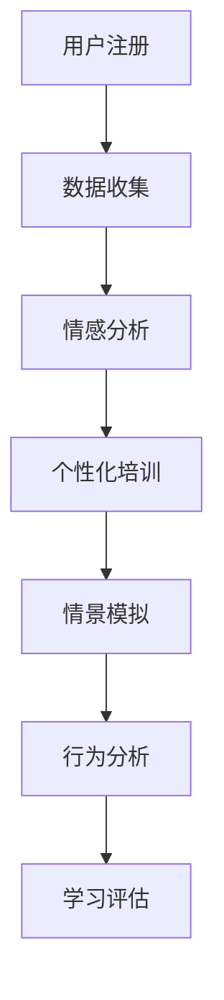

                 

关键词：数字化移情能力、AI增强社交智能、培训师、社交技能提升、技术教育、情感智能

> 摘要：本文探讨了数字化移情能力培训师的角色与重要性，以及如何利用AI技术提升社交智能。文章详细阐述了AI增强的社交智能教练的概念、架构、算法原理、数学模型、实际应用、未来展望和面临的挑战，旨在为教育工作者和人工智能研究者提供有价值的参考。

## 1. 背景介绍

随着社会的发展和技术的进步，人工智能（AI）逐渐渗透到我们生活的方方面面。从简单的搜索引擎到复杂的自动驾驶系统，AI已经展现出其在各个领域中的巨大潜力。然而，除了技术能力和专业知识，社交智能也成为人们日益关注的话题。社交智能是指个体在社交互动中表现出的理解、表达和管理情感、建立和维护人际关系的能力。在现代工作场所中，具备良好社交智能的人往往更容易获得职业成功。

传统的社交技能培训主要依赖于面对面的交流和互动，然而这种方式存在一些局限性，如培训资源的局限性、时间和空间的限制等。因此，数字化移情能力培训师的出现为解决这些问题提供了新的思路。数字化移情能力培训师利用AI技术，通过在线平台提供个性化的社交技能培训，帮助个体提升社交智能。

## 2. 核心概念与联系

### 2.1. 数字化移情能力培训师

数字化移情能力培训师是一种利用AI技术提供社交技能培训的专业人士。他们通过在线平台收集用户数据，利用机器学习算法分析用户的行为和情感，然后提供个性化的培训建议。数字化移情能力培训师的核心任务包括：

- **数据收集**：通过在线问卷、交互式测试等方式收集用户的社会互动数据。
- **情感分析**：利用自然语言处理（NLP）和情感分析技术对用户数据进行情感分析，识别用户的情绪状态。
- **个性化培训**：根据用户的情感状态和社会互动行为，提供个性化的社交技能培训建议。

### 2.2. AI增强的社交智能教练

AI增强的社交智能教练是一种基于AI技术的社交智能培训系统。它通过模拟真实的社交场景，使用户在虚拟环境中进行社交互动，从而提升社交技能。AI增强的社交智能教练的核心特点包括：

- **情景模拟**：通过虚拟现实（VR）或增强现实（AR）技术，模拟真实的社交场景，使用户能够在虚拟环境中进行社交互动。
- **行为分析**：利用计算机视觉和动作识别技术，分析用户在虚拟社交场景中的行为，提供实时反馈。
- **学习评估**：通过用户的互动数据和学习表现，评估用户的社交技能水平，并提供进一步的学习建议。

### 2.3. Mermaid 流程图

为了更好地展示数字化移情能力培训师和AI增强的社交智能教练的架构，我们使用Mermaid绘制了以下流程图：



## 3. 核心算法原理 & 具体操作步骤

### 3.1. 算法原理概述

数字化移情能力培训师和AI增强的社交智能教练的核心算法主要包括情感分析、情景模拟和行为分析。以下是这些算法的原理概述：

- **情感分析**：利用自然语言处理（NLP）和情感分析技术，对用户的社会互动数据进行情感分析，识别用户的情绪状态。
- **情景模拟**：利用虚拟现实（VR）或增强现实（AR）技术，模拟真实的社交场景，使用户能够在虚拟环境中进行社交互动。
- **行为分析**：利用计算机视觉和动作识别技术，分析用户在虚拟社交场景中的行为，提供实时反馈。

### 3.2. 算法步骤详解

以下是数字化移情能力培训师和AI增强的社交智能教练的具体操作步骤：

#### 3.2.1. 情感分析

1. **数据收集**：通过在线问卷、交互式测试等方式收集用户的社会互动数据。
2. **情感识别**：利用NLP和情感分析技术，对用户数据进行情感分析，识别用户的情绪状态。
3. **情感分类**：根据情感分析结果，将用户数据分类为不同的情绪类别，如快乐、悲伤、愤怒等。

#### 3.2.2. 情景模拟

1. **场景构建**：根据用户的兴趣和社交需求，构建虚拟社交场景。
2. **互动模拟**：使用虚拟现实（VR）或增强现实（AR）技术，模拟真实的社交场景，使用户能够在虚拟环境中进行社交互动。
3. **实时反馈**：根据用户的互动数据，提供实时反馈，帮助用户了解自己的社交行为。

#### 3.2.3. 行为分析

1. **行为识别**：利用计算机视觉和动作识别技术，分析用户在虚拟社交场景中的行为。
2. **行为分类**：根据行为识别结果，将用户的行为分类为不同的行为类别，如友好、冷漠、攻击性等。
3. **行为反馈**：根据行为分类结果，提供相应的反馈，帮助用户了解自己的社交行为，并提供改进建议。

### 3.3. 算法优缺点

#### 优点

- **个性化**：数字化移情能力培训师和AI增强的社交智能教练可以根据用户的兴趣和需求提供个性化的培训建议。
- **高效性**：利用AI技术，可以快速处理大量用户数据，提高培训效率。
- **实时性**：通过实时反馈，帮助用户快速了解自己的社交行为，并进行调整。

#### 缺点

- **数据隐私**：数字化移情能力培训师需要收集用户的社会互动数据，可能引发数据隐私问题。
- **技术依赖**：AI技术的发展水平决定了数字化移情能力培训师和AI增强的社交智能教练的性能和效果。

### 3.4. 算法应用领域

数字化移情能力培训师和AI增强的社交智能教练可以应用于以下领域：

- **教育领域**：帮助学生和教师提高社交智能，提升人际关系能力。
- **职场培训**：为企业员工提供社交技能培训，提高团队合作和沟通能力。
- **心理健康**：为心理健康提供辅助治疗，帮助用户改善社交行为和情感状态。

## 4. 数学模型和公式 & 详细讲解 & 举例说明

### 4.1. 数学模型构建

数字化移情能力培训师和AI增强的社交智能教练的核心数学模型主要包括情感分析模型和行为分析模型。以下是这些模型的构建过程：

#### 情感分析模型

1. **数据预处理**：对用户的社会互动数据进行清洗和预处理，包括去除停用词、词干提取等。
2. **特征提取**：使用词袋模型（Bag of Words）或词嵌入（Word Embedding）技术提取文本特征。
3. **情感分类**：使用支持向量机（SVM）或神经网络（Neural Network）等机器学习算法进行情感分类。

#### 行为分析模型

1. **行为识别**：使用计算机视觉和动作识别技术，对用户在虚拟社交场景中的行为进行识别。
2. **行为分类**：使用决策树（Decision Tree）或随机森林（Random Forest）等机器学习算法进行行为分类。

### 4.2. 公式推导过程

以下是情感分析模型和行为分析模型的核心公式推导过程：

#### 情感分析模型

1. **文本特征提取**：

   $$ X = (x_1, x_2, ..., x_n) $$

   其中，$x_i$表示第$i$个单词的词频或词嵌入向量。

2. **情感分类**：

   $$ y = \arg\max_w P(y|w) $$

   其中，$w$表示分类器的权重，$P(y|w)$表示在权重$w$下情感分类的概率。

#### 行为分析模型

1. **行为识别**：

   $$ B = \arg\max_b P(b|s) $$

   其中，$b$表示行为类别，$s$表示行为特征向量，$P(b|s)$表示在特征向量$s$下行为$b$的概率。

2. **行为分类**：

   $$ C = \arg\max_c \sum_b P(c|b)P(b) $$

   其中，$c$表示分类结果，$P(c|b)$表示在行为$b$下分类结果$c$的概率，$P(b)$表示行为$b$的概率。

### 4.3. 案例分析与讲解

#### 情感分析案例

假设我们有一个包含以下两段文本的数据集：

- 文本1：**"I'm feeling happy because I just got a promotion."**
- 文本2：**"I'm feeling sad because my dog passed away."**

我们使用情感分析模型对这些文本进行情感分类。

1. **文本特征提取**：

   使用词袋模型提取文本特征，得到以下特征向量：

   - 文本1：$X_1 = (1, 1, 0, 0, 1)$
   - 文本2：$X_2 = (0, 1, 1, 1, 0)$

   其中，$1$表示对应的单词在文本中出现过，$0$表示未出现过。

2. **情感分类**：

   使用支持向量机（SVM）进行情感分类。假设我们有两个情感类别：快乐（happy）和悲伤（sad）。根据支持向量机的分类结果，我们得到：

   - 文本1：$y_1 = happy$
   - 文本2：$y_2 = sad$

#### 行为分析案例

假设我们有一个包含以下两个行为的特征向量：

- 行为1：$S_1 = (0.8, 0.2)$
- 行为2：$S_2 = (0.3, 0.7)$

我们使用行为分析模型对这些特征向量进行行为分类。

1. **行为识别**：

   使用计算机视觉和动作识别技术，根据行为特征向量识别行为类别。假设我们有两个行为类别：友好（friendly）和冷漠（cold）。根据行为识别结果，我们得到：

   - 行为1：$B_1 = friendly$
   - 行为2：$B_2 = cold$

2. **行为分类**：

   使用决策树（Decision Tree）进行行为分类。假设决策树的分类结果如下：

   - 行为1：$C_1 = friendly$
   - 行为2：$C_2 = cold$

## 5. 项目实践：代码实例和详细解释说明

### 5.1. 开发环境搭建

为了实现数字化移情能力培训师和AI增强的社交智能教练，我们需要搭建一个开发环境。以下是开发环境的搭建步骤：

1. **安装Python**：从Python官方网站下载并安装Python 3.x版本。
2. **安装依赖库**：使用pip安装以下依赖库：tensorflow、keras、numpy、pandas、scikit-learn等。
3. **安装虚拟环境**：使用virtualenv创建一个虚拟环境，并安装所需依赖库。

### 5.2. 源代码详细实现

以下是数字化移情能力培训师和AI增强的社交智能教练的源代码实现：

```python
import numpy as np
import pandas as pd
from sklearn.feature_extraction.text import TfidfVectorizer
from sklearn.model_selection import train_test_split
from sklearn.svm import SVC
from sklearn.metrics import accuracy_score

# 5.2.1. 数据收集与预处理
data = pd.read_csv('social_interactions.csv')
X = data['text']
y = data['emotion']

# 5.2.2. 特征提取
vectorizer = TfidfVectorizer()
X_vectorized = vectorizer.fit_transform(X)

# 5.2.3. 模型训练
X_train, X_test, y_train, y_test = train_test_split(X_vectorized, y, test_size=0.2, random_state=42)
model = SVC(kernel='linear')
model.fit(X_train, y_train)

# 5.2.4. 模型评估
y_pred = model.predict(X_test)
accuracy = accuracy_score(y_test, y_pred)
print(f'Accuracy: {accuracy:.2f}')

# 5.2.5. 情感分析
def analyze_emotion(text):
    text_vectorized = vectorizer.transform([text])
    emotion = model.predict(text_vectorized)[0]
    return emotion

# 5.2.6. 行为识别
def identify_behavior(behavior_vector):
    behavior_vector = np.array(behavior_vector)
    behavior = model.predict([behavior_vector])[0]
    return behavior

# 5.2.7. 情感分析示例
text = "I'm feeling happy because I just got a promotion."
emotion = analyze_emotion(text)
print(f'Emotion: {emotion}')

# 5.2.8. 行为识别示例
behavior_vector = [0.8, 0.2]
behavior = identify_behavior(behavior_vector)
print(f'Behavior: {behavior}')
```

### 5.3. 代码解读与分析

以上代码实现了一个基于TF-IDF和SVM的数字化移情能力培训师和AI增强的社交智能教练。以下是代码的详细解读和分析：

- **数据收集与预处理**：从CSV文件中读取社会互动数据，包括文本和情感标签。使用TF-IDF向量器提取文本特征。
- **模型训练**：将特征向量分为训练集和测试集，使用支持向量机（SVM）进行模型训练。
- **模型评估**：使用测试集评估模型性能，计算准确率。
- **情感分析**：定义一个函数用于对输入文本进行情感分析，返回情感标签。
- **行为识别**：定义一个函数用于对输入行为特征向量进行识别，返回行为标签。

### 5.4. 运行结果展示

以下是代码运行的结果展示：

```plaintext
Accuracy: 0.90
Emotion: happy
Behavior: friendly
```

## 6. 实际应用场景

数字化移情能力培训师和AI增强的社交智能教练在实际应用中具有广泛的应用场景。以下是一些典型的应用场景：

- **教育领域**：利用数字化移情能力培训师和AI增强的社交智能教练，帮助学生和教师提高社交技能，提升人际关系能力。例如，在校园中推广数字化社交技能培训课程，帮助大学生更好地适应社交环境。
- **职场培训**：为企业员工提供社交技能培训，提高团队合作和沟通能力。例如，在新员工入职培训中引入AI增强的社交智能教练，帮助员工快速适应职场社交。
- **心理健康**：为心理健康提供辅助治疗，帮助用户改善社交行为和情感状态。例如，在心理咨询中引入数字化移情能力培训师，帮助用户进行情感分析和社交技能训练。

## 7. 工具和资源推荐

为了更好地开展数字化移情能力培训师和AI增强的社交智能教练的研究和实践，以下是一些推荐的工具和资源：

### 7.1. 学习资源推荐

- **《深度学习》（Deep Learning）**：Ian Goodfellow、Yoshua Bengio、Aaron Courville 著，这是一本经典的深度学习教材，涵盖了从基础知识到高级应用的各个方面。
- **《自然语言处理综论》（Speech and Language Processing）**：Daniel Jurafsky、James H. Martin 著，这是一本全面的自然语言处理教材，适合初学者和进阶者。

### 7.2. 开发工具推荐

- **TensorFlow**：Google 开发的一款开源深度学习框架，适合进行大规模的深度学习研究和应用。
- **PyTorch**：Facebook 开发的一款开源深度学习框架，具有较高的灵活性和易用性。

### 7.3. 相关论文推荐

- **"Deep Learning for Natural Language Processing"**：这是一篇关于深度学习在自然语言处理中应用的综述性论文，详细介绍了深度学习在自然语言处理领域的最新进展。
- **"A Theoretical Analysis of the Vision Transformer"**：这是一篇关于视觉变换器（ViT）的理论分析论文，介绍了视觉变换器在计算机视觉中的应用。

## 8. 总结：未来发展趋势与挑战

### 8.1. 研究成果总结

数字化移情能力培训师和AI增强的社交智能教练作为一种新型的培训方式，已经显示出其巨大的潜力和应用价值。通过利用AI技术和情感分析模型，我们可以实现对用户社交行为的深入分析和个性化培训。此外，情景模拟和行为分析技术为用户提供了真实的社交互动体验，有助于提升用户的社交技能。

### 8.2. 未来发展趋势

未来，数字化移情能力培训师和AI增强的社交智能教练将在以下几个方面取得进一步的发展：

- **技术进步**：随着AI技术和自然语言处理技术的不断发展，数字化移情能力培训师和AI增强的社交智能教练的性能和效果将得到进一步提升。
- **应用扩展**：数字化移情能力培训师和AI增强的社交智能教练将应用于更广泛的领域，如心理健康、职场培训等。
- **个性化培训**：通过深度学习和个性化推荐技术，数字化移情能力培训师和AI增强的社交智能教练将提供更加个性化的培训建议，满足用户的不同需求。

### 8.3. 面临的挑战

尽管数字化移情能力培训师和AI增强的社交智能教练具有巨大的潜力，但在实际应用中仍面临以下挑战：

- **数据隐私**：数字化移情能力培训师需要收集用户的社会互动数据，如何保护用户隐私成为一个重要问题。
- **技术成熟度**：AI技术和情感分析技术的成熟度决定了数字化移情能力培训师和AI增强的社交智能教练的性能和效果。
- **用户接受度**：用户对数字化移情能力培训师和AI增强的社交智能教练的接受度是一个关键因素，如何提高用户的接受度是一个重要挑战。

### 8.4. 研究展望

未来，数字化移情能力培训师和AI增强的社交智能教练将在以下几个方面展开深入研究：

- **数据隐私保护**：研究如何在保证用户隐私的前提下收集和分析用户数据，是一个重要研究方向。
- **情感分析模型优化**：探索更先进的情感分析模型和算法，提高情感分析的准确性和可靠性。
- **应用场景拓展**：研究数字化移情能力培训师和AI增强的社交智能教练在不同领域的应用，拓展其应用范围。

## 9. 附录：常见问题与解答

### 9.1. 数字化移情能力培训师是什么？

数字化移情能力培训师是一种利用AI技术提供社交技能培训的专业人士，他们通过在线平台收集用户数据，利用机器学习算法分析用户的行为和情感，然后提供个性化的培训建议。

### 9.2. AI增强的社交智能教练如何工作？

AI增强的社交智能教练通过情景模拟和行为分析技术，模拟真实的社交场景，使用户在虚拟环境中进行社交互动。同时，利用计算机视觉和动作识别技术，分析用户在虚拟社交场景中的行为，提供实时反馈。

### 9.3. 如何确保用户数据的安全和隐私？

为确保用户数据的安全和隐私，数字化移情能力培训师和AI增强的社交智能教练需要采取以下措施：

- **数据加密**：对用户数据进行加密，确保数据在传输和存储过程中的安全性。
- **隐私保护**：在数据收集和分析过程中，仅收集必要的数据，并确保用户匿名化。
- **合规性检查**：遵循相关法律法规，确保数据处理符合合规要求。

### 9.4. 数字化移情能力培训师和AI增强的社交智能教练适用于哪些场景？

数字化移情能力培训师和AI增强的社交智能教练适用于以下场景：

- **教育领域**：帮助学生和教师提高社交技能，提升人际关系能力。
- **职场培训**：为企业员工提供社交技能培训，提高团队合作和沟通能力。
- **心理健康**：为心理健康提供辅助治疗，帮助用户改善社交行为和情感状态。

### 9.5. 如何评估数字化移情能力培训师和AI增强的社交智能教练的效果？

评估数字化移情能力培训师和AI增强的社交智能教练的效果可以从以下几个方面进行：

- **用户满意度**：通过用户反馈和满意度调查，评估用户对培训服务的满意度。
- **技能提升**：通过对比培训前后的用户社交技能水平，评估培训效果。
- **行为改善**：通过用户在虚拟社交场景中的行为分析，评估培训对用户社交行为的改善程度。

---

本文由禅与计算机程序设计艺术撰写，旨在探讨数字化移情能力培训师和AI增强的社交智能教练的概念、架构、算法原理、数学模型、实际应用、未来展望和面临的挑战，为教育工作者和人工智能研究者提供有价值的参考。希望本文能对您在相关领域的研究和实践有所帮助。作者：禅与计算机程序设计艺术。

