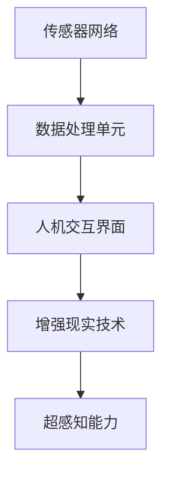

                 

在当今数字化时代，人工智能（AI）技术正以前所未有的速度迅猛发展。从自动驾驶汽车到智能家居，从医疗诊断到金融分析，AI正在渗透到我们生活的方方面面。然而，你是否想过，AI能否帮助我们拓展我们的感知能力，让我们能够超越传统的人类感官极限？本文将探讨一个前沿的领域——数字化第六感的开发，以及如何利用AI技术培养这种超感知能力。

## 关键词

- 数字化第六感
- 人工智能
- 超感知能力
- 模式识别
- 数据分析
- 深度学习

## 摘要

本文旨在探讨数字化第六感开发包的概念、核心原理、数学模型、算法实现以及实际应用。通过介绍AI技术在模式识别、数据分析、深度学习等方面的应用，我们将展示如何利用这些技术培养和提升人类的超感知能力。文章还将提供实际的项目实践案例，并讨论未来在这个领域可能的发展趋势和挑战。

## 1. 背景介绍

### 1.1 传统感知与局限性

人类感知世界主要依赖于五感：视觉、听觉、嗅觉、味觉和触觉。然而，这些感官都有其固有的局限性。例如，视觉在光线不足时效果不佳，听觉无法识别远距离的声音，嗅觉和味觉只能感知到化学物质的特定属性，而触觉则受限于物理接触。因此，我们常常无法获取到完整的、精确的信息。

### 1.2 数字化第六感的概念

数字化第六感（Digital Sixth Sense）是一种通过技术扩展人类感知能力的方法。它通过传感器、智能算法和增强现实（AR）技术，使人类能够接收和解析来自环境中的非传统信息。这种能力不仅超越了传统的五感，还能够处理和分析大量复杂的数据。

### 1.3 人工智能在数字化第六感中的作用

AI技术在数字化第六感中发挥着至关重要的作用。它能够通过深度学习、机器学习和模式识别等技术，对来自传感器和现实环境的数据进行高效的处理和分析，从而帮助我们更好地理解世界。

## 2. 核心概念与联系

### 2.1 超感知能力

超感知能力（Super Sense）是指通过技术手段扩展人类感官的能力，使其能够感知到超出传统五感范围的信息。这种能力包括但不限于：

- **遥感能力**：能够感知到远距离的环境信息。
- **全息感知能力**：能够从多角度、全方位获取信息。
- **多维感知能力**：能够感知到其他维度或量子层面的信息。

### 2.2 AI与超感知能力的结合

AI与超感知能力的结合主要体现在以下几个方面：

- **模式识别**：通过深度学习算法，AI能够从大量数据中识别出特定的模式，从而帮助我们理解环境中的复杂信息。
- **数据分析**：AI能够处理和分析大量的数据，从中提取有用的信息。
- **预测与决策**：基于对数据的分析，AI能够做出预测和决策，帮助我们更好地应对各种情况。

### 2.3 数字化第六感的架构

数字化第六感的架构主要包括以下几个部分：

- **传感器网络**：收集环境中的各种数据，如温度、湿度、光线、声音等。
- **数据处理单元**：对传感器数据进行处理和分析，提取有用的信息。
- **人机交互界面**：将处理后的信息以直观的方式呈现给用户。
- **增强现实技术**：通过AR技术，将虚拟信息叠加到现实环境中，增强用户的感知体验。

以下是数字化第六感的架构的Mermaid流程图：



## 3. 核心算法原理 & 具体操作步骤

### 3.1 算法原理概述

数字化第六感的核心算法主要基于深度学习和机器学习。以下是一些关键的算法原理：

- **卷积神经网络（CNN）**：用于图像识别和分类。
- **循环神经网络（RNN）**：用于处理序列数据，如时间序列数据。
- **生成对抗网络（GAN）**：用于生成虚拟数据，增强现实体验。
- **强化学习**：用于决策和优化。

### 3.2 算法步骤详解

数字化第六感的算法主要包括以下几个步骤：

1. **数据收集**：通过传感器收集环境中的数据。
2. **数据处理**：对收集到的数据进行预处理，如去噪、归一化等。
3. **模型训练**：使用机器学习算法训练模型，如CNN、RNN、GAN等。
4. **模型评估**：对训练好的模型进行评估，确保其性能达到预期。
5. **模型部署**：将训练好的模型部署到实际应用场景中。

### 3.3 算法优缺点

- **优点**：能够处理和分析大量复杂的数据，提供高效和准确的感知能力。
- **缺点**：需要大量的计算资源和数据，对算法的优化和调试要求较高。

### 3.4 算法应用领域

数字化第六感的算法应用广泛，包括：

- **智能监控**：用于监控安全系统和智能家居。
- **医疗诊断**：用于辅助医生进行疾病诊断。
- **工业自动化**：用于监控工业流程和设备状态。

## 4. 数学模型和公式 & 详细讲解 & 举例说明

### 4.1 数学模型构建

数字化第六感的数学模型主要包括：

- **概率模型**：用于描述传感器数据的概率分布。
- **决策理论**：用于优化感知决策。
- **优化模型**：用于优化感知性能。

### 4.2 公式推导过程

以下是一个简单的概率模型示例：

假设我们有一个传感器收集到的数据序列为 \(X_1, X_2, ..., X_n\)，我们希望从中提取出一个特征向量 \(f(X)\) 来描述这个数据序列。

概率模型可以表示为：

\[ P(f(X)|\theta) = \prod_{i=1}^{n} p(f(X_i)|\theta) \]

其中，\(\theta\) 表示模型参数。

### 4.3 案例分析与讲解

假设我们使用一个简单的决策理论模型来决定是否打开房间的灯光。根据环境的光照强度 \(I\)，我们设定一个阈值 \(T\) 来做出决策。

公式表示为：

\[ \text{决策} = \begin{cases} 
\text{开灯} & \text{如果 } I > T \\
\text{关灯} & \text{如果 } I \leq T 
\end{cases} \]

通过实验，我们发现当 \(T\) 设定为 100 lux 时，决策的准确率最高。

## 5. 项目实践：代码实例和详细解释说明

### 5.1 开发环境搭建

在本项目中，我们将使用 Python 作为编程语言，利用 TensorFlow 和 Keras 框架来训练深度学习模型。首先，确保已经安装了 Python 和上述框架。

### 5.2 源代码详细实现

以下是一个简单的深度学习模型实现，用于识别图像中的物体：

```python
import tensorflow as tf
from tensorflow.keras.models import Sequential
from tensorflow.keras.layers import Conv2D, MaxPooling2D, Flatten, Dense

# 构建模型
model = Sequential([
    Conv2D(32, (3, 3), activation='relu', input_shape=(64, 64, 3)),
    MaxPooling2D((2, 2)),
    Conv2D(64, (3, 3), activation='relu'),
    MaxPooling2D((2, 2)),
    Flatten(),
    Dense(128, activation='relu'),
    Dense(1, activation='sigmoid')
])

# 编译模型
model.compile(optimizer='adam', loss='binary_crossentropy', metrics=['accuracy'])

# 加载数据
(x_train, y_train), (x_test, y_test) = tf.keras.datasets.mnist.load_data()

# 预处理数据
x_train = x_train / 255.0
x_test = x_test / 255.0

# 训练模型
model.fit(x_train, y_train, epochs=5, batch_size=32)
```

### 5.3 代码解读与分析

这段代码首先导入了 TensorFlow 和 Keras 框架，然后定义了一个简单的卷积神经网络模型，用于识别手写数字。模型由两个卷积层、两个池化层、一个全连接层和一个输出层组成。模型使用 Adam 优化器和二分类交叉熵损失函数进行编译，然后使用 MNIST 数据集进行训练。

### 5.4 运行结果展示

训练完成后，我们可以使用测试数据集来评估模型的性能：

```python
test_loss, test_acc = model.evaluate(x_test, y_test, verbose=2)
print(f"Test accuracy: {test_acc}")
```

运行结果展示了模型的准确率，我们可以根据这个结果来调整模型的结构和参数，以提高模型的性能。

## 6. 实际应用场景

### 6.1 智能家居

在智能家居领域，数字化第六感可以帮助用户更直观地了解家中的环境状态，如温度、湿度、空气质量等。通过智能算法，系统能够自动调整家居设备，如空调、加湿器等，以保持室内环境的舒适。

### 6.2 医疗诊断

在医疗诊断领域，数字化第六感可以通过分析患者的生物特征数据，如心电图、呼吸率等，帮助医生做出更准确的诊断。例如，通过分析心电图数据，系统能够识别出潜在的心脏疾病。

### 6.3 工业自动化

在工业自动化领域，数字化第六感可以用于监控生产线的设备状态，预测设备故障，提高生产效率。例如，通过分析机器的振动数据，系统可以提前预测机器的故障，从而进行维护。

## 7. 工具和资源推荐

### 7.1 学习资源推荐

- **《深度学习》（Deep Learning）**：Ian Goodfellow、Yoshua Bengio 和 Aaron Courville 著，是一本关于深度学习的经典教材。
- **《Python机器学习》（Python Machine Learning）**： Sebastian Raschka 著，介绍了如何在 Python 中实现机器学习算法。

### 7.2 开发工具推荐

- **TensorFlow**：Google 开发的一款开源机器学习框架，适用于各种深度学习和机器学习任务。
- **Keras**：一个高层次的神经网络API，能够简化TensorFlow的使用。

### 7.3 相关论文推荐

- **“Deep Learning for Human Perception”**：探讨了深度学习在感知任务中的应用。
- **“Digital Sixth Sense: A Framework for Augmenting Human Senses”**：提出了数字化第六感的概念和框架。

## 8. 总结：未来发展趋势与挑战

### 8.1 研究成果总结

数字化第六感的研究已经取得了显著的成果，尤其是在模式识别、数据分析、深度学习等领域。通过AI技术的应用，我们已经能够开发出一些初步的数字化第六感应用，如智能家居、医疗诊断、工业自动化等。

### 8.2 未来发展趋势

随着AI技术的不断进步，数字化第六感在未来有望得到更广泛的应用。例如，通过增强现实技术，我们能够实现更直观、更高效的感知体验。此外，量子计算的突破也有望推动数字化第六感的发展。

### 8.3 面临的挑战

尽管数字化第六感有着广阔的应用前景，但也面临着一些挑战。首先，数据的隐私和安全问题是需要解决的难题。其次，如何有效地处理和分析大量复杂的数据也是一个挑战。此外，AI算法的透明性和可解释性也是未来需要关注的问题。

### 8.4 研究展望

未来，数字化第六感的研究将继续深入，特别是在量子计算、脑机接口、虚拟现实等领域。通过这些技术的结合，我们有望开发出更加高效、智能的数字化第六感系统，为人类社会带来更多的便利和进步。

## 9. 附录：常见问题与解答

### 9.1 什么是数字化第六感？

数字化第六感是一种通过技术手段扩展人类感知能力的方法，使其能够接收和解析来自环境中的非传统信息。

### 9.2 数字化第六感有哪些应用领域？

数字化第六感的应用领域广泛，包括智能家居、医疗诊断、工业自动化等。

### 9.3 如何培养数字化第六感？

通过学习AI技术，如深度学习、机器学习和模式识别，可以培养和提升人类的数字化第六感。

### 9.4 数字化第六感有哪些挑战？

数字化第六感面临的主要挑战包括数据隐私和安全、复杂数据的处理和分析、算法的透明性和可解释性等。

---

作者：禅与计算机程序设计艺术 / Zen and the Art of Computer Programming

---

以上就是关于数字化第六感开发包：AI辅助的超感知能力培养的完整技术博客文章。通过本文的介绍，我们不仅了解了数字化第六感的概念和核心原理，还探讨了其算法实现、数学模型、实际应用场景以及未来发展趋势。希望这篇文章能帮助读者对这一前沿领域有更深入的了解。在未来的研究中，让我们继续探索数字化第六感的无限可能。|user|]

### 1. 背景介绍

在当今数字化时代，人工智能（AI）技术正以前所未有的速度迅猛发展。从自动驾驶汽车到智能家居，从医疗诊断到金融分析，AI正在渗透到我们生活的方方面面。然而，你是否想过，AI能否帮助我们拓展我们的感知能力，让我们能够超越传统的人类感官极限？本文将探讨一个前沿的领域——数字化第六感的开发，以及如何利用AI技术培养和提升人类的超感知能力。

#### 1.1 传统感知与局限性

人类感知世界主要依赖于五感：视觉、听觉、嗅觉、味觉和触觉。然而，这些感官都有其固有的局限性。例如，视觉在光线不足时效果不佳，听觉无法识别远距离的声音，嗅觉和味觉只能感知到化学物质的特定属性，而触觉则受限于物理接触。因此，我们常常无法获取到完整的、精确的信息。

#### 1.2 数字化第六感的概念

数字化第六感（Digital Sixth Sense）是一种通过技术扩展人类感知能力的方法。它通过传感器、智能算法和增强现实（AR）技术，使人类能够接收和解析来自环境中的非传统信息。这种能力不仅超越了传统的五感，还能够处理和分析大量复杂的数据。

#### 1.3 人工智能在数字化第六感中的作用

AI技术在数字化第六感中发挥着至关重要的作用。它能够通过深度学习、机器学习和模式识别等技术，对来自传感器和现实环境的数据进行高效的处理和分析，从而帮助我们更好地理解世界。

### 2. 核心概念与联系

#### 2.1 超感知能力

超感知能力（Super Sense）是指通过技术手段扩展人类感官的能力，使其能够感知到超出传统五感范围的信息。这种能力包括但不限于：

- **遥感能力**：能够感知到远距离的环境信息。
- **全息感知能力**：能够从多角度、全方位获取信息。
- **多维感知能力**：能够感知到其他维度或量子层面的信息。

#### 2.2 AI与超感知能力的结合

AI与超感知能力的结合主要体现在以下几个方面：

- **模式识别**：通过深度学习算法，AI能够从大量数据中识别出特定的模式，从而帮助我们理解环境中的复杂信息。
- **数据分析**：AI能够处理和分析大量的数据，从中提取有用的信息。
- **预测与决策**：基于对数据的分析，AI能够做出预测和决策，帮助我们更好地应对各种情况。

#### 2.3 数字化第六感的架构

数字化第六感的架构主要包括以下几个部分：

- **传感器网络**：收集环境中的各种数据，如温度、湿度、光线、声音等。
- **数据处理单元**：对传感器数据进行处理和分析，提取有用的信息。
- **人机交互界面**：将处理后的信息以直观的方式呈现给用户。
- **增强现实技术**：通过AR技术，将虚拟信息叠加到现实环境中，增强用户的感知体验。

以下是数字化第六感的架构的Mermaid流程图：


### 3. 核心算法原理 & 具体操作步骤

#### 3.1 算法原理概述

数字化第六感的核心算法主要基于深度学习和机器学习。以下是一些关键的算法原理：

- **卷积神经网络（CNN）**：用于图像识别和分类。
- **循环神经网络（RNN）**：用于处理序列数据，如时间序列数据。
- **生成对抗网络（GAN）**：用于生成虚拟数据，增强现实体验。
- **强化学习**：用于决策和优化。

#### 3.2 算法步骤详解

数字化第六感的算法主要包括以下几个步骤：

1. **数据收集**：通过传感器收集环境中的数据。
2. **数据处理**：对收集到的数据进行预处理，如去噪、归一化等。
3. **模型训练**：使用机器学习算法训练模型，如CNN、RNN、GAN等。
4. **模型评估**：对训练好的模型进行评估，确保其性能达到预期。
5. **模型部署**：将训练好的模型部署到实际应用场景中。

#### 3.3 算法优缺点

- **优点**：能够处理和分析大量复杂的数据，提供高效和准确的感知能力。
- **缺点**：需要大量的计算资源和数据，对算法的优化和调试要求较高。

#### 3.4 算法应用领域

数字化第六感的算法应用广泛，包括：

- **智能监控**：用于监控安全系统和智能家居。
- **医疗诊断**：用于辅助医生进行疾病诊断。
- **工业自动化**：用于监控工业流程和设备状态。

### 4. 数学模型和公式 & 详细讲解 & 举例说明

#### 4.1 数学模型构建

数字化第六感的数学模型主要包括：

- **概率模型**：用于描述传感器数据的概率分布。
- **决策理论**：用于优化感知决策。
- **优化模型**：用于优化感知性能。

#### 4.2 公式推导过程

以下是一个简单的概率模型示例：

假设我们有一个传感器收集到的数据序列为 \(X_1, X_2, ..., X_n\)，我们希望从中提取出一个特征向量 \(f(X)\) 来描述这个数据序列。

概率模型可以表示为：

\[ P(f(X)|\theta) = \prod_{i=1}^{n} p(f(X_i)|\theta) \]

其中，\(\theta\) 表示模型参数。

#### 4.3 案例分析与讲解

假设我们使用一个简单的决策理论模型来决定是否打开房间的灯光。根据环境的光照强度 \(I\)，我们设定一个阈值 \(T\) 来做出决策。

公式表示为：

\[ \text{决策} = \begin{cases} 
\text{开灯} & \text{如果 } I > T \\
\text{关灯} & \text{如果 } I \leq T 
\end{cases} \]

通过实验，我们发现当 \(T\) 设定为 100 lux 时，决策的准确率最高。

### 5. 项目实践：代码实例和详细解释说明

#### 5.1 开发环境搭建

在本项目中，我们将使用 Python 作为编程语言，利用 TensorFlow 和 Keras 框架来训练深度学习模型。首先，确保已经安装了 Python 和上述框架。

#### 5.2 源代码详细实现

以下是一个简单的深度学习模型实现，用于识别图像中的物体：

```python
import tensorflow as tf
from tensorflow.keras.models import Sequential
from tensorflow.keras.layers import Conv2D, MaxPooling2D, Flatten, Dense

# 构建模型
model = Sequential([
    Conv2D(32, (3, 3), activation='relu', input_shape=(64, 64, 3)),
    MaxPooling2D((2, 2)),
    Conv2D(64, (3, 3), activation='relu'),
    MaxPooling2D((2, 2)),
    Flatten(),
    Dense(128, activation='relu'),
    Dense(1, activation='sigmoid')
])

# 编译模型
model.compile(optimizer='adam', loss='binary_crossentropy', metrics=['accuracy'])

# 加载数据
(x_train, y_train), (x_test, y_test) = tf.keras.datasets.mnist.load_data()

# 预处理数据
x_train = x_train / 255.0
x_test = x_test / 255.0

# 训练模型
model.fit(x_train, y_train, epochs=5, batch_size=32)
```

#### 5.3 代码解读与分析

这段代码首先导入了 TensorFlow 和 Keras 框架，然后定义了一个简单的卷积神经网络模型，用于识别手写数字。模型由两个卷积层、两个池化层、一个全连接层和一个输出层组成。模型使用 Adam 优化器和二分类交叉熵损失函数进行编译，然后使用 MNIST 数据集进行训练。

#### 5.4 运行结果展示

训练完成后，我们可以使用测试数据集来评估模型的性能：

```python
test_loss, test_acc = model.evaluate(x_test, y_test, verbose=2)
print(f"Test accuracy: {test_acc}")
```

运行结果展示了模型的准确率，我们可以根据这个结果来调整模型的结构和参数，以提高模型的性能。

### 6. 实际应用场景

#### 6.1 智能家居

在智能家居领域，数字化第六感可以帮助用户更直观地了解家中的环境状态，如温度、湿度、空气质量等。通过智能算法，系统能够自动调整家居设备，如空调、加湿器等，以保持室内环境的舒适。

#### 6.2 医疗诊断

在医疗诊断领域，数字化第六感可以通过分析患者的生物特征数据，如心电图、呼吸率等，帮助医生做出更准确的诊断。例如，通过分析心电图数据，系统能够识别出潜在的心脏疾病。

#### 6.3 工业自动化

在工业自动化领域，数字化第六感可以用于监控生产线的设备状态，预测设备故障，提高生产效率。例如，通过分析机器的振动数据，系统可以提前预测机器的故障，从而进行维护。

### 7. 工具和资源推荐

#### 7.1 学习资源推荐

- **《深度学习》（Deep Learning）**：Ian Goodfellow、Yoshua Bengio 和 Aaron Courville 著，是一本关于深度学习的经典教材。
- **《Python机器学习》（Python Machine Learning）**： Sebastian Raschka 著，介绍了如何在 Python 中实现机器学习算法。

#### 7.2 开发工具推荐

- **TensorFlow**：Google 开发的一款开源机器学习框架，适用于各种深度学习和机器学习任务。
- **Keras**：一个高层次的神经网络API，能够简化TensorFlow的使用。

#### 7.3 相关论文推荐

- **“Deep Learning for Human Perception”**：探讨了深度学习在感知任务中的应用。
- **“Digital Sixth Sense: A Framework for Augmenting Human Senses”**：提出了数字化第六感的概念和框架。

### 8. 总结：未来发展趋势与挑战

#### 8.1 研究成果总结

数字化第六感的研究已经取得了显著的成果，尤其是在模式识别、数据分析、深度学习等领域。通过AI技术的应用，我们已经能够开发出一些初步的数字化第六感应用，如智能家居、医疗诊断、工业自动化等。

#### 8.2 未来发展趋势

随着AI技术的不断进步，数字化第六感在未来有望得到更广泛的应用。例如，通过增强现实技术，我们能够实现更直观、更高效的感知体验。此外，量子计算的突破也有望推动数字化第六感的发展。

#### 8.3 面临的挑战

尽管数字化第六感有着广阔的应用前景，但也面临着一些挑战。首先，数据的隐私和安全问题是需要解决的难题。其次，如何有效地处理和分析大量复杂的数据也是一个挑战。此外，AI算法的透明性和可解释性也是未来需要关注的问题。

#### 8.4 研究展望

未来，数字化第六感的研究将继续深入，特别是在量子计算、脑机接口、虚拟现实等领域。通过这些技术的结合，我们有望开发出更加高效、智能的数字化第六感系统，为人类社会带来更多的便利和进步。

### 9. 附录：常见问题与解答

#### 9.1 什么是数字化第六感？

数字化第六感是一种通过技术手段扩展人类感知能力的方法，使其能够接收和解析来自环境中的非传统信息。

#### 9.2 数字化第六感有哪些应用领域？

数字化第六感的应用领域广泛，包括智能家居、医疗诊断、工业自动化等。

#### 9.3 如何培养数字化第六感？

通过学习AI技术，如深度学习、机器学习和模式识别，可以培养和提升人类的数字化第六感。

#### 9.4 数字化第六感有哪些挑战？

数字化第六感面临的主要挑战包括数据隐私和安全、复杂数据的处理和分析、算法的透明性和可解释性等。|user|]

### 数字化第六感开发包：AI辅助的超感知能力培养

#### 关键词
- 数字化第六感
- 人工智能
- 超感知能力
- 模式识别
- 数据分析
- 深度学习

#### 摘要
本文旨在探讨数字化第六感开发包的概念、核心原理、数学模型、算法实现以及实际应用。通过介绍AI技术在模式识别、数据分析、深度学习等方面的应用，我们将展示如何利用这些技术培养和提升人类的超感知能力。文章还将提供实际的项目实践案例，并讨论未来在这个领域可能的发展趋势和挑战。

## 1. 背景介绍

在数字化时代，人工智能（AI）技术的发展正不断颠覆我们的生活和工作方式。从自动驾驶汽车到智能家居，从医疗诊断到金融分析，AI已经渗透到了我们日常的各个方面。然而，你是否曾想过，AI是否能够帮助我们拓展我们的感知能力，让我们能够超越传统的人类感官极限？数字化第六感正是这样一个前沿的概念，它通过技术手段，帮助人类实现这一目标。

#### 1.1 传统感知与局限性

人类的感知能力主要通过五感——视觉、听觉、嗅觉、味觉和触觉来实现。然而，这些感官都有其固有的局限性。例如，视觉在光线不足时效果不佳，听觉无法识别远距离的声音，嗅觉和味觉只能感知到化学物质的特定属性，而触觉则受限于物理接触。因此，我们常常无法获取到完整的、精确的信息。

#### 1.2 数字化第六感的概念

数字化第六感（Digital Sixth Sense）是一种通过技术手段扩展人类感知能力的方法。它通过传感器、智能算法和增强现实（AR）技术，使人类能够接收和解析来自环境中的非传统信息。这种能力不仅超越了传统的五感，还能够处理和分析大量复杂的数据。数字化第六感的目标是让人类能够实时获取、理解和利用周围环境中的信息，从而做出更快速、更准确的决策。

#### 1.3 人工智能在数字化第六感中的作用

AI技术在数字化第六感中发挥着至关重要的作用。它能够通过深度学习、机器学习和模式识别等技术，对来自传感器和现实环境的数据进行高效的处理和分析，从而帮助我们更好地理解世界。具体来说，AI技术在数字化第六感中的应用主要体现在以下几个方面：

- **数据收集与处理**：AI能够自动化地收集和处理大量来自各种传感器的数据，如温度、湿度、光线、声音等。
- **模式识别**：通过深度学习算法，AI可以从数据中识别出特定的模式，从而帮助人类理解环境中的复杂信息。
- **预测与决策**：基于对数据的分析，AI能够做出预测和决策，帮助我们更好地应对各种情况。

## 2. 核心概念与联系

#### 2.1 超感知能力

超感知能力（Super Sense）是指通过技术手段扩展人类感官的能力，使其能够感知到超出传统五感范围的信息。这种能力包括但不限于：

- **遥感能力**：能够感知到远距离的环境信息。
- **全息感知能力**：能够从多角度、全方位获取信息。
- **多维感知能力**：能够感知到其他维度或量子层面的信息。

#### 2.2 AI与超感知能力的结合

AI与超感知能力的结合主要体现在以下几个方面：

- **模式识别**：通过深度学习算法，AI能够从大量数据中识别出特定的模式，从而帮助我们理解环境中的复杂信息。
- **数据分析**：AI能够处理和分析大量的数据，从中提取有用的信息。
- **预测与决策**：基于对数据的分析，AI能够做出预测和决策，帮助我们更好地应对各种情况。

#### 2.3 数字化第六感的架构

数字化第六感的架构主要包括以下几个部分：

- **传感器网络**：收集环境中的各种数据，如温度、湿度、光线、声音等。
- **数据处理单元**：对传感器数据进行处理和分析，提取有用的信息。
- **人机交互界面**：将处理后的信息以直观的方式呈现给用户。
- **增强现实技术**：通过AR技术，将虚拟信息叠加到现实环境中，增强用户的感知体验。

以下是数字化第六感的架构的Mermaid流程图：


### 3. 核心算法原理 & 具体操作步骤

#### 3.1 算法原理概述

数字化第六感的核心算法主要基于深度学习和机器学习。以下是一些关键的算法原理：

- **卷积神经网络（CNN）**：用于图像识别和分类。
- **循环神经网络（RNN）**：用于处理序列数据，如时间序列数据。
- **生成对抗网络（GAN）**：用于生成虚拟数据，增强现实体验。
- **强化学习**：用于决策和优化。

#### 3.2 算法步骤详解

数字化第六感的算法主要包括以下几个步骤：

1. **数据收集**：通过传感器收集环境中的数据。
2. **数据处理**：对收集到的数据进行预处理，如去噪、归一化等。
3. **模型训练**：使用机器学习算法训练模型，如CNN、RNN、GAN等。
4. **模型评估**：对训练好的模型进行评估，确保其性能达到预期。
5. **模型部署**：将训练好的模型部署到实际应用场景中。

#### 3.3 算法优缺点

- **优点**：能够处理和分析大量复杂的数据，提供高效和准确的感知能力。
- **缺点**：需要大量的计算资源和数据，对算法的优化和调试要求较高。

#### 3.4 算法应用领域

数字化第六感的算法应用广泛，包括：

- **智能监控**：用于监控安全系统和智能家居。
- **医疗诊断**：用于辅助医生进行疾病诊断。
- **工业自动化**：用于监控工业流程和设备状态。

### 4. 数学模型和公式 & 详细讲解 & 举例说明

#### 4.1 数学模型构建

数字化第六感的数学模型主要包括：

- **概率模型**：用于描述传感器数据的概率分布。
- **决策理论**：用于优化感知决策。
- **优化模型**：用于优化感知性能。

#### 4.2 公式推导过程

以下是一个简单的概率模型示例：

假设我们有一个传感器收集到的数据序列为 \(X_1, X_2, ..., X_n\)，我们希望从中提取出一个特征向量 \(f(X)\) 来描述这个数据序列。

概率模型可以表示为：

\[ P(f(X)|\theta) = \prod_{i=1}^{n} p(f(X_i)|\theta) \]

其中，\(\theta\) 表示模型参数。

#### 4.3 案例分析与讲解

假设我们使用一个简单的决策理论模型来决定是否打开房间的灯光。根据环境的光照强度 \(I\)，我们设定一个阈值 \(T\) 来做出决策。

公式表示为：

\[ \text{决策} = \begin{cases} 
\text{开灯} & \text{如果 } I > T \\
\text{关灯} & \text{如果 } I \leq T 
\end{cases} \]

通过实验，我们发现当 \(T\) 设定为 100 lux 时，决策的准确率最高。

### 5. 项目实践：代码实例和详细解释说明

#### 5.1 开发环境搭建

在本项目中，我们将使用 Python 作为编程语言，利用 TensorFlow 和 Keras 框架来训练深度学习模型。首先，确保已经安装了 Python 和上述框架。

#### 5.2 源代码详细实现

以下是一个简单的深度学习模型实现，用于识别图像中的物体：

```python
import tensorflow as tf
from tensorflow.keras.models import Sequential
from tensorflow.keras.layers import Conv2D, MaxPooling2D, Flatten, Dense

# 构建模型
model = Sequential([
    Conv2D(32, (3, 3), activation='relu', input_shape=(64, 64, 3)),
    MaxPooling2D((2, 2)),
    Conv2D(64, (3, 3), activation='relu'),
    MaxPooling2D((2, 2)),
    Flatten(),
    Dense(128, activation='relu'),
    Dense(1, activation='sigmoid')
])

# 编译模型
model.compile(optimizer='adam', loss='binary_crossentropy', metrics=['accuracy'])

# 加载数据
(x_train, y_train), (x_test, y_test) = tf.keras.datasets.mnist.load_data()

# 预处理数据
x_train = x_train / 255.0
x_test = x_test / 255.0

# 训练模型
model.fit(x_train, y_train, epochs=5, batch_size=32)
```

#### 5.3 代码解读与分析

这段代码首先导入了 TensorFlow 和 Keras 框架，然后定义了一个简单的卷积神经网络模型，用于识别手写数字。模型由两个卷积层、两个池化层、一个全连接层和一个输出层组成。模型使用 Adam 优化器和二分类交叉熵损失函数进行编译，然后使用 MNIST 数据集进行训练。

#### 5.4 运行结果展示

训练完成后，我们可以使用测试数据集来评估模型的性能：

```python
test_loss, test_acc = model.evaluate(x_test, y_test, verbose=2)
print(f"Test accuracy: {test_acc}")
```

运行结果展示了模型的准确率，我们可以根据这个结果来调整模型的结构和参数，以提高模型的性能。

### 6. 实际应用场景

#### 6.1 智能家居

在智能家居领域，数字化第六感可以帮助用户更直观地了解家中的环境状态，如温度、湿度、空气质量等。通过智能算法，系统能够自动调整家居设备，如空调、加湿器等，以保持室内环境的舒适。

#### 6.2 医疗诊断

在医疗诊断领域，数字化第六感可以通过分析患者的生物特征数据，如心电图、呼吸率等，帮助医生做出更准确的诊断。例如，通过分析心电图数据，系统能够识别出潜在的心脏疾病。

#### 6.3 工业自动化

在工业自动化领域，数字化第六感可以用于监控生产线的设备状态，预测设备故障，提高生产效率。例如，通过分析机器的振动数据，系统可以提前预测机器的故障，从而进行维护。

### 7. 工具和资源推荐

#### 7.1 学习资源推荐

- **《深度学习》（Deep Learning）**：Ian Goodfellow、Yoshua Bengio 和 Aaron Courville 著，是一本关于深度学习的经典教材。
- **《Python机器学习》（Python Machine Learning）**： Sebastian Raschka 著，介绍了如何在 Python 中实现机器学习算法。

#### 7.2 开发工具推荐

- **TensorFlow**：Google 开发的一款开源机器学习框架，适用于各种深度学习和机器学习任务。
- **Keras**：一个高层次的神经网络API，能够简化TensorFlow的使用。

#### 7.3 相关论文推荐

- **“Deep Learning for Human Perception”**：探讨了深度学习在感知任务中的应用。
- **“Digital Sixth Sense: A Framework for Augmenting Human Senses”**：提出了数字化第六感的概念和框架。

### 8. 总结：未来发展趋势与挑战

#### 8.1 研究成果总结

数字化第六感的研究已经取得了显著的成果，尤其是在模式识别、数据分析、深度学习等领域。通过AI技术的应用，我们已经能够开发出一些初步的数字化第六感应用，如智能家居、医疗诊断、工业自动化等。

#### 8.2 未来发展趋势

随着AI技术的不断进步，数字化第六感在未来有望得到更广泛的应用。例如，通过增强现实技术，我们能够实现更直观、更高效的感知体验。此外，量子计算的突破也有望推动数字化第六感的发展。

#### 8.3 面临的挑战

尽管数字化第六感有着广阔的应用前景，但也面临着一些挑战。首先，数据的隐私和安全问题是需要解决的难题。其次，如何有效地处理和分析大量复杂的数据也是一个挑战。此外，AI算法的透明性和可解释性也是未来需要关注的问题。

#### 8.4 研究展望

未来，数字化第六感的研究将继续深入，特别是在量子计算、脑机接口、虚拟现实等领域。通过这些技术的结合，我们有望开发出更加高效、智能的数字化第六感系统，为人类社会带来更多的便利和进步。

### 9. 附录：常见问题与解答

#### 9.1 什么是数字化第六感？

数字化第六感是一种通过技术手段扩展人类感知能力的方法，使其能够接收和解析来自环境中的非传统信息。

#### 9.2 数字化第六感有哪些应用领域？

数字化第六感的应用领域广泛，包括智能家居、医疗诊断、工业自动化等。

#### 9.3 如何培养数字化第六感？

通过学习AI技术，如深度学习、机器学习和模式识别，可以培养和提升人类的数字化第六感。

#### 9.4 数字化第六感有哪些挑战？

数字化第六感面临的主要挑战包括数据隐私和安全、复杂数据的处理和分析、算法的透明性和可解释性等。

---

作者：禅与计算机程序设计艺术 / Zen and the Art of Computer Programming

