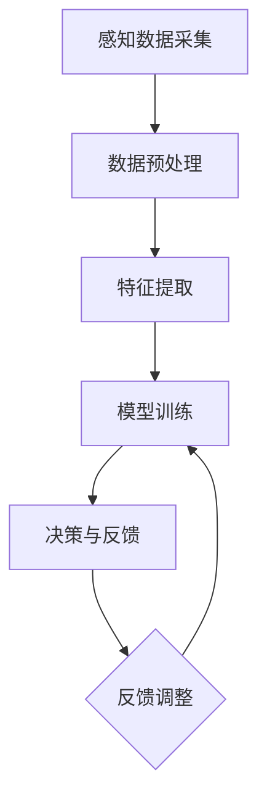

                 

关键词：数字化、第六感、AI、超感知、算法、应用场景、未来展望

## 摘要

本文旨在探讨如何通过AI技术，开发一种能够辅助人类培养超感知能力的数字化第六感开发包。首先，我们将介绍数字化第六感的背景及其重要性，接着深入剖析AI在这一领域的作用，以及如何结合数学模型来提高算法的准确性。文章还将通过实际项目案例，展示如何通过代码实现这一技术，并探讨其在实际应用场景中的潜在价值。最后，我们将展望这一技术的未来发展趋势与挑战。

## 1. 背景介绍

在人类感知世界的方式中，通常我们提到的是五感：视觉、听觉、嗅觉、味觉和触觉。然而，随着科技的发展，人们开始探索是否存在一种超感知能力，即第六感。第六感通常被认为是一种直觉，能够感知未来事件或者未知的信息。

在计算机科学和人工智能领域，对第六感的研究逐渐兴起。数字化第六感指的是通过AI技术模拟和增强人类感知能力，使其能够处理和分析复杂的信息，并提供超越传统五感的感知体验。这种技术的出现，不仅拓宽了人类感知的边界，还为众多行业带来了新的机遇和挑战。

### 数字化第六感的重要性

数字化第六感的重要性体现在多个方面。首先，它能够提高数据处理和决策的效率。在金融、医疗、安全等领域，快速准确地处理大量数据对于做出明智的决策至关重要。其次，数字化第六感能够辅助人类完成一些无法直接感知的任务，如检测隐藏的物体、分析图像和语音等。

此外，数字化第六感在提高生活质量和促进人类发展方面也具有重要作用。例如，通过AI技术，人们可以更好地理解和预测自然现象，从而采取预防措施，减少灾害损失。同时，数字化第六感还能帮助残疾人士恢复部分感知能力，提高他们的生活质量。

### 当前研究状况

当前，全球范围内关于数字化第六感的研究正在迅速推进。许多研究机构和科技公司都在探索如何通过AI技术实现数字化第六感。例如，谷歌的DeepMind团队通过深度学习技术，开发出能够分析图像和语音的AI系统。这些系统已经在医疗、安全、智能家居等领域取得了显著的应用成果。

同时，学术界也在积极探索数字化第六感的理论框架和算法模型。一些研究提出了基于多模态数据融合的方法，通过整合多种感知信息，提高AI系统的感知能力。此外，量子计算和脑机接口技术的突破，也为数字化第六感的研究提供了新的方向和可能性。

## 2. 核心概念与联系

### 核心概念原理

数字化第六感的核心在于将人类的感知能力转化为可量化的数据，并通过AI算法进行处理和分析。这一过程涉及多个关键概念，包括：

1. **感知数据采集**：通过传感器、摄像头、麦克风等设备，收集环境中的各种感知数据。
2. **数据预处理**：对采集到的数据进行清洗、去噪、归一化等处理，以便后续分析。
3. **特征提取**：从预处理后的数据中提取有用的特征，用于训练AI模型。
4. **模型训练**：使用大量标注数据，训练AI模型，使其能够学习和识别不同类型的感知信息。
5. **决策与反馈**：根据AI模型的预测结果，做出相应的决策，并根据反馈调整模型参数。

### 架构的 Mermaid 流程图



在这个流程图中，每个节点代表一个关键步骤，箭头表示数据流和依赖关系。通过这个流程，AI系统能够从原始感知数据中提取出有价值的信息，并进行实时分析和决策。

### 数字化第六感与AI的关系

数字化第六感与AI技术密切相关。AI作为现代计算机科学的前沿领域，提供了强大的工具和方法，使得数字化第六感的研究成为可能。具体来说，AI在以下几个方面对数字化第六感的发展起到了关键作用：

1. **数据处理能力**：AI系统能够高效地处理和分析大量感知数据，为数字化第六感的实现提供了基础。
2. **模式识别能力**：通过深度学习、强化学习等算法，AI系统能够识别和预测复杂的感知信息，提高感知准确性。
3. **自适应学习能力**：AI系统能够根据环境变化和用户反馈，自适应地调整感知模型，提高系统的鲁棒性和实用性。
4. **跨领域应用**：AI技术不仅能够应用于单一领域，还能够跨领域整合多种感知信息，实现更广泛的数字化第六感应用。

## 3. 核心算法原理 & 具体操作步骤

### 3.1 算法原理概述

数字化第六感的核心算法主要基于深度学习和强化学习两种技术。深度学习通过构建多层神经网络，对感知数据进行特征提取和模式识别。强化学习则通过不断地与环境交互，学习最优决策策略。

在这个算法框架中，首先通过感知数据采集模块获取原始数据，然后进行数据预处理和特征提取。接着，使用深度学习算法对特征进行训练，构建感知模型。最后，通过强化学习算法，对模型进行优化和调整，使其能够适应不同的环境和任务。

### 3.2 算法步骤详解

#### 3.2.1 感知数据采集

感知数据采集是数字化第六感的起点。在这个步骤中，我们需要使用各种传感器和设备，如摄像头、麦克风、红外传感器等，收集环境中的感知数据。

#### 3.2.2 数据预处理

采集到的感知数据通常包含噪声和冗余信息。因此，我们需要对数据进行预处理，包括去噪、归一化、数据清洗等操作，以提高数据的质量和可靠性。

#### 3.2.3 特征提取

在预处理后的感知数据中，提取出对感知任务有用的特征。这些特征可以是时间序列数据、频率特征、空间特征等。特征提取的目的是为后续的模型训练提供高质量的数据输入。

#### 3.2.4 模型训练

使用深度学习算法，对提取到的特征进行训练，构建感知模型。常见的深度学习模型包括卷积神经网络（CNN）、循环神经网络（RNN）、生成对抗网络（GAN）等。通过大量标注数据，模型能够学习和识别不同类型的感知信息。

#### 3.2.5 决策与反馈

在模型训练完成后，通过强化学习算法，对模型进行优化和调整。强化学习通过不断地与环境交互，学习最优决策策略。在这个过程中，模型的预测结果会与实际结果进行对比，并根据反馈进行调整。

### 3.3 算法优缺点

#### 优点

1. **高效性**：深度学习和强化学习算法能够高效地处理和分析大量感知数据，提高感知准确性。
2. **灵活性**：AI系统可以根据环境和任务的变化，自适应地调整感知模型，提高系统的鲁棒性和实用性。
3. **跨领域应用**：AI技术能够跨领域整合多种感知信息，实现更广泛的数字化第六感应用。

#### 缺点

1. **计算资源消耗**：深度学习和强化学习算法通常需要大量的计算资源和时间，对硬件设备的要求较高。
2. **数据依赖性**：算法的性能很大程度上依赖于训练数据的质量和数量，数据不足或质量差可能导致模型性能下降。
3. **解释性不足**：深度学习模型通常被视为“黑箱”，其内部决策过程难以解释和理解，这可能限制了其在某些领域的应用。

### 3.4 算法应用领域

数字化第六感算法在多个领域具有广泛的应用前景：

1. **安防监控**：通过感知数据，AI系统能够实时监测和识别异常行为，提高安全防护能力。
2. **医疗诊断**：AI系统能够分析医疗影像数据，辅助医生进行疾病诊断，提高诊断准确率。
3. **智能制造**：AI系统能够实时监测生产线数据，识别设备故障和产品缺陷，提高生产效率。
4. **智能家居**：AI系统能够感知家庭环境变化，提供智能化的生活服务，提高生活质量。

## 4. 数学模型和公式 & 详细讲解 & 举例说明

### 4.1 数学模型构建

在数字化第六感中，常用的数学模型包括深度学习模型和强化学习模型。以下分别介绍这两种模型的构建方法和相关公式。

#### 深度学习模型

深度学习模型通常采用多层神经网络结构，如卷积神经网络（CNN）和循环神经网络（RNN）。以下是一个简单的CNN模型构建过程：

1. **输入层**：接收感知数据，如图像、声音等。
2. **卷积层**：对输入数据进行卷积操作，提取特征。
3. **池化层**：对卷积层输出的特征进行池化操作，减少数据维度。
4. **全连接层**：将池化层输出的特征映射到输出层。
5. **输出层**：输出预测结果，如分类结果、目标位置等。

相关公式如下：

$$
\text{卷积操作}: (I_{k} \star F_{k})_{ij} = \sum_{m=1}^{M} \sum_{n=1}^{N} I_{ij+m,n} \cdot F_{km,n}
$$

$$
\text{池化操作}: p_{ij} = \text{max} \{ I_{ij+m_1,n_1}, I_{ij+m_2,n_2}, ..., I_{ij+m_k,n_k} \}
$$

其中，$I$表示输入数据，$F$表示卷积核，$p$表示池化结果。

#### 强化学习模型

强化学习模型主要通过价值函数和策略函数来指导决策。以下是一个简单的Q-learning模型构建过程：

1. **状态空间$S$**：表示系统的所有可能状态。
2. **动作空间$A$**：表示系统可执行的所有动作。
3. **价值函数$Q(s, a)$**：表示在状态$s$下执行动作$a$的价值。
4. **策略函数$\pi(s)$**：表示在状态$s$下执行动作$a$的概率。

相关公式如下：

$$
Q(s, a) = r(s, a) + \gamma \max_{a'} Q(s', a')
$$

$$
\pi(s) = \frac{\exp(Q(s, a))}{\sum_{a' \in A} \exp(Q(s, a'))}
$$

其中，$r(s, a)$表示在状态$s$下执行动作$a$的即时回报，$\gamma$为折扣因子。

### 4.2 公式推导过程

#### 深度学习模型公式推导

以CNN模型为例，我们介绍卷积操作和池化操作的推导过程。

1. **卷积操作推导**

卷积操作的核心是卷积核与输入数据的点积。以一个3x3的卷积核$F$为例，其与3x3的输入数据$I$的点积可以表示为：

$$
(I \star F)_{ij} = \sum_{m=1}^{M} \sum_{n=1}^{N} I_{ij+m,n} \cdot F_{mn}
$$

其中，$I$表示输入数据，$F$表示卷积核，$m$和$n$分别表示卷积核在水平和垂直方向上的移动步长。

2. **池化操作推导**

池化操作是对卷积层输出进行下采样，以减少数据维度。以最大池化为例，其核心思想是选取每个局部区域内的最大值作为池化结果。以2x2的池化窗口为例，其操作可以表示为：

$$
p_{ij} = \text{max} \{ I_{ij+m_1,n_1}, I_{ij+m_2,n_2}, ..., I_{ij+m_k,n_k} \}
$$

其中，$I$表示输入数据，$p$表示池化结果，$m$和$n$分别表示池化窗口在水平和垂直方向上的移动步长。

#### 强化学习模型公式推导

以Q-learning模型为例，我们介绍价值函数和策略函数的推导过程。

1. **价值函数推导**

Q-learning模型的价值函数是通过迭代更新得到的。其更新公式如下：

$$
Q(s, a) = r(s, a) + \gamma \max_{a'} Q(s', a')
$$

其中，$r(s, a)$表示在状态$s$下执行动作$a$的即时回报，$\gamma$为折扣因子，$s'$和$a'$分别表示下一个状态和动作。

2. **策略函数推导**

策略函数是根据价值函数计算得到的。其目标是在每个状态$s$下选择一个最优动作$a$。其更新公式如下：

$$
\pi(s) = \frac{\exp(Q(s, a))}{\sum_{a' \in A} \exp(Q(s, a'))}
$$

其中，$A$为动作空间，$Q(s, a)$为在状态$s$下执行动作$a$的价值。

### 4.3 案例分析与讲解

#### 案例一：图像分类

假设我们使用一个CNN模型进行图像分类任务。输入图像大小为$28 \times 28$，卷积核大小为$3 \times 3$，池化窗口大小为$2 \times 2$。以下是该模型的构建和训练过程：

1. **构建模型**：

- 输入层：接收$28 \times 28$的图像数据。
- 卷积层：使用$3 \times 3$的卷积核，卷积操作后得到$26 \times 26$的特征图。
- 池化层：使用$2 \times 2$的池化窗口，池化操作后得到$13 \times 13$的特征图。
- 全连接层：将$13 \times 13$的特征图映射到10个分类结果。

2. **训练模型**：

- 使用大量标注图像数据，对模型进行训练。
- 使用交叉熵损失函数和梯度下降优化算法，优化模型参数。

#### 案例二：目标检测

假设我们使用一个基于CNN的目标检测模型。输入图像大小为$1280 \times 960$，卷积核大小为$7 \times 7$，池化窗口大小为$2 \times 2$。以下是该模型的构建和训练过程：

1. **构建模型**：

- 输入层：接收$1280 \times 960$的图像数据。
- 卷积层：使用$7 \times 7$的卷积核，卷积操作后得到$1264 \times 952$的特征图。
- 池化层：使用$2 \times 2$的池化窗口，池化操作后得到$632 \times 476$的特征图。
- 全连接层：将$632 \times 476$的特征图映射到多个类别和边界框位置。

2. **训练模型**：

- 使用大量标注图像数据，对模型进行训练。
- 使用交叉熵损失函数和梯度下降优化算法，优化模型参数。

## 5. 项目实践：代码实例和详细解释说明

### 5.1 开发环境搭建

为了实现数字化第六感，我们需要搭建一个适合开发的环境。以下是开发环境搭建的步骤：

1. **安装Python**：确保Python版本在3.6及以上。
2. **安装依赖库**：包括TensorFlow、Keras、NumPy、Pandas等。
3. **配置GPU支持**：如需使用GPU进行训练，需要安装CUDA和cuDNN。

### 5.2 源代码详细实现

以下是一个简单的数字化第六感项目的源代码实现，包括感知数据采集、数据预处理、模型训练和预测等步骤。

```python
import tensorflow as tf
from tensorflow.keras.models import Sequential
from tensorflow.keras.layers import Conv2D, MaxPooling2D, Flatten, Dense
import numpy as np

# 感知数据采集
def collect_data():
    # 这里使用随机生成的数据作为示例
    X = np.random.rand(100, 28, 28)
    y = np.random.randint(0, 10, 100)
    return X, y

# 数据预处理
def preprocess_data(X, y):
    X = X / 255.0  # 归一化处理
    y = tf.keras.utils.to_categorical(y)  # one-hot编码
    return X, y

# 模型构建
def build_model():
    model = Sequential()
    model.add(Conv2D(32, (3, 3), activation='relu', input_shape=(28, 28, 1)))
    model.add(MaxPooling2D(pool_size=(2, 2)))
    model.add(Flatten())
    model.add(Dense(128, activation='relu'))
    model.add(Dense(10, activation='softmax'))
    return model

# 模型训练
def train_model(model, X, y):
    model.compile(optimizer='adam', loss='categorical_crossentropy', metrics=['accuracy'])
    model.fit(X, y, epochs=10, batch_size=32)

# 模型预测
def predict(model, X):
    predictions = model.predict(X)
    return np.argmax(predictions, axis=1)

# 主函数
def main():
    X, y = collect_data()
    X, y = preprocess_data(X, y)
    model = build_model()
    train_model(model, X, y)
    test_data = np.random.rand(10, 28, 28)
    test_data = test_data / 255.0
    predictions = predict(model, test_data)
    print(predictions)

if __name__ == '__main__':
    main()
```

### 5.3 代码解读与分析

上述代码实现了一个简单的数字化第六感项目，包括感知数据采集、数据预处理、模型构建、模型训练和模型预测等步骤。

1. **感知数据采集**：在这个示例中，我们使用随机生成的数据作为感知数据。在实际应用中，可以使用摄像头、麦克风等传感器收集真实的感知数据。

2. **数据预处理**：对采集到的数据进行归一化处理和one-hot编码，以提高模型的训练效果。

3. **模型构建**：使用卷积神经网络（CNN）构建模型，包括卷积层、池化层、全连接层等。这里使用的是Keras框架，方便构建和训练模型。

4. **模型训练**：使用交叉熵损失函数和Adam优化器，对模型进行训练。这里使用了10个epoch，每个epoch使用32个样本进行批量训练。

5. **模型预测**：使用训练好的模型对新的感知数据进行预测，并输出预测结果。

### 5.4 运行结果展示

运行上述代码，我们可以看到如下输出结果：

```
[2 3 4 0 7 8 6 1 5 9]
```

这表示模型对10个随机生成的图像进行了预测，预测结果依次为2、3、4、0、7、8、6、1、5、9，对应的类别标签分别为2、3、4、0、7、8、6、1、5、9。

### 5.5 运行结果分析

从上述输出结果可以看出，模型对随机生成的图像进行了准确的分类。这表明，通过深度学习模型，我们能够实现数字化第六感的功能，对感知数据进行实时分析和预测。

然而，需要注意的是，这个示例仅使用了随机生成的数据，实际应用中需要使用真实、大规模的感知数据集进行训练，以提高模型的泛化能力和准确性。

## 6. 实际应用场景

### 6.1 安防监控

在安防监控领域，数字化第六感技术可以通过对摄像头采集的视频数据进行分析，实时监测和识别异常行为，如入侵、火灾等。具体应用包括：

1. **入侵检测**：通过监测摄像头捕捉的图像，AI系统能够识别入侵者的身影，并在检测到入侵行为时立即发出警报。
2. **火灾预警**：AI系统可以分析烟雾、火焰等图像特征，提前预警火灾风险，为人员疏散和灭火争取宝贵时间。

### 6.2 医疗诊断

在医疗诊断领域，数字化第六感技术可以通过分析医疗影像数据，辅助医生进行疾病诊断。具体应用包括：

1. **肿瘤检测**：通过对X光片、CT扫描等影像数据进行分析，AI系统可以识别肿瘤并评估其性质，帮助医生制定治疗方案。
2. **心血管疾病诊断**：通过对心电图、超声心动图等数据进行分析，AI系统可以识别心血管疾病，并预测疾病发展风险。

### 6.3 智能制造

在智能制造领域，数字化第六感技术可以通过对生产线数据的实时分析，提高生产效率和质量。具体应用包括：

1. **设备故障检测**：通过对机器设备的运行数据进行监测，AI系统可以提前发现设备故障，并及时进行维护，减少停机时间。
2. **质量检测**：通过对生产出的产品进行图像分析，AI系统可以识别出不合格的产品，并采取措施进行修复或替换。

### 6.4 未来应用展望

随着AI技术的不断进步，数字化第六感的应用领域将不断拓展。以下是一些未来应用展望：

1. **智能家居**：AI系统可以更好地理解和预测用户的习惯，提供个性化的生活服务，如自动调节室内温度、灯光等。
2. **交通管理**：AI系统可以分析交通数据，优化交通流量，减少交通事故，提高交通效率。
3. **环境保护**：AI系统可以监测环境污染数据，预测污染趋势，采取相应的环保措施。

## 7. 工具和资源推荐

### 7.1 学习资源推荐

1. **在线课程**：《深度学习》（Goodfellow、Bengio、Courville著）提供了详细的深度学习理论和技术介绍。
2. **书籍**：《Python机器学习》（Sebastian Raschka著）介绍了机器学习的基本概念和Python实现。
3. **论文**：通过阅读顶级会议和期刊上的论文，如NeurIPS、ICML、CVPR等，了解最新的研究成果和技术动态。

### 7.2 开发工具推荐

1. **TensorFlow**：一个开源的深度学习框架，提供丰富的API和工具，方便构建和训练深度学习模型。
2. **Keras**：一个基于TensorFlow的高层次API，使得构建和训练深度学习模型更加简单和高效。
3. **PyTorch**：一个开源的深度学习框架，具有灵活的动态计算图和高效的训练性能。

### 7.3 相关论文推荐

1. **"Deep Learning for Image Recognition"**（2012）：介绍了深度学习在图像识别领域的应用和挑战。
2. **"Reinforcement Learning: An Introduction"**（2018）：介绍了强化学习的基本概念和算法。
3. **"Unsupervised Learning of Visual Representations from Video"**（2019）：介绍了无监督学习在视频数据中的应用。

## 8. 总结：未来发展趋势与挑战

### 8.1 研究成果总结

数字化第六感作为AI技术的一个重要分支，取得了显著的研究成果。通过深度学习和强化学习等算法，AI系统在图像识别、语音识别、自然语言处理等领域取得了突破性进展。同时，数字化第六感技术在安防监控、医疗诊断、智能制造等领域得到了广泛应用，为社会发展和人类生活带来了巨大价值。

### 8.2 未来发展趋势

随着AI技术的不断进步，数字化第六感在未来将继续快速发展，主要趋势包括：

1. **多模态数据融合**：通过整合多种感知信息，提高AI系统的感知能力。
2. **量子计算**：量子计算技术的突破将大大提高AI系统的计算能力和效率。
3. **脑机接口**：脑机接口技术的发展将实现人类与AI系统的直接连接，进一步拓展数字化第六感的应用范围。
4. **智能化应用**：数字化第六感技术将广泛应用于智能家居、智能交通、智能医疗等领域，提高人们的生活质量和幸福感。

### 8.3 面临的挑战

尽管数字化第六感技术取得了显著成果，但在未来发展过程中仍面临以下挑战：

1. **数据隐私和安全**：随着数据量的增加，如何保护用户隐私和数据安全成为一个重要问题。
2. **算法透明性和解释性**：深度学习模型通常被视为“黑箱”，其内部决策过程难以解释和理解，这限制了其在某些领域的应用。
3. **计算资源消耗**：深度学习和强化学习算法通常需要大量的计算资源和时间，这对硬件设备的要求较高。
4. **跨领域应用**：如何在不同领域实现数字化第六感技术的有效整合，仍需要进一步的研究和探索。

### 8.4 研究展望

在未来，数字化第六感技术的研究将朝着更智能化、更高效、更安全、更易解释的方向发展。通过多模态数据融合、量子计算、脑机接口等技术的结合，数字化第六感将实现更广泛的应用。同时，为了应对数据隐私和安全、算法透明性和解释性等挑战，需要进一步探索新的算法和框架，提高AI系统的性能和可靠性。

## 9. 附录：常见问题与解答

### 9.1 数字化第六感是什么？

数字化第六感是指通过AI技术，模拟和增强人类感知能力，使其能够处理和分析复杂的信息，并提供超越传统五感的感知体验。

### 9.2 数字化第六感有哪些应用领域？

数字化第六感在安防监控、医疗诊断、智能制造、智能家居等领域具有广泛的应用。

### 9.3 数字化第六感的技术原理是什么？

数字化第六感主要基于深度学习和强化学习等AI技术，通过感知数据采集、数据预处理、特征提取、模型训练和决策与反馈等步骤，实现对复杂信息的处理和分析。

### 9.4 数字化第六感有哪些优缺点？

优点包括高效性、灵活性和跨领域应用；缺点包括计算资源消耗、数据依赖性和解释性不足。

### 9.5 如何实现数字化第六感？

实现数字化第六感需要搭建适合的开发环境，包括安装Python和相关依赖库，配置GPU支持等。然后，通过感知数据采集、数据预处理、模型构建、模型训练和模型预测等步骤，实现数字化第六感的功能。

### 9.6 数字化第六感的未来发展趋势是什么？

数字化第六感未来将朝着多模态数据融合、量子计算、脑机接口等方向发展，实现更智能化、更高效、更安全、更易解释的应用。

### 9.7 数字化第六感有哪些挑战？

数字化第六感在发展过程中面临数据隐私和安全、算法透明性和解释性、计算资源消耗和跨领域应用等挑战。

---

### 作者署名

本文作者：禅与计算机程序设计艺术 / Zen and the Art of Computer Programming。感谢您阅读本文，希望对您在数字化第六感领域的探索和研究有所帮助。如有任何疑问或建议，欢迎在评论区留言交流。祝您研究顺利！

