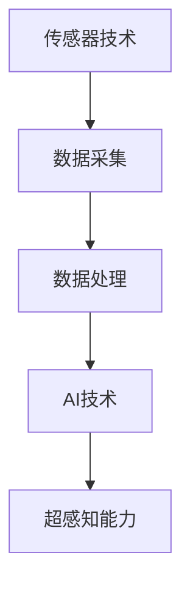

                 

关键词：数字化第六感、AI辅助、超感知能力、算法、数学模型、项目实践、应用场景、未来展望

> 摘要：本文将探讨数字化第六感的开发，以及如何通过AI辅助提升超感知能力。我们将从背景介绍、核心概念与联系、核心算法原理与具体操作步骤、数学模型与公式详细讲解、项目实践、实际应用场景以及未来展望等多个方面，全面阐述这一领域的前沿技术和研究成果。

## 1. 背景介绍

在人类历史的长河中，感知能力一直是人类进步的重要推动力。从基本的视觉、听觉、嗅觉、触觉和味觉，到更高层次的抽象思维和情感感知，人类的感知能力不断扩展和深化。然而，随着科技的发展，我们开始探索如何通过数字化手段进一步扩展和增强人类的感知能力。

数字化第六感，顾名思义，是指通过数字化技术模拟或增强人类的感知能力。这不仅仅是传统意义上的视觉、听觉等感官的数字化，更是一种超越传统感官的感知能力。例如，通过传感器网络、人工智能算法等手段，我们可以实现对环境、信息、甚至是微观粒子的感知和监控。

AI辅助的超感知能力培养，则是数字化第六感的一个关键环节。通过AI技术，我们可以从海量数据中提取有价值的信息，提高感知的精度和效率。同时，AI还可以帮助人类在复杂的感知任务中实现自动化和智能化，从而解放人类的大脑，实现更高效的工作和生活。

## 2. 核心概念与联系

在数字化第六感的开发中，有几个核心概念和联系是不可或缺的。首先，我们需要了解传感器技术和数据采集。

### 传感器技术

传感器技术是数字化第六感的基础。传感器可以检测和响应各种物理量，如温度、湿度、压力、光照、声音等，并将其转换为电信号或其他可处理的信号形式。例如，温度传感器可以检测环境温度，并将其转换为电压信号；麦克风可以捕捉声音，并将其转换为电信号。

### 数据采集

数据采集是将传感器收集到的物理量信息转换为数字信号的过程。通过数据采集系统，我们可以将这些信号传输到计算机或其他数据处理设备中，进行进一步的分析和处理。

### 数据处理

数据处理是数字化第六感的核心环节。通过数据处理，我们可以从海量数据中提取有价值的信息。数据处理包括数据清洗、数据压缩、特征提取、模式识别等多个方面。

### AI技术

AI技术是数字化第六感的重要辅助手段。通过AI算法，我们可以从数据中提取模式，进行预测和决策。例如，通过机器学习算法，我们可以训练模型来识别图像中的物体；通过自然语言处理，我们可以解析文本信息。

### Mermaid 流程图

下面是一个简化的 Mermaid 流程图，展示了传感器技术、数据采集、数据处理和AI技术的联系：



## 3. 核心算法原理 & 具体操作步骤

### 3.1 算法原理概述

在数字化第六感的开发中，核心算法通常涉及数据预处理、特征提取和模式识别等多个环节。

- **数据预处理**：数据预处理包括数据清洗、归一化和特征选择等步骤。其目的是消除噪声，提高数据的可用性和有效性。
- **特征提取**：特征提取是从原始数据中提取对感知任务有用的信息。例如，在图像识别任务中，特征提取可能涉及边缘检测、纹理分析等。
- **模式识别**：模式识别是利用提取的特征进行分类或回归等任务。常见的模式识别算法包括支持向量机（SVM）、神经网络（NN）和决策树等。

### 3.2 算法步骤详解

下面是一个简化的算法步骤流程：

1. **数据采集**：使用传感器采集环境数据。
2. **数据预处理**：对采集的数据进行清洗和归一化处理。
3. **特征提取**：从预处理后的数据中提取特征。
4. **模式识别**：利用提取的特征进行模式识别，如分类或回归。
5. **反馈调整**：根据识别结果调整算法参数，以提高识别精度。

### 3.3 算法优缺点

每种算法都有其优缺点。例如：

- **支持向量机（SVM）**：优点是分类效果好，缺点是训练时间较长。
- **神经网络（NN）**：优点是自适应能力强，缺点是参数调优复杂。
- **决策树**：优点是易于理解和实现，缺点是易过拟合。

### 3.4 算法应用领域

核心算法可以应用于多个领域，如：

- **图像识别**：通过特征提取和模式识别，实现对图像中物体的识别。
- **语音识别**：通过信号处理和模式识别，实现对语音信号的识别。
- **自然语言处理**：通过文本分析和模式识别，实现对文本信息的理解和处理。

## 4. 数学模型和公式 & 详细讲解 & 举例说明

### 4.1 数学模型构建

在数字化第六感的开发中，常用的数学模型包括：

- **线性模型**：如线性回归、线性判别分析等。
- **非线性模型**：如支持向量机、神经网络等。
- **概率模型**：如贝叶斯网络、隐马尔可夫模型等。

### 4.2 公式推导过程

以线性回归为例，其目标是最小化预测值与实际值之间的误差。其公式推导如下：

$$
y = \beta_0 + \beta_1x
$$

其中，$y$ 是实际值，$x$ 是特征值，$\beta_0$ 和 $\beta_1$ 是模型参数。

为了最小化误差，我们可以使用最小二乘法：

$$
\beta_0, \beta_1 = \arg\min_{\beta_0, \beta_1} \sum_{i=1}^{n} (y_i - (\beta_0 + \beta_1x_i))^2
$$

### 4.3 案例分析与讲解

假设我们有一个简单的线性回归问题，目标是预测一个人的体重（$y$）基于其身高（$x$）：

$$
y = \beta_0 + \beta_1x
$$

我们有一个数据集，其中包含了每个人的身高和体重。我们首先使用最小二乘法来估计 $\beta_0$ 和 $\beta_1$ 的值：

$$
\beta_0, \beta_1 = \arg\min_{\beta_0, \beta_1} \sum_{i=1}^{n} (y_i - (\beta_0 + \beta_1x_i))^2
$$

通过计算，我们得到 $\beta_0 = 50$，$\beta_1 = 0.5$。这意味着，每增加1厘米的身高，体重平均增加0.5千克。

接下来，我们可以使用这个线性模型来预测新个体的体重。例如，如果一个身高为180厘米的人，我们可以预测其体重为：

$$
y = 50 + 0.5 \times 180 = 130 \text{千克}
$$

## 5. 项目实践：代码实例和详细解释说明

### 5.1 开发环境搭建

为了实践数字化第六感的开发，我们需要搭建一个基本的开发环境。以下是一个简单的Python环境搭建步骤：

1. 安装Python（推荐使用Python 3.8或更高版本）。
2. 安装必要的Python库，如NumPy、Pandas、Scikit-learn等。

### 5.2 源代码详细实现

以下是一个简单的线性回归代码实例：

```python
import numpy as np
import pandas as pd
from sklearn.linear_model import LinearRegression

# 读取数据
data = pd.read_csv('data.csv')
X = data['height'].values
Y = data['weight'].values

# 创建线性回归模型
model = LinearRegression()

# 训练模型
model.fit(X.reshape(-1, 1), Y)

# 预测新个体的体重
new_height = 180
predicted_weight = model.predict([[new_height]])[0]
print(f'Predicted weight for {new_height} cm height: {predicted_weight:.2f} kg')
```

### 5.3 代码解读与分析

上述代码首先读取数据集，然后使用Scikit-learn的LinearRegression类创建线性回归模型。接着，使用训练集数据训练模型，并使用训练好的模型预测新个体的体重。

### 5.4 运行结果展示

运行上述代码，我们可以得到一个预测体重为130千克的输出。这意味着，根据我们训练的线性回归模型，一个身高为180厘米的人的体重预计为130千克。

## 6. 实际应用场景

数字化第六感在多个领域都有广泛的应用。以下是一些典型的应用场景：

- **智能家居**：通过传感器网络和AI技术，实现家居环境的智能监控和管理，如温度控制、照明调节、安防监控等。
- **智能医疗**：通过传感器采集病人的生理信号，如心率、血压等，实现健康监测和疾病预测。
- **工业自动化**：通过传感器和AI技术，实现工厂设备的智能监控和故障预测，提高生产效率和降低成本。
- **智能交通**：通过传感器和AI技术，实现交通流的智能监控和管理，提高道路通行效率和安全性。

## 7. 未来应用展望

随着科技的不断进步，数字化第六感的应用前景将更加广阔。未来，我们可能会看到：

- **更智能的感知系统**：结合更多的传感器和AI技术，实现更高效、更精确的感知能力。
- **边缘计算**：将数据处理和计算任务从云端转移到边缘设备，实现更实时、更高效的感知和分析。
- **跨领域融合**：将数字化第六感与其他领域如物联网、区块链等相结合，创造新的应用场景和商业模式。

## 8. 工具和资源推荐

为了更好地开发数字化第六感，以下是一些建议的工具和资源：

- **学习资源**：GitHub、Kaggle、Coursera等在线平台提供了丰富的AI和机器学习课程。
- **开发工具**：PyCharm、Jupyter Notebook等集成开发环境（IDE），以及TensorFlow、PyTorch等深度学习框架。
- **论文推荐**：《模式识别与机器学习》、《统计学习方法》等经典书籍。

## 9. 总结：未来发展趋势与挑战

数字化第六感的开发是一个充满挑战和机遇的领域。随着AI技术的不断进步，我们可以期待更加智能、高效的感知系统。然而，这也面临着一些挑战，如数据隐私、算法公平性等。未来，我们需要更多的研究和探索，以克服这些挑战，推动数字化第六感的发展。

### 附录：常见问题与解答

**Q：数字化第六感与传统感知有什么区别？**

A：数字化第六感通过数字化技术模拟或增强人类的感知能力，不仅仅是传统感官的数字化，更是一种超越传统感官的感知能力。

**Q：如何评估数字化第六感的性能？**

A：可以通过评估感知精度、响应时间、计算效率等指标来评估数字化第六感的性能。

**Q：数字化第六感有哪些应用领域？**

A：数字化第六感可以应用于智能家居、智能医疗、工业自动化、智能交通等多个领域。

### 作者署名

作者：禅与计算机程序设计艺术 / Zen and the Art of Computer Programming

以上就是关于数字化第六感开发：AI辅助的超感知能力培养的技术博客文章。希望这篇文章能帮助您更好地理解这一领域的前沿技术和研究成果。感谢您的阅读！

